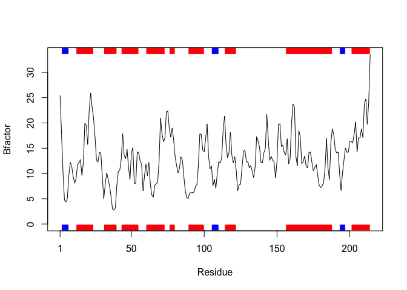
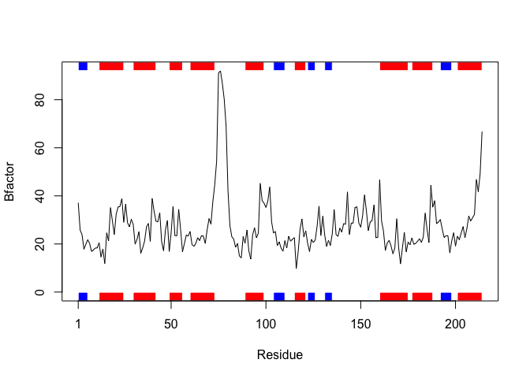

Homework\_Lecture\_6
================
Rachel Ng
January 27, 2020

Function input: Input is a single element character vector containing the name of the PDB file to be read, or the four letter PDB identifier for online file access.
--------------------------------------------------------------------------------------------------------------------------------------------------------------------

This function will return a plot of affinity of a drug to a certain region of the protein inputted.
---------------------------------------------------------------------------------------------------

``` r
library(bio3d)

interaction <- function(x) {
  # forming a variable containing list of class pdb
  s1 <- read.pdb(x)
  #forming smaller PDB object, containing a subset of atoms
  s1.chainA <- trim.pdb(s1, chain = "A", elety = "CA")
  
  s1.b <- s1.chainA$atom$b
  
 #call to plot
  plotb3(s1.b, sse=s1.chainA, typ="l", ylab="Bfactor", helix.col = "red", sheet.col = "blue")
  
}
```

Output is a standard scatter plot with marginal regions indicating secondary strucutre of the protein: red for an a-helix and blue for a b-sheet.
-------------------------------------------------------------------------------------------------------------------------------------------------

Example 1: Kinase with drug
---------------------------

``` r
library(bio3d)

interaction("1E4Y")
```

    ##   Note: Accessing on-line PDB file



Example 2: Kinase with no drug
------------------------------

``` r
library(bio3d)

interaction("1AKE")
```

    ##   Note: Accessing on-line PDB file
    ##    PDB has ALT records, taking A only, rm.alt=TRUE


