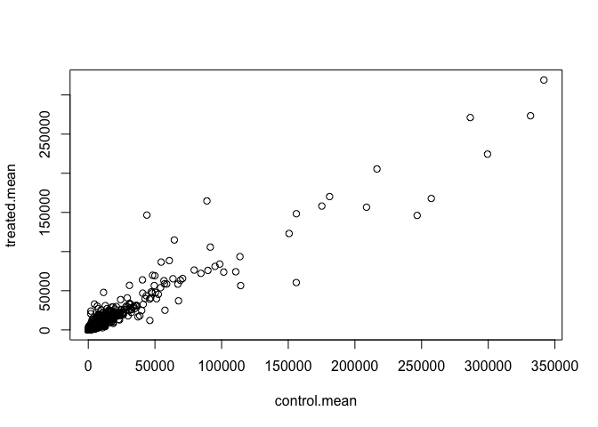
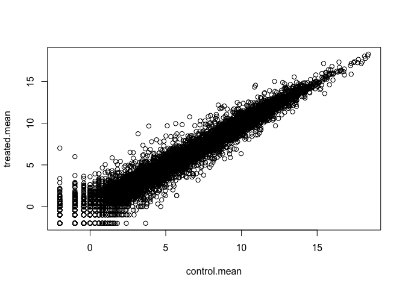
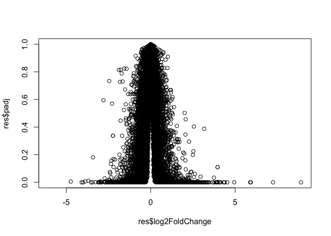
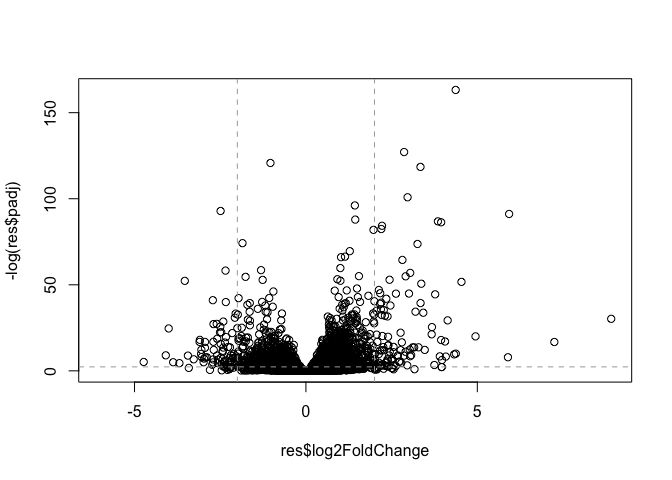
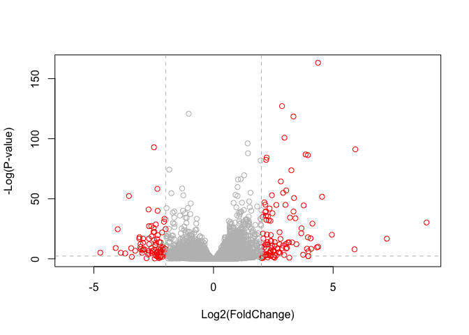

Transcriptomics and the analysis of RNA-Seq data
================
Rachel Ng
February 20, 2020

Import today's data
-------------------

Glucocorticoids inhibit inflammatory processes and are often used to treat asthma because of their anti-inflammatory effects on airway smooth muscle (ASM) cells. SNPs in CRISPLD2 in previous GWAS associated with inhaled corticosteroid resistance/bronchodilator response in asthma patients Today, our starting point is a count matrix: each cell indicates number of reads originating from a particular gene (in rows) for each sample (in columns)

``` r
counts <- read.csv("airway_scaledcounts.csv", stringsAsFactors = F)
metadata <- read.csv("airway_metadata.csv", stringsAsFactors = F)
```

Ultimately, we are asking: Does the drug change transcription?
--------------------------------------------------------------

How many genes are we dealing with?

``` r
nrow(counts)
```

    ## [1] 38694

We want to calculate the average counter per gene for control samples and for the drug treated samples.Then, we will compare these averages to see if there is a significant difference.

Now I want to access the control only data in the metadata

``` r
#give you the IDs of the control samples
metadata$id[metadata$dex == "control"]
```

    ## [1] "SRR1039508" "SRR1039512" "SRR1039516" "SRR1039520"

``` r
#metadata[metadata$dex == "control", ]$id

#define control as control samples
control <- metadata[metadata[,"dex"]=="control",]
control
```

    ##           id     dex celltype     geo_id
    ## 1 SRR1039508 control   N61311 GSM1275862
    ## 3 SRR1039512 control  N052611 GSM1275866
    ## 5 SRR1039516 control  N080611 GSM1275870
    ## 7 SRR1039520 control  N061011 GSM1275874

Now use the $id of the control data to access control columns in counts and calc average

``` r
control.mean <- rowSums(counts[ ,control$id]/nrow(control))
```

### Now for the treated samples...

``` r
treated <- metadata[metadata$dex == "treated" , ]
treated
```

    ##           id     dex celltype     geo_id
    ## 2 SRR1039509 treated   N61311 GSM1275863
    ## 4 SRR1039513 treated  N052611 GSM1275867
    ## 6 SRR1039517 treated  N080611 GSM1275871
    ## 8 SRR1039521 treated  N061011 GSM1275875

``` r
treated.mean <- rowSums (counts[, treated$id] ) /nrow(treated)
```

We will combine our meancount for bookeeping purposes.

``` r
meancounts <- data.frame(control.mean, treated.mean)
meancounts
```

    ##       control.mean treated.mean
    ## 1           900.75       658.00
    ## 2             0.00         0.00
    ## 3           520.50       546.00
    ## 4           339.75       316.50
    ## 5            97.25        78.75
    ## 6             0.75         0.00
    ## 7          5219.00      6687.50
    ## 8          2327.00      1785.75
    ## 9           755.75       578.00
    ## 10          527.75       348.25
    ## 11          226.75       185.50
    ## 12         3169.50      2701.25
    ## 13          589.50       519.50
    ## 14          110.50       106.75
    ## 15          695.25       543.50
    ## 16           11.25         8.00
    ## 17         2146.00      1679.75
    ## 18         1117.50       895.75
    ## 19          936.00       826.00
    ## 20          251.25       173.50
    ## 21            2.25         3.25
    ## 22          735.00       678.50
    ## 23         1249.25      1256.75
    ## 24         8802.75      8456.50
    ## 25            1.75         2.25
    ## 26            1.25         1.75
    ## 27            9.75         4.75
    ## 28          125.00       126.00
    ## 29          385.25       348.00
    ## 30         7889.00      9618.25
    ## 31          237.50       270.75
    ## 32          498.75       527.50
    ## 33         1962.25      1769.00
    ## 34          581.25       268.25
    ## 35          149.25        61.25
    ## 36            9.00        10.00
    ## 37          146.50       101.00
    ## 38          900.00       896.00
    ## 39          107.00        79.00
    ## 40         2244.25      4612.50
    ## 41         6153.75      4372.50
    ## 42          338.25       285.75
    ## 43         3384.25      2724.50
    ## 44           24.25        36.25
    ## 45           33.75        52.25
    ## 46         1562.75      1867.50
    ## 47          341.00       293.50
    ## 48         1498.50      1527.50
    ## 49         4037.50      3593.00
    ## 50         1376.50      1215.00
    ## 51            5.50         6.25
    ## 52          664.00       603.75
    ## 53         1510.25      1080.00
    ## 54         1563.50      1129.00
    ## 55          100.00        60.75
    ## 56         1390.00      1673.00
    ## 57          550.50       461.50
    ## 58        13843.75     11041.50
    ## 59          126.25        80.50
    ## 60          380.75       374.25
    ## 61          270.50      1429.25
    ## 62            1.50         1.25
    ## 63           23.00        11.00
    ## 64           35.75        10.25
    ## 65            0.00         0.25
    ## 66          158.75       153.75
    ## 67          686.75       405.00
    ## 68         1894.75      1552.25
    ## 69           11.50         7.00
    ## 70            0.00         0.00
    ## 71          499.25       401.25
    ## 72         1199.75       854.50
    ## 73            0.00         0.00
    ## 74         2255.50      2410.00
    ## 75          779.50       745.50
    ## 76         1430.75      1230.50
    ## 77          211.25       212.25
    ## 78            0.75         0.25
    ## 79          640.25       631.75
    ## 80          481.50       546.50
    ## 81            1.00         0.00
    ## 82            9.00        16.25
    ## 83          347.25       248.25
    ## 84          399.50       328.00
    ## 85           31.50        22.00
    ## 86           96.25        62.50
    ## 87          476.00       476.25
    ## 88          711.25       713.75
    ## 89          815.00       644.25
    ## 90         1093.75       899.00
    ## 91          250.50       344.25
    ## 92          472.25       488.25
    ## 93         2897.25      2516.00
    ## 94          160.00       163.50
    ## 95            4.50         9.00
    ## 96            0.25         0.00
    ## 97          305.25       307.50
    ## 98          228.00       257.75
    ## 99          490.25       375.75
    ## 100          48.75        18.50
    ## 101        1994.75      1873.75
    ## 102         968.75       821.00
    ## 103           5.50         3.25
    ## 104         641.00       553.00
    ## 105         258.75       195.00
    ## 106        3123.00      2719.25
    ## 107        1365.50      1616.25
    ## 108           4.50         2.00
    ## 109        1192.00       984.50
    ## 110        1232.00      1447.75
    ## 111         839.25       816.25
    ## 112        5427.25      5032.25
    ## 113          13.50         7.50
    ## 114           8.00         5.00
    ## 115        2644.00      2705.50
    ## 116         412.50       362.75
    ## 117         151.50       165.75
    ## 118         209.00       114.75
    ## 119        3365.00      3136.75
    ## 120           0.75         0.50
    ## 121           0.00         0.00
    ## 122         333.75       201.75
    ## 123           0.00         0.00
    ## 124           0.75         0.25
    ## 125         592.25       365.00
    ## 126        7030.25      6700.75
    ## 127           0.25         1.00
    ## 128         570.25       567.25
    ## 129          11.25        20.50
    ## 130        1533.25      1318.75
    ## 131          90.25        40.00
    ## 132         660.75       610.50
    ## 133           0.00         0.25
    ## 134           8.25         6.00
    ## 135        1410.00       866.00
    ## 136         248.25       187.00
    ## 137         436.25       384.50
    ## 138         211.25       214.00
    ## 139         298.75       280.50
    ## 140        1073.25      1346.25
    ## 141           6.00         3.75
    ## 142        1311.00       882.00
    ## 143           5.25         3.75
    ## 144         815.50      1102.50
    ## 145           0.00         0.00
    ## 146         198.75       175.25
    ## 147         112.00        72.75
    ## 148          79.50        49.50
    ## 149        1185.25      1089.00
    ## 150           1.75         1.25
    ## 151         183.00       194.25
    ## 152         315.75       274.75
    ## 153        1302.75       999.25
    ## 154        2495.25      2091.75
    ## 155          46.00        43.25
    ## 156         931.50      1013.00
    ## 157          27.25        31.50
    ## 158         585.25       523.25
    ## 159         182.00       165.25
    ## 160           2.75        19.75
    ## 161        1075.00      1148.25
    ## 162          84.50        65.50
    ## 163           2.50         1.75
    ## 164           0.75         1.00
    ## 165         891.75       793.50
    ## 166           3.25         2.00
    ## 167         655.75       725.00
    ## 168           0.00         0.00
    ## 169        4213.00      3992.00
    ## 170           1.75         1.25
    ## 171           2.50         2.75
    ## 172        6982.00      6563.50
    ## 173           0.00         0.00
    ## 174         549.25       290.75
    ## 175         125.75       135.50
    ## 176           3.00         3.00
    ## 177           0.00         0.00
    ## 178           1.75         2.00
    ## 179           1.00         0.50
    ## 180         278.50       309.50
    ## 181           0.00         0.00
    ## 182          38.75        43.75
    ## 183         265.50       270.50
    ## 184        1887.00      1853.00
    ## 185         761.75       644.25
    ## 186          18.75        26.25
    ## 187          12.75         9.25
    ## 188         604.50       599.00
    ## 189         645.75       698.00
    ## 190         632.50       638.25
    ## 191        1410.50      1855.50
    ## 192           0.00         0.00
    ## 193        1066.75       964.75
    ## 194         871.75       770.00
    ## 195         437.50       286.75
    ## 196           8.00        13.00
    ## 197           4.00         4.00
    ## 198        1596.75      1484.50
    ## 199          14.75        20.75
    ## 200         272.25       353.50
    ## 201         426.50       354.00
    ## 202           9.75         4.75
    ## 203         563.00       549.75
    ## 204        1319.25      2093.00
    ## 205           1.75         0.50
    ## 206           0.00         0.00
    ## 207           8.75         7.50
    ## 208        2458.00      5247.00
    ## 209          20.25        17.50
    ## 210        1898.25      2080.50
    ## 211         557.00       529.50
    ## 212        3317.25      2724.75
    ## 213          86.25       109.00
    ## 214         475.25       929.00
    ## 215          10.25        13.00
    ## 216         103.75       137.75
    ## 217         163.50       169.25
    ## 218        4053.00      3946.50
    ## 219         292.75       284.75
    ## 220           0.50         2.75
    ## 221       12969.25      9544.25
    ## 222        2022.50      1313.50
    ## 223          27.00        24.00
    ## 224         162.50        77.00
    ## 225        4750.75      5727.00
    ## 226          18.25        21.00
    ## 227        1248.25      1145.00
    ## 228         793.25       936.00
    ## 229         739.50       720.25
    ## 230        5380.50      5338.50
    ## 231       11842.25     10446.00
    ## 232       17268.25     15369.25
    ## 233        2132.00      2218.00
    ## 234        6053.50     10538.75
    ## 235           6.25        13.25
    ## 236           0.00         0.00
    ## 237          48.00        31.75
    ## 238           5.50        16.50
    ## 239         160.50       192.00
    ## 240           5.50         6.25
    ## 241         441.50       438.50
    ## 242         970.50       831.25
    ## 243           5.75         7.75
    ## 244        3183.25      2835.75
    ## 245        1781.75      2606.00
    ## 246          21.75        12.00
    ## 247         199.00       158.25
    ## 248        1015.25       838.25
    ## 249         278.75       215.00
    ## 250        2863.25      2784.75
    ## 251        1628.25      2082.25
    ## 252         834.50       754.50
    ## 253        3249.75      4328.75
    ## 254           0.00         0.00
    ## 255        1319.50      1222.00
    ## 256        1310.25      1109.50
    ## 257          25.75        16.25
    ## 258          74.50        73.25
    ## 259           0.50         2.00
    ## 260        3015.50      2323.75
    ## 261           1.50         0.50
    ## 262         249.50       246.50
    ## 263           1.75         0.50
    ## 264        2923.75      3068.75
    ## 265          18.25        20.00
    ## 266         152.50       144.00
    ## 267          71.75        54.75
    ## 268         174.75       129.25
    ## 269           0.75         0.25
    ## 270         543.00       412.75
    ## 271         815.00       757.50
    ## 272        1827.25      1689.75
    ## 273        1820.00      1309.00
    ## 274          25.50        29.50
    ## 275        1371.75      1393.75
    ## 276         486.75       483.50
    ## 277         727.75       662.00
    ## 278       19624.75     14996.75
    ## 279         287.25       196.00
    ## 280           0.50         0.25
    ## 281        3505.50      3807.50
    ## 282         635.25       630.00
    ## 283         233.75       215.50
    ## 284         188.25       138.50
    ## 285         801.50      1517.50
    ## 286           0.75         0.25
    ## 287         885.75       709.00
    ## 288         436.50       319.00
    ## 289         405.75       423.25
    ## 290        1849.25      1691.25
    ## 291         430.75       423.25
    ## 292        3398.25      4033.75
    ## 293          14.75        22.25
    ## 294         204.25       107.25
    ## 295         455.00       418.00
    ## 296        1492.00      1729.00
    ## 297         403.75       389.50
    ## 298         281.50       220.25
    ## 299        1529.50      1495.25
    ## 300        2157.25      2569.50
    ## 301      331697.00    273445.50
    ## 302         119.50       182.50
    ## 303         901.00      1205.00
    ## 304         858.00       874.25
    ## 305        1116.25      1815.75
    ## 306           4.00         2.75
    ## 307           1.75         1.50
    ## 308         864.00       865.50
    ## 309           0.50         2.25
    ## 310         378.50       129.25
    ## 311        1245.25      1118.50
    ## 312           3.75         1.25
    ## 313        1683.50       919.25
    ## 314         765.25       754.50
    ## 315         125.25       134.75
    ## 316           0.75         2.00
    ## 317        1327.00      1325.50
    ## 318           0.00         0.25
    ## 319        2189.50      2657.25
    ## 320           0.00         0.25
    ## 321         778.75       643.50
    ## 322        5672.75      6851.25
    ## 323         366.75       319.75
    ## 324        2301.00      1979.50
    ## 325        1701.50      2308.25
    ## 326         473.00       502.25
    ## 327        3350.25      3259.25
    ## 328         376.75       122.00
    ## 329        5568.00      1514.75
    ## 330        1060.50       990.25
    ## 331        8592.50      8505.00
    ## 332        1569.25      1496.00
    ## 333        1648.25      1217.25
    ## 334         269.25       205.75
    ## 335        2537.50      2856.75
    ## 336         333.00       281.25
    ## 337         455.25       319.25
    ## 338         918.50      1014.25
    ## 339         596.75       545.00
    ## 340         269.00       204.00
    ## 341        1369.50      1611.50
    ## 342         701.50       543.50
    ## 343        1047.00      1231.50
    ## 344           8.50         7.50
    ## 345          91.25        99.00
    ## 346         975.75       824.25
    ## 347         204.25       142.00
    ## 348         471.25       444.00
    ## 349        3381.50      3822.50
    ## 350          23.25        13.25
    ## 351        1640.00      1418.75
    ## 352        1330.25      1418.00
    ## 353         666.25       469.75
    ## 354         699.00       555.75
    ## 355           2.75         4.75
    ## 356         255.50       249.00
    ## 357        2409.00      2108.75
    ## 358           7.00         5.25
    ## 359           0.50         3.00
    ## 360         368.50       332.50
    ## 361        6074.75      4394.50
    ## 362          32.00         6.00
    ## 363         713.25       679.75
    ## 364         182.50       132.75
    ## 365           0.50         2.25
    ## 366        1735.00      1544.50
    ## 367           0.25         0.00
    ## 368         155.00        62.25
    ## 369          15.25         5.50
    ## 370           0.50         0.25
    ## 371           0.25         0.00
    ## 372        1654.00      1529.75
    ## 373        3271.00      2569.25
    ## 374         920.75       682.00
    ## 375         611.00       320.50
    ## 376        2937.75      3948.75
    ## 377        1129.00       858.00
    ## 378          60.25        43.25
    ## 379          17.00        17.00
    ## 380        2914.25      2931.00
    ## 381         840.00       826.50
    ## 382           0.25         0.00
    ## 383         318.00       258.25
    ## 384        1092.50       377.50
    ## 385         281.75       267.75
    ## 386          63.75        58.75
    ## 387           5.75         9.25
    ## 388        3287.25      3868.00
    ## 389           0.00         0.50
    ## 390          26.50         1.75
    ## 391         280.00       358.75
    ## 392           1.25         1.50
    ## 393        3054.50      3075.75
    ## 394          55.75        34.00
    ## 395        1773.50       832.00
    ## 396        1556.25      2798.50
    ## 397        1324.00       913.75
    ## 398       11392.75      8666.00
    ## 399           0.50         0.00
    ## 400         379.50       284.75
    ## 401         253.25       240.75
    ## 402        2014.00      4303.50
    ## 403          86.25       103.00
    ## 404         537.50       546.50
    ## 405          20.00        13.00
    ## 406         562.25       717.75
    ## 407           3.25         3.00
    ## 408           4.25         2.75
    ## 409         533.00       497.50
    ## 410          21.75        55.00
    ## 411        1231.50      1626.75
    ## 412        1362.25      1415.50
    ## 413         379.50       281.25
    ## 414           0.00         0.00
    ## 415        9314.50     11955.25
    ## 416        2153.50      2121.25
    ## 417           0.00         0.00
    ## 418           4.25         2.50
    ## 419         158.75       161.50
    ## 420        2759.00      2786.00
    ## 421         194.25       167.00
    ## 422         677.00       694.00
    ## 423         129.25        78.50
    ## 424        2482.00      2436.00
    ## 425        1803.00      1853.25
    ## 426        2860.50      2910.00
    ## 427        1390.75      1504.50
    ## 428        1139.75       885.75
    ## 429          61.25        59.25
    ## 430        2043.00      1841.25
    ## 431          93.25       100.00
    ## 432         335.00       485.00
    ## 433         478.00       508.75
    ## 434        1957.25      2165.25
    ## 435          16.00        24.75
    ## 436           6.25         5.50
    ## 437         658.00       828.00
    ## 438        1221.25      2747.00
    ## 439        1364.50      1380.50
    ## 440       11539.50     12507.50
    ## 441          23.50        17.50
    ## 442         229.00       224.00
    ## 443           9.00         9.50
    ## 444         293.25       230.75
    ## 445        1615.25      1515.00
    ## 446         295.00        54.25
    ## 447         402.50       401.00
    ## 448         114.00       297.00
    ## 449         383.75       321.75
    ## 450         982.00       640.75
    ## 451        3879.00      3429.25
    ## 452        2180.00      2201.00
    ## 453      110608.00     74238.00
    ## 454         250.25       151.25
    ## 455        1210.00      1122.00
    ## 456         266.75       189.75
    ## 457       26231.50     20689.25
    ## 458          32.25        21.25
    ## 459         429.50       327.75
    ## 460           0.75         2.00
    ## 461         955.75       486.75
    ## 462         699.75       496.00
    ## 463          80.25       121.50
    ## 464           1.00         0.25
    ## 465        1331.25      1573.50
    ## 466         472.25       433.75
    ## 467           0.50         0.25
    ## 468         278.25       276.50
    ## 469         405.25       661.75
    ## 470        1301.75      1141.25
    ## 471          88.25        22.00
    ## 472         619.50       584.25
    ## 473        3785.25      3444.25
    ## 474         540.00       447.75
    ## 475         372.50       318.00
    ## 476        3714.50      3101.25
    ## 477        1564.25      1333.75
    ## 478         105.50        87.50
    ## 479           1.25         0.25
    ## 480         119.00       115.50
    ## 481        2063.25      1900.75
    ## 482         740.75       517.75
    ## 483         992.25       908.25
    ## 484         184.75       190.75
    ## 485          32.50        27.25
    ## 486         213.75       270.25
    ## 487       12420.25     10056.75
    ## 488        1498.00      1383.50
    ## 489         456.75       262.50
    ## 490          86.50        86.50
    ## 491        3590.75      2258.50
    ## 492        2004.50      1269.00
    ## 493         730.50       612.25
    ## 494         226.25       212.75
    ## 495        1522.00      1558.75
    ## 496         304.50       171.25
    ## 497         567.00       514.50
    ## 498         414.50       390.25
    ## 499        1224.75      1425.50
    ## 500        2486.50      2449.50
    ## 501          10.25         6.75
    ## 502        1814.50      1315.00
    ## 503        1161.25       841.50
    ## 504        1205.50      1424.25
    ## 505         871.25      1084.75
    ## 506        1071.25      1025.00
    ## 507        3367.75      1522.25
    ## 508          33.25        36.25
    ## 509         901.00      1435.50
    ## 510          11.00         7.50
    ## 511       14673.75     12363.75
    ## 512         161.50        91.75
    ## 513         865.75       849.00
    ## 514         418.50       261.75
    ## 515        1303.50      1519.75
    ## 516         474.25       392.25
    ## 517         591.50       375.50
    ## 518         369.75       398.50
    ## 519       12770.25     21024.00
    ## 520          17.75         9.25
    ## 521         395.00      1039.00
    ## 522        1248.50       895.00
    ## 523        1004.25       805.25
    ## 524           0.00         0.00
    ## 525       58821.00     58635.75
    ## 526        1124.25       991.00
    ## 527        1236.25      1327.00
    ## 528        1889.75      1680.50
    ## 529           4.75         5.50
    ## 530           0.25         0.00
    ## 531          49.00        39.75
    ## 532         916.75       838.75
    ## 533           3.00         4.25
    ## 534          15.00        20.75
    ## 535           0.00         0.00
    ## 536         480.25       398.00
    ## 537         286.75       332.00
    ## 538          11.25        11.00
    ## 539         803.25       805.75
    ## 540         608.75       661.50
    ## 541         460.25       492.25
    ## 542         364.25       364.00
    ## 543         109.25        70.25
    ## 544          23.25        21.00
    ## 545         712.75       524.25
    ## 546         368.25       353.75
    ## 547        2522.25      2400.75
    ## 548        1492.75      1939.75
    ## 549          13.25         7.00
    ## 550        1090.25      1028.00
    ## 551        6787.25      5733.75
    ## 552       11054.25      8237.50
    ## 553         776.25       558.25
    ## 554         202.25       120.75
    ## 555          10.00         6.75
    ## 556        1544.75      1237.25
    ## 557         247.00       231.75
    ## 558        1249.25      1043.25
    ## 559        1797.25      1838.75
    ## 560          10.50        40.25
    ## 561        4653.25      6243.25
    ## 562           3.50         4.75
    ## 563         373.50       314.00
    ## 564           2.75         2.25
    ## 565         319.75       369.25
    ## 566         270.50       189.50
    ## 567         814.75       673.75
    ## 568         230.25       257.75
    ## 569         563.50       544.75
    ## 570           2.50         0.75
    ## 571         941.50       742.75
    ## 572         116.50        29.75
    ## 573         765.50       700.75
    ## 574         115.75        34.25
    ## 575        1358.50      1174.25
    ## 576           2.50         7.50
    ## 577         586.25       592.00
    ## 578         391.25       365.50
    ## 579        4931.00      2529.00
    ## 580         209.50       183.50
    ## 581        1476.50      1599.00
    ## 582         253.00       168.50
    ## 583         489.00       735.50
    ## 584           3.25         6.50
    ## 585         242.50       180.25
    ## 586         417.25       459.75
    ## 587        1503.00      1350.25
    ## 588        1048.00       958.75
    ## 589        1165.25      1276.00
    ## 590           4.75         3.25
    ## 591           0.00         0.00
    ## 592          37.25        39.50
    ## 593          11.75        23.75
    ## 594           1.25         1.50
    ## 595         728.50       668.75
    ## 596        1492.75      1683.50
    ## 597           0.00         0.00
    ## 598           0.00         0.00
    ## 599         265.00       219.00
    ## 600           1.00         2.00
    ## 601           0.00         0.00
    ## 602        1511.75      1024.75
    ## 603        8465.00      8037.00
    ## 604         419.75       465.50
    ## 605         594.00       443.25
    ## 606          51.25        46.00
    ## 607       16004.75     17619.00
    ## 608          41.25        22.00
    ## 609         346.75       338.75
    ## 610         585.00       559.50
    ## 611         323.00      2126.50
    ## 612           0.75         0.50
    ## 613          61.50        25.25
    ## 614         516.25       573.75
    ## 615         715.00       739.50
    ## 616         341.50       302.75
    ## 617         890.00       834.00
    ## 618        2555.50      2354.75
    ## 619         806.25       685.25
    ## 620          65.25        36.25
    ## 621        5134.50      4503.75
    ## 622          17.00        17.75
    ## 623         926.25       801.25
    ## 624         244.00       240.75
    ## 625           0.75         1.50
    ## 626           8.75        13.75
    ## 627         514.50       323.00
    ## 628         439.50       470.25
    ## 629        1476.50      1762.75
    ## 630         484.50       447.75
    ## 631           6.25         7.75
    ## 632       16617.50     16989.25
    ## 633        1732.25      1386.75
    ## 634           1.75         1.50
    ## 635         537.50       592.75
    ## 636         482.25       310.50
    ## 637         895.00       987.25
    ## 638         171.25       220.25
    ## 639         992.25       739.00
    ## 640        1547.50      1356.50
    ## 641         343.00       401.50
    ## 642           0.50         0.50
    ## 643        1920.75      2364.25
    ## 644          43.00        87.25
    ## 645         782.75       688.75
    ## 646           8.25         2.25
    ## 647        1744.00      1611.25
    ## 648        2546.00      4023.75
    ## 649        4300.75      7068.00
    ## 650        4403.00      4333.50
    ## 651         631.00       461.00
    ## 652          98.50        47.00
    ## 653        3269.25      3000.50
    ## 654         191.50       145.25
    ## 655         188.75       144.75
    ## 656        5652.00      6696.25
    ## 657        3417.25      3434.25
    ## 658         405.00        93.00
    ## 659           1.25         0.25
    ## 660          26.00        24.25
    ## 661          16.75         7.50
    ## 662       16639.50     24518.50
    ## 663        6573.50      5924.25
    ## 664        5546.00      9276.00
    ## 665         166.25       118.75
    ## 666        1949.75      1653.00
    ## 667        1134.00      1325.00
    ## 668        1990.50       902.50
    ## 669           2.25         4.25
    ## 670         104.50        78.75
    ## 671        4768.25      4431.75
    ## 672         402.75       319.25
    ## 673           0.00         0.25
    ## 674        1071.25      1002.75
    ## 675       17283.25     18895.75
    ## 676         370.75       320.50
    ## 677         229.25       274.50
    ## 678         549.25       596.00
    ## 679        9929.50      8270.25
    ## 680        1020.50       850.75
    ## 681         124.25       106.75
    ## 682          91.00       100.50
    ## 683         386.25       303.25
    ## 684           9.75         5.50
    ## 685         992.25       829.50
    ## 686           0.00         1.50
    ## 687        1196.50      1280.00
    ## 688         445.50       445.50
    ## 689        1906.75      2791.25
    ## 690        1108.50       881.50
    ## 691          31.25        55.50
    ## 692          31.25        18.75
    ## 693         348.25       390.50
    ## 694         642.75       759.75
    ## 695         173.75       166.75
    ## 696        1067.75      1364.75
    ## 697         281.50       194.50
    ## 698        1741.00      1285.25
    ## 699           2.25         0.25
    ## 700         685.00       792.50
    ## 701         395.50       326.25
    ## 702         581.00       612.25
    ## 703         345.00       286.50
    ## 704        2704.00      2101.25
    ## 705          19.50         7.25
    ## 706           4.00         3.25
    ## 707        3584.25      4456.50
    ## 708          14.00         5.75
    ## 709         946.00       905.00
    ## 710         352.00       370.25
    ## 711          45.50        34.50
    ## 712         332.50       274.75
    ## 713          43.75        56.75
    ## 714          45.50        29.50
    ## 715         806.00      1724.50
    ## 716         722.75       688.50
    ## 717         573.00       534.75
    ## 718           0.50         0.00
    ## 719         751.50       734.75
    ## 720        3102.50      2674.50
    ## 721         986.25       800.50
    ## 722           3.00         0.25
    ## 723          32.75        67.25
    ## 724        1274.75      1037.75
    ## 725         321.25       470.50
    ## 726         249.75       222.00
    ## 727          26.75        11.75
    ## 728          55.75        44.75
    ## 729        1640.50      1656.75
    ## 730         536.75       465.50
    ## 731         647.50       596.25
    ## 732        1806.25      1660.00
    ## 733          25.25        13.50
    ## 734        3191.50      3402.25
    ## 735           0.25         0.00
    ## 736           0.00         0.00
    ## 737         136.50        55.50
    ## 738        2176.50      1566.75
    ## 739          17.25        21.50
    ## 740         694.25       717.75
    ## 741         519.50       544.75
    ## 742        3674.75      4071.50
    ## 743          21.50         9.00
    ## 744        1268.00      1443.75
    ## 745         553.25       528.00
    ## 746         385.50       207.75
    ## 747        1736.25      1684.00
    ## 748        2295.25      2496.25
    ## 749        2280.00      1812.50
    ## 750         855.00       845.00
    ## 751        2308.75      1931.25
    ## 752         123.25        89.75
    ## 753          97.00        34.00
    ## 754        2324.75      2344.75
    ## 755         754.00       646.25
    ## 756          19.00        16.50
    ## 757           0.00         3.25
    ## 758         348.25       281.50
    ## 759        3085.00      3155.50
    ## 760         191.00       140.25
    ## 761           0.50         0.00
    ## 762           0.00         0.00
    ## 763         208.25       223.75
    ## 764        1354.75      1495.50
    ## 765         107.00        52.00
    ## 766         502.50       572.50
    ## 767         257.25       308.75
    ## 768        2905.00      2453.75
    ## 769           0.00         0.00
    ## 770        1032.00      1472.75
    ## 771          12.75        20.00
    ## 772           4.50         2.50
    ## 773           6.50         5.50
    ## 774        3588.25      3248.75
    ## 775         160.50       261.75
    ## 776         531.25       632.50
    ## 777          20.25        27.00
    ## 778         543.25       471.25
    ## 779         999.00       733.25
    ## 780         457.00       469.25
    ## 781        1667.00      1837.25
    ## 782          55.75        94.75
    ## 783        1491.50      1278.00
    ## 784       12534.75      9486.00
    ## 785        1756.50      1930.75
    ## 786           3.50         3.50
    ## 787           4.25         1.50
    ## 788         640.25       652.75
    ## 789         520.25       508.75
    ## 790       12119.50     10693.25
    ## 791        4413.25      4034.25
    ## 792         457.25       338.00
    ## 793         423.50       522.50
    ## 794         276.50       245.25
    ## 795           6.75         2.50
    ## 796        1334.00      1151.25
    ## 797         573.50       644.25
    ## 798          16.50        16.00
    ## 799         260.75       236.75
    ## 800        1739.75      1262.75
    ## 801         414.25       309.75
    ## 802         389.50       308.50
    ## 803         208.25       179.00
    ## 804        1034.25       697.50
    ## 805         306.00       318.75
    ## 806        1262.00      1240.50
    ## 807         179.25       135.25
    ## 808         465.25       509.75
    ## 809        4401.25      5441.75
    ## 810           2.50         2.50
    ## 811        6097.00      5237.25
    ## 812           0.00         0.00
    ## 813        1724.50      1585.00
    ## 814         971.75       966.00
    ## 815           0.50         0.00
    ## 816           0.25         0.00
    ## 817         289.50       336.50
    ## 818         420.50       422.00
    ## 819         498.25       462.00
    ## 820           0.50         0.25
    ## 821         129.25       508.50
    ## 822        1121.50      1045.00
    ## 823         272.25       330.25
    ## 824         790.50       725.50
    ## 825        2791.50      2495.25
    ## 826        2677.75      3708.25
    ## 827          98.75        47.25
    ## 828        1147.25       801.75
    ## 829           0.00         0.00
    ## 830          81.25       111.00
    ## 831        5454.75      6203.00
    ## 832         556.50       609.50
    ## 833        1745.75      1483.00
    ## 834         880.75       767.50
    ## 835         592.50       463.00
    ## 836        1536.25      1227.75
    ## 837           8.25         5.25
    ## 838           1.50         1.50
    ## 839        1213.25       994.00
    ## 840          35.00        25.50
    ## 841         174.75       153.75
    ## 842        2036.50      1760.50
    ## 843           2.00         2.00
    ## 844         691.50       602.25
    ## 845        1217.50      1242.25
    ## 846        1139.25      1183.50
    ## 847        2824.00      3568.00
    ## 848        1934.50      1720.50
    ## 849         163.75       130.25
    ## 850           2.50         2.25
    ## 851       14520.25     12634.25
    ## 852          33.50        22.50
    ## 853         264.75       288.00
    ## 854         314.50       292.75
    ## 855        8800.75      7695.25
    ## 856         149.25        89.75
    ## 857         402.00       367.00
    ## 858        2241.25      1908.25
    ## 859        2392.25      2491.25
    ## 860        1521.00      1274.75
    ## 861         814.00       578.50
    ## 862           0.00         0.00
    ## 863         568.50       675.75
    ## 864         781.75       701.25
    ## 865        5604.50      3907.75
    ## 866         120.75        99.25
    ## 867         378.25       364.25
    ## 868        1246.75      1138.25
    ## 869         395.50       295.00
    ## 870         429.50       449.25
    ## 871         415.50       376.75
    ## 872        1074.75      1875.50
    ## 873           0.00         0.00
    ## 874         204.75       198.00
    ## 875          30.00         6.50
    ## 876        2733.00      1321.00
    ## 877           0.00         0.00
    ## 878          46.00        31.50
    ## 879           7.25         6.75
    ## 880           1.50         2.50
    ## 881         618.25       206.00
    ## 882         829.00       794.25
    ## 883        2242.50      3246.00
    ## 884        1457.25      1272.50
    ## 885         110.50        96.25
    ## 886         384.75       366.00
    ## 887         327.50       304.50
    ## 888          43.50        38.25
    ## 889       11122.00      8430.25
    ## 890        1749.75      1482.50
    ## 891         540.75       501.00
    ## 892         265.50       295.25
    ## 893         104.25       123.00
    ## 894        7533.50     12102.50
    ## 895         199.75       123.00
    ## 896          94.75        25.75
    ## 897         317.00       375.25
    ## 898        2141.25      2155.25
    ## 899         274.25       336.25
    ## 900          11.75         4.00
    ## 901           0.00         0.25
    ## 902        1433.00      1310.00
    ## 903         579.25       552.50
    ## 904         406.50       547.25
    ## 905        1155.25      1269.25
    ## 906          44.25        41.25
    ## 907         278.00       267.25
    ## 908         709.50       717.25
    ## 909        4389.25      3813.00
    ## 910         487.00       426.75
    ## 911         964.00       901.25
    ## 912         128.50       115.75
    ## 913         431.25       366.75
    ## 914        1973.50      1932.50
    ## 915        4815.75      3984.75
    ## 916        3001.50      2842.50
    ## 917         548.75       549.25
    ## 918        1491.75      1391.75
    ## 919         269.00       310.75
    ## 920        9972.50     10580.50
    ## 921        3726.50      4665.00
    ## 922           4.75         7.25
    ## 923          10.75        11.75
    ## 924        1041.50       942.25
    ## 925          28.25        24.50
    ## 926           0.25         0.50
    ## 927         307.50       172.00
    ## 928        1992.50      1952.00
    ## 929         285.00       232.00
    ## 930         850.50       676.50
    ## 931         388.00       272.50
    ## 932         863.00       683.75
    ## 933        1205.00      1766.25
    ## 934       19881.75     20522.00
    ## 935        1020.00       894.25
    ## 936         633.50       634.00
    ## 937         110.75        78.00
    ## 938           0.75         0.25
    ## 939        1881.00      1644.50
    ## 940         372.75       412.50
    ## 941           4.75         1.25
    ## 942          99.00        87.50
    ## 943         178.25       116.00
    ## 944           0.50         1.25
    ## 945         195.00       300.50
    ## 946        1170.75      1359.00
    ## 947        3443.50      1458.25
    ## 948         902.50       521.00
    ## 949         758.25       907.50
    ## 950        1176.50      1266.50
    ## 951         693.75       673.25
    ## 952        1309.00      1006.25
    ## 953         802.25       745.25
    ## 954       11348.75      9865.00
    ## 955         713.25       769.75
    ## 956         720.50       769.25
    ## 957           2.25         4.25
    ## 958        1138.75      1090.50
    ## 959           6.00         8.75
    ## 960        1124.50       881.75
    ## 961         856.25       853.50
    ## 962        1238.00       913.00
    ## 963         500.25       386.75
    ## 964          22.25        12.00
    ## 965         153.50       118.25
    ## 966           3.00         2.50
    ## 967         166.25        90.25
    ## 968           8.50         5.50
    ## 969         924.00      1185.75
    ## 970           1.25         0.75
    ## 971          20.50        16.25
    ## 972          24.25        14.75
    ## 973          30.50        23.00
    ## 974         633.00       486.25
    ## 975         742.00       619.50
    ## 976        1472.25      1373.25
    ## 977          52.50        11.50
    ## 978         334.25       303.75
    ## 979         314.75       280.75
    ## 980        2947.50      3085.50
    ## 981         247.75       206.75
    ## 982         819.00       734.25
    ## 983        1082.00       607.00
    ## 984           4.00         2.25
    ## 985        1630.75      1230.25
    ## 986        1649.25      1647.50
    ## 987          16.50        17.25
    ## 988         256.75       215.25
    ## 989         318.50       317.75
    ## 990         205.00       191.25
    ## 991         565.50       463.00
    ## 992        1139.25      1194.75
    ## 993        1043.00      1019.50
    ## 994        2305.25      2452.75
    ## 995         432.50       378.25
    ## 996        2290.00      2042.75
    ## 997        2327.25      4253.75
    ## 998        2424.00      1151.75
    ## 999        1286.50       933.00
    ## 1000      12205.75     17269.25
    ## 1001        379.25       617.00
    ## 1002       4177.50      3837.75
    ## 1003        158.25       171.75
    ## 1004        753.50       733.25
    ## 1005        416.75       311.25
    ## 1006      26249.75     19373.00
    ## 1007       1317.25      1177.75
    ## 1008        902.25       902.25
    ## 1009        377.25       364.75
    ## 1010       2805.25      1552.75
    ## 1011        910.75       470.75
    ## 1012        285.25       279.00
    ## 1013       9739.00      9712.00
    ## 1014       1132.50      1094.00
    ## 1015         14.50        12.50
    ## 1016         17.75        14.75
    ## 1017        286.50       380.00
    ## 1018       2873.75      2913.25
    ## 1019         14.00        18.75
    ## 1020        381.50       951.50
    ## 1021        867.50       752.50
    ## 1022        209.75       188.75
    ## 1023         17.25        14.75
    ## 1024          5.00         1.25
    ## 1025       2369.00      3059.25
    ## 1026        561.50       644.75
    ## 1027         59.00        70.25
    ## 1028        753.25       596.00
    ## 1029        596.50       580.50
    ## 1030        674.00       841.00
    ## 1031          8.00        14.25
    ## 1032        368.00       427.50
    ## 1033        421.00       388.00
    ## 1034        850.75       918.50
    ## 1035        414.00       398.00
    ## 1036       1546.50      2025.50
    ## 1037       1448.75      1478.50
    ## 1038       2401.75      2017.50
    ## 1039        325.50       272.50
    ## 1040       4613.75      3405.25
    ## 1041        860.00      1852.00
    ## 1042        352.00       324.50
    ## 1043        670.75       594.25
    ## 1044        419.75       401.25
    ## 1045        115.50        84.50
    ## 1046          0.25         0.25
    ## 1047       1068.50      1003.25
    ## 1048       1191.50      1244.25
    ## 1049       9795.75      7494.25
    ## 1050       1150.00       952.00
    ## 1051        953.25       675.25
    ## 1052         90.25       148.00
    ## 1053        356.50       222.25
    ## 1054        654.75       557.25
    ## 1055         46.00       139.50
    ## 1056       1502.00      1610.50
    ## 1057       1990.50      1260.50
    ## 1058        632.50       545.25
    ## 1059       1951.50      1959.75
    ## 1060        499.25       486.25
    ## 1061         36.00        21.25
    ## 1062          0.00         0.00
    ## 1063        112.25        77.00
    ## 1064          0.00         0.00
    ## 1065       1040.75       693.25
    ## 1066          5.75        11.75
    ## 1067         18.00        34.00
    ## 1068          0.00         0.00
    ## 1069       1110.00      1218.25
    ## 1070       6981.75      5260.00
    ## 1071       3480.00      2697.00
    ## 1072       1344.00      1267.00
    ## 1073        463.75       303.25
    ## 1074        187.75       216.50
    ## 1075        824.75      1449.25
    ## 1076          7.50         3.75
    ## 1077        126.00       135.00
    ## 1078        159.25       160.50
    ## 1079        255.25       524.50
    ## 1080        529.75       662.50
    ## 1081          3.75         2.50
    ## 1082       4146.75      3784.00
    ## 1083        177.25       177.25
    ## 1084          2.25         2.25
    ## 1085          8.50         7.25
    ## 1086       1831.00      1763.25
    ## 1087       1486.75      1445.00
    ## 1088        320.50       285.75
    ## 1089       1019.75       851.25
    ## 1090        844.75       734.75
    ## 1091        683.50       752.50
    ## 1092        363.50       592.75
    ## 1093        807.25       817.75
    ## 1094       1118.75       794.50
    ## 1095          3.75         2.75
    ## 1096          1.00         1.25
    ## 1097        303.00       481.50
    ## 1098       1101.75       880.75
    ## 1099       2070.25      1350.25
    ## 1100       2986.00      2126.50
    ## 1101         87.00       104.25
    ## 1102          3.00         6.50
    ## 1103          0.50         3.00
    ## 1104        203.00        78.00
    ## 1105       3540.00      3818.00
    ## 1106        552.25       420.50
    ## 1107       1781.00      1289.25
    ## 1108       1672.50      1522.00
    ## 1109        204.00       243.00
    ## 1110          3.50        17.50
    ## 1111        887.25      2605.50
    ## 1112       2506.50      2362.00
    ## 1113        299.25       356.50
    ## 1114        854.00       871.00
    ## 1115        352.50       401.50
    ## 1116        275.25       331.50
    ## 1117        139.25       101.50
    ## 1118          0.75         0.50
    ## 1119       3587.00      6111.50
    ## 1120          2.50         3.25
    ## 1121        769.25       875.00
    ## 1122       7882.25      8750.00
    ## 1123        610.25       267.00
    ## 1124        497.50       319.00
    ## 1125          3.50         1.50
    ## 1126        457.50       444.25
    ## 1127          0.00         0.00
    ## 1128      20813.75     18630.50
    ## 1129        122.00        83.00
    ## 1130        367.25       302.75
    ## 1131       1505.25      1270.75
    ## 1132       1607.75      1547.50
    ## 1133        315.25       265.50
    ## 1134         41.75        11.25
    ## 1135        856.75       691.00
    ## 1136       3727.50      3518.75
    ## 1137       1708.25       717.75
    ## 1138          0.00         0.00
    ## 1139          1.25         1.25
    ## 1140        203.50       191.00
    ## 1141       1462.75      1981.00
    ## 1142          0.25         0.25
    ## 1143        568.25       564.50
    ## 1144      13802.25     11537.50
    ## 1145         14.75         7.00
    ## 1146      11587.50     10711.25
    ## 1147       8003.50     12750.25
    ## 1148       1410.25      1123.00
    ## 1149          0.00         0.00
    ## 1150        797.00       991.00
    ## 1151       8504.25     15047.50
    ## 1152        155.25       142.00
    ## 1153        389.50       324.25
    ## 1154       2178.25      5858.25
    ## 1155        814.25       695.75
    ## 1156       5622.00      5952.50
    ## 1157         64.25        49.00
    ## 1158       1767.50      1607.25
    ## 1159       1540.00      1045.00
    ## 1160        446.50       337.50
    ## 1161       1011.25      1115.50
    ## 1162       1486.50      1276.25
    ## 1163          0.00         0.00
    ## 1164       1021.75       741.25
    ## 1165       1387.50      1509.25
    ## 1166        724.25       773.00
    ## 1167       1688.50      1678.75
    ## 1168         24.75        19.25
    ## 1169      30753.00     32835.25
    ## 1170          2.25         1.50
    ## 1171        666.00       667.25
    ## 1172         59.75        57.75
    ## 1173        931.75       905.50
    ## 1174       1795.00      1512.75
    ## 1175        502.00       359.75
    ## 1176         12.25         8.50
    ## 1177      11617.25     15404.00
    ## 1178       1338.50       850.00
    ## 1179        327.50       226.25
    ## 1180       1083.75      1299.00
    ## 1181        371.50       452.25
    ## 1182        422.00       927.25
    ## 1183          2.00         0.25
    ## 1184       1442.50      1042.00
    ## 1185        228.50       263.00
    ## 1186       1395.50       586.00
    ## 1187       4318.00      4899.25
    ## 1188       2174.00      1103.00
    ## 1189          4.75         1.50
    ## 1190       3816.75      3459.00
    ## 1191        579.50       585.00
    ## 1192        945.50       740.00
    ## 1193        785.50       807.00
    ## 1194       1434.25      1159.00
    ## 1195        473.25       519.75
    ## 1196        449.75       394.50
    ## 1197         24.75        53.25
    ## 1198        562.25       499.25
    ## 1199       1631.00      1438.75
    ## 1200       4744.50      3496.00
    ## 1201          2.25         0.50
    ## 1202        592.50       578.25
    ## 1203        326.75       313.00
    ## 1204       3532.75      3353.75
    ## 1205        714.75       790.75
    ## 1206       1813.50      1555.75
    ## 1207         65.25        58.25
    ## 1208        610.25       488.00
    ## 1209       3312.50      2751.75
    ## 1210        704.75       651.50
    ## 1211          7.50         6.75
    ## 1212        162.75       183.25
    ## 1213       5114.75      6456.25
    ## 1214         79.50        65.25
    ## 1215       1530.50      3007.00
    ## 1216       2040.50      1407.00
    ## 1217        499.75       398.25
    ## 1218        397.50       272.00
    ## 1219          1.50         1.50
    ## 1220        218.00       124.00
    ## 1221        122.00        57.75
    ## 1222         79.00        57.00
    ## 1223        421.25       548.50
    ## 1224          2.50         1.50
    ## 1225        715.75       473.75
    ## 1226          4.50         3.50
    ## 1227        716.50       653.75
    ## 1228        542.75       622.00
    ## 1229        414.50       306.75
    ## 1230       2338.00      2150.75
    ## 1231       3532.00      2653.00
    ## 1232          2.25         1.75
    ## 1233        221.50       167.00
    ## 1234       1761.25      1587.25
    ## 1235         43.25        30.00
    ## 1236        904.50       674.25
    ## 1237       3284.75      4671.00
    ## 1238          0.00         0.00
    ## 1239          0.00         1.00
    ## 1240          0.25         0.75
    ## 1241        111.00        41.00
    ## 1242       1899.25      3252.25
    ## 1243        293.25       282.25
    ## 1244         31.25        25.25
    ## 1245          0.00         0.00
    ## 1246          0.00         0.25
    ## 1247       1245.75      1788.75
    ## 1248       3891.00      4119.00
    ## 1249        530.00       461.50
    ## 1250        458.25       313.75
    ## 1251       1672.25      1688.50
    ## 1252        573.00       551.75
    ## 1253        743.25      1152.75
    ## 1254       1260.75       978.50
    ## 1255          8.50        19.50
    ## 1256        778.75       418.75
    ## 1257        250.50       220.25
    ## 1258          7.75         3.50
    ## 1259          0.25         1.75
    ## 1260       1060.25      1186.00
    ## 1261       1125.25      1024.00
    ## 1262         73.25        66.25
    ## 1263       4070.25      2287.25
    ## 1264       3932.75      5155.75
    ## 1265       3030.25      5054.50
    ## 1266        347.25       327.00
    ## 1267        273.75       581.25
    ## 1268       1367.00      1340.00
    ## 1269        507.00       495.25
    ## 1270       3294.25      2859.75
    ## 1271         10.50        21.50
    ## 1272       4382.25      3402.75
    ## 1273       2349.25      1919.75
    ## 1274         33.75        29.50
    ## 1275       1952.25      1917.00
    ## 1276          0.00         0.00
    ## 1277      13533.75     16449.00
    ## 1278         19.50         9.25
    ## 1279       1519.50      1599.00
    ## 1280        193.75       134.50
    ## 1281        360.75       207.75
    ## 1282        779.25       759.50
    ## 1283          4.75         3.00
    ## 1284          0.50         0.50
    ## 1285          0.00         0.00
    ## 1286          9.25         5.50
    ## 1287        303.50       258.50
    ## 1288        107.75        61.75
    ## 1289       1355.50      1622.25
    ## 1290       3906.25      3230.25
    ## 1291        511.50       393.25
    ## 1292       1105.75       437.50
    ## 1293         16.75        18.00
    ## 1294       3681.50      2727.75
    ## 1295        484.50       567.25
    ## 1296       1158.00      1152.50
    ## 1297        799.50       372.50
    ## 1298         13.75         5.25
    ## 1299          2.00         0.25
    ## 1300       2069.50      1938.25
    ## 1301        275.00       203.50
    ## 1302        324.25       264.00
    ## 1303          8.00         1.25
    ## 1304          0.00         0.00
    ## 1305        882.00      1078.25
    ## 1306        660.75       643.00
    ## 1307       1050.50       934.00
    ## 1308       1314.25      1142.25
    ## 1309       6573.75      7015.75
    ## 1310       4951.25      7220.75
    ## 1311       3075.50      3413.00
    ## 1312          0.00         0.25
    ## 1313          0.00         0.00
    ## 1314       1055.75      1292.50
    ## 1315       2157.00      1734.75
    ## 1316       3220.75      2336.25
    ## 1317      64531.00    114832.00
    ## 1318        237.75       217.50
    ## 1319       1025.75       651.00
    ## 1320          0.25         0.00
    ## 1321         27.25        21.75
    ## 1322       1358.50      1278.25
    ## 1323       9073.25      8115.25
    ## 1324        966.75      1048.00
    ## 1325        378.50       353.00
    ## 1326       1003.50       885.75
    ## 1327          8.75         8.00
    ## 1328          6.75         4.00
    ## 1329          0.00         0.00
    ## 1330        440.25       439.50
    ## 1331       1047.00       763.50
    ## 1332        844.25      1083.25
    ## 1333        572.50       486.75
    ## 1334       1954.00      1779.75
    ## 1335        633.75       538.50
    ## 1336       1890.75      1597.50
    ## 1337       2172.75      2070.25
    ## 1338       1438.00      1326.75
    ## 1339        660.00       464.00
    ## 1340        368.75       283.00
    ## 1341        130.00       104.00
    ## 1342        917.25       725.00
    ## 1343        276.50       304.50
    ## 1344        157.25       172.00
    ## 1345        320.50       181.00
    ## 1346         72.75        67.75
    ## 1347       5641.50      8104.00
    ## 1348          2.25         3.50
    ## 1349        405.50       384.00
    ## 1350        408.75       235.00
    ## 1351        343.25       304.25
    ## 1352        193.50       135.25
    ## 1353        128.00       164.00
    ## 1354       1860.25      2375.50
    ## 1355         52.25       134.75
    ## 1356        330.25       597.25
    ## 1357        165.75       104.75
    ## 1358          0.00         0.25
    ## 1359          9.75         9.50
    ## 1360        805.25       734.50
    ## 1361       1181.75      1299.75
    ## 1362         73.50        64.50
    ## 1363        807.50       773.25
    ## 1364          0.25         0.00
    ## 1365        122.50       121.50
    ## 1366        500.00       213.25
    ## 1367          0.00         0.00
    ## 1368        342.75       214.25
    ## 1369       3681.00      3139.50
    ## 1370       5160.75      5255.75
    ## 1371        572.75       613.75
    ## 1372         55.25        40.00
    ## 1373       1481.25      2179.50
    ## 1374       3908.00      3514.50
    ## 1375       2863.25      2083.50
    ## 1376        464.00       557.75
    ## 1377       2159.25      3379.75
    ## 1378        127.25        48.00
    ## 1379          1.75         1.25
    ## 1380          2.75         1.75
    ## 1381        507.00       350.50
    ## 1382          0.00         0.25
    ## 1383         65.75        70.25
    ## 1384       3335.00      2861.50
    ## 1385        485.00       380.50
    ## 1386        657.00       561.50
    ## 1387        370.75       346.50
    ## 1388        215.00       201.50
    ## 1389          1.25         0.25
    ## 1390        452.75       359.00
    ## 1391          4.25        17.00
    ## 1392       4858.00      5404.75
    ## 1393        617.00       757.75
    ## 1394         52.50        20.25
    ## 1395       1148.75      2354.75
    ## 1396        528.25       673.75
    ## 1397       1560.75      1515.75
    ## 1398      16950.00     16124.00
    ## 1399          4.75         5.00
    ## 1400          4.00         2.25
    ## 1401     175177.75    158137.25
    ## 1402        322.75       607.75
    ## 1403          0.25         0.00
    ## 1404       1360.25      1963.00
    ## 1405        703.75       602.50
    ## 1406        248.00       490.25
    ## 1407        923.00       916.50
    ## 1408        496.00       630.25
    ## 1409         17.75        11.25
    ## 1410       3382.75      3294.50
    ## 1411         16.00        11.50
    ## 1412        252.50       419.75
    ## 1413       1024.25      1021.75
    ## 1414       1051.25      1252.75
    ## 1415        414.75       515.00
    ## 1416        408.75       344.75
    ## 1417       1414.00      1281.25
    ## 1418       1403.00       907.75
    ## 1419         36.75        43.75
    ## 1420       2511.25      2205.75
    ## 1421         56.75        55.25
    ## 1422          0.00         0.00
    ## 1423       7482.75      7437.50
    ## 1424          0.00         0.00
    ## 1425         18.00        18.75
    ## 1426        718.75       634.00
    ## 1427        188.75       170.00
    ## 1428          2.25         0.50
    ## 1429          1.00         1.25
    ## 1430          0.00         0.00
    ## 1431          5.00         6.50
    ## 1432       3502.25      3513.50
    ## 1433       1223.75      1121.25
    ## 1434       3507.75      2481.00
    ## 1435        543.75       383.00
    ## 1436        657.25       402.75
    ## 1437         43.50        21.50
    ## 1438       1555.25      1590.25
    ## 1439          5.00         8.25
    ## 1440        716.50       946.25
    ## 1441       5023.00      4982.50
    ## 1442         35.00        41.75
    ## 1443          0.00         0.00
    ## 1444         13.00        11.50
    ## 1445       1194.00      1109.75
    ## 1446        377.00       268.50
    ## 1447         24.75         8.50
    ## 1448       1149.00       846.25
    ## 1449         12.00         6.00
    ## 1450        423.50       300.25
    ## 1451        806.50       569.50
    ## 1452         36.50        21.00
    ## 1453         77.50        60.50
    ## 1454       5157.75      5266.00
    ## 1455       2477.00      1040.75
    ## 1456          7.75         5.25
    ## 1457        593.50       545.00
    ## 1458       8891.75      6901.75
    ## 1459        384.00       442.25
    ## 1460       3279.25      3822.50
    ## 1461         80.50        55.25
    ## 1462        128.75        81.25
    ## 1463          8.00         5.00
    ## 1464        447.00       417.50
    ## 1465          0.25         0.50
    ## 1466       2585.25      1725.50
    ## 1467         37.75        48.75
    ## 1468       1029.50       934.50
    ## 1469        122.75        51.25
    ## 1470        366.75       325.00
    ## 1471          0.00         0.00
    ## 1472        200.50       174.75
    ## 1473          0.00         0.00
    ## 1474       1000.50      2040.25
    ## 1475       1455.50      1545.00
    ## 1476       1935.25      1839.50
    ## 1477       2432.25      2353.00
    ## 1478       9034.00      6413.75
    ## 1479         33.25        51.50
    ## 1480       6763.00      4999.75
    ## 1481       1335.75      1491.25
    ## 1482        544.75       498.25
    ## 1483       1652.00      1554.00
    ## 1484         35.00        15.50
    ## 1485         41.75        18.25
    ## 1486          7.00         4.75
    ## 1487        790.00       761.50
    ## 1488       2213.50      1295.75
    ## 1489          0.00         1.00
    ## 1490          0.25         0.50
    ## 1491        151.50       118.50
    ## 1492       1337.75      1346.00
    ## 1493       1136.75      1167.00
    ## 1494        411.00       225.00
    ## 1495       3746.25      3366.25
    ## 1496          1.50         0.50
    ## 1497        870.00       641.50
    ## 1498        163.75       156.50
    ## 1499          1.25         0.50
    ## 1500        247.00       423.25
    ## 1501       2632.00      2329.00
    ## 1502        469.50       478.25
    ## 1503          0.50         0.00
    ## 1504          0.50         0.25
    ## 1505          7.00         7.75
    ## 1506        632.25       538.00
    ## 1507       1598.00      2021.25
    ## 1508        538.75       519.00
    ## 1509        926.25      1157.25
    ## 1510        168.50       102.25
    ## 1511      18538.00     13048.25
    ## 1512        156.00       141.00
    ## 1513       2539.50      1984.50
    ## 1514          0.75         0.25
    ## 1515          0.00         0.00
    ## 1516        189.75       111.75
    ## 1517         43.75        48.50
    ## 1518        552.75       490.75
    ## 1519        379.50       356.75
    ## 1520        359.25       270.00
    ## 1521          3.25         1.50
    ## 1522          5.75         3.25
    ## 1523         90.00       298.75
    ## 1524         71.50        53.00
    ## 1525       1072.00      1295.75
    ## 1526          5.75         4.50
    ## 1527         11.50         7.50
    ## 1528       3086.75      2595.75
    ## 1529        459.50       456.00
    ## 1530         14.50        18.25
    ## 1531        170.25       110.50
    ## 1532         10.25         9.25
    ## 1533          0.00         0.25
    ## 1534          0.25         0.50
    ## 1535       1011.50       764.00
    ## 1536       1054.00      1919.00
    ## 1537       1811.75      2840.75
    ## 1538        345.00       263.75
    ## 1539          8.25         3.00
    ## 1540        214.50       134.75
    ## 1541        327.50       230.75
    ## 1542        260.00       197.50
    ## 1543        427.50       361.25
    ## 1544       1144.00       979.50
    ## 1545          0.25         0.25
    ## 1546        656.00      1493.25
    ## 1547         18.75        17.50
    ## 1548          6.25         7.75
    ## 1549        406.00       360.50
    ## 1550        230.00       261.25
    ## 1551        264.75       225.25
    ## 1552       1556.00      1592.00
    ## 1553          2.00         4.25
    ## 1554        873.25       851.25
    ## 1555        632.75       614.75
    ## 1556          7.00         5.25
    ## 1557         15.75        31.00
    ## 1558        833.50      1429.25
    ## 1559       5678.00      6297.75
    ## 1560          8.50        10.50
    ## 1561         28.00        18.00
    ## 1562        546.00       460.50
    ## 1563        452.00       423.00
    ## 1564        714.75       690.25
    ## 1565        266.75       179.50
    ## 1566          6.50         5.75
    ## 1567        578.25       447.00
    ## 1568        956.75       731.75
    ## 1569        546.25       290.25
    ## 1570         58.25        37.25
    ## 1571          7.50         6.00
    ## 1572        433.50       490.75
    ## 1573        244.25       224.50
    ## 1574        456.75       476.75
    ## 1575          1.00         0.50
    ## 1576      11807.75     12217.00
    ## 1577          0.50         0.25
    ## 1578       1626.50      1421.00
    ## 1579       7664.25      7277.50
    ## 1580       1082.75      1060.25
    ## 1581       3099.25      2429.75
    ## 1582       1035.75      1127.00
    ## 1583         20.75        12.75
    ## 1584        242.75       195.00
    ## 1585        668.25       417.00
    ## 1586        662.75       499.25
    ## 1587        308.50       378.00
    ## 1588       1565.25      1124.75
    ## 1589       1003.25      2010.50
    ## 1590        999.75      2070.25
    ## 1591          1.00         0.25
    ## 1592       5132.25      4801.50
    ## 1593       6993.75      6087.50
    ## 1594         10.00        15.50
    ## 1595        241.75       275.75
    ## 1596       1076.50      1230.75
    ## 1597        344.50       343.75
    ## 1598        307.50       236.50
    ## 1599        139.75       117.50
    ## 1600       1011.50       806.75
    ## 1601        778.25      1104.25
    ## 1602        499.50       469.25
    ## 1603          1.50         0.25
    ## 1604       1324.50      1009.25
    ## 1605        100.25       102.50
    ## 1606        249.00       195.50
    ## 1607        178.75       147.50
    ## 1608        121.00        83.50
    ## 1609         63.00        48.00
    ## 1610        227.25       192.25
    ## 1611        379.50       414.25
    ## 1612       8997.50      8043.50
    ## 1613       9343.00      8024.00
    ## 1614        650.25       561.50
    ## 1615        848.75       811.75
    ## 1616        540.50       456.00
    ## 1617        577.25       514.50
    ## 1618       1877.50      1888.00
    ## 1619       2387.00      4900.50
    ## 1620        621.75       512.50
    ## 1621        959.25       930.25
    ## 1622          5.50         2.00
    ## 1623       2770.00      2935.75
    ## 1624       3805.50      3330.75
    ## 1625      27189.75     26076.50
    ## 1626        230.75       300.75
    ## 1627          5.50         4.00
    ## 1628       1286.25      1239.50
    ## 1629       2822.25      2515.00
    ## 1630          3.75         3.50
    ## 1631       3935.25      2562.00
    ## 1632       3550.00      4415.75
    ## 1633        127.25       275.75
    ## 1634       1283.00      1131.00
    ## 1635        700.00       581.75
    ## 1636         43.50         9.00
    ## 1637        714.25       632.75
    ## 1638       2863.25      2359.75
    ## 1639          5.50         5.00
    ## 1640       4624.50      4893.25
    ## 1641        419.00       225.50
    ## 1642       1078.50      1139.50
    ## 1643      11377.75     11132.00
    ## 1644       1467.00      3233.00
    ## 1645        466.50       427.50
    ## 1646       3863.25      2714.75
    ## 1647         91.00        81.25
    ## 1648         14.25        26.75
    ## 1649        447.75       357.50
    ## 1650       1525.50      1256.75
    ## 1651       1187.00      1024.50
    ## 1652        558.25       736.75
    ## 1653        371.00       293.00
    ## 1654        316.50       487.75
    ## 1655        577.50       555.00
    ## 1656       1886.25      1783.25
    ## 1657         38.50        59.25
    ## 1658        899.75       965.00
    ## 1659        978.00       639.25
    ## 1660         31.25        30.75
    ## 1661          5.50         0.50
    ## 1662        137.25        72.00
    ## 1663        376.00       289.50
    ## 1664       3168.00      2149.75
    ## 1665       2493.75      3135.25
    ## 1666        368.00       390.25
    ## 1667       9952.00      9583.00
    ## 1668          7.75         4.75
    ## 1669        535.00       518.00
    ## 1670       1103.50      1213.00
    ## 1671         10.50        12.00
    ## 1672       2140.75      2001.50
    ## 1673         10.75         8.75
    ## 1674        141.00       125.00
    ## 1675        838.75       750.50
    ## 1676        272.75       319.25
    ## 1677       1263.50       968.50
    ## 1678       1125.25      1128.75
    ## 1679         12.50         5.00
    ## 1680       2150.00      1538.75
    ## 1681       4288.00      3156.75
    ## 1682       4200.50      2536.75
    ## 1683       1440.50      1327.75
    ## 1684       1348.50       984.75
    ## 1685          1.75         3.25
    ## 1686        465.50       540.50
    ## 1687        604.00       495.50
    ## 1688          4.00         2.50
    ## 1689       2178.25      2210.50
    ## 1690          0.00         0.00
    ## 1691       1172.25      1085.25
    ## 1692          3.00         2.25
    ## 1693        900.50       760.75
    ## 1694        661.75       553.00
    ## 1695          1.00         0.25
    ## 1696        831.00      1073.25
    ## 1697          0.00         0.25
    ## 1698         17.50        14.50
    ## 1699        561.50       482.75
    ## 1700       5540.25      5302.00
    ## 1701        129.00       140.25
    ## 1702       1141.25       984.25
    ## 1703         62.00        51.25
    ## 1704        599.00       547.50
    ## 1705          1.00         4.50
    ## 1706         39.25        35.00
    ## 1707       9022.25      8167.50
    ## 1708        350.50       304.25
    ## 1709        563.50       706.75
    ## 1710          4.25         0.50
    ## 1711         42.75        43.25
    ## 1712        389.50       320.25
    ## 1713        764.50       740.25
    ## 1714       1652.00      1511.25
    ## 1715        322.75       194.25
    ## 1716       2017.25      1505.75
    ## 1717          6.75         5.50
    ## 1718     246681.00    146158.25
    ## 1719       1699.50      1652.50
    ## 1720       1598.75      1394.00
    ## 1721        218.75       205.00
    ## 1722       1139.25      1153.50
    ## 1723       3716.75      5437.50
    ## 1724          0.00         0.25
    ## 1725       1084.75      1175.50
    ## 1726        734.50       741.50
    ## 1727       1465.00      1827.25
    ## 1728        495.75       403.00
    ## 1729          6.25         3.25
    ## 1730     150634.50    123061.50
    ## 1731          1.25         1.50
    ## 1732        982.00       747.25
    ## 1733          8.25         3.50
    ## 1734        715.50       721.50
    ## 1735        610.00       297.25
    ## 1736        840.50       901.50
    ## 1737       7533.50      7715.50
    ## 1738        146.75       114.25
    ## 1739        258.00       296.25
    ## 1740       2039.25      1887.25
    ## 1741       6736.75      8742.00
    ## 1742        285.75       369.25
    ## 1743       4525.25      4388.25
    ## 1744        727.25      1360.25
    ## 1745      16997.50     14624.25
    ## 1746       1130.75      1218.00
    ## 1747         49.75        73.00
    ## 1748          4.00         4.50
    ## 1749       1233.25      1115.50
    ## 1750          6.75        11.00
    ## 1751        201.50       171.00
    ## 1752        377.75       489.25
    ## 1753        269.75       158.00
    ## 1754        278.50       322.75
    ## 1755        300.50       193.75
    ## 1756        269.50       250.00
    ## 1757          7.75         3.25
    ## 1758        189.00       161.75
    ## 1759        776.75       865.00
    ## 1760          0.25         0.50
    ## 1761        388.50       237.00
    ## 1762       1102.75      1041.75
    ## 1763       2847.25      2598.50
    ## 1764       1807.00      1942.50
    ## 1765        977.00       819.50
    ## 1766        685.00       618.50
    ## 1767         69.25        42.25
    ## 1768          1.00         4.75
    ## 1769        354.25       180.00
    ## 1770        137.25       157.00
    ## 1771        230.75       223.75
    ## 1772       1583.00      1283.50
    ## 1773          5.25         5.50
    ## 1774        413.50       481.25
    ## 1775       1727.00      1137.25
    ## 1776        115.50       122.50
    ## 1777         40.50        24.75
    ## 1778        540.25       503.00
    ## 1779        581.50       474.25
    ## 1780          3.75         1.75
    ## 1781         64.50        71.25
    ## 1782       1169.75       368.75
    ## 1783        334.75       471.75
    ## 1784          0.00         0.00
    ## 1785        171.00       120.25
    ## 1786       3183.50      3043.50
    ## 1787        353.00       183.25
    ## 1788          2.75         2.50
    ## 1789       4218.00      4256.50
    ## 1790       1161.00       895.75
    ## 1791         64.25        72.25
    ## 1792       1485.75      1727.50
    ## 1793        329.25       390.25
    ## 1794         88.25        75.50
    ## 1795         80.00        44.25
    ## 1796       2477.00      3467.75
    ## 1797        250.25       225.75
    ## 1798          0.00         0.00
    ## 1799       2992.00      2612.25
    ## 1800        735.75       593.75
    ## 1801       2409.00      2231.50
    ## 1802          1.75         1.75
    ## 1803       2199.75      2578.00
    ## 1804      17167.75     14909.50
    ## 1805          0.00         0.00
    ## 1806        515.00       523.25
    ## 1807        247.50        74.50
    ## 1808        413.50       436.00
    ## 1809        431.25       282.50
    ## 1810       2347.00      2145.75
    ## 1811       1027.50       751.75
    ## 1812        818.25      1036.50
    ## 1813       2675.50      2440.75
    ## 1814         47.50        37.25
    ## 1815        576.75       498.00
    ## 1816          2.75         3.00
    ## 1817          0.00         0.00
    ## 1818        108.50       165.75
    ## 1819         29.50        13.25
    ## 1820       2775.75      2709.00
    ## 1821      42593.75     39991.25
    ## 1822       4713.25      3670.50
    ## 1823         28.00        17.25
    ## 1824          8.00         8.25
    ## 1825        571.75       521.75
    ## 1826        183.00       194.25
    ## 1827          5.00         5.25
    ## 1828       3877.75      3840.50
    ## 1829        823.50       594.75
    ## 1830        583.25       548.00
    ## 1831       2309.25      1856.00
    ## 1832         17.75        19.75
    ## 1833       2320.25      2409.75
    ## 1834       1235.75      1203.25
    ## 1835       1059.50       805.25
    ## 1836        710.00       528.50
    ## 1837        885.50       712.75
    ## 1838          1.00         1.75
    ## 1839       3409.25      2677.75
    ## 1840        501.50       493.75
    ## 1841         33.75        23.50
    ## 1842          0.50         0.75
    ## 1843       9532.25      9404.50
    ## 1844        168.00       139.50
    ## 1845        289.00       235.75
    ## 1846         46.25        47.00
    ## 1847          5.00         4.75
    ## 1848       2673.25      2321.00
    ## 1849         59.50        33.00
    ## 1850        250.75       222.00
    ## 1851        311.00       291.25
    ## 1852        519.75       456.50
    ## 1853         34.75        26.00
    ## 1854         61.00        54.25
    ## 1855        641.00       576.75
    ## 1856        548.75       459.00
    ## 1857       1235.75      1208.75
    ## 1858      32594.25     25929.25
    ## 1859        845.00       648.75
    ## 1860       1305.50      1027.00
    ## 1861       1803.25      1607.75
    ## 1862       3542.00      3485.75
    ## 1863        800.75       829.75
    ## 1864       1100.00       810.00
    ## 1865          0.00         0.25
    ## 1866        908.25      1092.00
    ## 1867        437.25       358.50
    ## 1868        598.50       587.00
    ## 1869       1095.75      1182.25
    ## 1870       1345.50      1199.75
    ## 1871        289.25       310.00
    ## 1872       1322.75      1319.50
    ## 1873        500.75       829.00
    ## 1874          0.25         1.75
    ## 1875          0.00         0.00
    ## 1876        721.00       757.25
    ## 1877        165.75       131.00
    ## 1878        575.50       575.75
    ## 1879       1989.00      1915.25
    ## 1880          0.25         0.00
    ## 1881        911.75       914.50
    ## 1882        116.00        83.25
    ## 1883         25.25        14.50
    ## 1884        267.50       239.00
    ## 1885        260.00       186.75
    ## 1886        896.50      1156.00
    ## 1887       1521.50      1256.75
    ## 1888        568.25       471.50
    ## 1889       2422.25      2420.00
    ## 1890       4566.50      3903.00
    ## 1891          1.75         1.75
    ## 1892        209.00       142.25
    ## 1893        569.25       621.50
    ## 1894       1822.75      1923.50
    ## 1895        700.00       408.00
    ## 1896       1794.50      1663.00
    ## 1897       3731.75      2312.75
    ## 1898       6529.00      5368.00
    ## 1899         35.50        23.50
    ## 1900       3083.50      2952.50
    ## 1901       1223.00      1358.00
    ## 1902          3.25         1.50
    ## 1903        311.00       324.00
    ## 1904        536.75       572.00
    ## 1905       1561.25      1387.00
    ## 1906        592.50       603.50
    ## 1907          0.25         0.25
    ## 1908       5654.75      4341.50
    ## 1909        191.25       174.25
    ## 1910          9.50         9.50
    ## 1911        151.50       224.00
    ## 1912          5.75        13.75
    ## 1913        213.50       161.50
    ## 1914      24228.75     38659.00
    ## 1915         10.50        11.00
    ## 1916          0.00         0.00
    ## 1917        908.25       838.50
    ## 1918        548.75       565.50
    ## 1919       1471.50      1063.50
    ## 1920          2.00         1.50
    ## 1921         79.75        31.50
    ## 1922       1904.25      2681.50
    ## 1923        292.00       393.25
    ## 1924         57.25        28.25
    ## 1925       5318.50      4671.50
    ## 1926          0.00         0.25
    ## 1927        887.00      1066.25
    ## 1928       2073.00      1362.00
    ## 1929         37.75        31.25
    ## 1930       3975.75      6003.00
    ## 1931         58.75        53.00
    ## 1932       1749.75      1600.25
    ## 1933          1.25         2.75
    ## 1934       1950.75      1213.50
    ## 1935         40.25        26.50
    ## 1936        808.25       784.75
    ## 1937         93.00        74.00
    ## 1938        995.00       826.25
    ## 1939          0.00         0.00
    ## 1940          6.25         3.75
    ## 1941        276.75       243.25
    ## 1942         52.00        22.50
    ## 1943        113.25        66.75
    ## 1944          9.50         7.50
    ## 1945        464.00       386.75
    ## 1946         71.50        42.00
    ## 1947     181002.50    170242.50
    ## 1948          2.25         1.50
    ## 1949       1637.00      1368.50
    ## 1950        421.50       399.00
    ## 1951        453.75       450.50
    ## 1952          1.75         0.00
    ## 1953          0.00         0.00
    ## 1954          0.00         0.25
    ## 1955       1466.75      2114.25
    ## 1956        367.75       259.00
    ## 1957        453.50       372.50
    ## 1958        732.50       620.75
    ## 1959       1142.75      1097.25
    ## 1960        337.50       326.75
    ## 1961       6875.00      5708.50
    ## 1962       5420.75      5016.75
    ## 1963          6.75         4.50
    ## 1964       2658.00      2372.00
    ## 1965       1709.25      1521.75
    ## 1966         88.50        78.25
    ## 1967         18.25        12.50
    ## 1968        850.50       695.75
    ## 1969          1.00         0.25
    ## 1970          0.00         0.25
    ## 1971         55.25        52.50
    ## 1972       2018.25      2054.75
    ## 1973        577.50       395.50
    ## 1974        112.00        77.50
    ## 1975        180.25       247.50
    ## 1976       1294.50      1231.25
    ## 1977          3.25         2.25
    ## 1978       1918.00       624.75
    ## 1979          4.75         4.75
    ## 1980       1692.25      1524.25
    ## 1981      10660.75     15007.00
    ## 1982       1235.00       861.25
    ## 1983          2.50         4.00
    ## 1984         65.25        24.00
    ## 1985        447.00       444.25
    ## 1986         39.75        55.50
    ## 1987        475.25       356.50
    ## 1988       4422.25      3404.00
    ## 1989        372.25        92.50
    ## 1990        298.75       261.00
    ## 1991       1366.75      1551.25
    ## 1992         11.00        12.75
    ## 1993       2802.50      3134.00
    ## 1994        767.00       512.00
    ## 1995         17.75        10.50
    ## 1996       1217.50      1887.75
    ## 1997       1758.75      2544.25
    ## 1998       1270.25      1548.00
    ## 1999        113.50        50.25
    ## 2000        580.75       482.50
    ## 2001          0.00         0.00
    ## 2002         28.25        26.25
    ## 2003          0.00         0.00
    ## 2004         36.75        34.50
    ## 2005        157.00       149.25
    ## 2006        652.75       543.75
    ## 2007        797.50       707.75
    ## 2008       2945.75      1705.75
    ## 2009       2080.00      2663.75
    ## 2010        855.75       732.75
    ## 2011        487.00       334.25
    ## 2012        386.50       278.50
    ## 2013        496.25       501.00
    ## 2014        257.25       211.25
    ## 2015          1.50         0.25
    ## 2016       4295.00      4620.50
    ## 2017        111.50        93.75
    ## 2018        255.75       164.00
    ## 2019       1126.00       894.75
    ## 2020       1232.75      2102.50
    ## 2021       1216.75       898.25
    ## 2022       1618.75      1677.75
    ## 2023          5.25         5.00
    ## 2024        510.25       624.25
    ## 2025        247.25       320.00
    ## 2026        154.25        90.75
    ## 2027          3.25         6.50
    ## 2028        241.25       266.50
    ## 2029        183.75       170.50
    ## 2030       1600.50      1687.75
    ## 2031        395.00       375.25
    ## 2032         45.75         6.50
    ## 2033          7.50         8.75
    ## 2034          0.00         1.50
    ## 2035          1.50         2.00
    ## 2036         27.00        67.25
    ## 2037          0.00         0.00
    ## 2038        105.75       131.25
    ## 2039         56.00        66.75
    ## 2040          0.25         0.00
    ## 2041       2560.25      2534.25
    ## 2042        272.00       219.75
    ## 2043        523.25       501.75
    ## 2044          0.00         0.00
    ## 2045          0.75         0.00
    ## 2046        607.00       398.50
    ## 2047          2.00         0.50
    ## 2048          0.00         0.00
    ## 2049          0.00         0.25
    ## 2050        354.75      4646.00
    ## 2051        775.50       819.75
    ## 2052       1081.50      1006.00
    ## 2053        291.75       257.25
    ## 2054          0.00         0.25
    ## 2055        379.75       458.50
    ## 2056        723.75       643.25
    ## 2057       4414.00      3962.75
    ## 2058        200.75       121.00
    ## 2059         94.50       105.00
    ## 2060          0.00         0.00
    ## 2061      12558.75      8923.50
    ## 2062          0.75         0.50
    ## 2063       1047.50      1073.00
    ## 2064       2568.00      2654.25
    ## 2065        205.25       120.00
    ## 2066        107.00       207.00
    ## 2067        517.75       541.50
    ## 2068       1816.50      1558.75
    ## 2069        315.00       276.00
    ## 2070        581.50       817.75
    ## 2071         12.25        11.00
    ## 2072       6630.00      5703.50
    ## 2073        565.25       504.00
    ## 2074       3135.25      3455.00
    ## 2075         60.75        48.00
    ## 2076        130.00       274.75
    ## 2077        506.25       350.50
    ## 2078       2503.50       604.75
    ## 2079        424.00       347.25
    ## 2080        500.00      1187.75
    ## 2081        563.50       649.50
    ## 2082       1727.25      1623.25
    ## 2083       7516.00      6121.50
    ## 2084         23.75        19.25
    ## 2085        466.50       311.50
    ## 2086        162.75        94.00
    ## 2087          1.50         0.25
    ## 2088        465.75       352.75
    ## 2089       5121.00      5042.25
    ## 2090        409.00       467.50
    ## 2091        493.50       365.00
    ## 2092        164.25       192.50
    ## 2093       2932.00      2716.00
    ## 2094        315.50      1556.25
    ## 2095         17.50        24.50
    ## 2096       1756.00      1979.50
    ## 2097        334.50       310.75
    ## 2098        127.50        62.50
    ## 2099        368.50       384.00
    ## 2100        594.75       567.50
    ## 2101        577.50       558.00
    ## 2102          0.00         0.00
    ## 2103          0.25         0.00
    ## 2104       3364.50      2494.75
    ## 2105        589.00       621.50
    ## 2106         76.50        82.00
    ## 2107          4.75         1.25
    ## 2108          0.00         0.00
    ## 2109        379.00       205.25
    ## 2110          2.75         3.25
    ## 2111       2786.00      2885.00
    ## 2112        389.50       503.50
    ## 2113        666.25       619.50
    ## 2114        751.75       671.00
    ## 2115        480.50       501.75
    ## 2116        673.75       609.25
    ## 2117        665.50       686.25
    ## 2118          3.00         2.50
    ## 2119        960.75       890.25
    ## 2120       3019.00      2624.25
    ## 2121        478.50       581.75
    ## 2122         40.75        54.25
    ## 2123          3.00         1.75
    ## 2124         25.75        52.25
    ## 2125         25.00        57.00
    ## 2126        220.25       538.25
    ## 2127       2086.75      1840.00
    ## 2128          9.75        10.00
    ## 2129       1504.50      1647.50
    ## 2130        245.25       167.25
    ## 2131        567.75       449.00
    ## 2132        607.00       549.25
    ## 2133       1051.75      1202.75
    ## 2134        539.25       452.50
    ## 2135       1958.00      1904.50
    ## 2136          0.50         0.50
    ## 2137       1165.25       903.50
    ## 2138       1520.00      1467.00
    ## 2139       1556.50      1667.50
    ## 2140        175.00       108.25
    ## 2141          5.25         5.00
    ## 2142        543.25       399.75
    ## 2143         82.00        62.25
    ## 2144          1.75         1.00
    ## 2145         14.25         9.75
    ## 2146       1512.25      1361.25
    ## 2147         25.25        33.25
    ## 2148        234.50       271.50
    ## 2149         11.75        18.50
    ## 2150          0.25         0.00
    ## 2151       1394.50      2100.25
    ## 2152        357.75       412.25
    ## 2153         61.25        90.25
    ## 2154       2071.50      2000.00
    ## 2155        199.50       948.25
    ## 2156        339.75       286.25
    ## 2157        202.50       277.50
    ## 2158          2.00         1.50
    ## 2159       2330.75      2705.75
    ## 2160       1010.75       858.50
    ## 2161          9.50        10.00
    ## 2162         97.50       118.00
    ## 2163        883.75       742.75
    ## 2164       1211.75      1209.00
    ## 2165       3400.75      3199.25
    ## 2166         54.75        64.00
    ## 2167          7.25        89.00
    ## 2168       1343.75      1011.00
    ## 2169         92.25       114.75
    ## 2170        368.75       386.25
    ## 2171          0.00         0.00
    ## 2172          4.75         1.25
    ## 2173        352.75       337.50
    ## 2174        217.50       207.50
    ## 2175          0.00         0.00
    ## 2176         90.50        63.75
    ## 2177         34.75        35.25
    ## 2178       1123.50      1254.00
    ## 2179        118.25        90.25
    ## 2180          1.00         0.25
    ## 2181         12.75        12.75
    ## 2182        811.25       684.25
    ## 2183        915.25       903.50
    ## 2184        197.75       116.50
    ## 2185          0.00         0.25
    ## 2186      19466.00     15927.00
    ## 2187        805.25       541.00
    ## 2188       2694.25      2430.00
    ## 2189          0.00         0.00
    ## 2190        290.75       270.50
    ## 2191        444.75       343.25
    ## 2192       6498.75      4370.25
    ## 2193        733.75       702.25
    ## 2194        102.50       149.00
    ## 2195          1.50         2.75
    ## 2196          1.25         0.50
    ## 2197        235.00       254.75
    ## 2198       7558.50      6646.50
    ## 2199       1218.50      1185.50
    ## 2200        782.75       710.75
    ## 2201        429.50       470.75
    ## 2202          1.00         0.50
    ## 2203         47.75        33.25
    ## 2204        269.75       205.25
    ## 2205         85.25        75.50
    ## 2206       2764.75      1431.00
    ## 2207          2.75         3.50
    ## 2208         13.25         6.75
    ## 2209         28.25        10.00
    ## 2210          2.25         1.00
    ## 2211          0.00         0.00
    ## 2212       1445.00      1479.00
    ## 2213         10.00         4.25
    ## 2214      12735.75     11906.25
    ## 2215         24.00        64.75
    ## 2216        125.75        96.50
    ## 2217        227.50       158.25
    ## 2218        536.00       429.00
    ## 2219        818.25       751.00
    ## 2220          1.00         0.75
    ## 2221       1264.50      1129.25
    ## 2222       1224.75      1056.75
    ## 2223       1152.50      1307.00
    ## 2224       1793.00      1622.00
    ## 2225        980.50       970.25
    ## 2226       1823.75      1573.50
    ## 2227        170.75       150.50
    ## 2228      67704.50     37119.25
    ## 2229       1255.50      1234.75
    ## 2230       3152.50      3228.75
    ## 2231       1958.25      5516.50
    ## 2232      13495.00     14515.25
    ## 2233        284.25       236.75
    ## 2234          3.75         1.50
    ## 2235          1.00         1.50
    ## 2236       1564.75      1455.75
    ## 2237        325.75       278.25
    ## 2238        883.50      1194.25
    ## 2239        295.50       228.25
    ## 2240          0.25         1.25
    ## 2241       1402.00      1169.25
    ## 2242        685.25       622.50
    ## 2243       1020.50      1043.00
    ## 2244         31.75        34.75
    ## 2245        598.00       462.00
    ## 2246          0.00         0.50
    ## 2247       3652.00      1334.00
    ## 2248        182.50       201.75
    ## 2249        792.25       809.50
    ## 2250        230.00       241.00
    ## 2251          1.75         1.00
    ## 2252        992.25       932.25
    ## 2253       1848.25      1981.75
    ## 2254         60.75        14.00
    ## 2255        500.25       655.00
    ## 2256        805.75       824.50
    ## 2257          0.50         0.00
    ## 2258          0.25         0.00
    ## 2259          4.25         3.50
    ## 2260      34135.50     30081.25
    ## 2261        279.50       227.50
    ## 2262       6639.50      4622.25
    ## 2263        762.25       592.00
    ## 2264        676.50       558.00
    ## 2265       1031.75       816.50
    ## 2266       1824.00      1498.75
    ## 2267       1025.00      1042.75
    ## 2268        189.25       155.50
    ## 2269         20.50        13.50
    ## 2270       1128.00       856.75
    ## 2271        106.25       124.00
    ## 2272      40827.25     46906.75
    ## 2273          2.00         1.00
    ## 2274        836.50       792.00
    ## 2275       1256.75      1078.25
    ## 2276        733.75       466.75
    ## 2277          0.00         0.25
    ## 2278       3824.50      3524.00
    ## 2279       1145.25       895.75
    ## 2280        707.75       764.50
    ## 2281        682.00       514.75
    ## 2282          0.00         0.00
    ## 2283       2380.50      1692.50
    ## 2284          0.00         0.25
    ## 2285          0.00         0.00
    ## 2286        242.25       239.75
    ## 2287          0.00         0.50
    ## 2288        954.75       514.25
    ## 2289        308.75       305.25
    ## 2290       7520.25      5517.00
    ## 2291          5.75         7.25
    ## 2292        613.50       641.25
    ## 2293       2501.75      2599.50
    ## 2294        587.25       398.50
    ## 2295         36.00        16.00
    ## 2296       1874.50      2281.25
    ## 2297       4261.75      4205.50
    ## 2298        270.50       260.25
    ## 2299       1797.00      1732.50
    ## 2300        986.00       868.50
    ## 2301        341.50       367.50
    ## 2302        774.25       835.50
    ## 2303        582.50       670.50
    ## 2304       1658.50      1645.50
    ## 2305        771.00       698.00
    ## 2306        302.50       308.25
    ## 2307         18.00        10.00
    ## 2308        341.75       349.75
    ## 2309          3.50         2.75
    ## 2310       2425.50      1813.00
    ## 2311       1765.00      1808.00
    ## 2312        711.50       704.00
    ## 2313        484.25       468.00
    ## 2314          0.00         0.00
    ## 2315          0.00         0.00
    ## 2316          0.00         0.25
    ## 2317       1137.25       885.00
    ## 2318        847.00       769.75
    ## 2319          4.25         6.75
    ## 2320         99.25        99.75
    ## 2321         26.75        18.00
    ## 2322         75.50        71.50
    ## 2323        821.75      1057.00
    ## 2324        231.50       254.00
    ## 2325       1790.25      1567.50
    ## 2326       1151.25      1154.25
    ## 2327         66.25        48.00
    ## 2328        909.00       763.00
    ## 2329        805.25       909.50
    ## 2330       1242.75       913.00
    ## 2331         54.25        60.25
    ## 2332       2127.00      2487.00
    ## 2333        193.25       204.75
    ## 2334        902.25       949.00
    ## 2335          4.75         2.75
    ## 2336          6.25         5.75
    ## 2337        191.50       186.00
    ## 2338          0.00         0.25
    ## 2339        911.50       869.00
    ## 2340       2411.75      2139.00
    ## 2341        314.25       238.75
    ## 2342        244.00       174.50
    ## 2343        391.00       292.75
    ## 2344        378.00       422.25
    ## 2345         19.25        15.00
    ## 2346       1171.25      1138.00
    ## 2347       1118.25       497.75
    ## 2348          3.25         1.75
    ## 2349        911.50       898.25
    ## 2350        746.25       541.00
    ## 2351       1017.00      1246.25
    ## 2352        144.25       175.75
    ## 2353       1188.25      1151.25
    ## 2354          0.50         0.00
    ## 2355        285.25       360.75
    ## 2356        820.75       846.25
    ## 2357       1271.00      1310.00
    ## 2358        701.25       498.00
    ## 2359        758.75       371.75
    ## 2360         18.75        43.50
    ## 2361         65.75        64.75
    ## 2362       1182.00       973.25
    ## 2363       6572.25      8774.00
    ## 2364        705.25       988.75
    ## 2365       5459.75      4822.25
    ## 2366          0.00         0.25
    ## 2367       4975.75      4139.75
    ## 2368          0.00         0.00
    ## 2369          3.00         6.75
    ## 2370       1620.50      1612.25
    ## 2371       1412.00      1153.50
    ## 2372        993.75      1160.50
    ## 2373          2.00         1.25
    ## 2374       1335.75      1179.25
    ## 2375        357.50       358.50
    ## 2376       2777.50      2227.00
    ## 2377        346.50        92.25
    ## 2378        446.75       392.25
    ## 2379         84.75        82.75
    ## 2380       1138.75      1020.00
    ## 2381        196.50       338.00
    ## 2382        300.75        75.00
    ## 2383       1225.50       990.25
    ## 2384        201.75       130.50
    ## 2385       1792.75      1624.50
    ## 2386       2605.25      2270.00
    ## 2387       5451.75      3559.25
    ## 2388        557.00       503.75
    ## 2389       1610.00      1399.75
    ## 2390       1980.00      1479.00
    ## 2391       2177.50      1846.50
    ## 2392        339.75       205.75
    ## 2393       1929.50      1868.75
    ## 2394        494.75       431.50
    ## 2395         11.50        23.25
    ## 2396        955.50       938.00
    ## 2397          0.00         0.00
    ## 2398       1873.50      1634.50
    ## 2399        422.25       339.00
    ## 2400        429.00       474.50
    ## 2401       1067.75      1088.00
    ## 2402       1058.25      1047.25
    ## 2403        436.00       699.00
    ## 2404         96.50        94.75
    ## 2405        804.50       557.25
    ## 2406        192.00       240.25
    ## 2407         40.75        34.50
    ## 2408       1312.50      1319.25
    ## 2409       4173.00      3844.50
    ## 2410       1126.75      1104.75
    ## 2411       1871.25      1707.00
    ## 2412        327.00       277.25
    ## 2413       4627.25      3202.50
    ## 2414       7960.50      5905.00
    ## 2415        570.75       523.25
    ## 2416        724.50       536.00
    ## 2417          0.00         0.00
    ## 2418          3.00         2.00
    ## 2419       2455.50      2254.25
    ## 2420       2588.50      3601.00
    ## 2421       1200.25      1339.25
    ## 2422        307.50       219.50
    ## 2423         40.25        35.50
    ## 2424        560.50       356.50
    ## 2425         77.50       116.75
    ## 2426        804.25       666.25
    ## 2427        637.50       493.25
    ## 2428         20.25         6.00
    ## 2429        861.50       731.25
    ## 2430          7.75         5.75
    ## 2431          0.75         0.50
    ## 2432          4.00         3.75
    ## 2433       1086.75       674.25
    ## 2434          2.75         4.50
    ## 2435        562.25       717.25
    ## 2436          5.50         2.25
    ## 2437         23.50        16.00
    ## 2438        404.25       326.25
    ## 2439        926.50       784.25
    ## 2440         26.00        10.50
    ## 2441       1977.25      1439.75
    ## 2442        425.75       367.00
    ## 2443        443.50       217.00
    ## 2444        665.75       597.50
    ## 2445          0.50         0.75
    ## 2446        498.25       443.00
    ## 2447       3632.75      4145.50
    ## 2448       1942.25      2033.75
    ## 2449        906.75       819.25
    ## 2450       2285.00      2363.50
    ## 2451       2027.75      1980.75
    ## 2452          7.00         8.75
    ## 2453        706.00       639.50
    ## 2454          0.00         0.25
    ## 2455        432.00       400.00
    ## 2456       1553.00      1769.25
    ## 2457         15.50         6.00
    ## 2458          1.00         0.00
    ## 2459        378.00       409.50
    ## 2460        474.25       482.50
    ## 2461       1677.00      1481.25
    ## 2462        788.00       745.25
    ## 2463         77.50        63.75
    ## 2464          0.75         0.25
    ## 2465          0.25         0.25
    ## 2466       1703.50      1547.75
    ## 2467          0.00         0.25
    ## 2468          0.75         1.25
    ## 2469          0.00         0.00
    ## 2470         24.25        17.75
    ## 2471          8.75         7.25
    ## 2472        355.50       321.00
    ## 2473        515.75       521.50
    ## 2474          5.50         5.25
    ## 2475       3374.25      1874.50
    ## 2476         37.75        57.75
    ## 2477       2335.75      3102.25
    ## 2478        482.50       343.75
    ## 2479        138.75       128.75
    ## 2480          1.25         1.25
    ## 2481        406.50       181.50
    ## 2482       2355.50       973.75
    ## 2483       2086.75      1751.00
    ## 2484          2.50         4.50
    ## 2485          3.25         0.50
    ## 2486          5.25         6.00
    ## 2487          1.50         0.50
    ## 2488       1786.50      2523.25
    ## 2489          0.00         0.00
    ## 2490       2735.25      2625.50
    ## 2491        328.75       254.50
    ## 2492          0.00         0.25
    ## 2493         28.25        14.75
    ## 2494        549.50       484.75
    ## 2495         64.50        49.50
    ## 2496          0.00         0.00
    ## 2497          0.00         0.00
    ## 2498          0.00         0.00
    ## 2499        524.50       808.75
    ## 2500      14931.25     19595.50
    ## 2501          0.75         0.25
    ## 2502       2156.25      1919.00
    ## 2503          6.25        91.50
    ## 2504        692.75       758.25
    ## 2505       2443.00      2139.50
    ## 2506       1951.25     24068.25
    ## 2507          0.00         0.00
    ## 2508       2367.50      2400.25
    ## 2509         75.25        51.00
    ## 2510       1090.00      1184.50
    ## 2511       1020.50      1096.75
    ## 2512        805.75       779.75
    ## 2513       1735.50      1941.75
    ## 2514       1595.25       975.00
    ## 2515        251.75       254.50
    ## 2516        409.75       450.50
    ## 2517          0.00         1.25
    ## 2518        409.75       343.25
    ## 2519         37.50        39.50
    ## 2520        638.25       593.25
    ## 2521        374.25       227.75
    ## 2522       2318.25      2269.25
    ## 2523         15.25        10.75
    ## 2524          0.00         0.00
    ## 2525          0.00         0.00
    ## 2526       3784.50      4402.50
    ## 2527          1.75         0.25
    ## 2528          0.00         0.00
    ## 2529         92.25        84.00
    ## 2530          0.00         0.00
    ## 2531       1385.25      1342.00
    ## 2532          0.50         0.25
    ## 2533          0.00         0.00
    ## 2534        108.50       285.75
    ## 2535         14.00         9.25
    ## 2536        325.25       368.25
    ## 2537        399.00       292.75
    ## 2538        404.50       563.25
    ## 2539          0.25         0.25
    ## 2540        272.00       226.00
    ## 2541         29.50        14.25
    ## 2542        448.75       371.75
    ## 2543       2491.00      2746.00
    ## 2544          7.50         3.50
    ## 2545       1063.50       958.00
    ## 2546          3.25         1.50
    ## 2547        546.00       478.75
    ## 2548        259.50       227.50
    ## 2549       1351.50      1370.75
    ## 2550       2381.50      2813.75
    ## 2551        170.75       207.00
    ## 2552       1501.50      1281.00
    ## 2553       1997.25      1709.50
    ## 2554         98.25       140.25
    ## 2555       4081.25      6984.75
    ## 2556        119.25        90.25
    ## 2557         10.25        17.25
    ## 2558        727.00       665.75
    ## 2559       1263.00      1105.00
    ## 2560        244.25       278.00
    ## 2561         25.25        17.25
    ## 2562        171.25       157.25
    ## 2563         21.50        26.25
    ## 2564       1487.75      1526.75
    ## 2565          0.50         0.50
    ## 2566        632.25       616.00
    ## 2567       1687.50      1661.75
    ## 2568        470.50       485.50
    ## 2569       1275.75      1596.75
    ## 2570        206.50       199.25
    ## 2571         12.25         6.25
    ## 2572       7398.00      2508.00
    ## 2573          7.50         4.00
    ## 2574        759.75       516.00
    ## 2575        233.50       176.25
    ## 2576       2192.25      2627.25
    ## 2577        775.50       689.75
    ## 2578          0.00         0.00
    ## 2579       4108.25      3324.75
    ## 2580        255.25       220.00
    ## 2581       3452.50      2395.00
    ## 2582        429.25       379.75
    ## 2583          0.50         0.25
    ## 2584        250.00       209.50
    ## 2585          0.00         0.00
    ## 2586          4.75         3.00
    ## 2587         15.25         9.75
    ## 2588        430.75       503.25
    ## 2589        493.00       550.00
    ## 2590          0.75         0.00
    ## 2591        915.00      1130.50
    ## 2592        297.50       271.00
    ## 2593        134.75       237.00
    ## 2594       1182.75      1241.50
    ## 2595         64.50        56.75
    ## 2596          0.00         0.00
    ## 2597       3177.25      5684.25
    ## 2598          7.00         3.75
    ## 2599        987.75       912.50
    ## 2600       2203.00      2146.75
    ## 2601       1222.25      1612.00
    ## 2602          2.75        11.50
    ## 2603          0.00         0.00
    ## 2604        481.75       466.75
    ## 2605        251.00       230.50
    ## 2606          2.25         3.00
    ## 2607         27.00        26.25
    ## 2608        899.50      1143.25
    ## 2609          0.25         0.00
    ## 2610          0.50         0.25
    ## 2611       7168.00      7547.50
    ## 2612        668.50       652.00
    ## 2613         21.25        25.25
    ## 2614        593.00       477.50
    ## 2615       3230.50      2806.75
    ## 2616          9.75         5.50
    ## 2617          6.25         5.25
    ## 2618        104.00        78.50
    ## 2619       1980.50      1965.00
    ## 2620          0.00         0.00
    ## 2621        189.25       159.50
    ## 2622          0.00         0.00
    ## 2623        127.50       125.50
    ## 2624        788.00       651.75
    ## 2625         51.75        54.00
    ## 2626         62.75        40.25
    ## 2627        335.75       397.50
    ## 2628        504.50       413.50
    ## 2629          0.00         0.25
    ## 2630          7.75         6.25
    ## 2631        887.50       958.75
    ## 2632        319.00       362.50
    ## 2633          2.75         5.50
    ## 2634       7188.75      9768.75
    ## 2635          0.00         0.00
    ## 2636       2602.00      2203.25
    ## 2637       1330.25      1141.00
    ## 2638        282.75       175.75
    ## 2639        588.75       607.75
    ## 2640       3419.75      3115.50
    ## 2641       3310.50      2560.00
    ## 2642          0.00         0.00
    ## 2643        376.25       488.00
    ## 2644        312.75       167.25
    ## 2645       1711.75      1609.75
    ## 2646       1687.75      1322.25
    ## 2647          4.00         4.00
    ## 2648          0.00         0.25
    ## 2649       1579.50      1226.25
    ## 2650          0.00         0.00
    ## 2651          1.00         1.00
    ## 2652      18873.50     14156.50
    ## 2653          2.50         1.50
    ## 2654        222.75       156.50
    ## 2655          3.25         2.75
    ## 2656        625.25       461.00
    ## 2657        266.50       221.00
    ## 2658        205.00       199.00
    ## 2659          0.00         0.00
    ## 2660       3787.25      2695.50
    ## 2661       3272.25      3842.25
    ## 2662        105.50       102.00
    ## 2663        985.50       963.25
    ## 2664        331.00       403.75
    ## 2665         27.00        14.00
    ## 2666         55.75        45.75
    ## 2667        158.75        73.75
    ## 2668         13.75        10.00
    ## 2669        412.50       311.25
    ## 2670        309.50       271.75
    ## 2671       3485.75      2531.00
    ## 2672        345.50       273.00
    ## 2673        413.25       213.00
    ## 2674         98.50       135.25
    ## 2675        269.75       366.25
    ## 2676         22.75         7.50
    ## 2677        639.25       577.50
    ## 2678         90.00        38.50
    ## 2679       2619.25      2187.25
    ## 2680          0.50         1.00
    ## 2681        194.50       198.00
    ## 2682        535.00       683.50
    ## 2683         48.00       271.25
    ## 2684       1367.00      1449.00
    ## 2685         63.25        20.50
    ## 2686       1960.25      2419.75
    ## 2687        940.25       915.50
    ## 2688       1470.25      1464.25
    ## 2689        202.00       122.25
    ## 2690         17.75        17.00
    ## 2691       2994.00      2936.25
    ## 2692        908.25       728.50
    ## 2693        208.50       175.75
    ## 2694         91.00        68.75
    ## 2695       1302.50      1470.50
    ## 2696         38.75        67.00
    ## 2697        247.25      1951.25
    ## 2698        705.00       593.25
    ## 2699        392.25       568.00
    ## 2700        596.00       675.50
    ## 2701        726.25       667.75
    ## 2702          0.00         0.00
    ## 2703        114.25        98.00
    ## 2704       1339.50      1851.75
    ## 2705       3605.75      7362.75
    ## 2706       1163.75      1005.50
    ## 2707          0.75         0.00
    ## 2708          1.75         1.00
    ## 2709       1315.75      1202.25
    ## 2710        970.25       952.50
    ## 2711        320.50       305.75
    ## 2712        217.00       132.50
    ## 2713         16.25         5.50
    ## 2714       2870.00      2134.00
    ## 2715         73.50        78.00
    ## 2716         19.25        13.00
    ## 2717          0.00         0.00
    ## 2718       1616.75      1403.50
    ## 2719        378.25       384.25
    ## 2720       1376.00      1270.50
    ## 2721        564.75       679.00
    ## 2722        714.75       699.00
    ## 2723         53.50        43.75
    ## 2724       2607.50      2191.75
    ## 2725       2427.75      2085.50
    ## 2726        972.00       809.75
    ## 2727          0.00         0.50
    ## 2728       1545.75      1408.00
    ## 2729        101.25       128.75
    ## 2730         58.00        22.25
    ## 2731          7.25         6.25
    ## 2732        107.50        88.00
    ## 2733          0.00         0.00
    ## 2734        820.25       632.25
    ## 2735        236.50       221.50
    ## 2736        940.00       983.00
    ## 2737         30.50        25.00
    ## 2738        140.50        53.50
    ## 2739        104.00       219.25
    ## 2740        604.75       708.75
    ## 2741       1156.00       870.50
    ## 2742        189.00       130.50
    ## 2743          0.00         0.50
    ## 2744        255.75       257.00
    ## 2745        225.75       151.25
    ## 2746       1222.25      1330.00
    ## 2747        186.75       164.50
    ## 2748        764.00       668.75
    ## 2749       1049.75       903.25
    ## 2750         16.00        16.75
    ## 2751        237.25       221.25
    ## 2752       1595.00      1438.50
    ## 2753         48.25        47.50
    ## 2754        595.50       610.75
    ## 2755       1035.75      2370.75
    ## 2756        918.75      1005.25
    ## 2757          3.50         3.00
    ## 2758          0.00         0.00
    ## 2759        702.75       669.75
    ## 2760        998.25      1249.25
    ## 2761        187.00       179.75
    ## 2762        505.75       545.00
    ## 2763       1107.00       774.50
    ## 2764        778.25       667.50
    ## 2765        254.00       374.50
    ## 2766       1022.75      1062.00
    ## 2767          1.50         2.25
    ## 2768        485.00       390.50
    ## 2769        622.00       639.50
    ## 2770        462.50       379.25
    ## 2771        143.75       399.00
    ## 2772        109.50       116.75
    ## 2773       2118.75      2583.25
    ## 2774        901.75       960.75
    ## 2775        930.50      4864.75
    ## 2776       2395.00      1994.75
    ## 2777        331.25       300.00
    ## 2778          0.00         0.00
    ## 2779       1799.50      1502.00
    ## 2780       2984.50      2072.00
    ## 2781         44.00        39.00
    ## 2782        301.50       323.25
    ## 2783       1718.50      1775.75
    ## 2784        320.25       313.00
    ## 2785        371.75       245.00
    ## 2786       2114.50      1855.25
    ## 2787         77.00       100.25
    ## 2788        103.00       114.50
    ## 2789        667.25       294.25
    ## 2790        302.50       351.00
    ## 2791       1305.25      1165.00
    ## 2792       1302.75      1312.50
    ## 2793         40.00        37.00
    ## 2794        237.75       176.75
    ## 2795       2435.75      2257.50
    ## 2796          0.25         0.50
    ## 2797         10.25         8.50
    ## 2798         20.25         7.75
    ## 2799       1213.50      1308.50
    ## 2800        559.00       623.75
    ## 2801       3869.25      3693.75
    ## 2802       2509.25      2500.25
    ## 2803        199.50       167.00
    ## 2804        797.25       606.00
    ## 2805       2438.75      1871.00
    ## 2806          0.00         0.00
    ## 2807        396.75       330.00
    ## 2808       1803.75      1730.50
    ## 2809       1584.75       942.75
    ## 2810          0.25         0.50
    ## 2811        575.50      1038.50
    ## 2812        249.50       357.75
    ## 2813        247.25       254.50
    ## 2814        382.75       323.75
    ## 2815          2.25         5.25
    ## 2816        651.25       618.00
    ## 2817         33.75        68.50
    ## 2818          0.00         0.00
    ## 2819         38.00        30.25
    ## 2820       2474.75      2750.00
    ## 2821       1285.25       535.50
    ## 2822       1056.25       958.00
    ## 2823        196.75       207.50
    ## 2824        314.50       268.50
    ## 2825       1472.75      1149.75
    ## 2826        710.00       610.75
    ## 2827       2571.25      4199.75
    ## 2828        950.25       894.00
    ## 2829        481.50       442.50
    ## 2830        353.75       251.50
    ## 2831         14.00         8.25
    ## 2832         12.50         6.75
    ## 2833          5.00         4.50
    ## 2834        417.25       334.00
    ## 2835       1708.75      1593.50
    ## 2836          0.25         0.00
    ## 2837       1892.25      1725.50
    ## 2838        319.50       294.00
    ## 2839          0.00         0.00
    ## 2840        828.00       676.00
    ## 2841         49.75        40.75
    ## 2842        513.75       593.00
    ## 2843        821.75       304.75
    ## 2844        571.75       504.75
    ## 2845       2089.50      2099.50
    ## 2846        365.75       351.75
    ## 2847        228.50       229.25
    ## 2848       1526.75       672.25
    ## 2849         57.00        54.00
    ## 2850         30.25        25.00
    ## 2851        629.25       143.75
    ## 2852       2089.25      1955.00
    ## 2853        907.50       905.00
    ## 2854          0.50         0.00
    ## 2855        527.00       425.25
    ## 2856       2998.25      2170.00
    ## 2857        484.75       312.00
    ## 2858      88985.50    164711.00
    ## 2859        503.00       562.50
    ## 2860         75.00        67.75
    ## 2861        653.25       691.75
    ## 2862        891.25      1126.50
    ## 2863      10177.75     12479.00
    ## 2864        180.00       102.75
    ## 2865        965.75       665.75
    ## 2866          0.00         1.25
    ## 2867       2066.75      1389.50
    ## 2868          4.75         2.00
    ## 2869          0.50         2.25
    ## 2870        643.50       586.25
    ## 2871       1243.25      1499.75
    ## 2872        293.50       173.50
    ## 2873        909.50       579.00
    ## 2874          8.00         5.25
    ## 2875        159.25       141.75
    ## 2876        581.75       629.50
    ## 2877       1945.75      1772.00
    ## 2878          0.50         1.75
    ## 2879        814.75      1012.25
    ## 2880         13.00        11.50
    ## 2881        449.25       459.75
    ## 2882       2225.25      1915.00
    ## 2883        284.75       216.00
    ## 2884        266.25       308.00
    ## 2885        328.75       316.50
    ## 2886        479.25       384.75
    ## 2887       1435.75      1549.50
    ## 2888        341.50       301.00
    ## 2889        399.50       419.75
    ## 2890        327.50       251.25
    ## 2891          0.25         0.50
    ## 2892          0.00         0.50
    ## 2893         12.75        17.25
    ## 2894        262.00       253.00
    ## 2895        326.00       252.50
    ## 2896        145.25        67.50
    ## 2897        901.50       666.75
    ## 2898       1092.75       719.00
    ## 2899       1644.00      1392.00
    ## 2900        982.50       825.00
    ## 2901         17.25        19.50
    ## 2902       2495.75      2836.00
    ## 2903      11854.25     16407.00
    ## 2904       1371.75      1177.75
    ## 2905        444.00       501.25
    ## 2906        208.25       207.75
    ## 2907       1570.75      1106.50
    ## 2908       1064.00      1031.00
    ## 2909        896.50       783.75
    ## 2910          0.00         0.50
    ## 2911          0.00         0.00
    ## 2912        841.50       579.50
    ## 2913        152.00       107.00
    ## 2914       2767.75      3046.50
    ## 2915       5978.00      5041.00
    ## 2916        607.50       549.50
    ## 2917          0.25         0.00
    ## 2918        623.50       354.25
    ## 2919       3433.75      3888.25
    ## 2920        398.00       368.75
    ## 2921         17.00        14.50
    ## 2922          1.75         3.00
    ## 2923        640.75       558.75
    ## 2924        548.00       370.25
    ## 2925         46.50        45.50
    ## 2926        578.50       624.00
    ## 2927         50.25        24.50
    ## 2928        230.25       209.25
    ## 2929          0.00         0.00
    ## 2930       4251.75      4102.50
    ## 2931        320.50       321.50
    ## 2932        259.00       222.50
    ## 2933         61.00        73.50
    ## 2934       3242.50      2956.50
    ## 2935          7.50        10.00
    ## 2936        390.75       385.25
    ## 2937       1117.75       693.25
    ## 2938        879.00       839.25
    ## 2939        474.00       424.50
    ## 2940       1320.00      1350.75
    ## 2941        454.00       432.25
    ## 2942        659.50       566.75
    ## 2943        434.25       455.75
    ## 2944        328.00       269.75
    ## 2945        866.25      1329.50
    ## 2946         55.75        74.25
    ## 2947        188.25       171.00
    ## 2948       1668.50      2213.75
    ## 2949        305.75       345.00
    ## 2950         55.00        72.75
    ## 2951       1562.00      1215.25
    ## 2952        994.00       919.00
    ## 2953        289.75       259.75
    ## 2954        680.00       403.50
    ## 2955          0.00         0.00
    ## 2956       1420.00      2179.00
    ## 2957          0.00         0.00
    ## 2958       3283.50      3147.25
    ## 2959       8472.75      9720.25
    ## 2960       3275.75      3133.50
    ## 2961          5.00         3.50
    ## 2962         15.50        12.00
    ## 2963       7514.50      7359.75
    ## 2964          1.75         2.50
    ## 2965       1463.50      2277.00
    ## 2966          7.50         3.25
    ## 2967          0.00         0.00
    ## 2968        677.25       768.75
    ## 2969       1698.25      1423.25
    ## 2970        198.25       239.00
    ## 2971          0.50         0.25
    ## 2972          0.25         0.00
    ## 2973          1.25         1.00
    ## 2974         91.50        69.25
    ## 2975          9.75         6.50
    ## 2976       4138.50      4330.00
    ## 2977       2080.00      2111.00
    ## 2978        152.00       128.25
    ## 2979        439.25       400.50
    ## 2980         45.25        27.25
    ## 2981        664.25       524.00
    ## 2982       2932.00      2839.25
    ## 2983        596.25       609.50
    ## 2984          1.75         1.50
    ## 2985        838.75       880.25
    ## 2986        146.50       204.50
    ## 2987         40.50        36.25
    ## 2988        454.00       445.50
    ## 2989        369.25       407.75
    ## 2990        462.00       587.00
    ## 2991         23.75        21.25
    ## 2992         89.50        69.75
    ## 2993          8.75         7.50
    ## 2994         37.75        17.25
    ## 2995        619.75       547.25
    ## 2996         11.25        17.50
    ## 2997          5.50         2.50
    ## 2998          5.00         7.75
    ## 2999      10383.25     10652.75
    ## 3000        413.75       433.25
    ## 3001        643.75       516.00
    ## 3002          0.00         0.00
    ## 3003          0.00         0.00
    ## 3004       1513.25      2513.00
    ## 3005          1.00         2.00
    ## 3006          0.25         0.00
    ## 3007       1272.75      1235.50
    ## 3008         12.25         5.00
    ## 3009         10.50        13.25
    ## 3010        390.50       426.50
    ## 3011       1917.25      1791.00
    ## 3012       5147.75      6369.50
    ## 3013          5.50        14.50
    ## 3014       1060.50      1034.50
    ## 3015          2.00         5.50
    ## 3016          0.00         0.00
    ## 3017        709.50       663.25
    ## 3018          0.00         0.25
    ## 3019        286.00       355.25
    ## 3020       1048.00       966.25
    ## 3021        427.00       434.25
    ## 3022        113.75       107.00
    ## 3023         54.25        40.00
    ## 3024         13.50        14.00
    ## 3025         21.75        15.00
    ## 3026        501.75       473.00
    ## 3027       1607.00      1714.00
    ## 3028       1680.25      1684.50
    ## 3029        261.75       234.75
    ## 3030        179.25       161.00
    ## 3031         83.50        37.50
    ## 3032          1.50         1.75
    ## 3033        589.75       649.00
    ## 3034          1.25         1.00
    ## 3035        820.50       708.50
    ## 3036        269.50       206.75
    ## 3037       1265.25      1657.75
    ## 3038          5.25         4.75
    ## 3039         21.50        20.75
    ## 3040         40.75        32.75
    ## 3041        483.50       437.25
    ## 3042         72.00        40.25
    ## 3043       1494.25      1256.75
    ## 3044        681.50       757.25
    ## 3045        493.25       625.00
    ## 3046       8797.50      7969.00
    ## 3047        675.25       681.50
    ## 3048          0.00         0.00
    ## 3049        484.50       483.50
    ## 3050        263.50       177.00
    ## 3051          0.00         0.00
    ## 3052          5.50         3.25
    ## 3053       3843.00      3528.50
    ## 3054       3237.00      2590.50
    ## 3055       6716.00      5619.75
    ## 3056        254.75       176.50
    ## 3057        262.50       272.25
    ## 3058       2915.50      2281.50
    ## 3059          1.25         1.25
    ## 3060        187.00       182.25
    ## 3061          0.00         0.00
    ## 3062        885.00       961.75
    ## 3063         65.75        54.50
    ## 3064        240.50       217.25
    ## 3065          0.00         0.00
    ## 3066       2960.00      2810.00
    ## 3067          6.00         3.00
    ## 3068       5187.50      6314.00
    ## 3069        503.25       428.00
    ## 3070          5.75         3.25
    ## 3071        115.75        73.00
    ## 3072        542.25       547.25
    ## 3073        379.00       370.00
    ## 3074       5734.75      5056.25
    ## 3075        867.25       735.00
    ## 3076        406.50       219.25
    ## 3077       2220.50      1679.50
    ## 3078        505.25       619.75
    ## 3079        600.00       605.50
    ## 3080          0.00         0.00
    ## 3081       2907.00      2811.00
    ## 3082          3.50         2.50
    ## 3083        540.00       619.25
    ## 3084          6.75         5.75
    ## 3085          5.75         4.50
    ## 3086          0.00         0.00
    ## 3087         35.25        38.00
    ## 3088      16445.00     15512.50
    ## 3089       4027.75      3574.00
    ## 3090          0.00         0.25
    ## 3091         67.50        96.00
    ## 3092        738.75       641.75
    ## 3093          1.25         1.00
    ## 3094          2.25         1.50
    ## 3095         18.75        12.25
    ## 3096       1074.75      1028.75
    ## 3097       1114.50      1096.00
    ## 3098          5.00         3.25
    ## 3099       2599.50      2551.00
    ## 3100       1864.50      2200.00
    ## 3101       1689.75      1988.75
    ## 3102          7.25         2.25
    ## 3103        786.75      1133.25
    ## 3104       3272.25      4035.25
    ## 3105          1.25         0.75
    ## 3106          0.00         0.00
    ## 3107       4330.25      4147.50
    ## 3108       3278.25      3035.00
    ## 3109       1081.50       944.50
    ## 3110        403.75       446.50
    ## 3111         13.50        11.50
    ## 3112          0.00         0.00
    ## 3113        855.75       835.50
    ## 3114         10.25         3.25
    ## 3115        496.00       377.00
    ## 3116        244.25       103.00
    ## 3117          0.00         0.00
    ## 3118        295.50       241.00
    ## 3119        222.50       115.25
    ## 3120          0.00         0.50
    ## 3121          0.25         0.00
    ## 3122          2.75         0.75
    ## 3123        266.75       329.50
    ## 3124        167.50        48.50
    ## 3125        451.00       456.00
    ## 3126        210.75       201.25
    ## 3127       1046.50       932.50
    ## 3128          1.00         3.25
    ## 3129         58.00        72.50
    ## 3130          0.00         0.00
    ## 3131          0.00         0.00
    ## 3132        401.50       592.50
    ## 3133        349.00       316.50
    ## 3134       1515.50       958.25
    ## 3135       6227.75      6372.50
    ## 3136       2660.25      2532.50
    ## 3137       1211.50      1086.00
    ## 3138         53.25        51.50
    ## 3139        173.50       216.50
    ## 3140          2.75         2.25
    ## 3141          0.00         0.00
    ## 3142       1037.75       994.25
    ## 3143          9.00         8.50
    ## 3144          2.50         2.25
    ## 3145        418.50       382.25
    ## 3146         42.50        41.25
    ## 3147         79.25        75.00
    ## 3148      13016.75     12095.00
    ## 3149          4.50         5.50
    ## 3150          4.25         3.50
    ## 3151        256.75       380.50
    ## 3152       2583.25      1785.00
    ## 3153         45.25        32.75
    ## 3154         92.25        39.50
    ## 3155        157.25        96.00
    ## 3156        364.00       435.25
    ## 3157        805.75       703.50
    ## 3158          6.25         8.75
    ## 3159         22.00        17.50
    ## 3160       1627.75      1527.25
    ## 3161        472.00       459.75
    ## 3162         12.50        14.00
    ## 3163          0.00         0.50
    ## 3164        392.00       343.75
    ## 3165        918.50       894.75
    ## 3166         38.00        52.25
    ## 3167          0.00         0.00
    ## 3168          0.00         0.00
    ## 3169         75.50        82.00
    ## 3170          6.00         4.25
    ## 3171       1273.75      1223.75
    ## 3172         23.25        20.75
    ## 3173       1458.25      1453.75
    ## 3174       5767.00      5624.75
    ## 3175        545.25       493.50
    ## 3176          4.25         6.00
    ## 3177        107.00        83.00
    ## 3178        175.25        61.50
    ## 3179         14.50        11.50
    ## 3180        615.25       603.50
    ## 3181        944.75       940.50
    ## 3182        851.50       990.75
    ## 3183        304.00       242.25
    ## 3184        181.25       117.00
    ## 3185        336.00       281.50
    ## 3186         32.25        10.75
    ## 3187        950.50       619.50
    ## 3188         52.50        41.00
    ## 3189        740.25       529.00
    ## 3190        849.50       866.50
    ## 3191         78.25        39.75
    ## 3192        234.25       367.25
    ## 3193        399.75       352.00
    ## 3194        534.75       466.25
    ## 3195       1929.00      1158.50
    ## 3196        994.50       959.50
    ## 3197        452.00       471.25
    ## 3198        492.50       490.50
    ## 3199        483.00       456.25
    ## 3200       1862.25      3254.50
    ## 3201        324.75       328.50
    ## 3202          0.50         0.25
    ## 3203          0.00         0.75
    ## 3204       1298.50      1219.50
    ## 3205       2360.50      1552.00
    ## 3206       2462.50      2170.75
    ## 3207         80.50        63.50
    ## 3208        153.00       137.50
    ## 3209        374.50       363.00
    ## 3210         30.00        29.00
    ## 3211        476.50       463.75
    ## 3212          4.25         3.25
    ## 3213       4715.25      4615.75
    ## 3214        103.00       146.50
    ## 3215       7303.50      4365.00
    ## 3216        313.75       226.50
    ## 3217        879.75       860.00
    ## 3218          0.25         0.25
    ## 3219       1547.00      1546.75
    ## 3220        190.50       210.50
    ## 3221       1229.50      1068.75
    ## 3222          0.75         0.25
    ## 3223         12.00        41.25
    ## 3224          5.00         3.75
    ## 3225       1515.75      1330.00
    ## 3226       1286.25      1756.00
    ## 3227      10504.50     14183.00
    ## 3228        788.25      1090.75
    ## 3229         45.75        36.50
    ## 3230        868.25       736.25
    ## 3231          0.00         0.00
    ## 3232        617.00        59.00
    ## 3233         26.00        27.75
    ## 3234       2104.25      2353.50
    ## 3235         82.00        44.50
    ## 3236        237.75       139.25
    ## 3237         30.25         5.00
    ## 3238        155.50       127.75
    ## 3239          0.75         0.25
    ## 3240        498.50       424.50
    ## 3241        903.50       725.75
    ## 3242          8.50         6.75
    ## 3243          4.75        11.00
    ## 3244         30.25        29.25
    ## 3245        552.00       507.00
    ## 3246          0.25         0.25
    ## 3247       1658.50      3140.75
    ## 3248          0.00         0.00
    ## 3249       1597.50      1231.75
    ## 3250       3712.25      3381.00
    ## 3251          2.75         1.50
    ## 3252         15.50        10.25
    ## 3253        680.25       862.25
    ## 3254        103.00        71.50
    ## 3255          1.75         1.75
    ## 3256       1300.25      1089.75
    ## 3257        387.00       570.25
    ## 3258        186.50       168.50
    ## 3259        265.25       259.00
    ## 3260       3417.00      2589.75
    ## 3261          1.25         3.00
    ## 3262        517.00      1226.00
    ## 3263        168.25       173.25
    ## 3264          0.25         0.00
    ## 3265        186.50       145.50
    ## 3266        427.25       366.75
    ## 3267       2090.50      2001.00
    ## 3268          1.00         1.50
    ## 3269       7600.50      9660.75
    ## 3270          1.25         3.50
    ## 3271       2125.00      1907.00
    ## 3272        857.25       803.50
    ## 3273        194.00       163.75
    ## 3274         90.25        79.00
    ## 3275       3614.50      2683.00
    ## 3276       2701.25      2799.50
    ## 3277        971.75       854.25
    ## 3278        177.00       186.00
    ## 3279          3.00         3.75
    ## 3280       1244.00      1144.25
    ## 3281       1346.75      1565.25
    ## 3282          2.00         4.50
    ## 3283          0.00         0.00
    ## 3284        217.75       236.00
    ## 3285          9.75         8.75
    ## 3286          0.00         0.25
    ## 3287        349.50       282.00
    ## 3288          0.00         0.00
    ## 3289      11649.00      6811.00
    ## 3290         30.00        18.50
    ## 3291          0.00         0.00
    ## 3292        526.50       599.75
    ## 3293        273.75       224.00
    ## 3294        778.50       985.75
    ## 3295        162.75       142.25
    ## 3296        303.75       325.50
    ## 3297       5240.00      8622.00
    ## 3298        980.00       910.25
    ## 3299         10.75         5.50
    ## 3300        666.00       561.25
    ## 3301       1699.25      1924.50
    ## 3302        122.50       106.50
    ## 3303        842.00       833.75
    ## 3304        176.25       174.00
    ## 3305          0.00         0.00
    ## 3306        215.50       252.00
    ## 3307          1.00         0.75
    ## 3308        723.50       542.75
    ## 3309        276.50       226.75
    ## 3310       1768.50      1534.75
    ## 3311        140.00        70.75
    ## 3312        256.00       174.00
    ## 3313        807.75       714.75
    ## 3314        687.50       251.50
    ## 3315       1657.75       343.50
    ## 3316          6.50        13.00
    ## 3317        459.75       253.75
    ## 3318          9.25         8.25
    ## 3319          1.00         1.00
    ## 3320         22.75        16.25
    ## 3321       2866.75      1900.50
    ## 3322          0.75         0.50
    ## 3323          0.00         0.00
    ## 3324       2165.00      1710.50
    ## 3325        782.00       732.00
    ## 3326         10.00        11.25
    ## 3327        811.50       815.00
    ## 3328        992.25       693.00
    ## 3329        954.50       901.00
    ## 3330        565.25       600.00
    ## 3331        488.50       384.50
    ## 3332        495.75       483.50
    ## 3333        677.00       625.00
    ## 3334       3078.50      3150.00
    ## 3335        104.50        77.50
    ## 3336       1592.25      2819.75
    ## 3337        570.00      1491.00
    ## 3338      13329.50     11093.50
    ## 3339       1108.25       949.00
    ## 3340          0.75         0.25
    ## 3341         34.75        25.75
    ## 3342        652.25       650.25
    ## 3343       2235.75      2104.00
    ## 3344        722.50       668.25
    ## 3345          0.00         0.00
    ## 3346       2236.00      1889.50
    ## 3347       6477.50      6148.25
    ## 3348       1412.50      1093.50
    ## 3349         16.75        12.75
    ## 3350        547.50       679.00
    ## 3351          0.00         0.00
    ## 3352       1327.00      1128.75
    ## 3353        129.25       138.25
    ## 3354         21.25        15.50
    ## 3355       2280.75      1664.00
    ## 3356        250.25       244.25
    ## 3357       2276.75      2384.00
    ## 3358       4509.75      6649.00
    ## 3359       1301.50      1448.00
    ## 3360        270.50       178.50
    ## 3361         16.75        12.50
    ## 3362       3949.25      3720.75
    ## 3363        846.50       849.25
    ## 3364        254.75       226.75
    ## 3365       3463.50      1612.50
    ## 3366       1961.25      2045.50
    ## 3367       1088.00       762.75
    ## 3368        975.50       743.75
    ## 3369          0.00         0.00
    ## 3370       1583.00      1391.75
    ## 3371        508.00       537.00
    ## 3372          6.25         6.25
    ## 3373        760.25       365.50
    ## 3374          0.25         0.25
    ## 3375       1637.50       418.50
    ## 3376       4084.00      2917.25
    ## 3377       1464.25      1073.25
    ## 3378        356.50       459.50
    ## 3379          0.00         0.00
    ## 3380          0.00         0.00
    ## 3381        210.75       201.75
    ## 3382       1083.75       929.75
    ## 3383       1755.50      1646.50
    ## 3384        447.25       352.50
    ## 3385         23.75        25.00
    ## 3386        837.75      1744.50
    ## 3387          5.75         3.50
    ## 3388       1367.75       915.00
    ## 3389        707.00       757.75
    ## 3390          1.75         2.75
    ## 3391         33.75        30.75
    ## 3392       1278.00      1156.00
    ## 3393          0.00         0.25
    ## 3394       1030.00       925.50
    ## 3395       1415.25      1288.50
    ## 3396       1958.00      1638.00
    ## 3397          0.00         0.25
    ## 3398        382.75       319.75
    ## 3399       2628.75      2366.75
    ## 3400          0.50         1.25
    ## 3401        706.25       828.50
    ## 3402        627.50       591.50
    ## 3403       1778.00      2049.25
    ## 3404        823.75       849.50
    ## 3405        413.25       352.25
    ## 3406       3217.25      3149.00
    ## 3407          1.00         0.25
    ## 3408       5356.00      4144.50
    ## 3409       1493.25      1331.25
    ## 3410        484.75       236.25
    ## 3411       1776.25      1658.50
    ## 3412        169.75       218.00
    ## 3413        222.75       228.25
    ## 3414       4250.25      6042.75
    ## 3415       1072.25      1070.25
    ## 3416       2355.50      3457.50
    ## 3417        133.25       117.25
    ## 3418          0.00         0.00
    ## 3419          0.50         2.25
    ## 3420         21.00        20.75
    ## 3421       2042.75      1947.50
    ## 3422        767.50       710.00
    ## 3423        727.25       608.25
    ## 3424       1050.75       879.00
    ## 3425        777.25       673.50
    ## 3426      46189.75     12050.75
    ## 3427       1846.25      1587.50
    ## 3428       9010.00      9520.25
    ## 3429          0.25         0.75
    ## 3430         77.50        21.75
    ## 3431        140.50        93.50
    ## 3432        982.00       876.00
    ## 3433        546.00       491.00
    ## 3434       1327.75      1394.75
    ## 3435        676.50       543.25
    ## 3436        177.00       200.25
    ## 3437        648.00       774.50
    ## 3438         21.00        26.25
    ## 3439        792.75       355.00
    ## 3440         10.25         8.50
    ## 3441       4513.75      4902.00
    ## 3442          9.50         5.75
    ## 3443       1805.00      1584.75
    ## 3444       1637.00      1600.00
    ## 3445       1385.50      1149.50
    ## 3446       1068.50      1060.75
    ## 3447        597.00       625.00
    ## 3448       4016.50      7726.25
    ## 3449       1305.00      1274.75
    ## 3450          0.00         0.50
    ## 3451        129.75       138.00
    ## 3452       2959.50      3122.00
    ## 3453       1984.00      2084.00
    ## 3454        679.75       284.75
    ## 3455        501.25       534.75
    ## 3456          0.75         0.75
    ## 3457        258.75       196.00
    ## 3458       2701.75      2094.75
    ## 3459          2.00         3.25
    ## 3460       2796.50      2392.50
    ## 3461       5453.50      5037.75
    ## 3462         45.25        40.50
    ## 3463        131.50       137.25
    ## 3464        919.25       870.00
    ## 3465        937.00       612.75
    ## 3466        368.75       270.50
    ## 3467        780.00       678.25
    ## 3468        275.00       205.25
    ## 3469       1093.75      1474.00
    ## 3470        744.75      1003.25
    ## 3471        376.50       379.75
    ## 3472        486.75       501.75
    ## 3473        274.50       307.75
    ## 3474         10.25        12.00
    ## 3475       8710.75      9446.50
    ## 3476       1703.25      1725.00
    ## 3477        290.00       240.25
    ## 3478        363.50       672.50
    ## 3479        463.25       519.75
    ## 3480        243.75       137.50
    ## 3481        706.25       691.25
    ## 3482          0.00         0.25
    ## 3483       1472.25      1298.25
    ## 3484       1245.25      1254.00
    ## 3485       1578.25      1472.00
    ## 3486       1249.75      1351.00
    ## 3487        444.00       384.75
    ## 3488       1539.50      1493.00
    ## 3489        890.25       824.25
    ## 3490       2032.00      1918.00
    ## 3491        269.75       273.25
    ## 3492      11220.50      9361.75
    ## 3493       4336.75      3184.75
    ## 3494         24.50        13.00
    ## 3495        575.75       632.00
    ## 3496        203.50       197.00
    ## 3497        935.25       772.50
    ## 3498         46.75        14.25
    ## 3499        733.50       695.50
    ## 3500          0.25         1.50
    ## 3501          0.25         0.00
    ## 3502          1.00         0.25
    ## 3503       2648.25      2622.00
    ## 3504       1046.50      1391.50
    ## 3505      19813.00     17337.50
    ## 3506        634.25       471.75
    ## 3507         18.25        26.00
    ## 3508       2643.00      2162.50
    ## 3509          0.50         0.50
    ## 3510       1906.50      1740.00
    ## 3511       2164.00      1869.75
    ## 3512         77.50        42.00
    ## 3513         39.75        28.75
    ## 3514         24.50        13.75
    ## 3515         39.00         4.75
    ## 3516        333.50       340.00
    ## 3517        189.25       160.25
    ## 3518         15.50        41.25
    ## 3519        946.75       979.25
    ## 3520        992.50       802.25
    ## 3521          0.50         0.50
    ## 3522       1662.25      1553.25
    ## 3523          0.00         0.00
    ## 3524         66.75        47.00
    ## 3525       5452.25      5745.00
    ## 3526        729.25       648.25
    ## 3527        329.50       302.00
    ## 3528          0.00         0.00
    ## 3529        856.50       777.25
    ## 3530        197.50       127.25
    ## 3531          0.75         0.00
    ## 3532       1516.25      1521.00
    ## 3533       1824.25      1190.50
    ## 3534        414.50       354.75
    ## 3535        191.25       171.50
    ## 3536        192.50       210.00
    ## 3537        262.00       275.75
    ## 3538       1290.75      1032.00
    ## 3539       1656.00      1913.75
    ## 3540        100.00       101.25
    ## 3541         78.00        90.75
    ## 3542          0.00         0.00
    ## 3543       6067.75      7118.25
    ## 3544       1294.00      1359.25
    ## 3545        616.75       532.75
    ## 3546         36.00       128.25
    ## 3547         13.00        12.75
    ## 3548        911.25       754.25
    ## 3549        433.00       414.50
    ## 3550        638.75       650.75
    ## 3551          4.75         2.75
    ## 3552        444.50       361.00
    ## 3553       7075.75      8875.50
    ## 3554        920.25       714.75
    ## 3555       1579.25      1692.00
    ## 3556        154.25       147.75
    ## 3557        554.00       578.50
    ## 3558       1265.75      1414.75
    ## 3559        757.25       707.75
    ## 3560         18.25         3.25
    ## 3561       1357.75      2932.25
    ## 3562         19.25        11.75
    ## 3563        305.25       454.50
    ## 3564        223.75       143.25
    ## 3565        602.50       628.75
    ## 3566      15216.25     15373.75
    ## 3567        201.75       179.00
    ## 3568        396.50       294.00
    ## 3569       1083.50      1047.50
    ## 3570       4112.25      3524.00
    ## 3571         14.00         3.50
    ## 3572         24.25         6.00
    ## 3573       1147.25      1105.25
    ## 3574         31.50         2.50
    ## 3575          0.25         0.00
    ## 3576        289.25       215.50
    ## 3577          0.50         0.25
    ## 3578        290.50       284.00
    ## 3579        634.00       599.25
    ## 3580       3409.00      3453.00
    ## 3581       1606.75      1677.25
    ## 3582         31.00        26.25
    ## 3583        450.25       420.50
    ## 3584        638.00       706.50
    ## 3585       2446.25      1433.00
    ## 3586          1.00         0.50
    ## 3587       1235.25      1461.00
    ## 3588          2.25         4.00
    ## 3589       2094.25      1679.50
    ## 3590     155987.25     60447.25
    ## 3591          9.25         8.00
    ## 3592          5.25         5.00
    ## 3593        400.00       322.00
    ## 3594      16029.50      9462.75
    ## 3595       1825.00      2436.25
    ## 3596        366.00        80.00
    ## 3597         72.50        50.50
    ## 3598       2475.50      3143.25
    ## 3599        304.75       589.50
    ## 3600       3319.00      2970.00
    ## 3601          0.00         0.25
    ## 3602        173.00       102.25
    ## 3603       3905.75      2827.25
    ## 3604       1901.75      2503.00
    ## 3605          0.00         0.00
    ## 3606       1151.00      1072.00
    ## 3607         30.75        79.00
    ## 3608         38.50       104.50
    ## 3609       9736.50      9988.00
    ## 3610        105.75        77.25
    ## 3611        768.75      1441.50
    ## 3612       3338.00      3272.50
    ## 3613          0.00         0.00
    ## 3614        912.25      2507.00
    ## 3615        260.50       266.50
    ## 3616        620.75       595.25
    ## 3617        105.25        68.75
    ## 3618        297.25       387.75
    ## 3619       3958.75      4863.25
    ## 3620          3.50         1.75
    ## 3621          0.00         1.00
    ## 3622        247.25       267.00
    ## 3623         33.50        45.50
    ## 3624        540.25       517.50
    ## 3625        518.75       568.50
    ## 3626         26.25        16.75
    ## 3627       1096.50      1181.00
    ## 3628        506.25       450.25
    ## 3629        168.00       225.25
    ## 3630        609.00       624.25
    ## 3631       8183.25      6349.25
    ## 3632          0.00         0.25
    ## 3633        497.75       387.00
    ## 3634        493.50       371.75
    ## 3635       4281.00      3992.00
    ## 3636       2403.25      2142.75
    ## 3637        915.50       784.25
    ## 3638          0.00         0.00
    ## 3639        770.50       759.75
    ## 3640          0.50         0.75
    ## 3641          6.25         3.00
    ## 3642       1038.00      1042.25
    ## 3643       1951.00      1769.00
    ## 3644          0.00         0.00
    ## 3645          0.00         0.00
    ## 3646       1145.75      1301.50
    ## 3647        552.25       824.00
    ## 3648          1.50         1.50
    ## 3649          0.00         0.00
    ## 3650          0.00         0.00
    ## 3651        238.75       284.00
    ## 3652          0.00         0.00
    ## 3653        127.25        39.25
    ## 3654        644.50       652.50
    ## 3655          1.75         0.75
    ## 3656       1248.75       952.75
    ## 3657          4.00         2.00
    ## 3658       2025.75      1496.00
    ## 3659       5718.75      5626.25
    ## 3660       1024.00       539.50
    ## 3661        837.50       734.00
    ## 3662        417.50       380.00
    ## 3663          0.25         0.00
    ## 3664        950.50       829.00
    ## 3665        634.00       633.75
    ## 3666        262.75       288.25
    ## 3667       1075.25       782.00
    ## 3668        411.75       342.00
    ## 3669          0.00         0.00
    ## 3670      10186.25      7289.25
    ## 3671       5870.75      5592.25
    ## 3672       1736.75      2269.75
    ## 3673          2.00         0.25
    ## 3674        315.50       376.25
    ## 3675        142.25       128.75
    ## 3676        206.50       178.50
    ## 3677       2164.25      1478.50
    ## 3678        163.00       113.50
    ## 3679        454.75       485.00
    ## 3680       2532.50      2550.50
    ## 3681       4927.00      4141.50
    ## 3682        282.00       199.00
    ## 3683       1619.00       924.00
    ## 3684       1819.50       915.00
    ## 3685        128.50       146.00
    ## 3686        466.75       355.00
    ## 3687         76.50        25.75
    ## 3688        855.00       401.25
    ## 3689          8.50        14.00
    ## 3690       1027.00       725.00
    ## 3691       4855.75      7261.50
    ## 3692       1653.25       739.00
    ## 3693          9.00         6.75
    ## 3694        924.50      1248.00
    ## 3695        432.00       296.00
    ## 3696        406.25       444.00
    ## 3697       1601.00      1591.25
    ## 3698          3.75         4.00
    ## 3699        412.25       501.25
    ## 3700         48.25        31.50
    ## 3701        464.75       301.00
    ## 3702       1657.25      1326.25
    ## 3703       1732.25      1586.25
    ## 3704        155.75        72.25
    ## 3705         97.75        64.75
    ## 3706       1769.50      1927.25
    ## 3707        177.25       155.50
    ## 3708          7.25         6.25
    ## 3709       1575.25      2036.00
    ## 3710          0.00         0.50
    ## 3711        526.00       532.25
    ## 3712       2969.50      5599.75
    ## 3713        100.25        42.75
    ## 3714         14.75       808.75
    ## 3715        164.00       124.50
    ## 3716        467.00       532.50
    ## 3717       1185.00      1369.25
    ## 3718       1352.25      1286.00
    ## 3719         40.50        36.00
    ## 3720        473.75       436.25
    ## 3721          2.00         1.50
    ## 3722        157.50       135.25
    ## 3723          3.00         2.75
    ## 3724      23940.75     18043.25
    ## 3725          1.25         1.75
    ## 3726       1191.25       810.75
    ## 3727        485.25       377.25
    ## 3728       1835.00      1693.00
    ## 3729        327.25       350.75
    ## 3730        136.50        87.75
    ## 3731        731.75       842.75
    ## 3732        783.00       827.25
    ## 3733       1950.50      2232.25
    ## 3734       1782.50      1463.75
    ## 3735        286.00       408.25
    ## 3736        186.25       131.50
    ## 3737        276.00       211.50
    ## 3738        618.25       586.25
    ## 3739        278.25       224.50
    ## 3740       1470.25      1478.25
    ## 3741          5.75         4.00
    ## 3742          3.25         1.00
    ## 3743          0.00         0.00
    ## 3744        720.50       644.25
    ## 3745       1844.00      2788.75
    ## 3746      15923.00     14958.75
    ## 3747        311.00       382.25
    ## 3748       1484.00      1236.50
    ## 3749       1999.50      2348.75
    ## 3750          0.50         0.25
    ## 3751         25.00        23.50
    ## 3752        398.00       404.00
    ## 3753        567.75       569.50
    ## 3754          9.00         6.25
    ## 3755        293.00       282.75
    ## 3756         30.00        10.00
    ## 3757        678.75       812.50
    ## 3758       2602.50      3062.00
    ## 3759          1.00         0.25
    ## 3760          0.00         0.00
    ## 3761          0.00         0.00
    ## 3762        911.00       812.25
    ## 3763       1428.00      1653.75
    ## 3764        520.75       454.25
    ## 3765      31162.00     27495.25
    ## 3766          1.00         0.00
    ## 3767         73.50        51.50
    ## 3768       1483.50      1375.25
    ## 3769       1756.75      1644.75
    ## 3770       3294.50      3126.00
    ## 3771          3.75         1.00
    ## 3772        851.25      1006.75
    ## 3773        218.50       103.00
    ## 3774       2248.00      3058.00
    ## 3775        190.00       152.25
    ## 3776        742.00       672.50
    ## 3777        560.75       448.75
    ## 3778        313.50       231.75
    ## 3779        553.25       371.25
    ## 3780        325.25       349.75
    ## 3781          0.00         0.25
    ## 3782        476.75       411.75
    ## 3783          0.00         0.00
    ## 3784       1950.25      1304.25
    ## 3785        695.75       690.00
    ## 3786        782.25       658.75
    ## 3787        434.50       426.00
    ## 3788        501.25       344.50
    ## 3789        839.00       793.00
    ## 3790        115.50       160.50
    ## 3791      17755.75     15984.00
    ## 3792         49.00        60.25
    ## 3793          1.00         1.25
    ## 3794          3.00         7.50
    ## 3795          0.50         0.25
    ## 3796         12.75        10.75
    ## 3797       2916.25      2729.75
    ## 3798        671.00       764.00
    ## 3799       6094.75      5528.75
    ## 3800        680.00       652.25
    ## 3801       2308.00      2612.50
    ## 3802        533.50       472.50
    ## 3803        912.75      1150.75
    ## 3804        157.50       191.00
    ## 3805        379.25       387.00
    ## 3806        560.00      1408.50
    ## 3807       1269.50      1501.50
    ## 3808         21.50        21.50
    ## 3809          0.25         1.25
    ## 3810         27.75        18.75
    ## 3811        740.25       771.25
    ## 3812       1772.50      1316.75
    ## 3813       1982.25      1419.50
    ## 3814        353.00       270.00
    ## 3815          0.00         0.00
    ## 3816        728.75       711.25
    ## 3817        190.75       186.75
    ## 3818        425.25       341.25
    ## 3819        105.25        66.50
    ## 3820       7673.00      8512.75
    ## 3821        344.00       204.50
    ## 3822          0.00         0.25
    ## 3823        755.50       607.50
    ## 3824        421.25       139.75
    ## 3825       2663.75      3287.25
    ## 3826        979.75      1125.75
    ## 3827       5391.75      5376.00
    ## 3828        118.00        69.50
    ## 3829        599.75       538.75
    ## 3830       1149.75      1249.00
    ## 3831          1.00         1.00
    ## 3832         13.75        17.00
    ## 3833       6613.00      6756.50
    ## 3834       2952.00      2703.00
    ## 3835          1.25         0.00
    ## 3836        125.25       161.25
    ## 3837       1350.75      1190.25
    ## 3838          4.25         5.75
    ## 3839          0.50         0.25
    ## 3840          0.00         0.00
    ## 3841        474.75       483.50
    ## 3842         40.25        83.25
    ## 3843        796.75       792.25
    ## 3844       3731.75      4227.25
    ## 3845         26.50        11.75
    ## 3846         31.00        11.75
    ## 3847       1960.75      1603.25
    ## 3848       1715.75      1368.00
    ## 3849       1922.50      1910.50
    ## 3850          6.25         5.00
    ## 3851       1315.25      1210.00
    ## 3852        160.00       126.75
    ## 3853        136.00       183.00
    ## 3854        364.75       256.50
    ## 3855        255.75       146.00
    ## 3856         14.75        13.75
    ## 3857          2.50         1.25
    ## 3858        305.25       213.25
    ## 3859       2348.25      2664.25
    ## 3860        202.50       301.75
    ## 3861        853.75       861.25
    ## 3862          0.00         0.00
    ## 3863          0.00         0.00
    ## 3864         33.00        17.75
    ## 3865          0.00         0.00
    ## 3866       1107.50      1190.00
    ## 3867         26.25        20.50
    ## 3868        442.00       349.75
    ## 3869          1.75         1.00
    ## 3870        325.50       253.75
    ## 3871       1929.75      2015.75
    ## 3872        599.00       507.50
    ## 3873       2634.50      3072.25
    ## 3874       1070.25       929.00
    ## 3875          1.50         2.00
    ## 3876        469.50       416.50
    ## 3877         37.75        38.50
    ## 3878         11.25        11.00
    ## 3879       3132.75      3303.00
    ## 3880        262.25       199.75
    ## 3881       2897.75      2597.50
    ## 3882        268.25       154.25
    ## 3883        119.50        53.75
    ## 3884          1.00         2.50
    ## 3885       2774.25      3919.00
    ## 3886          1.75         4.50
    ## 3887         18.00        38.00
    ## 3888        498.00       518.75
    ## 3889        837.75       792.75
    ## 3890        314.75       280.50
    ## 3891       2002.00      3036.00
    ## 3892          0.50         0.75
    ## 3893          7.50         7.25
    ## 3894        834.00       925.75
    ## 3895       1099.25       923.75
    ## 3896          0.25         0.00
    ## 3897        156.50       125.25
    ## 3898        964.25      1329.50
    ## 3899       7153.50      9975.50
    ## 3900       2403.50      1865.00
    ## 3901         26.00         9.25
    ## 3902       3275.25      3031.00
    ## 3903          0.50         0.00
    ## 3904          0.00         0.00
    ## 3905       3802.00      3993.00
    ## 3906        226.75       174.50
    ## 3907        596.25       528.50
    ## 3908       1152.50       964.75
    ## 3909        228.25       153.25
    ## 3910       1327.00      1255.00
    ## 3911       1023.25       748.50
    ## 3912       1091.25      1055.75
    ## 3913      52546.00     45415.50
    ## 3914        369.75       446.50
    ## 3915       6420.25      4481.00
    ## 3916          7.25         5.25
    ## 3917        802.25       649.50
    ## 3918       1927.75      1831.50
    ## 3919        604.75       423.75
    ## 3920         58.50        44.25
    ## 3921         57.00        40.00
    ## 3922       1068.25      1090.50
    ## 3923       1960.75      1414.75
    ## 3924       7643.25      8420.00
    ## 3925       3811.25      2766.00
    ## 3926        147.25        98.50
    ## 3927       1395.25      1166.75
    ## 3928       5100.00      5134.25
    ## 3929        930.25       918.25
    ## 3930          2.75         1.50
    ## 3931        864.25      1078.25
    ## 3932        241.50       351.25
    ## 3933          0.00         0.00
    ## 3934          0.00         0.00
    ## 3935         16.75         7.00
    ## 3936        826.25       709.50
    ## 3937        851.75       807.75
    ## 3938          0.75         1.50
    ## 3939       6026.25      5855.00
    ## 3940        529.50       542.50
    ## 3941        509.75       552.50
    ## 3942        899.25       755.25
    ## 3943        314.50       106.25
    ## 3944         10.25         5.25
    ## 3945        818.50       677.75
    ## 3946          5.75         7.25
    ## 3947       1073.25      1207.75
    ## 3948       1086.75       701.00
    ## 3949       1483.25      1417.75
    ## 3950          5.50         2.75
    ## 3951          1.00         1.00
    ## 3952        299.00       295.00
    ## 3953       1366.50      1460.50
    ## 3954         27.50        20.50
    ## 3955        653.25       556.75
    ## 3956          0.50         0.25
    ## 3957      51185.75     39750.50
    ## 3958        982.50       512.25
    ## 3959        754.00       734.00
    ## 3960        350.25       253.00
    ## 3961       4577.75      4725.50
    ## 3962        913.75       857.00
    ## 3963          9.50         4.00
    ## 3964          8.25         6.25
    ## 3965       1518.50      1570.00
    ## 3966        218.50       183.50
    ## 3967         33.75        63.25
    ## 3968        137.25       103.75
    ## 3969        999.50      2824.50
    ## 3970        446.25       384.50
    ## 3971          9.75         8.00
    ## 3972        316.75       263.75
    ## 3973        195.75       155.25
    ## 3974         11.00        10.50
    ## 3975        318.00       341.00
    ## 3976       4447.75      6896.50
    ## 3977          3.50         5.50
    ## 3978      10415.75     11278.00
    ## 3979        701.00       632.75
    ## 3980        304.50       198.00
    ## 3981        483.50       317.25
    ## 3982       1244.75      1503.75
    ## 3983        108.25        65.25
    ## 3984       3337.50      3353.25
    ## 3985        738.00       801.50
    ## 3986          3.25         2.00
    ## 3987         85.00        59.25
    ## 3988        107.75        78.50
    ## 3989        565.25       617.50
    ## 3990       1054.25      1149.75
    ## 3991          4.25         5.25
    ## 3992        119.25       134.50
    ## 3993          3.75         4.00
    ## 3994          7.25        13.00
    ## 3995       1267.75      1354.75
    ## 3996          0.00         0.00
    ## 3997       2098.25      2841.25
    ## 3998       1407.50      1416.00
    ## 3999       2008.75      2231.50
    ## 4000      13908.50     17019.75
    ## 4001        634.50       599.00
    ## 4002          0.00         0.00
    ## 4003          0.00         0.00
    ## 4004        598.75       529.00
    ## 4005        376.25       406.00
    ## 4006         53.50        30.50
    ## 4007       1333.25       908.00
    ## 4008        714.50       682.75
    ## 4009       1368.75      1418.75
    ## 4010        120.00        66.25
    ## 4011       1389.25      1439.25
    ## 4012          0.00         0.50
    ## 4013        281.50       271.75
    ## 4014          0.25         0.25
    ## 4015        117.25       119.75
    ## 4016         51.25        27.00
    ## 4017        412.75       319.50
    ## 4018          0.25         0.50
    ## 4019        936.25       755.00
    ## 4020       2149.00      1662.25
    ## 4021       2324.50      2057.75
    ## 4022          0.75         0.25
    ## 4023          0.00         0.75
    ## 4024         37.25        89.75
    ## 4025          0.25         0.00
    ## 4026        627.50       655.50
    ## 4027        623.75       661.25
    ## 4028          0.00         0.00
    ## 4029        353.25       348.00
    ## 4030       1783.75      1868.50
    ## 4031          1.50         3.75
    ## 4032       2353.75      1962.00
    ## 4033          0.00         0.00
    ## 4034        381.75       510.00
    ## 4035          1.00         2.25
    ## 4036        904.50       819.75
    ## 4037        550.25       734.25
    ## 4038         14.25        10.75
    ## 4039         16.25        13.75
    ## 4040        290.50       399.00
    ## 4041         21.00        14.00
    ## 4042          5.50         5.00
    ## 4043        580.50       409.75
    ## 4044        808.75       661.25
    ## 4045      14939.50     13494.00
    ## 4046       2804.50      2264.50
    ## 4047          5.50         5.25
    ## 4048        128.25       119.25
    ## 4049        789.75       538.25
    ## 4050        449.50       195.50
    ## 4051          2.25         1.25
    ## 4052       3807.00      3571.75
    ## 4053          0.00         0.50
    ## 4054       1254.00      1043.50
    ## 4055       1380.75      1532.75
    ## 4056        111.25        91.25
    ## 4057        233.75       239.75
    ## 4058        561.25       458.00
    ## 4059       7091.25      6380.75
    ## 4060         10.25        10.75
    ## 4061         19.75        21.75
    ## 4062        895.75       924.25
    ## 4063        627.00       938.00
    ## 4064       1677.00      2037.50
    ## 4065        124.25       109.50
    ## 4066          0.00         0.00
    ## 4067          0.00         0.00
    ## 4068          0.00         0.00
    ## 4069        606.25       476.25
    ## 4070         12.75         9.75
    ## 4071          1.00         1.25
    ## 4072        398.75       360.75
    ## 4073          0.00         0.00
    ## 4074          0.25         1.25
    ## 4075         37.75        40.00
    ## 4076       1328.00      1045.00
    ## 4077          4.00         3.00
    ## 4078       3163.00      3166.00
    ## 4079          0.00         0.00
    ## 4080         19.25        22.50
    ## 4081          5.00         0.75
    ## 4082        121.50        62.00
    ## 4083          5.50         2.25
    ## 4084        444.25       843.00
    ## 4085        187.00       174.00
    ## 4086        590.25       553.00
    ## 4087        226.50       224.00
    ## 4088          8.50         5.75
    ## 4089        182.50       121.50
    ## 4090        567.50       476.00
    ## 4091       1269.25      1172.50
    ## 4092        252.25       233.50
    ## 4093       8586.50      7597.50
    ## 4094        961.75      1761.00
    ## 4095        797.00       642.00
    ## 4096        181.00       162.50
    ## 4097        678.50       826.25
    ## 4098        952.00       897.75
    ## 4099        662.25       669.00
    ## 4100       6826.00      6012.75
    ## 4101        427.50       267.25
    ## 4102       1811.00      1535.25
    ## 4103         11.00        13.25
    ## 4104       2873.00      1359.00
    ## 4105       1731.25      1685.25
    ## 4106         22.75        15.75
    ## 4107        766.25       613.50
    ## 4108          5.50         3.25
    ## 4109        566.25       554.00
    ## 4110      21356.75     17842.00
    ## 4111        792.50       317.00
    ## 4112          0.00         0.00
    ## 4113        420.75       610.25
    ## 4114         66.25        39.25
    ## 4115          0.00         0.00
    ## 4116          2.50         2.00
    ## 4117          0.00         0.00
    ## 4118       4301.00      1322.75
    ## 4119       2590.75      2970.25
    ## 4120        170.75       151.25
    ## 4121        542.25       502.25
    ## 4122        334.75       305.50
    ## 4123         27.75        13.00
    ## 4124       2112.75      1989.25
    ## 4125       5385.75      4566.75
    ## 4126        404.50      3740.25
    ## 4127        539.25       472.00
    ## 4128        122.00       105.75
    ## 4129        386.75       270.50
    ## 4130       4406.00      3658.50
    ## 4131         42.75        34.25
    ## 4132       1507.75      1280.50
    ## 4133         50.00        35.25
    ## 4134       1965.00      1660.50
    ## 4135        544.50       459.50
    ## 4136       3548.50      2873.25
    ## 4137       1206.50      1031.50
    ## 4138        862.00       783.25
    ## 4139         15.00         8.50
    ## 4140          1.25         0.00
    ## 4141      13018.00     15832.75
    ## 4142          0.00         0.00
    ## 4143          1.00         0.25
    ## 4144        365.50       341.75
    ## 4145        130.25       163.00
    ## 4146      40058.25     24768.25
    ## 4147       2088.75      1959.50
    ## 4148        419.00       374.25
    ## 4149       1627.25      1839.75
    ## 4150       1724.00      1642.00
    ## 4151          0.00         0.25
    ## 4152         24.75        31.75
    ## 4153         39.50        20.25
    ## 4154         16.00        17.25
    ## 4155         75.25        45.50
    ## 4156         46.25        40.50
    ## 4157        653.25       643.50
    ## 4158         28.00        19.50
    ## 4159          2.00         0.00
    ## 4160         10.00         6.50
    ## 4161         22.50        13.00
    ## 4162       1348.00      1182.75
    ## 4163        279.50       201.75
    ## 4164       1770.75      1791.50
    ## 4165       1698.75      1642.75
    ## 4166         48.25        35.75
    ## 4167        685.50       589.00
    ## 4168          3.25         3.50
    ## 4169          0.75         0.25
    ## 4170        723.50       686.75
    ## 4171        444.50       367.50
    ## 4172        611.25       385.25
    ## 4173          0.00         1.00
    ## 4174       5819.75      4571.75
    ## 4175        185.00       134.75
    ## 4176       1242.00      1247.50
    ## 4177       3564.00      1305.50
    ## 4178         74.00        33.00
    ## 4179       1239.25       866.75
    ## 4180       2883.50      3161.75
    ## 4181       2600.75      2063.50
    ## 4182       3312.75      6422.50
    ## 4183       1063.00      1079.25
    ## 4184          6.25        18.00
    ## 4185       1714.25      1282.50
    ## 4186          0.00         0.75
    ## 4187       1147.75      1531.50
    ## 4188        333.75       569.75
    ## 4189        818.50      1297.50
    ## 4190        375.25       660.75
    ## 4191          0.00         0.00
    ## 4192          6.00         4.75
    ## 4193        296.25       280.75
    ## 4194          0.50         0.75
    ## 4195       2009.50      1898.50
    ## 4196          2.75         0.25
    ## 4197          4.50         5.75
    ## 4198       2063.25      1224.25
    ## 4199         42.00        28.50
    ## 4200       5470.25      4920.50
    ## 4201        494.25       456.50
    ## 4202       1891.25      1741.75
    ## 4203        137.50       249.25
    ## 4204       3951.50      1868.00
    ## 4205       1684.75      1534.50
    ## 4206        673.25       545.00
    ## 4207        699.50       691.00
    ## 4208        454.25       440.00
    ## 4209        355.50       230.75
    ## 4210          3.50         3.75
    ## 4211       1063.75      1093.75
    ## 4212       1270.25      1292.00
    ## 4213        217.75       155.50
    ## 4214       1538.25      1298.25
    ## 4215        103.00       185.25
    ## 4216       2146.25      2163.25
    ## 4217        940.00       824.50
    ## 4218       6127.25      3786.25
    ## 4219       2233.25      1901.50
    ## 4220       6390.50      5998.00
    ## 4221       1159.00      1055.25
    ## 4222       5455.00      8463.25
    ## 4223      18974.25     22698.75
    ## 4224         16.75        11.50
    ## 4225       3301.50      3780.25
    ## 4226        148.25       114.75
    ## 4227      11021.25     22195.50
    ## 4228        631.00       611.25
    ## 4229          2.50         0.75
    ## 4230       4068.25      3389.25
    ## 4231        282.50       276.50
    ## 4232          0.00         0.75
    ## 4233        158.00       163.50
    ## 4234        572.00       506.50
    ## 4235       1259.50       797.25
    ## 4236        364.00       404.00
    ## 4237        735.25       567.00
    ## 4238        171.50       161.00
    ## 4239       1135.75      1135.25
    ## 4240        740.25       729.00
    ## 4241          0.50         0.25
    ## 4242          7.50         7.00
    ## 4243       1442.25      2307.25
    ## 4244          2.00         1.75
    ## 4245          0.50         1.50
    ## 4246        207.00       163.00
    ## 4247        867.00       784.25
    ## 4248          0.00         0.00
    ## 4249       2827.75      4792.50
    ## 4250        634.25       793.75
    ## 4251        852.75       675.50
    ## 4252        422.50       357.00
    ## 4253       1509.75      1416.25
    ## 4254        453.50       337.50
    ## 4255       1568.50      1551.25
    ## 4256        686.75      1310.75
    ## 4257        242.25       235.50
    ## 4258          1.00         0.75
    ## 4259         31.25        13.75
    ## 4260       2144.00      2169.50
    ## 4261          2.00         2.00
    ## 4262        717.00       752.25
    ## 4263       1679.75      1223.50
    ## 4264       1745.00      1625.50
    ## 4265        728.25       622.50
    ## 4266         73.75        41.50
    ## 4267          0.00         0.00
    ## 4268        455.00       505.50
    ## 4269          0.25         0.25
    ## 4270       5663.25      4834.75
    ## 4271        150.50       124.50
    ## 4272        999.75      2216.75
    ## 4273          3.50         2.75
    ## 4274       1313.00      1133.50
    ## 4275          1.25         0.00
    ## 4276       1409.75      1452.75
    ## 4277       2472.50      1878.25
    ## 4278        426.75       372.25
    ## 4279          0.00         0.00
    ## 4280       7379.50      6613.50
    ## 4281       2178.75      2128.25
    ## 4282       1142.75       991.25
    ## 4283         19.75        15.75
    ## 4284        324.25       366.00
    ## 4285        299.00       216.00
    ## 4286       7001.25      6260.00
    ## 4287        173.75       159.00
    ## 4288        115.50       127.75
    ## 4289       3259.25      2872.00
    ## 4290        624.25       734.25
    ## 4291       2422.25      2725.00
    ## 4292        907.00       806.75
    ## 4293       1486.50      2610.50
    ## 4294          4.00         4.25
    ## 4295        275.50       233.25
    ## 4296       3343.25      4185.00
    ## 4297          0.00         0.00
    ## 4298        371.00       335.75
    ## 4299       1606.50      1442.75
    ## 4300        371.50       397.50
    ## 4301         27.00        26.75
    ## 4302         15.00         5.50
    ## 4303        960.75       915.75
    ## 4304          1.25         0.25
    ## 4305       3034.25      2642.50
    ## 4306       2613.25      1856.25
    ## 4307        889.00      1139.50
    ## 4308         38.75        25.00
    ## 4309          0.75         0.50
    ## 4310          3.25         1.75
    ## 4311        408.25       404.75
    ## 4312       1507.50      1715.75
    ## 4313          0.75         0.25
    ## 4314         16.25        14.25
    ## 4315        264.50       114.50
    ## 4316        915.25       825.00
    ## 4317       2044.25      2566.00
    ## 4318        608.00       437.00
    ## 4319         53.75        51.75
    ## 4320        678.25       558.50
    ## 4321        103.50       104.75
    ## 4322       1344.25      1135.00
    ## 4323        536.25       577.50
    ## 4324        869.00      1151.75
    ## 4325         22.75         6.25
    ## 4326        149.50       262.25
    ## 4327       1068.75      1246.50
    ## 4328          3.00         3.25
    ## 4329        966.00       980.50
    ## 4330        593.00       523.25
    ## 4331         12.75        10.25
    ## 4332         32.75        47.50
    ## 4333       1348.00      1204.50
    ## 4334          2.25         3.75
    ## 4335          0.00         0.75
    ## 4336        303.50       248.00
    ## 4337       2666.25      3138.50
    ## 4338       2221.75      3362.00
    ## 4339          2.75         3.00
    ## 4340       1806.75      1445.00
    ## 4341         79.75        57.50
    ## 4342       2127.25      1500.25
    ## 4343       7649.25      8705.00
    ## 4344       1228.25      1199.25
    ## 4345        518.75       421.25
    ## 4346        201.25       185.00
    ## 4347        406.75       376.75
    ## 4348       6158.75      5423.00
    ## 4349        537.75       577.75
    ## 4350        516.00       496.00
    ## 4351       2830.00      3101.75
    ## 4352       2057.75      2226.00
    ## 4353        459.50       423.00
    ## 4354        286.00       220.25
    ## 4355       1388.75      1306.50
    ## 4356          0.75         0.00
    ## 4357          0.50         2.25
    ## 4358       1340.50      1426.75
    ## 4359        138.50       130.00
    ## 4360        411.25       344.25
    ## 4361       9579.75      8754.25
    ## 4362        879.50       855.75
    ## 4363       1450.75      1980.00
    ## 4364          1.50         0.00
    ## 4365       3224.75      4423.50
    ## 4366        396.75       408.50
    ## 4367        761.50       860.50
    ## 4368          1.00         1.25
    ## 4369        733.00       666.25
    ## 4370        947.50       685.50
    ## 4371        185.25       119.50
    ## 4372          2.50         2.00
    ## 4373       1042.00       967.00
    ## 4374          0.50         1.50
    ## 4375        714.25       850.50
    ## 4376          9.00         9.50
    ## 4377          0.50         0.25
    ## 4378       1736.25      1515.50
    ## 4379       1428.75       953.75
    ## 4380         10.25        13.75
    ## 4381       1234.25      1048.50
    ## 4382        897.75       774.50
    ## 4383        631.00       633.75
    ## 4384       2315.75      2141.25
    ## 4385          5.25         3.50
    ## 4386        514.75       489.25
    ## 4387       2105.75      2663.25
    ## 4388        752.50       759.00
    ## 4389       2153.25      1992.00
    ## 4390        539.00       511.00
    ## 4391       1326.50      1247.75
    ## 4392        361.75       413.75
    ## 4393         50.50        70.25
    ## 4394         62.50        50.00
    ## 4395          0.00         1.00
    ## 4396        116.25       138.00
    ## 4397        227.50       153.50
    ## 4398       5087.50      4568.25
    ## 4399        108.50       127.00
    ## 4400        230.00       202.00
    ## 4401        830.25       867.50
    ## 4402        433.50       373.25
    ## 4403        565.75       467.50
    ## 4404        225.75       164.75
    ## 4405         37.25        59.75
    ## 4406       1699.25      2019.75
    ## 4407          0.00         0.25
    ## 4408      12267.00     12347.75
    ## 4409       1290.75      1600.50
    ## 4410      16649.75     16833.75
    ## 4411        337.00       311.00
    ## 4412        614.50       560.00
    ## 4413        386.50       396.00
    ## 4414         22.50        28.00
    ## 4415        259.50       270.25
    ## 4416          1.25         0.25
    ## 4417       1505.00      1311.75
    ## 4418         13.50        19.25
    ## 4419         92.25        76.75
    ## 4420        572.50       487.50
    ## 4421       1642.75      1457.75
    ## 4422        676.25       591.00
    ## 4423      23964.00     22555.75
    ## 4424          0.00         0.00
    ## 4425        184.25       146.75
    ## 4426     341732.50    319066.00
    ## 4427       7064.25      9128.75
    ## 4428       3004.25      5930.00
    ## 4429        387.50       363.75
    ## 4430          8.50         9.00
    ## 4431        138.25        97.25
    ## 4432        634.75       637.50
    ## 4433        833.00      3202.75
    ## 4434        421.25       369.25
    ## 4435     208702.25    156646.00
    ## 4436       3726.00      3595.75
    ## 4437          3.75        16.75
    ## 4438          0.50         3.75
    ## 4439       2036.50      1820.00
    ## 4440       1216.75      1058.75
    ## 4441          0.00         0.00
    ## 4442       5952.50      4325.50
    ## 4443         24.25        10.75
    ## 4444        437.75       496.75
    ## 4445        535.75       503.50
    ## 4446          2.00         2.50
    ## 4447       8490.75      7355.50
    ## 4448        414.00       334.75
    ## 4449        195.00       143.75
    ## 4450        109.00       126.50
    ## 4451        522.00       602.00
    ## 4452        717.50       551.75
    ## 4453       1244.50      1457.25
    ## 4454        190.50       140.00
    ## 4455       3457.25      2868.25
    ## 4456        498.00       516.50
    ## 4457          2.00         4.00
    ## 4458          2.50         0.75
    ## 4459          0.00         0.00
    ## 4460      11881.00     12564.50
    ## 4461          0.00         0.00
    ## 4462         34.00        22.75
    ## 4463          7.75        12.25
    ## 4464         36.00        33.00
    ## 4465          0.00         0.25
    ## 4466          0.25         0.25
    ## 4467       4417.50      4910.25
    ## 4468         92.75        57.75
    ## 4469        987.50      1116.00
    ## 4470        655.75       747.25
    ## 4471        432.25       380.00
    ## 4472        516.25       490.50
    ## 4473          0.50         0.00
    ## 4474      26417.00     22591.25
    ## 4475        987.00       830.75
    ## 4476         61.50        68.25
    ## 4477       1620.00      1564.00
    ## 4478          1.75         1.50
    ## 4479          0.50         0.50
    ## 4480       1422.50      1480.75
    ## 4481        382.00       331.25
    ## 4482        303.75       290.75
    ## 4483        456.50       461.75
    ## 4484       3074.75      3402.75
    ## 4485        523.00       509.25
    ## 4486       1462.75      1422.25
    ## 4487       2345.50      1934.00
    ## 4488        893.00       786.25
    ## 4489        816.00       780.75
    ## 4490       2060.25      1838.25
    ## 4491        455.25       402.25
    ## 4492        235.00       450.75
    ## 4493       2962.50      2633.00
    ## 4494        442.00       500.50
    ## 4495        145.75       218.75
    ## 4496          0.75         1.50
    ## 4497          0.00         0.25
    ## 4498       1752.00      1661.25
    ## 4499        889.00       802.00
    ## 4500        624.75       291.50
    ## 4501        376.50       419.75
    ## 4502        188.25       146.00
    ## 4503       3386.50      3209.00
    ## 4504        115.00        96.75
    ## 4505       1590.25      1528.25
    ## 4506        348.50       299.50
    ## 4507       1607.75      1414.25
    ## 4508        198.50       273.75
    ## 4509        578.75       478.75
    ## 4510          2.25         1.25
    ## 4511      23442.00     12778.75
    ## 4512       1047.25       917.50
    ## 4513        754.50       734.50
    ## 4514       1314.50      1189.50
    ## 4515       4016.25      6713.00
    ## 4516        231.75       157.75
    ## 4517       1850.00      1093.50
    ## 4518       7729.75      9427.75
    ## 4519          0.25         0.00
    ## 4520      29837.75     17958.75
    ## 4521        451.25       481.25
    ## 4522       1709.75      1494.00
    ## 4523          0.00         0.00
    ## 4524         67.00        47.75
    ## 4525         12.25        16.50
    ## 4526         16.25        17.75
    ## 4527       7001.50      6548.50
    ## 4528       1072.50      1129.00
    ## 4529        404.50       456.00
    ## 4530        320.75       346.25
    ## 4531        173.00       390.50
    ## 4532       1968.50      2656.25
    ## 4533        456.50       441.25
    ## 4534        409.25       383.75
    ## 4535        635.75       365.75
    ## 4536       7546.50      4036.25
    ## 4537       4001.50      6369.00
    ## 4538        630.00       668.25
    ## 4539         43.00        65.25
    ## 4540          9.75         9.75
    ## 4541         88.00        69.00
    ## 4542        256.25       209.25
    ## 4543        896.00       629.25
    ## 4544       3560.00      2691.75
    ## 4545          0.25         0.00
    ## 4546         65.75        69.25
    ## 4547       3114.25      2103.50
    ## 4548         98.25       358.00
    ## 4549        595.00       634.50
    ## 4550       1768.00      1900.00
    ## 4551        483.75       466.00
    ## 4552       4484.50      4325.25
    ## 4553        551.25       611.50
    ## 4554        320.50       332.00
    ## 4555          0.00         0.00
    ## 4556        941.00       873.25
    ## 4557       2726.75      2565.25
    ## 4558       9446.75      7817.00
    ## 4559          8.75        14.75
    ## 4560     216533.00    205521.50
    ## 4561        898.00       861.50
    ## 4562        637.00       660.00
    ## 4563       1107.50      5372.25
    ## 4564       2406.00      2274.75
    ## 4565         68.00        27.00
    ## 4566         20.00        14.25
    ## 4567       1225.00       925.25
    ## 4568       1601.25      1574.75
    ## 4569        249.00       230.25
    ## 4570        162.75       157.50
    ## 4571       1613.00      1803.00
    ## 4572        448.00       578.50
    ## 4573       1943.75      1781.00
    ## 4574       1069.50      1000.75
    ## 4575       1495.50      1411.00
    ## 4576       3215.50      3259.50
    ## 4577        644.00       607.75
    ## 4578        219.75       151.50
    ## 4579        550.00       567.00
    ## 4580        197.50       210.25
    ## 4581       2976.75      2350.00
    ## 4582          4.75         1.75
    ## 4583       3528.50      3440.00
    ## 4584        315.75       258.50
    ## 4585       1164.75      1046.00
    ## 4586       3288.75      1466.50
    ## 4587        442.75       387.75
    ## 4588       1602.00      1796.75
    ## 4589       3070.50      2813.50
    ## 4590        992.00      1511.25
    ## 4591         42.75        47.50
    ## 4592        127.75       117.75
    ## 4593       2113.75      3286.00
    ## 4594        202.50       155.25
    ## 4595        333.50       363.25
    ## 4596         29.25        78.75
    ## 4597        817.75       988.25
    ## 4598        980.25       571.25
    ## 4599       1194.25      1252.50
    ## 4600       3077.00      2556.25
    ## 4601         13.00        43.25
    ## 4602        190.75       230.00
    ## 4603       1142.50       999.75
    ## 4604          4.75         3.25
    ## 4605          1.50         0.25
    ## 4606        483.00       790.50
    ## 4607        194.50        31.50
    ## 4608       1552.75      1484.50
    ## 4609          0.00         2.25
    ## 4610          0.25         1.00
    ## 4611       4504.25      3748.00
    ## 4612       1186.50      1232.25
    ## 4613        208.50       215.00
    ## 4614          0.00         0.00
    ## 4615        839.25       914.00
    ## 4616          0.00         0.00
    ## 4617        353.25       320.00
    ## 4618        421.75       331.75
    ## 4619       4762.00      4582.00
    ## 4620         43.25        61.00
    ## 4621         15.25        15.75
    ## 4622       3872.75      3891.00
    ## 4623         12.00         7.00
    ## 4624          5.00         3.75
    ## 4625       3784.25      3877.00
    ## 4626        546.50       424.50
    ## 4627        550.75       607.50
    ## 4628        445.25       381.25
    ## 4629         71.75        69.75
    ## 4630         21.00        13.75
    ## 4631          0.50         0.25
    ## 4632        393.00       235.25
    ## 4633          3.00         2.25
    ## 4634          1.50         2.25
    ## 4635        980.00       764.25
    ## 4636        392.50       382.25
    ## 4637       3341.00      3225.75
    ## 4638        400.00       307.25
    ## 4639          0.75         0.00
    ## 4640        130.75        90.50
    ## 4641        674.25       638.25
    ## 4642        399.00       438.00
    ## 4643        858.50       934.50
    ## 4644        877.25       839.00
    ## 4645        332.75       319.00
    ## 4646       1412.50      1485.00
    ## 4647        238.75       194.25
    ## 4648       5151.00     13298.25
    ## 4649       1382.00      1443.50
    ## 4650          0.00         0.00
    ## 4651          0.25         0.25
    ## 4652       1992.25      1952.00
    ## 4653         12.75        15.25
    ## 4654          5.00         3.50
    ## 4655        240.25        26.25
    ## 4656          0.00         0.00
    ## 4657        625.75       634.75
    ## 4658         11.00         8.50
    ## 4659         64.75        61.75
    ## 4660          2.75         6.00
    ## 4661         71.25        62.25
    ## 4662       1189.25      1347.25
    ## 4663        543.75       548.50
    ## 4664        448.75       475.75
    ## 4665         15.50        11.50
    ## 4666          0.00         0.00
    ## 4667          0.00         0.00
    ## 4668       2422.25      1792.00
    ## 4669          6.25         4.50
    ## 4670        823.00       763.75
    ## 4671        938.25       512.00
    ## 4672        380.25       373.00
    ## 4673       2262.00      1935.50
    ## 4674       1350.25      1888.00
    ## 4675         11.50         2.00
    ## 4676        700.25       659.25
    ## 4677        173.75        66.00
    ## 4678        907.50       797.50
    ## 4679          0.00         0.25
    ## 4680        760.75       500.25
    ## 4681        725.50       743.50
    ## 4682          1.75         1.75
    ## 4683        591.00       454.25
    ## 4684        613.50       470.25
    ## 4685       1114.25      1172.00
    ## 4686         33.50        44.00
    ## 4687        404.75       347.75
    ## 4688        108.25        62.75
    ## 4689       1044.00      1363.50
    ## 4690         22.50        22.75
    ## 4691       7322.25      7761.25
    ## 4692        723.50       639.25
    ## 4693         93.25        87.00
    ## 4694         60.25        61.75
    ## 4695          7.75         6.25
    ## 4696       5536.50      5044.50
    ## 4697        603.00       551.25
    ## 4698       2195.25      2167.00
    ## 4699       1704.75      1225.75
    ## 4700       2365.25      3201.25
    ## 4701        570.75       636.50
    ## 4702         36.50        29.50
    ## 4703          0.50         0.50
    ## 4704          6.75         6.25
    ## 4705        775.00       801.75
    ## 4706        596.00       714.25
    ## 4707       1273.50       995.25
    ## 4708        713.75       741.50
    ## 4709         48.50        34.75
    ## 4710        919.00       756.25
    ## 4711       4355.00      3847.75
    ## 4712        359.75       105.75
    ## 4713          5.25         2.50
    ## 4714        513.25       532.25
    ## 4715          9.00         6.75
    ## 4716        179.50       336.00
    ## 4717         28.00        30.50
    ## 4718        326.50       303.75
    ## 4719       2099.50      2496.50
    ## 4720          0.00         0.75
    ## 4721       1145.00      1105.75
    ## 4722          6.50         3.50
    ## 4723       6133.25      7182.00
    ## 4724       6576.50      4862.25
    ## 4725        478.50       622.75
    ## 4726       1110.75      1006.25
    ## 4727       1395.75      1212.75
    ## 4728        428.75       327.50
    ## 4729          1.25         0.00
    ## 4730        353.25       234.75
    ## 4731         40.00        41.75
    ## 4732       3345.00      4050.00
    ## 4733        339.00       309.25
    ## 4734        539.25      1139.25
    ## 4735         59.75        65.00
    ## 4736        631.00       673.50
    ## 4737          2.25         1.00
    ## 4738         69.25        17.50
    ## 4739          2.00         2.50
    ## 4740        273.25       409.00
    ## 4741       1208.25      1143.50
    ## 4742       1479.50      1550.00
    ## 4743        457.00       542.25
    ## 4744        881.75       704.25
    ## 4745       1380.50      1161.50
    ## 4746       1390.50      1192.00
    ## 4747       1200.50       774.00
    ## 4748         15.75        11.25
    ## 4749          6.50         6.75
    ## 4750        694.75       715.25
    ## 4751        805.25       715.50
    ## 4752        431.25       332.75
    ## 4753         16.50         9.75
    ## 4754       1722.00      1532.75
    ## 4755        163.25       107.25
    ## 4756        643.25       493.50
    ## 4757        775.75       748.75
    ## 4758       1346.25      2118.00
    ## 4759        300.00       343.75
    ## 4760         19.25        17.50
    ## 4761       1497.50      1657.25
    ## 4762       1093.00      1158.75
    ## 4763       4440.75      5736.00
    ## 4764         70.00        96.75
    ## 4765       1628.25      1807.00
    ## 4766       1649.25      1809.00
    ## 4767          6.00         4.25
    ## 4768          6.50         0.00
    ## 4769       9938.50      8828.50
    ## 4770          5.25         1.75
    ## 4771       2021.75      1889.50
    ## 4772          7.50         4.50
    ## 4773       1197.75      1030.50
    ## 4774       3230.25      2473.25
    ## 4775          2.25         6.50
    ## 4776        466.50       372.50
    ## 4777          2.75         1.75
    ## 4778          0.75         0.50
    ## 4779          6.75         4.00
    ## 4780          1.00         3.75
    ## 4781        175.50       167.50
    ## 4782       4379.25      3896.50
    ## 4783         21.75        18.75
    ## 4784          2.50        12.00
    ## 4785        224.50       257.50
    ## 4786       1777.50      1626.75
    ## 4787       1400.75      1367.00
    ## 4788          0.00         0.00
    ## 4789         98.00        85.50
    ## 4790          0.00         0.00
    ## 4791        490.50       469.00
    ## 4792       1473.00      2536.50
    ## 4793       1005.00       644.75
    ## 4794        543.00       608.50
    ## 4795          0.00         0.00
    ## 4796         59.00        45.00
    ## 4797        224.50       176.25
    ## 4798         10.75        12.25
    ## 4799         10.50        11.50
    ## 4800          2.50         1.25
    ## 4801         13.50        15.00
    ## 4802       1211.50      1276.00
    ## 4803        501.75       376.00
    ## 4804        119.50        97.00
    ## 4805        243.75       144.75
    ## 4806        444.25       388.75
    ## 4807        678.50       478.00
    ## 4808         61.50        35.50
    ## 4809          0.00         0.75
    ## 4810          0.00         0.00
    ## 4811        783.25       850.50
    ## 4812        894.50       887.50
    ## 4813       2057.50      1717.25
    ## 4814          0.25         0.25
    ## 4815         14.50        17.25
    ## 4816       1605.25      1331.50
    ## 4817        908.75       917.50
    ## 4818        319.75       409.25
    ## 4819         82.50       125.00
    ## 4820        839.50       598.75
    ## 4821          1.25         0.75
    ## 4822         11.25         7.00
    ## 4823       2430.25      3266.50
    ## 4824       1147.00      1007.50
    ## 4825          0.00         0.75
    ## 4826       7214.00     18378.25
    ## 4827       6638.00      8956.50
    ## 4828          7.00         7.50
    ## 4829        987.75       950.00
    ## 4830       1287.75      1546.00
    ## 4831       1244.00      1375.00
    ## 4832        287.50       276.75
    ## 4833        114.50       114.00
    ## 4834         28.50        15.50
    ## 4835        133.25       154.00
    ## 4836       5155.50      6556.25
    ## 4837       3342.75      7415.75
    ## 4838         58.00        81.00
    ## 4839          0.00         0.00
    ## 4840       5609.25      5329.00
    ## 4841        318.00       194.00
    ## 4842         25.50         1.00
    ## 4843          0.00         0.00
    ## 4844       3020.50      4749.50
    ## 4845         33.75        30.25
    ## 4846          0.75         2.25
    ## 4847        307.00       408.00
    ## 4848       5176.00      4946.75
    ## 4849       2906.50      2452.75
    ## 4850       2627.50      2098.50
    ## 4851       1485.00      1267.50
    ## 4852        148.25       130.00
    ## 4853       5180.50      4432.25
    ## 4854       1382.75      1354.25
    ## 4855          0.00         0.00
    ## 4856        926.75       768.50
    ## 4857        385.75       295.25
    ## 4858          1.00         0.00
    ## 4859        977.25      1104.75
    ## 4860        385.50       298.00
    ## 4861        506.75       496.50
    ## 4862       3976.75      2402.50
    ## 4863         14.75        13.25
    ## 4864          0.25         0.50
    ## 4865       6271.00      6806.75
    ## 4866          0.00         1.00
    ## 4867        129.50        66.50
    ## 4868        728.25       667.75
    ## 4869        423.25       415.00
    ## 4870        770.00       632.25
    ## 4871        346.25       311.00
    ## 4872       1291.25      1409.00
    ## 4873         13.00        11.50
    ## 4874         12.00         6.50
    ## 4875        688.50      2581.00
    ## 4876       2444.75      8409.00
    ## 4877          1.00         2.25
    ## 4878       1764.00      1877.75
    ## 4879        670.00       664.25
    ## 4880        159.25       195.25
    ## 4881        741.50       674.25
    ## 4882        293.25       241.25
    ## 4883       2513.75      3346.75
    ## 4884          6.50         6.00
    ## 4885       1440.25      1521.00
    ## 4886        732.75       703.75
    ## 4887       8251.50     10359.75
    ## 4888       1342.75      1264.50
    ## 4889       1619.50      1691.00
    ## 4890        315.25       284.50
    ## 4891        394.00       311.50
    ## 4892       4509.50      4028.50
    ## 4893       2103.75      1629.00
    ## 4894        622.25       708.50
    ## 4895       1951.75      1768.50
    ## 4896        285.50       236.00
    ## 4897        760.50       738.75
    ## 4898       2171.50      1960.25
    ## 4899        740.75       621.00
    ## 4900       3170.00      2154.75
    ## 4901          2.25         1.25
    ## 4902       1102.50      1061.00
    ## 4903        409.25       409.75
    ## 4904        132.75       105.00
    ## 4905          0.00         0.00
    ## 4906        484.00       501.50
    ## 4907          1.75         1.00
    ## 4908       1726.50      1738.75
    ## 4909       2985.50      2998.50
    ## 4910         88.25       359.50
    ## 4911        367.50       326.75
    ## 4912        632.75       249.00
    ## 4913        502.75       394.00
    ## 4914        745.75       895.50
    ## 4915         10.25        25.00
    ## 4916       2311.25      2979.75
    ## 4917       1321.50      1550.50
    ## 4918          2.25         0.75
    ## 4919        474.50       462.25
    ## 4920        301.25       292.50
    ## 4921       2448.75      2207.00
    ## 4922        227.50       168.75
    ## 4923         16.75        15.00
    ## 4924          0.00         0.00
    ## 4925        985.75       844.00
    ## 4926       1112.00       408.00
    ## 4927        356.50       287.00
    ## 4928        192.00       167.25
    ## 4929       4024.00      3805.50
    ## 4930        174.75        95.75
    ## 4931        302.75       321.25
    ## 4932       4605.25      3766.75
    ## 4933          0.00         0.00
    ## 4934        296.75       307.25
    ## 4935       1523.25      1331.00
    ## 4936        324.00       541.00
    ## 4937      34904.00     27351.00
    ## 4938       1222.25      1098.50
    ## 4939        394.50       332.00
    ## 4940        497.00       558.25
    ## 4941         60.50        93.00
    ## 4942        677.75       558.00
    ## 4943       4603.00      4811.75
    ## 4944         50.00        51.25
    ## 4945        248.50       258.25
    ## 4946         39.50        20.00
    ## 4947        296.25       281.00
    ## 4948       2982.00      2604.00
    ## 4949        454.75       852.00
    ## 4950        113.25        13.25
    ## 4951          1.75         2.75
    ## 4952        655.75       430.25
    ## 4953        412.25       358.00
    ## 4954        253.75       209.75
    ## 4955        706.75       631.25
    ## 4956       5405.00      5534.00
    ## 4957         16.00        13.50
    ## 4958        938.50       796.50
    ## 4959        896.25      1167.75
    ## 4960        505.00       372.25
    ## 4961       2147.25      2231.50
    ## 4962        282.00       252.75
    ## 4963         52.25        71.75
    ## 4964        386.00       413.25
    ## 4965       2289.75      2284.50
    ## 4966       1046.00      1152.00
    ## 4967       1247.75      1433.00
    ## 4968        564.00       492.25
    ## 4969         42.25        54.50
    ## 4970        641.00       608.75
    ## 4971          4.00         2.75
    ## 4972        310.25       283.00
    ## 4973          0.50         1.50
    ## 4974       1315.25      1719.25
    ## 4975        792.75      1070.25
    ## 4976       1056.25       834.75
    ## 4977       1101.75       905.50
    ## 4978          0.00         0.25
    ## 4979         30.00        37.25
    ## 4980        876.50       742.00
    ## 4981          0.00         0.00
    ## 4982        492.00       271.50
    ## 4983        396.75       390.50
    ## 4984        171.25       162.75
    ## 4985       4464.50      3111.50
    ## 4986        273.50       188.75
    ## 4987         56.25        74.50
    ## 4988       1628.75      1647.25
    ## 4989        622.25       639.00
    ## 4990        221.50       152.00
    ## 4991        106.75        77.25
    ## 4992          1.25         0.50
    ## 4993       2635.00      1776.00
    ## 4994       1480.00      1692.00
    ## 4995        717.00       705.50
    ## 4996       2071.50      2170.25
    ## 4997        637.75       610.75
    ## 4998         40.25        21.50
    ## 4999         15.50        21.25
    ## 5000        377.50       348.75
    ## 5001          0.00         0.00
    ## 5002          0.00         0.25
    ## 5003       1206.00      1142.50
    ## 5004          8.50         5.75
    ## 5005        107.75        80.75
    ## 5006        108.25        83.75
    ## 5007          0.00         0.00
    ## 5008       1254.75      1044.50
    ## 5009          0.00         0.00
    ## 5010        843.50      5737.25
    ## 5011       1446.50      1156.75
    ## 5012        213.75       102.50
    ## 5013        260.50       189.00
    ## 5014        111.50        98.50
    ## 5015        296.00       212.75
    ## 5016          0.00         0.00
    ## 5017         24.00        87.75
    ## 5018          3.00         5.50
    ## 5019          1.50         0.50
    ## 5020          9.50        15.50
    ## 5021        148.50        86.00
    ## 5022          0.00         0.00
    ## 5023          0.25         0.25
    ## 5024          1.25         2.25
    ## 5025        502.50       436.25
    ## 5026       1824.50      1222.25
    ## 5027       1251.00       944.00
    ## 5028        106.75       136.50
    ## 5029        995.00      1098.25
    ## 5030        583.50       413.00
    ## 5031          4.50         2.25
    ## 5032          1.25         1.50
    ## 5033          0.00         0.00
    ## 5034        497.50       541.00
    ## 5035        622.75       597.75
    ## 5036        384.00       241.25
    ## 5037         43.25        28.00
    ## 5038         90.50        69.50
    ## 5039        133.75       102.25
    ## 5040         20.00        14.25
    ## 5041          0.00         0.25
    ## 5042          0.75         0.50
    ## 5043        438.25       411.25
    ## 5044        115.75        92.00
    ## 5045          1.75         1.50
    ## 5046        327.50       146.75
    ## 5047        430.00       271.25
    ## 5048          0.00         0.00
    ## 5049        199.00       199.50
    ## 5050       2855.00      2772.25
    ## 5051          0.75         0.00
    ## 5052       3471.75      3425.00
    ## 5053         13.50         8.25
    ## 5054        221.00       179.00
    ## 5055          0.00         0.00
    ## 5056          0.75         0.75
    ## 5057         10.00         7.00
    ## 5058        625.50       529.50
    ## 5059        139.25       115.00
    ## 5060        204.75       301.50
    ## 5061        714.75       694.00
    ## 5062        238.75       223.50
    ## 5063         68.00        39.75
    ## 5064          1.50         1.50
    ## 5065          0.00         0.00
    ## 5066        774.00      1359.25
    ## 5067        560.75       443.25
    ## 5068         15.25        13.25
    ## 5069        160.25       134.75
    ## 5070        532.75       436.00
    ## 5071        260.00       255.50
    ## 5072          0.25         0.00
    ## 5073        138.25       146.75
    ## 5074         29.75        17.50
    ## 5075        628.50       743.50
    ## 5076        539.75       504.25
    ## 5077       2002.25      1930.75
    ## 5078        372.00       443.00
    ## 5079       1089.50      1774.50
    ## 5080        508.75       438.75
    ## 5081       1435.25      1184.50
    ## 5082        198.00       131.00
    ## 5083        455.50       522.00
    ## 5084        246.75       230.00
    ## 5085       2954.00      3101.75
    ## 5086      13818.25     10439.25
    ## 5087       1391.25      1209.25
    ## 5088       1193.75      1014.00
    ## 5089       1183.00      1246.00
    ## 5090          3.00         3.25
    ## 5091       2005.25      1978.00
    ## 5092        912.50       542.25
    ## 5093       2094.50      1840.75
    ## 5094         16.50         5.50
    ## 5095        215.00       223.25
    ## 5096        529.50       464.50
    ## 5097        724.00       994.75
    ## 5098        680.25       420.00
    ## 5099       2668.50      1994.50
    ## 5100       1184.25       800.00
    ## 5101        269.75       379.00
    ## 5102        114.25        88.75
    ## 5103       1364.75      2215.00
    ## 5104        936.25       793.50
    ## 5105        575.00       575.75
    ## 5106          6.00         5.00
    ## 5107      16895.25     13200.25
    ## 5108       2982.75      2226.75
    ## 5109       3213.00      3944.25
    ## 5110        274.00       516.25
    ## 5111          0.75         0.50
    ## 5112          3.75         5.50
    ## 5113        355.75       392.25
    ## 5114       2819.00      2852.50
    ## 5115         59.75        34.75
    ## 5116        649.00       616.75
    ## 5117          0.00         0.00
    ## 5118        240.00       348.75
    ## 5119       3038.75      2368.75
    ## 5120          1.25         1.25
    ## 5121          0.00         1.25
    ## 5122        822.50       670.25
    ## 5123        467.75       487.25
    ## 5124         10.25         9.75
    ## 5125        982.25       856.25
    ## 5126       8863.75      7650.00
    ## 5127          2.00         1.75
    ## 5128        429.75       391.75
    ## 5129        282.25       270.00
    ## 5130       1927.25      1609.00
    ## 5131       2939.50      2522.75
    ## 5132        987.50       881.25
    ## 5133       3047.25      3491.75
    ## 5134        505.25       522.25
    ## 5135        703.75       620.75
    ## 5136          4.25         1.50
    ## 5137          5.50         9.00
    ## 5138        212.00       142.00
    ## 5139         11.50        13.00
    ## 5140         29.00        18.75
    ## 5141        587.75       340.00
    ## 5142          5.00         4.00
    ## 5143        210.50       146.25
    ## 5144          8.00         6.50
    ## 5145        334.25       346.25
    ## 5146        243.75       237.25
    ## 5147        614.25       592.00
    ## 5148       1022.50       790.75
    ## 5149       1052.00       794.75
    ## 5150          0.00         0.00
    ## 5151         48.25        34.25
    ## 5152          1.75         1.00
    ## 5153          1.50         1.25
    ## 5154        331.75       331.75
    ## 5155          1.75         1.25
    ## 5156        177.00       258.25
    ## 5157          0.00         0.00
    ## 5158          1.75         1.00
    ## 5159          0.00         0.00
    ## 5160          0.00         0.00
    ## 5161        669.75       649.50
    ## 5162        186.00       136.00
    ## 5163        171.25       188.50
    ## 5164        790.25       728.50
    ## 5165        247.75       157.25
    ## 5166       2946.00      2500.75
    ## 5167          3.00         3.25
    ## 5168        108.50        66.00
    ## 5169        404.25       317.50
    ## 5170        628.50       449.75
    ## 5171        355.00       294.25
    ## 5172         83.00        48.75
    ## 5173         17.75        13.25
    ## 5174         20.25        14.75
    ## 5175        514.50       561.75
    ## 5176       2723.75      2630.00
    ## 5177          1.25         0.50
    ## 5178         51.00        19.25
    ## 5179          0.00         0.00
    ## 5180       1419.00      1567.50
    ## 5181        321.75       213.25
    ## 5182        663.00       490.50
    ## 5183        257.25       285.75
    ## 5184        117.75        68.75
    ## 5185       1653.25      2528.00
    ## 5186        330.25       365.75
    ## 5187       1686.00      1560.25
    ## 5188          0.00         0.00
    ## 5189        152.50        65.75
    ## 5190       1109.00       985.00
    ## 5191        672.75       392.75
    ## 5192          0.00         0.50
    ## 5193        604.75       489.00
    ## 5194        108.50        63.50
    ## 5195       2230.50      1800.75
    ## 5196        281.25       231.00
    ## 5197          0.00         0.00
    ## 5198          0.00         0.00
    ## 5199        548.75       579.50
    ## 5200          0.00         0.00
    ## 5201        344.25       149.25
    ## 5202        448.50       401.75
    ## 5203          0.00         0.75
    ## 5204        997.25      1345.50
    ## 5205       2501.75      2592.75
    ## 5206          6.75         2.25
    ## 5207        139.25       107.00
    ## 5208       2941.50      2481.00
    ## 5209        439.00       329.50
    ## 5210        146.00       138.00
    ## 5211        808.00      1085.75
    ## 5212          3.75         2.00
    ## 5213        256.50       250.00
    ## 5214          1.25         0.75
    ## 5215        979.75       975.00
    ## 5216        519.25       656.50
    ## 5217        400.25       445.50
    ## 5218          0.00         0.00
    ## 5219        139.00        94.00
    ## 5220        264.25       219.75
    ## 5221        692.25       676.75
    ## 5222          4.25         1.50
    ## 5223          0.25         0.00
    ## 5224       9642.75      8277.75
    ## 5225        501.75       399.75
    ## 5226        753.25       727.00
    ## 5227        340.75      1356.75
    ## 5228       1185.75      1052.50
    ## 5229       1455.75      1223.75
    ## 5230        610.50       406.50
    ## 5231        363.25       371.75
    ## 5232          0.25         0.00
    ## 5233       1336.50      1286.50
    ## 5234          0.75         1.75
    ## 5235          0.00         0.00
    ## 5236        521.00       470.75
    ## 5237          0.00         0.00
    ## 5238      16590.25     13789.00
    ## 5239          0.00         0.75
    ## 5240          5.00         6.25
    ## 5241         17.75        14.00
    ## 5242       2610.00      2643.00
    ## 5243       7728.00      6927.75
    ## 5244          0.00         0.00
    ## 5245          7.50         7.25
    ## 5246          1.25         2.00
    ## 5247       1310.25      1217.25
    ## 5248       1317.00      1692.50
    ## 5249          0.00         0.00
    ## 5250       1159.25       860.75
    ## 5251       7458.50      8411.50
    ## 5252         10.75        15.25
    ## 5253          0.00         0.00
    ## 5254        373.50       462.50
    ## 5255        105.25       108.25
    ## 5256        209.50       163.50
    ## 5257        745.50       562.50
    ## 5258      13504.25     12348.25
    ## 5259        659.25       520.00
    ## 5260       2376.25      1370.00
    ## 5261         12.50        12.75
    ## 5262        302.00       240.50
    ## 5263         20.25        21.25
    ## 5264        182.25       187.75
    ## 5265        691.25       651.00
    ## 5266        107.75       109.00
    ## 5267        920.00       863.50
    ## 5268        679.00       828.50
    ## 5269        667.75       462.00
    ## 5270        300.75       244.75
    ## 5271       1135.75      1028.75
    ## 5272          2.00         1.00
    ## 5273       8629.50      9080.75
    ## 5274        236.50       199.75
    ## 5275        827.50       719.75
    ## 5276        831.50       873.75
    ## 5277       2191.25      2032.75
    ## 5278       7910.50      8374.00
    ## 5279          4.50         4.25
    ## 5280          0.00         0.00
    ## 5281          0.00         0.00
    ## 5282       3827.75      4182.00
    ## 5283          0.75         3.25
    ## 5284        642.50      1294.25
    ## 5285       7250.75      6438.00
    ## 5286        254.00       243.75
    ## 5287        221.50       187.50
    ## 5288       1056.25      1097.75
    ## 5289        385.50       416.00
    ## 5290         16.00         1.50
    ## 5291        361.00       306.00
    ## 5292        504.00       398.25
    ## 5293       1326.25      1192.25
    ## 5294       1399.00      1083.25
    ## 5295        281.00       279.50
    ## 5296       2523.50      2143.25
    ## 5297      13311.00     10179.50
    ## 5298          0.25         0.25
    ## 5299          0.00         0.00
    ## 5300          1.00         1.25
    ## 5301       3281.00      3140.50
    ## 5302         17.75         4.75
    ## 5303          2.00         0.50
    ## 5304       1081.75      1030.50
    ## 5305          0.75         0.25
    ## 5306        328.00       245.25
    ## 5307        329.50       245.00
    ## 5308        665.25       686.00
    ## 5309      18673.00     29541.50
    ## 5310          2.75         2.75
    ## 5311          7.75        10.25
    ## 5312          0.00         0.00
    ## 5313          0.00         0.00
    ## 5314       1078.25       633.50
    ## 5315        219.75       220.50
    ## 5316        796.25      1284.50
    ## 5317       4299.50      3821.75
    ## 5318          0.25         0.25
    ## 5319        268.25       214.25
    ## 5320         31.50         3.75
    ## 5321        507.00       440.50
    ## 5322       3202.75      2419.50
    ## 5323        363.25       299.50
    ## 5324         79.25        71.75
    ## 5325       1399.00      1377.50
    ## 5326        669.75       704.25
    ## 5327        499.00       142.25
    ## 5328        500.00       667.50
    ## 5329        376.00       654.50
    ## 5330         98.00        89.00
    ## 5331          0.00         0.25
    ## 5332        853.50       815.00
    ## 5333       3305.50      3432.75
    ## 5334        533.50       451.50
    ## 5335       2672.00      2376.00
    ## 5336       1052.25      1650.50
    ## 5337        110.50        96.75
    ## 5338        734.50       782.25
    ## 5339        170.50       302.25
    ## 5340        457.25       418.75
    ## 5341         82.25        90.50
    ## 5342        946.25       831.00
    ## 5343        849.75       997.75
    ## 5344       1625.25      1508.25
    ## 5345        352.50       377.00
    ## 5346       2812.75      2757.25
    ## 5347       1521.50      1566.25
    ## 5348        635.00       738.50
    ## 5349        129.50       165.50
    ## 5350       1186.50      1300.50
    ## 5351          0.00         0.00
    ## 5352          0.00         0.00
    ## 5353        163.25       229.00
    ## 5354        311.00       414.25
    ## 5355        107.50       100.25
    ## 5356       3194.75      2953.25
    ## 5357          0.00         0.25
    ## 5358        429.25       667.75
    ## 5359         52.25        43.00
    ## 5360       5663.00      4728.00
    ## 5361      18747.75      8328.50
    ## 5362        495.50       393.50
    ## 5363        289.75       295.25
    ## 5364          0.00         0.00
    ## 5365          1.75         1.75
    ## 5366         29.00        14.25
    ## 5367        593.00       702.00
    ## 5368       4458.25      3876.50
    ## 5369        823.00       509.50
    ## 5370        204.75       245.75
    ## 5371        148.00       379.00
    ## 5372          5.75         3.50
    ## 5373          0.00         0.50
    ## 5374        328.75       395.00
    ## 5375      95099.00     81109.75
    ## 5376          0.00         0.00
    ## 5377        580.75       649.50
    ## 5378         23.25         3.75
    ## 5379          0.00         0.00
    ## 5380        310.50       188.00
    ## 5381        288.00       249.00
    ## 5382      11147.50      6203.00
    ## 5383        171.75       169.00
    ## 5384        459.25       388.50
    ## 5385          0.00         0.00
    ## 5386         40.75        29.50
    ## 5387          2.25         1.75
    ## 5388        860.50       761.25
    ## 5389        120.25       118.75
    ## 5390         22.00        39.25
    ## 5391        260.50       192.25
    ## 5392         33.50        29.25
    ## 5393        554.00       578.75
    ## 5394        141.00       153.75
    ## 5395        268.25       265.00
    ## 5396         12.25         6.25
    ## 5397          0.00         0.00
    ## 5398       3572.00      6615.00
    ## 5399          0.00         0.00
    ## 5400         72.00        48.75
    ## 5401         63.50       138.00
    ## 5402        666.75       697.00
    ## 5403          0.00         0.00
    ## 5404          0.00         0.00
    ## 5405          0.00         0.00
    ## 5406        580.00       561.25
    ## 5407        621.25       494.25
    ## 5408        433.00       468.25
    ## 5409        280.50       194.25
    ## 5410        585.25       104.00
    ## 5411         35.25        11.00
    ## 5412        878.00       624.50
    ## 5413        604.25      1065.50
    ## 5414       1060.25      1089.25
    ## 5415         18.75        66.75
    ## 5416         80.25        12.00
    ## 5417        980.75       810.75
    ## 5418        637.00       578.25
    ## 5419        408.00       615.75
    ## 5420        744.50       520.50
    ## 5421         59.00        46.00
    ## 5422        445.25       360.50
    ## 5423        360.50       321.75
    ## 5424          4.75         4.50
    ## 5425         32.50        44.25
    ## 5426         40.50        40.25
    ## 5427         37.75        32.75
    ## 5428          7.50         5.75
    ## 5429       1539.00      1926.50
    ## 5430       4091.00      3142.50
    ## 5431         12.50        12.25
    ## 5432        263.50       251.50
    ## 5433          4.00         5.50
    ## 5434       3275.50      2251.50
    ## 5435       2946.00      3311.25
    ## 5436       1884.50      1673.75
    ## 5437         14.50        21.75
    ## 5438          0.50         0.25
    ## 5439       1493.75      1819.75
    ## 5440          2.75         3.00
    ## 5441       1916.25      1906.75
    ## 5442        269.00       258.50
    ## 5443          0.00         0.00
    ## 5444          7.00         4.25
    ## 5445         12.00        10.00
    ## 5446          1.00         0.25
    ## 5447       2966.00      2684.75
    ## 5448          0.25         0.25
    ## 5449          3.75         1.75
    ## 5450       1462.00       766.75
    ## 5451         14.50        12.00
    ## 5452         16.75        12.50
    ## 5453        897.50       941.50
    ## 5454        276.00       145.25
    ## 5455         50.50         8.75
    ## 5456          8.75        10.00
    ## 5457          0.00         0.00
    ## 5458       6709.25      4682.25
    ## 5459        979.50      2258.25
    ## 5460       5377.25      4708.50
    ## 5461          0.00         0.00
    ## 5462          3.50         1.25
    ## 5463        725.00       672.25
    ## 5464       1228.50      1331.00
    ## 5465         20.75        28.00
    ## 5466       2504.25      2404.75
    ## 5467       1767.00      1413.25
    ## 5468       1712.00      1528.75
    ## 5469        257.25       198.00
    ## 5470       3151.25      2550.00
    ## 5471          2.50         0.50
    ## 5472          0.00         0.00
    ## 5473       1551.50      1805.00
    ## 5474       3308.50      3063.50
    ## 5475          0.00         0.00
    ## 5476          0.00         0.50
    ## 5477       1396.00      1188.50
    ## 5478        220.50       264.50
    ## 5479       1285.25      1208.25
    ## 5480      12940.75      6890.00
    ## 5481       3248.00      2740.25
    ## 5482          4.50        10.25
    ## 5483         84.50        53.50
    ## 5484        210.75       188.75
    ## 5485       2007.00      1638.75
    ## 5486        286.00       198.75
    ## 5487        211.50       116.25
    ## 5488       2011.50      1245.00
    ## 5489          0.00         0.00
    ## 5490        918.00       948.25
    ## 5491          0.00         0.25
    ## 5492          0.00         0.00
    ## 5493          0.00         0.00
    ## 5494        425.50       324.50
    ## 5495        334.25       111.25
    ## 5496         12.75        13.00
    ## 5497          1.50         3.50
    ## 5498          7.50         9.25
    ## 5499         79.75        56.75
    ## 5500          4.75         4.75
    ## 5501        585.50       648.25
    ## 5502        122.50       102.75
    ## 5503       1808.75      1550.75
    ## 5504          0.00         0.25
    ## 5505        320.25       349.50
    ## 5506       1006.25       927.00
    ## 5507          1.00         1.50
    ## 5508       1186.75      1169.00
    ## 5509        683.50       594.50
    ## 5510       1482.75      1092.50
    ## 5511        187.25       127.25
    ## 5512         22.25        41.00
    ## 5513        553.75       529.00
    ## 5514        573.50       463.50
    ## 5515          0.25         0.25
    ## 5516          0.00         0.00
    ## 5517         40.75        21.75
    ## 5518       6252.00      4371.75
    ## 5519          0.50         0.50
    ## 5520         94.00       324.25
    ## 5521        193.25       155.25
    ## 5522          0.25         0.75
    ## 5523        311.00       231.75
    ## 5524         31.75        10.75
    ## 5525          8.25         5.00
    ## 5526          5.75         2.00
    ## 5527          4.50         0.00
    ## 5528       5096.75      6067.75
    ## 5529          0.00         0.00
    ## 5530          0.00         0.00
    ## 5531          7.25         3.75
    ## 5532        657.50       354.75
    ## 5533          3.00         3.00
    ## 5534        285.75       201.00
    ## 5535        221.50       211.00
    ## 5536        354.25       329.75
    ## 5537        777.75       795.00
    ## 5538        512.75       478.50
    ## 5539        163.50       135.00
    ## 5540          0.25         1.25
    ## 5541        728.50       694.75
    ## 5542          0.00         0.25
    ## 5543          0.00         0.00
    ## 5544       1862.25      1490.50
    ## 5545        637.25       581.50
    ## 5546        569.25       520.00
    ## 5547          1.00         1.00
    ## 5548        673.75       682.00
    ## 5549        408.25       327.50
    ## 5550        109.75       115.25
    ## 5551        361.75       348.25
    ## 5552          5.25         3.75
    ## 5553        512.25       289.50
    ## 5554          0.00         0.00
    ## 5555        149.25       107.50
    ## 5556       9240.00      8435.75
    ## 5557        472.25       627.25
    ## 5558         35.75        37.25
    ## 5559        386.00       356.00
    ## 5560          0.25         0.50
    ## 5561        474.00       509.25
    ## 5562          0.00         0.25
    ## 5563          2.50         1.75
    ## 5564        280.25       289.00
    ## 5565          0.75         1.00
    ## 5566        874.25      1229.25
    ## 5567          5.75         5.50
    ## 5568          0.75         0.50
    ## 5569          0.50         1.75
    ## 5570        890.25       737.75
    ## 5571          2.75         2.50
    ## 5572        135.75        77.25
    ## 5573      11485.50      5408.75
    ## 5574       2307.25       447.50
    ## 5575       1615.25      1619.00
    ## 5576          9.50        25.75
    ## 5577          0.75         0.00
    ## 5578        665.50       605.00
    ## 5579       3202.25      2754.75
    ## 5580        337.50       313.75
    ## 5581         13.75         8.50
    ## 5582        665.25       674.75
    ## 5583         70.50        57.50
    ## 5584       1619.25      1249.25
    ## 5585       1189.75      1130.25
    ## 5586       2851.50      2966.00
    ## 5587        143.00       156.25
    ## 5588          0.00         0.00
    ## 5589        156.75       151.25
    ## 5590          0.00         0.25
    ## 5591          0.75         0.00
    ## 5592       1880.25      2408.00
    ## 5593          5.50        12.50
    ## 5594         26.00        34.50
    ## 5595         14.25        14.00
    ## 5596          0.00         0.25
    ## 5597         17.50        26.25
    ## 5598          0.00         0.00
    ## 5599          0.00         0.00
    ## 5600      91535.25    105721.25
    ## 5601       1204.25      1317.50
    ## 5602         22.75        12.00
    ## 5603          0.00         0.00
    ## 5604          8.25         7.25
    ## 5605       4152.75      3785.25
    ## 5606         47.50        38.75
    ## 5607       1289.50       861.50
    ## 5608          6.25        28.75
    ## 5609       1405.25      5970.25
    ## 5610        367.00       324.00
    ## 5611        882.00       784.25
    ## 5612        459.00       468.00
    ## 5613          0.00         0.00
    ## 5614          0.25         0.00
    ## 5615         30.25        38.00
    ## 5616        358.00       235.75
    ## 5617        802.00       767.00
    ## 5618          0.25         0.25
    ## 5619       1177.75      1557.25
    ## 5620       1115.25      1283.00
    ## 5621          0.00         0.25
    ## 5622       3064.75      3062.25
    ## 5623         28.50        24.00
    ## 5624          1.25         1.50
    ## 5625        638.25       388.00
    ## 5626        300.25       300.00
    ## 5627        171.75       174.50
    ## 5628        271.00       230.00
    ## 5629          7.75         5.25
    ## 5630        686.25       733.75
    ## 5631          0.00         0.00
    ## 5632        474.50       546.00
    ## 5633       2777.00      2727.25
    ## 5634        273.25       311.25
    ## 5635          0.00         0.00
    ## 5636        737.50       684.00
    ## 5637        155.00       125.00
    ## 5638        846.50       308.50
    ## 5639         12.50         6.25
    ## 5640          0.25         1.00
    ## 5641        244.00       428.25
    ## 5642        106.50        90.00
    ## 5643        450.50       427.25
    ## 5644        602.75       647.75
    ## 5645        176.00       176.75
    ## 5646        422.25       459.25
    ## 5647         74.50        98.00
    ## 5648        160.50       179.00
    ## 5649        305.50       313.75
    ## 5650        371.00       299.75
    ## 5651          6.50         6.00
    ## 5652        325.50       256.50
    ## 5653       1072.75       935.25
    ## 5654        193.75       199.25
    ## 5655          0.25         0.50
    ## 5656          0.00         0.00
    ## 5657       2181.00      3154.00
    ## 5658        887.50       839.75
    ## 5659          1.50         2.00
    ## 5660         66.75        46.50
    ## 5661       1254.25       808.00
    ## 5662          0.00         0.00
    ## 5663         17.00        10.00
    ## 5664          0.00         0.00
    ## 5665       2364.75      2031.25
    ## 5666          1.50         0.50
    ## 5667         24.00        30.25
    ## 5668          0.00         0.00
    ## 5669        185.00       154.00
    ## 5670         44.50        34.25
    ## 5671        410.00       482.75
    ## 5672        301.50       284.25
    ## 5673          1.25         1.25
    ## 5674       1947.00      1499.75
    ## 5675        119.25        75.50
    ## 5676       1714.00      1524.25
    ## 5677         53.25        66.50
    ## 5678       1631.75      1380.50
    ## 5679        256.75       264.25
    ## 5680        490.25       489.50
    ## 5681         22.25         6.50
    ## 5682        548.50       328.50
    ## 5683       1653.00      2206.50
    ## 5684       1426.75      1357.50
    ## 5685      12505.25     11349.00
    ## 5686          2.00         0.00
    ## 5687        260.75       221.25
    ## 5688          0.00         1.50
    ## 5689       9058.75      7603.25
    ## 5690         45.25        42.00
    ## 5691       1606.75      1670.00
    ## 5692       1306.25      1133.25
    ## 5693         14.00         8.00
    ## 5694         22.00        22.00
    ## 5695        558.00       536.25
    ## 5696       1927.25      1723.25
    ## 5697        386.75       451.75
    ## 5698        523.50       615.50
    ## 5699        867.25      1072.25
    ## 5700       1322.50      1288.00
    ## 5701        407.75       289.25
    ## 5702         39.25        45.50
    ## 5703        682.00       634.75
    ## 5704          0.25         0.00
    ## 5705          1.50         0.75
    ## 5706          0.00         0.00
    ## 5707          0.00         0.00
    ## 5708          3.75         2.75
    ## 5709        325.00       300.75
    ## 5710          0.00         0.50
    ## 5711        220.25       227.75
    ## 5712          0.00         0.00
    ## 5713          0.00         0.00
    ## 5714       1928.75      1922.50
    ## 5715       1816.25      1762.25
    ## 5716          0.00         0.00
    ## 5717        534.50       523.75
    ## 5718          1.25         1.25
    ## 5719       1520.25      1380.50
    ## 5720       2006.25      1932.50
    ## 5721          0.00         0.00
    ## 5722        556.50       451.25
    ## 5723        757.00       941.25
    ## 5724       1337.75      1098.00
    ## 5725        338.25       275.25
    ## 5726      12704.25     12491.00
    ## 5727        123.25        79.75
    ## 5728        292.75       262.25
    ## 5729        337.50        60.25
    ## 5730          0.00         0.00
    ## 5731       1395.00      1464.00
    ## 5732          0.00         0.00
    ## 5733        588.00       544.00
    ## 5734         57.75        54.25
    ## 5735      12060.75     20054.50
    ## 5736          0.75         0.75
    ## 5737        606.50       601.25
    ## 5738        293.50       288.00
    ## 5739          0.75         4.75
    ## 5740       1827.25      1715.75
    ## 5741        383.25       446.50
    ## 5742          0.00         0.00
    ## 5743          0.00         0.00
    ## 5744        169.25       164.75
    ## 5745          0.00         0.00
    ## 5746          2.00         2.00
    ## 5747         74.75        77.50
    ## 5748          0.00         0.00
    ## 5749        253.75       254.25
    ## 5750          0.00         0.00
    ## 5751          0.50         0.00
    ## 5752       1233.25      1284.75
    ## 5753          0.75         1.50
    ## 5754       1002.75       870.75
    ## 5755        474.25       301.75
    ## 5756       1171.00      1118.25
    ## 5757         61.75        60.75
    ## 5758        236.50       172.75
    ## 5759        691.50       281.75
    ## 5760         62.25        75.00
    ## 5761        253.00       191.75
    ## 5762         42.25        63.25
    ## 5763       2561.25      1755.25
    ## 5764       1478.25      1463.25
    ## 5765          0.00         0.00
    ## 5766       2215.75      2099.50
    ## 5767       4100.00      3468.50
    ## 5768        385.50       392.50
    ## 5769          0.25         0.00
    ## 5770          5.00         4.25
    ## 5771          3.75         2.75
    ## 5772       1023.25       775.50
    ## 5773        357.00       386.00
    ## 5774       1055.00      1047.50
    ## 5775          6.75         2.50
    ## 5776       1916.25      1868.00
    ## 5777        731.50       120.75
    ## 5778       1253.75      1478.00
    ## 5779       1360.25      1152.75
    ## 5780        583.50       530.50
    ## 5781       1393.75      1061.50
    ## 5782        251.25       203.00
    ## 5783        108.75       155.75
    ## 5784       1282.75      1100.00
    ## 5785       2448.75      2709.25
    ## 5786        154.50       161.25
    ## 5787        531.00       445.50
    ## 5788          6.75         2.75
    ## 5789        239.75       346.50
    ## 5790        942.00       936.25
    ## 5791          2.50         2.75
    ## 5792          0.50         0.00
    ## 5793        299.25       334.50
    ## 5794         28.25        53.50
    ## 5795       6794.00      6877.25
    ## 5796         55.25        48.25
    ## 5797          0.00         0.00
    ## 5798        905.25       989.50
    ## 5799          0.00         0.00
    ## 5800       1633.75      1758.25
    ## 5801          3.25        10.25
    ## 5802          9.50        11.25
    ## 5803          2.25         0.00
    ## 5804       1589.50      1440.75
    ## 5805          0.50         1.25
    ## 5806       1666.25      1722.50
    ## 5807         24.75        24.25
    ## 5808        488.00       322.00
    ## 5809        547.75       703.00
    ## 5810       2505.25      2299.25
    ## 5811        120.50       120.50
    ## 5812        592.00       481.50
    ## 5813       1322.75      1152.25
    ## 5814       1745.00      2342.00
    ## 5815          7.25         7.50
    ## 5816       1300.25      1356.50
    ## 5817        723.75       666.50
    ## 5818          8.25         6.50
    ## 5819          7.50         4.50
    ## 5820        403.50       535.00
    ## 5821       2316.00      2620.75
    ## 5822          0.25         0.00
    ## 5823          0.00         0.00
    ## 5824         14.25        11.50
    ## 5825        662.50       958.75
    ## 5826         35.00        30.25
    ## 5827       1478.50      1540.00
    ## 5828          1.50         2.50
    ## 5829        743.75       577.00
    ## 5830        332.00       269.75
    ## 5831        784.75       712.75
    ## 5832       1989.00      1615.00
    ## 5833        750.75       479.00
    ## 5834        578.00       554.75
    ## 5835          1.25         1.50
    ## 5836       1002.25       853.00
    ## 5837        308.25       351.75
    ## 5838          0.00         0.50
    ## 5839        708.00       723.75
    ## 5840          7.75         6.75
    ## 5841        598.00       745.00
    ## 5842        217.50       203.50
    ## 5843       1812.25      1338.00
    ## 5844        956.50       821.00
    ## 5845       6828.50      7871.00
    ## 5846        562.25       443.50
    ## 5847       1078.00       367.00
    ## 5848         20.50        17.25
    ## 5849        495.75       535.00
    ## 5850        152.75       895.50
    ## 5851        748.00       796.50
    ## 5852        520.75       424.50
    ## 5853        561.75       624.00
    ## 5854        269.50       268.00
    ## 5855          3.50         2.25
    ## 5856         12.75         9.50
    ## 5857        568.50       511.00
    ## 5858         76.50        25.75
    ## 5859        520.00       138.50
    ## 5860        592.75       468.50
    ## 5861        161.25        25.75
    ## 5862         27.25        13.75
    ## 5863       1252.25      1134.00
    ## 5864          0.00         0.00
    ## 5865          0.25         0.00
    ## 5866        783.75       802.75
    ## 5867       2737.50      2913.75
    ## 5868       2181.00      1960.50
    ## 5869       1366.50      1026.75
    ## 5870       1248.75       349.25
    ## 5871          0.00         0.00
    ## 5872         86.00        79.75
    ## 5873        233.00       153.25
    ## 5874      15369.75     14845.25
    ## 5875       1132.75      1094.75
    ## 5876          3.50         1.50
    ## 5877        186.75       150.00
    ## 5878         88.75        71.50
    ## 5879        140.50       432.50
    ## 5880          0.50         0.00
    ## 5881         19.75        24.25
    ## 5882        541.25       506.25
    ## 5883          0.25         0.00
    ## 5884          0.25         0.00
    ## 5885       2306.75      2106.50
    ## 5886        174.25       128.25
    ## 5887        345.50       304.25
    ## 5888       9238.00      7263.25
    ## 5889          8.50         5.00
    ## 5890          0.75         1.50
    ## 5891        130.25       115.50
    ## 5892       3379.00      3741.50
    ## 5893          0.00         0.00
    ## 5894          3.25        42.00
    ## 5895          3.75         5.25
    ## 5896         57.50        80.75
    ## 5897         27.75        16.00
    ## 5898        804.00       722.75
    ## 5899        137.00       112.25
    ## 5900          1.50         2.75
    ## 5901         15.50         9.00
    ## 5902          8.50         4.50
    ## 5903         10.75        12.00
    ## 5904          9.75         8.25
    ## 5905          0.00         0.00
    ## 5906        550.25       527.50
    ## 5907        677.75       607.25
    ## 5908        465.50       341.25
    ## 5909         10.50         8.25
    ## 5910        654.25       696.75
    ## 5911        481.50       449.00
    ## 5912       1629.00      1372.75
    ## 5913         16.25        12.75
    ## 5914       9065.50      7650.25
    ## 5915       5383.50      4550.50
    ## 5916         12.00        13.50
    ## 5917       1410.75      1173.50
    ## 5918          0.00         0.00
    ## 5919       1342.00      1289.00
    ## 5920        651.25       505.75
    ## 5921        130.75        73.50
    ## 5922          0.00         0.00
    ## 5923          0.00         0.00
    ## 5924         17.75        11.50
    ## 5925       1004.25      1062.75
    ## 5926        347.50       299.75
    ## 5927         24.25        62.75
    ## 5928         10.75        11.00
    ## 5929          3.00         5.00
    ## 5930        333.75       282.00
    ## 5931          9.25        23.50
    ## 5932        108.50        66.50
    ## 5933          0.00         0.50
    ## 5934          3.75         2.75
    ## 5935      12054.50     13705.00
    ## 5936       1731.00      1618.75
    ## 5937       1377.25      1438.75
    ## 5938        245.75       282.75
    ## 5939        104.00        86.75
    ## 5940          0.75         1.00
    ## 5941        219.75       251.25
    ## 5942          0.00         0.25
    ## 5943        767.00       567.00
    ## 5944        408.50       120.50
    ## 5945          0.25         0.75
    ## 5946       1426.00      1502.25
    ## 5947        413.00       394.00
    ## 5948       2622.50      1617.50
    ## 5949        792.75       767.25
    ## 5950       1202.00       993.25
    ## 5951         10.75         8.75
    ## 5952       1518.75      1494.50
    ## 5953        820.75      1036.50
    ## 5954        773.25       753.00
    ## 5955          3.50         3.75
    ## 5956       1266.75      1646.50
    ## 5957       1577.00      1777.00
    ## 5958        837.25       957.25
    ## 5959        294.50       151.25
    ## 5960        428.00       345.25
    ## 5961         34.25       826.75
    ## 5962        478.00       646.50
    ## 5963         68.75        60.25
    ## 5964        481.25       441.50
    ## 5965        163.00       174.50
    ## 5966       1948.00      1787.00
    ## 5967        234.75       216.00
    ## 5968        354.25       324.75
    ## 5969        144.25       133.25
    ## 5970         17.00        12.25
    ## 5971       1546.75      1717.25
    ## 5972        169.00       209.50
    ## 5973          0.00         0.00
    ## 5974         16.75       219.50
    ## 5975       1224.25      1016.00
    ## 5976          1.25         6.00
    ## 5977        207.25       185.25
    ## 5978       1106.50      1209.00
    ## 5979        113.00        15.25
    ## 5980        693.50       615.50
    ## 5981        738.50       651.50
    ## 5982         49.00        43.00
    ## 5983          0.75         0.25
    ## 5984        113.00       180.00
    ## 5985          4.75         7.00
    ## 5986       1458.25      1304.00
    ## 5987          1.75         1.00
    ## 5988          0.00         0.00
    ## 5989         91.25       274.00
    ## 5990         11.50        14.50
    ## 5991         13.75        14.25
    ## 5992          4.25         8.50
    ## 5993       6728.50      5256.50
    ## 5994       1097.75      1446.75
    ## 5995          0.00         0.00
    ## 5996       1694.00      1615.75
    ## 5997        421.50       468.75
    ## 5998         12.75         0.25
    ## 5999        363.75       349.25
    ## 6000         23.00        26.25
    ## 6001        437.25       771.75
    ## 6002          0.00         0.00
    ## 6003        194.75       444.25
    ## 6004          0.00         0.25
    ## 6005          0.50         0.00
    ## 6006       1047.50      1075.50
    ## 6007         80.75        56.75
    ## 6008        273.25        55.00
    ## 6009        188.75       182.75
    ## 6010          2.50         1.00
    ## 6011        109.00        73.50
    ## 6012          7.50         6.00
    ## 6013          3.25         1.00
    ## 6014          6.50         5.25
    ## 6015       1045.00       923.50
    ## 6016         27.75        58.25
    ## 6017        188.50       106.00
    ## 6018        300.50        53.00
    ## 6019       1068.50      1173.50
    ## 6020        379.75       345.50
    ## 6021          0.00         0.00
    ## 6022       1290.50      1241.00
    ## 6023        363.25       304.00
    ## 6024         92.75        68.50
    ## 6025        593.25       462.50
    ## 6026          1.25         4.25
    ## 6027         13.25         9.25
    ## 6028        513.25       483.25
    ## 6029         93.25        58.50
    ## 6030        472.25       356.75
    ## 6031       2070.00      1838.00
    ## 6032        573.25       589.75
    ## 6033      14021.25     11124.00
    ## 6034         36.50         8.50
    ## 6035      26822.50     25626.50
    ## 6036        314.25       372.50
    ## 6037        401.75       178.25
    ## 6038          1.75         3.00
    ## 6039       2151.50       387.75
    ## 6040        932.25       796.50
    ## 6041        924.00       911.50
    ## 6042          0.00         0.75
    ## 6043         60.75        74.00
    ## 6044        119.75       136.50
    ## 6045       2760.25      2367.50
    ## 6046          0.00         0.00
    ## 6047          0.75         0.25
    ## 6048        454.50       392.50
    ## 6049          8.25        12.25
    ## 6050       2667.00      1761.00
    ## 6051          2.50         2.25
    ## 6052          0.00         0.75
    ## 6053        132.25        87.50
    ## 6054       1279.75      2327.50
    ## 6055        530.25       439.25
    ## 6056          0.00         0.00
    ## 6057          0.00         0.00
    ## 6058          0.00         0.00
    ## 6059          0.00         0.00
    ## 6060       1788.75      1931.25
    ## 6061       1457.25      1226.00
    ## 6062        753.25       820.75
    ## 6063      10983.25     10531.50
    ## 6064        475.25       284.25
    ## 6065         28.50        56.00
    ## 6066       2750.25      2433.00
    ## 6067          7.25         6.00
    ## 6068         70.25        73.75
    ## 6069        798.50       867.50
    ## 6070        759.00       627.25
    ## 6071         36.00        22.50
    ## 6072        308.50       270.50
    ## 6073       1119.50      1224.75
    ## 6074        775.00       714.00
    ## 6075         11.25       163.50
    ## 6076          6.75         4.50
    ## 6077       1031.25      1935.50
    ## 6078       1174.75      1366.50
    ## 6079        107.25       141.75
    ## 6080        797.00       839.25
    ## 6081        116.50        86.25
    ## 6082        208.00       190.75
    ## 6083       2202.50      2223.25
    ## 6084       2764.75      2622.50
    ## 6085         21.50        23.25
    ## 6086       4507.25      3491.50
    ## 6087         87.00        61.50
    ## 6088       5384.00      3483.50
    ## 6089       2213.75       811.75
    ## 6090       1099.50       876.50
    ## 6091        601.50       575.75
    ## 6092       4373.50      4544.25
    ## 6093       1607.25      1501.25
    ## 6094       2818.00      2667.25
    ## 6095      17481.50     29096.75
    ## 6096       2858.75      4715.00
    ## 6097          4.25         2.25
    ## 6098          0.00         0.00
    ## 6099        189.25       158.25
    ## 6100          4.25         0.50
    ## 6101         10.25         8.75
    ## 6102          0.25         0.00
    ## 6103          4.25         2.75
    ## 6104       2155.50      1946.25
    ## 6105         22.25        20.50
    ## 6106         14.25        13.00
    ## 6107        473.50       441.75
    ## 6108        123.00       133.50
    ## 6109         34.75        21.50
    ## 6110        734.50       710.50
    ## 6111          0.50         1.25
    ## 6112       1828.75      1490.00
    ## 6113        337.75       400.00
    ## 6114          6.75         4.25
    ## 6115        762.75       832.25
    ## 6116       7321.75      8718.25
    ## 6117        747.75       614.50
    ## 6118       1569.50      1417.50
    ## 6119         57.25        44.00
    ## 6120        721.25       701.00
    ## 6121        617.25       498.00
    ## 6122        514.00       489.75
    ## 6123       3075.00      2902.75
    ## 6124       3539.50      4632.75
    ## 6125          1.00         0.50
    ## 6126         67.25        86.25
    ## 6127        548.25       538.00
    ## 6128          1.50         1.25
    ## 6129          0.00         0.25
    ## 6130          4.50         1.75
    ## 6131          0.00         0.00
    ## 6132        262.75       250.00
    ## 6133         29.25        29.00
    ## 6134        175.50        68.00
    ## 6135        384.75       367.50
    ## 6136       1635.75      1921.50
    ## 6137        678.25       525.25
    ## 6138        225.50       236.25
    ## 6139        311.00       164.75
    ## 6140       1589.50      1565.00
    ## 6141         12.25         6.50
    ## 6142       2772.25      2506.00
    ## 6143        712.75       646.25
    ## 6144        104.00        43.50
    ## 6145        468.25       466.75
    ## 6146         11.25        11.50
    ## 6147          0.00         0.00
    ## 6148       1692.00      1737.75
    ## 6149       1607.25      1615.00
    ## 6150        940.75      1101.25
    ## 6151        101.25        96.25
    ## 6152         63.25       105.75
    ## 6153       3153.25      3198.75
    ## 6154       2077.00      2045.25
    ## 6155         70.00        54.00
    ## 6156          0.00         0.25
    ## 6157       1420.25      1330.75
    ## 6158         74.50        60.50
    ## 6159          1.50         1.50
    ## 6160        857.50       783.75
    ## 6161        844.25       879.50
    ## 6162        577.00       175.00
    ## 6163        771.50       678.50
    ## 6164        172.75       164.00
    ## 6165          0.00         0.00
    ## 6166          7.00        10.00
    ## 6167        229.50       262.00
    ## 6168          5.75         6.00
    ## 6169       3632.00      2981.25
    ## 6170          0.00         0.00
    ## 6171          0.00         0.00
    ## 6172          0.00         0.00
    ## 6173          9.50         7.00
    ## 6174        210.25       166.75
    ## 6175       1825.25      2079.50
    ## 6176        152.25       169.00
    ## 6177       1168.25      1228.00
    ## 6178        358.75       264.50
    ## 6179         26.50        27.25
    ## 6180          2.00         4.75
    ## 6181       1097.25      1093.75
    ## 6182         10.25        18.75
    ## 6183         21.25        14.25
    ## 6184          0.50         0.50
    ## 6185          5.25         0.75
    ## 6186        450.25       318.75
    ## 6187        324.25       337.75
    ## 6188        219.75       191.50
    ## 6189       1386.50      1468.25
    ## 6190         93.50        20.75
    ## 6191          3.00         3.75
    ## 6192         24.25        11.50
    ## 6193         56.25        56.00
    ## 6194         35.50        31.75
    ## 6195        204.00       176.75
    ## 6196          0.00         0.00
    ## 6197          3.00         2.75
    ## 6198       2538.50      5627.00
    ## 6199        188.25       193.25
    ## 6200       3453.75      3300.50
    ## 6201        748.25       960.25
    ## 6202        746.50       674.00
    ## 6203        349.50       333.00
    ## 6204        896.25      1091.00
    ## 6205        587.50       543.50
    ## 6206          0.50         0.25
    ## 6207          2.75         2.25
    ## 6208       5628.75      5262.25
    ## 6209        927.25      1269.00
    ## 6210       1516.50      1500.75
    ## 6211          0.00         0.25
    ## 6212        120.75        87.50
    ## 6213          7.50         7.75
    ## 6214       1173.75      1337.25
    ## 6215       2819.25      2395.25
    ## 6216        385.75       433.25
    ## 6217         58.25        42.25
    ## 6218         19.75         6.00
    ## 6219        298.50       461.25
    ## 6220          1.00         2.00
    ## 6221       2094.00      1466.25
    ## 6222          0.00         0.00
    ## 6223        203.25       165.75
    ## 6224       1182.00      1145.00
    ## 6225       4934.00      4624.00
    ## 6226         79.00        80.00
    ## 6227          8.00         5.25
    ## 6228          3.25         0.75
    ## 6229          0.25         2.00
    ## 6230        135.75       130.00
    ## 6231          0.25         0.00
    ## 6232         89.50        70.25
    ## 6233        625.25       561.00
    ## 6234        206.00       187.75
    ## 6235          8.00         6.75
    ## 6236       1742.25      1855.25
    ## 6237        602.00       725.75
    ## 6238        433.50       463.25
    ## 6239       1070.50       867.25
    ## 6240        354.25       288.25
    ## 6241        661.00       504.25
    ## 6242       5724.50      3840.00
    ## 6243         70.25        50.50
    ## 6244        320.75       256.25
    ## 6245        207.25       188.50
    ## 6246        381.50       321.25
    ## 6247          7.50         6.50
    ## 6248          7.25         4.00
    ## 6249       1657.75      2013.00
    ## 6250          0.00         0.25
    ## 6251          0.00         0.00
    ## 6252        719.25       648.75
    ## 6253       5613.00      9511.75
    ## 6254        103.00        88.25
    ## 6255        718.25       669.50
    ## 6256          1.50         0.25
    ## 6257       2172.50      2059.00
    ## 6258          1.25         3.00
    ## 6259        705.25       613.75
    ## 6260         22.75        17.50
    ## 6261          4.50         3.75
    ## 6262        585.00       757.75
    ## 6263         13.75         1.75
    ## 6264        200.75       223.50
    ## 6265      11814.75     13507.75
    ## 6266        796.00       581.25
    ## 6267        802.25       201.25
    ## 6268       1434.25       916.50
    ## 6269        125.50        67.50
    ## 6270        631.75       618.25
    ## 6271       1631.75      1208.25
    ## 6272          0.75         2.50
    ## 6273        505.50       606.50
    ## 6274          0.00         0.00
    ## 6275         34.75        28.00
    ## 6276        161.75       128.00
    ## 6277          2.00         2.25
    ## 6278        208.25       208.25
    ## 6279        639.75       509.00
    ## 6280        523.25       471.50
    ## 6281         12.00         8.00
    ## 6282        290.50       142.75
    ## 6283        823.00       660.00
    ## 6284         55.50        38.00
    ## 6285         25.25        19.25
    ## 6286          1.00         0.25
    ## 6287          0.00         0.00
    ## 6288          3.25         0.75
    ## 6289      11883.25      7530.00
    ## 6290       2230.25      2150.50
    ## 6291       1357.75      1252.25
    ## 6292          3.75         1.75
    ## 6293         34.50        24.00
    ## 6294        140.00       158.75
    ## 6295          0.00         0.00
    ## 6296        465.00       384.25
    ## 6297          0.00         0.00
    ## 6298        525.25       457.50
    ## 6299         94.75        69.00
    ## 6300        121.25       109.25
    ## 6301          0.00         0.00
    ## 6302          0.00         0.50
    ## 6303       1332.00      1110.50
    ## 6304        767.25       614.00
    ## 6305       1388.00      1438.25
    ## 6306       1430.50      1145.50
    ## 6307          0.00         0.25
    ## 6308        223.75       175.25
    ## 6309        701.00       673.25
    ## 6310        628.50       607.00
    ## 6311        293.25       244.00
    ## 6312       5493.00      5718.75
    ## 6313       1382.25      1293.75
    ## 6314        717.75       675.00
    ## 6315       3246.75      2866.25
    ## 6316        464.00       434.25
    ## 6317        819.00       617.75
    ## 6318        111.00       119.00
    ## 6319       2605.00      2131.50
    ## 6320         36.50        40.50
    ## 6321        695.75       679.75
    ## 6322         14.00         9.00
    ## 6323          5.75         3.50
    ## 6324        201.25       188.75
    ## 6325          2.25         0.25
    ## 6326        772.00       703.00
    ## 6327       1178.75       578.00
    ## 6328          1.75         0.75
    ## 6329        769.25       642.75
    ## 6330        235.75       253.50
    ## 6331        108.25        77.50
    ## 6332       5342.75      5640.25
    ## 6333         10.25        12.00
    ## 6334        372.00       264.00
    ## 6335        588.75       577.00
    ## 6336        216.50       322.50
    ## 6337       2056.25      2172.25
    ## 6338          8.25         7.00
    ## 6339        720.00       657.25
    ## 6340       1921.75      1763.00
    ## 6341        616.75       468.75
    ## 6342       1029.50      1058.00
    ## 6343         13.50        10.50
    ## 6344        532.00       480.25
    ## 6345       1642.75      1616.00
    ## 6346          0.50         0.00
    ## 6347        322.75       283.25
    ## 6348        307.25       277.75
    ## 6349        383.00       290.50
    ## 6350          0.00         0.50
    ## 6351       1134.75       811.50
    ## 6352        426.50       295.00
    ## 6353        518.25       454.75
    ## 6354       2449.25      2270.00
    ## 6355         11.50        21.25
    ## 6356         33.00        21.00
    ## 6357          3.00         6.00
    ## 6358          0.25         0.00
    ## 6359       1132.75      1532.50
    ## 6360          0.50         0.75
    ## 6361        468.00       537.50
    ## 6362        834.75      1014.25
    ## 6363       6516.50      6232.50
    ## 6364        136.25       117.00
    ## 6365         66.00        49.75
    ## 6366        807.00       696.25
    ## 6367        751.75       667.50
    ## 6368         18.00        12.75
    ## 6369      57531.50     25092.75
    ## 6370       3377.50      3360.00
    ## 6371         45.75        28.75
    ## 6372        780.00       738.00
    ## 6373          8.50        13.50
    ## 6374          0.00         0.00
    ## 6375        685.50       739.25
    ## 6376          5.50         3.00
    ## 6377          1.25         0.75
    ## 6378       5015.75      4330.00
    ## 6379          0.00         0.25
    ## 6380          0.00         0.00
    ## 6381         86.50        83.25
    ## 6382        677.00       602.00
    ## 6383          0.00         0.00
    ## 6384        664.50       734.50
    ## 6385       1586.00       786.00
    ## 6386        696.25       497.75
    ## 6387         37.25        28.50
    ## 6388          7.25         9.50
    ## 6389          3.25         2.00
    ## 6390          1.00         0.75
    ## 6391       2148.25      2410.50
    ## 6392        324.75       239.25
    ## 6393        541.00       456.25
    ## 6394          2.25         0.50
    ## 6395        151.75       115.25
    ## 6396          0.50         0.00
    ## 6397       3960.50      3537.75
    ## 6398        352.00       464.25
    ## 6399       1069.25       788.25
    ## 6400         10.50        12.25
    ## 6401         28.50        18.25
    ## 6402       1506.25      1502.00
    ## 6403       3161.75      2843.00
    ## 6404       1010.75       793.00
    ## 6405          0.00         0.00
    ## 6406         10.25         7.00
    ## 6407         35.25        32.50
    ## 6408        145.00       136.75
    ## 6409          0.50         0.25
    ## 6410          8.00         6.25
    ## 6411       6271.50      8433.25
    ## 6412        755.75       741.25
    ## 6413         92.25        15.75
    ## 6414       1183.50      1251.25
    ## 6415          0.00         0.00
    ## 6416        327.75       256.75
    ## 6417        750.75       507.25
    ## 6418         43.25        52.50
    ## 6419          0.00         0.00
    ## 6420        552.25       519.25
    ## 6421       1962.00       964.00
    ## 6422        230.25       215.25
    ## 6423       3832.00      3032.75
    ## 6424        774.25       754.50
    ## 6425       1630.75      1654.75
    ## 6426          4.75         3.25
    ## 6427       1034.50       842.00
    ## 6428       7814.50     20554.00
    ## 6429       1267.50       303.00
    ## 6430          1.25         3.50
    ## 6431         10.25         8.50
    ## 6432          0.00         0.50
    ## 6433       1497.25      1746.25
    ## 6434         20.00        14.50
    ## 6435        409.00       258.25
    ## 6436        513.25       296.75
    ## 6437       4225.25      6900.25
    ## 6438        622.25      1367.50
    ## 6439        565.75       447.75
    ## 6440       1607.00      1933.75
    ## 6441       8460.00      7560.25
    ## 6442         71.00        73.50
    ## 6443        292.25       318.50
    ## 6444       3760.25      3835.25
    ## 6445        541.75       533.50
    ## 6446          8.00         8.75
    ## 6447         20.25        27.00
    ## 6448          1.25         0.75
    ## 6449        525.25       539.00
    ## 6450       1370.50      1293.25
    ## 6451       1645.00      1917.25
    ## 6452       2715.75      3222.75
    ## 6453       1148.00      1210.25
    ## 6454       2561.25      2236.75
    ## 6455       1380.25       861.25
    ## 6456        138.00       131.75
    ## 6457       1237.50      1505.75
    ## 6458       1450.25      1536.25
    ## 6459        307.00       469.50
    ## 6460          2.25         1.00
    ## 6461        238.25       208.25
    ## 6462       2995.00      2916.50
    ## 6463          0.25         1.00
    ## 6464        626.75       405.25
    ## 6465         11.00         9.25
    ## 6466        240.50       206.00
    ## 6467       8000.25      5472.75
    ## 6468          0.00         0.25
    ## 6469       1870.50      1696.25
    ## 6470        544.50       589.50
    ## 6471         22.00        13.00
    ## 6472        736.00       525.25
    ## 6473          0.00         0.00
    ## 6474          0.00         0.00
    ## 6475          6.00         3.25
    ## 6476        351.50       218.50
    ## 6477        843.75       715.50
    ## 6478        963.00       734.75
    ## 6479        159.00        17.25
    ## 6480        185.25       173.75
    ## 6481        835.50       642.25
    ## 6482        529.75       552.25
    ## 6483        102.25       100.75
    ## 6484        885.75       781.75
    ## 6485       1015.75       969.25
    ## 6486        121.25        73.25
    ## 6487          0.00         0.00
    ## 6488        762.00       772.75
    ## 6489        564.50      1308.00
    ## 6490        524.25       607.25
    ## 6491        331.75       275.25
    ## 6492         67.25        52.50
    ## 6493        188.00       167.25
    ## 6494          0.25         1.25
    ## 6495        670.00       968.50
    ## 6496        805.75       771.50
    ## 6497        290.50       247.50
    ## 6498          0.00         0.00
    ## 6499       1530.50      1052.75
    ## 6500          0.50         0.50
    ## 6501          6.50         6.25
    ## 6502        176.75       174.75
    ## 6503        108.25       120.00
    ## 6504        651.75       719.75
    ## 6505         89.75        90.00
    ## 6506          1.25         1.25
    ## 6507       1401.00      1244.75
    ## 6508         23.75        27.75
    ## 6509         45.50       125.50
    ## 6510       5714.25      4016.50
    ## 6511          0.00         0.00
    ## 6512        339.50       381.00
    ## 6513       1903.75      1298.00
    ## 6514        126.75       190.50
    ## 6515         93.00        77.00
    ## 6516        183.75       162.75
    ## 6517         37.75        30.00
    ## 6518         17.00        10.00
    ## 6519        216.00       187.50
    ## 6520        601.75       548.00
    ## 6521          2.25         2.25
    ## 6522         46.50        64.75
    ## 6523        497.25       395.00
    ## 6524        292.25       272.75
    ## 6525       2047.00      1885.75
    ## 6526         30.50        55.00
    ## 6527       1177.00      1154.50
    ## 6528       2228.25      3534.50
    ## 6529          1.25         1.00
    ## 6530        365.50       720.25
    ## 6531         10.50         5.25
    ## 6532          2.25         1.25
    ## 6533        107.75       105.75
    ## 6534        495.50       322.25
    ## 6535        620.00       496.50
    ## 6536        318.00       314.50
    ## 6537        797.50       643.25
    ## 6538        701.25       438.00
    ## 6539          3.25         2.00
    ## 6540       3517.00      2874.00
    ## 6541        277.50       232.50
    ## 6542        475.50       462.75
    ## 6543       3133.00      2925.25
    ## 6544         33.25        29.25
    ## 6545       1071.75       917.25
    ## 6546       1217.75      1198.75
    ## 6547        496.75       474.50
    ## 6548         47.25        15.00
    ## 6549        389.00       354.75
    ## 6550        141.00        66.00
    ## 6551        174.75       164.75
    ## 6552        135.50       190.50
    ## 6553         47.50       109.75
    ## 6554       2955.50      3076.25
    ## 6555       1900.75      2958.75
    ## 6556        650.25       746.75
    ## 6557         43.25        48.25
    ## 6558        825.00      1044.50
    ## 6559        666.25       843.00
    ## 6560        800.00       869.00
    ## 6561       1451.00      1262.25
    ## 6562      10841.75      9057.75
    ## 6563       1050.50       860.50
    ## 6564        197.75       167.00
    ## 6565       1404.00      1116.50
    ## 6566        344.25       408.75
    ## 6567         44.00        45.50
    ## 6568       3963.00      3155.75
    ## 6569        127.75       154.50
    ## 6570        484.25       505.00
    ## 6571        375.00       286.00
    ## 6572        211.50       138.50
    ## 6573          0.00         0.00
    ## 6574          0.00         0.00
    ## 6575       1639.75      1815.75
    ## 6576         25.25        19.75
    ## 6577         52.25        37.50
    ## 6578       2797.25      2686.00
    ## 6579        568.50       643.75
    ## 6580         15.25        11.25
    ## 6581       1631.00      1568.25
    ## 6582       4050.75      3179.50
    ## 6583        456.50       380.25
    ## 6584         94.25        78.50
    ## 6585       2196.75      1949.50
    ## 6586       3449.25      3906.50
    ## 6587        891.25       549.25
    ## 6588          0.00         0.00
    ## 6589          7.00         3.50
    ## 6590          1.50         8.00
    ## 6591        719.25       707.50
    ## 6592        784.25       370.75
    ## 6593        587.75       415.25
    ## 6594        562.50       316.50
    ## 6595       3488.75      2668.25
    ## 6596         69.75        56.25
    ## 6597       3691.00      2838.25
    ## 6598        397.00       405.50
    ## 6599         96.25        71.25
    ## 6600        792.75       791.00
    ## 6601       1778.00      2372.25
    ## 6602        537.75       541.00
    ## 6603        550.25       608.75
    ## 6604        257.25       344.25
    ## 6605        521.50       449.00
    ## 6606       1180.25      1347.25
    ## 6607       2728.25      4429.25
    ## 6608        116.75        20.50
    ## 6609        112.75       109.00
    ## 6610          0.00         0.00
    ## 6611        669.75       580.00
    ## 6612        192.50       160.25
    ## 6613       1638.75      1604.25
    ## 6614       1170.00       683.00
    ## 6615         77.25        56.50
    ## 6616        163.50       163.00
    ## 6617       1133.75      1272.75
    ## 6618       2468.00      2517.75
    ## 6619          0.00         0.00
    ## 6620       1323.00      1168.75
    ## 6621          3.50         3.50
    ## 6622        724.50       693.00
    ## 6623          4.25         6.50
    ## 6624        975.00       519.75
    ## 6625          5.25         2.25
    ## 6626          0.25         1.00
    ## 6627       1365.75      1304.00
    ## 6628          0.25         0.00
    ## 6629          0.75         0.75
    ## 6630          0.00         0.00
    ## 6631         13.50        17.50
    ## 6632       3088.50      2986.25
    ## 6633       2355.25      2231.50
    ## 6634        219.50       432.25
    ## 6635          0.00         0.00
    ## 6636          0.25         0.25
    ## 6637         12.00         6.75
    ## 6638        135.00       122.00
    ## 6639        159.50       186.75
    ## 6640        113.25        89.25
    ## 6641       1079.25       810.50
    ## 6642        132.50       116.25
    ## 6643        536.50       536.25
    ## 6644        169.25       251.50
    ## 6645        136.75        82.75
    ## 6646        175.25       157.75
    ## 6647         24.00        24.75
    ## 6648        805.50       934.50
    ## 6649       6450.00      7688.75
    ## 6650        141.50       172.00
    ## 6651        149.75       129.75
    ## 6652        555.25       424.25
    ## 6653       1887.50      1928.25
    ## 6654        436.75       261.50
    ## 6655        244.00       247.00
    ## 6656         10.25         1.50
    ## 6657          0.50         2.00
    ## 6658          0.00         0.00
    ## 6659         15.75        20.00
    ## 6660        443.75       395.25
    ## 6661         56.25        77.25
    ## 6662        181.00       187.00
    ## 6663          0.25         0.00
    ## 6664       1640.75      1416.25
    ## 6665         12.50        10.75
    ## 6666          3.50         1.75
    ## 6667          1.25         0.50
    ## 6668        322.25       241.00
    ## 6669        329.75       296.25
    ## 6670        696.50       711.25
    ## 6671          1.75         0.50
    ## 6672        949.00      1117.50
    ## 6673        298.25       276.50
    ## 6674          6.25        19.75
    ## 6675        239.75       192.00
    ## 6676        912.75      1730.00
    ## 6677          0.50         0.00
    ## 6678          1.75         0.75
    ## 6679          1.25         0.50
    ## 6680          0.00         0.50
    ## 6681      12986.00     17704.50
    ## 6682        217.75       273.25
    ## 6683        806.50       769.50
    ## 6684       5270.25      4886.75
    ## 6685        334.50       266.00
    ## 6686          3.25         4.00
    ## 6687        260.50       153.75
    ## 6688       1988.75      1359.00
    ## 6689          5.75         6.25
    ## 6690       1291.75      1273.75
    ## 6691          3.00         3.00
    ## 6692        210.75        91.25
    ## 6693        601.25       422.25
    ## 6694          2.25         2.50
    ## 6695        800.00       480.25
    ## 6696       2265.00      2548.50
    ## 6697          0.25         0.00
    ## 6698        179.50       253.75
    ## 6699         23.25        19.25
    ## 6700       6494.25      2061.75
    ## 6701         83.25        53.00
    ## 6702      70754.00     65655.50
    ## 6703        490.25       392.75
    ## 6704          0.00         0.00
    ## 6705          8.00         4.75
    ## 6706         81.75        69.00
    ## 6707        855.00      1288.00
    ## 6708          0.00         0.25
    ## 6709       1267.25       984.75
    ## 6710          2.50         1.25
    ## 6711         36.75        27.75
    ## 6712          0.00         0.00
    ## 6713        880.25       725.75
    ## 6714       1765.50      4378.50
    ## 6715          2.00         8.25
    ## 6716        646.00       604.75
    ## 6717        304.00       251.50
    ## 6718        657.75       187.00
    ## 6719       1702.75      1409.50
    ## 6720       2263.00      2234.25
    ## 6721          9.25         8.00
    ## 6722        104.75        78.50
    ## 6723        148.25       132.25
    ## 6724         33.00        24.00
    ## 6725        399.75       389.00
    ## 6726       1118.50      1082.75
    ## 6727        137.75       147.00
    ## 6728       1004.25      1000.75
    ## 6729        152.00       148.50
    ## 6730        284.75       308.75
    ## 6731          1.00         0.50
    ## 6732       3538.25      3566.75
    ## 6733        534.00       317.25
    ## 6734          0.50         0.75
    ## 6735         84.75       116.25
    ## 6736        496.00       470.00
    ## 6737        461.00       493.50
    ## 6738         71.75       117.25
    ## 6739        847.25       916.75
    ## 6740       1052.50       765.50
    ## 6741        209.00       276.25
    ## 6742          1.00         2.00
    ## 6743        128.50        84.50
    ## 6744        396.50       249.50
    ## 6745          0.00         0.00
    ## 6746         14.00        10.50
    ## 6747          6.75         9.50
    ## 6748          4.75         3.00
    ## 6749          0.25         0.75
    ## 6750          0.00         0.00
    ## 6751        264.75       335.00
    ## 6752       2130.00      2100.50
    ## 6753       1143.25      1170.00
    ## 6754        261.25       186.75
    ## 6755        291.50       257.50
    ## 6756         89.50        86.50
    ## 6757          0.00         0.00
    ## 6758       1281.75      1626.50
    ## 6759          8.25         5.50
    ## 6760        280.75       358.50
    ## 6761       4592.25      4691.75
    ## 6762          7.75         6.50
    ## 6763          4.75         6.00
    ## 6764        325.75       269.50
    ## 6765       5249.50      6972.00
    ## 6766        835.75       774.75
    ## 6767       1531.25      1372.00
    ## 6768       2029.25      1860.50
    ## 6769          0.25         0.50
    ## 6770        286.75       326.25
    ## 6771        186.25       179.00
    ## 6772         99.75        84.50
    ## 6773          2.00         2.00
    ## 6774        293.25       263.00
    ## 6775       3142.00      4344.50
    ## 6776        249.00       309.75
    ## 6777          5.75         8.25
    ## 6778        669.25       948.50
    ## 6779          2.50         8.25
    ## 6780       3072.00      5008.75
    ## 6781       1423.25      2953.50
    ## 6782       2595.75      3468.00
    ## 6783       2629.00      2597.75
    ## 6784       2131.50      2531.25
    ## 6785          4.50         3.75
    ## 6786       3279.25      2717.50
    ## 6787        147.75        94.50
    ## 6788          2.75         2.50
    ## 6789       1234.75       995.00
    ## 6790        689.00       688.00
    ## 6791        419.50       327.25
    ## 6792          3.00         2.00
    ## 6793        752.75       362.75
    ## 6794          9.25         6.75
    ## 6795       1693.50      1753.75
    ## 6796          4.50         4.50
    ## 6797          0.50         2.50
    ## 6798        402.00       421.50
    ## 6799          4.50         4.00
    ## 6800        350.00       334.00
    ## 6801       1030.00      1178.75
    ## 6802          0.25         0.50
    ## 6803       4233.25      2617.00
    ## 6804        605.50       577.50
    ## 6805         11.00        19.00
    ## 6806          5.00         3.00
    ## 6807       1038.25      1165.50
    ## 6808          8.75        14.75
    ## 6809       1228.50      1662.00
    ## 6810        563.00       621.25
    ## 6811        244.50       342.25
    ## 6812        110.75       116.00
    ## 6813         52.50        36.25
    ## 6814          2.75         2.50
    ## 6815         69.75        34.50
    ## 6816        377.00       351.00
    ## 6817        746.00       744.00
    ## 6818        682.50       591.75
    ## 6819        454.50       279.75
    ## 6820       2344.50      2475.00
    ## 6821       1192.25      1382.25
    ## 6822          1.00         1.25
    ## 6823         84.50       173.75
    ## 6824        987.75       524.00
    ## 6825         94.25        84.75
    ## 6826        357.00       362.50
    ## 6827       1011.25      1035.00
    ## 6828          0.50         2.75
    ## 6829          2.00         1.00
    ## 6830          2.75         2.00
    ## 6831       1166.75      1151.00
    ## 6832          0.00         0.00
    ## 6833         20.00        15.25
    ## 6834          0.00         0.00
    ## 6835        515.25       307.50
    ## 6836       1218.50       832.75
    ## 6837          0.25         0.00
    ## 6838          2.50         1.75
    ## 6839          0.75         0.25
    ## 6840         81.25        91.25
    ## 6841          0.00         0.00
    ## 6842          4.50         8.50
    ## 6843       2153.50      9028.50
    ## 6844        317.50       375.50
    ## 6845       1730.25       920.25
    ## 6846        881.75       980.25
    ## 6847          0.00         0.00
    ## 6848      10447.75     10534.75
    ## 6849        245.00        57.00
    ## 6850       1193.25       863.75
    ## 6851          6.75         6.50
    ## 6852          3.75         0.00
    ## 6853         70.00        24.00
    ## 6854        220.50       190.00
    ## 6855        445.50       525.50
    ## 6856        952.00       808.00
    ## 6857        907.75       947.00
    ## 6858        317.50       358.75
    ## 6859       3160.75      3298.00
    ## 6860        636.50       512.75
    ## 6861      14037.25     27146.00
    ## 6862         35.50        34.75
    ## 6863       7285.25      6761.50
    ## 6864       3755.75      3257.25
    ## 6865         73.25        45.50
    ## 6866       3565.75      5556.00
    ## 6867         16.50         2.25
    ## 6868          0.00         0.00
    ## 6869       4025.25      5094.25
    ## 6870          4.50         2.50
    ## 6871        700.50       716.00
    ## 6872      10508.75     18799.50
    ## 6873          2.50         3.25
    ## 6874         55.75        69.00
    ## 6875      48051.25     47309.75
    ## 6876       4513.50      1478.75
    ## 6877          0.25         0.25
    ## 6878       4695.50      4327.00
    ## 6879        914.50      1026.25
    ## 6880        704.75       691.50
    ## 6881         21.50         7.75
    ## 6882          0.00         0.00
    ## 6883          8.00         6.00
    ## 6884       9146.25      7874.00
    ## 6885          0.00         0.00
    ## 6886       2960.25      2747.75
    ## 6887          0.00         0.00
    ## 6888        605.50       712.25
    ## 6889       1928.50      1848.25
    ## 6890       1401.75      1243.50
    ## 6891          4.00         3.75
    ## 6892        134.25       112.25
    ## 6893         49.50        62.00
    ## 6894        511.00       533.50
    ## 6895        385.75       391.50
    ## 6896          5.75         4.75
    ## 6897        121.50       148.00
    ## 6898        198.25       204.25
    ## 6899       1089.00      1574.75
    ## 6900        193.00       137.00
    ## 6901       4360.50      7607.25
    ## 6902        137.00       160.25
    ## 6903          7.75        14.50
    ## 6904          0.00         0.00
    ## 6905        130.00        67.25
    ## 6906          1.75         1.00
    ## 6907         20.50        16.50
    ## 6908          0.25         0.50
    ## 6909        110.25        50.75
    ## 6910          0.75         0.00
    ## 6911       1377.25       958.75
    ## 6912        524.25       601.25
    ## 6913          4.00         2.25
    ## 6914       4237.75      4422.25
    ## 6915         16.50         8.25
    ## 6916          3.50         1.25
    ## 6917        327.75       271.75
    ## 6918         63.50        66.50
    ## 6919          0.00         0.00
    ## 6920        105.00       108.25
    ## 6921          0.00         0.00
    ## 6922       2496.50      2304.75
    ## 6923        655.75       709.50
    ## 6924       1690.00       951.25
    ## 6925       1702.50      4190.25
    ## 6926         27.50        28.25
    ## 6927        901.00      1144.00
    ## 6928        630.00       742.00
    ## 6929          0.75         5.75
    ## 6930         28.00        17.50
    ## 6931        749.75       720.25
    ## 6932        978.75       781.50
    ## 6933        522.25       466.50
    ## 6934         11.50         5.75
    ## 6935          3.25         0.50
    ## 6936        170.50       109.75
    ## 6937       2242.00      1912.00
    ## 6938          0.25         0.00
    ## 6939        171.00       498.75
    ## 6940          0.00         0.00
    ## 6941        445.25       230.50
    ## 6942       3054.50      3053.50
    ## 6943       2878.75      2111.25
    ## 6944        189.00       109.00
    ## 6945       1564.25       998.25
    ## 6946        186.50       181.25
    ## 6947          0.00         0.00
    ## 6948        237.75       207.75
    ## 6949          0.00         0.00
    ## 6950       1958.25      2062.25
    ## 6951        861.75       755.00
    ## 6952          0.00         0.00
    ## 6953         26.00        20.75
    ## 6954       1647.00      2214.50
    ## 6955       1002.25       862.25
    ## 6956      19982.75     26651.75
    ## 6957         88.00        89.75
    ## 6958       3373.00      6038.50
    ## 6959          0.50         1.00
    ## 6960       1997.75      1352.00
    ## 6961       1334.25      1322.75
    ## 6962       2375.50      2112.50
    ## 6963        815.25       767.25
    ## 6964       1350.25      1234.00
    ## 6965       1753.25      1885.25
    ## 6966        294.50       227.75
    ## 6967        811.25       992.00
    ## 6968        537.25       358.75
    ## 6969       3533.75      3518.50
    ## 6970       5993.00      6872.75
    ## 6971          1.25         1.25
    ## 6972       1047.75      1105.00
    ## 6973         35.25        21.25
    ## 6974          7.00         4.50
    ## 6975       2520.50      2769.50
    ## 6976       1252.50      1326.50
    ## 6977       1059.25       679.00
    ## 6978       1448.50       800.25
    ## 6979        383.50       362.50
    ## 6980        686.25       708.25
    ## 6981       2300.75      2393.75
    ## 6982        448.25       373.75
    ## 6983         89.50        70.50
    ## 6984       8685.75     10403.75
    ## 6985       5408.25      5341.75
    ## 6986        730.50      1236.50
    ## 6987        250.50       243.00
    ## 6988       2415.50      1724.50
    ## 6989          0.00         1.50
    ## 6990       1073.75       391.00
    ## 6991        648.00       843.25
    ## 6992        661.50       844.50
    ## 6993         23.25        21.50
    ## 6994          9.75         5.00
    ## 6995       1323.75      1466.00
    ## 6996        444.75       276.75
    ## 6997          2.75         2.25
    ## 6998          1.25         1.75
    ## 6999          2.25         2.75
    ## 7000       1191.75       931.25
    ## 7001       2246.75      1459.75
    ## 7002          7.25         6.25
    ## 7003         10.50         5.75
    ## 7004         23.75        16.75
    ## 7005        439.00       389.75
    ## 7006          4.00         4.50
    ## 7007          0.00         0.25
    ## 7008       1071.00      1027.50
    ## 7009       1165.75      1318.00
    ## 7010          0.00         0.00
    ## 7011        301.25       348.00
    ## 7012         99.25       110.50
    ## 7013        266.50       287.00
    ## 7014         44.75        58.25
    ## 7015          0.00         0.00
    ## 7016          0.00         0.00
    ## 7017          0.00         0.00
    ## 7018        836.25      1103.25
    ## 7019        217.00       232.50
    ## 7020          2.50         5.00
    ## 7021        445.00       420.00
    ## 7022       1070.50       824.75
    ## 7023         12.50         5.50
    ## 7024       1459.25      1186.00
    ## 7025       1373.50      1390.50
    ## 7026        488.00       350.75
    ## 7027          1.50         1.00
    ## 7028        144.00       101.25
    ## 7029          1.50        10.25
    ## 7030        111.00        77.75
    ## 7031        395.75       285.50
    ## 7032       3103.50      2897.75
    ## 7033       1483.00      1461.25
    ## 7034       5721.00      2998.75
    ## 7035          2.50         2.75
    ## 7036          0.50         0.25
    ## 7037        851.75       745.50
    ## 7038        712.00       667.00
    ## 7039        256.75       220.25
    ## 7040       1608.25      1474.25
    ## 7041          2.25         3.75
    ## 7042          0.00         0.00
    ## 7043         72.00       156.25
    ## 7044          3.75         2.75
    ## 7045       1467.25      1345.75
    ## 7046        779.50       839.00
    ## 7047          0.75         0.25
    ## 7048          1.75         0.75
    ## 7049         21.00        32.50
    ## 7050       6786.25      5433.00
    ## 7051       2024.00      1688.50
    ## 7052       1038.25       889.00
    ## 7053      25871.00     21329.00
    ## 7054          7.75         5.50
    ## 7055         92.75        94.75
    ## 7056          0.00         0.00
    ## 7057          0.00         0.00
    ## 7058        833.50       586.50
    ## 7059          4.75         4.50
    ## 7060       2770.00      1719.75
    ## 7061          5.25         5.00
    ## 7062         13.25        10.50
    ## 7063        340.50       191.00
    ## 7064        234.25       241.00
    ## 7065        696.00       655.75
    ## 7066          0.00         0.00
    ## 7067       2543.50      1392.00
    ## 7068          0.50         1.00
    ## 7069          8.50        11.50
    ## 7070        518.75       528.50
    ## 7071         14.50        22.00
    ## 7072        602.75       510.25
    ## 7073        149.50       138.75
    ## 7074        280.00        86.00
    ## 7075        471.50       493.75
    ## 7076         49.00        60.75
    ## 7077          1.50         1.00
    ## 7078        174.75       350.50
    ## 7079        264.75       207.00
    ## 7080      11840.25     11931.00
    ## 7081         33.00        58.50
    ## 7082        697.25       837.00
    ## 7083       8788.75      7699.25
    ## 7084          1.75         0.25
    ## 7085          5.50         3.50
    ## 7086        370.00       401.25
    ## 7087         49.00        43.25
    ## 7088       7582.00      6634.00
    ## 7089         85.75        70.50
    ## 7090        569.75       764.25
    ## 7091        576.75       379.50
    ## 7092          0.75         1.00
    ## 7093          7.50         2.75
    ## 7094          0.00         0.00
    ## 7095          4.50         1.75
    ## 7096        114.50        82.00
    ## 7097       1223.00      1505.00
    ## 7098        441.25       391.00
    ## 7099          7.00        33.00
    ## 7100         29.00        20.50
    ## 7101        193.25       147.50
    ## 7102        332.00       270.75
    ## 7103       2572.50      2543.25
    ## 7104          0.00         0.00
    ## 7105       2018.75      1859.50
    ## 7106        491.25       437.00
    ## 7107          5.75         5.00
    ## 7108        141.75       120.75
    ## 7109          0.50         0.00
    ## 7110         18.25        12.00
    ## 7111        816.50       743.75
    ## 7112      10994.00      8959.50
    ## 7113        488.25      1318.75
    ## 7114       4326.00      2489.75
    ## 7115       1624.75      1749.75
    ## 7116          4.50         0.75
    ## 7117        291.50       289.75
    ## 7118          6.50         3.50
    ## 7119       1632.50      1226.75
    ## 7120       4716.50      4366.00
    ## 7121        150.25       131.00
    ## 7122        515.00       323.50
    ## 7123        308.25       253.75
    ## 7124        130.00        93.50
    ## 7125       1106.00       557.25
    ## 7126         38.75        21.75
    ## 7127        713.00       489.25
    ## 7128         56.25        78.00
    ## 7129        156.25       175.50
    ## 7130       1560.25      1711.25
    ## 7131          4.50         2.25
    ## 7132        509.25       439.00
    ## 7133        272.00       349.25
    ## 7134        827.75       573.25
    ## 7135        296.25       374.00
    ## 7136       4656.00     33031.50
    ## 7137        899.00      1148.75
    ## 7138          0.25         0.25
    ## 7139        388.50       344.25
    ## 7140       3708.25      3428.25
    ## 7141        542.50       486.50
    ## 7142       2717.25      2628.00
    ## 7143         51.50        68.50
    ## 7144       2720.75      1454.75
    ## 7145        315.50       354.50
    ## 7146      29218.25     40939.25
    ## 7147        671.00       738.25
    ## 7148          0.00         0.00
    ## 7149        485.25       569.75
    ## 7150        364.25       348.75
    ## 7151          0.00         0.00
    ## 7152          0.00         0.75
    ## 7153        548.75       525.75
    ## 7154        218.50       256.50
    ## 7155        206.25       204.00
    ## 7156         24.75        16.25
    ## 7157       4083.00      3716.00
    ## 7158         36.50        70.25
    ## 7159      12671.50      6840.50
    ## 7160       2203.00      1657.75
    ## 7161          0.75         0.00
    ## 7162       4632.25      5996.25
    ## 7163       1183.25      1051.25
    ## 7164       1327.25      1299.50
    ## 7165        941.50      1245.75
    ## 7166       1697.50      1742.75
    ## 7167       1097.50      1083.25
    ## 7168        451.50       399.00
    ## 7169         40.25        43.25
    ## 7170        214.50       180.75
    ## 7171       2307.75      2626.25
    ## 7172          0.00         0.00
    ## 7173        708.00       730.50
    ## 7174       1596.25      1356.75
    ## 7175        344.25       271.50
    ## 7176          0.50         1.00
    ## 7177        569.50       542.25
    ## 7178        345.25       217.25
    ## 7179        688.50       561.75
    ## 7180         40.00        23.25
    ## 7181       2930.25      2500.00
    ## 7182       2537.50      1905.50
    ## 7183          8.75        19.25
    ## 7184        210.00       255.00
    ## 7185       1306.50      1104.75
    ## 7186       4890.75      3886.75
    ## 7187       5092.50      4652.50
    ## 7188       2705.50      2235.50
    ## 7189        937.75       927.75
    ## 7190       6966.00      5333.75
    ## 7191       2047.75      2273.75
    ## 7192        467.75       242.25
    ## 7193        171.00       140.00
    ## 7194       1861.25      2428.75
    ## 7195        234.75       233.75
    ## 7196          0.00         0.00
    ## 7197        787.00       848.50
    ## 7198        363.50       293.50
    ## 7199        446.00       345.75
    ## 7200          0.00         0.00
    ## 7201        636.50       795.25
    ## 7202        113.25       116.50
    ## 7203         61.75        68.00
    ## 7204        662.50       405.50
    ## 7205        752.00       652.75
    ## 7206       1046.75       796.50
    ## 7207        677.25       682.00
    ## 7208        492.75       495.75
    ## 7209         14.25        18.00
    ## 7210        622.00       588.75
    ## 7211       3625.75      4315.00
    ## 7212          0.00         0.00
    ## 7213      13537.75     16977.50
    ## 7214        205.50       300.50
    ## 7215        239.50       211.50
    ## 7216        542.75       852.50
    ## 7217        305.75       317.25
    ## 7218          7.25         4.50
    ## 7219        482.75       434.25
    ## 7220       4485.00      5646.00
    ## 7221         60.25        53.75
    ## 7222       9568.75      8529.75
    ## 7223         11.75         6.25
    ## 7224        531.00       639.25
    ## 7225        349.00       401.00
    ## 7226      32392.75     22232.50
    ## 7227         24.50       214.75
    ## 7228       4865.00      5186.75
    ## 7229       5218.00      4796.00
    ## 7230        273.00       249.75
    ## 7231        215.25       130.25
    ## 7232        738.25       744.75
    ## 7233          0.00         0.75
    ## 7234        513.75       330.00
    ## 7235         32.50        11.25
    ## 7236        504.50       661.25
    ## 7237        735.00       805.25
    ## 7238        240.50       226.75
    ## 7239        423.50       320.25
    ## 7240       2159.75      1995.50
    ## 7241        674.00       662.50
    ## 7242          1.25         1.50
    ## 7243       2988.25      1767.50
    ## 7244          0.00         0.00
    ## 7245         20.25        17.25
    ## 7246        312.75       238.00
    ## 7247          0.00         0.25
    ## 7248          0.00         0.00
    ## 7249         66.00        44.75
    ## 7250        106.75       120.00
    ## 7251       1306.00      2094.50
    ## 7252        449.25       617.25
    ## 7253       1164.75      1160.25
    ## 7254         27.00        88.25
    ## 7255         24.75        41.75
    ## 7256         72.50        51.25
    ## 7257       2176.00      3980.75
    ## 7258        509.50       382.75
    ## 7259       3352.00      2995.50
    ## 7260         43.25        48.25
    ## 7261       2561.00      2418.00
    ## 7262       1703.25      1730.75
    ## 7263         19.00        19.00
    ## 7264        266.75       230.50
    ## 7265       2074.25      5355.25
    ## 7266       1774.75      1931.75
    ## 7267          0.00         0.00
    ## 7268          0.25         0.25
    ## 7269         73.75        62.00
    ## 7270         92.75        95.75
    ## 7271        850.25       678.25
    ## 7272         67.00        41.50
    ## 7273        518.00       456.50
    ## 7274        936.00       807.75
    ## 7275        333.00       336.75
    ## 7276       1432.25      1311.75
    ## 7277        374.25       171.00
    ## 7278          0.75         3.00
    ## 7279       2109.00      1624.25
    ## 7280          3.25         0.50
    ## 7281       3000.50      2525.75
    ## 7282       2887.50      6788.25
    ## 7283       1033.00      1360.75
    ## 7284          2.50         3.25
    ## 7285          0.00         0.00
    ## 7286        957.25       814.50
    ## 7287       3209.25      2316.25
    ## 7288        375.00       424.50
    ## 7289        793.00       673.75
    ## 7290          1.75         0.50
    ## 7291       1872.50      1398.50
    ## 7292        835.25       632.75
    ## 7293        350.50       338.50
    ## 7294          0.00         0.00
    ## 7295          2.75         0.00
    ## 7296          0.00         0.00
    ## 7297          0.00         0.00
    ## 7298          0.00         0.00
    ## 7299          0.00         0.00
    ## 7300          0.00         0.00
    ## 7301       1276.00      1157.00
    ## 7302       1202.75      1165.25
    ## 7303        712.00       607.50
    ## 7304        746.25       566.50
    ## 7305        886.00       576.75
    ## 7306        502.00       577.75
    ## 7307       1304.75      1738.75
    ## 7308       2928.75      2595.50
    ## 7309       1508.25      1131.25
    ## 7310       1041.25       847.25
    ## 7311          0.25         0.00
    ## 7312       1143.25      1167.50
    ## 7313       3530.00      3334.75
    ## 7314        605.25       520.00
    ## 7315        250.50       322.75
    ## 7316       1480.50      1328.75
    ## 7317        851.75       855.00
    ## 7318       3014.25      2706.75
    ## 7319        620.25       597.00
    ## 7320       2752.75      3023.50
    ## 7321        811.00       787.50
    ## 7322       1016.75       967.25
    ## 7323        605.50       502.75
    ## 7324       1696.25       899.75
    ## 7325        951.50      1026.00
    ## 7326        149.75        89.75
    ## 7327      15081.25     22258.00
    ## 7328          0.00         0.25
    ## 7329          0.00         0.00
    ## 7330        367.75       432.50
    ## 7331        177.00       125.25
    ## 7332       1803.25      1521.25
    ## 7333       1550.25      1347.50
    ## 7334        152.00       143.25
    ## 7335       9104.50      4338.75
    ## 7336       2002.00      1501.75
    ## 7337         73.50        57.75
    ## 7338        139.00       181.25
    ## 7339        970.00      1226.50
    ## 7340        232.50       345.00
    ## 7341        390.50       296.75
    ## 7342          3.00         2.75
    ## 7343        393.00       393.25
    ## 7344        535.75       496.00
    ## 7345        869.25      1258.75
    ## 7346        616.75       493.00
    ## 7347          0.50         0.50
    ## 7348          1.00         1.00
    ## 7349       1214.75      1011.75
    ## 7350        670.50       615.50
    ## 7351         62.50        46.75
    ## 7352        265.00       272.00
    ## 7353        393.75       405.25
    ## 7354          1.25         0.00
    ## 7355        561.75       436.50
    ## 7356        121.75       167.00
    ## 7357          3.00         1.75
    ## 7358       1928.25      1629.50
    ## 7359          0.00         0.00
    ## 7360        172.50       146.75
    ## 7361        383.50       353.50
    ## 7362        791.00       682.25
    ## 7363        232.75       183.75
    ## 7364        924.50       803.75
    ## 7365       2484.00      2427.00
    ## 7366          0.00         0.00
    ## 7367        520.00       407.25
    ## 7368       5324.25      4751.75
    ## 7369          4.25         7.75
    ## 7370          3.00         2.00
    ## 7371        385.25       363.25
    ## 7372        663.00       303.75
    ## 7373         84.75        75.50
    ## 7374       1511.00      1715.50
    ## 7375        572.50       968.00
    ## 7376        806.25       117.75
    ## 7377        978.50       747.00
    ## 7378        355.50       345.00
    ## 7379        529.75       433.00
    ## 7380        476.25       380.50
    ## 7381        705.75       575.50
    ## 7382        527.25       423.75
    ## 7383        808.00       755.50
    ## 7384        466.50       385.00
    ## 7385        915.50       927.25
    ## 7386      16866.75     23939.50
    ## 7387          0.00         0.25
    ## 7388          2.00         1.25
    ## 7389          0.00         0.00
    ## 7390          0.75         0.00
    ## 7391        398.00       312.00
    ## 7392         41.75        20.75
    ## 7393        862.50       704.75
    ## 7394         62.25        50.75
    ## 7395        569.75       548.75
    ## 7396       1206.25      1250.75
    ## 7397        487.00       901.00
    ## 7398        160.75       134.50
    ## 7399         37.75        32.00
    ## 7400          0.25         1.00
    ## 7401       1501.00      1467.75
    ## 7402      26478.00     23081.00
    ## 7403        588.75       545.00
    ## 7404        370.00       391.00
    ## 7405        297.50       285.00
    ## 7406        444.50       332.50
    ## 7407       4506.00      4631.00
    ## 7408        138.50       109.75
    ## 7409       1060.75       529.25
    ## 7410          0.00         0.00
    ## 7411        200.50       213.25
    ## 7412       1300.00      1248.50
    ## 7413        116.50        41.00
    ## 7414          0.25         0.00
    ## 7415       2349.00      2296.00
    ## 7416        664.50       625.25
    ## 7417       1003.00       805.50
    ## 7418         79.50        74.50
    ## 7419        654.50       646.00
    ## 7420          1.50         1.00
    ## 7421          0.00         0.00
    ## 7422          0.00         0.00
    ## 7423         12.25         5.25
    ## 7424        149.00       288.50
    ## 7425        328.25       120.75
    ## 7426        402.00       439.75
    ## 7427        110.50       140.00
    ## 7428          3.25         2.00
    ## 7429       3025.75      1686.25
    ## 7430        219.75       150.25
    ## 7431       1036.00       991.25
    ## 7432         48.50        34.75
    ## 7433        467.50       333.25
    ## 7434       3874.50      2509.50
    ## 7435         17.00        11.25
    ## 7436        437.25       487.50
    ## 7437        155.00       151.25
    ## 7438          0.00         0.00
    ## 7439          0.00         0.00
    ## 7440          0.25         1.00
    ## 7441         17.75        25.25
    ## 7442        172.00       162.00
    ## 7443         32.00        18.00
    ## 7444          0.00         0.00
    ## 7445        415.25       297.00
    ## 7446          0.00         0.00
    ## 7447          0.00         0.00
    ## 7448         71.25       248.75
    ## 7449          0.00         0.00
    ## 7450          0.00         0.00
    ## 7451          9.50         5.25
    ## 7452         23.00        14.25
    ## 7453       4555.50      3956.50
    ## 7454         75.50        52.00
    ## 7455        455.00       400.00
    ## 7456       1785.50      1720.75
    ## 7457          7.25         5.00
    ## 7458          0.00         0.00
    ## 7459          0.00         0.00
    ## 7460        252.50       249.50
    ## 7461         22.75        17.25
    ## 7462         34.75        25.50
    ## 7463        230.75       295.00
    ## 7464          1.00         0.25
    ## 7465          2.75         8.50
    ## 7466        758.25       872.00
    ## 7467        307.50       224.00
    ## 7468          2.75         2.00
    ## 7469        910.50       843.25
    ## 7470        360.25       307.75
    ## 7471        100.75        72.50
    ## 7472       9328.50      7003.00
    ## 7473       1118.50       913.75
    ## 7474       1192.00       802.50
    ## 7475        942.00       670.25
    ## 7476       1294.25      1222.25
    ## 7477       3594.50      3112.00
    ## 7478       3177.00      3144.50
    ## 7479        213.50       174.75
    ## 7480        381.75       314.25
    ## 7481        330.75       409.25
    ## 7482          0.00         1.00
    ## 7483          3.50         7.50
    ## 7484        238.50       272.50
    ## 7485          6.00        10.25
    ## 7486      16921.75     15595.50
    ## 7487        380.75       347.75
    ## 7488       7285.25      5450.75
    ## 7489        839.00       686.25
    ## 7490        505.00       433.25
    ## 7491          0.50         0.50
    ## 7492         22.75        14.00
    ## 7493         10.75        13.75
    ## 7494        211.50       160.50
    ## 7495        309.00      1019.00
    ## 7496          0.25        10.25
    ## 7497          0.00         0.50
    ## 7498          3.25         1.00
    ## 7499         80.25        73.00
    ## 7500        313.75       330.50
    ## 7501       5075.25      5771.00
    ## 7502          3.75         4.75
    ## 7503        174.75       147.00
    ## 7504          0.50         1.75
    ## 7505          5.75         5.25
    ## 7506       2323.25      1910.00
    ## 7507        995.25       770.75
    ## 7508        243.25       231.25
    ## 7509        166.00       136.75
    ## 7510          5.25         2.25
    ## 7511       1396.75       922.75
    ## 7512          0.50         0.50
    ## 7513          1.25         0.75
    ## 7514          8.00         5.00
    ## 7515        322.50       219.50
    ## 7516          0.00         0.25
    ## 7517        196.00       193.50
    ## 7518        546.75       539.50
    ## 7519         21.00        18.75
    ## 7520       1695.75      3222.50
    ## 7521        573.50       472.00
    ## 7522       1399.00      1308.75
    ## 7523      43944.75    146582.00
    ## 7524        711.50       762.00
    ## 7525        128.75       105.25
    ## 7526        205.25       233.50
    ## 7527        116.25       139.25
    ## 7528       1972.50       512.75
    ## 7529         49.25        39.25
    ## 7530        495.75       438.00
    ## 7531       1782.00      1457.75
    ## 7532        816.50       741.50
    ## 7533      20240.25     19427.50
    ## 7534        254.00       256.00
    ## 7535        350.00       203.50
    ## 7536        552.50       476.75
    ## 7537        610.50       623.25
    ## 7538         15.25        10.25
    ## 7539       3424.00      2367.00
    ## 7540        378.75       330.50
    ## 7541          5.50         1.50
    ## 7542        172.50       183.25
    ## 7543          2.00         1.25
    ## 7544       3948.50      3578.50
    ## 7545         33.50        40.75
    ## 7546         16.25        11.00
    ## 7547          7.00         6.00
    ## 7548         51.00        77.25
    ## 7549        785.50       657.00
    ## 7550        410.75       171.75
    ## 7551          0.75         0.50
    ## 7552       1217.75      1167.50
    ## 7553         13.75        22.00
    ## 7554          0.00         1.00
    ## 7555         38.50       120.00
    ## 7556        672.50       627.75
    ## 7557        539.00       464.25
    ## 7558        528.50       636.00
    ## 7559        613.00       550.75
    ## 7560        340.75       324.75
    ## 7561          1.50         0.50
    ## 7562        499.25       513.00
    ## 7563         59.25       152.75
    ## 7564         16.00        21.00
    ## 7565       2934.25      6122.75
    ## 7566        288.75       125.25
    ## 7567          7.25         3.75
    ## 7568          3.50         4.25
    ## 7569        718.25       424.50
    ## 7570          0.25         0.50
    ## 7571        729.25       700.75
    ## 7572        543.25       560.75
    ## 7573        659.75       527.00
    ## 7574        334.00       300.25
    ## 7575        242.00       325.50
    ## 7576       2454.75      2570.75
    ## 7577         30.00        43.00
    ## 7578       1523.25      1951.50
    ## 7579        696.25       961.25
    ## 7580        404.75       407.75
    ## 7581        382.25       417.75
    ## 7582         11.00        26.50
    ## 7583        163.50       131.25
    ## 7584       1921.00      1784.75
    ## 7585          0.25         0.00
    ## 7586       3386.25      3608.25
    ## 7587       5120.50      5565.75
    ## 7588       1173.25      2315.75
    ## 7589        302.25       624.75
    ## 7590          0.25         2.50
    ## 7591       2285.50      1279.50
    ## 7592          9.25         5.25
    ## 7593      12307.50     13357.50
    ## 7594       1454.75      1310.50
    ## 7595          0.75         1.00
    ## 7596       1861.00      1720.25
    ## 7597        253.75       170.75
    ## 7598       2289.50      1979.00
    ## 7599          1.50         0.50
    ## 7600        119.50        88.25
    ## 7601       3226.75      3199.25
    ## 7602          1.75         1.00
    ## 7603         89.50        77.25
    ## 7604          1.50         1.25
    ## 7605      15490.50     18124.00
    ## 7606        967.75       826.00
    ## 7607        291.25       267.25
    ## 7608         63.00        20.75
    ## 7609          0.00         0.00
    ## 7610        534.25       550.00
    ## 7611          0.25         0.50
    ## 7612        216.25       141.50
    ## 7613         26.25        18.50
    ## 7614        179.50       154.75
    ## 7615        247.25       597.75
    ## 7616       1214.75      1179.00
    ## 7617        564.50       533.75
    ## 7618         48.50        44.50
    ## 7619        223.50       133.00
    ## 7620       1092.00       733.75
    ## 7621        353.75       362.25
    ## 7622        297.50       428.25
    ## 7623          6.75         9.00
    ## 7624        272.00       252.00
    ## 7625       4464.75      4072.75
    ## 7626          0.75         0.75
    ## 7627       2517.50      2055.00
    ## 7628        815.75       653.75
    ## 7629        499.50       434.50
    ## 7630          0.50         0.00
    ## 7631        240.25       143.00
    ## 7632          0.25         0.75
    ## 7633       1439.00       269.00
    ## 7634      12023.75     10467.50
    ## 7635         92.25        76.50
    ## 7636         74.00        58.25
    ## 7637         21.25        10.00
    ## 7638       2601.75      6495.75
    ## 7639       1177.50      1147.75
    ## 7640        720.75       569.00
    ## 7641        112.00        97.25
    ## 7642         17.00        11.50
    ## 7643         77.50       235.50
    ## 7644        334.75       174.50
    ## 7645       1070.00      1069.75
    ## 7646        354.25       432.50
    ## 7647       1869.50      3257.50
    ## 7648        758.25       513.75
    ## 7649        134.25       100.50
    ## 7650       1447.00      1243.75
    ## 7651        193.50       169.00
    ## 7652         36.75        18.75
    ## 7653         58.50        40.75
    ## 7654       1684.25      1466.50
    ## 7655       1096.25       881.00
    ## 7656        900.00       705.50
    ## 7657       3841.25      3204.50
    ## 7658          3.75         2.00
    ## 7659        176.25       137.50
    ## 7660        435.75       411.75
    ## 7661       1466.75      1134.00
    ## 7662       6068.25      5837.50
    ## 7663       6689.50      7432.00
    ## 7664        867.75       975.75
    ## 7665        348.75       376.75
    ## 7666        451.00       235.25
    ## 7667          0.00         0.00
    ## 7668          0.75        10.50
    ## 7669        146.75       140.50
    ## 7670       1097.75       687.75
    ## 7671         89.25        50.75
    ## 7672       1618.00      1588.50
    ## 7673       2303.00      1962.00
    ## 7674       1891.25      1592.25
    ## 7675       1778.00      1733.75
    ## 7676       1118.00      1940.00
    ## 7677        139.00        97.75
    ## 7678        725.00       709.50
    ## 7679        553.75       512.00
    ## 7680        505.00      1134.00
    ## 7681        227.50       177.25
    ## 7682         87.00        82.75
    ## 7683          0.25         0.25
    ## 7684        273.75       364.75
    ## 7685        753.75       773.75
    ## 7686        557.75       497.25
    ## 7687       1071.50       997.00
    ## 7688       1100.25      1226.00
    ## 7689        261.25       134.75
    ## 7690        106.00        55.50
    ## 7691        202.75       125.75
    ## 7692          0.50         0.25
    ## 7693         88.75        50.00
    ## 7694        252.75       263.00
    ## 7695        723.75       596.00
    ## 7696       1815.00      1618.25
    ## 7697        438.25       168.50
    ## 7698         11.50        12.75
    ## 7699      10367.75      8369.25
    ## 7700       1783.25      1606.50
    ## 7701         84.25       155.00
    ## 7702          0.50         0.25
    ## 7703       1866.75      1498.75
    ## 7704        590.25       754.00
    ## 7705       4472.00      4075.50
    ## 7706         43.75        50.00
    ## 7707       1188.50      1125.25
    ## 7708        219.75       273.75
    ## 7709          0.75         0.50
    ## 7710      11092.00      4455.75
    ## 7711        326.25       315.50
    ## 7712         16.75        17.25
    ## 7713        173.25       256.50
    ## 7714        666.50       623.00
    ## 7715          0.25         0.50
    ## 7716       2318.75      1528.75
    ## 7717       3148.00      2960.00
    ## 7718      24664.25     25339.00
    ## 7719         17.75        26.75
    ## 7720      10491.00      9087.25
    ## 7721       1514.75      1311.75
    ## 7722        525.00       450.25
    ## 7723       2616.00      2817.75
    ## 7724         11.25         6.50
    ## 7725        999.50      1427.75
    ## 7726         77.75        63.75
    ## 7727        493.00       439.75
    ## 7728        197.75       168.00
    ## 7729        194.75       153.50
    ## 7730        309.00       290.50
    ## 7731         23.25        39.75
    ## 7732        191.25       133.25
    ## 7733        128.50       157.75
    ## 7734        571.75       521.50
    ## 7735          5.75         2.00
    ## 7736       1256.00      1078.75
    ## 7737       1115.00      1409.75
    ## 7738          6.50         2.25
    ## 7739       1401.50      1270.25
    ## 7740        371.50       318.00
    ## 7741          1.50         8.25
    ## 7742       6770.25     30340.00
    ## 7743       1566.25      1271.00
    ## 7744        998.50       862.25
    ## 7745       1866.00      1746.00
    ## 7746          0.00         0.00
    ## 7747       1299.00      1444.00
    ## 7748        379.50       168.00
    ## 7749          0.25         0.25
    ## 7750          1.25         0.00
    ## 7751          0.00         0.00
    ## 7752          6.50        29.00
    ## 7753        550.00       595.25
    ## 7754       6039.25      7254.25
    ## 7755         90.75        72.00
    ## 7756        221.25       167.00
    ## 7757        223.25       211.25
    ## 7758        487.25      1859.00
    ## 7759         57.00        57.00
    ## 7760          1.00         1.00
    ## 7761         55.50        69.75
    ## 7762          0.00         0.00
    ## 7763        838.75       658.50
    ## 7764          1.00         1.00
    ## 7765        133.50        89.25
    ## 7766        704.00       618.75
    ## 7767        814.75       667.25
    ## 7768        227.00       131.50
    ## 7769        703.50       671.25
    ## 7770       1909.00      1987.75
    ## 7771        599.00       535.75
    ## 7772        639.50       487.25
    ## 7773         17.25        10.00
    ## 7774        512.50       546.50
    ## 7775        292.50       221.00
    ## 7776         82.50        83.50
    ## 7777         88.25        76.25
    ## 7778        846.75       738.75
    ## 7779        446.00       524.75
    ## 7780        219.50       255.00
    ## 7781        207.00       254.75
    ## 7782       2355.00      2372.00
    ## 7783          0.00         0.50
    ## 7784         31.25        54.75
    ## 7785          0.00         0.00
    ## 7786        667.50       744.00
    ## 7787          4.50         2.00
    ## 7788       2401.00      1717.50
    ## 7789        183.50       186.25
    ## 7790         31.25         6.50
    ## 7791       2983.00      2703.75
    ## 7792         35.00        36.50
    ## 7793       4194.75      1862.75
    ## 7794        591.00       907.75
    ## 7795          2.25         9.00
    ## 7796        211.50       157.50
    ## 7797        183.25       204.25
    ## 7798        286.75       270.75
    ## 7799       1139.25      1064.50
    ## 7800      18741.00      9624.75
    ## 7801          1.00         0.00
    ## 7802        264.25       220.00
    ## 7803         41.75        27.25
    ## 7804        509.00       456.25
    ## 7805          9.00         8.50
    ## 7806          0.00         0.25
    ## 7807        186.50        82.75
    ## 7808         83.50        79.00
    ## 7809        545.25       574.50
    ## 7810        364.00       310.00
    ## 7811        208.75       194.50
    ## 7812         91.75        45.25
    ## 7813        147.75       100.00
    ## 7814       1037.75      1150.50
    ## 7815       2319.00      3026.50
    ## 7816        395.50       450.50
    ## 7817          6.75         4.00
    ## 7818          0.00         0.00
    ## 7819        682.25       742.75
    ## 7820        859.00       793.50
    ## 7821        249.25       205.25
    ## 7822        637.75       553.00
    ## 7823          0.00         0.00
    ## 7824        147.50       126.50
    ## 7825        402.50       295.50
    ## 7826         23.50        25.00
    ## 7827          0.50         3.00
    ## 7828        331.25       356.50
    ## 7829         19.00        16.00
    ## 7830          0.00         0.00
    ## 7831        693.25      1060.50
    ## 7832          0.00         0.00
    ## 7833          0.00         0.50
    ## 7834        386.25       364.00
    ## 7835        201.00       197.25
    ## 7836          2.50         0.50
    ## 7837       2778.25      2328.50
    ## 7838        103.25        63.00
    ## 7839        369.25       321.75
    ## 7840        647.75       802.00
    ## 7841       1931.50      1463.25
    ## 7842          7.00         6.00
    ## 7843        220.50       145.75
    ## 7844        418.00       324.50
    ## 7845        653.50       637.75
    ## 7846        547.50       509.75
    ## 7847       3483.25      3269.75
    ## 7848      11124.25     11951.50
    ## 7849       1613.00      1697.00
    ## 7850          0.00         0.00
    ## 7851        905.50       798.25
    ## 7852          1.50         3.25
    ## 7853        309.50       218.50
    ## 7854        111.75        77.75
    ## 7855        188.25       212.00
    ## 7856       2045.75      1987.00
    ## 7857       1185.00      1250.00
    ## 7858       1383.25      1247.00
    ## 7859         71.25        62.50
    ## 7860        968.50      1037.75
    ## 7861        562.25       474.50
    ## 7862        577.50       488.00
    ## 7863        159.75       158.75
    ## 7864       1241.00      1116.75
    ## 7865        159.00       205.00
    ## 7866          2.50         1.00
    ## 7867       1001.50       825.00
    ## 7868          3.75         2.50
    ## 7869          2.25         3.50
    ## 7870       1561.50      1861.00
    ## 7871          0.00         0.00
    ## 7872          0.25         0.00
    ## 7873        336.50       390.25
    ## 7874         84.00       112.25
    ## 7875         64.75        68.75
    ## 7876       2182.00      2266.50
    ## 7877          7.00         3.25
    ## 7878        270.75       237.50
    ## 7879        212.50       119.00
    ## 7880          6.50         6.00
    ## 7881        315.75       250.50
    ## 7882         41.75        27.75
    ## 7883        398.00       258.75
    ## 7884          1.50         0.75
    ## 7885          2.75         4.50
    ## 7886       1126.00      1241.75
    ## 7887       6796.50      5703.00
    ## 7888        522.00       292.00
    ## 7889         69.25        54.25
    ## 7890        173.25       140.00
    ## 7891         22.50        22.00
    ## 7892        516.00       410.25
    ## 7893        604.25       582.75
    ## 7894         16.25        11.50
    ## 7895          5.00         3.00
    ## 7896       1431.00      1102.00
    ## 7897        287.25       251.00
    ## 7898         98.50        88.50
    ## 7899          8.75         8.50
    ## 7900         22.25         8.25
    ## 7901        398.00       151.00
    ## 7902        140.00        83.00
    ## 7903          2.25         6.50
    ## 7904        219.75       181.75
    ## 7905       1601.00      1151.25
    ## 7906         13.50        13.25
    ## 7907          0.00         0.00
    ## 7908         14.00         8.75
    ## 7909       9027.75     10463.50
    ## 7910          7.50         5.50
    ## 7911        213.50       169.50
    ## 7912       4344.00      1508.00
    ## 7913          0.00         0.00
    ## 7914        355.75       334.75
    ## 7915        858.75       905.75
    ## 7916       1285.00      1079.25
    ## 7917          0.75         2.25
    ## 7918        934.50       776.00
    ## 7919       3358.00      2767.25
    ## 7920        297.25       238.25
    ## 7921       6893.00      6493.50
    ## 7922        626.25       489.50
    ## 7923          0.00         1.00
    ## 7924          1.50         1.50
    ## 7925         62.50        62.25
    ## 7926          2.00         2.25
    ## 7927      10854.75      8134.75
    ## 7928          0.50         0.00
    ## 7929         17.75         8.75
    ## 7930       1832.25      1888.50
    ## 7931        556.50       501.50
    ## 7932       4289.25      3742.00
    ## 7933        628.00       623.75
    ## 7934        129.25        53.75
    ## 7935        392.00       293.75
    ## 7936        575.50       380.75
    ## 7937        897.75       614.25
    ## 7938        756.75       762.50
    ## 7939       1179.75      1227.50
    ## 7940         16.25        15.50
    ## 7941       1231.00      1378.75
    ## 7942         24.50        14.50
    ## 7943        802.00       884.25
    ## 7944        315.50       316.00
    ## 7945       4979.25      4834.75
    ## 7946        573.75       535.00
    ## 7947       1694.00      1329.75
    ## 7948        175.25       235.25
    ## 7949       1820.25      1699.00
    ## 7950         84.50        96.25
    ## 7951        214.00       273.75
    ## 7952       4224.25      5743.00
    ## 7953       4014.00      5329.75
    ## 7954       1692.00       934.25
    ## 7955        141.50       149.75
    ## 7956        542.75       349.25
    ## 7957         32.50        39.50
    ## 7958        725.75       684.75
    ## 7959       1429.25      1579.00
    ## 7960          0.50         5.00
    ## 7961          4.50        12.00
    ## 7962        138.75       117.25
    ## 7963        328.75       349.75
    ## 7964          1.50         0.00
    ## 7965        112.50        73.00
    ## 7966          0.00         0.00
    ## 7967         38.25        50.25
    ## 7968       1270.00      1463.75
    ## 7969         12.00         9.25
    ## 7970          0.25         0.75
    ## 7971         95.75       199.50
    ## 7972          0.50         1.25
    ## 7973        908.00      1030.00
    ## 7974          0.25         0.00
    ## 7975        273.50       253.75
    ## 7976       1727.75      2102.00
    ## 7977          6.75         4.75
    ## 7978         51.00        50.50
    ## 7979         23.00        20.25
    ## 7980        185.50       128.00
    ## 7981       6346.50     13179.00
    ## 7982        393.50       348.75
    ## 7983       1864.75      1875.25
    ## 7984          0.00         0.00
    ## 7985        185.00       158.50
    ## 7986       2234.25      2933.50
    ## 7987       7416.75      7532.00
    ## 7988       1452.00      1362.75
    ## 7989        542.25       362.50
    ## 7990         19.75         3.75
    ## 7991       2434.00      2280.25
    ## 7992          0.00         1.25
    ## 7993       1958.75      1815.75
    ## 7994        512.75       615.25
    ## 7995          6.50        11.75
    ## 7996          5.00         4.75
    ## 7997       1550.50      2261.00
    ## 7998       1664.25      1623.00
    ## 7999        242.00       216.25
    ## 8000        469.75       449.75
    ## 8001       1333.00      1169.00
    ## 8002       1998.75      1748.25
    ## 8003        736.00       970.50
    ## 8004         16.75         7.50
    ## 8005       1328.25      1207.75
    ## 8006         56.75        52.50
    ## 8007          0.00         0.50
    ## 8008         61.00       276.75
    ## 8009       1277.50      1340.25
    ## 8010        179.75       161.00
    ## 8011         11.75         7.25
    ## 8012          0.25         0.00
    ## 8013       1429.00      1347.75
    ## 8014          0.50         1.75
    ## 8015        418.00       432.25
    ## 8016        417.25       451.50
    ## 8017        363.00       334.00
    ## 8018        701.25       784.00
    ## 8019          0.25         0.00
    ## 8020         81.25        67.00
    ## 8021        233.75       174.25
    ## 8022        682.75       677.50
    ## 8023          1.00         0.50
    ## 8024      10958.75      8875.75
    ## 8025        299.25       246.00
    ## 8026       3648.50      3408.25
    ## 8027       4301.50      3632.75
    ## 8028        664.00       851.25
    ## 8029       1572.50      1220.50
    ## 8030        453.75       509.25
    ## 8031          0.25         1.25
    ## 8032        199.50       183.50
    ## 8033          0.25         0.00
    ## 8034        976.25      1041.50
    ## 8035         11.50        13.25
    ## 8036        282.50       237.50
    ## 8037      22912.00     20527.50
    ## 8038        992.00       918.50
    ## 8039       1460.00      1426.25
    ## 8040         64.00        74.75
    ## 8041        981.50      1082.25
    ## 8042       2781.00      2360.00
    ## 8043        651.50       670.00
    ## 8044        286.25       264.00
    ## 8045        309.25       245.00
    ## 8046       2950.25      2933.75
    ## 8047          1.25         2.00
    ## 8048        739.25       573.50
    ## 8049        511.50       553.75
    ## 8050        177.75       139.00
    ## 8051        120.50       131.00
    ## 8052        664.25       450.25
    ## 8053        471.75       423.75
    ## 8054        587.50       530.00
    ## 8055          0.50         1.25
    ## 8056          0.50         0.00
    ## 8057        344.75       262.00
    ## 8058        769.25       646.50
    ## 8059        226.25       143.25
    ## 8060          1.25         0.25
    ## 8061        214.00       216.75
    ## 8062          0.00         0.00
    ## 8063        178.00       271.25
    ## 8064          0.00         0.00
    ## 8065        551.50       434.00
    ## 8066        941.25       936.25
    ## 8067       1106.25      1014.50
    ## 8068          4.00         8.00
    ## 8069       1905.00      1454.75
    ## 8070       5218.25      4687.75
    ## 8071          0.50         0.25
    ## 8072         16.25        18.75
    ## 8073        414.75       315.25
    ## 8074       1403.75      2786.00
    ## 8075          7.75         6.00
    ## 8076          1.75         1.00
    ## 8077        554.75       742.00
    ## 8078       4561.00      4093.50
    ## 8079        691.75       732.25
    ## 8080      12240.00     11488.25
    ## 8081          1.50         0.50
    ## 8082        690.25       743.50
    ## 8083        200.50       218.25
    ## 8084       1636.25      1644.00
    ## 8085         60.00        79.75
    ## 8086        809.75       852.75
    ## 8087        124.50        90.50
    ## 8088        239.00       987.25
    ## 8089         92.00        59.75
    ## 8090       2937.75      2373.75
    ## 8091        651.00       732.25
    ## 8092        203.25       173.00
    ## 8093       1978.75      1568.00
    ## 8094         66.25        18.00
    ## 8095          0.25         0.00
    ## 8096          2.00         1.25
    ## 8097          0.00         0.50
    ## 8098        154.25       169.50
    ## 8099        324.00       311.25
    ## 8100       2222.50      1574.00
    ## 8101        205.50       119.75
    ## 8102          2.75         4.00
    ## 8103        331.50       442.50
    ## 8104        917.00       774.00
    ## 8105        817.25      1258.25
    ## 8106        130.25        15.50
    ## 8107        170.00       127.50
    ## 8108          8.25         5.00
    ## 8109         11.00        11.00
    ## 8110        103.50        94.75
    ## 8111       1962.75      1707.25
    ## 8112        776.50       628.25
    ## 8113         16.75        11.00
    ## 8114          0.25         0.25
    ## 8115       1068.00       685.25
    ## 8116        120.25       103.25
    ## 8117       4116.25      5418.25
    ## 8118          4.00         6.00
    ## 8119       1627.00      3195.50
    ## 8120         86.50       101.25
    ## 8121         82.25        48.50
    ## 8122        333.00       240.25
    ## 8123       1031.00      1125.00
    ## 8124       3558.25      3122.25
    ## 8125        661.50       724.50
    ## 8126       1713.25      1509.50
    ## 8127        521.25       452.50
    ## 8128        812.25       631.25
    ## 8129        698.00       778.75
    ## 8130        966.50       933.00
    ## 8131        357.50       339.75
    ## 8132        153.50       175.25
    ## 8133        865.25       464.50
    ## 8134        158.25       285.75
    ## 8135        217.50       183.00
    ## 8136          1.75         0.50
    ## 8137       2083.75      1992.75
    ## 8138        359.25       354.75
    ## 8139          2.75         1.75
    ## 8140       1231.00       964.50
    ## 8141          0.25         0.00
    ## 8142        159.50       114.25
    ## 8143       1205.25      1058.25
    ## 8144       1633.50      1559.75
    ## 8145         16.25         9.75
    ## 8146        345.25       324.00
    ## 8147         51.75        36.75
    ## 8148          0.00         0.00
    ## 8149        100.50        86.25
    ## 8150        540.50       444.25
    ## 8151        696.00       586.00
    ## 8152       1039.50      1138.50
    ## 8153       1923.25      2007.25
    ## 8154          3.75         3.25
    ## 8155        486.75       546.75
    ## 8156          0.00         1.50
    ## 8157          3.75         2.00
    ## 8158          4.50         4.00
    ## 8159      89728.50     75958.00
    ## 8160       6998.50      5987.25
    ## 8161        497.50       535.00
    ## 8162        296.00       273.75
    ## 8163         28.50        28.25
    ## 8164        345.25       319.75
    ## 8165       1428.00      1771.75
    ## 8166        342.50       331.25
    ## 8167       4467.50      4481.75
    ## 8168        174.25       179.00
    ## 8169        103.50        48.00
    ## 8170          4.25         2.00
    ## 8171        249.50       181.00
    ## 8172       3404.75      3412.50
    ## 8173        445.50       428.25
    ## 8174          2.25         3.00
    ## 8175        392.00       412.25
    ## 8176          0.00         0.00
    ## 8177          0.00         0.00
    ## 8178       2020.75      2215.50
    ## 8179        238.25       223.50
    ## 8180       1395.50      1852.25
    ## 8181          0.75         0.50
    ## 8182        656.25       536.50
    ## 8183        193.00       233.00
    ## 8184        191.75       117.50
    ## 8185        363.75       312.00
    ## 8186       9416.75      9368.25
    ## 8187        552.25       707.50
    ## 8188         73.00        29.50
    ## 8189      84496.75     72210.00
    ## 8190          0.00         0.00
    ## 8191       2400.50      2119.00
    ## 8192       3311.00      3184.75
    ## 8193      98618.25     84065.25
    ## 8194         15.75        11.75
    ## 8195          0.00         0.00
    ## 8196          1.25         0.25
    ## 8197       2068.50      2038.50
    ## 8198        390.50       461.00
    ## 8199      30434.00     24675.00
    ## 8200        350.00       335.50
    ## 8201        886.50       912.75
    ## 8202       2737.75      3004.50
    ## 8203          1.00         2.75
    ## 8204       2919.25      1828.50
    ## 8205       1757.50      1621.75
    ## 8206         11.50         5.25
    ## 8207         11.50        10.75
    ## 8208        154.00       150.75
    ## 8209          0.00         0.00
    ## 8210        529.75       843.00
    ## 8211        450.75       341.00
    ## 8212          0.25         1.00
    ## 8213        898.25      1180.25
    ## 8214        251.00       243.25
    ## 8215         29.25        22.75
    ## 8216        658.00       611.75
    ## 8217          8.75         7.50
    ## 8218        106.75       115.25
    ## 8219        292.75       253.00
    ## 8220        185.25       153.50
    ## 8221          0.00         0.00
    ## 8222       1367.50      1155.25
    ## 8223        725.75       482.50
    ## 8224          0.00         0.00
    ## 8225         39.50        28.50
    ## 8226       1070.75       876.50
    ## 8227          0.25         0.00
    ## 8228          6.50         7.25
    ## 8229          1.00         0.25
    ## 8230          0.00         0.00
    ## 8231        167.25       151.50
    ## 8232          5.50         3.75
    ## 8233      16823.25     14931.50
    ## 8234          0.00         0.00
    ## 8235          0.00         0.00
    ## 8236      36040.00     31374.25
    ## 8237         31.00        42.25
    ## 8238        482.75       482.00
    ## 8239          1.25         0.50
    ## 8240       1951.50      1669.50
    ## 8241        225.75       176.75
    ## 8242        157.25       150.00
    ## 8243       3095.00      3102.75
    ## 8244          0.75         0.00
    ## 8245         16.75        13.50
    ## 8246         64.50        44.75
    ## 8247          2.00         0.00
    ## 8248          0.00         0.00
    ## 8249          2.50         1.25
    ## 8250          0.25         0.50
    ## 8251         82.50        55.50
    ## 8252         70.25       125.50
    ## 8253        523.75       648.00
    ## 8254        348.00       311.75
    ## 8255       3236.25      2800.00
    ## 8256         23.75        12.25
    ## 8257       2818.00      2449.00
    ## 8258          3.25         4.75
    ## 8259      13480.50     11507.00
    ## 8260          9.00        18.50
    ## 8261        131.25       142.75
    ## 8262        703.00       620.25
    ## 8263       2039.00      1938.50
    ## 8264       1053.50       983.50
    ## 8265          3.75         4.00
    ## 8266         16.50        14.50
    ## 8267         35.75        19.50
    ## 8268        789.75       828.25
    ## 8269          1.25         1.75
    ## 8270        649.75       673.75
    ## 8271          5.25        11.75
    ## 8272       1615.50      1708.75
    ## 8273          0.00         0.00
    ## 8274        951.50      1137.25
    ## 8275      16706.50     16252.75
    ## 8276        206.00       171.75
    ## 8277       5062.25      5912.50
    ## 8278        464.00       418.00
    ## 8279       2565.25      8306.50
    ## 8280       1329.50       823.00
    ## 8281       1362.50      1289.25
    ## 8282        107.75       186.75
    ## 8283         57.00        55.25
    ## 8284      18268.75     16014.50
    ## 8285         34.50        23.00
    ## 8286       2493.75      2134.50
    ## 8287          8.00         5.50
    ## 8288        401.25       384.00
    ## 8289          1.75         1.25
    ## 8290          1.50         6.00
    ## 8291          0.00         0.00
    ## 8292       1869.50      1253.75
    ## 8293         60.50       131.00
    ## 8294          0.00         0.00
    ## 8295        192.75       134.50
    ## 8296         95.50       117.75
    ## 8297         13.50         3.25
    ## 8298        295.50       168.25
    ## 8299       1488.50      1861.50
    ## 8300       1102.00       961.25
    ## 8301          0.00         0.00
    ## 8302        957.25      1173.50
    ## 8303          0.25         0.25
    ## 8304          7.00         7.75
    ## 8305          0.00         0.25
    ## 8306          0.00         3.50
    ## 8307         69.50        64.50
    ## 8308         53.25       424.75
    ## 8309       1284.00      1374.00
    ## 8310       2740.25      2550.00
    ## 8311        244.00       324.50
    ## 8312        933.50       891.75
    ## 8313        330.25       235.75
    ## 8314        812.75       877.75
    ## 8315        752.00       570.75
    ## 8316       3462.25      3267.00
    ## 8317       2688.50      3010.25
    ## 8318          0.25         0.00
    ## 8319          1.25         0.25
    ## 8320         81.50        74.25
    ## 8321        780.75       927.00
    ## 8322       1451.75      1390.50
    ## 8323          0.25         0.25
    ## 8324          0.00         0.25
    ## 8325        403.75       355.75
    ## 8326          0.50         0.25
    ## 8327          3.75         2.00
    ## 8328       1264.50      1936.50
    ## 8329       1528.25      1394.25
    ## 8330          2.75         5.00
    ## 8331        573.75       496.25
    ## 8332          5.50         3.50
    ## 8333       1088.75       963.75
    ## 8334        161.25       164.75
    ## 8335         47.25        25.50
    ## 8336         13.50        11.50
    ## 8337        150.50       113.00
    ## 8338       2226.50      2195.50
    ## 8339        308.75       305.75
    ## 8340          6.25         9.00
    ## 8341        428.00       306.25
    ## 8342          0.00         0.00
    ## 8343        806.50       659.50
    ## 8344         25.75        26.25
    ## 8345        292.75       308.75
    ## 8346        457.75       461.25
    ## 8347        308.75       274.00
    ## 8348          4.00         5.75
    ## 8349        449.50       389.00
    ## 8350       2496.50       691.50
    ## 8351       3741.50      3112.50
    ## 8352        979.00      1424.00
    ## 8353       1183.50       976.25
    ## 8354         13.50        20.75
    ## 8355       4064.50      3755.00
    ## 8356          2.25         2.00
    ## 8357       2175.75      1467.00
    ## 8358       1580.00       707.25
    ## 8359        222.00       266.25
    ## 8360          0.00         0.25
    ## 8361        318.75       260.50
    ## 8362          0.75         1.25
    ## 8363        267.25       188.00
    ## 8364        959.25      1015.25
    ## 8365       5011.75      4225.25
    ## 8366        650.75       514.25
    ## 8367        329.25       295.50
    ## 8368          3.00         5.25
    ## 8369        838.75       843.00
    ## 8370        673.00       607.50
    ## 8371       2701.50      4412.50
    ## 8372       5096.50      6899.00
    ## 8373      36391.50     31044.75
    ## 8374        821.50       579.75
    ## 8375       2169.75      1653.25
    ## 8376       1177.00      1455.50
    ## 8377        665.00       524.75
    ## 8378        576.50       403.25
    ## 8379         72.50        57.25
    ## 8380       1769.75      1026.75
    ## 8381       3694.00      3807.75
    ## 8382       1607.25      1363.00
    ## 8383        832.25       623.25
    ## 8384        166.00       207.25
    ## 8385        503.25       430.75
    ## 8386       2141.50      1891.00
    ## 8387       1460.00      1172.50
    ## 8388        159.25        94.50
    ## 8389         20.25        18.00
    ## 8390          0.75         0.50
    ## 8391        628.25       529.75
    ## 8392        386.50       401.25
    ## 8393        281.25       162.25
    ## 8394          4.75         2.00
    ## 8395         22.75        14.25
    ## 8396        255.25       233.75
    ## 8397       1486.25      1239.75
    ## 8398        401.25       257.00
    ## 8399         28.50        15.00
    ## 8400        122.00        73.00
    ## 8401        324.50       376.50
    ## 8402          0.00         0.00
    ## 8403        492.00       188.25
    ## 8404         15.00         6.50
    ## 8405       1099.75      1123.00
    ## 8406       8964.75      8546.25
    ## 8407          5.50         3.25
    ## 8408          0.00         0.00
    ## 8409       1540.75      1414.50
    ## 8410       1359.00      1335.25
    ## 8411       4969.75      4895.75
    ## 8412          0.00         0.00
    ## 8413       3973.50      4591.50
    ## 8414          2.00         0.50
    ## 8415        556.25       471.75
    ## 8416        250.75       260.75
    ## 8417          0.75         1.75
    ## 8418       4131.25      4136.50
    ## 8419       2129.25      2452.00
    ## 8420        915.75       793.25
    ## 8421        133.50       122.50
    ## 8422         28.00        22.75
    ## 8423          0.25         0.00
    ## 8424          4.75         3.00
    ## 8425       2721.00      2643.00
    ## 8426        294.00       326.25
    ## 8427       1671.00      1374.00
    ## 8428        423.50       319.00
    ## 8429       1352.25      1133.50
    ## 8430          0.00         0.25
    ## 8431         57.00        36.75
    ## 8432        235.25       118.25
    ## 8433          0.75         1.25
    ## 8434        132.50       119.00
    ## 8435       5634.25      6210.50
    ## 8436        191.75       242.75
    ## 8437        997.50       862.75
    ## 8438       1010.00       922.00
    ## 8439          4.00         3.00
    ## 8440       1914.75      1234.75
    ## 8441       1008.50       977.75
    ## 8442        649.75       435.25
    ## 8443       2508.75      2148.25
    ## 8444        361.25       217.00
    ## 8445        266.50       222.00
    ## 8446       2311.25      2783.00
    ## 8447        941.50       950.75
    ## 8448       5504.75      6381.50
    ## 8449          0.50         0.25
    ## 8450        871.50      1116.75
    ## 8451       1708.50       824.50
    ## 8452       2214.50      2162.00
    ## 8453       2626.00      2440.50
    ## 8454        114.25        56.50
    ## 8455        147.50       162.75
    ## 8456        959.25       659.75
    ## 8457       1740.00      1628.25
    ## 8458        246.00       287.75
    ## 8459        652.25       807.00
    ## 8460        584.25       543.25
    ## 8461        134.00       116.50
    ## 8462       2782.25      2243.00
    ## 8463          3.00         1.50
    ## 8464        197.25       210.00
    ## 8465        282.25       291.00
    ## 8466        596.25       435.00
    ## 8467        903.00       535.50
    ## 8468          9.00        11.75
    ## 8469          6.00         4.25
    ## 8470        511.00       543.25
    ## 8471        923.50       888.25
    ## 8472        154.75       529.75
    ## 8473       5576.00      5056.75
    ## 8474       2206.50      4464.75
    ## 8475         18.50        20.50
    ## 8476        818.25       621.50
    ## 8477        762.25       315.00
    ## 8478        103.75        85.75
    ## 8479          0.25         0.00
    ## 8480       1127.75       919.25
    ## 8481       6658.50      6390.25
    ## 8482         10.00        18.50
    ## 8483       8172.00      7685.00
    ## 8484        250.75       207.25
    ## 8485        663.50       616.75
    ## 8486          0.00         0.00
    ## 8487       1717.50      1510.75
    ## 8488        440.50       472.00
    ## 8489        428.25       438.75
    ## 8490         22.00        22.75
    ## 8491       2141.25      1712.75
    ## 8492          0.25         2.25
    ## 8493          0.00         2.00
    ## 8494       1326.50      1127.50
    ## 8495        336.50       246.25
    ## 8496       5089.50      4066.75
    ## 8497        660.75       679.00
    ## 8498         61.50        72.25
    ## 8499        166.00       125.25
    ## 8500          0.50         0.25
    ## 8501       1763.75      1320.50
    ## 8502        315.00       207.25
    ## 8503       3584.00      3462.25
    ## 8504          0.25         0.50
    ## 8505        420.75       391.25
    ## 8506          7.50         3.50
    ## 8507        198.75       144.00
    ## 8508        139.75        54.50
    ## 8509        501.25       500.25
    ## 8510       1106.25      1148.00
    ## 8511          0.00         0.00
    ## 8512         82.25        46.00
    ## 8513          0.00         0.00
    ## 8514        347.75       296.25
    ## 8515        873.25       568.50
    ## 8516         47.75        53.25
    ## 8517          0.00         0.00
    ## 8518        176.75        86.25
    ## 8519         71.50        56.75
    ## 8520          0.25         1.00
    ## 8521         46.00        24.75
    ## 8522        158.00       127.25
    ## 8523          8.75         8.50
    ## 8524         21.75        17.50
    ## 8525       3312.75      2979.00
    ## 8526          0.00         0.00
    ## 8527        440.25       540.75
    ## 8528          0.00         0.50
    ## 8529          9.25        20.00
    ## 8530        404.00       387.00
    ## 8531        665.75       753.50
    ## 8532          4.50         7.75
    ## 8533       1468.25      1430.25
    ## 8534         94.00       177.00
    ## 8535          1.75         2.25
    ## 8536        578.50       431.75
    ## 8537       2032.25      1842.75
    ## 8538          1.50         0.50
    ## 8539         31.75        15.25
    ## 8540         40.25        36.75
    ## 8541          3.75         3.00
    ## 8542       1184.25      1239.75
    ## 8543         58.00       154.00
    ## 8544       1312.50      1030.25
    ## 8545       1950.00       718.00
    ## 8546       2647.25      2275.25
    ## 8547         35.75        38.25
    ## 8548        364.25       304.00
    ## 8549        108.75        97.00
    ## 8550          4.50         3.75
    ## 8551          6.00         4.00
    ## 8552        656.75       616.50
    ## 8553        419.25       447.50
    ## 8554        244.25       207.50
    ## 8555          6.25         2.25
    ## 8556       1829.50      1626.00
    ## 8557          2.50         1.75
    ## 8558        760.00       625.25
    ## 8559       1633.00      1263.00
    ## 8560          7.50         9.75
    ## 8561         23.50        30.00
    ## 8562         72.50        30.75
    ## 8563        160.25       133.25
    ## 8564        627.75       455.50
    ## 8565        256.25       268.25
    ## 8566          2.50         0.25
    ## 8567         60.50        72.25
    ## 8568        103.50        81.75
    ## 8569        993.50       894.50
    ## 8570       1182.00      1169.00
    ## 8571       2749.00      2364.50
    ## 8572       1967.00      1806.25
    ## 8573        569.00       539.75
    ## 8574        166.00       241.75
    ## 8575        322.50       282.25
    ## 8576        749.75       711.75
    ## 8577          6.00         1.25
    ## 8578        328.00       338.00
    ## 8579          1.50         3.25
    ## 8580        668.00       606.25
    ## 8581       1469.00      1442.75
    ## 8582         56.25        26.00
    ## 8583        173.50       143.00
    ## 8584        622.75       596.00
    ## 8585         19.25        44.75
    ## 8586        109.75       175.25
    ## 8587        103.75       117.50
    ## 8588        477.50       486.25
    ## 8589         30.00        25.50
    ## 8590          0.25         0.50
    ## 8591       3481.25      3014.00
    ## 8592        959.50      1023.00
    ## 8593        232.50       231.00
    ## 8594       1363.25      1075.50
    ## 8595        285.00       246.50
    ## 8596      13551.00     11442.25
    ## 8597       2573.00      4511.25
    ## 8598       1086.25       548.75
    ## 8599        478.00       303.75
    ## 8600        140.75       143.50
    ## 8601       1198.75      1245.25
    ## 8602       5118.75      6563.75
    ## 8603       1410.25      1611.75
    ## 8604       1520.50      1492.75
    ## 8605          1.50         1.75
    ## 8606        111.25       127.25
    ## 8607        768.25       800.50
    ## 8608         31.50        33.75
    ## 8609        348.00       456.75
    ## 8610       2852.50      4539.75
    ## 8611       1021.00       799.75
    ## 8612          0.25         0.00
    ## 8613          7.75         5.75
    ## 8614       2222.75      1523.75
    ## 8615        446.50       250.75
    ## 8616          0.75         0.50
    ## 8617         41.25        21.25
    ## 8618        420.00       411.00
    ## 8619         90.50        98.25
    ## 8620          1.25         1.50
    ## 8621        783.75       653.25
    ## 8622          0.25         1.25
    ## 8623       1310.75      1830.00
    ## 8624        637.75       657.25
    ## 8625          5.25         4.75
    ## 8626         74.75       150.00
    ## 8627         30.75        28.00
    ## 8628       1398.25      1207.75
    ## 8629          5.75        12.25
    ## 8630        346.00       321.25
    ## 8631        525.50       459.75
    ## 8632        239.75       326.00
    ## 8633          0.00         0.00
    ## 8634          8.25         7.00
    ## 8635       4595.75      6317.25
    ## 8636        350.75       243.00
    ## 8637        407.75       451.50
    ## 8638        243.00       175.25
    ## 8639        545.00       603.50
    ## 8640        433.00       353.00
    ## 8641         11.00        19.00
    ## 8642        588.50       714.25
    ## 8643        670.50       838.75
    ## 8644        373.75       406.50
    ## 8645          0.00         0.25
    ## 8646          5.50         1.75
    ## 8647          2.25         0.50
    ## 8648          5.00         3.25
    ## 8649          0.25         0.00
    ## 8650       1209.75      1358.50
    ## 8651        587.25       630.50
    ## 8652          0.25         0.00
    ## 8653         18.00        32.50
    ## 8654          0.50         1.50
    ## 8655        444.50       498.00
    ## 8656        963.75       794.00
    ## 8657        112.25        68.00
    ## 8658        143.50       150.50
    ## 8659        373.25       292.75
    ## 8660         48.00        16.00
    ## 8661         89.00       275.00
    ## 8662       1055.00       956.00
    ## 8663        160.00       145.50
    ## 8664          0.75         0.50
    ## 8665          8.50         3.50
    ## 8666        580.00       549.25
    ## 8667          7.50         5.75
    ## 8668        449.25       385.00
    ## 8669          0.00         0.00
    ## 8670          0.00         0.00
    ## 8671         80.25        61.50
    ## 8672        309.00       361.25
    ## 8673         52.75        62.25
    ## 8674        324.50       385.50
    ## 8675       1517.00      1403.75
    ## 8676       4085.50      4326.25
    ## 8677        354.50       380.00
    ## 8678         55.00        23.75
    ## 8679       2895.75      1264.25
    ## 8680        136.75        99.50
    ## 8681         94.25       107.00
    ## 8682          2.75         3.75
    ## 8683        139.25       272.75
    ## 8684        568.00       509.25
    ## 8685       2964.75     12845.25
    ## 8686       4345.50      4260.00
    ## 8687        164.50       149.50
    ## 8688         54.00        43.25
    ## 8689         77.50        26.25
    ## 8690      18418.25     16402.50
    ## 8691         20.25        11.25
    ## 8692       1409.75       756.75
    ## 8693        266.75       293.25
    ## 8694          4.00         2.25
    ## 8695        659.50       600.00
    ## 8696          5.50         1.50
    ## 8697        517.75       440.00
    ## 8698       2750.00      2469.25
    ## 8699         44.75       112.75
    ## 8700         16.25        10.25
    ## 8701          5.00         1.50
    ## 8702        503.75       503.75
    ## 8703       7915.75      9038.75
    ## 8704          8.00        41.75
    ## 8705      13245.50     11856.50
    ## 8706        477.00       816.00
    ## 8707       5781.25      7628.50
    ## 8708          0.50         0.00
    ## 8709        734.00       348.75
    ## 8710          0.25         0.00
    ## 8711          0.00         0.00
    ## 8712       1950.75      4662.25
    ## 8713        949.50      1055.00
    ## 8714       2986.50      1208.75
    ## 8715        975.50       579.00
    ## 8716          6.50         6.25
    ## 8717         10.00         6.00
    ## 8718        105.00        65.75
    ## 8719          0.75         0.25
    ## 8720       1632.75      1364.25
    ## 8721          2.75         0.50
    ## 8722         92.50        77.00
    ## 8723       1295.00      1059.00
    ## 8724      12370.75     12104.75
    ## 8725         64.75       135.25
    ## 8726        106.50       120.75
    ## 8727       1207.00      1311.00
    ## 8728       5715.25      5355.75
    ## 8729        557.25       534.75
    ## 8730         18.75        30.50
    ## 8731        277.75        39.50
    ## 8732       1286.00      1466.50
    ## 8733        659.50       560.25
    ## 8734        232.75       213.75
    ## 8735       1482.75      1417.75
    ## 8736          5.50         5.25
    ## 8737          7.75         2.25
    ## 8738       2370.00      1838.00
    ## 8739        534.00       472.75
    ## 8740          4.75         5.25
    ## 8741          6.75         5.00
    ## 8742          1.75         0.50
    ## 8743       1218.75      1298.75
    ## 8744          0.00         0.00
    ## 8745          0.00         0.00
    ## 8746          0.00         0.00
    ## 8747       1059.75      1226.25
    ## 8748        133.00        58.75
    ## 8749          0.00         0.00
    ## 8750          0.00         0.25
    ## 8751        913.75       903.75
    ## 8752          1.25         0.00
    ## 8753        170.00       159.25
    ## 8754          1.00         1.25
    ## 8755       2185.25      3154.25
    ## 8756       2950.25      3072.50
    ## 8757        162.50        99.75
    ## 8758         99.75        34.75
    ## 8759        601.75       561.25
    ## 8760        559.75       417.75
    ## 8761       1242.75      1004.00
    ## 8762          0.50         0.00
    ## 8763         11.50        19.25
    ## 8764         11.50        14.50
    ## 8765        120.75       134.00
    ## 8766         45.25        59.25
    ## 8767          1.00         1.00
    ## 8768        142.75       129.75
    ## 8769        155.25       150.75
    ## 8770        158.00       179.75
    ## 8771        236.50       175.25
    ## 8772         15.50        13.00
    ## 8773          2.25         2.50
    ## 8774        140.25         9.00
    ## 8775       1366.75      1193.25
    ## 8776          0.00         0.00
    ## 8777         92.50        71.00
    ## 8778         12.50         3.00
    ## 8779          0.50         0.00
    ## 8780          0.00         0.00
    ## 8781          0.00         0.25
    ## 8782         29.00        38.25
    ## 8783        923.75      1045.75
    ## 8784        733.25       647.75
    ## 8785       1095.25       837.00
    ## 8786          1.25         0.75
    ## 8787       1981.00      1663.00
    ## 8788        428.00       377.00
    ## 8789        923.00       989.25
    ## 8790          0.75         0.00
    ## 8791         43.75        73.25
    ## 8792        256.00       251.00
    ## 8793        978.00       837.75
    ## 8794       1372.75      3807.25
    ## 8795        501.25       347.50
    ## 8796          1.50         6.00
    ## 8797          2.50         2.75
    ## 8798          4.50         4.25
    ## 8799          8.00         7.00
    ## 8800        163.50       191.25
    ## 8801         24.00        21.50
    ## 8802          0.50         0.25
    ## 8803          0.25         1.00
    ## 8804         11.25         8.75
    ## 8805       2450.75      2375.50
    ## 8806        106.50        82.50
    ## 8807        101.25       146.75
    ## 8808       1090.00       765.50
    ## 8809        162.75       117.50
    ## 8810       1989.25      1339.00
    ## 8811        595.25        79.75
    ## 8812        286.75       180.25
    ## 8813          7.00         5.75
    ## 8814          0.25         0.00
    ## 8815       2017.50      2469.75
    ## 8816        356.50       491.75
    ## 8817       1027.50      1000.25
    ## 8818          3.00         1.25
    ## 8819        182.00       168.50
    ## 8820          1.75         2.25
    ## 8821          0.00         0.00
    ## 8822        746.50      1030.75
    ## 8823         99.75       101.00
    ## 8824        427.75       494.00
    ## 8825          0.00         0.00
    ## 8826          0.00         0.00
    ## 8827          0.00         0.00
    ## 8828        143.00       205.75
    ## 8829          0.00         0.00
    ## 8830        222.75       122.75
    ## 8831         13.25        16.00
    ## 8832       1460.25       713.00
    ## 8833        683.25       510.50
    ## 8834        741.00       531.75
    ## 8835        848.75       732.75
    ## 8836        265.50       274.50
    ## 8837       1542.25      1720.25
    ## 8838          1.00         1.00
    ## 8839       1609.75      1458.00
    ## 8840       1715.50      1714.75
    ## 8841          0.00         0.25
    ## 8842        609.00       652.50
    ## 8843          4.75        11.00
    ## 8844          0.00         0.50
    ## 8845       2747.00      3284.50
    ## 8846        349.75       299.00
    ## 8847       1103.50       777.00
    ## 8848        490.50       379.75
    ## 8849        404.75       426.00
    ## 8850        323.25       285.50
    ## 8851        397.50       401.00
    ## 8852       1197.50       271.00
    ## 8853          0.00         0.00
    ## 8854       5698.25      4474.00
    ## 8855         43.25        35.50
    ## 8856       3549.50      4081.00
    ## 8857       1022.75      1008.50
    ## 8858          1.25         1.25
    ## 8859          0.00         0.50
    ## 8860          8.75         5.75
    ## 8861       1884.00      1941.75
    ## 8862        117.00        91.00
    ## 8863          5.00         5.00
    ## 8864        719.25       640.00
    ## 8865       1829.75      1853.75
    ## 8866        228.25       180.75
    ## 8867          0.00         0.25
    ## 8868        102.75        84.00
    ## 8869        301.00       225.00
    ## 8870        780.00       658.75
    ## 8871          0.25         1.00
    ## 8872        236.25       231.00
    ## 8873        501.25       598.75
    ## 8874       1617.50      1708.00
    ## 8875       1022.75       822.50
    ## 8876       1045.00       916.25
    ## 8877          0.00         0.00
    ## 8878        352.50       299.00
    ## 8879         40.50        30.75
    ## 8880          0.00         0.00
    ## 8881        124.50       160.00
    ## 8882       1169.00      1102.50
    ## 8883        868.50       835.75
    ## 8884         23.00        25.50
    ## 8885        391.00       418.75
    ## 8886          0.00         0.00
    ## 8887        300.50       268.25
    ## 8888          0.00         0.00
    ## 8889        127.50       259.25
    ## 8890         44.00       109.75
    ## 8891          0.00         0.00
    ## 8892       1381.75      1178.75
    ## 8893       2416.00      3088.00
    ## 8894          7.75         6.00
    ## 8895       1712.50      1569.50
    ## 8896       8525.25     16605.50
    ## 8897         10.00         9.75
    ## 8898         19.25         5.75
    ## 8899       1167.75       801.75
    ## 8900        493.50       387.75
    ## 8901         50.50        32.50
    ## 8902      11073.00     10589.25
    ## 8903          0.00         0.00
    ## 8904          8.25         3.50
    ## 8905        269.50       264.75
    ## 8906       1619.25      1090.25
    ## 8907          5.00         4.00
    ## 8908          5.50         3.25
    ## 8909        169.75       144.25
    ## 8910        249.00       695.25
    ## 8911        249.75       218.00
    ## 8912        737.50       627.75
    ## 8913        256.25       220.00
    ## 8914          5.75         6.50
    ## 8915       1291.00       818.75
    ## 8916       1244.50      1216.50
    ## 8917          0.00         0.00
    ## 8918       6347.50      4271.75
    ## 8919        118.75        83.00
    ## 8920         40.50        43.75
    ## 8921        118.25        92.75
    ## 8922          0.25         0.00
    ## 8923       6050.75      5599.25
    ## 8924       1660.50      1406.50
    ## 8925          3.50         1.75
    ## 8926          3.75         2.25
    ## 8927         31.75        29.75
    ## 8928         24.75        12.50
    ## 8929          0.00         0.00
    ## 8930       1078.50      1612.50
    ## 8931          1.00         0.25
    ## 8932          1.25         1.00
    ## 8933        746.00       487.75
    ## 8934         53.75        31.50
    ## 8935         41.75        17.75
    ## 8936          0.00         0.50
    ## 8937       1917.25      2249.00
    ## 8938          4.50         2.50
    ## 8939          0.00         0.00
    ## 8940       1201.25      1164.50
    ## 8941          0.00         0.00
    ## 8942       3692.00      2329.00
    ## 8943        329.25       262.75
    ## 8944        410.00       540.00
    ## 8945        586.75       447.00
    ## 8946          0.25         0.00
    ## 8947          0.00         0.00
    ## 8948        257.00       253.50
    ## 8949        147.50       151.25
    ## 8950        870.00       680.00
    ## 8951      22615.50     21709.50
    ## 8952        637.50       898.00
    ## 8953       2219.00      2238.25
    ## 8954       1022.50       887.75
    ## 8955        340.50       275.75
    ## 8956          0.00         0.00
    ## 8957          0.00         0.00
    ## 8958         88.75       107.75
    ## 8959        468.00       486.00
    ## 8960          0.75         0.25
    ## 8961       1026.25       770.50
    ## 8962        706.00       714.50
    ## 8963        958.00      1449.75
    ## 8964         12.50         8.25
    ## 8965        539.75       580.50
    ## 8966       2120.50      1470.25
    ## 8967          1.25         0.25
    ## 8968          0.75         2.25
    ## 8969          2.50         0.25
    ## 8970        110.00        65.75
    ## 8971       6508.75     10483.50
    ## 8972       1143.25       883.75
    ## 8973        587.75       475.25
    ## 8974        150.00        98.25
    ## 8975       2062.75      1715.25
    ## 8976          3.75         2.00
    ## 8977          0.00         0.00
    ## 8978          4.50         1.50
    ## 8979        182.25       361.00
    ## 8980        171.25       157.75
    ## 8981          1.00         0.75
    ## 8982        326.25       406.50
    ## 8983          3.50         2.75
    ## 8984        751.75       574.50
    ## 8985      18938.50     16078.25
    ## 8986          8.25        11.50
    ## 8987          0.00         0.00
    ## 8988          5.75         6.50
    ## 8989        429.75       304.75
    ## 8990          5.75         4.00
    ## 8991       3405.50      3833.00
    ## 8992        655.00       546.50
    ## 8993        230.25       186.50
    ## 8994        247.50        72.75
    ## 8995        511.50       500.75
    ## 8996          2.50         0.50
    ## 8997       3657.75      3239.25
    ## 8998        420.00       449.50
    ## 8999        848.75       817.50
    ## 9000        301.50       270.25
    ## 9001          6.00         4.00
    ## 9002          2.25         2.00
    ## 9003          2.00         4.25
    ## 9004        358.00       302.25
    ## 9005         97.00        77.75
    ## 9006        101.75       110.75
    ## 9007        171.50       208.50
    ## 9008       2026.75      1503.25
    ## 9009       2604.75      2484.25
    ## 9010       1313.75      1081.25
    ## 9011       1150.50       925.25
    ## 9012          0.00         0.00
    ## 9013       3200.25      3256.00
    ## 9014          0.00         0.00
    ## 9015        589.25       698.50
    ## 9016        804.25       265.25
    ## 9017          0.00         0.00
    ## 9018       1055.00       747.25
    ## 9019         67.25        79.75
    ## 9020          0.00         0.00
    ## 9021        496.00       351.75
    ## 9022        336.50       387.75
    ## 9023       1243.50      1227.75
    ## 9024        280.75       285.00
    ## 9025        361.25       298.00
    ## 9026         48.50        65.25
    ## 9027         80.00        56.50
    ## 9028       2828.00      4224.50
    ## 9029        276.00       194.50
    ## 9030       1386.25      1676.00
    ## 9031        435.75       918.50
    ## 9032          0.00         0.00
    ## 9033          0.25         0.00
    ## 9034        312.50       293.75
    ## 9035        500.75       350.75
    ## 9036       1473.25      2176.00
    ## 9037          0.25         0.00
    ## 9038        996.75       659.00
    ## 9039       7852.25     19374.75
    ## 9040      12394.75     16200.00
    ## 9041        444.75       387.25
    ## 9042         11.50         8.50
    ## 9043          0.25         0.00
    ## 9044          0.00         0.25
    ## 9045       1831.00      1644.00
    ## 9046        298.50       182.75
    ## 9047        213.25       150.50
    ## 9048        494.50       495.75
    ## 9049       2732.75      2855.00
    ## 9050         53.25        54.00
    ## 9051        229.25       203.50
    ## 9052         68.50        66.50
    ## 9053        318.25       315.25
    ## 9054        417.75       353.25
    ## 9055        295.25       262.75
    ## 9056      11538.00      9789.50
    ## 9057        718.00       654.75
    ## 9058        528.50       562.75
    ## 9059        488.75       471.75
    ## 9060        365.50       337.25
    ## 9061       2980.50      2600.75
    ## 9062        320.75       419.50
    ## 9063       1417.50      1108.00
    ## 9064        540.75       648.25
    ## 9065        606.75       313.00
    ## 9066          0.00         0.00
    ## 9067        419.25       284.75
    ## 9068          4.75         4.25
    ## 9069       3273.75      3512.75
    ## 9070        204.75       171.75
    ## 9071          0.00         0.00
    ## 9072        346.50       365.75
    ## 9073          0.00         0.25
    ## 9074       2595.50      2864.75
    ## 9075        339.25       253.25
    ## 9076        332.50       198.75
    ## 9077          7.25         2.00
    ## 9078       1175.50      1410.25
    ## 9079         93.50       138.00
    ## 9080        417.25       308.50
    ## 9081        457.00       383.00
    ## 9082        400.00       375.50
    ## 9083         38.50        40.00
    ## 9084        721.75       414.75
    ## 9085        583.50       568.25
    ## 9086          0.00         0.75
    ## 9087         14.00        12.75
    ## 9088       2568.50      2770.25
    ## 9089          5.50         4.50
    ## 9090       1013.50       876.25
    ## 9091          0.50         0.00
    ## 9092      10168.75     12349.75
    ## 9093        227.25       119.75
    ## 9094        708.75       588.25
    ## 9095          1.25         3.00
    ## 9096          0.00         0.25
    ## 9097          0.00         0.00
    ## 9098          2.50         4.00
    ## 9099        654.25       570.75
    ## 9100       1611.50      1490.00
    ## 9101         52.00        49.75
    ## 9102        928.75       735.25
    ## 9103        305.00       253.75
    ## 9104       2844.00      3141.75
    ## 9105          0.75        12.50
    ## 9106          5.50        15.25
    ## 9107        353.00       327.50
    ## 9108        407.50       385.00
    ## 9109       5946.50      5066.00
    ## 9110          0.25         0.25
    ## 9111          0.00         0.25
    ## 9112       1041.25      1194.75
    ## 9113       2686.50      3855.50
    ## 9114         14.50        12.75
    ## 9115          6.50         4.25
    ## 9116        802.00       751.50
    ## 9117        116.00        59.50
    ## 9118         15.75         7.00
    ## 9119          8.50        10.00
    ## 9120        131.25       116.25
    ## 9121        272.50       179.75
    ## 9122        297.00       313.00
    ## 9123          0.00         0.50
    ## 9124         79.00        73.50
    ## 9125       1121.25      1405.00
    ## 9126         95.75        88.75
    ## 9127        691.25       579.50
    ## 9128        522.00       669.00
    ## 9129        471.25       381.75
    ## 9130        873.25       999.50
    ## 9131       2377.00       605.50
    ## 9132        526.00       307.25
    ## 9133        627.25       430.50
    ## 9134      14462.00     20962.00
    ## 9135          7.50         5.75
    ## 9136          5.75         5.75
    ## 9137        429.50       415.75
    ## 9138          5.25         6.00
    ## 9139         67.50        72.50
    ## 9140          0.00         0.00
    ## 9141        332.50       227.75
    ## 9142        301.00       262.25
    ## 9143          0.00         0.00
    ## 9144          0.25         1.50
    ## 9145         83.75        68.50
    ## 9146         61.50        72.25
    ## 9147       1378.50      1363.00
    ## 9148        261.00       255.00
    ## 9149       7836.25      5486.25
    ## 9150       1265.00       939.75
    ## 9151       2131.50      2014.00
    ## 9152       7999.25      8606.00
    ## 9153          2.50         2.50
    ## 9154      18483.00     21945.25
    ## 9155          0.00         0.00
    ## 9156       2001.25      1907.75
    ## 9157        554.00       594.00
    ## 9158        383.00       475.00
    ## 9159        453.75       372.25
    ## 9160       1224.25      1141.25
    ## 9161       1589.50      1329.75
    ## 9162        408.75       402.75
    ## 9163         10.75         9.25
    ## 9164       3575.50      2282.75
    ## 9165        892.25      3265.25
    ## 9166        585.25       612.75
    ## 9167         19.75        23.00
    ## 9168       1039.25       406.50
    ## 9169       8870.50      5359.75
    ## 9170       1710.00      1218.25
    ## 9171        573.00       430.50
    ## 9172       1268.50       978.00
    ## 9173      14331.25     12895.25
    ## 9174        346.50       479.00
    ## 9175        240.25       192.00
    ## 9176          0.50         5.25
    ## 9177          0.25         0.25
    ## 9178         17.75        15.25
    ## 9179          3.25         3.00
    ## 9180        490.75       410.00
    ## 9181       2428.00      2060.50
    ## 9182        733.00       628.50
    ## 9183          3.50         6.00
    ## 9184        125.25        74.50
    ## 9185       1552.75      1409.25
    ## 9186        257.50       285.75
    ## 9187         82.00        16.50
    ## 9188          1.50         1.25
    ## 9189        988.75      1186.75
    ## 9190          0.00         1.50
    ## 9191       7375.75      6064.50
    ## 9192          0.00         0.00
    ## 9193        355.75       306.75
    ## 9194        399.75       338.25
    ## 9195       1317.25      1149.25
    ## 9196        522.00       406.25
    ## 9197       1319.00      1172.75
    ## 9198         62.25        91.50
    ## 9199        154.75       161.25
    ## 9200       1121.75      1175.00
    ## 9201        271.25       207.25
    ## 9202          4.25         2.25
    ## 9203          0.00         0.00
    ## 9204          0.25         0.50
    ## 9205          4.25         3.50
    ## 9206        126.50       119.25
    ## 9207       1362.00      1202.50
    ## 9208          5.50         2.00
    ## 9209        419.75       498.75
    ## 9210       2058.00      1923.75
    ## 9211         26.75        16.00
    ## 9212        351.25       341.00
    ## 9213       1760.25      1344.50
    ## 9214          6.75         4.75
    ## 9215        446.00       356.25
    ## 9216          1.75         0.50
    ## 9217        175.50        90.75
    ## 9218       1101.75      1600.75
    ## 9219        226.00       186.75
    ## 9220       8031.50     18346.25
    ## 9221         27.75        46.00
    ## 9222          0.75         1.25
    ## 9223        724.75       649.00
    ## 9224          9.75         9.25
    ## 9225        401.25       116.00
    ## 9226         25.75        19.50
    ## 9227          0.00         0.00
    ## 9228        225.25       159.75
    ## 9229       1611.75      1360.50
    ## 9230          8.75         3.25
    ## 9231          0.00         0.50
    ## 9232          0.75         0.00
    ## 9233        927.75       753.00
    ## 9234        848.50       773.75
    ## 9235        193.00       190.75
    ## 9236        441.25       413.50
    ## 9237          0.00         0.25
    ## 9238          0.75         1.50
    ## 9239        293.00       297.00
    ## 9240        362.75       439.75
    ## 9241         16.75        20.00
    ## 9242        719.75       789.75
    ## 9243        952.00       597.25
    ## 9244        876.00       783.00
    ## 9245       3707.00      3591.50
    ## 9246         86.25       121.75
    ## 9247       1473.75      1458.00
    ## 9248         19.50        12.25
    ## 9249       1076.25      1158.50
    ## 9250      19692.00     17822.00
    ## 9251          6.25         3.50
    ## 9252         12.00         5.00
    ## 9253        203.50       196.75
    ## 9254       1686.25      1471.75
    ## 9255       1120.00      1011.75
    ## 9256        601.75       661.00
    ## 9257         73.25        51.50
    ## 9258          7.00        12.00
    ## 9259          0.25         0.00
    ## 9260          1.75         2.50
    ## 9261          1.50         3.50
    ## 9262         34.25        36.50
    ## 9263         24.25        29.50
    ## 9264         18.00        12.25
    ## 9265      49484.00     56642.00
    ## 9266          1.00         0.25
    ## 9267          0.00         0.00
    ## 9268          0.00         0.50
    ## 9269          0.00         0.00
    ## 9270          0.00         0.00
    ## 9271          3.00         2.25
    ## 9272          0.00         0.00
    ## 9273        298.25       264.25
    ## 9274        785.75       686.25
    ## 9275         10.00         3.75
    ## 9276      10491.25     10360.00
    ## 9277          0.00         0.00
    ## 9278         16.25        11.75
    ## 9279        275.00       245.75
    ## 9280       3575.00      4008.00
    ## 9281        261.50       217.25
    ## 9282        171.75       136.75
    ## 9283        135.50       104.00
    ## 9284       2441.25      2533.50
    ## 9285       2146.50      2084.50
    ## 9286         10.00         1.75
    ## 9287        434.75       359.25
    ## 9288        296.00       428.25
    ## 9289          4.00         7.00
    ## 9290        304.25       295.25
    ## 9291        874.50      1334.50
    ## 9292          1.00         1.00
    ## 9293          1.50         2.00
    ## 9294       3598.25      2008.25
    ## 9295         69.50        13.25
    ## 9296         14.50        13.00
    ## 9297         72.00        77.75
    ## 9298          4.25         2.25
    ## 9299       1598.50      1079.75
    ## 9300        115.25        45.00
    ## 9301         17.00         9.00
    ## 9302          7.00         6.50
    ## 9303         22.00        11.00
    ## 9304         47.00        61.50
    ## 9305          2.75         3.50
    ## 9306          1.00         2.50
    ## 9307      10289.25      5002.25
    ## 9308        709.25       902.75
    ## 9309         18.75        18.00
    ## 9310          0.00         0.00
    ## 9311          0.00         0.00
    ## 9312       1925.50      2299.50
    ## 9313        207.75       151.25
    ## 9314       3309.00      3054.25
    ## 9315       1167.75      1194.00
    ## 9316        431.00       533.00
    ## 9317         31.00        28.50
    ## 9318        681.50       519.00
    ## 9319        281.25       235.00
    ## 9320          3.50         4.25
    ## 9321          1.00         1.25
    ## 9322        366.50       351.25
    ## 9323        721.00       769.00
    ## 9324          5.25         4.75
    ## 9325          2.50         2.00
    ## 9326        244.75      1062.50
    ## 9327       8198.50     15319.75
    ## 9328       2925.50      2480.50
    ## 9329        105.25        53.75
    ## 9330        713.50       888.25
    ## 9331        314.75       452.25
    ## 9332      31004.75     33908.50
    ## 9333       2356.75      2880.00
    ## 9334          0.00         0.00
    ## 9335         57.75        68.00
    ## 9336       1315.75       603.75
    ## 9337         48.00        41.75
    ## 9338          4.25         2.75
    ## 9339          2.50         1.50
    ## 9340          0.00         0.00
    ## 9341         33.50        28.25
    ## 9342        488.50       328.00
    ## 9343       2581.00      1643.75
    ## 9344          0.00         0.00
    ## 9345        416.00       477.75
    ## 9346        436.25       392.75
    ## 9347        111.25       102.75
    ## 9348        703.00       759.75
    ## 9349        100.25        91.25
    ## 9350         58.75        44.75
    ## 9351       2507.25      1984.50
    ## 9352         19.50        30.25
    ## 9353       1705.25      1655.25
    ## 9354         19.00        18.50
    ## 9355        286.00       417.00
    ## 9356         35.25        17.75
    ## 9357       5375.25      5137.75
    ## 9358       1707.00      1986.50
    ## 9359          0.25         0.00
    ## 9360        380.00       461.50
    ## 9361        700.25       690.25
    ## 9362       3291.25      2812.00
    ## 9363       1209.25       988.00
    ## 9364        878.00       720.50
    ## 9365        265.75       405.75
    ## 9366        119.00       149.00
    ## 9367        880.00       813.00
    ## 9368        152.75       151.25
    ## 9369         88.50       177.00
    ## 9370          4.25         8.00
    ## 9371        682.25       782.75
    ## 9372        421.00       269.00
    ## 9373        359.25       299.50
    ## 9374       2724.25      2352.25
    ## 9375        505.00       427.50
    ## 9376          0.00         0.00
    ## 9377         34.75        33.50
    ## 9378          2.75         2.25
    ## 9379       1580.50      1602.75
    ## 9380        470.25       316.00
    ## 9381          0.00         0.00
    ## 9382        992.00       869.25
    ## 9383        249.75       243.25
    ## 9384       2793.25      2798.50
    ## 9385          0.00         0.00
    ## 9386        933.50       901.25
    ## 9387        526.00       437.75
    ## 9388       1077.25       909.50
    ## 9389       1262.75      1094.50
    ## 9390       1027.00      1012.00
    ## 9391        185.25       163.50
    ## 9392         87.25       121.25
    ## 9393        112.25        67.75
    ## 9394        511.50       407.75
    ## 9395          0.00         0.00
    ## 9396         81.25        58.50
    ## 9397       1547.50      2082.00
    ## 9398        428.25       411.25
    ## 9399        497.00       362.75
    ## 9400       1452.50      1071.75
    ## 9401        346.75       328.25
    ## 9402        592.25       668.00
    ## 9403        440.75       391.00
    ## 9404       1332.25      1359.75
    ## 9405         46.00        48.25
    ## 9406        122.75        70.00
    ## 9407        221.75       220.00
    ## 9408          0.00         0.00
    ## 9409        234.75       219.00
    ## 9410        724.50       476.00
    ## 9411          0.00         0.00
    ## 9412        206.00       134.00
    ## 9413        115.00        45.00
    ## 9414          0.25         0.25
    ## 9415       2113.00      1531.00
    ## 9416        158.50       110.75
    ## 9417          6.00         7.25
    ## 9418         28.75        18.00
    ## 9419          4.00         3.50
    ## 9420        228.75       217.25
    ## 9421        387.50       392.00
    ## 9422         81.00        63.00
    ## 9423        405.50       303.75
    ## 9424        668.00      1298.25
    ## 9425         13.75        18.00
    ## 9426       1241.00      1169.00
    ## 9427       1250.75      1610.75
    ## 9428         41.75        39.50
    ## 9429          3.25         1.25
    ## 9430          2.25         4.50
    ## 9431       1086.00      1171.25
    ## 9432         29.50        40.50
    ## 9433        786.50      2127.50
    ## 9434        291.50       415.50
    ## 9435         83.50        48.25
    ## 9436        346.00       279.50
    ## 9437       1463.50      1226.50
    ## 9438        198.50       188.00
    ## 9439        138.25       128.25
    ## 9440       1695.75      1390.50
    ## 9441        210.75        98.25
    ## 9442         19.00         9.25
    ## 9443        499.75       506.25
    ## 9444          6.25         4.00
    ## 9445          1.75         1.00
    ## 9446       4321.25      2477.25
    ## 9447          0.25         0.00
    ## 9448          0.75         0.50
    ## 9449        142.75       168.75
    ## 9450        145.50       142.75
    ## 9451        227.75       154.50
    ## 9452        111.25        88.25
    ## 9453        393.25       327.75
    ## 9454       2052.25      1131.75
    ## 9455        927.50      1333.75
    ## 9456      18534.50     13644.75
    ## 9457        395.00       236.50
    ## 9458       1310.75      1130.50
    ## 9459       1104.00      1352.50
    ## 9460          2.25         0.25
    ## 9461          0.00         0.00
    ## 9462          0.50         0.00
    ## 9463          0.00         0.50
    ## 9464         62.75        34.25
    ## 9465          2.00         1.00
    ## 9466        330.50       348.00
    ## 9467         34.00        29.75
    ## 9468        642.50       626.50
    ## 9469        144.75       124.00
    ## 9470         73.50        60.75
    ## 9471        844.00       913.00
    ## 9472          0.00         0.50
    ## 9473          1.00         0.75
    ## 9474          0.00         0.00
    ## 9475       3563.25      3264.25
    ## 9476       3191.50      3333.00
    ## 9477        288.50       240.00
    ## 9478       3675.25      3432.25
    ## 9479          2.25         0.50
    ## 9480        350.75       281.25
    ## 9481        785.50       565.00
    ## 9482        163.50       128.00
    ## 9483        102.00       102.75
    ## 9484          0.00         0.25
    ## 9485        334.00       322.25
    ## 9486          5.75         4.00
    ## 9487          0.50         0.00
    ## 9488          4.00         2.25
    ## 9489          0.00         0.00
    ## 9490       1571.50      1264.75
    ## 9491        599.75       524.00
    ## 9492       3044.75      3710.00
    ## 9493        169.25       157.00
    ## 9494       5517.00      5162.25
    ## 9495        295.75       257.75
    ## 9496        401.50       430.50
    ## 9497          6.75         8.50
    ## 9498          0.25         0.00
    ## 9499        926.25       640.50
    ## 9500          0.00         0.00
    ## 9501        511.25       374.75
    ## 9502        517.25       396.25
    ## 9503       8502.75      8275.75
    ## 9504          9.00        12.25
    ## 9505          0.25         0.00
    ## 9506       2495.50      3584.25
    ## 9507        120.00       119.00
    ## 9508        101.75        75.75
    ## 9509       5415.75      8824.75
    ## 9510         40.50        35.75
    ## 9511        120.00       113.25
    ## 9512        110.50        38.50
    ## 9513        281.25       243.50
    ## 9514       1012.50       913.50
    ## 9515        143.25       130.50
    ## 9516        116.25       118.25
    ## 9517          1.25         1.50
    ## 9518         88.75        56.25
    ## 9519        222.00       163.25
    ## 9520        417.75       282.25
    ## 9521         72.50        61.50
    ## 9522        134.75       109.75
    ## 9523        277.25       250.75
    ## 9524          2.00        16.75
    ## 9525        161.00       146.25
    ## 9526        756.50       718.25
    ## 9527          2.50         1.50
    ## 9528         40.25        27.25
    ## 9529        735.25       957.75
    ## 9530       3175.25      2952.25
    ## 9531        121.00        50.50
    ## 9532          1.50         7.50
    ## 9533       6793.00      9798.25
    ## 9534        694.00       623.25
    ## 9535        803.50       999.50
    ## 9536       1606.75      1216.25
    ## 9537       4883.25      5225.25
    ## 9538          3.25         1.25
    ## 9539       9191.50      3987.50
    ## 9540        162.00       159.75
    ## 9541         95.75      1737.50
    ## 9542          0.00         0.25
    ## 9543          0.25         0.00
    ## 9544          0.00         0.00
    ## 9545       4939.00      7603.75
    ## 9546          0.50         1.25
    ## 9547        365.75       263.50
    ## 9548        203.75       281.25
    ## 9549       2855.00      2316.00
    ## 9550          0.25         2.50
    ## 9551          0.00         0.50
    ## 9552          0.00         0.00
    ## 9553        763.25       709.00
    ## 9554        546.25       492.25
    ## 9555         26.75        25.50
    ## 9556       1084.25      1104.25
    ## 9557          2.50         2.75
    ## 9558        286.75       303.50
    ## 9559          1.00         0.50
    ## 9560        123.25        88.50
    ## 9561          0.25         0.75
    ## 9562       2835.50      2894.00
    ## 9563        526.25       522.25
    ## 9564         14.50        89.75
    ## 9565        118.25        87.25
    ## 9566        993.75       893.75
    ## 9567         10.75        11.50
    ## 9568       3183.50      3055.25
    ## 9569        300.75       286.25
    ## 9570       3955.25      4667.25
    ## 9571          2.50         5.50
    ## 9572       1541.00      1180.25
    ## 9573        558.50       524.00
    ## 9574          0.00         0.25
    ## 9575        544.25       333.25
    ## 9576          1.00         0.50
    ## 9577          3.25         2.25
    ## 9578         16.00        15.00
    ## 9579        270.75       187.25
    ## 9580        449.00       413.50
    ## 9581       2758.25      2309.25
    ## 9582         68.00        81.50
    ## 9583         29.75        24.25
    ## 9584          0.75         0.00
    ## 9585          1.50         0.00
    ## 9586        886.25       482.00
    ## 9587          3.75         0.00
    ## 9588        510.75       570.00
    ## 9589         13.50         1.75
    ## 9590        512.00       440.00
    ## 9591       1698.50      1332.25
    ## 9592        406.75       418.50
    ## 9593         61.75        40.00
    ## 9594        606.00       438.75
    ## 9595       1823.75      1825.25
    ## 9596          1.50         1.75
    ## 9597         43.25        47.00
    ## 9598        625.00       862.75
    ## 9599      12613.50     12112.25
    ## 9600         10.00         9.50
    ## 9601         16.50        13.25
    ## 9602        611.00       406.75
    ## 9603        961.75      1037.50
    ## 9604       8044.75      9359.50
    ## 9605        874.50       967.50
    ## 9606        206.25       123.50
    ## 9607        282.50       214.50
    ## 9608       3058.25      2721.00
    ## 9609          5.50         5.00
    ## 9610         96.50       175.50
    ## 9611          7.00         3.75
    ## 9612       1149.50      1431.50
    ## 9613       7229.00      7152.00
    ## 9614       3442.25      3421.50
    ## 9615       1162.50      2422.25
    ## 9616        120.25        43.75
    ## 9617        971.00      1343.50
    ## 9618          0.00         0.00
    ## 9619          3.50         1.25
    ## 9620         57.50        58.00
    ## 9621         44.50        42.25
    ## 9622       1202.00      1186.00
    ## 9623       3809.25      4264.75
    ## 9624        416.25       308.00
    ## 9625          0.00         0.00
    ## 9626          5.75         8.00
    ## 9627        472.00       515.25
    ## 9628         14.75         7.50
    ## 9629          0.00         0.50
    ## 9630          2.50         1.75
    ## 9631        231.75       221.50
    ## 9632       3869.00      4083.75
    ## 9633       1212.00      1231.00
    ## 9634          0.00         0.00
    ## 9635        142.50        89.75
    ## 9636        394.75       428.25
    ## 9637          5.50         4.50
    ## 9638        192.75       176.25
    ## 9639        279.75       409.50
    ## 9640         19.25         9.75
    ## 9641         44.75        41.00
    ## 9642        215.00       209.75
    ## 9643         18.75        18.75
    ## 9644          1.00         0.75
    ## 9645         62.00        37.50
    ## 9646        153.75       159.25
    ## 9647        266.50       231.25
    ## 9648       1337.50      1409.50
    ## 9649        491.00       481.25
    ## 9650          0.25         0.25
    ## 9651        165.00       181.50
    ## 9652          0.00         0.00
    ## 9653        638.00       477.50
    ## 9654        880.75       635.50
    ## 9655        649.25       321.75
    ## 9656        222.00       233.50
    ## 9657       1027.25       931.75
    ## 9658          0.00         0.00
    ## 9659       4373.25      4310.50
    ## 9660          5.25         4.50
    ## 9661        102.50       109.25
    ## 9662          0.50         0.00
    ## 9663       1092.50       898.25
    ## 9664        509.00       383.50
    ## 9665          0.25         0.00
    ## 9666          3.75         3.00
    ## 9667       1183.25      1667.00
    ## 9668       5434.50      5465.00
    ## 9669        113.75        93.50
    ## 9670        496.25       294.25
    ## 9671        164.75       107.25
    ## 9672        134.25        98.50
    ## 9673         67.25        86.50
    ## 9674         38.75        24.50
    ## 9675       1884.75      4420.50
    ## 9676       1859.25      1557.50
    ## 9677        698.25       617.75
    ## 9678          0.00         0.00
    ## 9679          6.50         7.25
    ## 9680        127.75       153.75
    ## 9681       1495.00      2602.50
    ## 9682        744.75       668.75
    ## 9683       1588.75      1197.00
    ## 9684        129.50       133.25
    ## 9685        139.75       183.50
    ## 9686         20.25        17.00
    ## 9687       1066.25      1273.75
    ## 9688        930.25       592.00
    ## 9689       1090.50      1098.00
    ## 9690          0.00         0.00
    ## 9691          1.50         2.25
    ## 9692          1.50         1.50
    ## 9693        613.00       883.25
    ## 9694        130.75       126.00
    ## 9695        919.75       713.50
    ## 9696        499.75       393.25
    ## 9697        119.00        97.00
    ## 9698          3.00         2.50
    ## 9699      13680.00     11160.50
    ## 9700         10.75         6.50
    ## 9701        102.00        46.75
    ## 9702        645.00       675.75
    ## 9703          1.00         2.00
    ## 9704        797.50       684.75
    ## 9705        406.00       446.75
    ## 9706        299.25       584.50
    ## 9707          9.50         4.50
    ## 9708        232.50       146.50
    ## 9709          0.00         0.00
    ## 9710       1226.00      1222.25
    ## 9711         24.25        16.75
    ## 9712         24.00        21.25
    ## 9713          2.25         0.50
    ## 9714          0.00         0.00
    ## 9715       1588.75      1437.75
    ## 9716       7097.00      6847.75
    ## 9717       2476.75      3641.50
    ## 9718          0.00         0.25
    ## 9719        144.50       259.50
    ## 9720        760.50       819.25
    ## 9721          0.50         0.25
    ## 9722       3663.50      4004.25
    ## 9723       1584.50      1520.50
    ## 9724        258.00       312.25
    ## 9725          0.00         0.00
    ## 9726       1991.75      1965.00
    ## 9727       1694.75      3015.75
    ## 9728        237.75        80.00
    ## 9729        469.50       399.75
    ## 9730          4.25         6.25
    ## 9731          4.25         4.25
    ## 9732       5241.50      4252.50
    ## 9733       2632.00      2184.50
    ## 9734        522.75       348.00
    ## 9735       1121.50       487.25
    ## 9736          0.75         0.00
    ## 9737         65.25       122.25
    ## 9738        214.75       182.25
    ## 9739       2831.00      2242.00
    ## 9740          0.00         0.00
    ## 9741        397.00       243.25
    ## 9742        327.25       212.50
    ## 9743        350.50       333.50
    ## 9744       5042.50      5613.00
    ## 9745          0.00         0.00
    ## 9746        169.75       117.00
    ## 9747          4.00         1.25
    ## 9748        597.25       597.00
    ## 9749         21.50         9.25
    ## 9750       1485.75      1408.00
    ## 9751          2.50         0.75
    ## 9752         18.50        39.50
    ## 9753          1.00         1.75
    ## 9754          2.50         1.75
    ## 9755       1873.25      1671.25
    ## 9756       1431.75      1386.25
    ## 9757        105.25       166.75
    ## 9758        540.75       399.75
    ## 9759          9.75         8.75
    ## 9760        184.50       164.50
    ## 9761         29.50        71.50
    ## 9762        691.00       756.25
    ## 9763        160.25        92.00
    ## 9764         25.25        15.25
    ## 9765          0.00         0.00
    ## 9766          3.00         3.00
    ## 9767         15.75        12.25
    ## 9768        511.75       475.50
    ## 9769        279.50       224.00
    ## 9770          2.50         2.75
    ## 9771          0.00         0.00
    ## 9772       1898.00       891.75
    ## 9773          7.25         6.00
    ## 9774        990.50       868.00
    ## 9775       1182.25      1410.75
    ## 9776        209.00       199.50
    ## 9777        586.50       703.25
    ## 9778        924.25       899.25
    ## 9779        956.50       788.50
    ## 9780      11456.75     47855.25
    ## 9781       1572.50      5703.25
    ## 9782        151.25       186.00
    ## 9783         38.75        42.50
    ## 9784          0.75         0.75
    ## 9785       2397.75      1461.75
    ## 9786        466.75       382.25
    ## 9787         38.50        21.75
    ## 9788       1736.75      1280.75
    ## 9789        788.75       954.00
    ## 9790        107.25       112.75
    ## 9791        330.25       296.75
    ## 9792        805.25       718.25
    ## 9793         20.00        10.75
    ## 9794       1601.75      1563.75
    ## 9795        735.50      2337.75
    ## 9796        222.50        73.25
    ## 9797        333.25       346.50
    ## 9798        678.75       777.25
    ## 9799         10.00         7.75
    ## 9800          5.50        10.00
    ## 9801         60.25        44.50
    ## 9802         21.25        10.75
    ## 9803         12.75        10.75
    ## 9804        303.00       974.75
    ## 9805       1133.00      1311.00
    ## 9806        193.75       173.25
    ## 9807          0.00         0.00
    ## 9808       1841.25      2197.75
    ## 9809         21.00        18.00
    ## 9810        497.00       723.25
    ## 9811         20.25         6.25
    ## 9812       1289.50      1381.50
    ## 9813          6.50         3.75
    ## 9814        275.75       321.25
    ## 9815          2.50         2.50
    ## 9816         20.75        20.75
    ## 9817          0.50         1.00
    ## 9818        178.50       124.75
    ## 9819          0.25         0.50
    ## 9820        885.50       540.50
    ## 9821         18.00        17.00
    ## 9822       2549.50      2065.75
    ## 9823       1681.25      1773.00
    ## 9824        416.25       332.25
    ## 9825        198.00       217.25
    ## 9826        938.00       762.25
    ## 9827        423.25       398.00
    ## 9828        412.50       326.00
    ## 9829        214.75       310.00
    ## 9830       1226.25      1172.00
    ## 9831          0.00         0.00
    ## 9832       1379.75      1048.00
    ## 9833       2537.75      2514.25
    ## 9834        460.50       386.50
    ## 9835          0.25         0.00
    ## 9836         37.25        10.75
    ## 9837        195.50       189.75
    ## 9838        550.00       459.75
    ## 9839        786.25       745.50
    ## 9840          0.75         0.50
    ## 9841       1932.00      1457.50
    ## 9842        456.75       977.50
    ## 9843        173.00       175.25
    ## 9844        120.75       110.25
    ## 9845        996.50       794.00
    ## 9846       4325.25      4332.75
    ## 9847         14.00        17.00
    ## 9848        753.50       803.25
    ## 9849        443.50       351.00
    ## 9850        206.75       272.50
    ## 9851          6.75         5.50
    ## 9852        422.00       439.25
    ## 9853       2142.50      1772.25
    ## 9854        148.75       152.50
    ## 9855          0.50         0.00
    ## 9856       4172.75      4647.00
    ## 9857        701.50       872.75
    ## 9858       2162.00      3667.25
    ## 9859          3.00         3.00
    ## 9860         67.75        50.50
    ## 9861        489.75       443.50
    ## 9862       1010.00       762.25
    ## 9863        248.75       203.50
    ## 9864        261.25       221.00
    ## 9865          0.00         1.00
    ## 9866         66.25        52.50
    ## 9867        214.25       208.25
    ## 9868        135.25       105.75
    ## 9869        496.00       452.00
    ## 9870          0.00         0.00
    ## 9871       4588.50      3544.50
    ## 9872         79.00        53.00
    ## 9873          1.00         1.25
    ## 9874          1.25         1.00
    ## 9875        494.75       452.75
    ## 9876        373.00       324.50
    ## 9877         13.00        30.75
    ## 9878         33.00        18.50
    ## 9879       1070.00       804.25
    ## 9880       2136.50      1504.25
    ## 9881          0.75         1.00
    ## 9882         42.50        24.75
    ## 9883        337.25       449.25
    ## 9884       1567.50      1125.25
    ## 9885          1.50         1.50
    ## 9886         18.75        18.00
    ## 9887         19.50        38.50
    ## 9888        647.00       732.75
    ## 9889        130.25       143.75
    ## 9890        182.50       166.50
    ## 9891          4.25         2.75
    ## 9892       2023.00      2052.75
    ## 9893          7.50         7.50
    ## 9894          0.00         0.00
    ## 9895        607.00       324.50
    ## 9896         44.25         4.00
    ## 9897        828.50       837.00
    ## 9898        465.50       486.50
    ## 9899          1.25         0.50
    ## 9900          2.00         3.75
    ## 9901        862.50       930.25
    ## 9902        556.75       536.00
    ## 9903         13.25         5.50
    ## 9904        584.75       239.25
    ## 9905          5.25         2.25
    ## 9906        288.75       245.75
    ## 9907          3.75         9.25
    ## 9908        855.50      1113.75
    ## 9909         54.50        35.75
    ## 9910          0.25         0.00
    ## 9911          0.75         0.00
    ## 9912       2615.25      1650.00
    ## 9913        455.25       350.00
    ## 9914        905.00       974.50
    ## 9915        901.00       795.00
    ## 9916        148.00       127.50
    ## 9917         93.00        74.25
    ## 9918        267.25       148.00
    ## 9919       1609.25      1870.50
    ## 9920          0.50         0.25
    ## 9921          0.25         0.50
    ## 9922          3.75         2.25
    ## 9923         36.50        30.00
    ## 9924        455.75       392.00
    ## 9925       1111.00       671.75
    ## 9926          1.25         0.50
    ## 9927        218.75       207.25
    ## 9928        207.50       269.50
    ## 9929        105.50        81.75
    ## 9930       1250.25      1382.25
    ## 9931        163.75       126.00
    ## 9932       1486.25      1249.25
    ## 9933         57.25        51.00
    ## 9934         73.75        34.50
    ## 9935          0.75         0.50
    ## 9936         99.25        89.50
    ## 9937          7.25         6.25
    ## 9938          0.00         0.25
    ## 9939        281.25       382.75
    ## 9940          0.00         0.00
    ## 9941        379.50       250.50
    ## 9942        420.25       389.75
    ## 9943       1057.50      1117.00
    ## 9944       2312.75      2614.75
    ## 9945        513.75       618.75
    ## 9946          1.25         2.00
    ## 9947       1511.25      1551.75
    ## 9948          0.00         0.00
    ## 9949          0.00         0.00
    ## 9950          0.75         2.00
    ## 9951          5.75         4.25
    ## 9952       1034.50       953.25
    ## 9953        113.50       146.25
    ## 9954        193.50       123.50
    ## 9955        178.00       189.00
    ## 9956        230.25       216.75
    ## 9957         83.00        78.00
    ## 9958          0.00         0.00
    ## 9959         67.00        73.50
    ## 9960        751.50       669.25
    ## 9961          0.25         0.25
    ## 9962         13.00        20.50
    ## 9963         38.50        46.25
    ## 9964         21.50         8.25
    ## 9965         10.00        12.50
    ## 9966         12.25         3.75
    ## 9967       2827.00      2176.25
    ## 9968        241.75       223.50
    ## 9969       2839.75      1900.75
    ## 9970         13.50        10.50
    ## 9971       9700.50      8242.75
    ## 9972        215.75       198.00
    ## 9973         79.50        57.75
    ## 9974        372.50       295.75
    ## 9975        452.25       447.00
    ## 9976     299463.50    224447.00
    ## 9977          5.25         5.00
    ## 9978          1.75         2.75
    ## 9979       2456.00      2716.00
    ## 9980        262.00       315.75
    ## 9981        655.00       558.50
    ## 9982       4012.25      4096.00
    ## 9983          0.00         0.00
    ## 9984          2.25         3.50
    ## 9985          0.00         0.00
    ## 9986       1479.00      1274.25
    ## 9987       2483.00      2723.75
    ## 9988        231.25       200.50
    ## 9989       2290.75      2088.75
    ## 9990       2637.75      2684.00
    ## 9991       1028.75       892.75
    ## 9992       1353.75      1772.00
    ## 9993        967.50      2448.50
    ## 9994          0.00         0.00
    ## 9995         42.00        47.00
    ## 9996        374.00       364.75
    ## 9997        472.75       398.25
    ## 9998        301.25       364.75
    ## 9999        543.00       579.00
    ## 10000         0.00         0.00
    ## 10001         0.00         0.00
    ## 10002       147.75       136.75
    ## 10003        80.75        98.50
    ## 10004       486.50       387.75
    ## 10005      2503.50      4804.50
    ## 10006       285.50       274.75
    ## 10007       217.00       188.75
    ## 10008       445.00       423.25
    ## 10009      1087.25      1129.25
    ## 10010       288.25       120.25
    ## 10011       296.50       274.50
    ## 10012      1046.25      1055.75
    ## 10013        76.75        41.25
    ## 10014         0.00         0.00
    ## 10015         5.75         3.75
    ## 10016         0.25         0.00
    ## 10017         1.25         0.50
    ## 10018       294.75       348.50
    ## 10019      1004.75       711.00
    ## 10020       294.50       280.75
    ## 10021         1.50         2.25
    ## 10022        10.50         8.75
    ## 10023        68.50        81.00
    ## 10024        28.25        19.00
    ## 10025       319.50       266.00
    ## 10026      7145.75      5737.50
    ## 10027       410.50       370.25
    ## 10028       297.75       274.75
    ## 10029         7.75         2.00
    ## 10030       826.75       903.50
    ## 10031         6.75         5.75
    ## 10032      1726.25      1440.00
    ## 10033         0.00         0.50
    ## 10034       242.50       277.75
    ## 10035       511.25       505.50
    ## 10036         0.00         0.25
    ## 10037        10.25        30.25
    ## 10038       951.25       829.25
    ## 10039         0.25         0.75
    ## 10040         0.00         0.00
    ## 10041         0.00         0.00
    ## 10042      3449.75      3331.50
    ## 10043       782.50       989.50
    ## 10044      2677.50      4222.75
    ## 10045        38.50        44.25
    ## 10046         0.00         0.25
    ## 10047         0.00         0.00
    ## 10048        49.50       355.00
    ## 10049        11.00        70.00
    ## 10050       124.75        51.75
    ## 10051       505.00       474.50
    ## 10052       293.50       234.00
    ## 10053      1313.75      1303.50
    ## 10054        99.00       100.25
    ## 10055         0.00         0.50
    ## 10056       384.25       310.50
    ## 10057      1297.50      4537.25
    ## 10058      1277.25      1790.25
    ## 10059         0.00         0.00
    ## 10060       694.00       751.50
    ## 10061     32367.25     25918.75
    ## 10062      1992.75      2040.75
    ## 10063      1147.50      1055.50
    ## 10064         8.00         1.50
    ## 10065        11.00         9.00
    ## 10066         6.25         3.75
    ## 10067       466.50       481.50
    ## 10068         9.50         4.50
    ## 10069         0.50         1.75
    ## 10070        12.75        20.25
    ## 10071       472.75       489.25
    ## 10072       609.00       469.25
    ## 10073       236.50       225.75
    ## 10074        95.00        20.75
    ## 10075       346.25       315.75
    ## 10076        11.25         6.50
    ## 10077        80.50        67.25
    ## 10078       601.50       393.75
    ## 10079        34.00        31.25
    ## 10080       301.25       258.50
    ## 10081        95.00        66.00
    ## 10082       152.00        79.75
    ## 10083       850.25       950.75
    ## 10084        40.75        45.75
    ## 10085         7.75         6.75
    ## 10086      1779.00      2964.50
    ## 10087      1323.25      1239.75
    ## 10088         1.25         8.25
    ## 10089       239.50       751.50
    ## 10090       424.00      3615.75
    ## 10091      1636.25      1787.25
    ## 10092      1034.00       975.25
    ## 10093        34.50        42.00
    ## 10094        13.75        16.75
    ## 10095         5.25         5.00
    ## 10096      1206.50      1054.25
    ## 10097        53.50        37.25
    ## 10098        32.00        13.25
    ## 10099      1859.75      1890.25
    ## 10100       264.00       262.25
    ## 10101       322.50       209.25
    ## 10102      3987.75      1853.75
    ## 10103       660.50      1293.25
    ## 10104       710.50       585.00
    ## 10105      2588.25      2795.00
    ## 10106        11.75         9.50
    ## 10107       165.75       309.75
    ## 10108       854.50       559.25
    ## 10109       632.50      1121.25
    ## 10110       297.25       198.75
    ## 10111         0.25         0.00
    ## 10112        45.00        46.00
    ## 10113       700.75       548.00
    ## 10114       733.75       702.00
    ## 10115         5.00         3.00
    ## 10116       182.50       421.50
    ## 10117       150.00       154.00
    ## 10118        12.00        12.50
    ## 10119      1597.50      1831.25
    ## 10120      1003.75       894.50
    ## 10121       992.50       956.25
    ## 10122      1423.25      1889.25
    ## 10123       209.75       199.00
    ## 10124      1203.50      1015.25
    ## 10125         4.00         2.50
    ## 10126         0.50         1.50
    ## 10127       289.00       275.75
    ## 10128       193.25       213.25
    ## 10129       323.00       241.25
    ## 10130        10.25        12.25
    ## 10131         0.00         0.25
    ## 10132         4.00         3.75
    ## 10133       339.00       307.75
    ## 10134       360.50       275.50
    ## 10135      2491.50      2628.25
    ## 10136        56.50        54.25
    ## 10137      2334.00      2111.50
    ## 10138      2025.25      2225.50
    ## 10139         0.00         0.00
    ## 10140       560.00       528.25
    ## 10141      1169.75      1103.50
    ## 10142         8.50         4.75
    ## 10143        11.00         7.00
    ## 10144       271.75       186.50
    ## 10145        50.00        35.00
    ## 10146        13.75        15.00
    ## 10147       831.00       738.75
    ## 10148         0.75         5.50
    ## 10149       114.00        93.50
    ## 10150       637.50       452.75
    ## 10151         1.50         3.25
    ## 10152         3.00         0.25
    ## 10153       220.50       146.50
    ## 10154         3.25         2.25
    ## 10155       225.50       400.75
    ## 10156        37.25        28.75
    ## 10157       704.25       534.75
    ## 10158        45.75        60.25
    ## 10159         8.75         7.25
    ## 10160      1920.50      1832.75
    ## 10161        34.50        29.00
    ## 10162       649.25      1049.25
    ## 10163        20.75        33.75
    ## 10164       159.75       182.25
    ## 10165       221.25       240.25
    ## 10166       649.50       555.00
    ## 10167       158.25       175.25
    ## 10168         8.50         5.00
    ## 10169       266.25       249.25
    ## 10170      1269.50      1102.25
    ## 10171      4364.00      4571.75
    ## 10172        74.75       101.75
    ## 10173         5.75         4.25
    ## 10174       119.75       139.50
    ## 10175        25.25       116.75
    ## 10176        51.50       114.25
    ## 10177      4845.75      4086.00
    ## 10178       111.25        94.25
    ## 10179      2685.00      2419.25
    ## 10180       869.25       433.75
    ## 10181        86.00       110.25
    ## 10182       514.75       247.75
    ## 10183        38.75        29.50
    ## 10184       513.25       586.50
    ## 10185        63.00        47.25
    ## 10186       150.50        97.75
    ## 10187         6.00         5.75
    ## 10188        76.00        52.75
    ## 10189       362.00       309.75
    ## 10190      3594.00      3272.00
    ## 10191        18.00         7.25
    ## 10192        64.50        55.50
    ## 10193         4.75         7.25
    ## 10194       682.25       686.50
    ## 10195       117.50       100.25
    ## 10196         3.75         5.25
    ## 10197         2.50         1.50
    ## 10198       734.50       385.25
    ## 10199      1415.25      1551.50
    ## 10200         4.25         7.00
    ## 10201         0.00         0.00
    ## 10202       313.50       264.25
    ## 10203         0.00         0.00
    ## 10204         2.25         3.50
    ## 10205       131.75        79.75
    ## 10206         0.00         0.00
    ## 10207         4.50         4.50
    ## 10208         0.00         0.00
    ## 10209         0.00         0.00
    ## 10210         0.50         0.00
    ## 10211         5.50         3.75
    ## 10212         2.00         0.50
    ## 10213       759.50       675.00
    ## 10214        71.75        39.25
    ## 10215       918.75       859.25
    ## 10216       442.50       298.50
    ## 10217         0.00         0.00
    ## 10218       488.25       728.25
    ## 10219         9.75         9.25
    ## 10220         1.25         1.00
    ## 10221         0.25         0.00
    ## 10222      1305.25      1212.75
    ## 10223       660.00       602.00
    ## 10224       827.00       618.50
    ## 10225       515.75       389.00
    ## 10226         0.00         0.00
    ## 10227      1957.50      1612.25
    ## 10228         4.25         5.00
    ## 10229       182.25       145.00
    ## 10230     10804.25      8871.75
    ## 10231      1012.75       937.00
    ## 10232        12.50        16.50
    ## 10233        14.50         8.00
    ## 10234        98.00       232.50
    ## 10235       187.25       142.25
    ## 10236         0.00         0.00
    ## 10237      9951.50     14510.50
    ## 10238         0.25         0.00
    ## 10239         0.00         0.00
    ## 10240        60.25        81.25
    ## 10241       575.25       466.25
    ## 10242         0.00         0.00
    ## 10243        98.25       116.25
    ## 10244       421.25       354.75
    ## 10245       684.50       659.50
    ## 10246       324.25       318.50
    ## 10247        50.00        21.00
    ## 10248        46.00       117.00
    ## 10249         9.00         6.75
    ## 10250         6.50        13.25
    ## 10251        22.00        19.75
    ## 10252      3261.00      3850.50
    ## 10253       296.00       303.50
    ## 10254        48.00        39.25
    ## 10255        82.50        88.25
    ## 10256      1450.25      1506.75
    ## 10257      1432.75      1299.25
    ## 10258         1.25         1.25
    ## 10259         3.25         2.00
    ## 10260         2.50         1.50
    ## 10261       230.50       185.25
    ## 10262        18.50        16.50
    ## 10263         1.00         1.50
    ## 10264      1701.50      1624.50
    ## 10265         2.00         0.50
    ## 10266       372.50       296.50
    ## 10267       339.50       447.50
    ## 10268      1244.00       815.00
    ## 10269       528.25       262.50
    ## 10270        87.50        59.50
    ## 10271       423.50       401.50
    ## 10272      2053.50      2216.50
    ## 10273       301.50       295.50
    ## 10274       577.00       379.25
    ## 10275       766.25       613.25
    ## 10276       392.75       433.50
    ## 10277       753.50       638.25
    ## 10278       158.75       137.75
    ## 10279      1072.50      1139.00
    ## 10280      6924.50      6282.50
    ## 10281       212.50       201.00
    ## 10282       531.00       454.50
    ## 10283         0.00         3.00
    ## 10284       330.50      1830.00
    ## 10285         3.00         2.00
    ## 10286      3186.75      4615.25
    ## 10287         0.00         0.25
    ## 10288         1.50         1.50
    ## 10289         0.00         0.00
    ## 10290         0.00         0.00
    ## 10291         2.00         2.00
    ## 10292       355.25       372.75
    ## 10293      1942.00      3829.25
    ## 10294      3155.00      3051.75
    ## 10295        89.50        71.50
    ## 10296       867.50       849.25
    ## 10297       517.75       932.50
    ## 10298        75.50        76.75
    ## 10299      3213.50      3945.75
    ## 10300       147.75       169.00
    ## 10301         2.00         1.25
    ## 10302      1388.75      1194.75
    ## 10303       279.75       234.25
    ## 10304       123.25        77.50
    ## 10305         0.00         0.00
    ## 10306         0.25         0.00
    ## 10307         4.75         4.25
    ## 10308       787.25       639.75
    ## 10309       107.75        92.00
    ## 10310         1.25         0.75
    ## 10311        23.50        28.50
    ## 10312       784.50       831.50
    ## 10313         1.25         2.75
    ## 10314       150.00       153.75
    ## 10315        42.00        26.75
    ## 10316      1209.25      1199.50
    ## 10317      4100.25      4365.50
    ## 10318         2.25         2.75
    ## 10319         0.50         0.25
    ## 10320      1579.50      1771.75
    ## 10321       863.50       762.75
    ## 10322      1729.75      1586.75
    ## 10323       363.50       377.00
    ## 10324         2.50         3.50
    ## 10325      2713.75      2609.25
    ## 10326         1.25         1.50
    ## 10327      1116.75       749.50
    ## 10328         0.00         0.00
    ## 10329       824.00      1148.75
    ## 10330     47225.75     48594.50
    ## 10331         0.00         1.00
    ## 10332       363.50       604.75
    ## 10333       839.75       671.00
    ## 10334       303.75       194.75
    ## 10335         1.00         4.00
    ## 10336         0.75         0.25
    ## 10337       978.00       876.00
    ## 10338      2425.75      2490.50
    ## 10339       527.00       526.50
    ## 10340         0.25         0.00
    ## 10341       124.00        87.50
    ## 10342         0.00         0.00
    ## 10343         0.00         0.00
    ## 10344        32.25        52.50
    ## 10345      1024.50       736.00
    ## 10346         6.50         5.00
    ## 10347      1313.50      1203.50
    ## 10348       699.25       772.50
    ## 10349       489.25       357.75
    ## 10350         0.25         0.50
    ## 10351         1.50         1.25
    ## 10352       178.75       155.00
    ## 10353         4.00         3.75
    ## 10354         0.00         0.00
    ## 10355      3262.00      3707.25
    ## 10356     12444.25      5807.50
    ## 10357       130.75        89.75
    ## 10358      2453.50      1904.75
    ## 10359        11.50         3.00
    ## 10360         1.25         0.25
    ## 10361        22.75         6.75
    ## 10362       433.75       394.25
    ## 10363      1815.00      1264.25
    ## 10364         0.50         0.25
    ## 10365       214.75       217.00
    ## 10366         3.00         5.50
    ## 10367        70.50        71.50
    ## 10368         1.00         1.50
    ## 10369       267.25       173.50
    ## 10370       507.50       398.75
    ## 10371      1072.00      1222.00
    ## 10372      7673.50     11516.25
    ## 10373        50.50        38.75
    ## 10374        10.75        30.00
    ## 10375        29.00        20.50
    ## 10376       612.50       483.50
    ## 10377       104.75        92.50
    ## 10378       386.75       752.25
    ## 10379        79.50        54.25
    ## 10380      1589.50      1639.75
    ## 10381         5.00         2.50
    ## 10382        71.50        49.25
    ## 10383        62.25        38.25
    ## 10384        75.50        68.50
    ## 10385       490.50       512.50
    ## 10386        13.25         6.50
    ## 10387         0.25         0.00
    ## 10388      3268.75      2693.75
    ## 10389       102.75       143.50
    ## 10390      6821.50      5325.50
    ## 10391      1091.75       873.25
    ## 10392        95.75        60.00
    ## 10393        72.00        57.25
    ## 10394       250.25       198.25
    ## 10395      1999.75      1604.50
    ## 10396       242.75       256.50
    ## 10397       246.75       319.00
    ## 10398      1835.75      1848.75
    ## 10399       642.75       619.00
    ## 10400       762.25       599.00
    ## 10401        20.75        10.25
    ## 10402        52.50        40.25
    ## 10403       394.50       387.25
    ## 10404        22.50        24.25
    ## 10405       127.75       121.00
    ## 10406       770.75       789.00
    ## 10407        62.75        31.75
    ## 10408         5.25         6.50
    ## 10409        93.00        51.50
    ## 10410       170.75       242.00
    ## 10411         0.00         0.00
    ## 10412         0.25         0.25
    ## 10413         0.00         0.00
    ## 10414         0.25         1.00
    ## 10415         0.00         0.00
    ## 10416         2.75         3.25
    ## 10417        48.75        66.00
    ## 10418        10.50         5.50
    ## 10419        88.50        97.75
    ## 10420       684.75       607.50
    ## 10421       433.75       342.00
    ## 10422       138.25       237.00
    ## 10423       468.25       383.25
    ## 10424         0.00         0.00
    ## 10425        19.75        16.00
    ## 10426       695.00       621.00
    ## 10427      2116.25      2172.50
    ## 10428      4294.25      3237.75
    ## 10429      1729.50      1822.75
    ## 10430       321.25       286.00
    ## 10431      2151.75      2183.25
    ## 10432       775.00       905.00
    ## 10433        50.25        83.25
    ## 10434       281.75       238.75
    ## 10435        25.50        12.00
    ## 10436         1.25         3.25
    ## 10437       667.75       599.75
    ## 10438         8.00         9.00
    ## 10439        59.50        66.25
    ## 10440         6.50         4.75
    ## 10441       110.50       224.25
    ## 10442       764.75       528.50
    ## 10443        16.25        16.25
    ## 10444       126.50        94.75
    ## 10445      4169.00      3609.25
    ## 10446       645.50       554.50
    ## 10447      2033.00      1889.75
    ## 10448        73.25        51.00
    ## 10449      1155.75       886.50
    ## 10450      1002.00       770.50
    ## 10451        17.00        11.00
    ## 10452      2528.25      2011.50
    ## 10453         4.75         6.00
    ## 10454         8.25        21.25
    ## 10455        95.75        87.75
    ## 10456       124.50        97.25
    ## 10457        46.50        45.75
    ## 10458       300.50       252.25
    ## 10459         0.00         0.00
    ## 10460        58.25        48.50
    ## 10461         0.00         0.25
    ## 10462        78.25        51.50
    ## 10463      2368.75      1640.75
    ## 10464       153.50       134.50
    ## 10465         9.75         7.00
    ## 10466        25.75        31.75
    ## 10467       114.00       127.50
    ## 10468      3464.25      4347.25
    ## 10469      1092.75       998.00
    ## 10470        62.00        68.50
    ## 10471      2170.75      1985.75
    ## 10472       216.50       363.00
    ## 10473        54.25        78.25
    ## 10474       300.50       106.50
    ## 10475       198.00       123.75
    ## 10476         5.50         3.75
    ## 10477         2.50         5.25
    ## 10478         0.00         0.00
    ## 10479       187.50       191.00
    ## 10480      4084.75      4264.00
    ## 10481       299.25       279.75
    ## 10482       285.00       214.25
    ## 10483      1270.50      1261.00
    ## 10484         5.75         3.00
    ## 10485         0.25         0.00
    ## 10486       120.00       108.50
    ## 10487        53.25        45.00
    ## 10488      1717.00      3132.75
    ## 10489      1975.75      1902.75
    ## 10490        29.25         8.75
    ## 10491        45.75        58.50
    ## 10492       780.25       719.50
    ## 10493         0.00        13.25
    ## 10494       496.00       383.00
    ## 10495       297.50       308.50
    ## 10496      6948.25      6146.25
    ## 10497       649.00       510.50
    ## 10498       455.50       428.50
    ## 10499      5509.25      4578.50
    ## 10500       680.00       853.25
    ## 10501      1381.25      1287.00
    ## 10502         2.00         2.75
    ## 10503       571.50       638.50
    ## 10504      1314.00      1482.25
    ## 10505       864.00       801.25
    ## 10506       590.25       635.25
    ## 10507       193.25       118.00
    ## 10508       556.75       583.75
    ## 10509        16.50        30.50
    ## 10510       384.50       296.25
    ## 10511       512.00       522.25
    ## 10512     14937.00     14732.00
    ## 10513         3.00         0.50
    ## 10514       142.00       222.75
    ## 10515       251.00       250.00
    ## 10516        61.75        62.75
    ## 10517       706.75       560.75
    ## 10518        11.00        13.50
    ## 10519       124.25       130.75
    ## 10520       302.25       394.75
    ## 10521         0.50         2.25
    ## 10522         2.75         2.00
    ## 10523         0.25         1.00
    ## 10524       408.75       237.75
    ## 10525         6.50         2.50
    ## 10526       279.00       179.50
    ## 10527      1150.50      1174.25
    ## 10528         0.00         0.00
    ## 10529         0.25         0.75
    ## 10530        24.00        16.00
    ## 10531       624.25       460.50
    ## 10532       221.50       205.25
    ## 10533       420.25       312.75
    ## 10534      1943.50      1578.75
    ## 10535      1371.00      1309.25
    ## 10536       210.25       183.50
    ## 10537        12.00         4.25
    ## 10538      1000.00       849.00
    ## 10539        90.25       113.25
    ## 10540       604.50       592.25
    ## 10541       396.75       347.75
    ## 10542         1.25         0.25
    ## 10543       419.25       416.25
    ## 10544         6.00         2.25
    ## 10545      1046.75       711.25
    ## 10546       198.00       169.00
    ## 10547         0.00         0.00
    ## 10548        19.50        14.50
    ## 10549       875.00       690.50
    ## 10550     22951.00     13490.75
    ## 10551      6544.50      6986.75
    ## 10552     16068.50     14781.50
    ## 10553       965.00       955.25
    ## 10554         0.00         0.00
    ## 10555       233.50       236.50
    ## 10556        15.75         8.75
    ## 10557       202.75       146.25
    ## 10558         0.00         0.25
    ## 10559      1374.75      1184.75
    ## 10560         5.00         3.25
    ## 10561       788.75      1048.50
    ## 10562        18.00        55.75
    ## 10563         3.50         2.50
    ## 10564         8.00         2.75
    ## 10565        31.25        24.25
    ## 10566        95.25       113.00
    ## 10567         5.00         3.00
    ## 10568      2957.75      2709.75
    ## 10569      8677.50      8638.75
    ## 10570       840.50       741.00
    ## 10571      2369.00      2220.50
    ## 10572        97.50        83.50
    ## 10573      1893.25      1404.75
    ## 10574       133.00       121.50
    ## 10575        23.50        66.75
    ## 10576         0.50         1.25
    ## 10577       203.50       195.75
    ## 10578       314.25       352.25
    ## 10579       124.50        74.75
    ## 10580        11.00        11.25
    ## 10581       973.50       357.25
    ## 10582       444.50       393.25
    ## 10583        30.25        26.25
    ## 10584         3.75         6.25
    ## 10585       836.00       405.75
    ## 10586       714.00       666.50
    ## 10587       969.75       792.75
    ## 10588       595.50       507.00
    ## 10589      1692.75      1194.75
    ## 10590      2024.25      1984.25
    ## 10591       186.75       183.75
    ## 10592       159.00       121.75
    ## 10593         6.75         4.50
    ## 10594         5.25         2.75
    ## 10595         0.00         0.25
    ## 10596       287.75       274.75
    ## 10597         0.75         1.00
    ## 10598      5060.25      4517.50
    ## 10599         4.00         3.50
    ## 10600       673.25       350.25
    ## 10601         0.75         0.50
    ## 10602        79.50       243.00
    ## 10603         1.25         0.75
    ## 10604         4.00         4.50
    ## 10605        56.25        42.25
    ## 10606       803.00       818.25
    ## 10607        99.00        70.00
    ## 10608      1554.25      1434.75
    ## 10609       416.75       539.75
    ## 10610       143.25        99.00
    ## 10611       423.25       198.50
    ## 10612       112.75       102.25
    ## 10613      2440.50      2252.75
    ## 10614       723.75       497.75
    ## 10615         0.50         0.75
    ## 10616       385.75       401.75
    ## 10617         0.00         0.00
    ## 10618       810.00      1302.25
    ## 10619       226.25       137.00
    ## 10620       602.25       640.50
    ## 10621         0.00         0.00
    ## 10622         0.00         0.00
    ## 10623         5.00         9.75
    ## 10624        79.75        78.25
    ## 10625        35.75        52.00
    ## 10626       948.50       903.25
    ## 10627         1.00         0.50
    ## 10628         0.00         0.00
    ## 10629        45.75        36.50
    ## 10630        60.00        46.25
    ## 10631       185.75       153.00
    ## 10632       244.50       115.00
    ## 10633        32.25        19.25
    ## 10634        11.00         3.25
    ## 10635         3.25         2.00
    ## 10636         0.25         0.00
    ## 10637       115.50       122.75
    ## 10638       770.00       797.25
    ## 10639       372.75       359.00
    ## 10640      7116.25      7386.75
    ## 10641     15101.50     12582.25
    ## 10642         1.75         1.00
    ## 10643        76.25        91.00
    ## 10644       274.25       233.25
    ## 10645         0.00         0.00
    ## 10646       334.00       355.50
    ## 10647      1196.50      1064.00
    ## 10648        34.50        46.50
    ## 10649         0.00         0.00
    ## 10650         0.00         0.00
    ## 10651       517.50       638.75
    ## 10652         1.50         4.50
    ## 10653         0.00         0.00
    ## 10654        14.50         8.00
    ## 10655        82.25        74.00
    ## 10656       342.00       267.75
    ## 10657       648.00       407.50
    ## 10658        14.00         7.75
    ## 10659         2.25         2.00
    ## 10660        67.00        94.00
    ## 10661       348.25       356.75
    ## 10662         0.75         0.50
    ## 10663       305.25       264.50
    ## 10664      1924.25      2011.25
    ## 10665       212.25       219.75
    ## 10666       146.25       115.50
    ## 10667       252.75       128.75
    ## 10668      1785.25      1435.75
    ## 10669        53.25        37.50
    ## 10670        14.25        14.25
    ## 10671         3.25         3.25
    ## 10672      1699.00      1572.00
    ## 10673        90.50        77.00
    ## 10674       367.50       358.75
    ## 10675       221.75       191.00
    ## 10676      1689.75      1756.75
    ## 10677       864.25       818.75
    ## 10678       125.50       112.75
    ## 10679     12368.75     11225.75
    ## 10680         2.75        16.75
    ## 10681       974.50      1163.00
    ## 10682       529.25       445.00
    ## 10683       858.25       891.00
    ## 10684       687.50       861.00
    ## 10685       362.50       506.25
    ## 10686         0.00         0.00
    ## 10687         0.75         0.75
    ## 10688         1.75         2.75
    ## 10689         2.75         1.00
    ## 10690      2674.50      2933.25
    ## 10691         8.50         3.50
    ## 10692         0.25         0.00
    ## 10693       363.00       373.75
    ## 10694      1280.25      1199.75
    ## 10695       412.00       237.25
    ## 10696       880.75       725.00
    ## 10697       239.00       237.25
    ## 10698       256.00       190.75
    ## 10699         3.00         4.00
    ## 10700        96.50        85.25
    ## 10701         0.25         0.25
    ## 10702         3.00         4.00
    ## 10703      2976.25      2160.50
    ## 10704     37300.75     16644.25
    ## 10705       351.00       357.25
    ## 10706       271.25       273.25
    ## 10707      2076.25      2522.25
    ## 10708       140.50        95.00
    ## 10709       284.00       223.75
    ## 10710       100.00       248.25
    ## 10711      4455.25      4606.75
    ## 10712      1740.25      1868.75
    ## 10713      8241.00      8909.00
    ## 10714       296.25       228.00
    ## 10715         6.50         3.75
    ## 10716       431.00       298.50
    ## 10717         3.75         1.75
    ## 10718         0.00         0.00
    ## 10719      1624.00      1953.00
    ## 10720         0.00         0.00
    ## 10721        32.25        39.50
    ## 10722         9.00         6.75
    ## 10723        11.75         6.25
    ## 10724       512.00      1505.00
    ## 10725         0.00         1.00
    ## 10726      2508.50      4524.25
    ## 10727        17.75         8.50
    ## 10728         2.50         5.00
    ## 10729      3842.75      2614.00
    ## 10730       992.00       872.25
    ## 10731      1737.00      1267.75
    ## 10732      2380.75      1920.50
    ## 10733       885.25       710.00
    ## 10734        44.75        31.50
    ## 10735       362.25       319.50
    ## 10736         9.25         3.75
    ## 10737      4856.75      7307.00
    ## 10738      1111.25      1344.25
    ## 10739         4.50         1.00
    ## 10740         0.50         0.75
    ## 10741       166.25        96.50
    ## 10742     10948.75     10598.75
    ## 10743       748.25       721.00
    ## 10744       688.00       640.50
    ## 10745         1.50         0.00
    ## 10746         0.50         0.75
    ## 10747        96.50        46.00
    ## 10748         2.50         7.75
    ## 10749       569.25       609.00
    ## 10750       303.25       279.50
    ## 10751      1102.00      1034.75
    ## 10752       707.50       951.50
    ## 10753       601.25       517.75
    ## 10754      1522.50      1462.25
    ## 10755      2452.00      8562.75
    ## 10756       895.00      2118.00
    ## 10757       265.00       177.25
    ## 10758         7.50        12.00
    ## 10759         0.00         0.00
    ## 10760       577.50       537.25
    ## 10761         0.00         0.25
    ## 10762       794.50       658.25
    ## 10763        11.50        74.25
    ## 10764        25.25        12.25
    ## 10765       870.50       597.25
    ## 10766        41.75        31.75
    ## 10767        10.50        16.00
    ## 10768       323.75       285.25
    ## 10769       149.25        45.25
    ## 10770      1550.50      1121.75
    ## 10771       105.00       115.75
    ## 10772        94.75        63.00
    ## 10773      1161.00       748.75
    ## 10774         8.00         2.25
    ## 10775         0.25         0.00
    ## 10776         2.50         2.50
    ## 10777         0.00         0.00
    ## 10778       109.50       188.50
    ## 10779       840.25      1006.75
    ## 10780      1007.75        81.75
    ## 10781      1134.25       762.75
    ## 10782       855.25       901.75
    ## 10783         0.00         0.00
    ## 10784       755.75       673.75
    ## 10785      1966.25      3384.50
    ## 10786         3.75         2.25
    ## 10787         6.25         3.50
    ## 10788       849.75       685.25
    ## 10789        63.50        52.00
    ## 10790         0.50         0.75
    ## 10791         0.00         0.00
    ## 10792         1.75         0.25
    ## 10793       367.25       375.75
    ## 10794     20191.50     20307.75
    ## 10795     11005.25      9342.75
    ## 10796      1810.00      1754.00
    ## 10797      4732.75      4398.25
    ## 10798        15.50         3.00
    ## 10799         4.25         3.25
    ## 10800       214.25       114.50
    ## 10801        13.00         8.00
    ## 10802         0.00         0.00
    ## 10803         0.00         0.75
    ## 10804        13.00        13.50
    ## 10805        51.75        36.75
    ## 10806         0.00         0.00
    ## 10807         0.00         0.00
    ## 10808        95.00        77.00
    ## 10809         0.00         0.50
    ## 10810       181.00       541.00
    ## 10811       162.75       173.25
    ## 10812       213.00       122.25
    ## 10813         2.50         6.75
    ## 10814         0.00         0.50
    ## 10815       826.50       793.00
    ## 10816      3796.00      3077.50
    ## 10817       389.00       324.00
    ## 10818        44.50        29.25
    ## 10819       482.75      1149.00
    ## 10820      1112.00      1004.00
    ## 10821       585.75       583.25
    ## 10822       214.75       187.50
    ## 10823         0.00         0.00
    ## 10824         1.25         0.75
    ## 10825       181.00       156.75
    ## 10826       169.25       187.00
    ## 10827       728.75       720.50
    ## 10828       516.25       627.75
    ## 10829         0.25         0.00
    ## 10830         2.00         3.00
    ## 10831       891.50      2182.50
    ## 10832        10.75         3.75
    ## 10833        59.75        33.75
    ## 10834       194.75       139.25
    ## 10835      2450.75      2730.50
    ## 10836         0.00         0.25
    ## 10837         3.25        12.00
    ## 10838        13.00        43.50
    ## 10839         5.50         8.00
    ## 10840         0.00         0.00
    ## 10841     13047.25     12381.00
    ## 10842       279.25       235.25
    ## 10843        11.75         8.50
    ## 10844      3979.00      3807.50
    ## 10845       389.50       291.75
    ## 10846       148.75       104.50
    ## 10847       337.00       364.75
    ## 10848       283.75       177.25
    ## 10849        45.00        28.00
    ## 10850       357.50       174.75
    ## 10851       126.00        96.25
    ## 10852         0.25         1.00
    ## 10853         0.00         0.00
    ## 10854       539.00       486.00
    ## 10855       361.50       433.25
    ## 10856       221.75       163.00
    ## 10857       175.75       173.50
    ## 10858         7.75         2.00
    ## 10859       565.75       691.25
    ## 10860       632.75       594.00
    ## 10861         7.75        15.25
    ## 10862         5.00         2.50
    ## 10863         0.75         0.25
    ## 10864        78.25        68.50
    ## 10865        14.50        14.25
    ## 10866        44.00       127.25
    ## 10867        81.25        69.50
    ## 10868       774.00       608.50
    ## 10869        85.75        86.25
    ## 10870        27.25        19.50
    ## 10871         4.25         3.75
    ## 10872       207.25       180.50
    ## 10873         1.00         0.25
    ## 10874       520.75      2163.25
    ## 10875       232.00       221.50
    ## 10876       779.50       768.50
    ## 10877         1.50         1.50
    ## 10878       163.50       102.50
    ## 10879      3182.25      2552.25
    ## 10880         1.75         3.50
    ## 10881       586.25       424.00
    ## 10882        67.25        58.25
    ## 10883        14.00        11.75
    ## 10884         1.25         1.50
    ## 10885      2822.25      3541.75
    ## 10886      1009.25       662.50
    ## 10887        11.50        11.25
    ## 10888        18.75        12.50
    ## 10889         0.00         0.00
    ## 10890         4.75         4.50
    ## 10891        67.75       915.00
    ## 10892         2.50         2.50
    ## 10893       343.00       235.25
    ## 10894         0.00         0.00
    ## 10895       843.75       755.00
    ## 10896         0.25         0.25
    ## 10897       731.00      1949.00
    ## 10898         0.00         0.00
    ## 10899         3.25         1.25
    ## 10900         0.25         0.00
    ## 10901      1209.00       925.00
    ## 10902        34.00        34.25
    ## 10903       140.75        56.75
    ## 10904        71.50        56.25
    ## 10905       182.75       174.75
    ## 10906         6.25         5.75
    ## 10907       192.50       218.00
    ## 10908         1.75         0.75
    ## 10909       116.50       116.00
    ## 10910       289.25       277.00
    ## 10911         4.25         3.25
    ## 10912       521.75       442.25
    ## 10913      1062.75       880.75
    ## 10914       747.00       774.25
    ## 10915      1112.50       966.50
    ## 10916       131.50       126.25
    ## 10917       944.75      2083.25
    ## 10918      4077.75      3954.50
    ## 10919         0.00         0.00
    ## 10920         1.00         0.00
    ## 10921         0.00         0.25
    ## 10922         0.00         0.00
    ## 10923       603.00       525.25
    ## 10924         0.00         0.00
    ## 10925         0.00         0.00
    ## 10926         0.00         0.00
    ## 10927        22.25        19.50
    ## 10928         0.00         0.00
    ## 10929         0.00         0.00
    ## 10930         0.25         0.00
    ## 10931         0.00         0.50
    ## 10932       475.25       530.50
    ## 10933        18.75        83.50
    ## 10934         0.00         0.00
    ## 10935       623.75       615.00
    ## 10936         0.00         0.25
    ## 10937         0.75         0.00
    ## 10938       568.50       635.50
    ## 10939         0.25         1.25
    ## 10940         0.00         0.00
    ## 10941         0.00         0.00
    ## 10942         0.25         0.00
    ## 10943       334.00       343.75
    ## 10944        11.75        28.25
    ## 10945         0.00         0.00
    ## 10946      5283.25      6155.75
    ## 10947       264.75       190.50
    ## 10948       320.25       278.50
    ## 10949      2110.25      2367.25
    ## 10950       488.00       407.00
    ## 10951       325.25       178.25
    ## 10952         2.00         2.00
    ## 10953       342.50       293.25
    ## 10954      3127.00      2684.75
    ## 10955         5.25         0.50
    ## 10956       707.25       609.25
    ## 10957      1437.50      1512.25
    ## 10958         1.00         0.75
    ## 10959        19.00        11.75
    ## 10960         2.25         4.75
    ## 10961    101609.25     73844.50
    ## 10962         5.00         2.25
    ## 10963      1090.25       903.50
    ## 10964        20.25         9.50
    ## 10965         0.00         0.75
    ## 10966      1106.00      2500.00
    ## 10967         6.50         7.00
    ## 10968       494.50       507.50
    ## 10969       267.50       271.25
    ## 10970       144.25       123.50
    ## 10971      1999.25       385.00
    ## 10972         1.00         0.25
    ## 10973      6079.50      7220.25
    ## 10974        22.50        10.00
    ## 10975       316.25       284.00
    ## 10976         0.00         0.00
    ## 10977         0.00         0.00
    ## 10978      1006.50      1018.75
    ## 10979     54668.50     86590.75
    ## 10980      4576.75      9017.75
    ## 10981         5.00         3.25
    ## 10982         0.00         0.00
    ## 10983      1076.00      1033.25
    ## 10984        16.25         9.75
    ## 10985      2791.75      2951.00
    ## 10986       146.50       127.00
    ## 10987       766.00       751.75
    ## 10988         0.00         0.00
    ## 10989      4727.25      4769.00
    ## 10990         5.75         3.00
    ## 10991      3056.50      3045.00
    ## 10992       207.50       188.00
    ## 10993      3318.75      2728.75
    ## 10994       323.50       295.00
    ## 10995       862.50       630.50
    ## 10996        72.50        23.75
    ## 10997       265.00        55.25
    ## 10998        10.75         8.50
    ## 10999         0.00         0.25
    ## 11000         0.00         0.25
    ## 11001         0.00         0.75
    ## 11002       133.25       107.50
    ## 11003         1.00         0.25
    ## 11004       585.00       462.75
    ## 11005      2107.75      1928.75
    ## 11006      7634.25     18901.25
    ## 11007         0.00         0.00
    ## 11008       586.25       671.75
    ## 11009       381.50       316.25
    ## 11010         0.00         0.00
    ## 11011         0.00         0.00
    ## 11012     22009.75     17906.25
    ## 11013       275.00       189.00
    ## 11014      3849.50      4226.50
    ## 11015       132.25        99.75
    ## 11016         0.25         0.00
    ## 11017      3023.75      3344.00
    ## 11018         3.25         3.75
    ## 11019       206.25       158.75
    ## 11020        59.25        42.00
    ## 11021       797.00       709.75
    ## 11022       851.75       706.00
    ## 11023        59.75       117.00
    ## 11024        29.50         2.75
    ## 11025      1486.75      1439.25
    ## 11026         0.00         0.00
    ## 11027         2.50         4.00
    ## 11028      5185.25      3522.25
    ## 11029         1.25         1.00
    ## 11030        73.50        38.50
    ## 11031       475.00       551.75
    ## 11032         0.25         0.00
    ## 11033       322.00       321.75
    ## 11034         0.25         0.00
    ## 11035        93.75        69.50
    ## 11036       164.75       137.00
    ## 11037         0.00         0.25
    ## 11038         0.00         0.00
    ## 11039        63.25        67.00
    ## 11040      1178.00      1044.50
    ## 11041         3.75         2.00
    ## 11042       383.75       310.25
    ## 11043      1053.75       966.00
    ## 11044       268.75       168.75
    ## 11045         0.75         1.25
    ## 11046       204.00       159.50
    ## 11047        10.50        10.50
    ## 11048       802.75       962.75
    ## 11049        10.50        14.75
    ## 11050      2366.75      2442.25
    ## 11051       278.75       244.50
    ## 11052      2979.25      2024.75
    ## 11053         2.00         1.00
    ## 11054         2.50         1.75
    ## 11055         4.25         2.50
    ## 11056       157.00       107.25
    ## 11057       625.50       652.50
    ## 11058       575.00       638.50
    ## 11059      1033.25       969.75
    ## 11060       610.75       997.75
    ## 11061        38.50        38.00
    ## 11062       736.75       688.75
    ## 11063         2.75         2.75
    ## 11064         1.00         0.25
    ## 11065      1244.50      1017.00
    ## 11066       352.00       460.25
    ## 11067      1599.25      2004.00
    ## 11068      3710.00     15357.25
    ## 11069        17.00        20.25
    ## 11070         0.25         0.25
    ## 11071      1118.00      1350.75
    ## 11072      1796.50      1994.25
    ## 11073      2031.50      2479.00
    ## 11074       396.75       294.50
    ## 11075        95.50       107.00
    ## 11076         3.00         3.00
    ## 11077        61.25        42.25
    ## 11078        34.75        20.50
    ## 11079      1796.25      3052.25
    ## 11080        31.50        44.25
    ## 11081       653.25       689.75
    ## 11082       666.25       618.00
    ## 11083       226.75       183.75
    ## 11084         0.75         0.50
    ## 11085      1034.25       687.00
    ## 11086      1813.75      1644.75
    ## 11087       525.50       703.25
    ## 11088      1253.25      1353.25
    ## 11089         3.75         5.00
    ## 11090         9.00        13.50
    ## 11091         0.00         0.00
    ## 11092         0.00         2.25
    ## 11093        52.75        58.00
    ## 11094        22.25        61.00
    ## 11095       297.00       213.50
    ## 11096         1.50         1.25
    ## 11097        56.50        43.00
    ## 11098         0.25         0.00
    ## 11099      1087.50      1125.50
    ## 11100       901.50       637.25
    ## 11101         0.25         0.75
    ## 11102       768.50       803.75
    ## 11103      1785.50      1598.50
    ## 11104       430.75       524.25
    ## 11105         7.25         7.50
    ## 11106         0.00         0.00
    ## 11107        12.50        11.50
    ## 11108       290.25       284.00
    ## 11109       606.50       564.75
    ## 11110        53.25       150.75
    ## 11111        16.00        13.25
    ## 11112       613.50       535.75
    ## 11113        21.50        18.00
    ## 11114         0.25         0.75
    ## 11115       850.25       626.25
    ## 11116       953.25      1085.00
    ## 11117       145.25       142.75
    ## 11118       705.75       486.00
    ## 11119        16.25        21.75
    ## 11120       607.00       384.75
    ## 11121      4800.00      3452.75
    ## 11122        17.50         4.50
    ## 11123         0.50         0.00
    ## 11124       155.50       147.00
    ## 11125       308.75       247.25
    ## 11126         3.25         3.00
    ## 11127      1285.75      1101.75
    ## 11128      1447.00      1301.25
    ## 11129        23.50        12.50
    ## 11130       393.75       465.00
    ## 11131       419.50       379.75
    ## 11132       625.50       703.25
    ## 11133      1653.25      1675.50
    ## 11134         0.25         0.50
    ## 11135       148.00       160.50
    ## 11136      1217.50      1240.75
    ## 11137       400.00       455.00
    ## 11138       382.50       264.00
    ## 11139       396.50       392.50
    ## 11140        50.50       991.00
    ## 11141         1.25         1.25
    ## 11142         8.75         5.50
    ## 11143         7.00        10.00
    ## 11144       279.00       314.75
    ## 11145      3508.25      3831.25
    ## 11146       979.75       786.50
    ## 11147         1.25         1.75
    ## 11148       660.00       597.25
    ## 11149         0.00         0.00
    ## 11150       127.50       102.00
    ## 11151       117.25       114.75
    ## 11152      1478.50      1491.00
    ## 11153      6479.75      3823.00
    ## 11154       402.75       409.25
    ## 11155       319.75       324.50
    ## 11156       117.25        98.00
    ## 11157      1223.75      1069.50
    ## 11158      1927.50      1562.75
    ## 11159       294.00       242.25
    ## 11160      1789.50      1795.50
    ## 11161       796.75       346.25
    ## 11162       722.25       761.00
    ## 11163      2311.25      1994.50
    ## 11164         0.50         0.00
    ## 11165        68.50        60.75
    ## 11166      1817.25      1587.75
    ## 11167       399.50       426.50
    ## 11168       178.75       194.50
    ## 11169       287.50       241.50
    ## 11170         0.25         0.00
    ## 11171         0.75         0.00
    ## 11172         1.00        12.00
    ## 11173        94.00        92.00
    ## 11174         1.25         0.25
    ## 11175       136.00        95.50
    ## 11176       998.75       686.00
    ## 11177       154.75       115.75
    ## 11178       892.25       791.50
    ## 11179      1565.25      1957.00
    ## 11180       773.00       718.75
    ## 11181      1111.25      1246.50
    ## 11182       785.75       767.75
    ## 11183         6.00         3.75
    ## 11184        23.75        23.25
    ## 11185       389.75       424.75
    ## 11186      1498.00      1048.00
    ## 11187      3407.50      2863.75
    ## 11188        18.50        22.50
    ## 11189         0.00         0.50
    ## 11190       254.00       144.75
    ## 11191        13.50        16.25
    ## 11192      2841.50      4202.50
    ## 11193       259.00       314.50
    ## 11194       117.00       113.00
    ## 11195      3530.00      3595.75
    ## 11196       711.25       841.00
    ## 11197        24.00        18.00
    ## 11198      1282.75      1264.75
    ## 11199       673.50       637.00
    ## 11200       782.75       877.50
    ## 11201       983.00       360.25
    ## 11202       283.75       237.25
    ## 11203       158.75       152.00
    ## 11204         0.00         0.25
    ## 11205       214.50       205.75
    ## 11206        14.75         9.50
    ## 11207       692.00       669.75
    ## 11208       847.00       899.50
    ## 11209         1.75         1.75
    ## 11210       345.00       322.25
    ## 11211        48.25        38.50
    ## 11212       703.50       608.00
    ## 11213         0.25         0.00
    ## 11214      2598.50      2335.75
    ## 11215         9.25         8.00
    ## 11216      2906.25      2147.75
    ## 11217      7480.00      6259.50
    ## 11218         4.50         4.50
    ## 11219       688.25      1427.25
    ## 11220       347.25       715.75
    ## 11221        20.25        45.50
    ## 11222         8.75        24.25
    ## 11223        75.50        68.25
    ## 11224     24765.75     26218.00
    ## 11225       319.75       621.00
    ## 11226         0.00         0.00
    ## 11227       712.00       632.75
    ## 11228       336.50       211.00
    ## 11229       386.25       390.50
    ## 11230       289.50       254.25
    ## 11231         0.25         0.00
    ## 11232         7.50        36.25
    ## 11233         1.00         0.00
    ## 11234       158.50       162.25
    ## 11235      5154.25      9485.50
    ## 11236         0.00         0.25
    ## 11237         0.00         0.00
    ## 11238       831.75       992.50
    ## 11239       157.25       145.50
    ## 11240         2.25        17.50
    ## 11241       824.75       669.25
    ## 11242      1264.00      1288.75
    ## 11243        15.00        41.00
    ## 11244       114.00       114.00
    ## 11245      1196.50      1171.25
    ## 11246      1474.50      1616.50
    ## 11247       146.00       168.00
    ## 11248      1214.00      1376.50
    ## 11249       231.75       202.00
    ## 11250      1188.75       570.25
    ## 11251      1198.50       794.75
    ## 11252         0.25         0.50
    ## 11253      2788.00      2746.75
    ## 11254       319.75       330.75
    ## 11255         5.25         1.75
    ## 11256       300.75       277.25
    ## 11257         9.75        20.50
    ## 11258       550.25       457.00
    ## 11259         4.25         5.25
    ## 11260      1839.50      1644.50
    ## 11261        25.00        30.00
    ## 11262        12.00        10.75
    ## 11263      1664.00      1634.00
    ## 11264       356.25       279.75
    ## 11265       479.50       348.50
    ## 11266      2907.50      2132.25
    ## 11267       181.25       151.25
    ## 11268      3014.75      2788.00
    ## 11269       798.50       403.25
    ## 11270        73.00        87.25
    ## 11271      1866.00      1412.75
    ## 11272        55.25        41.50
    ## 11273       882.25       812.00
    ## 11274       636.00       519.00
    ## 11275         0.50         0.50
    ## 11276       716.25       596.00
    ## 11277         8.75        10.50
    ## 11278         1.50         0.25
    ## 11279         0.25         0.50
    ## 11280        31.50        16.00
    ## 11281       244.00       189.00
    ## 11282         5.50         5.00
    ## 11283       389.50       604.50
    ## 11284     10805.75     21330.75
    ## 11285      4396.50      2879.50
    ## 11286       180.25       175.00
    ## 11287         0.00         0.00
    ## 11288       697.50       585.25
    ## 11289        15.50        11.25
    ## 11290         1.25         0.00
    ## 11291       413.50       643.75
    ## 11292       262.50       207.00
    ## 11293      1685.50      1229.75
    ## 11294       940.25       826.75
    ## 11295       559.00       442.00
    ## 11296        14.25         9.25
    ## 11297      1216.75      1315.50
    ## 11298         0.00         0.00
    ## 11299         0.00         0.00
    ## 11300      1025.00      1108.25
    ## 11301       981.00       973.75
    ## 11302       654.75      1123.50
    ## 11303       478.00       369.75
    ## 11304       715.25       792.75
    ## 11305         0.00         0.25
    ## 11306       183.25       206.00
    ## 11307       248.50       135.50
    ## 11308         7.25         3.75
    ## 11309      1824.75      1505.25
    ## 11310       476.25       443.75
    ## 11311         0.00         0.00
    ## 11312         0.00         0.00
    ## 11313      1110.00      1262.75
    ## 11314       120.75        70.25
    ## 11315         0.75         0.50
    ## 11316        19.50        23.75
    ## 11317         0.00         0.00
    ## 11318         1.00         1.00
    ## 11319      2414.25      1768.75
    ## 11320       283.00       245.50
    ## 11321         4.25         7.25
    ## 11322       956.50       888.25
    ## 11323        13.50        16.25
    ## 11324         1.25         1.75
    ## 11325       502.75       491.50
    ## 11326        34.00        35.00
    ## 11327        65.25        67.25
    ## 11328        13.75         5.50
    ## 11329         0.00         0.00
    ## 11330       293.00       150.75
    ## 11331      4047.50     10695.25
    ## 11332         0.00         0.25
    ## 11333         0.00         0.00
    ## 11334      1456.00      1615.50
    ## 11335       844.00       552.50
    ## 11336       808.25       743.75
    ## 11337        24.75        12.50
    ## 11338      1199.25       485.75
    ## 11339         0.00         0.00
    ## 11340         0.00         0.00
    ## 11341       387.50       329.00
    ## 11342         0.00         0.00
    ## 11343      1691.50      1871.50
    ## 11344         0.00         0.00
    ## 11345        72.25        26.25
    ## 11346        11.75         3.75
    ## 11347        19.00         7.25
    ## 11348       179.25        48.75
    ## 11349         0.00         0.00
    ## 11350       348.00       405.50
    ## 11351        60.50        33.25
    ## 11352      1360.50       877.00
    ## 11353       940.00       666.00
    ## 11354         0.00         0.75
    ## 11355      3112.50      3486.00
    ## 11356      1699.75      1697.75
    ## 11357      9071.50      8594.25
    ## 11358         4.50         4.75
    ## 11359        24.00         9.75
    ## 11360      1168.25       910.00
    ## 11361         0.00         0.00
    ## 11362       433.25       467.75
    ## 11363        48.75        31.50
    ## 11364      1396.75      1258.75
    ## 11365       160.00       103.25
    ## 11366        98.75        84.75
    ## 11367      1073.25      1070.75
    ## 11368         0.50         0.25
    ## 11369       865.75       325.00
    ## 11370        46.25        41.25
    ## 11371         0.00         0.25
    ## 11372        38.25        23.25
    ## 11373       787.25       687.25
    ## 11374       120.00        74.25
    ## 11375         0.00         0.00
    ## 11376      1018.75      2720.00
    ## 11377       572.50       433.25
    ## 11378         0.00         0.25
    ## 11379       260.25       301.75
    ## 11380       113.25        89.50
    ## 11381       339.50       248.25
    ## 11382        23.25        16.25
    ## 11383        89.25        63.00
    ## 11384        44.25        41.50
    ## 11385         1.75         1.50
    ## 11386       196.25       229.50
    ## 11387        29.50        33.00
    ## 11388         1.25         0.00
    ## 11389         4.00         0.75
    ## 11390    257293.00    167827.25
    ## 11391       475.75       266.25
    ## 11392         1.25         0.75
    ## 11393        69.50        66.50
    ## 11394         0.50         1.00
    ## 11395      1964.75      2170.75
    ## 11396       367.25       376.75
    ## 11397         0.00         0.00
    ## 11398     28356.75     30231.00
    ## 11399         0.00         0.00
    ## 11400         0.00         0.00
    ## 11401      4103.75      3828.50
    ## 11402       618.00       111.75
    ## 11403        58.75        43.00
    ## 11404         1.25         1.00
    ## 11405         0.75         0.25
    ## 11406         2.00         1.50
    ## 11407       850.00       755.75
    ## 11408      2660.50      3262.75
    ## 11409         1.00         0.75
    ## 11410        99.75       121.75
    ## 11411     12726.25      4120.50
    ## 11412        20.75        27.50
    ## 11413        39.50        24.00
    ## 11414         0.25         0.25
    ## 11415        19.25        27.75
    ## 11416         6.00         4.25
    ## 11417      1274.50      1101.25
    ## 11418       263.25       244.25
    ## 11419         0.00         0.25
    ## 11420       617.50       532.00
    ## 11421         0.00         0.00
    ## 11422         0.00         0.00
    ## 11423       409.50       378.75
    ## 11424         0.00         0.25
    ## 11425      3043.25      3219.75
    ## 11426       996.50       768.25
    ## 11427         1.50         1.00
    ## 11428        51.25        30.50
    ## 11429        27.25        49.00
    ## 11430       135.25        69.25
    ## 11431         0.00         0.00
    ## 11432        10.75        23.75
    ## 11433        12.75        10.00
    ## 11434         0.00         0.00
    ## 11435      1012.50       776.25
    ## 11436         0.25         0.25
    ## 11437      2459.75      2259.50
    ## 11438       209.50       191.00
    ## 11439      2001.50      2219.00
    ## 11440         0.00         0.75
    ## 11441      1199.25      1109.25
    ## 11442       380.75       361.75
    ## 11443        48.50        70.75
    ## 11444         0.00         0.75
    ## 11445      1055.50       957.75
    ## 11446      1142.75      1043.50
    ## 11447       895.75       934.00
    ## 11448      1335.00      1221.25
    ## 11449      6194.00      3352.25
    ## 11450     10800.75     10222.75
    ## 11451       139.75        72.75
    ## 11452      1016.75      1895.75
    ## 11453      1692.75      3730.25
    ## 11454       412.00       652.75
    ## 11455       540.75       665.75
    ## 11456         0.00         0.00
    ## 11457      2322.00      1721.00
    ## 11458       703.75       568.50
    ## 11459      1770.50      1607.50
    ## 11460         7.00        14.25
    ## 11461      1760.75      2237.50
    ## 11462      1101.50       840.25
    ## 11463       279.25       198.00
    ## 11464      2387.00      1964.00
    ## 11465       185.25       158.00
    ## 11466       434.00       388.25
    ## 11467         4.00         3.75
    ## 11468       921.25       856.50
    ## 11469        78.75        61.00
    ## 11470       310.50       293.25
    ## 11471       615.00       514.75
    ## 11472      2020.50      1378.75
    ## 11473       103.75        66.25
    ## 11474      1232.00      1148.75
    ## 11475        18.75         5.75
    ## 11476         2.00         1.00
    ## 11477        25.75        17.75
    ## 11478      8423.00      8213.00
    ## 11479       958.50      1929.50
    ## 11480        82.50        88.25
    ## 11481       468.75       423.25
    ## 11482         0.00         0.00
    ## 11483        98.25        83.25
    ## 11484         2.75         5.25
    ## 11485         0.00         0.00
    ## 11486         9.75        11.50
    ## 11487       300.25      1160.00
    ## 11488         0.75         0.00
    ## 11489        50.75        28.25
    ## 11490       126.50       105.75
    ## 11491         4.50         6.25
    ## 11492       664.75       383.50
    ## 11493       688.25       575.50
    ## 11494      3207.75      2908.00
    ## 11495       146.00       103.25
    ## 11496        38.25        25.75
    ## 11497       150.75       131.00
    ## 11498       353.50       354.25
    ## 11499      9554.25      9397.50
    ## 11500         0.50         0.00
    ## 11501        24.75        18.25
    ## 11502     48219.00     69746.50
    ## 11503        12.00        39.25
    ## 11504         0.25         0.00
    ## 11505       780.25       763.25
    ## 11506         0.50         0.50
    ## 11507       353.25       448.00
    ## 11508      1403.75      1022.25
    ## 11509         0.00         0.00
    ## 11510         0.50         0.00
    ## 11511      1325.00      1295.50
    ## 11512        84.00        87.50
    ## 11513      1102.50       913.00
    ## 11514         0.00         0.25
    ## 11515         2.25         3.25
    ## 11516         0.25         0.50
    ## 11517        87.75        79.00
    ## 11518         7.00         6.75
    ## 11519         1.25         0.75
    ## 11520         1.00         1.75
    ## 11521         7.75         5.00
    ## 11522       126.00       232.00
    ## 11523       274.50       122.00
    ## 11524         7.25         3.75
    ## 11525         0.75         0.00
    ## 11526       128.00       116.00
    ## 11527         0.00         0.00
    ## 11528      1051.25      1029.00
    ## 11529       309.25       302.50
    ## 11530         0.00         1.00
    ## 11531       746.75       531.00
    ## 11532        26.75        55.25
    ## 11533       587.75       424.50
    ## 11534        92.75        83.00
    ## 11535       384.25       402.75
    ## 11536        16.50         7.75
    ## 11537       754.00       656.25
    ## 11538       257.25        32.00
    ## 11539       198.00       184.75
    ## 11540      6252.75      5698.75
    ## 11541       361.75       305.50
    ## 11542      1014.00      1035.50
    ## 11543       529.00       448.00
    ## 11544         9.00         6.50
    ## 11545       153.75       167.25
    ## 11546         5.75         1.00
    ## 11547       173.75       190.50
    ## 11548      1488.75      1502.25
    ## 11549        16.50        12.00
    ## 11550         0.00         0.00
    ## 11551       693.25       557.50
    ## 11552         3.75         5.75
    ## 11553       351.00       378.50
    ## 11554       205.25       160.75
    ## 11555         0.00         0.00
    ## 11556         2.00         2.50
    ## 11557        10.00         6.75
    ## 11558        26.50        41.50
    ## 11559      1989.00      1679.00
    ## 11560       368.25       360.75
    ## 11561      1252.25      1022.50
    ## 11562         0.50         1.50
    ## 11563      2341.25      2055.75
    ## 11564       993.25       848.25
    ## 11565      1177.25       949.50
    ## 11566      6562.50      6115.50
    ## 11567       399.25       297.50
    ## 11568         0.25         4.00
    ## 11569         4.50         4.25
    ## 11570         0.00         0.00
    ## 11571      2485.25      2539.25
    ## 11572         0.00         0.00
    ## 11573         0.00         0.00
    ## 11574         0.25         0.25
    ## 11575       426.00       331.00
    ## 11576      1970.00      2141.50
    ## 11577         2.25         2.50
    ## 11578        11.00        14.00
    ## 11579       768.75       685.50
    ## 11580        18.00        17.75
    ## 11581      1035.50      1073.50
    ## 11582        32.75         5.50
    ## 11583         0.00         0.00
    ## 11584       105.25       115.25
    ## 11585      1897.25      1643.50
    ## 11586       193.25       195.75
    ## 11587      9624.75     25873.50
    ## 11588         3.00         2.50
    ## 11589       373.75       449.50
    ## 11590      1273.50      1446.00
    ## 11591       170.50       137.75
    ## 11592      1250.50      1148.75
    ## 11593       469.75       476.00
    ## 11594      1596.50      1910.75
    ## 11595       946.50       563.25
    ## 11596         0.00         0.00
    ## 11597         0.00         0.00
    ## 11598        14.25        11.00
    ## 11599         0.00         0.25
    ## 11600         3.00         3.00
    ## 11601        26.50        21.00
    ## 11602       332.25       289.50
    ## 11603         1.00         0.75
    ## 11604         0.50         0.00
    ## 11605         0.00         0.00
    ## 11606         7.00         2.50
    ## 11607         0.25         0.00
    ## 11608      1377.00      1129.25
    ## 11609       526.25       526.50
    ## 11610         0.50         0.25
    ## 11611         0.00         0.00
    ## 11612       214.75       174.50
    ## 11613      1256.50      1397.00
    ## 11614       260.25       259.00
    ## 11615       356.25       290.00
    ## 11616      1962.75      2701.00
    ## 11617      1930.50      2476.75
    ## 11618         0.00         0.00
    ## 11619        50.75        92.75
    ## 11620         5.75         3.50
    ## 11621      1179.00      1096.25
    ## 11622      1284.75      1113.75
    ## 11623       445.50       460.75
    ## 11624       339.50       349.50
    ## 11625       706.50       552.75
    ## 11626      1674.50      1267.50
    ## 11627      1867.50      2004.00
    ## 11628       303.25       418.25
    ## 11629      2616.00      2473.75
    ## 11630         0.00         0.25
    ## 11631       330.00       262.75
    ## 11632        14.00         8.25
    ## 11633       734.75       791.00
    ## 11634       496.50       528.00
    ## 11635         1.50         0.25
    ## 11636        22.00        20.75
    ## 11637       173.75       145.50
    ## 11638      1677.00      1627.00
    ## 11639         2.25         0.00
    ## 11640       277.00       277.25
    ## 11641       179.50       156.75
    ## 11642        23.75        23.50
    ## 11643       219.25       203.00
    ## 11644         0.75         5.25
    ## 11645        13.75        10.50
    ## 11646      1141.00      1540.25
    ## 11647       999.00       930.00
    ## 11648       123.50       122.50
    ## 11649      4090.50      4242.25
    ## 11650         0.00         0.00
    ## 11651       790.50       892.75
    ## 11652       523.25       548.75
    ## 11653       538.25       423.00
    ## 11654         1.25         0.25
    ## 11655        52.50        67.50
    ## 11656         1.00         0.25
    ## 11657      2836.25      1465.25
    ## 11658      1157.75      2064.75
    ## 11659       846.25       716.50
    ## 11660        56.25        59.25
    ## 11661       493.75       421.50
    ## 11662        14.25        14.75
    ## 11663        10.25         7.25
    ## 11664       575.50       436.25
    ## 11665         7.50         2.25
    ## 11666       737.75       802.00
    ## 11667       513.00       288.25
    ## 11668        18.00         7.25
    ## 11669       408.75       342.25
    ## 11670         1.75         3.25
    ## 11671         0.00         0.00
    ## 11672      1106.25      1093.75
    ## 11673         3.75         2.50
    ## 11674       503.00       302.50
    ## 11675        18.75        21.50
    ## 11676        72.00        60.25
    ## 11677       421.50       379.50
    ## 11678        10.75        14.00
    ## 11679        67.00        20.00
    ## 11680       167.50        69.50
    ## 11681       249.50       272.00
    ## 11682        13.25        40.00
    ## 11683         0.00         0.25
    ## 11684       568.00       442.50
    ## 11685       583.00       443.25
    ## 11686      2549.00      3750.50
    ## 11687      1439.75      1520.25
    ## 11688         2.25         1.25
    ## 11689        41.25        34.75
    ## 11690        12.50        20.25
    ## 11691      1641.75      1470.50
    ## 11692         1.50         2.75
    ## 11693       160.50       189.00
    ## 11694        87.50        83.50
    ## 11695        37.50        21.75
    ## 11696         0.00         0.00
    ## 11697        22.00        35.00
    ## 11698         3.50         1.00
    ## 11699         0.00         0.00
    ## 11700         8.50         3.75
    ## 11701         0.00         0.75
    ## 11702       181.75       185.50
    ## 11703        12.50        10.75
    ## 11704       121.00       835.75
    ## 11705       202.75       382.75
    ## 11706       460.50       368.50
    ## 11707        43.50        35.75
    ## 11708       370.25       349.25
    ## 11709         0.25         0.00
    ## 11710         0.00         0.75
    ## 11711      1198.25      1208.00
    ## 11712         0.00         0.25
    ## 11713       242.75       252.00
    ## 11714       373.00       412.50
    ## 11715      2254.50      2229.00
    ## 11716      3200.50      2785.50
    ## 11717        47.25        24.00
    ## 11718      1003.50       711.25
    ## 11719       334.50       267.25
    ## 11720         0.00         0.00
    ## 11721      1103.00      1292.50
    ## 11722         0.00         0.00
    ## 11723      5213.25      4375.25
    ## 11724      2171.75      2275.50
    ## 11725         0.00         0.00
    ## 11726         2.25         2.00
    ## 11727         0.00         0.00
    ## 11728        15.00        19.00
    ## 11729      1288.75      1606.25
    ## 11730         4.00         4.25
    ## 11731         0.00         0.00
    ## 11732       400.75       269.25
    ## 11733         3.00         0.75
    ## 11734      2788.50      2483.25
    ## 11735      1276.00      1292.75
    ## 11736       136.00       112.00
    ## 11737      1972.25      1753.00
    ## 11738       988.75       882.25
    ## 11739       395.75       335.75
    ## 11740         0.00         0.25
    ## 11741         1.50         3.25
    ## 11742     69090.00     63354.75
    ## 11743         5.75        10.25
    ## 11744         0.00         0.00
    ## 11745        15.75        11.50
    ## 11746         0.25         0.00
    ## 11747         0.00         0.00
    ## 11748      1130.75      1030.75
    ## 11749       377.75       565.25
    ## 11750       329.50       391.25
    ## 11751       603.25       471.50
    ## 11752       512.00       448.25
    ## 11753       680.25       725.00
    ## 11754       269.75       183.00
    ## 11755      1409.00       947.00
    ## 11756      2130.25      1911.25
    ## 11757         0.25         0.25
    ## 11758       288.25       249.75
    ## 11759       336.75       439.50
    ## 11760        87.00        73.75
    ## 11761      1129.00      1141.50
    ## 11762       238.25       243.00
    ## 11763      1998.75      1673.75
    ## 11764        74.75        58.75
    ## 11765         0.00         0.00
    ## 11766         0.25         0.00
    ## 11767       885.50       776.00
    ## 11768      1275.75      1074.25
    ## 11769      1620.50      1688.25
    ## 11770       500.75       431.00
    ## 11771      2038.75      1935.00
    ## 11772        18.75        16.75
    ## 11773      8215.00      5873.25
    ## 11774        15.50        10.75
    ## 11775       682.75      1095.75
    ## 11776       163.50       144.00
    ## 11777        62.00        37.25
    ## 11778       393.50       636.00
    ## 11779         2.50         0.75
    ## 11780       908.25       896.75
    ## 11781         0.00         0.00
    ## 11782      2110.50      3079.50
    ## 11783       418.50       397.00
    ## 11784       307.25       207.75
    ## 11785       475.75       641.00
    ## 11786        22.75        48.50
    ## 11787       920.50       980.00
    ## 11788      3894.75      3201.25
    ## 11789      1469.75      1556.25
    ## 11790        16.75        18.25
    ## 11791        73.75        48.25
    ## 11792        17.25         8.00
    ## 11793      3088.75      2954.00
    ## 11794         0.00         0.00
    ## 11795      3399.75      3801.25
    ## 11796      1057.00       874.25
    ## 11797      6985.75      5340.50
    ## 11798      2753.75      1567.50
    ## 11799        56.50        48.75
    ## 11800        41.50        43.50
    ## 11801       873.00      1170.00
    ## 11802       367.00       245.75
    ## 11803        34.25        33.75
    ## 11804         0.00         0.00
    ## 11805       270.75       214.50
    ## 11806        11.75         6.00
    ## 11807         0.00         0.00
    ## 11808         0.00         0.00
    ## 11809       684.25       665.25
    ## 11810       461.00       544.50
    ## 11811         0.00         0.00
    ## 11812       204.75       243.50
    ## 11813         5.50         4.50
    ## 11814       763.00       961.25
    ## 11815       350.75       474.25
    ## 11816       867.00       604.50
    ## 11817         6.25         6.00
    ## 11818         0.50         0.25
    ## 11819         0.00         0.00
    ## 11820       494.75       525.00
    ## 11821        12.75        10.50
    ## 11822         0.00         0.50
    ## 11823         8.25         3.25
    ## 11824        91.25        65.00
    ## 11825       340.75       242.50
    ## 11826       307.75       214.50
    ## 11827       963.75       728.50
    ## 11828     13742.25     11509.75
    ## 11829      2520.75      2550.00
    ## 11830       110.25       145.75
    ## 11831       288.75       189.75
    ## 11832        72.50        66.50
    ## 11833        87.75        99.75
    ## 11834       527.25       502.25
    ## 11835      1870.75      1437.25
    ## 11836        27.50        15.25
    ## 11837       464.75       433.75
    ## 11838       251.50        98.25
    ## 11839       466.00       401.50
    ## 11840       272.75       272.25
    ## 11841      2521.00      1855.50
    ## 11842     38663.00     18059.50
    ## 11843      2480.00      3495.00
    ## 11844       843.00      1293.00
    ## 11845        12.25         8.75
    ## 11846         2.75         2.00
    ## 11847      1481.00      1150.25
    ## 11848       605.25       516.50
    ## 11849       905.25       612.75
    ## 11850         3.00         4.00
    ## 11851        85.50       177.25
    ## 11852         2.75         3.75
    ## 11853       533.25       341.50
    ## 11854         0.25         0.00
    ## 11855       204.00       181.25
    ## 11856         0.00         0.00
    ## 11857       903.50       653.75
    ## 11858         7.25         5.75
    ## 11859         6.25         7.50
    ## 11860      1319.25      1332.50
    ## 11861      1730.50      1467.25
    ## 11862         0.00         0.00
    ## 11863        97.75        74.00
    ## 11864         3.00         0.75
    ## 11865        12.50        14.25
    ## 11866       401.50       337.00
    ## 11867        30.25        28.25
    ## 11868      1306.00      1571.75
    ## 11869       104.25        84.50
    ## 11870         0.00         0.00
    ## 11871       166.50        51.50
    ## 11872       684.25       721.00
    ## 11873         6.75         5.50
    ## 11874     19986.75     17657.25
    ## 11875         0.00         0.00
    ## 11876      1390.25      1355.75
    ## 11877         0.00         0.25
    ## 11878        12.50        10.75
    ## 11879        14.75        17.25
    ## 11880        15.50         1.75
    ## 11881         9.50         8.00
    ## 11882      2755.75      3334.50
    ## 11883         5.00         1.25
    ## 11884       742.25       651.00
    ## 11885        12.00         5.50
    ## 11886         0.00         0.00
    ## 11887       209.75       189.75
    ## 11888        23.00        29.25
    ## 11889     22471.50     18859.00
    ## 11890       928.75       918.50
    ## 11891      3526.50      3212.50
    ## 11892         0.00         0.00
    ## 11893      2907.75     12172.75
    ## 11894         0.00         0.00
    ## 11895      2132.25      2267.00
    ## 11896         0.00         0.00
    ## 11897      5383.75      4606.75
    ## 11898        34.00        18.50
    ## 11899         1.25         2.00
    ## 11900      1167.25      1482.75
    ## 11901      1061.75       896.00
    ## 11902         0.00         0.00
    ## 11903       131.50        94.75
    ## 11904       273.00        88.50
    ## 11905      7848.75      7402.25
    ## 11906        11.75        12.50
    ## 11907       367.50       388.00
    ## 11908         6.50         8.25
    ## 11909       873.25       799.00
    ## 11910        40.50        35.75
    ## 11911       323.00       310.25
    ## 11912         6.00        11.75
    ## 11913         4.50         5.25
    ## 11914       159.25       153.50
    ## 11915       172.75       181.75
    ## 11916         4.00         5.00
    ## 11917      2878.00      5464.25
    ## 11918         3.25         1.75
    ## 11919        37.25        24.25
    ## 11920      3627.25      2828.25
    ## 11921       556.75       464.25
    ## 11922         7.50         8.00
    ## 11923       112.75        83.75
    ## 11924      2198.50      2087.25
    ## 11925      1422.75      1145.25
    ## 11926        46.00        42.25
    ## 11927       929.25       937.25
    ## 11928         0.50         0.25
    ## 11929       215.75       170.25
    ## 11930         1.25         0.75
    ## 11931        10.75         7.00
    ## 11932         0.00         1.50
    ## 11933        21.00        14.25
    ## 11934       616.25       542.50
    ## 11935         0.00         0.00
    ## 11936      1178.75      1122.25
    ## 11937      3002.50      2854.50
    ## 11938      6318.00      6730.75
    ## 11939      1189.00      1085.75
    ## 11940        65.75        49.00
    ## 11941        11.50         8.25
    ## 11942       309.50       278.25
    ## 11943       459.50       451.25
    ## 11944       440.50       375.25
    ## 11945       525.75       811.25
    ## 11946      5447.75      5570.00
    ## 11947        12.25         7.50
    ## 11948       327.25       253.25
    ## 11949     23274.00     19690.25
    ## 11950        26.25        19.25
    ## 11951       775.75       739.50
    ## 11952         0.00         0.00
    ## 11953         2.25         3.50
    ## 11954         0.00         0.00
    ## 11955         0.25         0.50
    ## 11956       663.00       581.25
    ## 11957       920.50      1113.75
    ## 11958         2.50         1.75
    ## 11959         0.00         0.00
    ## 11960      6238.00      3929.25
    ## 11961         0.00         0.00
    ## 11962        10.50         3.75
    ## 11963         0.00         0.25
    ## 11964      9591.75      5085.25
    ## 11965       195.50       181.25
    ## 11966       469.25       444.75
    ## 11967       901.50       506.50
    ## 11968        78.50       180.00
    ## 11969         0.00         0.25
    ## 11970      2063.50      1453.00
    ## 11971       691.25       603.50
    ## 11972       652.00       418.75
    ## 11973     11410.00      9869.75
    ## 11974      2056.00      1783.25
    ## 11975         0.50         0.50
    ## 11976         2.75         1.25
    ## 11977        26.50        31.75
    ## 11978         2.50         2.75
    ## 11979       140.50       140.00
    ## 11980       525.00       318.50
    ## 11981         9.50         6.75
    ## 11982       165.50       130.25
    ## 11983      2409.00      1861.75
    ## 11984         0.50         0.50
    ## 11985      1249.00      1292.50
    ## 11986       353.75       370.50
    ## 11987         8.75        11.00
    ## 11988         0.00         0.00
    ## 11989        97.00        76.75
    ## 11990        26.00        13.00
    ## 11991         0.00         0.00
    ## 11992        22.25        11.75
    ## 11993      1334.75       629.50
    ## 11994       417.75       384.75
    ## 11995      2467.50      2072.75
    ## 11996       450.75       404.25
    ## 11997       453.00       358.25
    ## 11998       357.25       453.25
    ## 11999       926.50       878.00
    ## 12000      4391.00      3951.75
    ## 12001       166.00       124.25
    ## 12002        27.00        21.25
    ## 12003       118.50       150.00
    ## 12004         0.75         0.00
    ## 12005       592.75       495.50
    ## 12006         0.00         0.00
    ## 12007       330.50       310.00
    ## 12008         7.50         4.25
    ## 12009       380.00       349.00
    ## 12010         1.75         0.75
    ## 12011       340.75       249.00
    ## 12012      1344.25      4257.25
    ## 12013      2259.50      2434.25
    ## 12014         0.00         0.00
    ## 12015         0.00         0.25
    ## 12016       892.50       597.00
    ## 12017      8543.00      7373.75
    ## 12018         0.75         2.00
    ## 12019         1.00         1.00
    ## 12020         0.00         0.25
    ## 12021       200.75       154.75
    ## 12022       416.75       389.75
    ## 12023       376.75       272.25
    ## 12024      7042.75      9069.00
    ## 12025       428.25       306.50
    ## 12026      1361.50      1131.00
    ## 12027         1.50         3.25
    ## 12028       134.75       122.25
    ## 12029       255.00       213.50
    ## 12030       451.25       314.00
    ## 12031         7.50         6.50
    ## 12032      1662.50      1538.50
    ## 12033         0.00         0.00
    ## 12034      2571.75      3400.00
    ## 12035       354.00       400.75
    ## 12036        13.25        22.00
    ## 12037        39.00        15.00
    ## 12038      1194.00      1254.25
    ## 12039      1350.50      1584.50
    ## 12040      1035.25       766.25
    ## 12041         4.00         5.00
    ## 12042       418.50       301.50
    ## 12043         0.00         0.00
    ## 12044         0.00         0.25
    ## 12045         0.00         0.00
    ## 12046       105.50        86.50
    ## 12047       394.00       227.75
    ## 12048       436.25       413.75
    ## 12049       510.25       439.50
    ## 12050       430.25       255.25
    ## 12051       154.00       108.25
    ## 12052         0.00         0.00
    ## 12053       104.50        78.00
    ## 12054       281.00       329.50
    ## 12055       596.75       609.00
    ## 12056      2302.25      2138.25
    ## 12057         1.00         0.50
    ## 12058         7.50         3.00
    ## 12059         0.25         0.00
    ## 12060       440.25       435.00
    ## 12061     40652.25     63873.00
    ## 12062       980.00      1016.50
    ## 12063      7116.75      5091.25
    ## 12064      1117.75       891.25
    ## 12065         7.00         4.25
    ## 12066        43.00        46.50
    ## 12067       146.00       142.75
    ## 12068      1118.50      1113.75
    ## 12069         0.00         0.00
    ## 12070       352.00       339.00
    ## 12071        27.25        21.25
    ## 12072       821.50       621.00
    ## 12073      4776.75      4463.25
    ## 12074        80.00        73.75
    ## 12075        51.75        50.25
    ## 12076        46.00        38.25
    ## 12077     19488.50     17829.75
    ## 12078       291.75       259.25
    ## 12079         0.00         0.00
    ## 12080      1376.00      1266.00
    ## 12081        67.75        79.75
    ## 12082       436.25       617.00
    ## 12083      2142.25      2237.75
    ## 12084       695.00      3086.25
    ## 12085        10.50        22.50
    ## 12086     12535.00      4882.25
    ## 12087      2633.00      1825.25
    ## 12088       123.75        81.00
    ## 12089       827.25       625.50
    ## 12090       156.00       132.00
    ## 12091       331.00       271.75
    ## 12092       809.50       674.00
    ## 12093       227.25       278.25
    ## 12094         0.25         0.00
    ## 12095         4.00         3.75
    ## 12096       182.50       185.00
    ## 12097        62.50        54.75
    ## 12098      4905.25      4824.75
    ## 12099        45.75        39.75
    ## 12100         1.00         1.25
    ## 12101         2.75         2.00
    ## 12102         3.25         1.75
    ## 12103         1.25         3.25
    ## 12104      2295.00      2454.50
    ## 12105        38.75        45.25
    ## 12106         0.00         0.00
    ## 12107        11.75         4.25
    ## 12108       264.75       266.25
    ## 12109       507.25       459.75
    ## 12110         0.00         0.00
    ## 12111         0.00         0.00
    ## 12112      1230.75      1017.75
    ## 12113       156.75       104.00
    ## 12114        67.25       431.25
    ## 12115        50.50       166.75
    ## 12116         0.00         1.00
    ## 12117       426.50       864.50
    ## 12118         6.25         3.25
    ## 12119        35.00        12.75
    ## 12120         6.50        11.00
    ## 12121         0.00         0.00
    ## 12122      1229.75      1478.75
    ## 12123     67166.50     58438.75
    ## 12124         1.25         0.75
    ## 12125       155.25       143.25
    ## 12126      2914.25      2777.00
    ## 12127      1433.50      1256.50
    ## 12128        71.50        47.50
    ## 12129        50.75        21.25
    ## 12130       475.50       392.00
    ## 12131      1869.50      1703.50
    ## 12132       465.25       469.50
    ## 12133       732.25       586.25
    ## 12134       130.50       125.50
    ## 12135        29.25        26.25
    ## 12136       299.50       456.25
    ## 12137       127.75        89.75
    ## 12138        68.25        92.75
    ## 12139         4.50         9.00
    ## 12140       870.25       980.00
    ## 12141       349.25       287.75
    ## 12142      1249.25      1402.75
    ## 12143        44.00        47.75
    ## 12144       195.50       177.00
    ## 12145       633.00       534.75
    ## 12146         2.50         2.50
    ## 12147       321.25       218.00
    ## 12148         0.25         0.25
    ## 12149         2.00         7.00
    ## 12150         1.75         1.75
    ## 12151         0.00         0.00
    ## 12152         0.00         0.00
    ## 12153         5.50         3.50
    ## 12154         0.25         0.00
    ## 12155       941.00       784.25
    ## 12156        10.00        16.75
    ## 12157         0.00         0.00
    ## 12158         0.25         1.25
    ## 12159      1014.00      1051.50
    ## 12160        71.50        25.25
    ## 12161       732.00      1106.25
    ## 12162        21.00        10.25
    ## 12163       331.25       263.50
    ## 12164       729.75       769.75
    ## 12165      3818.75      4340.00
    ## 12166         1.50         3.50
    ## 12167       491.00       422.75
    ## 12168         0.00         0.00
    ## 12169      1410.50      1360.00
    ## 12170       238.50       412.50
    ## 12171         0.00         0.00
    ## 12172        18.75        19.00
    ## 12173         0.25         0.25
    ## 12174        13.50        16.50
    ## 12175      1362.50      1059.00
    ## 12176         0.00         0.00
    ## 12177         0.00         0.00
    ## 12178        84.50        80.00
    ## 12179       278.00       235.25
    ## 12180         0.00         0.00
    ## 12181         0.00         0.00
    ## 12182         0.25         0.25
    ## 12183         9.25        17.00
    ## 12184       227.00       216.75
    ## 12185      1531.50      1694.25
    ## 12186         5.50         3.50
    ## 12187         2.25         5.25
    ## 12188      1459.25      1242.50
    ## 12189         6.25         4.25
    ## 12190         1.00         0.25
    ## 12191        83.50        60.75
    ## 12192       304.50       198.25
    ## 12193         0.75         0.25
    ## 12194         5.50         2.00
    ## 12195         0.00         0.00
    ## 12196       146.25       155.50
    ## 12197       368.50       428.00
    ## 12198      2438.75      2359.50
    ## 12199         0.00         0.50
    ## 12200         2.25         1.75
    ## 12201       732.50       836.25
    ## 12202        14.00        10.75
    ## 12203       678.50       557.75
    ## 12204       402.25       410.00
    ## 12205        11.25         8.00
    ## 12206       346.75       447.25
    ## 12207         3.25         5.25
    ## 12208       138.50       130.75
    ## 12209       367.00       338.25
    ## 12210     11565.50     11897.50
    ## 12211        87.25        71.00
    ## 12212        38.25        28.75
    ## 12213       181.25       256.25
    ## 12214      9225.00      8276.00
    ## 12215       370.00       325.00
    ## 12216       385.75       141.75
    ## 12217      1007.75       917.50
    ## 12218       488.50       260.75
    ## 12219    156061.50    148345.00
    ## 12220       263.00       214.00
    ## 12221       637.00       586.50
    ## 12222      1815.25      1367.75
    ## 12223        28.50        36.25
    ## 12224       398.75       384.00
    ## 12225       289.75       194.75
    ## 12226       578.25       540.00
    ## 12227      1744.50      1723.25
    ## 12228       100.25        92.00
    ## 12229     14795.50     13450.75
    ## 12230        68.50        70.00
    ## 12231      5382.50      5260.00
    ## 12232        89.50        93.50
    ## 12233       398.75       368.75
    ## 12234      5844.00      5382.00
    ## 12235       168.25       149.75
    ## 12236       100.75        69.50
    ## 12237        40.25        24.00
    ## 12238         1.75         2.50
    ## 12239      2892.50      2776.00
    ## 12240       246.75       264.75
    ## 12241         0.00         0.25
    ## 12242        41.25        33.00
    ## 12243      2764.75      1662.75
    ## 12244        30.75        22.00
    ## 12245       204.50       518.25
    ## 12246         0.25         0.00
    ## 12247      1532.75      1275.00
    ## 12248      1479.50      1774.25
    ## 12249       342.00       311.25
    ## 12250       223.00       265.50
    ## 12251       217.25       176.75
    ## 12252       749.25       828.25
    ## 12253         0.00         0.00
    ## 12254         0.75         0.75
    ## 12255         0.00         0.25
    ## 12256         0.00         0.00
    ## 12257         0.00         0.00
    ## 12258         1.00         0.50
    ## 12259      2669.50      1987.00
    ## 12260      2287.50      1724.50
    ## 12261         0.75         0.00
    ## 12262         1.00         2.25
    ## 12263        94.50        63.25
    ## 12264         3.50         1.00
    ## 12265      1991.75      1650.50
    ## 12266      1456.75      1611.50
    ## 12267      1332.75      1390.25
    ## 12268      1545.00      2233.00
    ## 12269      8079.00      4308.00
    ## 12270      1031.25       967.25
    ## 12271       203.00       175.75
    ## 12272         0.50         0.50
    ## 12273       455.50       744.25
    ## 12274        47.25        43.75
    ## 12275         3.00         2.25
    ## 12276       815.25       670.50
    ## 12277       897.25       776.25
    ## 12278       621.75       625.50
    ## 12279      1285.25      1131.50
    ## 12280         0.50         1.00
    ## 12281      1787.25      1320.25
    ## 12282         0.00         0.00
    ## 12283      1140.25      1192.25
    ## 12284         0.00         0.25
    ## 12285        88.25        72.75
    ## 12286       147.50       147.00
    ## 12287         3.50         4.25
    ## 12288      1130.75       964.00
    ## 12289      1225.25      1244.75
    ## 12290       467.00       458.00
    ## 12291      1600.25      1474.75
    ## 12292       847.25       948.75
    ## 12293      1949.00      1485.50
    ## 12294         1.75         0.25
    ## 12295      2251.25      1534.75
    ## 12296       134.00       142.25
    ## 12297       290.50       426.50
    ## 12298       515.25       366.50
    ## 12299        21.00       258.50
    ## 12300       665.50       727.50
    ## 12301        10.50         9.75
    ## 12302         1.25         0.75
    ## 12303         0.00         0.00
    ## 12304         2.50         0.50
    ## 12305         0.00         0.00
    ## 12306        13.00         8.75
    ## 12307         6.50         6.00
    ## 12308      5064.00      5539.00
    ## 12309         0.00         0.25
    ## 12310         5.50         4.75
    ## 12311     15318.75     13954.75
    ## 12312      2845.25      1658.50
    ## 12313         7.50        12.00
    ## 12314       243.50       207.00
    ## 12315       117.75        96.75
    ## 12316       340.00       357.25
    ## 12317       885.25       868.25
    ## 12318     10650.50      2638.00
    ## 12319        70.75        86.75
    ## 12320       114.00       150.75
    ## 12321       388.75       365.50
    ## 12322         0.25         0.50
    ## 12323         6.25         4.75
    ## 12324        11.50        11.50
    ## 12325        12.25        23.25
    ## 12326       416.25       313.75
    ## 12327       637.50       586.50
    ## 12328      1740.25      1657.00
    ## 12329         0.25         0.00
    ## 12330        67.50        65.25
    ## 12331      1066.00       737.25
    ## 12332         1.50         2.00
    ## 12333      2925.50      4794.50
    ## 12334       119.25       119.50
    ## 12335       203.00       228.00
    ## 12336      4840.00      2846.25
    ## 12337         2.00        33.00
    ## 12338         0.00         0.25
    ## 12339      2582.50      2493.00
    ## 12340      1943.00      1628.75
    ## 12341        59.50        40.00
    ## 12342        15.75         7.50
    ## 12343       607.25       590.75
    ## 12344       135.75       126.75
    ## 12345       968.00       858.50
    ## 12346      2721.25      1894.50
    ## 12347         0.25         0.25
    ## 12348         0.00         0.25
    ## 12349         0.00         0.00
    ## 12350       123.00        90.25
    ## 12351      1284.50      1319.50
    ## 12352      1672.00      1902.50
    ## 12353         0.00         0.00
    ## 12354      1150.50      1419.50
    ## 12355         0.25         0.00
    ## 12356    114294.75     56577.25
    ## 12357         2.25         0.00
    ## 12358       248.75       484.75
    ## 12359       375.25       404.25
    ## 12360       307.25       313.75
    ## 12361       181.50       171.75
    ## 12362      1112.25      1346.25
    ## 12363         0.00         0.00
    ## 12364         7.00         6.75
    ## 12365       945.50       933.00
    ## 12366         5.25         2.50
    ## 12367      6743.00      9262.00
    ## 12368       255.00       216.00
    ## 12369     17578.75     16798.25
    ## 12370         0.00         0.00
    ## 12371       105.25       364.75
    ## 12372         0.00         0.00
    ## 12373         0.00         0.00
    ## 12374         1.75         0.25
    ## 12375       304.50       635.50
    ## 12376      1337.50      1268.75
    ## 12377         3.75         5.00
    ## 12378        61.25        40.25
    ## 12379         0.00         0.25
    ## 12380        25.25         8.00
    ## 12381         5.00         3.25
    ## 12382        19.75         9.25
    ## 12383       494.75       239.50
    ## 12384        75.75        85.75
    ## 12385       269.00       314.50
    ## 12386         1.25         6.50
    ## 12387         2.00         0.75
    ## 12388      2923.50      2905.00
    ## 12389      1329.50      1581.00
    ## 12390      1931.75      1678.50
    ## 12391        42.00        27.50
    ## 12392         0.00         0.00
    ## 12393         0.75         0.25
    ## 12394         2.50         3.75
    ## 12395         0.00         0.00
    ## 12396       719.75       867.00
    ## 12397       435.00       420.75
    ## 12398       346.75       296.00
    ## 12399       462.50       316.00
    ## 12400         0.00         0.00
    ## 12401       336.50       309.50
    ## 12402       234.00       206.75
    ## 12403       486.25       194.50
    ## 12404      3464.25      3195.75
    ## 12405         0.00         0.00
    ## 12406       361.75       510.75
    ## 12407       249.50       211.00
    ## 12408      1888.00      1705.00
    ## 12409       241.25       170.25
    ## 12410       170.00       146.00
    ## 12411      2392.50      2391.25
    ## 12412        70.00        17.25
    ## 12413       561.75       436.25
    ## 12414       496.25       481.50
    ## 12415        22.25        22.75
    ## 12416        90.75        56.25
    ## 12417       781.50       705.50
    ## 12418         0.00         0.75
    ## 12419         0.00         0.00
    ## 12420       141.75        31.75
    ## 12421         5.00         4.25
    ## 12422      1015.75       942.25
    ## 12423       440.50       667.25
    ## 12424         0.00         0.00
    ## 12425       216.00       225.75
    ## 12426        16.00        10.50
    ## 12427       945.75      1077.00
    ## 12428       573.50       787.50
    ## 12429       429.75       327.00
    ## 12430       372.25       630.00
    ## 12431       831.25       710.25
    ## 12432       979.00      1037.25
    ## 12433         0.00         0.00
    ## 12434       293.25       248.00
    ## 12435      4367.75      4678.50
    ## 12436         2.50         2.25
    ## 12437         2.25         2.50
    ## 12438       579.25       524.75
    ## 12439       195.50       311.00
    ## 12440        14.00         8.75
    ## 12441       610.50       713.25
    ## 12442         0.50         0.00
    ## 12443         1.25         3.25
    ## 12444         0.00         1.75
    ## 12445      1400.00      1433.75
    ## 12446      1335.75       953.25
    ## 12447        54.75        62.00
    ## 12448       552.50       468.50
    ## 12449       111.00       166.25
    ## 12450        38.75        86.50
    ## 12451      1967.00      1999.25
    ## 12452         2.50         1.50
    ## 12453        33.00         8.75
    ## 12454         2.00         1.25
    ## 12455       200.50       139.00
    ## 12456         5.50         3.25
    ## 12457         2.75         3.25
    ## 12458       931.00      2158.00
    ## 12459         0.00         0.00
    ## 12460         0.00         0.00
    ## 12461       240.00       247.50
    ## 12462      1473.75      1381.75
    ## 12463       340.00       370.00
    ## 12464       726.25       730.00
    ## 12465       778.75       790.25
    ## 12466        66.50        78.75
    ## 12467        26.75        65.50
    ## 12468      1216.75      1550.50
    ## 12469         1.25         1.00
    ## 12470         0.25         0.00
    ## 12471      3834.50      4126.25
    ## 12472      2969.25      4681.75
    ## 12473      1760.25      1839.50
    ## 12474         0.00         0.00
    ## 12475      1212.00      1051.00
    ## 12476         0.00         0.00
    ## 12477         0.00         0.25
    ## 12478      1550.25      1440.00
    ## 12479         1.75         0.50
    ## 12480      1411.75      1473.25
    ## 12481       496.75       473.00
    ## 12482        28.50        69.50
    ## 12483       134.25       127.75
    ## 12484       681.00       877.00
    ## 12485      7969.50      6820.50
    ## 12486       868.50       920.50
    ## 12487        18.00        18.00
    ## 12488       588.25       576.75
    ## 12489       500.50       398.75
    ## 12490         4.50         4.50
    ## 12491        16.25         5.25
    ## 12492       232.25       187.00
    ## 12493      1863.50       744.00
    ## 12494       789.75       783.25
    ## 12495         0.00         0.00
    ## 12496       371.75       327.00
    ## 12497         0.00         0.00
    ## 12498       664.75       583.25
    ## 12499         5.25         2.25
    ## 12500      2494.75      2614.25
    ## 12501         5.25         2.00
    ## 12502      2100.25      1990.75
    ## 12503       275.75       240.25
    ## 12504       642.75       624.75
    ## 12505       112.50       131.75
    ## 12506         0.75         0.50
    ## 12507       277.25       242.25
    ## 12508         0.00         0.00
    ## 12509      2807.00      4374.25
    ## 12510         0.00         0.00
    ## 12511      1177.75      1022.75
    ## 12512       356.75       825.25
    ## 12513        91.25        64.00
    ## 12514      1035.75       935.00
    ## 12515      2308.25      2211.50
    ## 12516         5.75         7.00
    ## 12517       543.00       438.00
    ## 12518       891.50       979.75
    ## 12519      1557.50      1166.50
    ## 12520       386.00       390.25
    ## 12521       335.50       273.00
    ## 12522        12.50        12.00
    ## 12523         2.75         0.25
    ## 12524       411.50       399.25
    ## 12525        21.50        38.75
    ## 12526         0.50         0.00
    ## 12527       238.25       163.50
    ## 12528      1006.00       795.75
    ## 12529        16.25         9.75
    ## 12530         0.00         0.25
    ## 12531       244.00       189.00
    ## 12532       101.50        67.00
    ## 12533         7.25        10.75
    ## 12534        29.25       156.75
    ## 12535        44.75        38.75
    ## 12536       225.50       181.50
    ## 12537        11.25         7.00
    ## 12538        15.75         2.50
    ## 12539       286.75       329.25
    ## 12540        50.75        19.25
    ## 12541         2.50         1.25
    ## 12542         5.25         2.00
    ## 12543        20.25        12.75
    ## 12544         0.00         0.00
    ## 12545         0.00         0.00
    ## 12546        50.75        39.75
    ## 12547         0.50         1.25
    ## 12548         0.00         0.00
    ## 12549         2.50         1.25
    ## 12550       821.75       989.75
    ## 12551       530.00       490.00
    ## 12552       170.00       147.50
    ## 12553      1383.00      1152.25
    ## 12554       187.00       232.75
    ## 12555         0.00         0.00
    ## 12556         0.00         0.00
    ## 12557         0.00         0.00
    ## 12558      1969.25      2016.25
    ## 12559         5.75         4.25
    ## 12560         5.75         6.50
    ## 12561      1055.75      1225.25
    ## 12562         0.00         0.00
    ## 12563        70.75        95.00
    ## 12564         0.00         0.50
    ## 12565        15.75        12.25
    ## 12566      2854.25      2455.75
    ## 12567         7.50         5.25
    ## 12568         1.00         1.50
    ## 12569      1436.75      1689.50
    ## 12570         0.50         0.25
    ## 12571       674.00       830.50
    ## 12572         0.00         0.00
    ## 12573         0.00         0.00
    ## 12574         0.00         0.00
    ## 12575         0.00         0.00
    ## 12576      1119.25      1017.75
    ## 12577        20.50        22.50
    ## 12578      1060.50      1157.00
    ## 12579     13682.75     21248.25
    ## 12580        50.25        44.25
    ## 12581         0.00         0.25
    ## 12582         0.00         0.00
    ## 12583       402.25       247.50
    ## 12584       375.75       276.25
    ## 12585         0.00         0.00
    ## 12586         0.75         0.25
    ## 12587         1.00         0.75
    ## 12588      4384.00      2995.50
    ## 12589         0.00         0.00
    ## 12590      3482.00      3288.25
    ## 12591      1562.75      1628.25
    ## 12592       110.25       110.00
    ## 12593         0.00         0.00
    ## 12594        37.25        43.50
    ## 12595       709.50       676.00
    ## 12596       216.75       212.75
    ## 12597        99.50        80.25
    ## 12598       432.25       373.50
    ## 12599     15647.75     15331.50
    ## 12600         0.00         0.00
    ## 12601        22.50        16.25
    ## 12602       571.50       463.50
    ## 12603       274.25       317.25
    ## 12604         0.50         0.00
    ## 12605       143.25       126.25
    ## 12606       127.25       143.00
    ## 12607       197.50       137.00
    ## 12608        99.25       109.00
    ## 12609      1661.75      1518.50
    ## 12610       227.25       189.50
    ## 12611         0.25         0.00
    ## 12612        13.00        25.25
    ## 12613         0.25         0.00
    ## 12614        50.25        43.75
    ## 12615      1065.50       868.50
    ## 12616       183.25       193.75
    ## 12617         9.50         8.75
    ## 12618         0.00         0.25
    ## 12619       175.25       228.00
    ## 12620       507.00       739.75
    ## 12621       303.50       279.50
    ## 12622         0.00         0.00
    ## 12623      1498.00      1739.25
    ## 12624      3536.00      3769.75
    ## 12625       219.75       866.50
    ## 12626         0.00         0.00
    ## 12627       583.75       599.50
    ## 12628      1496.00      1504.75
    ## 12629       816.00       823.00
    ## 12630       263.50       901.50
    ## 12631       443.25       363.50
    ## 12632      1100.75       409.25
    ## 12633        43.50       102.25
    ## 12634        17.50         3.25
    ## 12635      1974.00      1552.25
    ## 12636        28.50        34.50
    ## 12637        59.25        68.00
    ## 12638       332.25       278.25
    ## 12639         0.00         0.00
    ## 12640      2400.25      4052.50
    ## 12641         1.25         1.00
    ## 12642         1.50         0.25
    ## 12643         0.00         0.00
    ## 12644         0.00         0.00
    ## 12645         0.00         0.00
    ## 12646         0.00         0.25
    ## 12647      2777.25      3048.25
    ## 12648       364.50       300.75
    ## 12649      1344.25      1492.50
    ## 12650         1.50         1.00
    ## 12651         0.00         0.00
    ## 12652         0.00         0.00
    ## 12653       247.00       320.25
    ## 12654      2827.75      1057.25
    ## 12655         0.50         0.75
    ## 12656       231.25       326.50
    ## 12657       261.25       186.50
    ## 12658         0.50         0.00
    ## 12659      2745.25      2972.00
    ## 12660         0.75         0.25
    ## 12661         0.00         0.00
    ## 12662         3.00         0.25
    ## 12663        16.75        17.00
    ## 12664       154.75       159.50
    ## 12665         0.25         0.00
    ## 12666      1213.75      1233.75
    ## 12667         0.00         0.00
    ## 12668         0.00         0.00
    ## 12669      2474.50      1540.00
    ## 12670         1.00         0.00
    ## 12671      1585.25      1712.25
    ## 12672         0.00         0.25
    ## 12673       639.00      1241.25
    ## 12674       205.75       158.75
    ## 12675        21.00        17.00
    ## 12676       807.00       809.00
    ## 12677       983.00       926.00
    ## 12678       406.50       654.75
    ## 12679        42.75        62.25
    ## 12680       654.25       405.25
    ## 12681       105.75        89.75
    ## 12682         4.00         2.25
    ## 12683       204.00       177.00
    ## 12684       493.50       425.25
    ## 12685         9.75         8.00
    ## 12686       197.75       197.00
    ## 12687      1300.50      1221.00
    ## 12688       214.50       187.75
    ## 12689      1011.00       885.00
    ## 12690        55.25        60.75
    ## 12691         3.25         2.00
    ## 12692       222.75       154.50
    ## 12693      2273.50      1848.75
    ## 12694        18.25        19.75
    ## 12695      9879.75      8046.00
    ## 12696        72.75        75.00
    ## 12697         5.00         9.75
    ## 12698      4779.75      8269.00
    ## 12699      3089.75      3236.00
    ## 12700      1886.00      1251.25
    ## 12701       620.00       469.25
    ## 12702      1403.00      1473.00
    ## 12703         1.25         0.75
    ## 12704        32.75        26.50
    ## 12705         0.00         0.00
    ## 12706         1.75         3.00
    ## 12707         4.50         2.75
    ## 12708       219.50       288.25
    ## 12709       561.00       592.75
    ## 12710        48.25        36.25
    ## 12711         0.25         0.25
    ## 12712        14.50         8.25
    ## 12713         0.00         0.00
    ## 12714       173.25       157.25
    ## 12715       341.75       362.50
    ## 12716         5.50         3.25
    ## 12717         0.00         0.00
    ## 12718      1775.25      1387.00
    ## 12719      4029.25      4206.25
    ## 12720      3250.50      3577.00
    ## 12721         0.00         0.00
    ## 12722       340.50       296.75
    ## 12723       475.25       471.75
    ## 12724         0.25         0.00
    ## 12725         0.50         0.25
    ## 12726         1.00         0.50
    ## 12727       107.00       110.50
    ## 12728         0.00         0.00
    ## 12729         1.50         1.75
    ## 12730       547.50       542.00
    ## 12731       202.75       208.50
    ## 12732       223.50       170.25
    ## 12733         1.75         1.50
    ## 12734        32.25       354.75
    ## 12735       154.50       160.75
    ## 12736         0.00         0.75
    ## 12737       330.00       272.00
    ## 12738         2.50         3.25
    ## 12739      2556.50      3443.00
    ## 12740      5076.75      4933.00
    ## 12741         0.00         0.00
    ## 12742       192.75       183.25
    ## 12743         6.00         6.50
    ## 12744        93.25        90.25
    ## 12745       545.25       560.75
    ## 12746      2321.00      2046.00
    ## 12747        38.75        37.25
    ## 12748      2066.50      2088.50
    ## 12749      8950.00      7853.25
    ## 12750       123.50       159.50
    ## 12751         0.00         0.00
    ## 12752         0.25         0.75
    ## 12753         0.00         0.50
    ## 12754       399.75       398.25
    ## 12755        13.25        13.00
    ## 12756      5564.00      4374.50
    ## 12757         0.00         0.00
    ## 12758       512.25       493.75
    ## 12759        69.00        46.50
    ## 12760     10854.50      7404.00
    ## 12761       591.25       542.00
    ## 12762         2.25        19.25
    ## 12763         4.25         6.75
    ## 12764       267.50       199.00
    ## 12765       229.00       243.50
    ## 12766        55.25        66.50
    ## 12767      6300.00      5875.25
    ## 12768        99.00        88.50
    ## 12769       462.75       556.25
    ## 12770       630.75       284.50
    ## 12771         0.00         0.00
    ## 12772         0.00         0.00
    ## 12773         3.25         3.50
    ## 12774         1.00         1.50
    ## 12775         0.00         0.25
    ## 12776       179.00       259.00
    ## 12777       168.00       185.75
    ## 12778         4.75         3.75
    ## 12779      1390.00      1470.00
    ## 12780       175.50       245.00
    ## 12781       130.50       121.50
    ## 12782         0.50         0.00
    ## 12783        34.50        18.25
    ## 12784       202.25       154.75
    ## 12785         0.50         0.50
    ## 12786        63.00        68.25
    ## 12787         0.00         0.00
    ## 12788       115.50        84.75
    ## 12789         1.00         0.25
    ## 12790       318.75       290.00
    ## 12791        26.00         9.50
    ## 12792         2.00         4.00
    ## 12793      1071.25      1021.75
    ## 12794       221.25       213.00
    ## 12795         0.00         0.00
    ## 12796       561.00       391.25
    ## 12797        17.75        29.00
    ## 12798       540.25       446.50
    ## 12799         0.00         0.00
    ## 12800       193.00       188.75
    ## 12801        27.75        23.75
    ## 12802      2128.00      1918.00
    ## 12803       253.75       233.75
    ## 12804         3.00         3.00
    ## 12805         1.50         3.50
    ## 12806         9.75         8.75
    ## 12807         0.00         0.00
    ## 12808       268.00       523.00
    ## 12809         0.25         0.00
    ## 12810         2.25         2.25
    ## 12811         4.25         3.25
    ## 12812       579.75       601.00
    ## 12813        13.75        11.50
    ## 12814      1549.75      1564.00
    ## 12815         0.00         0.00
    ## 12816       187.00       265.50
    ## 12817         0.00         0.00
    ## 12818      2515.50      3049.25
    ## 12819        33.50        20.50
    ## 12820      1470.25      1579.00
    ## 12821       158.50       237.00
    ## 12822       217.50       189.50
    ## 12823         0.00         0.00
    ## 12824       380.00       285.50
    ## 12825        52.25        51.75
    ## 12826       250.50       302.50
    ## 12827         4.50         3.25
    ## 12828        18.00        14.50
    ## 12829      7494.50      7757.75
    ## 12830       355.00       664.50
    ## 12831       362.75       269.00
    ## 12832         0.00         0.00
    ## 12833      3380.00      3282.75
    ## 12834         0.50         0.50
    ## 12835         0.00         0.00
    ## 12836         2.25         1.75
    ## 12837       264.75       282.25
    ## 12838      3181.50      1234.75
    ## 12839         0.75         1.00
    ## 12840       118.00        80.00
    ## 12841       169.00       129.75
    ## 12842       481.50       384.25
    ## 12843       436.50       456.25
    ## 12844       155.50       155.75
    ## 12845       399.00       443.00
    ## 12846        42.75        18.00
    ## 12847      1425.50      1201.00
    ## 12848       218.25       145.75
    ## 12849       548.75       553.25
    ## 12850        47.25        51.25
    ## 12851         0.00         0.00
    ## 12852         4.00         7.25
    ## 12853         0.00         0.00
    ## 12854         0.50         0.25
    ## 12855         8.00        12.00
    ## 12856       954.75       668.75
    ## 12857         1.75         1.75
    ## 12858        58.75       110.75
    ## 12859         0.50         0.00
    ## 12860      3916.75      5294.25
    ## 12861       115.00       288.75
    ## 12862      2513.50      3378.75
    ## 12863         0.00         0.00
    ## 12864       104.50        87.00
    ## 12865         0.00         0.00
    ## 12866         0.00         0.00
    ## 12867         1.25         0.75
    ## 12868         0.00         0.00
    ## 12869       322.00       473.00
    ## 12870      1226.75       937.25
    ## 12871       212.75       396.25
    ## 12872         0.00         0.25
    ## 12873         0.00         0.50
    ## 12874         0.00         0.00
    ## 12875         0.00         0.25
    ## 12876         5.25         6.00
    ## 12877      1504.75      1550.25
    ## 12878        25.00        20.00
    ## 12879       545.75       318.75
    ## 12880         0.50         0.50
    ## 12881        16.00         4.25
    ## 12882       619.25       623.50
    ## 12883       617.00       403.25
    ## 12884       383.00       297.25
    ## 12885         0.00         0.00
    ## 12886       475.00       373.25
    ## 12887      1418.25      1271.50
    ## 12888       736.00      2438.25
    ## 12889      3546.75      4121.75
    ## 12890       822.25       746.50
    ## 12891       564.50       518.50
    ## 12892         1.50         1.25
    ## 12893        39.00        61.25
    ## 12894       116.50       113.75
    ## 12895         0.50         0.00
    ## 12896       569.75       310.50
    ## 12897       510.25       500.00
    ## 12898        56.50        42.00
    ## 12899        15.25        28.75
    ## 12900       215.25       176.50
    ## 12901       147.00        94.50
    ## 12902         0.00         0.00
    ## 12903      1656.00      2967.50
    ## 12904         0.00         0.00
    ## 12905         0.00         0.00
    ## 12906         1.25         1.75
    ## 12907         0.00         0.00
    ## 12908         0.00         0.00
    ## 12909       220.25       221.00
    ## 12910         0.00         0.00
    ## 12911       810.25       791.25
    ## 12912         0.00         0.00
    ## 12913         0.00         0.00
    ## 12914       190.00       147.00
    ## 12915       969.00       981.25
    ## 12916         0.00         0.00
    ## 12917         9.00         7.75
    ## 12918       450.50       423.75
    ## 12919      2222.25      2784.00
    ## 12920        10.50         1.00
    ## 12921         0.25         0.00
    ## 12922       394.50       139.00
    ## 12923         0.00         0.25
    ## 12924         0.00         0.00
    ## 12925       526.25       397.50
    ## 12926        81.50        86.75
    ## 12927       398.00       144.00
    ## 12928        15.25        14.50
    ## 12929       186.75       174.50
    ## 12930         1.75         3.00
    ## 12931         0.75         6.00
    ## 12932         0.00         0.00
    ## 12933         0.00         0.00
    ## 12934      1360.25      1289.50
    ## 12935         7.00         5.00
    ## 12936         0.25         0.50
    ## 12937       987.50       988.50
    ## 12938        37.75        21.50
    ## 12939         3.50         1.75
    ## 12940        87.00        54.00
    ## 12941       232.00       210.75
    ## 12942         0.25         0.75
    ## 12943         0.00         0.00
    ## 12944       159.75       161.25
    ## 12945       596.25       748.75
    ## 12946       937.00       973.25
    ## 12947         0.25         0.25
    ## 12948        19.00        16.25
    ## 12949         6.75         9.50
    ## 12950        51.00        44.75
    ## 12951         1.75         2.25
    ## 12952         0.25         0.25
    ## 12953       352.00       274.00
    ## 12954       596.00       250.25
    ## 12955         0.00         0.25
    ## 12956       437.75       511.00
    ## 12957         0.00         0.00
    ## 12958      1793.00      1931.75
    ## 12959      1648.00      1087.00
    ## 12960       480.25       623.00
    ## 12961       518.75       484.50
    ## 12962       188.50       132.75
    ## 12963       306.25       244.50
    ## 12964       323.75       220.00
    ## 12965       181.00       160.25
    ## 12966        44.00        27.25
    ## 12967         0.25         0.00
    ## 12968        30.25       109.75
    ## 12969         0.00         0.00
    ## 12970         0.00         0.00
    ## 12971         0.00         0.00
    ## 12972       193.50       202.00
    ## 12973       575.75       424.00
    ## 12974      2832.50      2563.00
    ## 12975        77.50        58.75
    ## 12976         0.00         0.00
    ## 12977         5.50         4.00
    ## 12978         9.50        21.50
    ## 12979       419.75       416.75
    ## 12980       925.25       857.75
    ## 12981        13.75         9.25
    ## 12982        21.50         6.75
    ## 12983         1.75         1.00
    ## 12984         5.25         4.00
    ## 12985        69.00        46.50
    ## 12986         4.00         1.50
    ## 12987        25.75        14.25
    ## 12988       547.50       592.75
    ## 12989        97.25       109.25
    ## 12990       187.50       154.00
    ## 12991      3254.75      2938.00
    ## 12992      1527.00      1390.50
    ## 12993         5.50        12.50
    ## 12994       808.25       856.00
    ## 12995       116.75       115.50
    ## 12996       356.00       271.25
    ## 12997      6687.50      6633.25
    ## 12998         8.75        29.00
    ## 12999        14.75        12.50
    ## 13000        21.75        22.50
    ## 13001         5.25         1.25
    ## 13002        61.50        42.00
    ## 13003         0.00         0.00
    ## 13004       315.25       368.00
    ## 13005         2.50         7.25
    ## 13006        72.50       192.75
    ## 13007       220.25       126.00
    ## 13008         0.00         0.00
    ## 13009         0.00         0.00
    ## 13010         0.00         0.00
    ## 13011         0.00         0.00
    ## 13012         1.00         1.75
    ## 13013      1140.75       899.00
    ## 13014       260.00       274.75
    ## 13015       364.50       286.25
    ## 13016        87.25        83.00
    ## 13017         0.00         0.00
    ## 13018         0.00         0.00
    ## 13019         1.50         2.75
    ## 13020       140.75       104.25
    ## 13021      1264.25      1178.75
    ## 13022         0.00         0.00
    ## 13023       237.50       191.50
    ## 13024         1.00         0.50
    ## 13025      2563.00      2151.50
    ## 13026       229.00       239.75
    ## 13027      2088.25      2201.75
    ## 13028         0.00         0.00
    ## 13029        16.75        20.50
    ## 13030       497.25       419.25
    ## 13031       927.25       635.75
    ## 13032       813.50       498.25
    ## 13033      1087.00      1044.75
    ## 13034        17.00        11.75
    ## 13035         0.00         0.00
    ## 13036         0.00         0.25
    ## 13037         0.25         0.00
    ## 13038         0.00         0.00
    ## 13039         0.00         0.75
    ## 13040       304.75       264.50
    ## 13041         0.50         0.25
    ## 13042      2359.25      2150.00
    ## 13043       704.75       401.00
    ## 13044         0.00         0.25
    ## 13045         3.25         2.75
    ## 13046       726.75       532.50
    ## 13047         0.00         0.25
    ## 13048       115.25        52.50
    ## 13049      1153.50       810.50
    ## 13050         0.25         0.00
    ## 13051        59.75        15.75
    ## 13052        12.75        10.00
    ## 13053       385.25       389.75
    ## 13054      1007.00       961.25
    ## 13055         0.75         1.50
    ## 13056        43.75        47.50
    ## 13057         0.00         0.00
    ## 13058         0.00         0.00
    ## 13059      1974.25      2037.50
    ## 13060         0.00         0.00
    ## 13061         0.00         0.00
    ## 13062         0.00         0.00
    ## 13063         0.00         0.00
    ## 13064      1258.00      1184.75
    ## 13065        52.25        38.00
    ## 13066       197.75       245.00
    ## 13067         0.00         0.00
    ## 13068         0.00         0.00
    ## 13069         7.75        13.75
    ## 13070      6522.00      7562.25
    ## 13071       885.75       557.25
    ## 13072       385.00       279.75
    ## 13073       331.50       495.75
    ## 13074         0.00         0.00
    ## 13075        64.25        76.00
    ## 13076      1128.75       518.75
    ## 13077       831.25       706.00
    ## 13078         5.25         8.25
    ## 13079      2134.25      1978.75
    ## 13080         0.00         0.00
    ## 13081       151.00       116.00
    ## 13082         7.50         5.25
    ## 13083        83.00        57.25
    ## 13084         0.25         0.50
    ## 13085       196.75       117.25
    ## 13086      1306.50       920.25
    ## 13087         1.25         0.25
    ## 13088       117.00       123.75
    ## 13089       625.50       547.50
    ## 13090         0.00         0.00
    ## 13091         1.75         3.50
    ## 13092       995.25       882.75
    ## 13093         0.00         0.50
    ## 13094       236.25       179.50
    ## 13095        23.00         9.25
    ## 13096       208.50       171.00
    ## 13097       299.00       283.00
    ## 13098         2.75         3.00
    ## 13099        57.75        59.75
    ## 13100         0.00         0.00
    ## 13101       116.25       127.50
    ## 13102         1.25         1.50
    ## 13103         2.00         2.50
    ## 13104         2.50         1.25
    ## 13105         3.25         3.75
    ## 13106         1.25         1.25
    ## 13107        11.50        23.00
    ## 13108       215.25       166.50
    ## 13109       473.00       263.00
    ## 13110       364.75       994.25
    ## 13111         0.00         0.25
    ## 13112        68.75        30.00
    ## 13113         1.50         1.50
    ## 13114        87.50        62.25
    ## 13115        15.00        10.25
    ## 13116       580.00       530.00
    ## 13117       139.75       108.25
    ## 13118        16.25        18.75
    ## 13119        66.75        26.50
    ## 13120         9.00       427.25
    ## 13121       129.50       124.75
    ## 13122      1309.75      1769.00
    ## 13123       228.25       186.00
    ## 13124        36.00        33.25
    ## 13125       529.50       502.75
    ## 13126        18.25        10.75
    ## 13127        72.50        61.25
    ## 13128       705.25       615.25
    ## 13129         0.00         0.00
    ## 13130      2562.25      2492.25
    ## 13131         1.00         0.50
    ## 13132       146.75       156.50
    ## 13133       475.00       274.00
    ## 13134      8019.25      7731.25
    ## 13135         5.75         2.75
    ## 13136       465.25       505.50
    ## 13137     10198.25      8085.25
    ## 13138         3.00         5.50
    ## 13139        23.25        24.00
    ## 13140       126.00        59.25
    ## 13141         0.00         0.00
    ## 13142         3.00         5.00
    ## 13143      1515.75      1125.25
    ## 13144         0.25         0.50
    ## 13145       591.75       650.75
    ## 13146         4.00         5.00
    ## 13147         0.00         0.00
    ## 13148       697.25       768.50
    ## 13149         0.00         0.00
    ## 13150      1104.50       704.50
    ## 13151         0.00         0.00
    ## 13152        63.00        90.00
    ## 13153       180.75       154.25
    ## 13154         0.50         0.00
    ## 13155         0.00         0.25
    ## 13156       201.25       178.75
    ## 13157        89.25        72.00
    ## 13158        61.00        41.75
    ## 13159        23.00        18.75
    ## 13160         0.00         0.00
    ## 13161      1707.50      1457.50
    ## 13162         1.25         1.75
    ## 13163      5625.00      4274.75
    ## 13164         0.00         0.00
    ## 13165        17.00        17.25
    ## 13166         1.50         0.50
    ## 13167       112.25       103.75
    ## 13168       244.75       195.00
    ## 13169       439.50       433.75
    ## 13170         3.50         1.25
    ## 13171         0.00         0.00
    ## 13172         9.75         5.75
    ## 13173         0.00         0.00
    ## 13174        13.50         9.00
    ## 13175     13899.00     11558.50
    ## 13176      1454.25      1281.00
    ## 13177      3736.75      3350.00
    ## 13178      1704.25      1550.50
    ## 13179        13.50        15.75
    ## 13180       478.00       346.50
    ## 13181       381.50        71.75
    ## 13182        49.25        53.50
    ## 13183       557.00       531.75
    ## 13184         0.25         0.00
    ## 13185       836.25      1080.50
    ## 13186       891.75       936.50
    ## 13187       283.50       227.00
    ## 13188       686.50       802.50
    ## 13189         0.00         0.00
    ## 13190       330.75       494.25
    ## 13191        19.00         9.75
    ## 13192         2.50         0.75
    ## 13193         0.00         0.00
    ## 13194         0.00         0.00
    ## 13195         0.00         0.00
    ## 13196         0.00         0.00
    ## 13197         0.00         0.00
    ## 13198       668.00       601.50
    ## 13199        47.00        39.00
    ## 13200       624.00       830.25
    ## 13201        58.00        40.50
    ## 13202       131.75       134.25
    ## 13203       323.50       327.75
    ## 13204       910.50      1206.25
    ## 13205         0.50         0.50
    ## 13206        52.25        57.00
    ## 13207         0.00         0.00
    ## 13208         0.00         0.00
    ## 13209        45.75        34.00
    ## 13210         0.00         0.00
    ## 13211        59.00        57.50
    ## 13212         0.00         0.00
    ## 13213         0.25         0.00
    ## 13214         6.75         4.75
    ## 13215       955.50      1186.50
    ## 13216         2.00         1.50
    ## 13217         0.00         0.00
    ## 13218         0.00         0.00
    ## 13219      1633.25      1430.75
    ## 13220        14.00        10.25
    ## 13221        43.25        31.25
    ## 13222         2.75         3.25
    ## 13223       863.75      2048.75
    ## 13224       500.50       491.25
    ## 13225        65.00        53.25
    ## 13226       534.25       600.00
    ## 13227      7799.00      7453.75
    ## 13228       322.25       255.00
    ## 13229         0.00         0.00
    ## 13230         0.00         0.00
    ## 13231         0.00         0.00
    ## 13232       632.25       821.75
    ## 13233         0.00         0.00
    ## 13234       267.50       146.75
    ## 13235         4.50         5.00
    ## 13236      1037.00       637.75
    ## 13237       413.00       427.50
    ## 13238        31.50        66.00
    ## 13239         0.00         0.00
    ## 13240         0.25         0.00
    ## 13241         0.00         0.00
    ## 13242       778.25       520.75
    ## 13243       213.25       202.75
    ## 13244       169.00       155.75
    ## 13245      1473.25      1310.75
    ## 13246         0.00         0.00
    ## 13247       788.25       437.50
    ## 13248       880.25       606.75
    ## 13249       860.75       220.00
    ## 13250       632.00      1167.75
    ## 13251        13.75         6.75
    ## 13252         0.00         0.00
    ## 13253      2366.25      2943.75
    ## 13254        21.50        14.50
    ## 13255         0.25         1.25
    ## 13256         1.00         0.75
    ## 13257       120.00       117.50
    ## 13258         0.00         0.75
    ## 13259       168.50       177.75
    ## 13260         0.00         0.00
    ## 13261      1441.75      1958.00
    ## 13262      8950.25      8551.50
    ## 13263         0.00         0.00
    ## 13264        39.25        47.25
    ## 13265         6.75        26.75
    ## 13266      4747.50     14443.75
    ## 13267         3.00         2.50
    ## 13268       206.75       215.00
    ## 13269         0.50         0.25
    ## 13270         1.25         1.00
    ## 13271         3.50         3.50
    ## 13272        23.75        18.50
    ## 13273       361.00       387.75
    ## 13274       981.00       790.50
    ## 13275       260.50       170.00
    ## 13276         0.00         0.00
    ## 13277       159.75       128.75
    ## 13278         0.00         0.00
    ## 13279         4.00         6.75
    ## 13280         1.75         2.00
    ## 13281         0.00         0.00
    ## 13282       319.00       574.50
    ## 13283      1111.00      1086.00
    ## 13284         0.50         1.50
    ## 13285       504.50       491.75
    ## 13286        46.25        78.00
    ## 13287         1.00         0.25
    ## 13288         2.00         2.25
    ## 13289         0.00         0.00
    ## 13290         0.00         0.00
    ## 13291      1411.50      1121.75
    ## 13292        38.50        10.00
    ## 13293       933.00       915.25
    ## 13294        25.25        11.75
    ## 13295         0.00         0.00
    ## 13296         0.00         0.00
    ## 13297       250.00       169.50
    ## 13298      1124.00      1342.25
    ## 13299      1715.75      1638.75
    ## 13300         0.00         0.00
    ## 13301         5.75         2.25
    ## 13302         3.00         2.75
    ## 13303         1.00         0.00
    ## 13304         1.00         0.25
    ## 13305         0.00         0.00
    ## 13306       202.75       159.25
    ## 13307         4.50         7.50
    ## 13308        21.50        13.50
    ## 13309       228.50       252.25
    ## 13310       389.50       341.75
    ## 13311      2098.50      2350.50
    ## 13312         7.25        13.75
    ## 13313       149.50       142.00
    ## 13314      6531.50      5782.00
    ## 13315         0.75         1.00
    ## 13316       110.25        79.00
    ## 13317      3029.25      2890.25
    ## 13318       282.75       254.75
    ## 13319      5319.50      3588.25
    ## 13320       106.50        94.50
    ## 13321         0.50         1.00
    ## 13322         0.00         0.00
    ## 13323        69.50        71.00
    ## 13324         1.25         2.25
    ## 13325      1204.00      1053.25
    ## 13326         1.25         1.25
    ## 13327         0.75         0.00
    ## 13328      1901.25      2280.50
    ## 13329       299.75       284.25
    ## 13330       252.75       186.25
    ## 13331       457.25       545.25
    ## 13332        44.00        37.75
    ## 13333        84.75        25.50
    ## 13334         0.00         0.00
    ## 13335         0.25         0.25
    ## 13336       144.00       106.75
    ## 13337         6.50         2.50
    ## 13338      9282.25     11145.75
    ## 13339       550.50       508.25
    ## 13340       309.50       279.00
    ## 13341         0.00         0.00
    ## 13342        24.00        23.50
    ## 13343         0.00         0.00
    ## 13344         0.00         0.00
    ## 13345      1063.00       965.75
    ## 13346       157.25       209.75
    ## 13347         8.75        10.25
    ## 13348       326.50       338.75
    ## 13349         3.50         1.75
    ## 13350         8.00         7.50
    ## 13351       425.50       501.25
    ## 13352         0.75         0.25
    ## 13353        64.25        46.75
    ## 13354      4115.00      3728.00
    ## 13355        13.50        21.25
    ## 13356         0.50         0.25
    ## 13357      1565.00      1125.75
    ## 13358        83.50        94.75
    ## 13359        28.00        21.00
    ## 13360       849.50       895.50
    ## 13361      1694.75      1050.25
    ## 13362       343.00       436.50
    ## 13363      2062.00      1588.75
    ## 13364        39.00        28.25
    ## 13365         0.00         0.00
    ## 13366      1310.00      1266.75
    ## 13367       174.50       138.50
    ## 13368      1047.00       915.50
    ## 13369        92.50        81.25
    ## 13370      1501.00      1516.00
    ## 13371       300.00       209.50
    ## 13372         6.50         4.75
    ## 13373        30.50        14.00
    ## 13374         0.00         0.00
    ## 13375       355.75       291.25
    ## 13376       496.25       455.75
    ## 13377         7.00         3.75
    ## 13378       356.50       361.25
    ## 13379      2729.00      3654.25
    ## 13380       880.50       784.75
    ## 13381         0.50         1.00
    ## 13382      1106.25      1405.00
    ## 13383         0.25         0.50
    ## 13384       615.25       639.50
    ## 13385       705.25      1084.25
    ## 13386        33.25        58.75
    ## 13387         0.75         0.25
    ## 13388         0.75         2.50
    ## 13389         2.75         1.50
    ## 13390         2.25         3.75
    ## 13391       537.00       529.25
    ## 13392       611.25      1060.00
    ## 13393      1247.50       346.00
    ## 13394         1.00         2.50
    ## 13395       619.25       481.25
    ## 13396         0.00         1.75
    ## 13397       511.00       434.50
    ## 13398        35.50        30.75
    ## 13399       701.50       756.75
    ## 13400      1389.25      1490.50
    ## 13401       441.00       497.75
    ## 13402        89.00        78.00
    ## 13403      1552.50      1203.50
    ## 13404       327.75       398.00
    ## 13405      4002.50      1907.00
    ## 13406        13.25        10.25
    ## 13407         0.25         0.00
    ## 13408        34.75        78.00
    ## 13409       130.00       173.75
    ## 13410        25.75        13.25
    ## 13411         0.00         0.00
    ## 13412        24.25         3.75
    ## 13413      1051.75      1047.75
    ## 13414        93.75        39.50
    ## 13415      2759.00      2264.25
    ## 13416         1.50         2.25
    ## 13417       119.25       110.50
    ## 13418       352.50       288.25
    ## 13419       368.75       372.00
    ## 13420       322.00       325.50
    ## 13421       269.50       278.25
    ## 13422         0.00         0.00
    ## 13423       462.50       370.25
    ## 13424      1767.75      1655.75
    ## 13425      1339.50      1205.50
    ## 13426        47.50        44.00
    ## 13427      1661.50      1290.75
    ## 13428        79.50        83.50
    ## 13429        78.00        60.50
    ## 13430       238.25       173.00
    ## 13431         1.00         0.50
    ## 13432      1669.00      1589.25
    ## 13433      2654.25      1948.25
    ## 13434        10.75        10.50
    ## 13435         0.00         0.25
    ## 13436        98.00       100.50
    ## 13437       757.75       723.50
    ## 13438      1314.75      2435.50
    ## 13439       249.25       210.50
    ## 13440        14.50         7.50
    ## 13441      5240.50      4566.75
    ## 13442         0.00         0.00
    ## 13443         0.00         0.00
    ## 13444         0.00         0.25
    ## 13445         0.00         0.00
    ## 13446         0.50         0.75
    ## 13447        38.00        22.00
    ## 13448         2.00         0.50
    ## 13449         5.25         7.25
    ## 13450       594.50       607.00
    ## 13451        22.75        14.75
    ## 13452        60.75        32.25
    ## 13453       402.50       387.50
    ## 13454      2152.50      1806.00
    ## 13455       383.25       331.75
    ## 13456       271.25       346.75
    ## 13457       759.75       921.00
    ## 13458         0.00         0.00
    ## 13459        86.75        74.25
    ## 13460         0.00         0.00
    ## 13461       111.50        59.25
    ## 13462       539.75       596.75
    ## 13463       189.00       154.50
    ## 13464         0.00         0.00
    ## 13465         3.25         1.75
    ## 13466         0.00         0.00
    ## 13467         0.00         0.00
    ## 13468         2.50         5.25
    ## 13469         0.00         0.00
    ## 13470         0.00         0.00
    ## 13471       102.50        66.75
    ## 13472         0.50         0.75
    ## 13473        63.00        66.25
    ## 13474         8.25         6.75
    ## 13475      2737.50      3059.00
    ## 13476         0.00         0.00
    ## 13477        49.50        20.50
    ## 13478       244.50       224.75
    ## 13479       562.75       720.50
    ## 13480        53.50        36.25
    ## 13481         0.00         0.00
    ## 13482         0.25         4.25
    ## 13483       617.00       722.50
    ## 13484      1366.00      1393.50
    ## 13485       154.00       130.25
    ## 13486         0.75         0.50
    ## 13487       969.50      1070.00
    ## 13488       701.00       571.25
    ## 13489         0.25         0.00
    ## 13490       389.00       330.00
    ## 13491         0.00         0.00
    ## 13492      1753.50      1383.25
    ## 13493       223.50       169.50
    ## 13494      3031.00      3387.75
    ## 13495       587.00       596.75
    ## 13496         0.00         0.00
    ## 13497      1818.25      1759.00
    ## 13498      5773.50     10771.00
    ## 13499      1706.00      1569.00
    ## 13500       343.25       302.25
    ## 13501       149.25       103.00
    ## 13502       426.50       367.75
    ## 13503       893.25       847.50
    ## 13504       497.00       586.75
    ## 13505      1310.25       802.50
    ## 13506      2791.75      3244.00
    ## 13507         0.00         0.00
    ## 13508      3076.00      2993.25
    ## 13509        22.25        17.00
    ## 13510         0.00         0.00
    ## 13511      2963.25      2810.75
    ## 13512         3.00         6.75
    ## 13513       269.00       231.75
    ## 13514         0.00         0.00
    ## 13515       232.50       174.25
    ## 13516       153.50       123.00
    ## 13517      2303.25      3457.75
    ## 13518       558.50       718.75
    ## 13519         2.00         1.00
    ## 13520       828.50       506.75
    ## 13521         0.00         0.00
    ## 13522       392.50       311.25
    ## 13523       253.00       345.50
    ## 13524        25.50        23.25
    ## 13525         0.00         0.00
    ## 13526       102.25       114.50
    ## 13527       529.50       661.00
    ## 13528       138.50       130.50
    ## 13529      1424.50      1297.75
    ## 13530         4.75         4.75
    ## 13531         0.00         0.00
    ## 13532      1619.75      1872.75
    ## 13533         5.00         4.75
    ## 13534         0.00         0.00
    ## 13535       369.25       336.50
    ## 13536      2589.75      2523.50
    ## 13537        18.75        18.00
    ## 13538         0.25         0.25
    ## 13539         1.50         0.50
    ## 13540        71.50       116.25
    ## 13541     10221.25     14790.25
    ## 13542         5.75         5.00
    ## 13543        77.75        82.50
    ## 13544      3076.00      2886.25
    ## 13545         0.50         0.75
    ## 13546      1727.25      2067.00
    ## 13547      1393.25      1788.75
    ## 13548         8.25        11.75
    ## 13549         0.00         0.00
    ## 13550      2503.75      2573.00
    ## 13551       244.25       250.25
    ## 13552         8.50         5.50
    ## 13553         8.00         5.75
    ## 13554         0.00         0.00
    ## 13555      6561.25      6397.50
    ## 13556       440.50       374.00
    ## 13557      6339.25      6492.00
    ## 13558         2.00         1.75
    ## 13559         4.50         1.75
    ## 13560        12.50       122.25
    ## 13561       234.00       178.75
    ## 13562       503.00       412.75
    ## 13563      1656.50      1379.75
    ## 13564         0.25         0.75
    ## 13565       524.00       549.75
    ## 13566         0.00         0.00
    ## 13567      1791.50      1724.00
    ## 13568        26.75        30.00
    ## 13569        39.50        39.25
    ## 13570        24.00        18.75
    ## 13571      3119.00      2303.75
    ## 13572         0.00         0.00
    ## 13573       415.75       247.25
    ## 13574       609.50       711.25
    ## 13575       225.50       240.50
    ## 13576       643.25      1436.75
    ## 13577        63.50        60.00
    ## 13578        28.00        24.25
    ## 13579         9.75         5.25
    ## 13580      1473.00      1316.00
    ## 13581       118.50        45.75
    ## 13582       471.00       420.00
    ## 13583         0.00         0.00
    ## 13584       635.50       698.50
    ## 13585         0.00         0.00
    ## 13586         0.75         0.75
    ## 13587         2.25         2.25
    ## 13588         8.25         6.50
    ## 13589       627.75       492.25
    ## 13590         9.25         7.75
    ## 13591       100.25        96.25
    ## 13592       262.25       235.50
    ## 13593       179.25       164.25
    ## 13594         0.00         0.00
    ## 13595         0.00         0.00
    ## 13596      1094.00      1261.25
    ## 13597       208.25       224.50
    ## 13598       349.25       293.75
    ## 13599         4.75         3.00
    ## 13600       108.25        93.75
    ## 13601      2178.75      2088.25
    ## 13602      2501.25      3789.25
    ## 13603       594.00       580.00
    ## 13604        70.00        73.00
    ## 13605         3.75         4.00
    ## 13606        80.75        69.00
    ## 13607        49.00        33.25
    ## 13608       142.25       176.00
    ## 13609      3667.00      1714.75
    ## 13610        31.00        31.50
    ## 13611         0.00         0.00
    ## 13612       450.75       476.25
    ## 13613         0.00         0.00
    ## 13614       431.25       407.00
    ## 13615       232.25       234.00
    ## 13616         0.00         0.00
    ## 13617       192.75       171.50
    ## 13618       892.25       761.25
    ## 13619        97.75        80.25
    ## 13620         1.25         2.00
    ## 13621         0.75         0.50
    ## 13622      1077.50      1078.75
    ## 13623      4031.25      4011.75
    ## 13624      2164.75      2002.75
    ## 13625         9.25         3.00
    ## 13626      1683.75      1860.50
    ## 13627      1609.50      1559.25
    ## 13628         3.50         4.00
    ## 13629        88.25        87.25
    ## 13630         0.00         0.00
    ## 13631      4401.50      3881.50
    ## 13632        97.50        96.75
    ## 13633      2351.75      4602.50
    ## 13634      2359.00      1902.25
    ## 13635        25.25        14.00
    ## 13636         9.75        18.25
    ## 13637        40.75        23.25
    ## 13638       118.00       140.00
    ## 13639         0.00         0.00
    ## 13640         0.25         0.00
    ## 13641     12822.25      8856.75
    ## 13642       295.75       244.00
    ## 13643         0.00         0.00
    ## 13644        77.00        49.25
    ## 13645        15.50        18.75
    ## 13646       669.25       649.50
    ## 13647        43.75        42.50
    ## 13648       348.75       347.75
    ## 13649         0.00         0.00
    ## 13650         0.25         0.50
    ## 13651         0.00         0.00
    ## 13652       866.75       769.00
    ## 13653         1.25         1.50
    ## 13654      6424.50     15738.00
    ## 13655       338.75       251.75
    ## 13656     33366.75     29087.50
    ## 13657       259.50       227.25
    ## 13658         5.25         3.75
    ## 13659         0.00         0.25
    ## 13660         0.50         2.50
    ## 13661       272.50       304.50
    ## 13662         0.00         0.00
    ## 13663         0.75         2.50
    ## 13664         3.25         0.50
    ## 13665         0.00         1.00
    ## 13666      1269.25      1100.00
    ## 13667      1177.50      1182.75
    ## 13668         0.00         0.00
    ## 13669         2.75         1.00
    ## 13670         3.50         2.25
    ## 13671       177.00       107.25
    ## 13672         0.25         0.00
    ## 13673        29.50        12.25
    ## 13674       277.00       260.75
    ## 13675         0.50         1.25
    ## 13676         8.00        10.75
    ## 13677        22.75        17.75
    ## 13678       502.00       451.50
    ## 13679         0.00         0.00
    ## 13680        68.50        39.50
    ## 13681         0.75         0.00
    ## 13682         0.00         0.25
    ## 13683       911.25      1005.50
    ## 13684         1.00         5.00
    ## 13685       340.00       336.00
    ## 13686       162.00       155.50
    ## 13687        87.50        64.25
    ## 13688         3.50         1.50
    ## 13689       545.75       544.25
    ## 13690        18.00        17.00
    ## 13691         3.25         1.25
    ## 13692       201.50       204.50
    ## 13693         0.50         1.75
    ## 13694       709.75       534.25
    ## 13695         0.00         0.00
    ## 13696        27.00        17.25
    ## 13697        11.50         4.00
    ## 13698         0.00         0.00
    ## 13699         0.00         0.00
    ## 13700       827.75       799.00
    ## 13701      2159.50      2351.00
    ## 13702        29.50       230.75
    ## 13703      3242.50      4607.50
    ## 13704         0.00         0.25
    ## 13705       447.50       383.75
    ## 13706      1089.75       931.00
    ## 13707        19.25         8.75
    ## 13708      1465.50       839.50
    ## 13709       108.50       108.25
    ## 13710       487.50       550.25
    ## 13711     21112.50     18113.25
    ## 13712       452.75       419.00
    ## 13713       169.25       204.25
    ## 13714         0.00         0.00
    ## 13715      2491.75      1942.50
    ## 13716         0.75         0.50
    ## 13717       302.75       191.25
    ## 13718         3.75         5.75
    ## 13719       330.25       248.50
    ## 13720       219.75       183.25
    ## 13721      1318.00      2042.75
    ## 13722     17213.25      9513.75
    ## 13723        31.75        56.75
    ## 13724        31.25        18.50
    ## 13725         5.25         1.00
    ## 13726       272.50       339.50
    ## 13727       477.50       502.00
    ## 13728       137.25       123.75
    ## 13729        10.50         7.00
    ## 13730       794.25       765.25
    ## 13731         4.00         3.50
    ## 13732         0.75         0.50
    ## 13733         0.50         0.50
    ## 13734      1633.75      1476.75
    ## 13735       475.00       378.75
    ## 13736         0.50         0.00
    ## 13737       218.50       339.75
    ## 13738      2976.00      2784.75
    ## 13739         6.25         5.50
    ## 13740         0.00         0.00
    ## 13741       398.75       325.25
    ## 13742       462.50       484.50
    ## 13743        55.00        51.25
    ## 13744         0.00         0.00
    ## 13745         0.00         0.00
    ## 13746       613.50       617.00
    ## 13747        68.50        84.00
    ## 13748         0.00         0.00
    ## 13749       163.25       148.75
    ## 13750        11.50        32.00
    ## 13751        18.25         7.75
    ## 13752         0.00         0.00
    ## 13753         0.00         0.00
    ## 13754         0.00         0.00
    ## 13755        12.00        14.50
    ## 13756      1029.50      1021.00
    ## 13757         0.00         0.00
    ## 13758         0.25         0.00
    ## 13759         0.00         0.00
    ## 13760         0.50         0.50
    ## 13761         0.00         0.00
    ## 13762       618.00       558.75
    ## 13763        15.00        23.25
    ## 13764         1.75         2.00
    ## 13765       501.00       559.50
    ## 13766         5.75         5.75
    ## 13767         0.25         0.00
    ## 13768      1704.00      1665.25
    ## 13769       347.25       299.50
    ## 13770       283.75       178.75
    ## 13771       598.25       536.00
    ## 13772        12.25        14.00
    ## 13773         0.00         0.00
    ## 13774       767.75      1100.00
    ## 13775       701.75       768.00
    ## 13776         0.75         0.00
    ## 13777       141.00       130.50
    ## 13778        75.25        57.25
    ## 13779         0.00         0.00
    ## 13780         0.25         0.25
    ## 13781       280.75       285.50
    ## 13782       481.50       489.25
    ## 13783       126.75        83.25
    ## 13784       484.50       453.50
    ## 13785      2410.75      2130.00
    ## 13786         0.00         0.00
    ## 13787       919.00       394.50
    ## 13788       706.25       684.25
    ## 13789         0.00         0.00
    ## 13790       599.25       608.25
    ## 13791         3.00         3.00
    ## 13792         7.75         5.50
    ## 13793      4603.25      4033.75
    ## 13794         6.25         5.75
    ## 13795         4.00         2.00
    ## 13796       251.25       317.25
    ## 13797       435.75       426.50
    ## 13798         1.00         2.50
    ## 13799       454.00       481.00
    ## 13800       916.75       422.75
    ## 13801       324.25       301.00
    ## 13802         0.00         0.00
    ## 13803      3080.75      2993.25
    ## 13804         6.00         2.75
    ## 13805       212.75       167.00
    ## 13806      8153.00      7474.50
    ## 13807      3347.25      2754.25
    ## 13808      4547.75      5021.75
    ## 13809       832.50       795.75
    ## 13810      1922.75      2075.00
    ## 13811         0.25         0.75
    ## 13812         3.50         1.75
    ## 13813         0.75         0.00
    ## 13814      1382.00      1170.25
    ## 13815        11.00         7.00
    ## 13816      4394.75      4670.75
    ## 13817       169.25       140.00
    ## 13818       433.25       446.00
    ## 13819       526.25       458.50
    ## 13820         0.25         2.00
    ## 13821         0.00         0.00
    ## 13822        18.00        19.25
    ## 13823       644.75       572.25
    ## 13824         5.50         2.25
    ## 13825         1.75         2.00
    ## 13826         9.00         2.75
    ## 13827         0.00         0.00
    ## 13828       116.50       101.75
    ## 13829       471.00       566.25
    ## 13830         0.00         0.00
    ## 13831         0.00         0.00
    ## 13832      1140.25       939.25
    ## 13833         1.75         1.00
    ## 13834         9.75         2.50
    ## 13835      1214.75      1432.50
    ## 13836       162.00       158.00
    ## 13837       323.50       291.75
    ## 13838        90.75        98.50
    ## 13839       314.50       302.00
    ## 13840      1739.50      1556.75
    ## 13841      2404.75      2236.50
    ## 13842         0.00         0.00
    ## 13843       424.50       393.25
    ## 13844         0.00         0.00
    ## 13845       641.00       606.00
    ## 13846       870.25       991.50
    ## 13847        15.50        17.50
    ## 13848        18.00        21.50
    ## 13849        28.75        28.25
    ## 13850      2187.25      1615.50
    ## 13851        23.75        23.75
    ## 13852      1130.00      1051.00
    ## 13853       552.00       508.25
    ## 13854        72.00       246.75
    ## 13855       521.75       863.75
    ## 13856         0.25         0.00
    ## 13857        19.50         4.00
    ## 13858         1.25         1.75
    ## 13859       141.00       124.25
    ## 13860         0.25         0.00
    ## 13861        13.75         5.25
    ## 13862         0.00         0.00
    ## 13863        10.75        10.75
    ## 13864         0.00         0.00
    ## 13865         0.00         0.00
    ## 13866        12.00         9.50
    ## 13867       237.75        87.00
    ## 13868         7.25         2.50
    ## 13869       246.00       210.75
    ## 13870      1521.75      1176.25
    ## 13871         2.25         3.75
    ## 13872        10.50        12.25
    ## 13873        50.50        44.50
    ## 13874      1204.75      1033.50
    ## 13875       378.00       308.25
    ## 13876       232.75       165.00
    ## 13877      2682.50      2776.75
    ## 13878         1.25         1.25
    ## 13879       354.50       263.25
    ## 13880       456.75       392.25
    ## 13881       202.00       300.75
    ## 13882       883.75       645.50
    ## 13883       314.75       335.25
    ## 13884         0.00         0.00
    ## 13885       516.00       471.50
    ## 13886        97.50        70.25
    ## 13887         0.00         0.00
    ## 13888         0.00         0.25
    ## 13889      1567.50      1409.25
    ## 13890         2.50         3.50
    ## 13891         0.00         0.00
    ## 13892        49.25        41.00
    ## 13893         7.25         8.75
    ## 13894       147.50       136.75
    ## 13895         0.00         0.25
    ## 13896        51.75        45.00
    ## 13897         0.00         0.00
    ## 13898      1129.25      1189.50
    ## 13899         0.50         1.75
    ## 13900         0.00         0.00
    ## 13901      4933.25      3262.25
    ## 13902         0.75         0.50
    ## 13903       680.00       710.25
    ## 13904       145.50        93.00
    ## 13905         0.00         0.00
    ## 13906       561.25       570.50
    ## 13907         0.00         0.00
    ## 13908       533.75       591.25
    ## 13909         0.25         0.25
    ## 13910        46.00        50.25
    ## 13911       630.00       626.50
    ## 13912         2.50         2.50
    ## 13913         0.25         0.25
    ## 13914       227.75       203.75
    ## 13915         0.00         0.00
    ## 13916         3.25         1.50
    ## 13917      1904.75      1641.25
    ## 13918        54.00        44.75
    ## 13919         0.00         0.25
    ## 13920       340.25       274.50
    ## 13921         0.50         0.25
    ## 13922       312.75       226.75
    ## 13923         1.25         1.25
    ## 13924         6.25         6.75
    ## 13925         0.25         0.00
    ## 13926         6.00         4.50
    ## 13927         1.50         1.00
    ## 13928       377.75       428.75
    ## 13929         8.50         7.00
    ## 13930       166.25       180.75
    ## 13931     21929.25     22116.50
    ## 13932       213.00       187.50
    ## 13933         1.00         1.50
    ## 13934        24.00         4.25
    ## 13935       485.25       578.50
    ## 13936      1063.75      1171.75
    ## 13937        31.25        57.75
    ## 13938      1950.50      2252.75
    ## 13939        97.75        90.50
    ## 13940        14.50         7.50
    ## 13941         0.00         0.00
    ## 13942         1.25         0.75
    ## 13943      3402.50      4040.25
    ## 13944       597.00       539.50
    ## 13945         7.25         0.75
    ## 13946       437.75       434.00
    ## 13947        88.25        64.25
    ## 13948         3.00         2.75
    ## 13949         0.50         0.25
    ## 13950         0.00         0.00
    ## 13951      3446.50      2518.25
    ## 13952         2.75         2.75
    ## 13953         7.50         6.50
    ## 13954       137.00       106.75
    ## 13955       190.50       166.25
    ## 13956         7.00         3.25
    ## 13957         0.50         0.50
    ## 13958      1056.00      1010.75
    ## 13959         0.25         0.00
    ## 13960      1467.75      1432.00
    ## 13961       454.75       510.25
    ## 13962       478.75       432.50
    ## 13963      1403.00      1120.50
    ## 13964       371.50       283.00
    ## 13965         0.00         0.00
    ## 13966        78.00        58.00
    ## 13967        11.25        17.00
    ## 13968         1.75         1.50
    ## 13969         0.50         0.00
    ## 13970       917.75       878.00
    ## 13971       448.00       550.50
    ## 13972         2.75         4.50
    ## 13973       502.00       476.75
    ## 13974         0.25         0.25
    ## 13975         4.50        12.75
    ## 13976       145.25       303.25
    ## 13977      2471.75      3541.00
    ## 13978         0.00         0.00
    ## 13979       124.50       120.00
    ## 13980         0.00         0.25
    ## 13981         0.00         0.00
    ## 13982         0.00         0.00
    ## 13983         0.00         0.00
    ## 13984        10.25         6.25
    ## 13985        38.25        39.75
    ## 13986       374.50       364.00
    ## 13987         0.00         0.00
    ## 13988       125.75        90.25
    ## 13989       248.75       135.25
    ## 13990         0.00         0.00
    ## 13991         0.00         0.00
    ## 13992         0.00         0.00
    ## 13993         0.00         0.00
    ## 13994         0.00         0.00
    ## 13995        14.50        14.50
    ## 13996         0.00         0.00
    ## 13997       635.25       575.00
    ## 13998         0.00         0.00
    ## 13999         0.00         0.00
    ## 14000       248.25       230.75
    ## 14001         1.25         1.50
    ## 14002         0.00         0.00
    ## 14003       220.25       187.25
    ## 14004         0.00         0.00
    ## 14005         7.25         4.50
    ## 14006         0.00         0.00
    ## 14007       234.50        99.25
    ## 14008         0.00         0.00
    ## 14009         0.00         0.00
    ## 14010         0.25         0.00
    ## 14011         0.00         0.00
    ## 14012         0.00         0.00
    ## 14013      1005.50       983.75
    ## 14014         0.25         0.00
    ## 14015         8.00         2.50
    ## 14016       165.25        86.75
    ## 14017         1.50         0.50
    ## 14018         0.00         0.00
    ## 14019         5.50         8.75
    ## 14020       327.50       340.25
    ## 14021        28.00         7.25
    ## 14022       239.50       305.25
    ## 14023      1719.25      1326.25
    ## 14024       183.50       189.75
    ## 14025        24.25        10.50
    ## 14026        44.75        48.25
    ## 14027         2.00         0.25
    ## 14028         5.25         7.75
    ## 14029       929.25       899.25
    ## 14030       283.25       211.25
    ## 14031       170.50       159.50
    ## 14032        96.00        60.25
    ## 14033        41.50        25.25
    ## 14034      1580.25      2010.25
    ## 14035       346.25       316.00
    ## 14036       416.25       365.50
    ## 14037      1082.75      1129.50
    ## 14038        67.50        48.25
    ## 14039       175.25       153.50
    ## 14040       111.25        93.00
    ## 14041       399.25       442.00
    ## 14042       306.75       228.50
    ## 14043         0.00         0.00
    ## 14044         0.50         0.00
    ## 14045       246.50       143.50
    ## 14046         1.75         2.75
    ## 14047        65.75        76.00
    ## 14048         0.00         0.00
    ## 14049       935.75       758.00
    ## 14050         0.00         0.00
    ## 14051         0.00         0.00
    ## 14052        21.50        19.75
    ## 14053         0.00         0.00
    ## 14054         0.00         0.00
    ## 14055         0.00         0.00
    ## 14056         2.00         0.75
    ## 14057        11.00        19.75
    ## 14058       147.50       274.75
    ## 14059         0.00         0.00
    ## 14060         0.00         0.00
    ## 14061      1139.25      1233.25
    ## 14062      1448.00      1333.25
    ## 14063       963.25       856.25
    ## 14064         1.00         0.50
    ## 14065       162.00       178.50
    ## 14066         1.25         0.25
    ## 14067      9349.75      8895.00
    ## 14068       532.25       585.75
    ## 14069         0.00         0.00
    ## 14070         6.00         9.50
    ## 14071        41.25        52.25
    ## 14072         0.00         0.00
    ## 14073       632.50       526.50
    ## 14074       238.25       205.25
    ## 14075        73.75        50.50
    ## 14076       389.50       433.25
    ## 14077         1.25         1.75
    ## 14078       745.00       616.50
    ## 14079        53.00        33.50
    ## 14080       398.00       370.75
    ## 14081        16.00         8.75
    ## 14082         0.00         0.00
    ## 14083         0.00         0.00
    ## 14084         0.00         0.00
    ## 14085        23.75        12.50
    ## 14086         0.00         0.00
    ## 14087         6.50         5.25
    ## 14088         0.75         0.25
    ## 14089       197.25        38.25
    ## 14090         0.00         0.00
    ## 14091         0.00         0.00
    ## 14092      1156.50       997.50
    ## 14093         0.00         0.00
    ## 14094      5833.25      5377.25
    ## 14095         0.00         0.00
    ## 14096         0.00         0.00
    ## 14097       221.75       169.75
    ## 14098         0.00         0.00
    ## 14099        86.50        46.50
    ## 14100       564.00       629.50
    ## 14101         0.25         0.75
    ## 14102      1060.75       585.75
    ## 14103      1528.50      1280.50
    ## 14104         0.00         0.00
    ## 14105         0.50         0.25
    ## 14106      1352.25      1469.75
    ## 14107         0.00         0.00
    ## 14108         0.25         0.00
    ## 14109         1.25         0.75
    ## 14110         8.50         6.00
    ## 14111       583.50       274.75
    ## 14112         0.00         0.00
    ## 14113        87.50       146.75
    ## 14114         0.00         0.00
    ## 14115        65.75        63.00
    ## 14116         0.00         0.00
    ## 14117       988.25       901.25
    ## 14118         0.00         0.00
    ## 14119         3.75         7.25
    ## 14120        75.75        32.50
    ## 14121      1438.25      1547.25
    ## 14122         8.50         6.50
    ## 14123        17.50         8.50
    ## 14124         0.00         0.00
    ## 14125         0.00         0.00
    ## 14126         0.00         0.00
    ## 14127        29.50        42.00
    ## 14128       194.75       751.00
    ## 14129        19.25        18.00
    ## 14130         0.00         0.00
    ## 14131         7.00         4.00
    ## 14132       828.00       834.00
    ## 14133         0.00         0.00
    ## 14134       920.00       868.75
    ## 14135         0.00         0.00
    ## 14136         0.00         0.00
    ## 14137      1546.00      3230.00
    ## 14138       461.50       455.75
    ## 14139       107.00       209.50
    ## 14140      1967.75      2084.50
    ## 14141         0.25         0.00
    ## 14142      2270.00      1982.25
    ## 14143         0.00         0.00
    ## 14144      1162.25      1046.50
    ## 14145         0.25         0.25
    ## 14146      1473.00      1300.75
    ## 14147         0.00         0.00
    ## 14148         9.50        13.50
    ## 14149       928.00       727.00
    ## 14150       675.50       541.50
    ## 14151       818.50       622.25
    ## 14152       538.75       447.00
    ## 14153         0.50         1.25
    ## 14154       170.25       164.50
    ## 14155       182.75       229.00
    ## 14156       357.75       358.50
    ## 14157        40.00        25.50
    ## 14158       483.00       395.00
    ## 14159       461.25       397.00
    ## 14160       494.50       528.50
    ## 14161       321.50       208.50
    ## 14162         0.00         0.00
    ## 14163       617.75       639.00
    ## 14164      1259.25       937.50
    ## 14165         1.75         0.25
    ## 14166      3431.25      3784.00
    ## 14167       386.00       435.00
    ## 14168         3.75         2.75
    ## 14169         0.00         0.00
    ## 14170       107.75       155.00
    ## 14171       275.50       246.75
    ## 14172         0.00         0.00
    ## 14173      2084.25      2216.00
    ## 14174      1419.75      1267.25
    ## 14175         1.25         1.25
    ## 14176         0.00         0.00
    ## 14177         4.00         4.00
    ## 14178         7.00         7.25
    ## 14179         0.00         0.00
    ## 14180      1865.75      1546.25
    ## 14181        79.00       101.75
    ## 14182       125.00       178.75
    ## 14183         0.00         0.00
    ## 14184      1578.50      1908.75
    ## 14185         0.00         0.00
    ## 14186         0.00         0.00
    ## 14187         0.25         0.00
    ## 14188      1379.00      1209.75
    ## 14189         0.00         0.00
    ## 14190        41.50        35.25
    ## 14191      2211.75      1971.50
    ## 14192         0.00         0.00
    ## 14193         0.00         0.00
    ## 14194         0.00         0.00
    ## 14195        47.00        22.00
    ## 14196         0.00         0.00
    ## 14197        49.50       252.00
    ## 14198         4.50         4.25
    ## 14199         2.75         1.50
    ## 14200         0.00         0.00
    ## 14201         8.25         1.75
    ## 14202       364.25       346.50
    ## 14203       350.75       372.00
    ## 14204         5.00         5.75
    ## 14205      3998.50      3776.50
    ## 14206         1.00         2.50
    ## 14207         0.75         1.25
    ## 14208       362.25       294.50
    ## 14209         3.75         9.50
    ## 14210         1.75         1.25
    ## 14211      3664.25      3108.50
    ## 14212       122.50       114.00
    ## 14213       936.75       785.25
    ## 14214        39.50        26.25
    ## 14215       519.50       394.00
    ## 14216         0.00         0.00
    ## 14217         0.00         0.00
    ## 14218      1079.50       647.75
    ## 14219         0.00         0.00
    ## 14220         0.00         1.00
    ## 14221       420.25       656.50
    ## 14222       789.00      1363.75
    ## 14223       188.25       146.00
    ## 14224       173.50       107.25
    ## 14225         0.00         0.00
    ## 14226         0.00         0.00
    ## 14227        86.25        48.25
    ## 14228         3.25         3.25
    ## 14229        25.00        16.75
    ## 14230         0.50         0.00
    ## 14231      1595.25      1356.75
    ## 14232        36.00        26.00
    ## 14233         5.50        12.25
    ## 14234         0.00         0.00
    ## 14235     16143.50     23212.00
    ## 14236         0.00         0.00
    ## 14237      1608.75      1526.00
    ## 14238        16.50        13.50
    ## 14239       497.25       479.00
    ## 14240         0.00         0.00
    ## 14241         2.50         2.50
    ## 14242         0.00         0.00
    ## 14243         8.25         0.75
    ## 14244         0.00         0.00
    ## 14245         0.50         0.75
    ## 14246         0.00         0.00
    ## 14247       260.25       270.50
    ## 14248       463.00       380.25
    ## 14249         0.75         1.00
    ## 14250       740.50       631.00
    ## 14251         0.00         0.00
    ## 14252      2833.50      2204.75
    ## 14253       165.25        40.75
    ## 14254        20.75        20.75
    ## 14255       425.00       367.25
    ## 14256         0.00         0.00
    ## 14257         0.00         0.00
    ## 14258       686.75       401.50
    ## 14259        40.75        26.50
    ## 14260      6632.75      6758.25
    ## 14261        13.25        15.50
    ## 14262      4637.50      2038.75
    ## 14263       784.50       782.75
    ## 14264       286.25        48.25
    ## 14265         0.50         0.25
    ## 14266      3109.00      2261.00
    ## 14267       606.50       533.25
    ## 14268       797.00      1147.25
    ## 14269      1770.25      3571.00
    ## 14270         2.00         0.75
    ## 14271         0.00         0.00
    ## 14272       512.00       999.00
    ## 14273         5.00        19.25
    ## 14274        51.75        42.75
    ## 14275       421.00       335.50
    ## 14276         0.00         0.00
    ## 14277        21.00        13.75
    ## 14278         1.00         0.25
    ## 14279         2.50         1.25
    ## 14280        15.25        10.50
    ## 14281         0.00         0.00
    ## 14282       428.75       284.75
    ## 14283     10274.00     10393.75
    ## 14284      2376.25      2375.75
    ## 14285      1339.75      2728.00
    ## 14286      1101.00      1152.50
    ## 14287         3.50         3.25
    ## 14288        26.00        22.50
    ## 14289      1293.25      1197.50
    ## 14290      3958.00      4079.00
    ## 14291       781.75       504.50
    ## 14292      2627.25      2357.75
    ## 14293         0.50         0.00
    ## 14294         0.50         0.25
    ## 14295         0.00         0.00
    ## 14296         0.25         0.00
    ## 14297         1.25         2.00
    ## 14298         4.00         2.50
    ## 14299         0.00         0.00
    ## 14300         2.50         2.50
    ## 14301      1865.00      1618.00
    ## 14302        90.25        48.00
    ## 14303        19.75        23.50
    ## 14304       425.25       347.50
    ## 14305       112.50       128.25
    ## 14306         0.00         0.00
    ## 14307       385.00       271.25
    ## 14308       126.00       120.00
    ## 14309        17.00        30.50
    ## 14310      2408.25      2301.25
    ## 14311      1997.00      1986.50
    ## 14312       595.25       555.75
    ## 14313       887.00      1008.50
    ## 14314         0.00         0.00
    ## 14315       306.75       345.50
    ## 14316       336.25       286.25
    ## 14317         0.00         0.00
    ## 14318        62.25        67.25
    ## 14319       306.50       234.00
    ## 14320         0.00         0.75
    ## 14321      1503.25      1167.50
    ## 14322     14388.25     12035.50
    ## 14323      2078.50      1960.75
    ## 14324       504.25       530.50
    ## 14325       646.75       473.25
    ## 14326        10.25         8.50
    ## 14327        34.50        54.00
    ## 14328       106.25        99.75
    ## 14329         0.25         0.00
    ## 14330         2.25         0.50
    ## 14331         6.75        36.75
    ## 14332         0.75         0.00
    ## 14333       190.25       136.50
    ## 14334       525.75       367.50
    ## 14335      2030.75       913.00
    ## 14336       725.25       856.25
    ## 14337      3570.25      2870.25
    ## 14338        50.00        24.50
    ## 14339       204.50       110.50
    ## 14340         0.25         0.25
    ## 14341       884.75       734.75
    ## 14342       440.75       441.50
    ## 14343        28.75        40.75
    ## 14344        52.25        30.50
    ## 14345         3.50         3.50
    ## 14346         0.75         0.00
    ## 14347         0.00         0.00
    ## 14348        39.25        42.25
    ## 14349       142.75       107.75
    ## 14350      6946.25      6442.75
    ## 14351       273.25       300.00
    ## 14352        13.25         8.75
    ## 14353         5.25         2.00
    ## 14354       825.00       877.75
    ## 14355         0.00         0.00
    ## 14356       476.50       396.50
    ## 14357        10.75         5.50
    ## 14358        17.00         8.75
    ## 14359       527.75       408.00
    ## 14360         1.00         1.00
    ## 14361         0.00         0.00
    ## 14362         2.00         5.50
    ## 14363       235.25       196.00
    ## 14364       111.50        43.50
    ## 14365        19.25        11.00
    ## 14366      1005.50       927.00
    ## 14367        17.00        12.50
    ## 14368        21.00        16.00
    ## 14369      2476.00      2093.75
    ## 14370     15498.25     25598.50
    ## 14371         0.25         0.00
    ## 14372        62.25        52.00
    ## 14373         3.50         6.75
    ## 14374        68.25        59.50
    ## 14375         2.25         1.50
    ## 14376      1170.50      1271.00
    ## 14377         3.25         5.50
    ## 14378      3326.00      2435.00
    ## 14379         0.25         0.00
    ## 14380         0.00         0.00
    ## 14381         0.00         0.00
    ## 14382       172.00       193.50
    ## 14383        24.50        20.50
    ## 14384       116.00        58.75
    ## 14385       366.25       442.50
    ## 14386       166.75       172.25
    ## 14387         9.75        22.75
    ## 14388        35.25        20.00
    ## 14389         0.00         0.00
    ## 14390         0.00         0.00
    ## 14391         0.00         0.00
    ## 14392       185.50       173.75
    ## 14393       147.25       153.75
    ## 14394        85.75        75.50
    ## 14395         0.00         0.00
    ## 14396         0.00         0.00
    ## 14397       302.25       240.75
    ## 14398        76.75        33.75
    ## 14399         0.00         0.00
    ## 14400        10.50         6.75
    ## 14401        60.75        60.00
    ## 14402       705.25       388.75
    ## 14403         2.50         2.50
    ## 14404         3.25         0.00
    ## 14405       300.00       350.75
    ## 14406         0.00         1.00
    ## 14407       145.50       125.50
    ## 14408         0.00         0.25
    ## 14409         6.25         3.25
    ## 14410       519.25       504.75
    ## 14411         0.00         0.00
    ## 14412       467.50       337.00
    ## 14413        72.25        62.00
    ## 14414         0.00         0.00
    ## 14415         0.00         0.00
    ## 14416        75.75        51.25
    ## 14417       382.25       315.75
    ## 14418         0.00         0.25
    ## 14419         0.00         0.00
    ## 14420         3.25         2.75
    ## 14421       898.75       591.50
    ## 14422         2.25         4.00
    ## 14423      1825.00      1100.75
    ## 14424       288.75       261.00
    ## 14425         0.00         0.00
    ## 14426         0.00         0.00
    ## 14427         0.00         0.00
    ## 14428         0.00         0.00
    ## 14429         0.00         0.00
    ## 14430       508.75       596.75
    ## 14431       436.00       349.25
    ## 14432        19.75        16.50
    ## 14433         3.50         2.00
    ## 14434        15.00        19.00
    ## 14435         1.75         1.25
    ## 14436         0.50         0.25
    ## 14437         0.00         0.00
    ## 14438        58.50        22.00
    ## 14439        54.50        31.00
    ## 14440       535.25       418.50
    ## 14441        11.75         9.50
    ## 14442       849.50       719.75
    ## 14443       137.50       103.75
    ## 14444      4860.25       824.00
    ## 14445       383.00       352.50
    ## 14446         0.50         2.25
    ## 14447        31.50        42.00
    ## 14448      3691.75      3567.50
    ## 14449         0.25         0.25
    ## 14450        20.25        24.50
    ## 14451         2.50         0.75
    ## 14452        24.00         6.75
    ## 14453       580.00       595.50
    ## 14454         2.00         1.00
    ## 14455       133.50       147.00
    ## 14456      1126.00      1122.75
    ## 14457         0.00         0.00
    ## 14458      1099.25       634.75
    ## 14459        12.75        10.25
    ## 14460        67.25        76.50
    ## 14461         0.25         0.25
    ## 14462         0.00         0.00
    ## 14463         4.75        11.00
    ## 14464         1.50         1.00
    ## 14465       702.25       559.00
    ## 14466         0.00         0.00
    ## 14467        65.50        72.00
    ## 14468       169.25       196.75
    ## 14469         2.75         2.50
    ## 14470         4.25         2.75
    ## 14471         0.00         0.00
    ## 14472         0.00         0.00
    ## 14473        57.75        66.50
    ## 14474       850.00       664.50
    ## 14475        86.00        55.25
    ## 14476         2.25         0.00
    ## 14477       148.25       121.50
    ## 14478       943.50      1000.00
    ## 14479      1862.50      1764.25
    ## 14480        24.75        18.25
    ## 14481        75.25       112.25
    ## 14482       268.75       290.75
    ## 14483       226.75       170.25
    ## 14484      1213.50       948.75
    ## 14485         1.25         0.75
    ## 14486         0.00         0.25
    ## 14487        48.75        55.25
    ## 14488        10.00         6.00
    ## 14489      1407.50      1465.25
    ## 14490      1204.00      1297.50
    ## 14491      1992.50      2092.50
    ## 14492         1.50         4.50
    ## 14493       158.25       123.50
    ## 14494       259.00       287.75
    ## 14495       402.50       336.25
    ## 14496       765.00       809.75
    ## 14497       809.00       699.75
    ## 14498      1059.75       862.75
    ## 14499      4257.50      4034.50
    ## 14500         2.00         4.00
    ## 14501        13.75        10.50
    ## 14502         0.00         0.00
    ## 14503         3.00         3.00
    ## 14504      4287.00      3905.75
    ## 14505       469.50       386.50
    ## 14506         0.00         0.25
    ## 14507       129.50       158.25
    ## 14508         0.75         0.25
    ## 14509         1.25         0.75
    ## 14510       152.75       187.25
    ## 14511        22.50         8.75
    ## 14512         1.50         3.75
    ## 14513       735.75       618.25
    ## 14514         0.00         0.00
    ## 14515         7.00        10.00
    ## 14516        10.00         8.50
    ## 14517         7.75         7.00
    ## 14518        35.00        23.75
    ## 14519         0.00         0.00
    ## 14520         1.00         1.00
    ## 14521       125.50       157.75
    ## 14522         0.00         0.00
    ## 14523       742.50       749.25
    ## 14524       193.00      1249.50
    ## 14525         2.25         1.00
    ## 14526         0.25         0.00
    ## 14527       323.00       301.75
    ## 14528         2.00         1.00
    ## 14529       562.25       599.00
    ## 14530       672.75       656.50
    ## 14531         0.25         0.00
    ## 14532         6.25         3.25
    ## 14533      2473.75      2748.00
    ## 14534         0.00         0.00
    ## 14535         0.00         0.00
    ## 14536         0.50         2.00
    ## 14537       600.25       488.75
    ## 14538       591.50       501.75
    ## 14539         0.00         0.00
    ## 14540       103.00        85.50
    ## 14541         0.25         0.00
    ## 14542        37.75        28.50
    ## 14543         0.00         0.00
    ## 14544         0.00         0.00
    ## 14545         0.00         0.25
    ## 14546      2297.50      1890.75
    ## 14547         0.00         0.00
    ## 14548     23359.50     20795.25
    ## 14549      6593.25      3670.25
    ## 14550        55.00        39.25
    ## 14551       252.00       336.75
    ## 14552        35.50        77.50
    ## 14553        10.75         8.25
    ## 14554      1300.00      1374.00
    ## 14555         3.25         0.25
    ## 14556       635.25       663.50
    ## 14557       166.50       175.50
    ## 14558         3.00         2.50
    ## 14559         2.00         1.50
    ## 14560      7001.75      8845.75
    ## 14561         2.00         0.75
    ## 14562        15.75       115.00
    ## 14563       104.75        63.75
    ## 14564        16.00        20.00
    ## 14565         1.00         0.00
    ## 14566       885.00       798.00
    ## 14567         0.50         0.75
    ## 14568         0.00         0.00
    ## 14569       222.50       187.50
    ## 14570        71.00        73.00
    ## 14571        13.00         8.50
    ## 14572         2.25         3.00
    ## 14573      1604.50      1622.75
    ## 14574         0.00         0.00
    ## 14575       829.50       813.00
    ## 14576        92.00        23.25
    ## 14577        29.75        40.75
    ## 14578         0.25         0.75
    ## 14579       132.00       113.75
    ## 14580         0.00         0.00
    ## 14581       545.50       522.50
    ## 14582         0.00         0.00
    ## 14583         0.00         0.00
    ## 14584       137.25       182.00
    ## 14585         0.00         0.00
    ## 14586       376.50       337.25
    ## 14587         8.00         9.25
    ## 14588       225.00       161.75
    ## 14589         0.00         0.00
    ## 14590         0.00         0.25
    ## 14591       187.00       152.25
    ## 14592         0.50         0.00
    ## 14593         0.00         0.75
    ## 14594       740.00       761.50
    ## 14595        40.25        40.00
    ## 14596       259.25       236.25
    ## 14597         5.50         5.25
    ## 14598         4.25         2.00
    ## 14599       636.25       562.50
    ## 14600         1.00         0.50
    ## 14601         0.25         0.00
    ## 14602         0.00         0.50
    ## 14603        48.75        34.50
    ## 14604       115.00        91.50
    ## 14605         0.25       129.50
    ## 14606        48.00        37.50
    ## 14607         0.00         0.00
    ## 14608         0.00         0.25
    ## 14609      1483.00      1156.25
    ## 14610         0.00         0.00
    ## 14611         0.00         0.00
    ## 14612         0.00         0.00
    ## 14613        64.75        66.50
    ## 14614       716.25       654.50
    ## 14615      2108.00      2340.50
    ## 14616         0.00         0.00
    ## 14617         0.00         0.00
    ## 14618         0.00         0.25
    ## 14619         0.00         0.00
    ## 14620         0.00         0.00
    ## 14621        13.50        14.00
    ## 14622         1.75         0.75
    ## 14623        22.00        23.75
    ## 14624        21.50        17.75
    ## 14625         0.00         0.00
    ## 14626        18.75        20.00
    ## 14627         1.75         0.50
    ## 14628         0.00         0.00
    ## 14629         0.00         0.25
    ## 14630         0.00         0.25
    ## 14631         0.00         0.00
    ## 14632         0.00         0.00
    ## 14633         7.50         0.50
    ## 14634         0.00         0.00
    ## 14635      3037.75      7818.75
    ## 14636         4.50         2.75
    ## 14637       713.00       789.25
    ## 14638      1083.50       812.25
    ## 14639        17.25        18.50
    ## 14640         1.50         3.50
    ## 14641         7.25         9.00
    ## 14642        32.75        81.50
    ## 14643        52.00        45.75
    ## 14644         3.25         1.25
    ## 14645        94.75        93.00
    ## 14646       889.75       715.25
    ## 14647       169.50       122.75
    ## 14648         1.25         0.50
    ## 14649       307.25       183.00
    ## 14650      1533.00      1377.50
    ## 14651         0.00         0.00
    ## 14652         0.00         0.00
    ## 14653         0.00         2.50
    ## 14654       641.50       613.50
    ## 14655         0.00         0.00
    ## 14656         4.00         5.50
    ## 14657        97.75        66.00
    ## 14658         0.00         0.00
    ## 14659      1243.00      1204.75
    ## 14660         0.00         0.00
    ## 14661        10.75         7.75
    ## 14662       621.25       705.00
    ## 14663       191.75       158.00
    ## 14664       378.00       340.75
    ## 14665      1564.75      1089.75
    ## 14666       146.75       149.25
    ## 14667       124.50       123.00
    ## 14668         3.00         1.00
    ## 14669        21.00         5.25
    ## 14670       196.50       187.75
    ## 14671       816.25       455.00
    ## 14672        67.50        60.50
    ## 14673         0.00         0.00
    ## 14674         0.00         0.00
    ## 14675       671.75       631.75
    ## 14676       774.25       612.75
    ## 14677        12.50        12.50
    ## 14678         0.25         0.00
    ## 14679         0.25         0.00
    ## 14680       130.50       113.00
    ## 14681         0.00         0.00
    ## 14682         0.00         0.00
    ## 14683         1.00         2.25
    ## 14684         0.00         0.50
    ## 14685         0.75         0.25
    ## 14686         0.00         0.00
    ## 14687         3.50         5.25
    ## 14688         4.00         1.75
    ## 14689        41.50        33.00
    ## 14690         0.75         0.25
    ## 14691        38.00        39.75
    ## 14692       311.50       325.75
    ## 14693      1240.50      1086.75
    ## 14694         0.00         0.00
    ## 14695        54.25        56.25
    ## 14696         4.75         4.75
    ## 14697         0.50         0.50
    ## 14698         0.00         0.00
    ## 14699         4.25         3.25
    ## 14700      1437.50       873.00
    ## 14701         0.25         0.00
    ## 14702         0.25         0.00
    ## 14703         5.00         4.25
    ## 14704       879.50       983.00
    ## 14705       433.25       392.25
    ## 14706         3.00         1.25
    ## 14707       160.75       111.00
    ## 14708       508.50       613.25
    ## 14709         0.00         0.00
    ## 14710         1.00         1.25
    ## 14711         0.50         0.00
    ## 14712         0.25         0.25
    ## 14713         0.00         0.25
    ## 14714         0.25         0.25
    ## 14715       653.25       609.00
    ## 14716       325.25       263.50
    ## 14717         0.00         0.00
    ## 14718       125.25       128.75
    ## 14719         1.75         0.25
    ## 14720        29.25        15.50
    ## 14721       105.50       102.75
    ## 14722         0.00         0.00
    ## 14723       294.25       220.50
    ## 14724        11.50         9.25
    ## 14725         0.00         0.00
    ## 14726         0.00         0.00
    ## 14727        18.00        56.75
    ## 14728      2298.00      1788.75
    ## 14729         0.00         0.00
    ## 14730         2.00         5.50
    ## 14731         0.00         0.00
    ## 14732       319.00       275.50
    ## 14733         0.75         1.00
    ## 14734        28.75        31.00
    ## 14735      1228.75      1228.50
    ## 14736       160.25       170.00
    ## 14737         1.25         1.25
    ## 14738         5.50         2.50
    ## 14739      1405.75      1638.00
    ## 14740      1338.00      1237.75
    ## 14741      1854.75      1847.50
    ## 14742       299.50       269.25
    ## 14743         0.25         0.00
    ## 14744        25.00        22.00
    ## 14745         0.00         0.00
    ## 14746         0.25         0.00
    ## 14747      6475.75      6170.75
    ## 14748         0.00         0.00
    ## 14749        61.50        59.75
    ## 14750         0.00         0.00
    ## 14751        62.25        48.75
    ## 14752         3.25         6.50
    ## 14753         0.00         0.00
    ## 14754         0.00         0.00
    ## 14755         8.25         6.50
    ## 14756         0.00         0.25
    ## 14757      1557.00      1689.00
    ## 14758       327.00       287.50
    ## 14759         0.50         1.25
    ## 14760       112.75        88.75
    ## 14761        23.75        18.00
    ## 14762         0.00         0.00
    ## 14763       485.25       596.50
    ## 14764        19.50        20.00
    ## 14765        19.00        53.50
    ## 14766      1237.50      1138.00
    ## 14767         1.25         1.00
    ## 14768         0.00         0.50
    ## 14769       135.25       140.00
    ## 14770       610.75       528.00
    ## 14771         0.00         0.00
    ## 14772       876.25       649.00
    ## 14773         0.25         0.25
    ## 14774        70.50        50.50
    ## 14775        40.25        29.25
    ## 14776        46.75        33.00
    ## 14777         1.50         1.00
    ## 14778        98.75       133.50
    ## 14779         0.25         1.75
    ## 14780        42.50        30.25
    ## 14781       182.25       134.00
    ## 14782       859.00      1054.25
    ## 14783         3.50         3.25
    ## 14784         0.50         0.25
    ## 14785         0.00         0.00
    ## 14786        79.00        73.50
    ## 14787         0.00         0.00
    ## 14788         0.00         0.00
    ## 14789       212.75       263.75
    ## 14790         0.00         0.00
    ## 14791       718.50       956.50
    ## 14792         0.00         0.25
    ## 14793         0.00         0.00
    ## 14794         0.00         0.00
    ## 14795         1.00         0.75
    ## 14796         0.00         0.00
    ## 14797         1.75         3.75
    ## 14798         1.25         2.25
    ## 14799         0.75         0.25
    ## 14800       155.75       177.50
    ## 14801        97.75       123.75
    ## 14802         8.25        11.50
    ## 14803         0.00         0.00
    ## 14804         0.50         0.00
    ## 14805         0.00         0.00
    ## 14806       451.50       489.75
    ## 14807      1817.00      1420.50
    ## 14808         9.50         5.75
    ## 14809         0.00         0.00
    ## 14810       125.25       109.25
    ## 14811      1503.25      1671.00
    ## 14812         0.00         0.00
    ## 14813         7.25         9.25
    ## 14814        11.25         3.00
    ## 14815      1760.25      1294.25
    ## 14816         1.00         0.00
    ## 14817       144.00       154.75
    ## 14818         0.00         0.25
    ## 14819        31.00        20.00
    ## 14820        38.00        31.25
    ## 14821        39.50        37.75
    ## 14822         1.25         1.25
    ## 14823         0.00         0.00
    ## 14824       484.75       290.75
    ## 14825         3.00         2.00
    ## 14826      1693.75      1540.25
    ## 14827       166.00       106.25
    ## 14828        53.00        40.00
    ## 14829       920.25      1314.50
    ## 14830       562.25       500.50
    ## 14831      1055.75      1032.50
    ## 14832       440.75       419.25
    ## 14833         0.25         0.00
    ## 14834         0.00         0.00
    ## 14835       262.00       785.25
    ## 14836       455.75       294.75
    ## 14837         0.25         0.25
    ## 14838        92.50       102.25
    ## 14839         0.00         0.00
    ## 14840         1.00         0.75
    ## 14841         0.00         0.00
    ## 14842        50.25        27.25
    ## 14843        62.75        51.25
    ## 14844      1089.75      1237.50
    ## 14845      1096.50       946.50
    ## 14846         0.00         0.00
    ## 14847       475.25       465.00
    ## 14848         0.00         0.50
    ## 14849       422.25       286.00
    ## 14850        59.75        41.00
    ## 14851         0.50         0.25
    ## 14852         0.00         0.00
    ## 14853       143.75       179.25
    ## 14854       157.00       128.75
    ## 14855         0.00         0.00
    ## 14856         1.00         2.75
    ## 14857        18.50        15.75
    ## 14858         0.50         0.00
    ## 14859      4182.25      2401.00
    ## 14860         0.00         0.25
    ## 14861       783.75       684.00
    ## 14862       497.00       623.25
    ## 14863       445.50       430.00
    ## 14864         6.50         9.25
    ## 14865       261.75       215.25
    ## 14866         2.50         2.50
    ## 14867       260.00       225.75
    ## 14868       378.75       278.75
    ## 14869      1572.25      3358.75
    ## 14870      3895.25      2275.75
    ## 14871         2.25         1.25
    ## 14872         1.50         1.50
    ## 14873      1002.25       835.50
    ## 14874         4.75         5.00
    ## 14875         0.00         0.00
    ## 14876      7129.75      8247.75
    ## 14877         1.00         0.25
    ## 14878         2.75         2.25
    ## 14879       117.75       106.00
    ## 14880         0.00         0.25
    ## 14881     11305.75      9473.00
    ## 14882       486.75       389.75
    ## 14883       484.50       705.25
    ## 14884       243.25       218.75
    ## 14885         0.00         0.00
    ## 14886         0.00         0.00
    ## 14887         0.00         0.00
    ## 14888        97.25        69.25
    ## 14889       439.25       469.00
    ## 14890      7031.25      6740.75
    ## 14891        13.50         8.75
    ## 14892         0.00         0.00
    ## 14893         3.75         2.25
    ## 14894         0.75         0.25
    ## 14895       416.00       387.00
    ## 14896         0.00         0.00
    ## 14897        62.50        66.25
    ## 14898         0.00         0.00
    ## 14899        33.75        36.75
    ## 14900         0.50         0.25
    ## 14901         0.00         0.00
    ## 14902       725.75       602.75
    ## 14903         8.25        12.00
    ## 14904         0.00         0.00
    ## 14905         0.00         0.00
    ## 14906         3.75         2.75
    ## 14907      4260.00      3697.75
    ## 14908         0.75         0.50
    ## 14909         0.00         0.00
    ## 14910         3.25         1.00
    ## 14911         0.00         0.00
    ## 14912        26.25        29.00
    ## 14913         0.25         0.75
    ## 14914       641.00       831.75
    ## 14915         6.75        10.00
    ## 14916         0.00         0.00
    ## 14917       679.50       541.25
    ## 14918       233.00       205.75
    ## 14919         0.00         0.00
    ## 14920         4.50         3.00
    ## 14921         2.25         1.75
    ## 14922         0.00         0.00
    ## 14923        12.75         8.50
    ## 14924         1.00         0.25
    ## 14925       131.50       114.25
    ## 14926      1484.75      1407.50
    ## 14927       928.25       354.00
    ## 14928       727.75       440.00
    ## 14929       372.50       436.50
    ## 14930         0.25         0.00
    ## 14931         0.00         0.00
    ## 14932       257.50       236.50
    ## 14933         0.00         0.00
    ## 14934         0.00         0.00
    ## 14935      1545.25      1237.50
    ## 14936         1.25         1.00
    ## 14937         2.00         2.25
    ## 14938        21.25        25.00
    ## 14939         0.00         0.00
    ## 14940      1716.25      1592.25
    ## 14941         0.00         0.00
    ## 14942         1.25         0.00
    ## 14943         4.00         1.25
    ## 14944       447.75       328.25
    ## 14945         0.00         0.00
    ## 14946       430.75       485.00
    ## 14947         1.00         0.50
    ## 14948         0.00         0.00
    ## 14949        94.50       112.50
    ## 14950        66.25        84.25
    ## 14951         2.50         2.50
    ## 14952         0.00         0.00
    ## 14953        46.75        11.00
    ## 14954       362.50       296.75
    ## 14955        35.00        49.25
    ## 14956         5.75         6.75
    ## 14957         1.75         0.25
    ## 14958       474.00       375.75
    ## 14959         0.00         0.00
    ## 14960       483.00       448.25
    ## 14961         0.00         0.00
    ## 14962         0.00         0.00
    ## 14963       938.50      1032.00
    ## 14964         0.00         0.00
    ## 14965         0.00         0.00
    ## 14966       107.25        75.25
    ## 14967         0.00         0.00
    ## 14968         0.25         0.25
    ## 14969       789.75       778.00
    ## 14970       183.50       204.75
    ## 14971         0.00         0.00
    ## 14972       328.75       261.75
    ## 14973         0.00         0.00
    ## 14974         0.00         0.00
    ## 14975         3.50         1.75
    ## 14976        20.75        23.75
    ## 14977         0.00         0.00
    ## 14978         0.25         0.50
    ## 14979         0.00         0.00
    ## 14980         0.00         0.00
    ## 14981       473.50       400.75
    ## 14982      4139.50      4127.50
    ## 14983         2.50         0.50
    ## 14984         0.00         0.00
    ## 14985       835.25      1037.00
    ## 14986       368.75       307.75
    ## 14987         0.00         0.00
    ## 14988       109.00       201.75
    ## 14989      1059.25       653.00
    ## 14990       592.50       945.25
    ## 14991         0.00         0.00
    ## 14992         0.75         0.75
    ## 14993      1344.75      1537.75
    ## 14994         5.25        10.00
    ## 14995         0.00         0.00
    ## 14996       194.00       175.75
    ## 14997        29.00        40.00
    ## 14998       300.75       222.25
    ## 14999       112.25       104.00
    ## 15000         0.00         0.00
    ## 15001      1417.25      1581.25
    ## 15002       416.50       378.25
    ## 15003       375.00       373.75
    ## 15004         0.00         0.00
    ## 15005      1430.25      1317.00
    ## 15006         0.00         0.00
    ## 15007        55.25        40.00
    ## 15008         0.00         0.00
    ## 15009         0.00         0.00
    ## 15010         0.00         0.00
    ## 15011         0.00         0.00
    ## 15012         0.00         0.00
    ## 15013         0.00         0.00
    ## 15014         0.00         0.00
    ## 15015         0.00         0.00
    ## 15016       527.00       438.25
    ## 15017         2.75         0.25
    ## 15018       450.50       465.00
    ## 15019         0.00         0.00
    ## 15020         0.25         0.00
    ## 15021       479.50       457.75
    ## 15022       196.75        55.25
    ## 15023       235.50       194.50
    ## 15024      1043.00      1115.75
    ## 15025         0.00         0.00
    ## 15026         1.75         1.00
    ## 15027         0.25         0.00
    ## 15028        21.75        15.75
    ## 15029         0.00         0.75
    ## 15030       757.00      1077.50
    ## 15031         0.00         0.00
    ## 15032         0.00         0.00
    ## 15033         0.00         0.00
    ## 15034      2477.00      2641.50
    ## 15035       707.75       771.25
    ## 15036      4238.00      4452.75
    ## 15037         1.00         2.50
    ## 15038       158.50       262.25
    ## 15039       593.75       549.50
    ## 15040         5.75         4.50
    ## 15041       777.25       783.00
    ## 15042       108.75       130.75
    ## 15043         0.00         0.00
    ## 15044        42.50        33.00
    ## 15045       105.50        93.50
    ## 15046      2338.50      2089.25
    ## 15047       646.75       598.50
    ## 15048       342.25       471.50
    ## 15049         0.00         0.25
    ## 15050      2642.00      3678.00
    ## 15051        17.75        16.75
    ## 15052        22.75        13.25
    ## 15053         0.00         0.00
    ## 15054        98.00       102.50
    ## 15055       491.00       597.50
    ## 15056         7.75         5.50
    ## 15057       985.00       670.50
    ## 15058       903.50       783.25
    ## 15059        23.00        10.00
    ## 15060        87.00        50.00
    ## 15061         0.00         0.00
    ## 15062       784.75       607.25
    ## 15063      1549.00      1528.25
    ## 15064      7203.75      3842.00
    ## 15065      1765.00      1032.50
    ## 15066       398.50       408.50
    ## 15067       349.00       298.75
    ## 15068      4931.25      4520.25
    ## 15069         0.00         0.00
    ## 15070       472.75       397.75
    ## 15071         9.00        16.50
    ## 15072      1049.25      1039.75
    ## 15073       832.50       680.75
    ## 15074       152.75       127.00
    ## 15075         0.50         0.50
    ## 15076         2.50         1.75
    ## 15077        27.25        23.25
    ## 15078         3.25         9.25
    ## 15079       248.00       139.50
    ## 15080         4.00         4.50
    ## 15081         0.00         0.00
    ## 15082        78.50        33.25
    ## 15083       587.25       745.75
    ## 15084      1002.00      1006.75
    ## 15085         3.25         2.50
    ## 15086         0.00         0.00
    ## 15087       124.00        91.00
    ## 15088        23.50        27.00
    ## 15089       188.00       237.25
    ## 15090     50377.25     47841.75
    ## 15091        13.75         7.75
    ## 15092        35.50        20.50
    ## 15093         0.00         1.50
    ## 15094         0.25         0.00
    ## 15095         0.00         0.00
    ## 15096         0.25         0.00
    ## 15097         1.25         2.25
    ## 15098         0.00         0.00
    ## 15099         0.00         0.00
    ## 15100        69.00       118.00
    ## 15101       205.25       209.00
    ## 15102         0.00         0.00
    ## 15103       303.00       206.00
    ## 15104       210.75       158.00
    ## 15105        30.75        12.25
    ## 15106         0.00         0.25
    ## 15107        82.50        37.75
    ## 15108         0.00         0.00
    ## 15109        76.00        42.75
    ## 15110       564.25       555.50
    ## 15111       102.00        82.50
    ## 15112         0.00         0.00
    ## 15113      2075.00      2110.00
    ## 15114         0.00         0.00
    ## 15115         2.25         2.25
    ## 15116         0.50         0.50
    ## 15117        62.50        42.00
    ## 15118         6.00         9.50
    ## 15119      4341.75      3153.50
    ## 15120         0.00         0.50
    ## 15121      1432.25      1095.50
    ## 15122       718.75       625.00
    ## 15123         0.00         0.00
    ## 15124         2.00         1.00
    ## 15125     10558.00      7619.75
    ## 15126       226.50       192.25
    ## 15127         4.25         1.75
    ## 15128       293.75       223.00
    ## 15129       436.25       409.75
    ## 15130       124.25       113.25
    ## 15131         4.00         2.50
    ## 15132         0.00         0.00
    ## 15133         0.00         0.25
    ## 15134      7559.00      8030.25
    ## 15135       584.50       530.50
    ## 15136       672.75       675.50
    ## 15137        22.75        21.75
    ## 15138      1310.50      1788.25
    ## 15139       738.25      1406.75
    ## 15140         0.00         0.25
    ## 15141         0.00         0.00
    ## 15142         0.00         0.00
    ## 15143       985.00       692.25
    ## 15144         1.25         0.25
    ## 15145       176.00       374.25
    ## 15146         5.75         4.25
    ## 15147       659.75       245.50
    ## 15148         0.00         0.25
    ## 15149        13.25        18.00
    ## 15150         0.50         1.75
    ## 15151         0.00         0.00
    ## 15152         9.75        10.25
    ## 15153         0.00         0.00
    ## 15154      1485.25      1366.00
    ## 15155        91.00        83.50
    ## 15156         0.00         0.00
    ## 15157       378.00       223.75
    ## 15158         0.00         0.00
    ## 15159       520.50       357.00
    ## 15160         0.00         0.00
    ## 15161         2.75         1.00
    ## 15162         0.00         0.00
    ## 15163      1643.25      1361.50
    ## 15164         0.50         0.50
    ## 15165         0.00         0.00
    ## 15166       206.00       126.00
    ## 15167      9024.75      5374.50
    ## 15168        11.75         2.00
    ## 15169         0.50         1.50
    ## 15170        27.25        39.25
    ## 15171         1.00         0.50
    ## 15172         0.00         0.00
    ## 15173       361.00       399.75
    ## 15174       768.75      1382.25
    ## 15175         0.00         0.00
    ## 15176       111.75       107.25
    ## 15177     20996.00     29850.00
    ## 15178         0.00         0.25
    ## 15179        10.50         2.25
    ## 15180       316.25       320.25
    ## 15181         0.00         0.25
    ## 15182       565.00       587.75
    ## 15183      7515.25     11024.25
    ## 15184         0.00         1.25
    ## 15185      2367.50      1856.75
    ## 15186        29.50        18.25
    ## 15187      6262.75      5722.00
    ## 15188         0.50         0.75
    ## 15189         0.00         0.00
    ## 15190         6.75         4.50
    ## 15191         0.00         0.00
    ## 15192         0.75         1.00
    ## 15193       864.00      1020.50
    ## 15194         1.00         0.00
    ## 15195       655.00       992.50
    ## 15196       108.50       109.50
    ## 15197         0.00         0.00
    ## 15198         0.00         0.00
    ## 15199      1556.75      1471.00
    ## 15200      1647.75      1611.75
    ## 15201         7.25        55.75
    ## 15202       167.25       153.25
    ## 15203         9.00         8.50
    ## 15204         0.00         0.00
    ## 15205       592.25       503.75
    ## 15206         1.75         1.75
    ## 15207         1.50         0.50
    ## 15208      3111.25      3963.75
    ## 15209       749.75       682.50
    ## 15210         0.00         0.00
    ## 15211         0.00         0.00
    ## 15212        13.50        14.75
    ## 15213         0.50         0.75
    ## 15214         0.00         0.00
    ## 15215      5788.50      5232.25
    ## 15216        57.25        45.75
    ## 15217         8.75        11.25
    ## 15218       315.50       297.75
    ## 15219       507.00       325.00
    ## 15220       479.75       438.50
    ## 15221         0.00         0.00
    ## 15222       624.00       583.75
    ## 15223         4.00         1.50
    ## 15224      3235.00      3083.50
    ## 15225         0.00         0.00
    ## 15226      3917.50      4074.50
    ## 15227         9.75         3.50
    ## 15228       838.75       941.75
    ## 15229      1000.50       626.25
    ## 15230       454.25       346.00
    ## 15231         0.25         0.00
    ## 15232         0.00         0.00
    ## 15233       349.25       292.75
    ## 15234         0.00         0.00
    ## 15235      1251.50      1210.25
    ## 15236       135.00        90.00
    ## 15237       177.50        62.75
    ## 15238       335.75       255.00
    ## 15239        36.25        37.00
    ## 15240       481.00       291.75
    ## 15241       370.75       388.50
    ## 15242         9.25         4.75
    ## 15243         0.00         0.00
    ## 15244       762.50       722.75
    ## 15245         0.25         0.00
    ## 15246      1467.50       803.50
    ## 15247         0.00         0.00
    ## 15248        36.75        20.50
    ## 15249         0.00         0.00
    ## 15250         0.00         0.00
    ## 15251         0.00         0.00
    ## 15252       379.50       694.25
    ## 15253        75.75        79.50
    ## 15254       437.25       244.50
    ## 15255       832.75       594.00
    ## 15256         0.00         0.75
    ## 15257       140.00       128.25
    ## 15258        12.00        10.50
    ## 15259        14.50         9.75
    ## 15260         0.00         0.00
    ## 15261       255.00       295.75
    ## 15262     14082.00     18190.25
    ## 15263         4.50         0.50
    ## 15264        19.75        19.25
    ## 15265        12.50         1.75
    ## 15266      4372.00      3899.00
    ## 15267       257.25       153.25
    ## 15268         0.50         0.25
    ## 15269        10.00        15.00
    ## 15270         0.00         0.00
    ## 15271         0.00         0.50
    ## 15272         0.00         0.00
    ## 15273        23.75        30.25
    ## 15274       271.00       179.25
    ## 15275         2.50         2.00
    ## 15276         0.50         1.75
    ## 15277         1.00         0.75
    ## 15278         1.75         2.25
    ## 15279        62.75        58.25
    ## 15280       173.25       180.25
    ## 15281      4378.75      1783.75
    ## 15282       151.25       126.75
    ## 15283         1.75         2.75
    ## 15284         1.50         9.50
    ## 15285         6.50         7.75
    ## 15286        56.50        51.75
    ## 15287         0.50         0.00
    ## 15288         0.50         0.50
    ## 15289        12.75         9.00
    ## 15290         0.50         1.50
    ## 15291        20.75        16.75
    ## 15292       734.50       784.00
    ## 15293        67.25        55.25
    ## 15294        38.50        35.00
    ## 15295         4.00         0.00
    ## 15296         0.00         0.25
    ## 15297        10.00         3.50
    ## 15298         2.00         0.50
    ## 15299         0.00         0.00
    ## 15300         0.25         0.00
    ## 15301      6855.00      7902.25
    ## 15302      1103.50      1065.00
    ## 15303        54.50        47.75
    ## 15304         0.00         0.00
    ## 15305         2.75         1.00
    ## 15306        64.50        58.25
    ## 15307      3524.25      3441.25
    ## 15308      5792.75      7580.25
    ## 15309      3060.50      3464.50
    ## 15310         4.25         5.25
    ## 15311         0.75         1.50
    ## 15312         0.00         0.00
    ## 15313         1.00         0.50
    ## 15314         0.00         0.00
    ## 15315         8.75         8.25
    ## 15316       205.00       255.75
    ## 15317         0.00         0.00
    ## 15318      2489.50       581.75
    ## 15319         0.00         0.00
    ## 15320         3.75         2.50
    ## 15321         0.25         0.50
    ## 15322       157.75       157.25
    ## 15323         0.00         0.00
    ## 15324       124.25       115.25
    ## 15325       579.00       550.25
    ## 15326       393.75       327.50
    ## 15327        51.25        29.75
    ## 15328         1.75         2.75
    ## 15329       836.00       699.00
    ## 15330         2.50         8.50
    ## 15331         0.75         1.00
    ## 15332       420.00       456.75
    ## 15333         0.00         0.00
    ## 15334         5.25         0.25
    ## 15335         0.50         0.75
    ## 15336        50.75        68.75
    ## 15337       226.25       165.25
    ## 15338         0.25         0.00
    ## 15339         2.00         1.75
    ## 15340      1397.00      1508.00
    ## 15341      1325.00      1244.00
    ## 15342         0.00         0.00
    ## 15343         0.25         0.00
    ## 15344        28.75        29.25
    ## 15345        55.50        38.00
    ## 15346        26.50         4.75
    ## 15347       752.25       898.00
    ## 15348         0.00         0.00
    ## 15349       161.75        95.25
    ## 15350       415.75       386.50
    ## 15351         6.00         1.75
    ## 15352        25.00        19.50
    ## 15353        12.00         7.75
    ## 15354       126.75        91.75
    ## 15355      1505.75      1299.25
    ## 15356       306.75        89.25
    ## 15357       432.50       347.25
    ## 15358       167.00        28.75
    ## 15359       392.50       357.00
    ## 15360         0.00         0.00
    ## 15361       506.50       468.75
    ## 15362       324.75       282.00
    ## 15363       639.50       689.25
    ## 15364         0.00         0.00
    ## 15365         1.00         0.75
    ## 15366         0.00         0.00
    ## 15367         0.25         0.25
    ## 15368         0.00         0.00
    ## 15369        91.50        78.50
    ## 15370        95.50       227.75
    ## 15371         0.75         1.50
    ## 15372        61.75        49.50
    ## 15373       912.50       967.25
    ## 15374       513.25       608.50
    ## 15375       154.00       166.00
    ## 15376       582.25       739.00
    ## 15377         0.00         0.00
    ## 15378       499.75       461.00
    ## 15379         2.50         3.25
    ## 15380       119.75       121.75
    ## 15381        96.00        86.25
    ## 15382         0.00         0.00
    ## 15383        50.25        38.50
    ## 15384       205.50       206.50
    ## 15385       404.25       589.75
    ## 15386       343.25       362.50
    ## 15387         4.50         2.75
    ## 15388        37.50        46.00
    ## 15389         1.50         1.00
    ## 15390         0.00         0.00
    ## 15391         0.00         0.75
    ## 15392        35.50        39.00
    ## 15393         0.00         0.00
    ## 15394        10.50        25.50
    ## 15395        52.50        51.75
    ## 15396       479.25       426.75
    ## 15397         0.00         0.25
    ## 15398       119.25       168.75
    ## 15399         2.00         2.25
    ## 15400         0.00         0.00
    ## 15401       130.50       115.50
    ## 15402       212.25       136.75
    ## 15403        44.00        18.50
    ## 15404       340.25       362.75
    ## 15405         8.00         6.25
    ## 15406       422.75       401.75
    ## 15407       909.50      1457.50
    ## 15408        24.50        34.25
    ## 15409         3.75        10.75
    ## 15410         0.00         0.00
    ## 15411       158.50        79.50
    ## 15412         0.00         0.00
    ## 15413         0.00         0.00
    ## 15414         0.00         0.00
    ## 15415         0.50         0.50
    ## 15416       297.50       327.00
    ## 15417      2472.50      3635.00
    ## 15418       413.50       664.00
    ## 15419      2082.25      3075.75
    ## 15420         0.00         0.25
    ## 15421         0.00         0.00
    ## 15422         0.25         0.00
    ## 15423       719.50       668.00
    ## 15424      3966.75      3567.75
    ## 15425        48.25        30.00
    ## 15426        24.50        19.00
    ## 15427       524.25       521.00
    ## 15428         0.00         0.00
    ## 15429         7.00         6.00
    ## 15430      2779.75      1973.25
    ## 15431        37.00        20.25
    ## 15432       258.75       208.50
    ## 15433         1.25         0.75
    ## 15434        10.75        16.25
    ## 15435       105.75        63.00
    ## 15436         6.25         2.25
    ## 15437      1131.00      1406.00
    ## 15438         0.25         1.00
    ## 15439         0.25         0.00
    ## 15440         8.75        10.00
    ## 15441        18.75        15.00
    ## 15442         0.00         0.75
    ## 15443        36.00        30.25
    ## 15444         0.00         0.00
    ## 15445         5.00         4.00
    ## 15446      1930.50       863.50
    ## 15447         5.00        10.00
    ## 15448       483.25       484.00
    ## 15449        12.25         8.25
    ## 15450        56.25        34.75
    ## 15451       548.75       530.00
    ## 15452       105.00        72.50
    ## 15453        38.75        18.50
    ## 15454        12.25        12.25
    ## 15455        15.25         7.25
    ## 15456        15.50        19.25
    ## 15457         0.50         1.50
    ## 15458         6.50         4.00
    ## 15459      7673.25      6407.00
    ## 15460        44.50        31.75
    ## 15461         0.00         0.00
    ## 15462      2219.25      2500.75
    ## 15463       128.00       191.25
    ## 15464       371.50       100.25
    ## 15465       265.50       184.25
    ## 15466         7.75         7.75
    ## 15467      1021.50      1229.25
    ## 15468        62.25        79.50
    ## 15469         0.50         1.50
    ## 15470         0.00         0.00
    ## 15471         0.00         0.25
    ## 15472        15.75        17.50
    ## 15473         0.75         2.25
    ## 15474         1.50         0.50
    ## 15475         5.00         5.00
    ## 15476       264.75       187.50
    ## 15477         0.00         0.00
    ## 15478       293.75       256.25
    ## 15479      1422.25       916.50
    ## 15480        11.50         5.75
    ## 15481      1989.25      1157.75
    ## 15482         4.25         2.25
    ## 15483         4.75         4.25
    ## 15484       440.50       433.00
    ## 15485         3.00         1.00
    ## 15486         0.00         0.00
    ## 15487        12.75        24.25
    ## 15488      3887.50      4147.75
    ## 15489     49949.50     69204.00
    ## 15490         2.50         1.75
    ## 15491      3518.00      3624.00
    ## 15492         0.00         0.00
    ## 15493         0.00         0.00
    ## 15494         0.00         0.00
    ## 15495         0.00         0.00
    ## 15496       759.00       570.25
    ## 15497         0.00         0.00
    ## 15498       303.50       250.75
    ## 15499         6.00         7.00
    ## 15500        31.75        18.50
    ## 15501       665.50       642.25
    ## 15502       405.00       505.00
    ## 15503         0.25         0.75
    ## 15504         0.00         0.75
    ## 15505         6.00         2.50
    ## 15506         0.00         0.00
    ## 15507      8302.50      7091.75
    ## 15508         0.00         0.25
    ## 15509         1.00         0.25
    ## 15510       910.50       701.25
    ## 15511        31.25        24.25
    ## 15512         0.00         0.00
    ## 15513         0.75         0.00
    ## 15514         0.00         0.00
    ## 15515       170.00       155.50
    ## 15516         0.00         0.00
    ## 15517         5.75        31.00
    ## 15518         1.50         6.00
    ## 15519        69.50        92.00
    ## 15520        13.25        11.50
    ## 15521       858.00       730.00
    ## 15522         0.00         0.00
    ## 15523       325.00       259.00
    ## 15524       698.25       617.50
    ## 15525        32.25        54.50
    ## 15526         0.00         0.50
    ## 15527       153.50       107.25
    ## 15528       820.00       697.50
    ## 15529      1005.25       565.50
    ## 15530       222.25       211.50
    ## 15531       163.25       169.25
    ## 15532      1032.50       768.75
    ## 15533       204.00       202.50
    ## 15534         0.25         0.00
    ## 15535      2462.25      2794.50
    ## 15536       158.50       174.25
    ## 15537         0.00         0.00
    ## 15538        57.25        76.25
    ## 15539        54.00        87.50
    ## 15540      1357.00      1078.75
    ## 15541      2353.00       840.00
    ## 15542        58.50        55.50
    ## 15543         1.50         2.50
    ## 15544         3.00         0.50
    ## 15545         0.00         0.25
    ## 15546       302.00       259.25
    ## 15547         1.25         1.25
    ## 15548       594.25       563.50
    ## 15549       344.75       335.50
    ## 15550        21.75        27.25
    ## 15551         0.50         0.00
    ## 15552         0.00         0.00
    ## 15553         0.00         0.25
    ## 15554       640.25       926.75
    ## 15555         1.75         3.75
    ## 15556        59.00       147.25
    ## 15557        21.00        11.00
    ## 15558       932.75       677.50
    ## 15559         0.00         0.00
    ## 15560         0.00         0.00
    ## 15561        62.50        51.25
    ## 15562         0.00         0.00
    ## 15563         0.00         0.00
    ## 15564     17976.00     14510.50
    ## 15565       249.75       248.75
    ## 15566         1.00         0.25
    ## 15567         0.00         0.00
    ## 15568         0.25         0.00
    ## 15569         1.00         0.50
    ## 15570         8.25         5.25
    ## 15571         4.25         4.25
    ## 15572      2883.50      3385.25
    ## 15573        25.25        12.50
    ## 15574        84.00        81.25
    ## 15575       286.25       322.75
    ## 15576      1162.75      1108.25
    ## 15577         0.00         0.00
    ## 15578         0.25         0.00
    ## 15579         0.00         0.00
    ## 15580       240.50       201.75
    ## 15581        99.00        27.00
    ## 15582         0.50         0.75
    ## 15583         0.00         0.00
    ## 15584       275.75       255.00
    ## 15585      4843.75      4316.25
    ## 15586         6.00         5.25
    ## 15587       308.00       243.75
    ## 15588       262.75       225.00
    ## 15589        60.00        33.25
    ## 15590         9.75         7.75
    ## 15591         0.75         0.00
    ## 15592       442.50       327.00
    ## 15593       332.00       364.00
    ## 15594         0.00         0.00
    ## 15595         0.00         0.00
    ## 15596       600.75       606.50
    ## 15597         0.50         0.50
    ## 15598        22.75        14.00
    ## 15599         3.50         2.75
    ## 15600       191.50       132.00
    ## 15601        70.00        82.25
    ## 15602      1205.25      1232.00
    ## 15603         0.00         0.00
    ## 15604         0.25         0.00
    ## 15605       133.25       113.00
    ## 15606         0.00         0.25
    ## 15607       218.25       160.25
    ## 15608         0.25         0.50
    ## 15609        47.25        52.75
    ## 15610         9.75        10.00
    ## 15611         0.00         0.00
    ## 15612         7.25         3.75
    ## 15613      1310.00      1132.00
    ## 15614         0.25         0.25
    ## 15615        84.00        11.25
    ## 15616         1.00         0.25
    ## 15617         0.50         0.00
    ## 15618      4325.00      2746.00
    ## 15619      1102.50      1444.50
    ## 15620       284.50       287.00
    ## 15621         2.50         0.25
    ## 15622         0.00         0.00
    ## 15623       713.50       727.00
    ## 15624         1.75         1.00
    ## 15625         1.25         0.75
    ## 15626         0.75         0.50
    ## 15627         4.00         3.75
    ## 15628         0.25         0.75
    ## 15629        73.50        51.75
    ## 15630         0.00         0.00
    ## 15631      1606.50      1207.25
    ## 15632        53.25        41.50
    ## 15633     10540.25      7274.50
    ## 15634         0.25         0.75
    ## 15635         0.00         0.25
    ## 15636         0.00         1.50
    ## 15637        47.50        33.50
    ## 15638         0.00         0.00
    ## 15639         2.75         1.25
    ## 15640       169.75       153.00
    ## 15641       939.75       827.25
    ## 15642       205.75       168.50
    ## 15643         2.50         0.00
    ## 15644         3.50         3.50
    ## 15645         0.00         0.00
    ## 15646       475.25       336.50
    ## 15647       597.25       580.25
    ## 15648         0.00         0.00
    ## 15649         4.25         4.50
    ## 15650       175.00       164.25
    ## 15651         0.00         0.00
    ## 15652         2.50         1.25
    ## 15653         3.00         1.25
    ## 15654         0.75         0.50
    ## 15655         0.00         0.00
    ## 15656      2907.75      4254.50
    ## 15657       336.00       302.25
    ## 15658         0.00         0.00
    ## 15659         2.50         2.25
    ## 15660       239.75       340.75
    ## 15661        26.00        24.50
    ## 15662      1537.75      1561.25
    ## 15663         0.00         0.00
    ## 15664         0.00         0.00
    ## 15665        25.25        13.75
    ## 15666         0.00         0.00
    ## 15667         0.00         0.00
    ## 15668         0.00         0.00
    ## 15669         3.50         0.00
    ## 15670        79.50        65.50
    ## 15671       261.00       282.75
    ## 15672      3268.25      3094.25
    ## 15673         0.00         0.00
    ## 15674         1.50         0.75
    ## 15675       110.25       101.50
    ## 15676        18.25        11.50
    ## 15677      1068.00      1197.50
    ## 15678      1786.75      1282.25
    ## 15679         0.00         0.00
    ## 15680       712.75       758.25
    ## 15681         2.25         1.50
    ## 15682       684.25       688.25
    ## 15683       995.75       559.50
    ## 15684      1665.50      1668.75
    ## 15685       115.50       106.50
    ## 15686         6.75         4.50
    ## 15687         6.00        10.00
    ## 15688         0.00         0.00
    ## 15689        54.00        18.75
    ## 15690       594.25       424.25
    ## 15691        79.50        58.75
    ## 15692       260.50       238.50
    ## 15693         0.50         1.25
    ## 15694         0.00         0.00
    ## 15695         0.50         0.00
    ## 15696       920.00       660.25
    ## 15697         0.00         0.00
    ## 15698        94.75        58.50
    ## 15699         0.00         0.00
    ## 15700         0.00         0.00
    ## 15701         3.25         2.00
    ## 15702       163.25       174.25
    ## 15703        82.50        96.25
    ## 15704       122.25       122.00
    ## 15705         7.75         7.50
    ## 15706        37.50       107.50
    ## 15707        36.25        33.00
    ## 15708        97.00        51.25
    ## 15709       588.50       583.25
    ## 15710       124.50       134.00
    ## 15711        18.00        11.50
    ## 15712         0.00         0.00
    ## 15713       302.00       324.75
    ## 15714         0.00         0.00
    ## 15715        88.75        43.25
    ## 15716      1286.25      1258.25
    ## 15717       255.75       223.00
    ## 15718        26.75        17.50
    ## 15719        22.25        23.50
    ## 15720       256.75       221.50
    ## 15721       401.75       905.25
    ## 15722       566.50       433.50
    ## 15723         0.00         0.00
    ## 15724         1.75         0.75
    ## 15725       634.50       573.50
    ## 15726         0.00         0.00
    ## 15727         0.25         0.25
    ## 15728        13.75        10.50
    ## 15729         0.00         0.00
    ## 15730       794.00       736.50
    ## 15731        19.00        17.25
    ## 15732       429.75       376.50
    ## 15733        21.00        58.75
    ## 15734         1.25         0.00
    ## 15735         9.25         7.75
    ## 15736         0.00         0.00
    ## 15737         0.00         0.25
    ## 15738      1376.50       898.25
    ## 15739         0.00         0.25
    ## 15740         0.00         0.25
    ## 15741       502.00       516.50
    ## 15742        13.75        16.00
    ## 15743      3206.50      3247.75
    ## 15744        49.75        47.25
    ## 15745       191.00       121.25
    ## 15746         9.50         3.00
    ## 15747       760.75       768.75
    ## 15748         2.25         3.25
    ## 15749       366.25       773.00
    ## 15750       212.50       179.25
    ## 15751      1071.75      1337.25
    ## 15752      1459.25      1421.25
    ## 15753      1343.50      1364.25
    ## 15754         1.25         0.00
    ## 15755         4.75         3.25
    ## 15756         0.00         0.00
    ## 15757         3.75         4.00
    ## 15758         0.00         0.00
    ## 15759       246.00       197.00
    ## 15760       230.25       268.00
    ## 15761      2901.50      2644.25
    ## 15762         0.00         0.00
    ## 15763         0.00         0.00
    ## 15764         0.50         0.50
    ## 15765       168.75       184.50
    ## 15766      1292.25      1678.25
    ## 15767         0.50         0.00
    ## 15768      2397.25      2579.25
    ## 15769      1177.75       709.25
    ## 15770       429.25       306.00
    ## 15771        86.00        66.00
    ## 15772         0.00         0.00
    ## 15773      2313.50      3401.00
    ## 15774         1.25         0.50
    ## 15775      1809.75      1815.75
    ## 15776       233.00       220.25
    ## 15777        19.50        16.00
    ## 15778       646.00       556.25
    ## 15779         0.00         0.25
    ## 15780        61.75        48.00
    ## 15781       196.75       104.00
    ## 15782        84.50        93.75
    ## 15783       284.00       458.50
    ## 15784         0.00         0.00
    ## 15785        63.00        36.00
    ## 15786         1.75         1.25
    ## 15787         4.50         4.00
    ## 15788         0.75         0.00
    ## 15789        20.00        26.75
    ## 15790         0.00         0.00
    ## 15791       517.00       411.50
    ## 15792         3.25         1.75
    ## 15793        45.00        46.50
    ## 15794         0.00         0.00
    ## 15795         0.25         0.00
    ## 15796       387.50       473.50
    ## 15797         0.00         0.25
    ## 15798       108.25       120.75
    ## 15799       714.25       649.50
    ## 15800        12.00         2.00
    ## 15801         0.25         1.25
    ## 15802         0.00         0.00
    ## 15803       562.75       526.25
    ## 15804         5.00        10.25
    ## 15805       331.00       137.25
    ## 15806       366.50       263.25
    ## 15807       347.50       373.50
    ## 15808       470.50       490.00
    ## 15809        68.25        82.25
    ## 15810        28.75        28.25
    ## 15811         0.50         6.75
    ## 15812      1883.50      2107.25
    ## 15813       118.50       134.50
    ## 15814         0.00         0.00
    ## 15815       430.00       357.25
    ## 15816         1.25         1.25
    ## 15817       258.50       326.75
    ## 15818         0.00         0.00
    ## 15819       432.50       364.25
    ## 15820       413.00       347.25
    ## 15821       254.25       157.00
    ## 15822       316.00       246.00
    ## 15823      1404.50      5875.25
    ## 15824         0.25         2.00
    ## 15825        83.50        61.75
    ## 15826        65.50        94.00
    ## 15827         0.00         0.00
    ## 15828       338.25       304.25
    ## 15829         0.50         0.00
    ## 15830       568.25       586.50
    ## 15831         5.75         4.00
    ## 15832         0.00         0.00
    ## 15833       244.50       131.00
    ## 15834        19.00         9.00
    ## 15835      1178.50      1272.50
    ## 15836       322.50       275.75
    ## 15837       108.25        85.75
    ## 15838       320.75       483.75
    ## 15839       612.00       486.75
    ## 15840        57.50        40.75
    ## 15841       159.75       103.50
    ## 15842       424.00       450.75
    ## 15843         3.50         2.75
    ## 15844         3.00         4.75
    ## 15845         1.75         8.25
    ## 15846         2.75         2.00
    ## 15847         4.25         4.50
    ## 15848      1948.50      1233.75
    ## 15849      2528.75      3945.00
    ## 15850         1.75         3.00
    ## 15851       447.00       738.25
    ## 15852      3467.00      3481.00
    ## 15853      4865.00      3170.25
    ## 15854      2234.25       912.75
    ## 15855      2223.75      1977.00
    ## 15856         0.00         0.00
    ## 15857       365.50       290.00
    ## 15858         1.00         0.75
    ## 15859       460.75       469.75
    ## 15860         0.00         0.00
    ## 15861        54.25        52.50
    ## 15862         1.00         1.50
    ## 15863      1109.25      1029.75
    ## 15864       430.00       306.50
    ## 15865     19387.50     17530.75
    ## 15866      1275.50      1151.50
    ## 15867      4419.25      3479.75
    ## 15868         0.25         0.00
    ## 15869       317.50       217.75
    ## 15870       128.75       108.00
    ## 15871         0.00         0.00
    ## 15872         0.00         0.00
    ## 15873         2.25         2.50
    ## 15874      5300.75      3059.75
    ## 15875      1704.00      1741.25
    ## 15876       342.25       246.00
    ## 15877      1449.00      1425.50
    ## 15878         0.00         0.00
    ## 15879        21.25        18.50
    ## 15880         8.00         2.25
    ## 15881         0.50         0.25
    ## 15882         9.25         4.75
    ## 15883        83.50        73.00
    ## 15884         1.00         1.75
    ## 15885         1.50         1.25
    ## 15886       335.00       273.00
    ## 15887         0.00         0.00
    ## 15888        16.50        11.50
    ## 15889       106.50        54.00
    ## 15890         0.00         0.00
    ## 15891        62.75        36.75
    ## 15892       384.25       571.00
    ## 15893       643.00       682.00
    ## 15894      2413.50      2208.00
    ## 15895      2457.00      2141.25
    ## 15896       111.25        91.25
    ## 15897         2.75         1.75
    ## 15898         0.25         0.00
    ## 15899         8.75         2.75
    ## 15900         9.25         8.00
    ## 15901       451.75       124.75
    ## 15902       264.00       239.25
    ## 15903         0.25         0.00
    ## 15904        45.75        28.75
    ## 15905       433.50       417.75
    ## 15906        19.75        15.50
    ## 15907         0.00         0.00
    ## 15908      7992.75      7743.50
    ## 15909         0.50         0.25
    ## 15910        93.25        99.75
    ## 15911       784.75       832.25
    ## 15912       531.00       679.50
    ## 15913       222.75       204.25
    ## 15914         0.00         0.00
    ## 15915       375.50       699.75
    ## 15916         2.50         2.25
    ## 15917         0.00         0.00
    ## 15918         5.00         5.75
    ## 15919      1983.25      2129.25
    ## 15920       159.75       170.75
    ## 15921         1.50         2.75
    ## 15922        78.75        83.00
    ## 15923         1.25         0.00
    ## 15924        78.25        67.75
    ## 15925         3.25         7.50
    ## 15926        33.75        19.25
    ## 15927         0.25         0.75
    ## 15928       204.00       192.25
    ## 15929       124.75       109.75
    ## 15930         2.50         1.00
    ## 15931        92.50        51.50
    ## 15932       213.25       169.50
    ## 15933      1592.75      1688.50
    ## 15934       730.00       592.50
    ## 15935         0.00         0.00
    ## 15936         0.00         0.00
    ## 15937     11843.50     10775.50
    ## 15938         0.00         0.00
    ## 15939         0.00         0.00
    ## 15940        48.75        44.25
    ## 15941         0.00         0.00
    ## 15942         2.75         3.00
    ## 15943       490.50       471.50
    ## 15944         0.25         0.75
    ## 15945       344.25       249.25
    ## 15946      1154.00      1106.25
    ## 15947         1.50         1.25
    ## 15948         0.00         0.00
    ## 15949         4.00         5.00
    ## 15950         0.00         0.00
    ## 15951         0.25         0.00
    ## 15952       486.50       450.25
    ## 15953       139.50       128.50
    ## 15954       881.00      3570.50
    ## 15955         6.00         5.50
    ## 15956         4.25         5.50
    ## 15957         6.75         6.25
    ## 15958         0.00         0.00
    ## 15959      1026.00      1073.00
    ## 15960         0.00         0.00
    ## 15961        21.25         7.50
    ## 15962       300.25       206.75
    ## 15963         0.00         0.00
    ## 15964         0.00         0.00
    ## 15965         3.00         2.75
    ## 15966        80.75        67.00
    ## 15967         2.25         3.25
    ## 15968       566.75       603.25
    ## 15969      1623.50      1279.00
    ## 15970         0.50         0.00
    ## 15971         0.00         0.50
    ## 15972         0.25         0.00
    ## 15973      1450.75      1303.75
    ## 15974       184.00       147.00
    ## 15975       289.00       225.75
    ## 15976       115.25       109.75
    ## 15977         0.00         0.00
    ## 15978         0.25         0.25
    ## 15979         0.00         0.00
    ## 15980         1.00         0.25
    ## 15981      3596.50      4246.25
    ## 15982       414.00       259.75
    ## 15983         0.00         0.00
    ## 15984         3.50         3.75
    ## 15985         0.00         8.75
    ## 15986         0.25         0.00
    ## 15987         0.25         0.25
    ## 15988         0.00         0.75
    ## 15989       139.50       190.75
    ## 15990         0.00         0.00
    ## 15991         0.00         0.00
    ## 15992         3.25         2.25
    ## 15993         0.75         1.00
    ## 15994       178.50       135.25
    ## 15995         2.00         4.00
    ## 15996       122.00       110.25
    ## 15997      2466.75      2365.00
    ## 15998         0.00         0.00
    ## 15999         0.00         1.00
    ## 16000         0.00         0.00
    ## 16001         1.25         0.50
    ## 16002         0.00         0.00
    ## 16003         0.00         0.00
    ## 16004       252.25       243.75
    ## 16005        85.75        78.75
    ## 16006         0.25         0.00
    ## 16007       670.25       647.75
    ## 16008         0.00         0.00
    ## 16009         0.00         0.00
    ## 16010         1.00         2.25
    ## 16011         0.00         0.00
    ## 16012       225.00       179.00
    ## 16013         0.00         0.00
    ## 16014       196.50       170.25
    ## 16015         0.00         0.00
    ## 16016        92.00        75.75
    ## 16017      3118.75      3301.00
    ## 16018       932.75       892.00
    ## 16019        20.50        16.75
    ## 16020       696.25       621.25
    ## 16021         5.50         5.50
    ## 16022         0.00         0.00
    ## 16023         0.25         0.25
    ## 16024         5.00         6.25
    ## 16025         0.50         0.25
    ## 16026        67.50        20.50
    ## 16027         0.75         0.25
    ## 16028       119.25        75.75
    ## 16029         0.25         0.00
    ## 16030         3.25         2.75
    ## 16031       186.00       170.00
    ## 16032         0.00         0.00
    ## 16033         0.25         0.00
    ## 16034        52.50        47.25
    ## 16035         0.00         0.50
    ## 16036         0.00         0.00
    ## 16037         5.00         2.00
    ## 16038         0.00         0.00
    ## 16039       898.50       560.25
    ## 16040         2.50         0.50
    ## 16041         0.00         0.00
    ## 16042       109.50        95.50
    ## 16043        21.25        14.25
    ## 16044        90.75       111.00
    ## 16045       610.25       636.00
    ## 16046         5.00         2.25
    ## 16047         0.75         2.00
    ## 16048      2076.75      1992.25
    ## 16049       155.50       147.25
    ## 16050        35.75        40.00
    ## 16051         0.00         0.00
    ## 16052       116.25        51.75
    ## 16053       136.25       119.00
    ## 16054        31.25        52.75
    ## 16055      4033.25      3578.00
    ## 16056         3.75         1.25
    ## 16057         0.00         0.00
    ## 16058        74.25        70.00
    ## 16059         3.25         4.25
    ## 16060         9.00         7.25
    ## 16061     18117.00     11348.75
    ## 16062      1821.50      1877.75
    ## 16063       106.00       128.00
    ## 16064        40.75        31.50
    ## 16065        76.25        37.75
    ## 16066         3.25         2.50
    ## 16067       428.00       386.50
    ## 16068        37.75        18.25
    ## 16069         0.75         0.00
    ## 16070       188.50       215.25
    ## 16071       111.25        75.50
    ## 16072         0.00         0.00
    ## 16073         2.75         1.50
    ## 16074        97.50        78.50
    ## 16075       143.50       157.75
    ## 16076      1139.00       765.50
    ## 16077         0.25         0.00
    ## 16078      2192.75      1763.00
    ## 16079         0.00         0.00
    ## 16080         0.00         0.00
    ## 16081         0.00         0.00
    ## 16082        44.75        36.00
    ## 16083       292.75       217.50
    ## 16084         1.00         0.25
    ## 16085         1.75         2.50
    ## 16086         4.25         3.25
    ## 16087         0.00         0.00
    ## 16088        42.50        78.25
    ## 16089         0.50         0.00
    ## 16090     12632.00     11163.25
    ## 16091       599.75       245.00
    ## 16092       666.50       443.25
    ## 16093         0.00         0.75
    ## 16094         2.25         0.50
    ## 16095         0.00         0.00
    ## 16096         2.25         1.50
    ## 16097       406.75       178.75
    ## 16098         6.25         3.75
    ## 16099         4.75         3.75
    ## 16100       105.00       121.00
    ## 16101        91.75        77.75
    ## 16102       698.75       677.50
    ## 16103         0.00         0.00
    ## 16104         0.00         0.25
    ## 16105         5.50         7.00
    ## 16106         0.00         0.00
    ## 16107         7.00         5.00
    ## 16108      2870.00      2588.75
    ## 16109       166.00       115.50
    ## 16110         5.50         6.25
    ## 16111        10.50        10.50
    ## 16112       278.75       233.75
    ## 16113         0.50         0.00
    ## 16114         0.00         0.00
    ## 16115        18.25        17.75
    ## 16116      1645.25      1438.00
    ## 16117       433.50       404.25
    ## 16118         0.00         0.00
    ## 16119      1904.50      3185.75
    ## 16120       346.50       314.75
    ## 16121         0.00         0.00
    ## 16122         0.00         0.00
    ## 16123      6548.50      6326.25
    ## 16124         0.00         0.00
    ## 16125         4.00         5.00
    ## 16126       409.50       378.75
    ## 16127        45.25        42.75
    ## 16128      3480.25      2491.50
    ## 16129        27.50        22.50
    ## 16130         4.25         2.50
    ## 16131         4.25         3.50
    ## 16132         2.50         4.75
    ## 16133         2.25         0.00
    ## 16134       416.25       327.25
    ## 16135      2586.00      2288.25
    ## 16136       342.25       189.75
    ## 16137       169.00       126.00
    ## 16138         0.25         0.00
    ## 16139         6.25         6.25
    ## 16140         0.00         0.00
    ## 16141        13.50         8.00
    ## 16142       449.00       378.50
    ## 16143        25.00        25.75
    ## 16144         0.50         0.50
    ## 16145        19.25        11.50
    ## 16146        35.00        26.75
    ## 16147       866.50       863.50
    ## 16148         0.00         0.00
    ## 16149         0.00         0.00
    ## 16150         0.00         0.25
    ## 16151        20.50        27.00
    ## 16152         0.00         0.00
    ## 16153        80.00        63.50
    ## 16154         2.00         2.00
    ## 16155        97.00       101.25
    ## 16156         0.00         0.00
    ## 16157         0.25         0.50
    ## 16158        47.50        52.25
    ## 16159         0.00         0.00
    ## 16160         0.00         0.00
    ## 16161        28.00        23.50
    ## 16162         0.00         0.00
    ## 16163       673.25       531.25
    ## 16164       610.50       452.75
    ## 16165      1704.50      2095.25
    ## 16166         0.00         0.00
    ## 16167         2.25         0.75
    ## 16168         0.25         0.25
    ## 16169         0.00         0.00
    ## 16170      1152.75      1198.25
    ## 16171         1.75         0.00
    ## 16172         0.00         0.00
    ## 16173         0.25         0.00
    ## 16174       160.75       105.25
    ## 16175         0.00         0.00
    ## 16176        32.50        37.25
    ## 16177      1858.50      1657.75
    ## 16178         0.00         0.00
    ## 16179        25.00        15.00
    ## 16180         7.75         5.50
    ## 16181         0.00         0.00
    ## 16182         0.00         0.00
    ## 16183        97.50        73.00
    ## 16184         1.25         1.50
    ## 16185         0.00         0.00
    ## 16186         1.00         1.50
    ## 16187       106.25        44.75
    ## 16188      1002.75       794.75
    ## 16189         0.00         0.00
    ## 16190         0.75         1.00
    ## 16191      2434.50      3877.75
    ## 16192         1.75         8.00
    ## 16193         0.00         0.00
    ## 16194         0.00         0.00
    ## 16195         0.00         0.00
    ## 16196         0.25         0.00
    ## 16197         0.00         0.00
    ## 16198       895.50       933.25
    ## 16199        78.50        39.25
    ## 16200         0.00         0.00
    ## 16201         0.00         0.00
    ## 16202         0.00         0.00
    ## 16203         0.00         0.00
    ## 16204         1.25         1.50
    ## 16205        99.00        61.50
    ## 16206         0.00         0.00
    ## 16207         0.00         0.00
    ## 16208        21.25        11.50
    ## 16209         8.00         2.25
    ## 16210         0.00         0.00
    ## 16211         0.50         0.00
    ## 16212        23.00        16.25
    ## 16213         1.00         0.25
    ## 16214         2.50         0.75
    ## 16215       102.25       103.00
    ## 16216         0.00         0.00
    ## 16217         0.75         0.25
    ## 16218         3.00         2.00
    ## 16219         2.50         2.25
    ## 16220         2.50         2.50
    ## 16221       193.00       153.50
    ## 16222       627.75       711.00
    ## 16223         0.00         0.25
    ## 16224        42.50        34.25
    ## 16225        14.00        13.25
    ## 16226      6809.50     10735.25
    ## 16227         0.00         0.00
    ## 16228         0.00         0.00
    ## 16229       642.25       690.00
    ## 16230        15.50        34.25
    ## 16231       385.25       426.75
    ## 16232      1375.25      1407.25
    ## 16233         0.00         0.25
    ## 16234        11.75         8.25
    ## 16235     10850.25     12970.75
    ## 16236         0.25         0.00
    ## 16237       167.00       201.75
    ## 16238         8.50         4.25
    ## 16239         8.75         6.50
    ## 16240      9333.75     16017.75
    ## 16241         0.00         0.00
    ## 16242         0.25         0.00
    ## 16243         3.50         2.75
    ## 16244      1116.75      1141.50
    ## 16245        11.00        29.50
    ## 16246       184.00       165.50
    ## 16247         0.25         0.50
    ## 16248         0.25         0.00
    ## 16249         2.75         1.25
    ## 16250         3.50         2.50
    ## 16251         0.00         0.00
    ## 16252         1.00         0.25
    ## 16253        57.00        44.00
    ## 16254        70.50        52.50
    ## 16255       605.75       405.25
    ## 16256         0.00         0.00
    ## 16257        40.25       336.75
    ## 16258      1431.75      2025.25
    ## 16259         0.00         0.00
    ## 16260      1532.75      1192.00
    ## 16261         0.00         0.00
    ## 16262      1467.25      2257.00
    ## 16263      1971.00      1884.00
    ## 16264         0.00         0.00
    ## 16265       712.75       587.75
    ## 16266       662.25       481.00
    ## 16267       437.25       387.00
    ## 16268         0.00         0.00
    ## 16269        10.25        10.75
    ## 16270       159.50       121.25
    ## 16271        11.25         3.25
    ## 16272         0.00         0.00
    ## 16273         3.50        33.00
    ## 16274         7.25         8.00
    ## 16275       471.75       395.75
    ## 16276       103.75        73.75
    ## 16277       571.25       486.50
    ## 16278         3.75         2.00
    ## 16279         0.00         0.25
    ## 16280      2225.75      2653.25
    ## 16281         0.00         0.00
    ## 16282         0.50         0.00
    ## 16283         0.25         0.00
    ## 16284        38.50        69.75
    ## 16285         0.00         0.00
    ## 16286         0.00         0.00
    ## 16287         1.50         0.50
    ## 16288         9.00        16.00
    ## 16289      1400.50      3488.00
    ## 16290         0.25         0.00
    ## 16291         0.25         0.25
    ## 16292         0.00         0.50
    ## 16293      9277.75      8443.00
    ## 16294         0.00         0.00
    ## 16295       445.75       417.25
    ## 16296         0.00         0.25
    ## 16297       216.75       221.00
    ## 16298         1.25         1.25
    ## 16299         0.25         0.00
    ## 16300       878.25       803.50
    ## 16301         0.00         0.00
    ## 16302         0.00         0.00
    ## 16303         0.00         0.00
    ## 16304         4.00         1.00
    ## 16305         0.25         0.00
    ## 16306         3.75         3.25
    ## 16307         5.75         5.50
    ## 16308      1807.25      1773.75
    ## 16309         7.50         4.75
    ## 16310         0.25         0.00
    ## 16311        27.50        21.75
    ## 16312         0.00         0.25
    ## 16313         0.00         0.00
    ## 16314        13.25        12.25
    ## 16315         0.00         0.00
    ## 16316         7.75         4.00
    ## 16317         0.25         0.00
    ## 16318       456.75       347.25
    ## 16319       291.50       218.25
    ## 16320       310.00       260.25
    ## 16321       218.00       182.75
    ## 16322       177.75       186.50
    ## 16323         0.00         0.00
    ## 16324         0.00         0.00
    ## 16325        85.25        60.00
    ## 16326       148.50       108.00
    ## 16327        68.75        91.25
    ## 16328       273.75       264.00
    ## 16329       137.75        40.25
    ## 16330         4.75         3.25
    ## 16331        97.25        80.00
    ## 16332         2.75         2.50
    ## 16333         0.00         0.00
    ## 16334         0.00         0.00
    ## 16335        13.50        12.00
    ## 16336         1.75         1.50
    ## 16337       259.75       286.75
    ## 16338       112.50       140.75
    ## 16339         0.50         0.25
    ## 16340         3.00         3.00
    ## 16341       419.75       391.25
    ## 16342         0.00         0.00
    ## 16343         0.00         0.00
    ## 16344         1.00         1.25
    ## 16345        86.50        61.75
    ## 16346         0.00         0.00
    ## 16347       556.75       522.50
    ## 16348         0.00         0.00
    ## 16349         2.50         3.00
    ## 16350      4132.50      2321.00
    ## 16351         0.00         0.00
    ## 16352         6.00         9.25
    ## 16353         0.00         0.00
    ## 16354         0.00         0.00
    ## 16355      2874.50      2076.75
    ## 16356       218.00       212.25
    ## 16357        93.50        57.25
    ## 16358       691.00       595.00
    ## 16359         0.25         0.25
    ## 16360         2.25         0.50
    ## 16361         1.25         0.50
    ## 16362       176.75       331.25
    ## 16363         0.25         0.50
    ## 16364         0.00         0.00
    ## 16365       235.75       184.00
    ## 16366         0.00         0.00
    ## 16367         0.50         0.00
    ## 16368         0.00         0.25
    ## 16369        58.00        49.50
    ## 16370       769.25       782.50
    ## 16371         0.00         0.50
    ## 16372       173.50       120.00
    ## 16373         1.25         0.75
    ## 16374       183.50       125.25
    ## 16375        27.75        30.50
    ## 16376       126.75       139.50
    ## 16377        34.25        16.00
    ## 16378         0.00         0.00
    ## 16379         8.25        13.75
    ## 16380         0.00         0.00
    ## 16381        67.75        66.25
    ## 16382         0.00         0.00
    ## 16383         0.00         0.00
    ## 16384       168.25       151.50
    ## 16385         0.00         0.00
    ## 16386       211.75       223.75
    ## 16387      1524.00      1205.75
    ## 16388       342.00       257.00
    ## 16389         0.00         0.00
    ## 16390         3.75         0.75
    ## 16391         0.00         0.00
    ## 16392         0.00         0.00
    ## 16393        56.75        40.00
    ## 16394         0.00         0.00
    ## 16395       470.75       338.50
    ## 16396         6.50         4.50
    ## 16397         0.25         0.00
    ## 16398         0.75         0.50
    ## 16399        14.75         9.75
    ## 16400         1.00         1.00
    ## 16401         0.00         0.00
    ## 16402         1.75         1.00
    ## 16403        19.00        10.25
    ## 16404         0.50         0.75
    ## 16405         3.00         3.00
    ## 16406         0.00         0.00
    ## 16407         0.25         0.25
    ## 16408        31.50        24.75
    ## 16409         3.75         0.50
    ## 16410        10.50        19.25
    ## 16411       134.50       135.50
    ## 16412         4.00         1.25
    ## 16413       196.50       186.00
    ## 16414      1046.75      1040.25
    ## 16415      8649.50      4286.25
    ## 16416         5.00        14.25
    ## 16417         0.50         0.00
    ## 16418       214.75       201.75
    ## 16419         0.00         0.00
    ## 16420         5.75         6.50
    ## 16421         7.00         6.50
    ## 16422        81.25        38.75
    ## 16423         0.00         0.00
    ## 16424        26.00        28.50
    ## 16425         4.50         2.25
    ## 16426         0.00         0.25
    ## 16427         9.75        13.75
    ## 16428         7.50        11.75
    ## 16429       153.25       130.25
    ## 16430        56.50        32.50
    ## 16431       186.50       188.50
    ## 16432         0.00         0.00
    ## 16433        17.00        18.00
    ## 16434       125.50        65.25
    ## 16435      1292.75      1095.50
    ## 16436       510.25       463.50
    ## 16437         0.00         0.00
    ## 16438         2.00         1.00
    ## 16439        57.00        71.00
    ## 16440         0.25         0.00
    ## 16441         3.50         1.50
    ## 16442         4.25         5.00
    ## 16443      1686.25       909.00
    ## 16444         0.00         0.50
    ## 16445        10.50         7.50
    ## 16446         1.00         0.00
    ## 16447        76.75        56.25
    ## 16448         0.75         1.00
    ## 16449         0.00         0.00
    ## 16450      1423.50       872.00
    ## 16451         0.00         0.00
    ## 16452         0.00         0.00
    ## 16453         0.00         0.00
    ## 16454         1.50         1.75
    ## 16455       217.75       210.00
    ## 16456         6.50         5.00
    ## 16457         0.25         0.00
    ## 16458         0.00         0.00
    ## 16459        24.50        29.00
    ## 16460       286.25       395.50
    ## 16461         0.00         0.00
    ## 16462         1.00         0.50
    ## 16463       481.25       519.50
    ## 16464         0.00         0.00
    ## 16465         9.50         7.50
    ## 16466       597.50       300.75
    ## 16467         0.00         0.00
    ## 16468      2331.75      1952.50
    ## 16469       542.00       464.00
    ## 16470         0.75         0.00
    ## 16471         2.50         1.25
    ## 16472        20.25        20.50
    ## 16473       187.25       151.75
    ## 16474         0.00         0.25
    ## 16475       106.75        11.75
    ## 16476       415.75       382.75
    ## 16477       664.50       682.00
    ## 16478       442.00       379.75
    ## 16479        45.00        55.00
    ## 16480        95.75        83.50
    ## 16481       480.25       695.50
    ## 16482         0.00         0.00
    ## 16483        89.00        77.50
    ## 16484       110.75        69.50
    ## 16485      2367.75      2054.00
    ## 16486       167.75       130.00
    ## 16487      1028.25      1115.75
    ## 16488        71.50       107.75
    ## 16489         0.25         0.25
    ## 16490        73.25        64.75
    ## 16491         3.25         1.00
    ## 16492        40.50        42.50
    ## 16493         0.00         0.00
    ## 16494       277.75       208.25
    ## 16495         7.50        16.25
    ## 16496         0.00         0.00
    ## 16497        85.00        66.75
    ## 16498         2.50         2.50
    ## 16499         0.25         0.25
    ## 16500       215.75        57.75
    ## 16501      1025.50       992.50
    ## 16502         0.00         0.00
    ## 16503       181.75       206.75
    ## 16504        30.75        18.75
    ## 16505       231.50       186.25
    ## 16506        20.00         8.50
    ## 16507         0.00         0.00
    ## 16508         0.00         0.00
    ## 16509         3.25         1.75
    ## 16510         0.00         0.00
    ## 16511       369.75       261.75
    ## 16512      1018.75      1065.50
    ## 16513       920.00       718.25
    ## 16514        20.25        10.50
    ## 16515        59.00        60.00
    ## 16516         0.00         0.00
    ## 16517         0.25         1.00
    ## 16518         0.00         0.00
    ## 16519         0.00         0.00
    ## 16520        21.75         8.00
    ## 16521         0.25         0.00
    ## 16522        10.00         8.00
    ## 16523         0.00         0.00
    ## 16524         0.00         0.00
    ## 16525         0.25         0.75
    ## 16526         5.50         4.00
    ## 16527         0.00         0.00
    ## 16528         0.00         0.00
    ## 16529         4.75         6.50
    ## 16530         0.00         0.00
    ## 16531       741.00       669.25
    ## 16532         0.00         0.00
    ## 16533       354.25       198.50
    ## 16534         0.00         0.00
    ## 16535         0.00         0.00
    ## 16536         0.25         0.00
    ## 16537       472.25       642.50
    ## 16538         0.50         0.50
    ## 16539         0.75         0.25
    ## 16540         0.25         0.50
    ## 16541       787.75       458.75
    ## 16542       227.25       228.25
    ## 16543         3.50         4.75
    ## 16544         5.75         8.50
    ## 16545       262.25       217.75
    ## 16546        46.75         5.50
    ## 16547         9.25         7.75
    ## 16548         0.75         0.75
    ## 16549         0.00         0.00
    ## 16550         7.50        11.75
    ## 16551       262.50       266.50
    ## 16552         0.50         0.50
    ## 16553      1591.00      1559.00
    ## 16554         0.00         0.50
    ## 16555        65.50        52.50
    ## 16556      1109.00      1154.75
    ## 16557      5683.50      5595.25
    ## 16558         0.00         0.00
    ## 16559       322.25       272.50
    ## 16560       229.50       263.25
    ## 16561        17.00         5.75
    ## 16562         4.00         9.25
    ## 16563         0.00         0.25
    ## 16564         3.00         0.50
    ## 16565       127.50       106.75
    ## 16566       155.25       189.25
    ## 16567       543.50       610.25
    ## 16568        37.50        20.25
    ## 16569        63.75        72.00
    ## 16570      3110.75      2429.50
    ## 16571        33.00        65.00
    ## 16572         0.00         0.00
    ## 16573         0.50         0.25
    ## 16574        17.00        10.50
    ## 16575        35.25        31.25
    ## 16576      1151.25       940.50
    ## 16577      2513.25      2516.25
    ## 16578      1205.50      1095.25
    ## 16579         0.00         0.00
    ## 16580      1573.50      1696.00
    ## 16581         7.25         4.25
    ## 16582         0.00         0.00
    ## 16583         0.00         0.00
    ## 16584        27.75        19.25
    ## 16585         0.50         0.25
    ## 16586         0.00         0.00
    ## 16587        12.25         8.25
    ## 16588         3.00         2.75
    ## 16589         4.50         5.00
    ## 16590       566.25       519.00
    ## 16591       158.75       164.75
    ## 16592        36.00        38.00
    ## 16593       927.00       824.00
    ## 16594         0.00         0.00
    ## 16595         0.00         0.00
    ## 16596      1277.75      1922.00
    ## 16597         7.50         3.25
    ## 16598         8.00         7.00
    ## 16599         0.00         0.00
    ## 16600         0.00         0.00
    ## 16601       960.00       849.75
    ## 16602         5.75         3.00
    ## 16603         2.50         0.25
    ## 16604        48.75        56.75
    ## 16605       523.75       482.50
    ## 16606       202.75       146.50
    ## 16607       507.75       463.75
    ## 16608        25.75        22.25
    ## 16609         0.25         0.25
    ## 16610       126.25       132.00
    ## 16611         8.25        10.50
    ## 16612         8.75         7.50
    ## 16613         1.00         0.75
    ## 16614        88.25        77.50
    ## 16615         2.50         1.25
    ## 16616         0.75         0.00
    ## 16617         1.50         2.00
    ## 16618         4.75         8.25
    ## 16619         0.00         0.00
    ## 16620     14609.75     13440.25
    ## 16621         0.00         0.00
    ## 16622       243.25       211.50
    ## 16623       530.00       690.50
    ## 16624         0.50         0.00
    ## 16625         0.00         0.00
    ## 16626         0.00         0.00
    ## 16627       140.00       124.00
    ## 16628       680.50       741.25
    ## 16629         0.25         0.00
    ## 16630         5.25         1.50
    ## 16631        33.75        37.00
    ## 16632         8.50         4.25
    ## 16633         4.50         4.25
    ## 16634       342.50       222.50
    ## 16635         0.25         0.50
    ## 16636         0.25         0.00
    ## 16637         2.00         0.25
    ## 16638     10220.00      9091.25
    ## 16639         1.00         0.25
    ## 16640         0.25         0.25
    ## 16641         0.25         0.75
    ## 16642         6.50         8.25
    ## 16643        59.00        35.00
    ## 16644        41.00        18.50
    ## 16645         0.25         1.00
    ## 16646         0.00         0.00
    ## 16647       222.50       137.00
    ## 16648         0.25         0.00
    ## 16649         0.00         0.00
    ## 16650      2503.50      2303.75
    ## 16651        20.75        20.75
    ## 16652       914.00      1140.25
    ## 16653         0.00         0.00
    ## 16654         0.00         0.25
    ## 16655        18.00        80.75
    ## 16656       243.50       173.50
    ## 16657       765.75       882.00
    ## 16658         0.00         2.75
    ## 16659       678.00       677.25
    ## 16660         0.00         0.00
    ## 16661       694.00       610.25
    ## 16662        54.00        48.25
    ## 16663         1.50         2.50
    ## 16664      1102.50      1133.00
    ## 16665         5.50         6.00
    ## 16666         0.75         0.25
    ## 16667         7.75         2.25
    ## 16668      1244.00      1334.50
    ## 16669         0.25         0.00
    ## 16670         1.50         1.00
    ## 16671        30.50        37.00
    ## 16672      1324.25      1093.00
    ## 16673         0.00         0.25
    ## 16674       556.75       519.25
    ## 16675       341.00       250.75
    ## 16676         0.00         0.00
    ## 16677       259.00       107.75
    ## 16678         0.00         0.00
    ## 16679        10.50         9.00
    ## 16680         0.00         0.00
    ## 16681         0.00         0.00
    ## 16682         0.00         0.00
    ## 16683       137.75       115.50
    ## 16684      1639.50      1753.25
    ## 16685        13.50        13.25
    ## 16686       153.50       128.00
    ## 16687       202.00       176.50
    ## 16688         3.50         1.75
    ## 16689         0.00         0.00
    ## 16690       121.25        90.25
    ## 16691        27.25        19.00
    ## 16692       324.00       589.50
    ## 16693      2215.75      2076.25
    ## 16694         0.00         0.00
    ## 16695      6650.75      4729.00
    ## 16696         0.00         0.00
    ## 16697       406.25       484.75
    ## 16698       763.50       569.00
    ## 16699         1.00         0.75
    ## 16700         0.00         0.25
    ## 16701      2969.25      2472.25
    ## 16702         0.00         0.00
    ## 16703         1.00         0.25
    ## 16704       240.00       201.75
    ## 16705         3.50         2.00
    ## 16706         0.00         0.00
    ## 16707       582.00       488.00
    ## 16708         0.00         0.00
    ## 16709        22.25        19.75
    ## 16710       146.00       123.00
    ## 16711         0.00         0.00
    ## 16712        26.00        25.50
    ## 16713        70.75        45.00
    ## 16714         0.00         0.00
    ## 16715         1.50         3.25
    ## 16716        57.25        32.00
    ## 16717       486.00       504.25
    ## 16718       131.50        99.50
    ## 16719         0.25         0.50
    ## 16720         0.25         0.00
    ## 16721         0.00         0.00
    ## 16722      1923.25      1868.00
    ## 16723       642.75       531.00
    ## 16724         0.00         0.00
    ## 16725         0.00         0.00
    ## 16726      9042.25      4453.75
    ## 16727         0.00         0.00
    ## 16728       111.75       103.00
    ## 16729        34.00        31.25
    ## 16730        45.75        31.00
    ## 16731       467.25      4267.00
    ## 16732       136.75       174.00
    ## 16733        15.75        10.75
    ## 16734      2149.25      1628.50
    ## 16735         0.00         0.00
    ## 16736         0.00         1.25
    ## 16737      1566.00      2086.25
    ## 16738         5.50         2.50
    ## 16739         1.00         0.50
    ## 16740        42.00        25.25
    ## 16741         2.50         7.00
    ## 16742       186.00       119.25
    ## 16743         0.00         0.00
    ## 16744       740.00       659.25
    ## 16745       396.00       324.75
    ## 16746       445.00       314.00
    ## 16747      1026.00      1624.75
    ## 16748         0.00         0.00
    ## 16749         0.00         0.00
    ## 16750        94.00       102.50
    ## 16751         2.75         2.00
    ## 16752       842.00       703.25
    ## 16753      3799.00      2483.50
    ## 16754        48.50        44.50
    ## 16755         0.00         0.75
    ## 16756        35.00        67.25
    ## 16757         0.00         0.00
    ## 16758       161.25       175.50
    ## 16759         0.50         3.25
    ## 16760       161.25       333.00
    ## 16761       355.25       298.00
    ## 16762         0.00         0.00
    ## 16763         0.00         0.00
    ## 16764       269.00       278.75
    ## 16765         0.00         0.00
    ## 16766         0.50         0.00
    ## 16767       100.00        57.25
    ## 16768         1.00         1.75
    ## 16769      4312.50      3628.50
    ## 16770       100.25        95.50
    ## 16771        53.50        77.25
    ## 16772        17.75        49.50
    ## 16773         3.50         6.25
    ## 16774         0.00         0.50
    ## 16775         0.00         0.00
    ## 16776         0.00         0.00
    ## 16777         2.00         1.00
    ## 16778       629.50       415.00
    ## 16779        33.75        31.50
    ## 16780        15.50         7.50
    ## 16781       218.50       164.75
    ## 16782         0.00         0.00
    ## 16783         0.00         0.00
    ## 16784         1.25         0.75
    ## 16785         2.25         1.50
    ## 16786         0.00         0.00
    ## 16787         0.25         0.00
    ## 16788         0.00         0.00
    ## 16789         3.00         0.75
    ## 16790         0.50         1.00
    ## 16791        68.75        61.50
    ## 16792         0.75         0.25
    ## 16793         0.00         0.25
    ## 16794       306.25       385.50
    ## 16795        47.00        27.00
    ## 16796         0.00         0.00
    ## 16797       434.75       221.25
    ## 16798         0.75         0.00
    ## 16799         8.25         6.50
    ## 16800         0.00         0.25
    ## 16801       155.75      1240.75
    ## 16802       942.50       502.25
    ## 16803      4567.00      4183.25
    ## 16804         0.00         0.00
    ## 16805       202.25       122.75
    ## 16806       133.75       101.75
    ## 16807       182.75        96.50
    ## 16808      4364.25      3215.25
    ## 16809       359.00       143.75
    ## 16810         0.00         0.00
    ## 16811      2650.00      3495.50
    ## 16812         5.75         3.25
    ## 16813         2.50         3.75
    ## 16814         0.00         0.00
    ## 16815        40.00        30.25
    ## 16816       615.50       673.50
    ## 16817       763.00       548.00
    ## 16818         2.00         1.00
    ## 16819         0.00         0.00
    ## 16820       803.50       712.75
    ## 16821         0.25         0.50
    ## 16822        45.00        29.75
    ## 16823        17.00        40.75
    ## 16824      1430.75      1152.25
    ## 16825       268.50       250.25
    ## 16826       206.00       174.00
    ## 16827        24.50        13.50
    ## 16828         2.25         2.25
    ## 16829       345.00       212.00
    ## 16830        16.00         2.00
    ## 16831       160.25        91.50
    ## 16832         0.00         0.25
    ## 16833       395.25       300.00
    ## 16834         0.00         0.00
    ## 16835      2498.75      1099.75
    ## 16836         0.00         0.00
    ## 16837       377.00       359.50
    ## 16838      3072.00      2503.25
    ## 16839       355.50       346.75
    ## 16840         0.00         0.00
    ## 16841       169.50       165.75
    ## 16842       132.00        79.75
    ## 16843         0.00         0.00
    ## 16844         1.00         0.75
    ## 16845      9442.50      9581.50
    ## 16846       436.75       326.00
    ## 16847         0.00         0.00
    ## 16848       135.25       105.50
    ## 16849       192.50       145.75
    ## 16850       459.00       451.25
    ## 16851         3.50         2.00
    ## 16852       103.25       105.50
    ## 16853         0.00         0.00
    ## 16854       306.50       246.75
    ## 16855        17.50        11.75
    ## 16856         0.00         0.00
    ## 16857         0.00         3.50
    ## 16858      3962.00      2273.50
    ## 16859        47.25        51.50
    ## 16860      1024.75      1155.50
    ## 16861      2373.25      2275.00
    ## 16862         0.00         0.00
    ## 16863         8.25         9.50
    ## 16864         3.50         2.75
    ## 16865        52.00        32.75
    ## 16866         0.00         0.00
    ## 16867        17.75        21.25
    ## 16868        68.75        45.00
    ## 16869         0.00         0.00
    ## 16870      1380.25      1309.25
    ## 16871         0.75         1.25
    ## 16872        62.75        56.25
    ## 16873        76.25        67.00
    ## 16874         0.25         0.25
    ## 16875       601.25       650.00
    ## 16876         0.00         0.00
    ## 16877      1395.75      1128.50
    ## 16878      2347.50      2054.25
    ## 16879       234.00       197.00
    ## 16880       926.75       822.75
    ## 16881       241.50       298.50
    ## 16882       215.50       353.75
    ## 16883         2.50         1.00
    ## 16884        66.50        66.25
    ## 16885        19.75        19.25
    ## 16886         0.00         0.00
    ## 16887       245.75       204.00
    ## 16888        85.50        80.50
    ## 16889         0.00         0.00
    ## 16890        84.00        27.25
    ## 16891         0.00         0.00
    ## 16892       850.00       839.25
    ## 16893         0.50         0.25
    ## 16894      1079.00       696.75
    ## 16895         0.00         0.00
    ## 16896        21.50        12.00
    ## 16897         1.75         1.25
    ## 16898      1663.25       816.00
    ## 16899         0.00         0.50
    ## 16900       187.75       185.75
    ## 16901        46.75        40.25
    ## 16902      5062.50      4539.50
    ## 16903         2.00         3.25
    ## 16904       255.25       211.75
    ## 16905         0.00         0.75
    ## 16906      1018.25       755.25
    ## 16907         0.00         0.00
    ## 16908         0.75         2.25
    ## 16909        12.25        17.75
    ## 16910       132.00        96.25
    ## 16911       331.25       248.75
    ## 16912        92.00        97.75
    ## 16913       377.00       317.00
    ## 16914       716.00       785.00
    ## 16915       113.25        95.50
    ## 16916       603.75       414.00
    ## 16917       302.75       184.25
    ## 16918       198.25       136.00
    ## 16919      1081.25       764.50
    ## 16920        57.00        48.50
    ## 16921         0.25         0.25
    ## 16922       439.50       352.00
    ## 16923         0.00         0.00
    ## 16924         0.00         0.00
    ## 16925       161.50        70.75
    ## 16926         4.75         5.25
    ## 16927       592.00       505.50
    ## 16928      4586.75      4185.25
    ## 16929        78.00        54.50
    ## 16930         7.25         2.00
    ## 16931      2138.00      2008.00
    ## 16932       275.00       211.25
    ## 16933       710.25      1379.50
    ## 16934       727.75       637.00
    ## 16935        86.25        36.25
    ## 16936       432.50        80.50
    ## 16937      2742.50      1738.75
    ## 16938      8806.00      7405.50
    ## 16939         0.00         0.00
    ## 16940      2479.25      1720.75
    ## 16941         0.00         0.00
    ## 16942         0.25         0.00
    ## 16943       114.25       110.00
    ## 16944      1181.25      1083.00
    ## 16945     11589.50      9630.00
    ## 16946        36.00        24.50
    ## 16947        67.00        47.00
    ## 16948      3547.00      1934.25
    ## 16949         1.25         2.00
    ## 16950         6.25         6.75
    ## 16951      7417.25     27033.75
    ## 16952         0.00         0.00
    ## 16953     12738.25      9804.75
    ## 16954         0.00         0.00
    ## 16955         0.75         2.25
    ## 16956        46.00        40.00
    ## 16957      1545.50      1530.50
    ## 16958       968.75      1188.25
    ## 16959      1587.00      1116.75
    ## 16960        21.50        18.00
    ## 16961        48.75        60.75
    ## 16962         5.75         4.25
    ## 16963         0.50         0.50
    ## 16964       190.75       123.75
    ## 16965         0.00         0.00
    ## 16966       983.50       467.25
    ## 16967     30877.75     56864.50
    ## 16968         1.25         2.25
    ## 16969      2106.00      1667.50
    ## 16970        31.25        36.25
    ## 16971        93.25        90.25
    ## 16972       893.00       516.00
    ## 16973      1205.25      1233.50
    ## 16974       162.50       165.00
    ## 16975       464.75       375.00
    ## 16976        51.25        49.50
    ## 16977       243.25       258.75
    ## 16978      1980.50      1594.25
    ## 16979       117.00        74.00
    ## 16980         2.50         0.50
    ## 16981         0.00         0.00
    ## 16982      1372.75      1460.50
    ## 16983         1.50         1.25
    ## 16984         7.75         3.75
    ## 16985       463.25       391.50
    ## 16986       331.25       230.00
    ## 16987      2382.25      2212.00
    ## 16988         4.50         5.50
    ## 16989       129.75       142.00
    ## 16990       331.75       289.25
    ## 16991      1078.50       816.00
    ## 16992      1121.50       936.00
    ## 16993       258.00       217.50
    ## 16994        17.00        16.50
    ## 16995      2788.50      2381.25
    ## 16996       850.75      1233.75
    ## 16997        87.00        52.50
    ## 16998      2031.75      2168.25
    ## 16999         0.25         0.00
    ## 17000        16.00        14.50
    ## 17001       666.25       354.00
    ## 17002      1372.75      1608.25
    ## 17003         4.25         3.00
    ## 17004         0.00         0.25
    ## 17005        22.00        14.50
    ## 17006       149.00       132.25
    ## 17007         0.00         0.00
    ## 17008         0.00         0.00
    ## 17009      2650.00      1975.50
    ## 17010         0.25         0.00
    ## 17011       785.00      1328.75
    ## 17012       164.25       231.50
    ## 17013        42.00        33.00
    ## 17014       802.50       738.75
    ## 17015        61.50        52.50
    ## 17016         2.50         2.50
    ## 17017         0.00         0.00
    ## 17018         0.00         0.00
    ## 17019         1.25         0.00
    ## 17020        30.25        24.50
    ## 17021       216.00       195.75
    ## 17022      2138.50      2047.25
    ## 17023         5.50        22.25
    ## 17024         0.00         0.00
    ## 17025         5.50         6.50
    ## 17026       162.50        99.00
    ## 17027       385.00       569.75
    ## 17028         6.50         4.50
    ## 17029       341.00       690.00
    ## 17030         0.00         0.00
    ## 17031         1.25         1.00
    ## 17032         1.75         0.00
    ## 17033       622.75       561.00
    ## 17034         0.50         0.00
    ## 17035       295.50       247.75
    ## 17036         0.50         0.00
    ## 17037       164.50       169.75
    ## 17038       851.25       689.00
    ## 17039       319.50       204.75
    ## 17040         9.25         8.50
    ## 17041         0.00         0.00
    ## 17042       251.50       193.75
    ## 17043       181.00       112.25
    ## 17044      5934.00      6670.25
    ## 17045        26.50        19.00
    ## 17046       452.25       337.00
    ## 17047      3113.25      4517.25
    ## 17048     60782.25     88492.50
    ## 17049       130.75        30.25
    ## 17050         0.50         0.25
    ## 17051      1973.00      1641.25
    ## 17052         0.00         0.00
    ## 17053      1139.25      1443.75
    ## 17054       960.00       894.25
    ## 17055         0.00         0.00
    ## 17056         5.25         3.25
    ## 17057      1137.50       513.50
    ## 17058       827.75       846.25
    ## 17059      4052.75      4164.00
    ## 17060       317.25       289.25
    ## 17061       701.00       796.75
    ## 17062         0.00         0.00
    ## 17063        26.75        22.50
    ## 17064      3314.75      6613.25
    ## 17065       184.00       150.50
    ## 17066       176.75       142.25
    ## 17067         0.00         0.00
    ## 17068        11.25        10.25
    ## 17069      1150.00      1201.50
    ## 17070      2142.25      1608.75
    ## 17071        93.75        51.50
    ## 17072       129.75       110.75
    ## 17073       313.50       355.75
    ## 17074       240.50       226.75
    ## 17075        37.00        27.00
    ## 17076       275.50       268.00
    ## 17077         0.00         0.00
    ## 17078       302.75       291.00
    ## 17079       235.50       219.50
    ## 17080         0.00         0.00
    ## 17081     10409.75     18244.75
    ## 17082       238.00       165.25
    ## 17083      1600.75      2178.50
    ## 17084        15.50         7.75
    ## 17085       125.00       140.00
    ## 17086        59.50        48.50
    ## 17087       257.50       199.00
    ## 17088         0.00         0.00
    ## 17089         0.50         0.25
    ## 17090       467.25       289.75
    ## 17091       869.50       860.50
    ## 17092         0.25         0.00
    ## 17093       273.00       331.00
    ## 17094        19.50        17.50
    ## 17095         0.00         0.00
    ## 17096     13667.50     11399.50
    ## 17097        40.50        32.50
    ## 17098         0.00         0.00
    ## 17099         0.00         0.00
    ## 17100       541.00       388.75
    ## 17101     19125.25     17277.25
    ## 17102         6.00         7.25
    ## 17103         0.00         0.00
    ## 17104      8983.25      8304.50
    ## 17105       326.50       300.75
    ## 17106       581.50       345.00
    ## 17107       439.25       322.25
    ## 17108      1255.75      1281.25
    ## 17109         0.00         0.00
    ## 17110        58.75        32.00
    ## 17111         0.00         0.00
    ## 17112       156.25       121.50
    ## 17113        13.50         7.75
    ## 17114      1290.50      1240.75
    ## 17115       111.50       100.00
    ## 17116       131.50        97.75
    ## 17117        30.75        30.25
    ## 17118         3.00         2.25
    ## 17119       608.25       539.50
    ## 17120         0.25         0.00
    ## 17121      4925.25      5008.25
    ## 17122         0.00         0.00
    ## 17123       214.25       185.25
    ## 17124        11.25         8.50
    ## 17125        20.50        23.00
    ## 17126       807.25       741.50
    ## 17127         0.00         0.00
    ## 17128         0.00         0.00
    ## 17129         0.00         0.00
    ## 17130         9.50         7.00
    ## 17131       216.25       169.25
    ## 17132         0.00         0.00
    ## 17133        18.75        16.75
    ## 17134        34.50        13.25
    ## 17135         0.25         0.25
    ## 17136         0.00         0.00
    ## 17137      1515.25      1904.50
    ## 17138       231.75       282.75
    ## 17139      5087.50      5204.50
    ## 17140         0.25         0.75
    ## 17141        15.25        12.25
    ## 17142         0.25         0.00
    ## 17143         3.75         2.50
    ## 17144         0.50         0.00
    ## 17145         1.00         1.00
    ## 17146         0.00         0.00
    ## 17147     17485.25     17742.75
    ## 17148         5.00         7.00
    ## 17149         4.25         3.25
    ## 17150         0.00         0.00
    ## 17151       509.50       602.75
    ## 17152         0.00         0.00
    ## 17153         0.00         0.00
    ## 17154        63.50        53.50
    ## 17155        14.25         8.00
    ## 17156       577.50       460.75
    ## 17157       307.25       335.75
    ## 17158        12.50         9.00
    ## 17159       275.00       269.75
    ## 17160         0.00         0.00
    ## 17161       445.75       738.75
    ## 17162         0.00         0.00
    ## 17163     12101.00      6840.25
    ## 17164      1013.00       832.50
    ## 17165     12762.00     13912.50
    ## 17166       106.50        81.00
    ## 17167      1362.00      1331.75
    ## 17168       316.75       312.00
    ## 17169         0.00         0.00
    ## 17170       785.50       597.75
    ## 17171         3.25         7.25
    ## 17172         0.25         0.00
    ## 17173        19.50        22.25
    ## 17174        93.00        70.50
    ## 17175       202.25       214.50
    ## 17176         0.00         0.00
    ## 17177        97.00        68.50
    ## 17178       160.50        96.50
    ## 17179         1.50         1.00
    ## 17180       398.00       263.00
    ## 17181       725.00      3388.25
    ## 17182         7.00         6.00
    ## 17183      1974.50      1771.50
    ## 17184         0.00         0.00
    ## 17185        26.50        19.25
    ## 17186        32.00        42.25
    ## 17187         2.25         2.00
    ## 17188         1.50         1.50
    ## 17189         7.25         6.50
    ## 17190       551.50       771.75
    ## 17191         0.00         0.00
    ## 17192       237.00       260.25
    ## 17193         0.00         0.00
    ## 17194         0.00         0.00
    ## 17195       291.25       247.50
    ## 17196         0.00         0.00
    ## 17197         0.00         0.00
    ## 17198      1290.50      1889.00
    ## 17199         0.75         1.75
    ## 17200         4.75         4.50
    ## 17201      2099.75      2066.50
    ## 17202      1034.50      1212.25
    ## 17203         0.00         0.00
    ## 17204       567.50       319.00
    ## 17205        52.75        90.75
    ## 17206        42.00        44.50
    ## 17207       140.50       145.25
    ## 17208         0.00         0.00
    ## 17209        20.75        14.25
    ## 17210        10.75         8.75
    ## 17211         1.75         0.75
    ## 17212         0.00         0.00
    ## 17213        26.50        22.25
    ## 17214        95.50        75.50
    ## 17215         0.00         0.00
    ## 17216      1946.50      2468.00
    ## 17217       107.50        67.00
    ## 17218       450.75       435.75
    ## 17219        12.00         9.00
    ## 17220         0.75         0.00
    ## 17221      1021.00       799.00
    ## 17222         0.00         0.00
    ## 17223      1906.75      1905.75
    ## 17224       241.75       164.75
    ## 17225         1.50         0.75
    ## 17226       632.00       559.75
    ## 17227         0.25         0.25
    ## 17228         2.50         2.25
    ## 17229      2817.50      1875.75
    ## 17230       261.50       165.75
    ## 17231        36.50        21.00
    ## 17232        21.00        27.25
    ## 17233       226.00       206.00
    ## 17234       810.50       835.25
    ## 17235        16.75         8.25
    ## 17236       124.25        80.25
    ## 17237       173.25       154.50
    ## 17238         0.25         0.00
    ## 17239        85.50        68.25
    ## 17240       591.25       575.50
    ## 17241        43.75        20.50
    ## 17242         1.50         1.75
    ## 17243         1.00         0.50
    ## 17244       911.75      1110.75
    ## 17245         1.25         2.50
    ## 17246         0.25         0.50
    ## 17247         0.00         0.00
    ## 17248       441.25       834.00
    ## 17249        13.25        11.75
    ## 17250      1229.75      1249.75
    ## 17251       838.00       794.50
    ## 17252       315.75       221.00
    ## 17253      1272.75      1196.25
    ## 17254         0.00         0.25
    ## 17255         0.25         0.25
    ## 17256       188.50       174.50
    ## 17257       227.50       212.00
    ## 17258      1082.75      1036.75
    ## 17259         1.00         0.00
    ## 17260         1.00         1.50
    ## 17261         9.25        10.25
    ## 17262      2231.25      1685.50
    ## 17263         0.25         0.00
    ## 17264       477.50       391.00
    ## 17265        73.75        58.75
    ## 17266         0.00         0.00
    ## 17267        18.50        17.75
    ## 17268         0.00         0.00
    ## 17269         0.00         0.00
    ## 17270         0.00         0.00
    ## 17271         0.00         0.50
    ## 17272     11158.25     11893.25
    ## 17273        90.00        76.00
    ## 17274      5226.50      6635.75
    ## 17275         0.00         0.00
    ## 17276         0.00         0.00
    ## 17277      4713.50      3945.00
    ## 17278       852.00       704.75
    ## 17279        22.75        18.75
    ## 17280         0.25         0.00
    ## 17281      1015.00       913.25
    ## 17282      1035.75       870.75
    ## 17283         1.75         2.75
    ## 17284         2.25         0.50
    ## 17285         0.00         0.00
    ## 17286     46016.25     39307.00
    ## 17287      2919.50      2317.00
    ## 17288         5.75         3.75
    ## 17289        30.75        22.25
    ## 17290     10515.00      9827.75
    ## 17291        37.00        29.00
    ## 17292       210.75       184.25
    ## 17293       238.75       240.75
    ## 17294         6.00         7.00
    ## 17295        44.50       200.75
    ## 17296       998.75      1243.00
    ## 17297       229.50       219.00
    ## 17298        94.50        72.25
    ## 17299       147.50       159.75
    ## 17300       377.75       419.75
    ## 17301       225.00       194.75
    ## 17302       378.75       430.50
    ## 17303         0.00         0.00
    ## 17304         0.00         0.00
    ## 17305         0.00         0.00
    ## 17306       382.00       332.50
    ## 17307       107.75        85.75
    ## 17308       172.75       144.25
    ## 17309       662.25       554.00
    ## 17310        34.25        31.25
    ## 17311        33.00        19.25
    ## 17312        14.50        23.00
    ## 17313         0.00         0.00
    ## 17314       281.75       243.00
    ## 17315        41.50        47.25
    ## 17316         0.00         0.00
    ## 17317       243.25       207.75
    ## 17318       150.50       125.25
    ## 17319      1853.25      1678.25
    ## 17320         2.00         2.50
    ## 17321       452.25       677.50
    ## 17322       124.75        94.50
    ## 17323         0.00         0.00
    ## 17324         0.50         0.75
    ## 17325       431.50       212.75
    ## 17326      7253.75      9792.00
    ## 17327         2.00         2.75
    ## 17328         3.25         4.75
    ## 17329       293.25       222.75
    ## 17330         0.00         0.00
    ## 17331         0.00         0.00
    ## 17332         7.75         6.25
    ## 17333         0.00         0.00
    ## 17334       829.00       863.75
    ## 17335         0.25         0.25
    ## 17336      7914.50      8746.75
    ## 17337         0.00         0.00
    ## 17338       379.50       351.50
    ## 17339        90.00       152.25
    ## 17340      1308.75      1144.75
    ## 17341        31.50        32.50
    ## 17342         1.25         0.75
    ## 17343         0.00         0.00
    ## 17344        47.75        53.25
    ## 17345       310.50       246.50
    ## 17346      3026.50      3423.25
    ## 17347        52.50        54.75
    ## 17348         3.00         3.00
    ## 17349       347.00       291.75
    ## 17350         0.00         0.00
    ## 17351        28.75        79.75
    ## 17352       680.00       726.00
    ## 17353       248.50       210.25
    ## 17354         1.00         0.50
    ## 17355     25122.50     20323.75
    ## 17356     15692.50     12941.75
    ## 17357        89.25        38.25
    ## 17358       246.00       225.50
    ## 17359      5415.50      5857.75
    ## 17360      2594.50      2425.50
    ## 17361       658.25       603.25
    ## 17362       948.00       864.75
    ## 17363         7.75         4.75
    ## 17364        84.50        48.00
    ## 17365         7.75         9.75
    ## 17366       679.50       683.75
    ## 17367         0.00         0.00
    ## 17368         0.00         0.00
    ## 17369         0.00         0.00
    ## 17370         0.00         0.25
    ## 17371         6.75         3.75
    ## 17372       919.75       778.00
    ## 17373       577.75       501.25
    ## 17374        15.75         7.25
    ## 17375         0.00         0.00
    ## 17376       612.75       524.50
    ## 17377       366.00       207.25
    ## 17378         2.50         2.50
    ## 17379         0.00         0.25
    ## 17380         0.00         0.00
    ## 17381       510.75       402.50
    ## 17382        17.25        16.75
    ## 17383         0.00         0.00
    ## 17384     16401.75     14327.75
    ## 17385        60.00        44.50
    ## 17386       706.50       486.50
    ## 17387       330.75       395.25
    ## 17388       326.00       170.75
    ## 17389         0.00         0.00
    ## 17390      2452.25      2624.00
    ## 17391         0.25         0.00
    ## 17392       263.00       328.25
    ## 17393        50.50        32.75
    ## 17394       742.75       698.00
    ## 17395         1.75         2.25
    ## 17396        13.25        11.75
    ## 17397        22.25         9.25
    ## 17398         8.50         2.75
    ## 17399         5.00         6.75
    ## 17400       297.00       219.00
    ## 17401         0.00         0.00
    ## 17402       613.00       594.00
    ## 17403         0.50         0.00
    ## 17404       224.25       208.75
    ## 17405         0.00         0.00
    ## 17406         0.00         0.25
    ## 17407       132.00       111.75
    ## 17408        14.75        24.75
    ## 17409         0.00         0.00
    ## 17410       378.50       222.75
    ## 17411        31.00        63.00
    ## 17412       708.25       755.00
    ## 17413      6536.75      8269.25
    ## 17414         0.50         0.00
    ## 17415         0.00         0.00
    ## 17416         0.00         0.00
    ## 17417       440.75       350.25
    ## 17418       335.50       288.00
    ## 17419        45.75        31.75
    ## 17420         0.25         0.00
    ## 17421       250.50       213.75
    ## 17422      1211.00      1238.25
    ## 17423         0.75         0.75
    ## 17424        17.50        11.50
    ## 17425        14.50         6.75
    ## 17426       118.50       109.75
    ## 17427      1257.50      1145.25
    ## 17428      2698.25      2181.50
    ## 17429       119.75        95.50
    ## 17430       412.50       242.75
    ## 17431       596.00       671.25
    ## 17432         0.00         0.00
    ## 17433      1649.00      1934.75
    ## 17434         2.25         1.25
    ## 17435       173.00       148.00
    ## 17436         0.00         0.00
    ## 17437       130.50        92.25
    ## 17438      1249.75      1867.50
    ## 17439      1232.25      1263.25
    ## 17440        20.75         7.50
    ## 17441       115.25        84.00
    ## 17442        17.50        27.00
    ## 17443        14.75         0.00
    ## 17444         0.75         0.00
    ## 17445         0.00         0.00
    ## 17446      1634.50      1470.25
    ## 17447         8.50         7.25
    ## 17448         1.00         1.00
    ## 17449      3256.50      2900.00
    ## 17450        27.25        21.50
    ## 17451      7227.25      6487.75
    ## 17452       180.25       122.00
    ## 17453         0.50         0.00
    ## 17454       565.75       601.50
    ## 17455      1158.25      1259.25
    ## 17456         0.00         0.00
    ## 17457      1236.75      1192.00
    ## 17458       195.00       130.75
    ## 17459         0.25         0.00
    ## 17460       425.75       435.00
    ## 17461         0.00         0.00
    ## 17462         0.00         0.25
    ## 17463         0.00         0.00
    ## 17464         0.50         0.50
    ## 17465        26.50        24.75
    ## 17466       188.50       163.00
    ## 17467       898.00       840.00
    ## 17468         0.00         0.00
    ## 17469      1582.25      1376.25
    ## 17470       324.50       386.25
    ## 17471         4.00         3.00
    ## 17472       110.25        89.25
    ## 17473         5.25         2.25
    ## 17474        29.25        21.50
    ## 17475       131.50       118.50
    ## 17476        18.50        10.75
    ## 17477         0.25         0.25
    ## 17478       245.25       240.50
    ## 17479      1292.75      1227.00
    ## 17480     17438.75     12558.00
    ## 17481         0.00         0.00
    ## 17482       758.00      1064.25
    ## 17483       573.75       568.00
    ## 17484      2172.00      1851.00
    ## 17485       446.75       396.00
    ## 17486         0.00         0.00
    ## 17487         0.00         0.00
    ## 17488       218.50       249.50
    ## 17489         0.00         0.00
    ## 17490      1377.75      1163.00
    ## 17491         1.75         0.75
    ## 17492       395.75       424.50
    ## 17493      3088.75      3343.00
    ## 17494         0.00         0.00
    ## 17495        56.25        24.00
    ## 17496         1.50         5.25
    ## 17497      3460.25      3094.25
    ## 17498        69.50        80.25
    ## 17499     12768.75     31016.50
    ## 17500         1.25         1.00
    ## 17501       135.50       103.75
    ## 17502         0.00         0.00
    ## 17503         0.50         0.00
    ## 17504         0.00         0.00
    ## 17505       214.75       164.25
    ## 17506       286.50       281.50
    ## 17507         0.25         0.00
    ## 17508       347.00       331.25
    ## 17509       423.75       381.75
    ## 17510     15401.00     24102.50
    ## 17511         0.25         0.50
    ## 17512       236.25       156.00
    ## 17513        94.00       106.75
    ## 17514       184.75       182.50
    ## 17515         1.00         2.50
    ## 17516      1423.25      1374.75
    ## 17517        84.75        57.75
    ## 17518       226.00       185.75
    ## 17519         0.00         0.00
    ## 17520       155.50       158.75
    ## 17521         2.50         3.00
    ## 17522       647.25      1040.00
    ## 17523        52.75        51.25
    ## 17524       152.50       120.75
    ## 17525       602.00       549.25
    ## 17526         4.50        15.00
    ## 17527         0.00         0.00
    ## 17528         5.50         3.00
    ## 17529       205.25       186.50
    ## 17530      3233.50      5891.75
    ## 17531       246.25       236.75
    ## 17532       218.00       148.25
    ## 17533        14.25         6.75
    ## 17534       162.75       133.50
    ## 17535         2.75         5.25
    ## 17536       122.75       112.25
    ## 17537      4196.25      4970.50
    ## 17538       175.25       166.00
    ## 17539        10.75        11.25
    ## 17540         5.25         3.50
    ## 17541         0.00         0.25
    ## 17542         0.00         0.00
    ## 17543         5.50         1.75
    ## 17544        15.25         7.00
    ## 17545      1085.50      1552.00
    ## 17546      1987.00      1687.25
    ## 17547      1205.50      1341.25
    ## 17548        18.25        18.25
    ## 17549       215.00       186.25
    ## 17550         0.00         0.00
    ## 17551       592.50       426.50
    ## 17552         1.00         0.25
    ## 17553      1366.75      1286.25
    ## 17554       238.50       166.25
    ## 17555       536.25      3314.75
    ## 17556       507.25       380.25
    ## 17557         2.25         2.00
    ## 17558         1.00         0.50
    ## 17559      1278.75      1316.75
    ## 17560         0.00         0.00
    ## 17561      1252.25      1175.00
    ## 17562       649.50       626.75
    ## 17563         1.75         1.00
    ## 17564         0.00         0.00
    ## 17565         1.50         1.50
    ## 17566      5573.00      4464.50
    ## 17567      3868.25      4522.00
    ## 17568         0.25         0.50
    ## 17569        19.50        23.00
    ## 17570         0.00         0.00
    ## 17571      3110.50      2844.00
    ## 17572         0.00         0.00
    ## 17573       181.25       174.50
    ## 17574         0.00         0.00
    ## 17575      4002.50      4133.75
    ## 17576       695.00       710.50
    ## 17577       254.50       197.75
    ## 17578        19.00        60.00
    ## 17579       256.00       246.25
    ## 17580     24187.75     25432.50
    ## 17581      2697.00      2017.50
    ## 17582         0.00         0.00
    ## 17583         0.00         0.00
    ## 17584       633.50       571.50
    ## 17585     57142.25     58763.50
    ## 17586      2435.00      2122.75
    ## 17587       709.25       593.50
    ## 17588       129.50        87.50
    ## 17589       298.25       276.50
    ## 17590      1200.25       856.75
    ## 17591      1274.50      1021.75
    ## 17592         3.00         1.50
    ## 17593     56754.25     62811.00
    ## 17594      2645.00      1694.00
    ## 17595         9.50         7.75
    ## 17596      2642.75      2612.50
    ## 17597        41.00       124.50
    ## 17598         6.00         0.50
    ## 17599       269.00       395.75
    ## 17600         0.00         0.00
    ## 17601         0.00         0.00
    ## 17602       320.00       286.25
    ## 17603       890.50       905.50
    ## 17604       830.50       708.75
    ## 17605         6.75         8.25
    ## 17606       230.25       204.00
    ## 17607      3945.50      3804.50
    ## 17608       160.00       126.50
    ## 17609         9.75        11.75
    ## 17610     10781.00      9704.25
    ## 17611       290.75       274.50
    ## 17612         2.50         0.00
    ## 17613      1951.00      1225.00
    ## 17614     29309.75     29761.75
    ## 17615         4.25         4.25
    ## 17616       138.50        75.50
    ## 17617         7.25         9.75
    ## 17618        52.50        48.25
    ## 17619         4.50         3.00
    ## 17620       233.00       207.75
    ## 17621         5.50         4.25
    ## 17622     63529.75     65308.50
    ## 17623         0.00         0.00
    ## 17624      1357.75      1050.75
    ## 17625      2002.50      2027.75
    ## 17626      1637.00      2541.50
    ## 17627        53.00        42.75
    ## 17628      1292.50       679.50
    ## 17629       603.00       801.00
    ## 17630         0.50         0.25
    ## 17631         0.25         0.00
    ## 17632       511.25       433.75
    ## 17633    286521.25    271121.75
    ## 17634        92.50       133.25
    ## 17635         3.00         1.75
    ## 17636         1.25         2.25
    ## 17637       312.25       571.00
    ## 17638       992.00       830.75
    ## 17639      1406.25      1282.50
    ## 17640       435.25       499.75
    ## 17641         0.50         0.75
    ## 17642         0.00         0.25
    ## 17643       684.25       755.75
    ## 17644       605.00       530.25
    ## 17645       477.50       356.00
    ## 17646         1.50         0.50
    ## 17647      1961.50      1462.25
    ## 17648      2045.25      2242.25
    ## 17649      1278.00      1584.00
    ## 17650        93.25        49.50
    ## 17651      1463.25      1377.00
    ## 17652       685.75       550.75
    ## 17653        18.50        24.00
    ## 17654       467.00       406.75
    ## 17655      6195.50      5925.50
    ## 17656       160.50       178.75
    ## 17657         0.00         0.25
    ## 17658      1259.75      1200.50
    ## 17659         1.25         1.75
    ## 17660       258.00       165.50
    ## 17661      2840.25      2330.00
    ## 17662         0.00         0.00
    ## 17663      1223.50      1118.25
    ## 17664         0.00         0.00
    ## 17665       202.00       201.25
    ## 17666      1544.00      1710.75
    ## 17667         2.50         1.25
    ## 17668       646.75       696.75
    ## 17669       422.25       342.50
    ## 17670       817.75      1040.00
    ## 17671       299.50       314.50
    ## 17672       378.25       265.25
    ## 17673         1.00         0.00
    ## 17674        10.75        10.25
    ## 17675      2792.50      3540.25
    ## 17676       400.25       362.50
    ## 17677       630.25       580.25
    ## 17678         0.00         0.00
    ## 17679        58.25        54.50
    ## 17680         2.25         2.00
    ## 17681         0.25         0.00
    ## 17682        59.00        57.75
    ## 17683     79449.00     76384.75
    ## 17684       834.50       880.75
    ## 17685     31764.50     32655.25
    ## 17686         0.00         0.00
    ## 17687       263.25       169.25
    ## 17688       661.00       734.25
    ## 17689       331.25       322.25
    ## 17690      2715.25      2648.00
    ## 17691     43477.00     43558.75
    ## 17692      1672.50      1490.00
    ## 17693       211.75       167.00
    ## 17694       218.25       142.00
    ## 17695      1366.50      1668.25
    ## 17696         7.75         6.00
    ## 17697      2385.00      1669.50
    ## 17698       352.00       355.50
    ## 17699         0.00         0.00
    ## 17700        51.25        27.00
    ## 17701       456.25       488.00
    ## 17702      7992.50      7699.25
    ## 17703       855.50       644.50
    ## 17704       547.50       455.50
    ## 17705         0.00         0.00
    ## 17706       162.25       119.00
    ## 17707      1921.50      2241.25
    ## 17708         7.50         8.00
    ## 17709         0.00         0.00
    ## 17710       792.75       808.75
    ## 17711       272.50       141.75
    ## 17712       425.50       519.75
    ## 17713        99.50        64.50
    ## 17714        89.50        70.25
    ## 17715     54253.25     53901.75
    ## 17716        37.50        24.50
    ## 17717        22.25         7.00
    ## 17718       283.50       260.25
    ## 17719      1023.75      1494.00
    ## 17720        37.00        42.25
    ## 17721      1043.00       861.50
    ## 17722      2371.75      2762.00
    ## 17723       723.50       771.25
    ## 17724      9342.25     11506.75
    ## 17725       796.25       467.75
    ## 17726      3714.75      3366.00
    ## 17727        37.50        41.00
    ## 17728      1570.00      1026.00
    ## 17729         0.00         0.00
    ## 17730         0.00         0.00
    ## 17731         2.25         4.25
    ## 17732       111.75       112.00
    ## 17733         0.50         0.00
    ## 17734         1.75         1.50
    ## 17735         0.50         0.25
    ## 17736         0.00         0.25
    ## 17737         0.00         0.00
    ## 17738         0.25         1.00
    ## 17739         3.50         1.00
    ## 17740         0.00         0.00
    ## 17741         2.50         2.25
    ## 17742         2.00         0.75
    ## 17743         0.00         0.00
    ## 17744      2525.00      2946.50
    ## 17745         2.25         2.75
    ## 17746         0.00         0.00
    ## 17747         0.00         0.00
    ## 17748         3.75         3.00
    ## 17749        29.75        28.25
    ## 17750         0.00         0.00
    ## 17751         0.50         0.75
    ## 17752         0.00         0.00
    ## 17753        11.25         1.00
    ## 17754        16.75        31.75
    ## 17755        92.00        79.00
    ## 17756         0.00         0.00
    ## 17757         0.00         0.25
    ## 17758         0.00         0.00
    ## 17759         0.00         0.00
    ## 17760         0.00         0.00
    ## 17761       136.50       155.50
    ## 17762       845.50       774.50
    ## 17763       276.25       342.75
    ## 17764        11.75        17.25
    ## 17765         0.50         0.00
    ## 17766         3.75         0.50
    ## 17767       262.00       228.00
    ## 17768         2.00         1.50
    ## 17769       124.50        54.75
    ## 17770        27.75        20.75
    ## 17771       447.00       227.50
    ## 17772         0.50         0.25
    ## 17773         0.00         0.00
    ## 17774         5.00         3.25
    ## 17775         0.00         0.00
    ## 17776         0.25         0.00
    ## 17777         0.25         0.00
    ## 17778         0.00         0.00
    ## 17779         0.00         0.00
    ## 17780         0.00         0.00
    ## 17781        66.75        78.00
    ## 17782        49.50        52.00
    ## 17783        76.25        87.25
    ## 17784       329.50       243.25
    ## 17785        97.50        61.00
    ## 17786         0.00         0.00
    ## 17787         0.00         0.00
    ## 17788         0.00         0.00
    ## 17789         0.00         0.00
    ## 17790         0.00         0.00
    ## 17791         1.75         1.25
    ## 17792       233.00       244.00
    ## 17793         0.00         0.00
    ## 17794        30.00        20.75
    ## 17795         5.75         7.75
    ## 17796        27.50         7.00
    ## 17797         7.25         6.00
    ## 17798       138.75       118.00
    ## 17799       166.25       124.00
    ## 17800        15.00        11.75
    ## 17801        23.75        21.50
    ## 17802         0.00         0.00
    ## 17803         0.75         0.00
    ## 17804         7.25         6.00
    ## 17805         0.25         0.00
    ## 17806         0.25         0.50
    ## 17807         0.00         0.00
    ## 17808         0.50         0.50
    ## 17809         8.50         4.50
    ## 17810         0.00         0.25
    ## 17811        17.50        18.25
    ## 17812         0.00         0.00
    ## 17813         0.00         0.00
    ## 17814      2192.00      2228.75
    ## 17815       728.50       661.25
    ## 17816         0.00         0.00
    ## 17817        80.00        95.25
    ## 17818         0.00         0.50
    ## 17819         0.50         0.00
    ## 17820         0.00         0.00
    ## 17821         0.75         1.25
    ## 17822         0.50         0.25
    ## 17823         0.00         0.00
    ## 17824         0.00         0.25
    ## 17825         0.00         0.00
    ## 17826         0.25         0.00
    ## 17827        29.25         8.75
    ## 17828       695.75       724.00
    ## 17829         2.00         1.00
    ## 17830         1.25         1.00
    ## 17831       256.75       118.25
    ## 17832         0.00         0.00
    ## 17833         0.00         0.00
    ## 17834         2.75         4.00
    ## 17835         2.00         0.00
    ## 17836        22.75        15.75
    ## 17837         0.00         0.00
    ## 17838         0.00         0.00
    ## 17839         0.25         0.00
    ## 17840         0.00         0.00
    ## 17841         1.00         0.50
    ## 17842         0.00         0.00
    ## 17843         0.00         0.00
    ## 17844         0.00         0.00
    ## 17845         0.50         0.50
    ## 17846         0.00         0.00
    ## 17847         0.00         0.00
    ## 17848         8.25         8.50
    ## 17849         0.00         0.00
    ## 17850         9.25         1.00
    ## 17851         0.00         0.25
    ## 17852       675.75       661.75
    ## 17853         0.25         0.50
    ## 17854         0.00         0.00
    ## 17855       539.50       421.75
    ## 17856         1.75         1.50
    ## 17857         0.25         0.75
    ## 17858       196.75        64.50
    ## 17859       711.50       462.75
    ## 17860         0.00         0.00
    ## 17861       525.25       388.25
    ## 17862         3.00         2.50
    ## 17863      2174.50      2123.00
    ## 17864         0.00         0.00
    ## 17865         4.25         4.00
    ## 17866       596.00       532.25
    ## 17867       534.25       352.50
    ## 17868         3.75         4.75
    ## 17869       567.50       493.00
    ## 17870         0.00         0.00
    ## 17871       127.25        68.25
    ## 17872       279.25       276.00
    ## 17873       205.00       185.75
    ## 17874       453.00       536.50
    ## 17875         0.00         0.25
    ## 17876         0.00         0.00
    ## 17877       187.00       148.00
    ## 17878         6.75         6.75
    ## 17879         9.50         4.25
    ## 17880         0.25         0.00
    ## 17881       188.00       103.25
    ## 17882       225.00       168.50
    ## 17883       539.75       428.00
    ## 17884        73.50        73.00
    ## 17885         6.75         3.25
    ## 17886       494.00       426.50
    ## 17887         2.50         2.75
    ## 17888         0.50         0.00
    ## 17889         0.00         0.00
    ## 17890         0.00         0.50
    ## 17891        10.75        12.25
    ## 17892        24.00        20.50
    ## 17893        55.00        45.50
    ## 17894      3458.25      3319.75
    ## 17895       297.25       161.25
    ## 17896        47.25        49.25
    ## 17897       166.25       165.00
    ## 17898       183.50       167.75
    ## 17899        12.75         9.75
    ## 17900       239.75       228.00
    ## 17901       241.25       236.00
    ## 17902         0.25         0.00
    ## 17903         8.75         7.75
    ## 17904         1.25         0.75
    ## 17905         0.75         0.50
    ## 17906      1542.50      1306.00
    ## 17907        55.25        33.50
    ## 17908     14993.50     17675.50
    ## 17909        68.50        40.75
    ## 17910        49.50        55.50
    ## 17911       105.50        92.25
    ## 17912       421.00       364.00
    ## 17913         0.00         0.00
    ## 17914         0.00         0.00
    ## 17915         0.00         0.00
    ## 17916         0.50         0.00
    ## 17917      1861.75       985.25
    ## 17918         0.00         0.00
    ## 17919         0.00         0.00
    ## 17920         0.00         0.00
    ## 17921         2.25         2.00
    ## 17922       369.00       255.25
    ## 17923         9.75         4.75
    ## 17924        61.75        49.50
    ## 17925       581.50       574.25
    ## 17926        58.50        51.50
    ## 17927        20.25        10.50
    ## 17928        32.25        27.00
    ## 17929       380.00       350.25
    ## 17930         5.50         5.25
    ## 17931        30.75        11.25
    ## 17932        13.25         1.25
    ## 17933         2.00         1.50
    ## 17934        64.25        64.00
    ## 17935         1.00         1.50
    ## 17936         0.00         0.00
    ## 17937        89.50        64.75
    ## 17938       111.25       100.00
    ## 17939         0.00         0.00
    ## 17940       295.25       288.00
    ## 17941       112.75        55.75
    ## 17942         2.50         1.00
    ## 17943         0.00         0.00
    ## 17944       145.00        95.50
    ## 17945        36.75        21.50
    ## 17946         0.25         0.00
    ## 17947      1425.25      1460.75
    ## 17948        73.75        40.25
    ## 17949         0.00         0.00
    ## 17950      2473.75      2116.00
    ## 17951         0.00         0.00
    ## 17952         0.00         0.25
    ## 17953       191.50       132.00
    ## 17954       818.50       728.00
    ## 17955       250.75       287.25
    ## 17956       582.50       443.50
    ## 17957         7.25         1.75
    ## 17958        40.00        27.25
    ## 17959        94.50       105.00
    ## 17960         5.50         3.50
    ## 17961       120.75        74.75
    ## 17962         0.00         0.00
    ## 17963         3.75         5.50
    ## 17964       775.25       499.25
    ## 17965        31.50        29.00
    ## 17966         0.00         0.00
    ## 17967         0.75         2.25
    ## 17968         0.00         0.00
    ## 17969         2.25         2.50
    ## 17970         0.00         0.00
    ## 17971        87.75        54.75
    ## 17972        10.50        11.25
    ## 17973         0.00         0.00
    ## 17974         0.00         0.25
    ## 17975       222.75       223.25
    ## 17976         0.00         0.25
    ## 17977        51.00        49.25
    ## 17978        42.00        10.00
    ## 17979       190.25       155.75
    ## 17980        14.50         9.50
    ## 17981         0.00         0.75
    ## 17982         0.00         0.25
    ## 17983         0.00         0.75
    ## 17984         0.00         0.00
    ## 17985       421.75       287.75
    ## 17986        95.25        73.25
    ## 17987         0.00         0.00
    ## 17988         0.00         0.00
    ## 17989         0.00         0.00
    ## 17990         0.00         0.50
    ## 17991         0.00         0.00
    ## 17992         0.00         0.00
    ## 17993         0.00         0.25
    ## 17994         0.00         2.50
    ## 17995         0.00         0.00
    ## 17996         0.00         0.00
    ## 17997         0.75         0.25
    ## 17998         0.25         0.00
    ## 17999         0.00         0.00
    ## 18000         0.00         0.00
    ## 18001         0.00         0.00
    ## 18002       209.25       174.50
    ## 18003        22.75        31.00
    ## 18004         3.75         8.00
    ## 18005       110.25       107.25
    ## 18006        42.25        62.75
    ## 18007        52.50        47.00
    ## 18008       813.00       674.75
    ## 18009         0.00         0.00
    ## 18010         7.50         2.75
    ## 18011         0.25         0.25
    ## 18012        46.00        47.25
    ## 18013         0.00         0.25
    ## 18014         1.25         0.00
    ## 18015        23.75        20.00
    ## 18016         0.00         0.00
    ## 18017         0.25         0.50
    ## 18018         0.25         0.00
    ## 18019         0.00         0.00
    ## 18020         0.00         0.00
    ## 18021         9.50         6.00
    ## 18022       124.50       143.25
    ## 18023        32.00        31.25
    ## 18024        91.50        77.50
    ## 18025       162.75       130.00
    ## 18026        12.00         9.25
    ## 18027         1.50         1.00
    ## 18028       360.25       376.25
    ## 18029        17.00        14.25
    ## 18030         3.25         2.50
    ## 18031       167.75       145.50
    ## 18032         0.00         0.00
    ## 18033       285.00       267.25
    ## 18034      1611.75      1839.50
    ## 18035         0.00         0.00
    ## 18036        19.50        21.25
    ## 18037       168.75       181.75
    ## 18038         0.00         0.00
    ## 18039       286.75       241.50
    ## 18040         0.00         0.00
    ## 18041         0.00         0.00
    ## 18042         0.00         0.00
    ## 18043         0.00         0.00
    ## 18044         3.50         1.25
    ## 18045       125.50        88.75
    ## 18046         6.25         6.00
    ## 18047         2.25         1.75
    ## 18048     21539.25     19155.75
    ## 18049         0.25         0.25
    ## 18050       255.00       231.25
    ## 18051         0.00         0.00
    ## 18052         0.00         0.00
    ## 18053         6.25         4.50
    ## 18054         0.00         0.00
    ## 18055         0.00         0.00
    ## 18056         0.25         0.25
    ## 18057         6.25         5.25
    ## 18058         0.50         0.00
    ## 18059         0.00         0.00
    ## 18060         0.00         0.00
    ## 18061         5.25         2.25
    ## 18062         0.00         0.00
    ## 18063         0.00         0.00
    ## 18064         0.00         0.00
    ## 18065         0.00         0.00
    ## 18066         0.00         0.00
    ## 18067      1526.50      1363.50
    ## 18068         4.25         5.75
    ## 18069       491.25       513.50
    ## 18070        42.00        35.75
    ## 18071         0.00         0.00
    ## 18072         0.00         0.00
    ## 18073         0.00         0.00
    ## 18074         0.00         0.00
    ## 18075         0.00         0.00
    ## 18076         0.00         0.00
    ## 18077         0.00         0.25
    ## 18078         0.00         0.00
    ## 18079         0.00         0.00
    ## 18080         0.00         0.00
    ## 18081         0.00         0.00
    ## 18082         0.00         0.00
    ## 18083         0.00         0.00
    ## 18084         0.00         0.00
    ## 18085         0.00         0.00
    ## 18086         0.00         0.00
    ## 18087         0.50         0.50
    ## 18088         0.25         0.25
    ## 18089       302.75       273.25
    ## 18090         0.00         0.00
    ## 18091         0.00         0.00
    ## 18092         8.00         4.25
    ## 18093        57.50        87.50
    ## 18094        22.50        23.25
    ## 18095        69.50        34.75
    ## 18096         0.00         0.00
    ## 18097         1.00         2.50
    ## 18098         5.75         2.75
    ## 18099         0.00         0.00
    ## 18100         0.00         0.00
    ## 18101        41.00        21.50
    ## 18102         1.00         2.50
    ## 18103         0.00         0.00
    ## 18104         0.00         0.00
    ## 18105        32.00        27.00
    ## 18106         0.00         0.00
    ## 18107         0.00         0.00
    ## 18108       344.75       280.25
    ## 18109         0.75         1.25
    ## 18110        42.75        51.50
    ## 18111      1247.75      1478.25
    ## 18112      8360.75      7995.75
    ## 18113         0.00         0.00
    ## 18114       134.00       111.25
    ## 18115      1015.50       746.00
    ## 18116       156.25       157.75
    ## 18117       211.00       202.25
    ## 18118         1.00         2.75
    ## 18119        18.00        12.25
    ## 18120         0.00         0.00
    ## 18121         0.00         0.00
    ## 18122         0.00         0.00
    ## 18123         3.50         0.50
    ## 18124         0.00         0.00
    ## 18125         0.00         0.00
    ## 18126         0.00         0.25
    ## 18127         0.00         0.00
    ## 18128       141.00       157.50
    ## 18129        15.75        13.50
    ## 18130         0.50         0.00
    ## 18131         0.00         0.00
    ## 18132         0.00         0.00
    ## 18133         0.00         0.00
    ## 18134       155.50       107.50
    ## 18135       144.50       148.25
    ## 18136        74.25        55.50
    ## 18137         0.00         0.00
    ## 18138         5.00         2.25
    ## 18139         1.25         0.00
    ## 18140        25.25        13.25
    ## 18141      1943.75       933.75
    ## 18142       288.50       314.50
    ## 18143       165.00       106.75
    ## 18144         0.00         0.00
    ## 18145         0.25         0.25
    ## 18146       101.75        91.00
    ## 18147       122.75        85.25
    ## 18148       210.50       181.75
    ## 18149         0.25         0.75
    ## 18150         6.75         4.00
    ## 18151         2.25         3.25
    ## 18152         6.50         4.75
    ## 18153         0.75         3.25
    ## 18154        54.50        42.25
    ## 18155         1.25         1.00
    ## 18156         1.25         1.25
    ## 18157       587.00       555.25
    ## 18158         0.00         0.00
    ## 18159         0.00         0.00
    ## 18160         0.00         0.00
    ## 18161         0.00         0.00
    ## 18162         0.00         0.00
    ## 18163       156.25        86.50
    ## 18164         0.00         0.25
    ## 18165         3.50         7.00
    ## 18166         0.00         0.00
    ## 18167         0.00         0.00
    ## 18168         0.00         0.00
    ## 18169         0.00         0.00
    ## 18170         0.00         0.00
    ## 18171         0.25         0.25
    ## 18172         0.00         0.00
    ## 18173        18.75        21.50
    ## 18174         0.75         0.25
    ## 18175       653.00       623.75
    ## 18176         0.00         0.00
    ## 18177         7.75         6.25
    ## 18178       290.50       204.00
    ## 18179        85.75        73.75
    ## 18180         9.25        12.50
    ## 18181         2.75        14.00
    ## 18182        65.50        64.50
    ## 18183         0.50         0.50
    ## 18184         0.00         0.00
    ## 18185         0.00         0.00
    ## 18186         4.75         2.00
    ## 18187         5.25         8.25
    ## 18188         1.00         0.25
    ## 18189         0.00         0.00
    ## 18190        12.50        11.00
    ## 18191       697.25       619.50
    ## 18192       127.00       118.25
    ## 18193         3.25         3.75
    ## 18194       411.75       409.75
    ## 18195        11.25        10.00
    ## 18196         1.00         1.25
    ## 18197         0.00         0.00
    ## 18198         0.00         0.00
    ## 18199       404.00       457.25
    ## 18200       918.00       330.50
    ## 18201        12.75        10.25
    ## 18202         0.50         2.00
    ## 18203       586.25       245.50
    ## 18204         0.75         0.50
    ## 18205       385.00       376.50
    ## 18206       186.50       209.00
    ## 18207       172.00       123.25
    ## 18208        23.75        20.50
    ## 18209         0.50         1.00
    ## 18210       911.00      1055.00
    ## 18211         0.50         0.75
    ## 18212         0.25         0.00
    ## 18213       283.75       220.25
    ## 18214       113.75       132.25
    ## 18215         0.25         0.00
    ## 18216        20.50        24.50
    ## 18217         0.00         0.00
    ## 18218         0.00         0.00
    ## 18219      1975.50      1411.00
    ## 18220        13.25        19.50
    ## 18221        35.00        21.00
    ## 18222         1.25         0.00
    ## 18223         0.25         0.00
    ## 18224       744.00       631.50
    ## 18225         0.00         0.00
    ## 18226         0.00         0.00
    ## 18227         0.00         0.00
    ## 18228         0.00         0.00
    ## 18229         0.00         0.00
    ## 18230         0.50         0.25
    ## 18231        70.00        48.50
    ## 18232      3524.50      3848.50
    ## 18233      1682.75      2014.75
    ## 18234       758.00       831.00
    ## 18235         0.25         1.50
    ## 18236         0.00         0.00
    ## 18237         0.00         0.00
    ## 18238         0.00         0.50
    ## 18239         3.25         4.00
    ## 18240        78.50        26.00
    ## 18241        13.75        69.25
    ## 18242        85.25        48.25
    ## 18243         0.00         0.00
    ## 18244         0.25         0.00
    ## 18245       528.75       458.00
    ## 18246         0.00         0.00
    ## 18247       339.00       322.50
    ## 18248         0.75         2.25
    ## 18249         0.00         0.00
    ## 18250        11.75         6.75
    ## 18251         0.00         0.25
    ## 18252         0.00         0.00
    ## 18253         0.00         0.00
    ## 18254         0.00         0.00
    ## 18255        15.00         9.50
    ## 18256         0.00         0.50
    ## 18257       127.75        86.75
    ## 18258       341.75       196.25
    ## 18259         1.75         1.75
    ## 18260        31.25        23.50
    ## 18261         0.00         0.00
    ## 18262         0.00         0.00
    ## 18263         0.00         0.00
    ## 18264         0.00         0.00
    ## 18265         0.00         0.00
    ## 18266        98.00       112.25
    ## 18267      1081.75       979.00
    ## 18268        74.00        50.25
    ## 18269     41232.25     32629.00
    ## 18270       284.00       251.25
    ## 18271         1.75         2.00
    ## 18272        63.75        69.50
    ## 18273       127.25       126.75
    ## 18274        33.25        61.75
    ## 18275        19.75        16.50
    ## 18276         0.25         0.00
    ## 18277      2561.50      1554.75
    ## 18278        94.75        91.25
    ## 18279         0.25         0.25
    ## 18280       142.25       128.25
    ## 18281         0.25         0.00
    ## 18282       621.50       460.50
    ## 18283         5.75         7.25
    ## 18284       401.00       350.50
    ## 18285        11.25        11.00
    ## 18286         0.00         0.00
    ## 18287       142.50       108.75
    ## 18288         0.50         0.50
    ## 18289         3.50         3.25
    ## 18290       142.50       174.50
    ## 18291         0.00         0.00
    ## 18292         0.25         0.00
    ## 18293        75.00        78.00
    ## 18294         0.00         0.00
    ## 18295        10.00         8.00
    ## 18296       171.50        77.25
    ## 18297         2.00         3.50
    ## 18298         0.00         0.00
    ## 18299         4.25         2.25
    ## 18300         0.25         0.00
    ## 18301       277.25       216.75
    ## 18302        20.00        11.75
    ## 18303         0.25         0.00
    ## 18304         0.00         0.00
    ## 18305      1457.00      1682.75
    ## 18306      2101.75      2631.75
    ## 18307         1.00         1.00
    ## 18308       928.25      1072.00
    ## 18309         0.50         0.00
    ## 18310         1.25         1.50
    ## 18311       445.25       307.50
    ## 18312       102.00        90.50
    ## 18313      1068.50      1274.75
    ## 18314         0.00         0.00
    ## 18315        34.00        16.25
    ## 18316         1.00         2.25
    ## 18317         0.50         1.00
    ## 18318         2.50         1.75
    ## 18319       122.25        82.00
    ## 18320       185.25       175.50
    ## 18321         0.00         0.25
    ## 18322         0.00         0.00
    ## 18323        15.50        15.00
    ## 18324         1.75         1.00
    ## 18325         4.50        10.75
    ## 18326        11.00        14.25
    ## 18327         0.00         0.00
    ## 18328         0.25         0.00
    ## 18329         4.00         4.00
    ## 18330         1.75         1.50
    ## 18331         0.25         0.25
    ## 18332         0.00         0.00
    ## 18333       244.00       162.00
    ## 18334         0.00         0.00
    ## 18335         0.00         0.00
    ## 18336         0.00         0.00
    ## 18337         1.25         0.75
    ## 18338        13.50        10.50
    ## 18339         0.00         0.00
    ## 18340         0.00         0.00
    ## 18341         0.00         0.00
    ## 18342         0.00         0.00
    ## 18343         4.00         7.25
    ## 18344         0.00         0.50
    ## 18345       544.00       465.00
    ## 18346         0.00         0.00
    ## 18347       167.25       116.25
    ## 18348         7.75         6.25
    ## 18349       127.00        57.50
    ## 18350         0.25         0.00
    ## 18351         3.75         4.25
    ## 18352         0.00         0.00
    ## 18353      1409.75      1560.00
    ## 18354        17.75         9.50
    ## 18355         0.00         0.00
    ## 18356         0.25         0.00
    ## 18357         0.75         0.50
    ## 18358         0.00         0.25
    ## 18359      2390.50       981.50
    ## 18360       380.50       372.25
    ## 18361         0.00         0.50
    ## 18362         0.00         0.00
    ## 18363         0.00         0.00
    ## 18364         0.00         0.00
    ## 18365         0.00         0.50
    ## 18366         0.00         0.00
    ## 18367         0.00         0.00
    ## 18368         0.00         0.00
    ## 18369       310.25       124.00
    ## 18370       621.25       588.50
    ## 18371         0.00         0.25
    ## 18372         0.00         0.00
    ## 18373         1.75         0.50
    ## 18374         0.00         0.00
    ## 18375         0.50         0.75
    ## 18376         1.00         1.50
    ## 18377         0.00         0.00
    ## 18378         0.00         0.00
    ## 18379         0.00         0.00
    ## 18380         0.00         0.00
    ## 18381         0.00         0.00
    ## 18382         0.00         0.00
    ## 18383         1.25         1.00
    ## 18384         2.00         1.00
    ## 18385        47.75        18.00
    ## 18386         0.00         0.00
    ## 18387         3.25         1.75
    ## 18388         0.25         0.25
    ## 18389       333.75       289.75
    ## 18390         0.25         0.00
    ## 18391        11.00        12.00
    ## 18392         1.25         1.00
    ## 18393        18.50         2.50
    ## 18394         0.00         0.00
    ## 18395         0.00         0.00
    ## 18396         1.25         0.75
    ## 18397       175.75       445.50
    ## 18398         1.25         0.50
    ## 18399         3.50         3.00
    ## 18400         5.75         2.50
    ## 18401       170.00       120.75
    ## 18402       388.00       417.00
    ## 18403         0.75         1.00
    ## 18404         9.00        15.00
    ## 18405         0.00         0.00
    ## 18406         0.00         0.25
    ## 18407         0.00         0.00
    ## 18408        33.50         9.00
    ## 18409       763.50       484.25
    ## 18410         0.00         0.00
    ## 18411        10.50         9.00
    ## 18412       140.00       115.00
    ## 18413        19.50        17.25
    ## 18414        30.25        23.00
    ## 18415       452.00       440.75
    ## 18416       395.50       295.25
    ## 18417        57.00        55.50
    ## 18418        27.25        46.50
    ## 18419        10.75        44.50
    ## 18420        62.00        78.50
    ## 18421        52.75         2.50
    ## 18422       606.25       476.25
    ## 18423        32.00        36.00
    ## 18424         2.00         0.75
    ## 18425         2.25         3.75
    ## 18426         0.50         0.25
    ## 18427       125.50        94.00
    ## 18428        68.50        40.75
    ## 18429        74.25        77.00
    ## 18430         0.00         0.00
    ## 18431         0.00         0.00
    ## 18432         0.00         0.00
    ## 18433         0.00         0.25
    ## 18434         0.00         0.00
    ## 18435         0.25         0.00
    ## 18436         2.25         2.00
    ## 18437        17.50        16.50
    ## 18438        25.00        24.00
    ## 18439         7.25         4.75
    ## 18440        78.75       105.75
    ## 18441        38.00        41.75
    ## 18442        18.25        16.75
    ## 18443         0.25         0.00
    ## 18444        82.75        54.00
    ## 18445        11.50        10.00
    ## 18446        10.00        18.00
    ## 18447        18.75        12.75
    ## 18448        51.75        46.00
    ## 18449       296.50       264.75
    ## 18450        17.00        12.00
    ## 18451         1.75         0.75
    ## 18452       140.00       115.00
    ## 18453         5.25         4.50
    ## 18454        65.00        49.50
    ## 18455       779.00       555.50
    ## 18456         0.00         0.25
    ## 18457       437.25       487.50
    ## 18458       846.75       745.00
    ## 18459        26.75        27.50
    ## 18460      1888.00       895.00
    ## 18461       509.50       515.75
    ## 18462       250.75       191.75
    ## 18463         0.50         0.25
    ## 18464         0.50         0.00
    ## 18465         0.00         0.00
    ## 18466         0.25         0.25
    ## 18467        51.25        41.50
    ## 18468         3.25         2.00
    ## 18469       168.75       131.75
    ## 18470        56.00        33.25
    ## 18471         7.50         6.25
    ## 18472       250.25       248.00
    ## 18473       794.25       844.50
    ## 18474         0.00         0.00
    ## 18475       251.75       203.75
    ## 18476         0.00         0.00
    ## 18477         0.00         0.00
    ## 18478         2.75         0.75
    ## 18479         0.00         0.00
    ## 18480        61.25        60.00
    ## 18481         0.00         0.00
    ## 18482         0.00         0.00
    ## 18483        58.75        46.50
    ## 18484         2.25         0.00
    ## 18485        12.50         9.75
    ## 18486         0.00         0.00
    ## 18487         0.00         0.00
    ## 18488         8.50         4.50
    ## 18489       185.75       148.25
    ## 18490       832.00       482.50
    ## 18491         0.25         0.00
    ## 18492        23.50        13.25
    ## 18493        41.00        25.75
    ## 18494         0.00         0.25
    ## 18495         0.50         0.75
    ## 18496         0.00         0.00
    ## 18497         0.00         0.00
    ## 18498         1.25         0.25
    ## 18499         0.00         0.00
    ## 18500        25.00        30.00
    ## 18501         0.00         0.00
    ## 18502         0.00         0.00
    ## 18503         0.00         0.00
    ## 18504         0.00         0.00
    ## 18505         0.00         0.25
    ## 18506         0.00         0.00
    ## 18507        79.25        89.75
    ## 18508        27.00         9.75
    ## 18509       437.25       487.50
    ## 18510         4.00         3.75
    ## 18511         1.00         0.75
    ## 18512        23.00        14.25
    ## 18513        39.75        25.50
    ## 18514         3.75         4.25
    ## 18515        24.25        15.00
    ## 18516        26.50        16.75
    ## 18517       181.00       121.25
    ## 18518       260.50       247.75
    ## 18519        41.25        30.75
    ## 18520        44.25        37.00
    ## 18521      1232.75      1371.50
    ## 18522         0.25         0.25
    ## 18523         0.00         0.00
    ## 18524        11.25        19.00
    ## 18525         0.00         0.00
    ## 18526      3963.00      2379.75
    ## 18527        40.75        41.25
    ## 18528         0.00         0.00
    ## 18529         0.00         0.00
    ## 18530         8.50         5.75
    ## 18531         0.00         0.00
    ## 18532        17.00        19.50
    ## 18533         0.00         0.00
    ## 18534         0.00         0.00
    ## 18535         0.00         0.00
    ## 18536         0.00         0.00
    ## 18537         0.00         0.25
    ## 18538         0.00         0.00
    ## 18539         0.00         0.00
    ## 18540         0.00         0.00
    ## 18541         0.00         0.00
    ## 18542         0.00         0.00
    ## 18543         0.00         0.00
    ## 18544       516.75       739.75
    ## 18545       299.00       182.75
    ## 18546         0.25         0.75
    ## 18547        69.75        63.50
    ## 18548         0.00         0.00
    ## 18549      8171.25     17219.25
    ## 18550         1.50         0.25
    ## 18551         1.00         1.00
    ## 18552        29.50        20.75
    ## 18553      4490.50      6095.50
    ## 18554        62.25        24.75
    ## 18555       271.25       238.00
    ## 18556         8.00         6.25
    ## 18557      1856.00     20692.25
    ## 18558       367.75       933.00
    ## 18559       544.25       594.75
    ## 18560        48.75        38.50
    ## 18561         3.50         1.50
    ## 18562        11.25        12.25
    ## 18563       468.50       598.75
    ## 18564       918.25       926.00
    ## 18565      1154.00      1034.75
    ## 18566       564.00       558.00
    ## 18567         0.00         0.00
    ## 18568         0.00         0.00
    ## 18569         0.00         0.00
    ## 18570         0.00         0.00
    ## 18571         0.00         0.00
    ## 18572         0.00         0.00
    ## 18573         0.00         0.00
    ## 18574         0.00         0.00
    ## 18575         0.00         0.00
    ## 18576         0.00         0.00
    ## 18577         0.00         0.00
    ## 18578         0.00         0.00
    ## 18579         0.00         0.00
    ## 18580         0.00         0.00
    ## 18581         0.00         0.00
    ## 18582         0.00         0.00
    ## 18583         0.00         0.00
    ## 18584         0.00         0.00
    ## 18585         0.00         0.00
    ## 18586         0.00         0.00
    ## 18587        22.50        22.25
    ## 18588         1.75         3.25
    ## 18589         0.00         0.25
    ## 18590         0.00         0.00
    ## 18591         0.00         0.00
    ## 18592         0.00         0.00
    ## 18593         0.00         0.00
    ## 18594         0.00         0.00
    ## 18595         0.00         0.00
    ## 18596         0.00         0.00
    ## 18597         0.00         0.00
    ## 18598         0.00         0.00
    ## 18599         0.00         0.00
    ## 18600         0.00         0.00
    ## 18601         0.00         0.00
    ## 18602         0.00         0.00
    ## 18603         0.00         0.25
    ## 18604         0.00         0.00
    ## 18605         0.00         0.00
    ## 18606         0.00         0.00
    ## 18607         0.00         0.00
    ## 18608         0.00         0.00
    ## 18609         0.00         0.00
    ## 18610         0.00         0.00
    ## 18611         0.00         0.00
    ## 18612         0.00         0.00
    ## 18613         0.00         0.00
    ## 18614         0.00         0.00
    ## 18615         0.00         0.00
    ## 18616         0.00         0.00
    ## 18617         0.00         0.00
    ## 18618         0.00         0.00
    ## 18619         0.00         0.00
    ## 18620         0.00         0.00
    ## 18621         0.00         0.00
    ## 18622         0.00         0.00
    ## 18623         0.00         0.00
    ## 18624         0.00         0.00
    ## 18625         0.00         0.00
    ## 18626         0.00         0.00
    ## 18627         0.00         0.00
    ## 18628         0.00         0.00
    ## 18629         0.00         0.00
    ## 18630         0.00         0.00
    ## 18631         0.00         0.00
    ## 18632         0.00         0.00
    ## 18633         0.00         0.00
    ## 18634         0.00         0.00
    ## 18635         0.00         0.00
    ## 18636         1.00         0.25
    ## 18637         2.25         0.00
    ## 18638         0.00         0.00
    ## 18639         0.00         0.00
    ## 18640         0.00         0.00
    ## 18641         0.00         0.00
    ## 18642         0.00         0.00
    ## 18643         0.00         0.00
    ## 18644         0.00         0.00
    ## 18645         0.00         0.25
    ## 18646         0.00         0.00
    ## 18647         0.00         0.00
    ## 18648         0.00         0.00
    ## 18649         0.00         0.00
    ## 18650         0.00         0.00
    ## 18651         0.00         0.25
    ## 18652         0.00         0.00
    ## 18653         0.00         0.00
    ## 18654         0.00         0.00
    ## 18655         0.00         0.00
    ## 18656         0.00         0.00
    ## 18657         0.00         0.00
    ## 18658         0.00         0.00
    ## 18659         0.00         0.00
    ## 18660         0.00         0.25
    ## 18661         0.00         0.00
    ## 18662         0.00         0.00
    ## 18663         0.25         0.50
    ## 18664         0.00         0.00
    ## 18665         0.00         0.00
    ## 18666         0.00         0.00
    ## 18667         0.00         0.25
    ## 18668         0.00         0.00
    ## 18669         0.75         1.25
    ## 18670         0.00         0.25
    ## 18671         0.00         0.00
    ## 18672         0.00         0.00
    ## 18673         0.00         0.00
    ## 18674         0.00         0.00
    ## 18675         0.00         0.00
    ## 18676         0.00         0.00
    ## 18677         0.00         0.00
    ## 18678         0.00         0.00
    ## 18679         0.00         0.00
    ## 18680         0.00         0.00
    ## 18681         0.00         0.00
    ## 18682         0.00         0.00
    ## 18683         0.00         0.00
    ## 18684         0.00         0.00
    ## 18685         0.00         0.00
    ## 18686         0.00         0.00
    ## 18687         0.00         0.00
    ## 18688         0.00         0.00
    ## 18689         0.00         0.00
    ## 18690         0.00         0.00
    ## 18691         0.00         0.00
    ## 18692         0.00         0.00
    ## 18693         0.00         0.00
    ## 18694         0.00         0.00
    ## 18695         0.00         0.00
    ## 18696         0.00         0.00
    ## 18697         0.00         0.00
    ## 18698         0.00         0.00
    ## 18699         0.00         0.00
    ## 18700         0.00         0.00
    ## 18701         0.00         0.00
    ## 18702         0.00         0.00
    ## 18703         0.00         0.00
    ## 18704         0.00         0.00
    ## 18705         0.00         0.00
    ## 18706         0.00         0.00
    ## 18707         0.00         0.00
    ## 18708         0.00         0.00
    ## 18709         0.00         0.00
    ## 18710         0.00         0.00
    ## 18711         0.00         0.00
    ## 18712         0.00         0.00
    ## 18713         0.00         0.00
    ## 18714         0.00         0.00
    ## 18715         0.00         0.00
    ## 18716         0.00         0.00
    ## 18717         0.00         0.00
    ## 18718         0.00         0.00
    ## 18719         0.00         0.00
    ## 18720         0.00         0.00
    ## 18721         0.00         0.00
    ## 18722         0.00         0.00
    ## 18723         0.00         0.00
    ## 18724         0.00         0.50
    ## 18725         0.00         0.00
    ## 18726         0.00         0.00
    ## 18727         0.00         0.00
    ## 18728         0.00         0.00
    ## 18729         0.00         0.00
    ## 18730         0.00         0.00
    ## 18731         0.00         0.00
    ## 18732         0.00         0.00
    ## 18733         0.00         0.00
    ## 18734         0.00         0.00
    ## 18735         0.00         0.00
    ## 18736         0.00         0.00
    ## 18737         0.00         0.00
    ## 18738         0.00         0.00
    ## 18739         0.00         0.00
    ## 18740         0.00         0.00
    ## 18741         0.00         0.00
    ## 18742         0.00         0.00
    ## 18743         0.00         0.00
    ## 18744         0.00         0.00
    ## 18745         0.00         0.00
    ## 18746         0.00         0.00
    ## 18747         0.00         0.00
    ## 18748         0.00         0.00
    ## 18749         0.00         0.00
    ## 18750         0.00         0.00
    ## 18751         0.00         0.00
    ## 18752         0.00         0.00
    ## 18753         0.00         0.00
    ## 18754         0.00         0.00
    ## 18755         0.00         0.00
    ## 18756         0.00         0.00
    ## 18757         0.00         0.00
    ## 18758         0.00         0.00
    ## 18759         0.00         0.00
    ## 18760         0.00         0.00
    ## 18761         0.00         0.00
    ## 18762         0.00         0.00
    ## 18763         0.00         0.00
    ## 18764         0.00         0.00
    ## 18765         0.00         0.00
    ## 18766         0.00         0.00
    ## 18767         0.00         0.00
    ## 18768         0.00         0.00
    ## 18769         0.00         0.00
    ## 18770         0.00         0.00
    ## 18771         0.00         0.00
    ## 18772         0.00         0.00
    ## 18773         0.00         0.00
    ## 18774         0.00         0.00
    ## 18775         0.00         0.00
    ## 18776         0.00         0.00
    ## 18777         0.00         0.00
    ## 18778         0.00         0.00
    ## 18779         0.00         0.00
    ## 18780         0.00         0.00
    ## 18781         0.00         0.00
    ## 18782         0.00         0.00
    ## 18783         0.00         0.00
    ## 18784         0.00         0.00
    ## 18785         0.00         0.00
    ## 18786         0.00         0.00
    ## 18787         0.00         0.00
    ## 18788         0.00         0.00
    ## 18789         0.00         0.00
    ## 18790         0.00         0.00
    ## 18791         0.00         0.00
    ## 18792         0.00         0.00
    ## 18793         0.00         0.00
    ## 18794         0.00         0.00
    ## 18795         0.00         0.00
    ## 18796         0.00         0.00
    ## 18797         0.00         0.00
    ## 18798         0.00         0.00
    ## 18799         0.00         0.00
    ## 18800         0.00         0.00
    ## 18801         0.00         0.00
    ## 18802         0.00         0.00
    ## 18803         0.00         0.00
    ## 18804         0.00         0.00
    ## 18805         0.00         0.00
    ## 18806         0.00         0.00
    ## 18807         0.00         0.00
    ## 18808         0.00         0.00
    ## 18809         0.00         0.00
    ## 18810         0.00         0.00
    ## 18811         0.00         0.00
    ## 18812         0.00         0.00
    ## 18813         0.00         0.00
    ## 18814         0.00         0.00
    ## 18815         0.00         0.00
    ## 18816         0.00         0.00
    ## 18817         0.00         0.00
    ## 18818         0.00         0.00
    ## 18819         0.00         0.00
    ## 18820         0.00         0.00
    ## 18821         0.00         0.00
    ## 18822         0.00         0.00
    ## 18823         0.00         0.00
    ## 18824         0.00         0.00
    ## 18825         0.00         0.00
    ## 18826         0.00         0.00
    ## 18827         0.00         0.00
    ## 18828         0.00         0.00
    ## 18829         0.00         0.25
    ## 18830         0.00         0.00
    ## 18831         0.00         0.00
    ## 18832         0.00         0.00
    ## 18833         0.00         0.00
    ## 18834         0.00         0.00
    ## 18835         0.00         0.00
    ## 18836         0.00         0.00
    ## 18837         0.00         0.00
    ## 18838         0.00         0.00
    ## 18839         0.00         0.00
    ## 18840         0.00         0.00
    ## 18841         0.00         0.00
    ## 18842         0.00         0.00
    ## 18843         0.25         1.00
    ## 18844        11.00        13.00
    ## 18845         1.00         0.75
    ## 18846         1.25         1.25
    ## 18847         0.00         0.25
    ## 18848         6.00         4.00
    ## 18849         0.25         0.25
    ## 18850        10.00         2.25
    ## 18851         0.00         0.25
    ## 18852         0.00         0.00
    ## 18853         0.25         0.25
    ## 18854         4.25         0.50
    ## 18855         0.25         0.00
    ## 18856         0.25         0.00
    ## 18857         0.00         0.00
    ## 18858         0.00         0.00
    ## 18859       575.25       456.50
    ## 18860         0.00         0.00
    ## 18861         0.00         0.00
    ## 18862         0.25         0.25
    ## 18863         0.00         0.25
    ## 18864       680.25       619.25
    ## 18865         0.00         0.25
    ## 18866         1.25         0.50
    ## 18867         7.50         9.25
    ## 18868         1.75         0.00
    ## 18869         0.75         0.50
    ## 18870        56.00        42.75
    ## 18871       670.75       659.00
    ## 18872         0.00         0.00
    ## 18873         0.00         0.00
    ## 18874         0.00         0.00
    ## 18875      7174.00      7170.50
    ## 18876        37.25        35.50
    ## 18877         4.50         7.50
    ## 18878         0.00         0.00
    ## 18879         0.00         0.00
    ## 18880         0.00         0.00
    ## 18881         0.00         4.25
    ## 18882         5.75         1.50
    ## 18883         0.75         0.50
    ## 18884         0.00         0.00
    ## 18885         4.75         3.00
    ## 18886         0.75         0.00
    ## 18887         0.00         0.00
    ## 18888         0.00         0.00
    ## 18889         2.25         1.25
    ## 18890         0.25         0.25
    ## 18891       377.75       389.00
    ## 18892         0.00         0.00
    ## 18893         0.25         1.50
    ## 18894       199.00       165.00
    ## 18895         0.00         0.00
    ## 18896         2.00         4.50
    ## 18897       892.75       727.00
    ## 18898         1.00         0.00
    ## 18899         0.00         0.00
    ## 18900         0.00         0.25
    ## 18901         0.00         0.00
    ## 18902         0.00         0.00
    ## 18903         0.00         0.00
    ## 18904         0.50         0.75
    ## 18905         0.50         0.75
    ## 18906         0.25         0.00
    ## 18907         0.75         0.25
    ## 18908         0.25         0.50
    ## 18909         0.00         0.00
    ## 18910       194.00       139.25
    ## 18911         0.00         0.25
    ## 18912         0.00         0.00
    ## 18913         0.00         0.00
    ## 18914         0.00         0.00
    ## 18915         0.00         0.25
    ## 18916         1.25         3.00
    ## 18917         0.25         0.25
    ## 18918         0.50         0.50
    ## 18919         0.00         0.25
    ## 18920      1519.50      2230.25
    ## 18921         0.00         0.00
    ## 18922       351.00       255.25
    ## 18923         0.00         0.00
    ## 18924         0.25         0.00
    ## 18925         0.00         0.00
    ## 18926         0.00         0.25
    ## 18927         6.50         6.75
    ## 18928       106.75        65.75
    ## 18929         0.25         0.00
    ## 18930         0.25         0.00
    ## 18931        31.00        26.00
    ## 18932         0.00         0.00
    ## 18933      1248.25      1086.00
    ## 18934         0.25         0.00
    ## 18935         0.25         0.00
    ## 18936         0.00         0.00
    ## 18937         0.00         0.00
    ## 18938        22.25        19.50
    ## 18939         0.50         0.25
    ## 18940         0.00         1.00
    ## 18941         3.50         2.75
    ## 18942         1.50         3.25
    ## 18943         0.00         0.00
    ## 18944       205.00       184.00
    ## 18945         0.00         0.00
    ## 18946         0.25         0.25
    ## 18947         0.00         0.00
    ## 18948         0.00         0.00
    ## 18949         0.00         0.50
    ## 18950         0.00         0.00
    ## 18951         0.50         0.00
    ## 18952         0.00         0.00
    ## 18953         0.00         0.00
    ## 18954         0.00         0.00
    ## 18955         0.00         0.00
    ## 18956         0.00         0.00
    ## 18957         0.00         0.25
    ## 18958        71.00        78.50
    ## 18959         0.00         0.00
    ## 18960         0.00         0.00
    ## 18961         0.00         0.25
    ## 18962         3.25         2.50
    ## 18963         0.00         0.00
    ## 18964         0.00         0.00
    ## 18965        38.75        38.75
    ## 18966         0.00         0.00
    ## 18967         4.75         6.75
    ## 18968        14.75        11.00
    ## 18969         0.00         0.00
    ## 18970         0.00         0.00
    ## 18971         3.00         4.25
    ## 18972         0.00         0.00
    ## 18973         0.25         1.00
    ## 18974         0.00         0.25
    ## 18975         0.00         0.00
    ## 18976         0.00         0.00
    ## 18977         0.00         0.00
    ## 18978         0.00         0.00
    ## 18979       114.25       352.00
    ## 18980         0.50         0.75
    ## 18981         0.00         0.00
    ## 18982         0.00         0.00
    ## 18983         0.00         0.00
    ## 18984         1.25         0.25
    ## 18985         0.00         0.00
    ## 18986         0.00         0.00
    ## 18987        48.25       117.50
    ## 18988         0.25         0.25
    ## 18989         0.00         0.00
    ## 18990         0.00         0.00
    ## 18991         0.00         0.00
    ## 18992         0.00         0.00
    ## 18993         0.25         0.00
    ## 18994        46.50        32.75
    ## 18995       368.75       312.50
    ## 18996         0.00         0.00
    ## 18997         0.00         1.25
    ## 18998        87.00        67.50
    ## 18999       253.50       137.25
    ## 19000         0.00         0.00
    ## 19001         0.00         0.50
    ## 19002        39.25        49.50
    ## 19003         0.00         0.00
    ## 19004         8.75         4.75
    ## 19005        31.50        22.75
    ## 19006         0.25         0.25
    ## 19007         0.00         0.00
    ## 19008         0.00         0.00
    ## 19009         0.50         0.00
    ## 19010         3.50         2.00
    ## 19011        49.50        45.00
    ## 19012        96.50        84.75
    ## 19013         0.00         0.00
    ## 19014         0.25         0.25
    ## 19015         0.00         0.00
    ## 19016        82.50        84.00
    ## 19017        29.00        28.75
    ## 19018        13.25        14.00
    ## 19019         0.00         0.00
    ## 19020         2.50         4.25
    ## 19021         0.00         0.00
    ## 19022         0.00         0.00
    ## 19023         0.00         0.00
    ## 19024         0.00         0.75
    ## 19025         1.75         0.75
    ## 19026         0.00         1.00
    ## 19027         0.00         0.00
    ## 19028         0.00         0.00
    ## 19029         0.75         0.00
    ## 19030        71.25        56.25
    ## 19031         3.75         2.25
    ## 19032       911.75       926.75
    ## 19033         0.00         0.00
    ## 19034         1.00         0.00
    ## 19035         0.00         0.00
    ## 19036         0.50         0.00
    ## 19037         0.00         0.00
    ## 19038         0.75         0.50
    ## 19039         0.00         0.00
    ## 19040         0.00         0.00
    ## 19041         0.75         0.00
    ## 19042         0.75         0.50
    ## 19043         0.50         0.00
    ## 19044         0.25         0.50
    ## 19045         0.50         0.50
    ## 19046         2.50         3.75
    ## 19047         0.75         0.25
    ## 19048       742.00       837.75
    ## 19049         7.75         2.75
    ## 19050         0.00         0.00
    ## 19051         1.00         0.50
    ## 19052         0.00         0.00
    ## 19053         0.00         0.00
    ## 19054         0.00         0.00
    ## 19055         0.00         0.00
    ## 19056        74.50        56.75
    ## 19057        23.00        27.50
    ## 19058         0.00         0.00
    ## 19059         0.00         0.00
    ## 19060         1.50         0.75
    ## 19061         2.00         1.50
    ## 19062         0.25         0.00
    ## 19063         0.00         0.00
    ## 19064         0.00         0.25
    ## 19065         0.00         0.00
    ## 19066         0.50         0.00
    ## 19067         1.00         0.00
    ## 19068         9.25         3.00
    ## 19069         0.00         0.00
    ## 19070         2.50         1.25
    ## 19071         0.25         0.25
    ## 19072         0.00         0.00
    ## 19073         0.00         0.00
    ## 19074         0.00         0.00
    ## 19075         0.00         0.00
    ## 19076       109.25       105.50
    ## 19077         1.00         1.00
    ## 19078       488.25       512.75
    ## 19079       523.50       595.00
    ## 19080         0.75         0.00
    ## 19081         0.25         0.00
    ## 19082        63.25        52.50
    ## 19083         0.50         0.50
    ## 19084         0.00         0.00
    ## 19085         5.75         3.25
    ## 19086         0.00         0.00
    ## 19087         6.25         5.50
    ## 19088         0.50         0.00
    ## 19089         0.00         0.00
    ## 19090      1525.00      1148.25
    ## 19091         0.00         0.25
    ## 19092         0.00         0.00
    ## 19093         0.25         0.00
    ## 19094         0.25         0.25
    ## 19095       655.00       559.75
    ## 19096         0.00         0.00
    ## 19097         0.25         0.00
    ## 19098         1.00         0.75
    ## 19099         0.00         0.25
    ## 19100       220.25       217.75
    ## 19101         0.25         0.00
    ## 19102         0.00         0.00
    ## 19103         0.50         0.75
    ## 19104       438.50       401.50
    ## 19105       202.00       204.75
    ## 19106         0.75         1.25
    ## 19107         0.00         0.25
    ## 19108         0.00         0.00
    ## 19109         1.50         4.50
    ## 19110         0.00         0.00
    ## 19111         1.75         1.25
    ## 19112         0.00         0.00
    ## 19113         4.75         4.50
    ## 19114         2.00         4.00
    ## 19115        20.25        17.25
    ## 19116         0.25         0.00
    ## 19117         0.00         0.00
    ## 19118         0.00         0.00
    ## 19119        29.75        11.75
    ## 19120         0.25         0.00
    ## 19121         0.00         0.00
    ## 19122         0.25         0.00
    ## 19123         0.25         0.00
    ## 19124         0.00         0.00
    ## 19125         0.25         0.00
    ## 19126         9.00         5.25
    ## 19127         1.00         0.50
    ## 19128        13.50         9.25
    ## 19129         0.00         0.00
    ## 19130         0.00         0.00
    ## 19131         0.25         0.00
    ## 19132         8.75         9.25
    ## 19133        27.50        16.50
    ## 19134       528.75       682.00
    ## 19135         0.25         0.00
    ## 19136         0.00         0.00
    ## 19137         0.00         0.00
    ## 19138         0.00         0.00
    ## 19139         0.00         0.00
    ## 19140        11.00        11.75
    ## 19141         0.00         0.00
    ## 19142         0.00         0.00
    ## 19143       285.00       177.75
    ## 19144       905.00       724.00
    ## 19145      1364.00      1316.50
    ## 19146         0.00         0.25
    ## 19147         0.00         0.00
    ## 19148         4.75         4.00
    ## 19149         1.00         0.00
    ## 19150         0.25         0.00
    ## 19151         0.00         0.00
    ## 19152         0.25         0.00
    ## 19153         0.00         0.00
    ## 19154         0.00         0.00
    ## 19155         0.00         0.00
    ## 19156         0.00         0.00
    ## 19157         0.50         0.50
    ## 19158         0.50         0.50
    ## 19159         0.00         0.00
    ## 19160         0.00         0.00
    ## 19161         0.75         0.00
    ## 19162         0.00         0.00
    ## 19163         0.75         0.50
    ## 19164         0.50         0.75
    ## 19165         0.50         1.00
    ## 19166       232.75       305.50
    ## 19167         0.75         0.50
    ## 19168         0.00         0.00
    ## 19169       522.25       484.25
    ## 19170         0.00         0.00
    ## 19171         0.00         0.25
    ## 19172         0.25         0.00
    ## 19173         0.25         0.25
    ## 19174         0.00         0.00
    ## 19175       709.75       645.75
    ## 19176         0.00         0.00
    ## 19177         0.50         0.25
    ## 19178         0.00         0.25
    ## 19179         0.25         0.00
    ## 19180         2.50         6.75
    ## 19181         0.00         0.00
    ## 19182         0.00         0.00
    ## 19183         0.00         0.00
    ## 19184         0.00         0.00
    ## 19185       297.75       294.25
    ## 19186         7.75        11.75
    ## 19187         0.00         0.00
    ## 19188         0.50         1.00
    ## 19189         0.00         0.00
    ## 19190         0.00         0.00
    ## 19191         0.00         0.00
    ## 19192         0.25         0.00
    ## 19193       294.75       361.75
    ## 19194         0.25         0.25
    ## 19195         0.50         0.00
    ## 19196         0.00         0.00
    ## 19197         0.00         0.25
    ## 19198         0.00         0.00
    ## 19199      2636.00      2891.50
    ## 19200         0.00         0.25
    ## 19201         5.50         3.75
    ## 19202        20.00        20.00
    ## 19203         0.50         0.00
    ## 19204       961.50      1004.00
    ## 19205         0.25         0.00
    ## 19206         0.25         0.50
    ## 19207         0.50         0.25
    ## 19208         0.00         0.00
    ## 19209         1.00         3.00
    ## 19210         0.00         0.00
    ## 19211         0.00         0.00
    ## 19212         0.25         1.00
    ## 19213         1.00         1.50
    ## 19214         0.25         0.25
    ## 19215         1.25         0.75
    ## 19216      4524.25      3806.50
    ## 19217       605.75       524.75
    ## 19218         0.25         0.00
    ## 19219        43.00        37.75
    ## 19220      4158.00      5030.75
    ## 19221      7948.00     17809.00
    ## 19222         0.00         0.00
    ## 19223        24.50        31.00
    ## 19224      3561.50      5973.75
    ## 19225         0.25         0.50
    ## 19226         0.50         0.00
    ## 19227         0.00         0.25
    ## 19228         0.00         0.00
    ## 19229         0.00         0.00
    ## 19230         0.00         0.00
    ## 19231        84.25        50.75
    ## 19232         0.00         0.00
    ## 19233         0.00         0.00
    ## 19234         0.00         0.00
    ## 19235        17.50        16.50
    ## 19236         0.00         0.00
    ## 19237         0.00         0.00
    ## 19238       144.25       150.25
    ## 19239         0.00         0.25
    ## 19240         0.00         0.00
    ## 19241         0.25         0.00
    ## 19242         0.00         0.00
    ## 19243         0.25         0.00
    ## 19244         0.00         0.00
    ## 19245         1.25         1.25
    ## 19246       472.25       463.50
    ## 19247         0.00         0.00
    ## 19248       423.25       374.75
    ## 19249         0.25         0.25
    ## 19250         0.00         0.25
    ## 19251       144.25       112.00
    ## 19252         0.25         0.00
    ## 19253        20.25        14.25
    ## 19254      3634.75      3103.50
    ## 19255         0.50         1.00
    ## 19256         0.25         0.00
    ## 19257         0.00         0.00
    ## 19258       992.75      1125.50
    ## 19259         7.75         6.50
    ## 19260         0.00         0.00
    ## 19261         0.25         0.50
    ## 19262         0.00         0.25
    ## 19263         0.75         0.00
    ## 19264         0.00         0.25
    ## 19265         0.00         0.00
    ## 19266         0.00         0.00
    ## 19267       123.00       146.50
    ## 19268         1.25         1.50
    ## 19269         0.00         0.00
    ## 19270         0.00         0.00
    ## 19271       509.50       513.75
    ## 19272         0.00         0.00
    ## 19273       431.50       309.00
    ## 19274         0.00         0.00
    ## 19275         0.00         0.00
    ## 19276         0.25         0.00
    ## 19277         0.00         0.00
    ## 19278         1.00         0.00
    ## 19279         0.00         0.00
    ## 19280         0.00         0.00
    ## 19281         0.00         0.00
    ## 19282         0.00         0.25
    ## 19283         0.00         0.50
    ## 19284      3542.00      3158.75
    ## 19285         0.00         0.50
    ## 19286         0.00         0.00
    ## 19287         0.00         0.25
    ## 19288         0.25         0.00
    ## 19289       917.00       691.25
    ## 19290         0.75         1.50
    ## 19291         0.00         0.00
    ## 19292         3.25         2.50
    ## 19293         0.00         0.50
    ## 19294         9.75         5.75
    ## 19295         0.00         0.00
    ## 19296       460.00       361.25
    ## 19297         0.75         1.25
    ## 19298         0.25         0.25
    ## 19299         0.00         0.00
    ## 19300         0.00         0.25
    ## 19301         0.00         0.00
    ## 19302         4.00         2.50
    ## 19303         0.00         0.00
    ## 19304         0.00         0.25
    ## 19305        41.25        27.25
    ## 19306         0.00         0.00
    ## 19307       746.75       677.50
    ## 19308         0.00         0.00
    ## 19309         0.25         0.00
    ## 19310         0.00         0.00
    ## 19311         0.00         0.00
    ## 19312         0.00         0.00
    ## 19313         0.00         0.25
    ## 19314         0.00         0.00
    ## 19315       174.50       156.50
    ## 19316        34.25        33.25
    ## 19317         6.25         5.00
    ## 19318         0.00         1.75
    ## 19319         0.00         0.50
    ## 19320         0.00         0.00
    ## 19321         1.25         0.25
    ## 19322        74.00        78.75
    ## 19323         0.25         0.50
    ## 19324       221.50       106.25
    ## 19325         0.25         0.00
    ## 19326         0.00         0.75
    ## 19327      1180.75      1591.75
    ## 19328         0.00         0.00
    ## 19329         0.00         0.00
    ## 19330         0.50         2.00
    ## 19331       768.50       810.25
    ## 19332         2.25         1.25
    ## 19333         0.75         0.75
    ## 19334         0.00         0.00
    ## 19335        78.00        71.25
    ## 19336         2.50         1.00
    ## 19337         0.00         0.00
    ## 19338         1.00         0.75
    ## 19339         0.75         1.00
    ## 19340         0.00         0.25
    ## 19341         0.00         0.00
    ## 19342         0.00         0.00
    ## 19343         0.25         0.00
    ## 19344         0.00         0.00
    ## 19345         0.25         0.25
    ## 19346         0.00         0.00
    ## 19347         9.25         5.50
    ## 19348         0.00         0.00
    ## 19349        17.25        30.00
    ## 19350         0.00         0.25
    ## 19351         0.00         0.00
    ## 19352         0.00         0.00
    ## 19353         0.00         0.00
    ## 19354        35.25        38.50
    ## 19355        69.75        55.00
    ## 19356        22.75        26.25
    ## 19357         0.00         0.00
    ## 19358         0.00         0.00
    ## 19359         0.00         0.00
    ## 19360         0.25         0.25
    ## 19361       823.00       517.50
    ## 19362        92.25       101.75
    ## 19363         0.00         0.00
    ## 19364      2461.50      2518.00
    ## 19365         0.00         0.00
    ## 19366         0.25         0.25
    ## 19367         0.00         0.00
    ## 19368         8.25         4.25
    ## 19369       925.50       846.75
    ## 19370       353.75       234.50
    ## 19371         1.00         0.75
    ## 19372         0.00         0.25
    ## 19373         0.00         0.00
    ## 19374         1.00         0.25
    ## 19375         0.50         0.50
    ## 19376         1.25         0.75
    ## 19377         0.00         0.25
    ## 19378         0.25         0.00
    ## 19379         0.50         0.50
    ## 19380         0.00         0.00
    ## 19381      1185.25      1431.75
    ## 19382         0.50         0.50
    ## 19383         0.00         0.00
    ## 19384         0.00         0.25
    ## 19385         0.00         0.00
    ## 19386         0.00         0.00
    ## 19387         0.00         0.00
    ## 19388         0.00         0.00
    ## 19389       138.00       160.75
    ## 19390        18.75        13.00
    ## 19391         1.00         0.00
    ## 19392         0.25         0.00
    ## 19393         5.50         5.25
    ## 19394         4.00         3.75
    ## 19395      3039.75      2723.50
    ## 19396         0.75         0.25
    ## 19397       598.75       539.25
    ## 19398         0.25         0.00
    ## 19399         0.00         0.00
    ## 19400        32.75        23.50
    ## 19401       884.50       853.00
    ## 19402        50.50        75.75
    ## 19403         1.25         0.50
    ## 19404        24.50        14.25
    ## 19405         0.00         0.00
    ## 19406         0.00         0.00
    ## 19407         0.00         0.00
    ## 19408       501.50       543.75
    ## 19409         0.00         0.00
    ## 19410         1.00         1.75
    ## 19411         2.25         3.50
    ## 19412         0.00         0.00
    ## 19413         0.25         0.00
    ## 19414      1617.00      1453.50
    ## 19415       966.50       917.75
    ## 19416         0.00         0.00
    ## 19417         0.00         0.00
    ## 19418       455.25       436.00
    ## 19419         0.00         0.00
    ## 19420       158.00       117.50
    ## 19421         5.75         5.00
    ## 19422         0.00         0.00
    ## 19423         0.00         0.00
    ## 19424         0.00         0.00
    ## 19425         0.00         0.00
    ## 19426       788.25       752.50
    ## 19427         0.00         0.00
    ## 19428         2.00         1.25
    ## 19429         0.00         0.00
    ## 19430         0.75         1.25
    ## 19431      1941.75      1953.50
    ## 19432         0.00         0.00
    ## 19433         0.00         0.00
    ## 19434         0.50         0.00
    ## 19435         0.00         0.00
    ## 19436         0.25         0.00
    ## 19437         0.25         0.00
    ## 19438         0.75         0.00
    ## 19439         0.00         0.00
    ## 19440      2021.50      1729.25
    ## 19441         0.75         0.00
    ## 19442       421.00       389.50
    ## 19443         0.50         0.00
    ## 19444         0.00         0.25
    ## 19445         0.25         0.75
    ## 19446         1.00         2.00
    ## 19447         5.00         3.25
    ## 19448         0.00         0.00
    ## 19449         0.25         0.50
    ## 19450        28.50        44.75
    ## 19451         0.00         0.00
    ## 19452       456.75       400.25
    ## 19453       156.00       171.25
    ## 19454         3.00         2.50
    ## 19455         0.00         0.00
    ## 19456         0.00         0.25
    ## 19457        15.50         8.75
    ## 19458         0.00         0.00
    ## 19459       297.75       243.75
    ## 19460        65.00        42.75
    ## 19461         0.25         0.25
    ## 19462         0.50         0.00
    ## 19463         0.00         0.00
    ## 19464         0.25         0.00
    ## 19465       423.25       456.00
    ## 19466         0.00         0.00
    ## 19467       302.50       191.00
    ## 19468       541.75       623.75
    ## 19469         0.00         0.00
    ## 19470         5.50         4.25
    ## 19471         1.00         0.50
    ## 19472       196.75       145.00
    ## 19473         0.00         0.25
    ## 19474         0.25         0.00
    ## 19475       228.00       238.50
    ## 19476         0.00         0.00
    ## 19477        13.00        19.75
    ## 19478        21.00        16.00
    ## 19479         0.00         0.00
    ## 19480         0.75         0.25
    ## 19481         0.00         0.00
    ## 19482         0.00         0.00
    ## 19483         1.50         0.25
    ## 19484         0.00         0.00
    ## 19485        22.25         7.50
    ## 19486         0.00         0.00
    ## 19487         0.00         0.00
    ## 19488         0.50         0.00
    ## 19489         4.50         5.00
    ## 19490        34.25        35.50
    ## 19491         0.00         0.50
    ## 19492         1.00         0.50
    ## 19493         0.25         0.50
    ## 19494         0.00         0.00
    ## 19495         0.50         0.25
    ## 19496         0.00         0.00
    ## 19497      1208.25      1080.25
    ## 19498         0.00         0.00
    ## 19499         0.00         0.25
    ## 19500         0.00         0.00
    ## 19501         0.00         0.00
    ## 19502         3.00         2.25
    ## 19503         0.25         0.00
    ## 19504        27.00        19.25
    ## 19505         0.00         0.00
    ## 19506         0.00         0.00
    ## 19507         1.25         0.50
    ## 19508         0.75         0.75
    ## 19509       130.75       232.00
    ## 19510         0.00         0.00
    ## 19511        62.25        52.25
    ## 19512         1.75         1.25
    ## 19513         0.00         0.00
    ## 19514         2.50         3.50
    ## 19515         0.00         0.00
    ## 19516         0.00         0.00
    ## 19517         0.00         0.00
    ## 19518         0.00         0.00
    ## 19519         0.00         1.75
    ## 19520        13.50         7.50
    ## 19521         0.00         0.00
    ## 19522         0.25         0.25
    ## 19523         0.00         0.25
    ## 19524        76.25        75.00
    ## 19525         0.00         0.00
    ## 19526        30.50        22.25
    ## 19527         0.00         0.00
    ## 19528         0.00         0.00
    ## 19529         0.25         0.00
    ## 19530         0.25         0.00
    ## 19531         0.00         0.00
    ## 19532         0.00         0.00
    ## 19533         0.00         0.00
    ## 19534         0.00         0.00
    ## 19535       109.50        86.50
    ## 19536         0.00         0.00
    ## 19537         1.50         2.00
    ## 19538        79.00        72.50
    ## 19539         0.00         0.00
    ## 19540         0.50         0.00
    ## 19541         0.00         0.00
    ## 19542         0.00         0.50
    ## 19543       193.25       113.75
    ## 19544         0.25         0.25
    ## 19545         0.25         1.00
    ## 19546         0.50         0.00
    ## 19547         0.00         0.00
    ## 19548       239.75       208.50
    ## 19549         0.75         1.25
    ## 19550         0.00         0.00
    ## 19551        16.50        17.25
    ## 19552         0.00         0.00
    ## 19553         8.00         3.00
    ## 19554         1.75         1.00
    ## 19555       181.75        87.00
    ## 19556         0.00         0.00
    ## 19557       247.25       256.75
    ## 19558         0.00         0.00
    ## 19559         0.00         0.00
    ## 19560         0.50         0.00
    ## 19561         0.00         0.00
    ## 19562       443.00       362.75
    ## 19563         0.00         0.00
    ## 19564         0.00         0.00
    ## 19565         2.50         1.25
    ## 19566         0.00         0.00
    ## 19567        80.50        55.25
    ## 19568         7.00         5.75
    ## 19569        53.50        18.00
    ## 19570       184.25       145.75
    ## 19571         6.50        14.75
    ## 19572         0.00         0.00
    ## 19573         0.00         0.75
    ## 19574         0.25         0.50
    ## 19575         0.00         0.00
    ## 19576        10.75         8.00
    ## 19577         0.25         0.00
    ## 19578        19.50        19.50
    ## 19579         3.50         1.50
    ## 19580         0.25         0.00
    ## 19581         3.00         1.25
    ## 19582         4.25         2.50
    ## 19583       822.75       927.75
    ## 19584         0.00         0.00
    ## 19585         3.50         2.50
    ## 19586         0.00         0.00
    ## 19587       133.00        80.75
    ## 19588         0.00         0.00
    ## 19589         2.00         5.50
    ## 19590         0.75         1.25
    ## 19591         0.25         0.00
    ## 19592        11.50         6.50
    ## 19593         0.00         0.25
    ## 19594         0.00         0.00
    ## 19595         3.00         2.00
    ## 19596         0.25         0.25
    ## 19597         0.00         0.00
    ## 19598         0.00         0.00
    ## 19599       182.25       155.00
    ## 19600         0.50         0.00
    ## 19601       640.00       347.75
    ## 19602         0.25         0.00
    ## 19603         0.00         0.00
    ## 19604         0.00         0.00
    ## 19605         0.25         0.00
    ## 19606        25.75        25.00
    ## 19607         0.00         0.00
    ## 19608         0.00         0.00
    ## 19609         0.00         0.00
    ## 19610         0.50         0.50
    ## 19611         1.50         6.00
    ## 19612         0.00         0.00
    ## 19613         0.00         0.00
    ## 19614         0.50         0.00
    ## 19615         0.25         0.00
    ## 19616         0.00         0.00
    ## 19617         0.00         0.00
    ## 19618         0.75         0.25
    ## 19619         0.50         0.00
    ## 19620         0.50         0.50
    ## 19621         0.00         0.00
    ## 19622        24.25        23.50
    ## 19623      2476.25      2286.50
    ## 19624         0.50         0.00
    ## 19625         4.75         4.00
    ## 19626         0.00         0.00
    ## 19627         0.00         0.00
    ## 19628         0.00         0.00
    ## 19629         0.50         0.00
    ## 19630         0.25         0.25
    ## 19631         0.00         0.00
    ## 19632         0.00         0.00
    ## 19633         0.00         0.00
    ## 19634        41.00        24.50
    ## 19635        27.75        18.00
    ## 19636         0.75         2.00
    ## 19637         0.25         0.25
    ## 19638         0.00         0.00
    ## 19639       341.50       319.50
    ## 19640        10.50         7.25
    ## 19641       652.75       735.25
    ## 19642         0.00         0.25
    ## 19643         0.25         0.50
    ## 19644         0.00         0.00
    ## 19645       767.75       777.75
    ## 19646         0.00         0.00
    ## 19647         0.00         0.25
    ## 19648         0.00         0.00
    ## 19649      1956.50      2109.25
    ## 19650         0.00         0.25
    ## 19651        83.75        63.75
    ## 19652         0.00         0.00
    ## 19653         0.00         0.00
    ## 19654         0.00         0.00
    ## 19655       221.00       172.75
    ## 19656        75.50        50.50
    ## 19657         0.00         0.00
    ## 19658         1.25         1.00
    ## 19659        15.25        10.00
    ## 19660         0.00         0.00
    ## 19661         0.00         0.00
    ## 19662         3.25         2.00
    ## 19663         0.25         0.00
    ## 19664         0.00         0.00
    ## 19665         0.00         0.00
    ## 19666       472.75        53.50
    ## 19667         0.00         0.00
    ## 19668         0.25         0.25
    ## 19669         4.00         1.50
    ## 19670         0.00         0.50
    ## 19671         0.00         0.00
    ## 19672         0.00         0.00
    ## 19673         0.00         0.00
    ## 19674        11.50         6.25
    ## 19675        68.50        80.50
    ## 19676         4.75         3.50
    ## 19677         0.00         0.00
    ## 19678        57.75        44.25
    ## 19679         0.00         0.00
    ## 19680         0.00         0.00
    ## 19681         4.75         7.25
    ## 19682         0.00         0.00
    ## 19683         2.50         4.25
    ## 19684         0.00         0.00
    ## 19685         0.00         0.00
    ## 19686         0.00         0.00
    ## 19687         0.00         0.25
    ## 19688         1.50         0.50
    ## 19689         0.50         0.00
    ## 19690         3.75         3.25
    ## 19691         0.25         0.00
    ## 19692         0.00         0.00
    ## 19693         0.00         0.00
    ## 19694         0.00         0.00
    ## 19695         0.00         0.25
    ## 19696         0.00         0.00
    ## 19697        14.75        11.75
    ## 19698         0.00         0.00
    ## 19699         0.00         0.00
    ## 19700         0.00         0.00
    ## 19701         0.25         0.00
    ## 19702         0.00         0.25
    ## 19703         0.00         0.00
    ## 19704         0.00         0.00
    ## 19705         0.25         0.50
    ## 19706         6.00         7.00
    ## 19707         0.00         0.25
    ## 19708         0.50         0.00
    ## 19709         0.00         0.00
    ## 19710         0.00         0.00
    ## 19711       123.00       141.50
    ## 19712       210.75       146.50
    ## 19713         0.00         0.00
    ## 19714       438.00       835.50
    ## 19715         0.50         0.75
    ## 19716        15.00        16.25
    ## 19717        36.50        39.00
    ## 19718         0.00         0.00
    ## 19719        84.50        69.00
    ## 19720         0.00         0.00
    ## 19721         1.00         1.00
    ## 19722         0.00         0.00
    ## 19723         0.00         0.00
    ## 19724         0.00         0.00
    ## 19725         0.00         0.25
    ## 19726         0.00         0.50
    ## 19727         0.25         0.00
    ## 19728         0.00         0.00
    ## 19729         0.00         0.00
    ## 19730         0.25         0.00
    ## 19731         0.00         0.00
    ## 19732         0.25         0.00
    ## 19733         0.00         0.00
    ## 19734         1.00         0.25
    ## 19735         0.50         0.50
    ## 19736       342.00       541.25
    ## 19737         0.00         0.00
    ## 19738        10.00        13.75
    ## 19739      2551.25      2478.50
    ## 19740         0.00         0.00
    ## 19741       303.25       370.50
    ## 19742         6.75         5.25
    ## 19743         0.00         0.00
    ## 19744         0.00         0.00
    ## 19745         0.00         0.00
    ## 19746       439.25       399.75
    ## 19747         0.00         0.00
    ## 19748         0.25         0.75
    ## 19749         2.00         1.25
    ## 19750         0.25         0.25
    ## 19751         0.00         0.00
    ## 19752         0.00         0.50
    ## 19753         0.00         0.00
    ## 19754         0.00         0.25
    ## 19755         0.00         0.00
    ## 19756       910.50       790.25
    ## 19757         0.00         0.00
    ## 19758         0.50         0.00
    ## 19759         0.00         0.00
    ## 19760         0.00         0.00
    ## 19761         2.50         2.00
    ## 19762         0.00         0.25
    ## 19763         0.00         0.25
    ## 19764         2.50         2.75
    ## 19765         0.00         0.00
    ## 19766       198.25       163.75
    ## 19767         0.00         0.00
    ## 19768         0.25         0.25
    ## 19769       546.25       426.00
    ## 19770         0.25         0.25
    ## 19771         0.00         0.00
    ## 19772         6.50         5.50
    ## 19773       110.75        63.00
    ## 19774         0.25         0.00
    ## 19775         0.00         0.00
    ## 19776        28.00        33.75
    ## 19777         0.00         0.00
    ## 19778         0.00         0.00
    ## 19779         0.00         0.00
    ## 19780       117.50        80.50
    ## 19781         1.25         1.00
    ## 19782       328.00       244.00
    ## 19783         0.00         0.00
    ## 19784         0.00         0.00
    ## 19785         0.00         0.00
    ## 19786         0.25         0.25
    ## 19787         0.00         0.00
    ## 19788         0.00         0.00
    ## 19789         0.00         0.00
    ## 19790         0.00         0.00
    ## 19791         0.00         0.25
    ## 19792         2.50         0.00
    ## 19793         1.25         1.25
    ## 19794      1169.75      1071.25
    ## 19795         0.00         0.00
    ## 19796         0.00         0.00
    ## 19797         0.00         0.50
    ## 19798         0.00         0.00
    ## 19799         0.00         0.00
    ## 19800         0.50         0.25
    ## 19801         0.50         0.25
    ## 19802         0.50         0.75
    ## 19803         0.25         0.00
    ## 19804         2.50         2.50
    ## 19805         0.00         0.00
    ## 19806         0.00         0.00
    ## 19807         0.00         0.00
    ## 19808         5.25         3.75
    ## 19809       185.50       253.75
    ## 19810      1607.00      1338.50
    ## 19811         9.00         9.00
    ## 19812         0.00         0.00
    ## 19813         0.00         0.00
    ## 19814         0.00         0.00
    ## 19815         0.00         0.00
    ## 19816         0.00         0.00
    ## 19817         8.50         6.75
    ## 19818       195.75       212.00
    ## 19819         0.00         0.00
    ## 19820         3.50         3.50
    ## 19821         0.00         0.00
    ## 19822         1.25         1.75
    ## 19823         0.25         0.25
    ## 19824         0.00         0.00
    ## 19825         1.00         3.25
    ## 19826         0.50         0.75
    ## 19827         0.25         0.00
    ## 19828      6435.25      6971.00
    ## 19829        48.00        37.75
    ## 19830       784.25       765.75
    ## 19831         0.00         0.00
    ## 19832         0.00         0.00
    ## 19833         0.25         0.00
    ## 19834         0.25         0.00
    ## 19835         0.00         0.00
    ## 19836         0.00         1.75
    ## 19837         0.00         0.50
    ## 19838       394.50       387.25
    ## 19839         0.00         0.00
    ## 19840         0.00         0.00
    ## 19841         0.00         0.00
    ## 19842         2.50         2.50
    ## 19843         0.00         0.00
    ## 19844         0.00         0.00
    ## 19845         0.00         0.00
    ## 19846        11.25        12.50
    ## 19847         0.00         0.00
    ## 19848         0.00         0.00
    ## 19849         0.00         0.00
    ## 19850         1.00         0.25
    ## 19851         0.00         0.00
    ## 19852         0.00         0.50
    ## 19853         0.00         0.00
    ## 19854         0.00         0.00
    ## 19855         0.00         0.00
    ## 19856       358.25       309.50
    ## 19857         0.00         0.00
    ## 19858         0.00         0.00
    ## 19859         0.00         0.00
    ## 19860         5.25         1.50
    ## 19861         0.25         0.00
    ## 19862         0.00         0.00
    ## 19863         1.50         5.00
    ## 19864         0.00         0.00
    ## 19865         0.75         0.25
    ## 19866         0.00         0.00
    ## 19867       455.00       413.75
    ## 19868       256.50       289.00
    ## 19869       612.50       740.50
    ## 19870         0.00         0.00
    ## 19871         0.00         0.00
    ## 19872         0.25         0.00
    ## 19873         0.25         0.25
    ## 19874         1.00         1.00
    ## 19875         0.00         0.00
    ## 19876         0.00         0.00
    ## 19877         0.00         0.00
    ## 19878         0.00         0.00
    ## 19879         0.25         0.50
    ## 19880         0.00         0.00
    ## 19881       532.75       475.00
    ## 19882         0.00         0.00
    ## 19883         1.50         2.75
    ## 19884         0.25         0.25
    ## 19885         0.00         0.00
    ## 19886         0.50         0.00
    ## 19887         2.75         7.25
    ## 19888         0.25         0.25
    ## 19889         0.00         0.00
    ## 19890         1.25         0.75
    ## 19891        34.50        17.25
    ## 19892         0.50         0.00
    ## 19893         0.00         0.00
    ## 19894         3.00         2.00
    ## 19895         0.00         0.00
    ## 19896         0.00         0.00
    ## 19897       173.25       189.75
    ## 19898         2.25         0.50
    ## 19899         0.00         0.00
    ## 19900         0.00         0.00
    ## 19901         0.00         0.00
    ## 19902         0.00         0.00
    ## 19903         0.00         0.00
    ## 19904         0.00         0.00
    ## 19905        27.25        21.75
    ## 19906         0.00         0.00
    ## 19907         2.25         1.50
    ## 19908         0.00         0.00
    ## 19909         0.00         0.00
    ## 19910         0.00         0.00
    ## 19911         2.25         1.25
    ## 19912         0.00         0.00
    ## 19913         2.25         2.75
    ## 19914         0.00         0.25
    ## 19915         0.00         0.00
    ## 19916         0.00         0.00
    ## 19917         0.50         0.75
    ## 19918         0.00         0.00
    ## 19919         0.00         0.00
    ## 19920         0.50         0.50
    ## 19921         0.00         0.25
    ## 19922         0.00         0.00
    ## 19923        23.00        15.75
    ## 19924       306.25       279.00
    ## 19925         0.00         0.25
    ## 19926        39.75        50.25
    ## 19927         0.50         0.50
    ## 19928       399.00       366.00
    ## 19929      1269.25      1206.75
    ## 19930         0.00         0.25
    ## 19931         0.00         0.00
    ## 19932         0.25         0.00
    ## 19933         0.75         0.00
    ## 19934        10.25         7.25
    ## 19935         0.25         0.00
    ## 19936        50.75        32.50
    ## 19937       254.75       154.00
    ## 19938         3.50         2.00
    ## 19939         0.25         0.25
    ## 19940         0.00         0.00
    ## 19941         0.00         0.00
    ## 19942         0.00         0.00
    ## 19943         0.00         0.00
    ## 19944         1.25         1.50
    ## 19945         0.00         0.00
    ## 19946         0.00         0.50
    ## 19947         0.00         0.00
    ## 19948         0.00         0.00
    ## 19949         0.75         1.75
    ## 19950         0.00         0.00
    ## 19951        18.50        16.75
    ## 19952         2.50         1.50
    ## 19953         1.00         0.25
    ## 19954        31.25        30.00
    ## 19955         0.00         0.00
    ## 19956         0.00         0.00
    ## 19957       307.25       236.75
    ## 19958         0.00         0.25
    ## 19959         0.00         0.25
    ## 19960         0.25         0.50
    ## 19961         0.00         0.00
    ## 19962         0.00         0.00
    ## 19963         0.00         0.00
    ## 19964         0.25         0.00
    ## 19965         2.50         1.50
    ## 19966       290.50       226.75
    ## 19967         0.00         0.00
    ## 19968         0.50         0.00
    ## 19969         0.50         1.25
    ## 19970         0.25         0.25
    ## 19971         0.00         0.00
    ## 19972         0.00         0.00
    ## 19973         0.00         0.00
    ## 19974       213.75       197.50
    ## 19975         0.00         0.00
    ## 19976        14.75        22.25
    ## 19977         8.50         2.00
    ## 19978       178.50       128.25
    ## 19979        15.75        12.50
    ## 19980         0.00         0.00
    ## 19981         2.75         1.75
    ## 19982         0.00         0.00
    ## 19983         0.00         0.00
    ## 19984         1.25         1.50
    ## 19985         0.00         0.00
    ## 19986         0.75         0.75
    ## 19987         0.00         0.00
    ## 19988         0.00         0.00
    ## 19989         0.00         0.00
    ## 19990         1.75         1.25
    ## 19991         0.00         0.00
    ## 19992         0.00         0.25
    ## 19993         0.00         0.00
    ## 19994         0.00         0.00
    ## 19995         0.25         0.25
    ## 19996         0.00         0.00
    ## 19997         0.00         0.00
    ## 19998         0.00         0.00
    ## 19999         0.00         0.00
    ## 20000         0.00         0.25
    ## 20001         0.25         0.75
    ## 20002         0.00         0.00
    ## 20003        61.50        36.00
    ## 20004         0.00         0.00
    ## 20005         0.00         0.00
    ## 20006         0.00         0.00
    ## 20007         0.00         0.00
    ## 20008         0.00         0.25
    ## 20009         7.50         2.25
    ## 20010         0.00         0.00
    ## 20011         0.00         0.00
    ## 20012         0.50         0.50
    ## 20013         0.25         0.50
    ## 20014         0.00         0.00
    ## 20015         0.25         0.00
    ## 20016         1.50         2.00
    ## 20017         0.00         0.00
    ## 20018         0.00         0.00
    ## 20019         0.00         0.50
    ## 20020         0.00         0.00
    ## 20021         0.00         0.00
    ## 20022         0.00         0.00
    ## 20023         0.75         0.00
    ## 20024         0.00         0.00
    ## 20025         0.00         0.00
    ## 20026         0.00         0.00
    ## 20027         0.25         0.00
    ## 20028         0.25         0.25
    ## 20029         0.25         0.50
    ## 20030         0.25         0.25
    ## 20031         0.00         0.00
    ## 20032         1.25         0.25
    ## 20033         0.00         0.00
    ## 20034       348.00       183.00
    ## 20035         0.00         0.00
    ## 20036         0.00         0.00
    ## 20037         0.00         0.00
    ## 20038        14.75        12.25
    ## 20039         0.00         0.00
    ## 20040         0.00         0.00
    ## 20041         0.25         0.50
    ## 20042         0.50         1.75
    ## 20043         0.00         0.00
    ## 20044         0.00         0.00
    ## 20045         0.00         0.00
    ## 20046         0.00         0.00
    ## 20047         0.00         0.00
    ## 20048         0.00         0.50
    ## 20049         0.00         0.00
    ## 20050         1.75         3.75
    ## 20051         0.00         0.25
    ## 20052         1.00         0.25
    ## 20053         0.25         0.00
    ## 20054         0.00         0.00
    ## 20055         7.00         4.25
    ## 20056         0.00         0.00
    ## 20057         1.00         0.00
    ## 20058         0.00         0.00
    ## 20059        25.25        16.00
    ## 20060         0.00         0.00
    ## 20061         0.00         0.00
    ## 20062         0.25         0.25
    ## 20063         0.50         0.25
    ## 20064         0.00         0.00
    ## 20065         0.00         0.00
    ## 20066         0.50         0.50
    ## 20067         5.50         6.50
    ## 20068         0.25         0.00
    ## 20069         0.00         0.00
    ## 20070         0.00         0.00
    ## 20071         0.00         0.00
    ## 20072         0.00         0.00
    ## 20073         0.00         0.00
    ## 20074         0.00         0.00
    ## 20075         0.00         0.00
    ## 20076         0.00         0.00
    ## 20077         0.00         0.00
    ## 20078         6.25         6.50
    ## 20079      1751.25      1527.75
    ## 20080         0.50         0.25
    ## 20081         0.00         0.00
    ## 20082         0.00         0.00
    ## 20083         1.00         0.00
    ## 20084         0.00         0.00
    ## 20085        64.00        57.00
    ## 20086         0.00         0.00
    ## 20087         0.00         0.00
    ## 20088         0.00         0.00
    ## 20089         0.00         0.00
    ## 20090         0.00         0.00
    ## 20091         0.00         0.25
    ## 20092         0.00         0.00
    ## 20093         0.00         0.00
    ## 20094         0.00         0.00
    ## 20095         0.00         0.25
    ## 20096         0.00         0.00
    ## 20097         0.00         0.00
    ## 20098         0.00         0.00
    ## 20099         0.00         0.00
    ## 20100         0.25         0.50
    ## 20101         0.00         0.00
    ## 20102         0.00         0.00
    ## 20103         0.00         0.00
    ## 20104         0.00         0.00
    ## 20105         6.25         7.00
    ## 20106         0.00         0.00
    ## 20107         0.00         0.00
    ## 20108         0.00         0.00
    ## 20109         0.00         0.00
    ## 20110         0.00         0.00
    ## 20111         0.00         0.00
    ## 20112         0.00         0.00
    ## 20113         0.00         0.00
    ## 20114         0.25         0.00
    ## 20115         0.00         0.00
    ## 20116         0.00         0.00
    ## 20117        29.50        37.75
    ## 20118         0.50         0.75
    ## 20119         0.00         0.00
    ## 20120         0.00         0.00
    ## 20121         0.00         0.00
    ## 20122         0.00         0.00
    ## 20123         0.00         0.50
    ## 20124         0.50         0.00
    ## 20125         0.50         0.00
    ## 20126         0.00         0.00
    ## 20127         0.00         0.00
    ## 20128         0.00         0.25
    ## 20129       172.50       145.00
    ## 20130         0.00         0.25
    ## 20131         0.00         0.25
    ## 20132         0.00         0.00
    ## 20133         0.00         0.00
    ## 20134         0.75         0.25
    ## 20135         0.00         0.00
    ## 20136         0.50         0.00
    ## 20137         0.50         0.50
    ## 20138         0.00         0.00
    ## 20139        22.25        11.00
    ## 20140         0.00         0.25
    ## 20141         0.00         0.00
    ## 20142         0.75         0.50
    ## 20143         0.00         0.00
    ## 20144         0.00         0.00
    ## 20145         1.00         1.25
    ## 20146         0.00         0.00
    ## 20147         1.00         0.00
    ## 20148         0.00         0.00
    ## 20149         0.00         0.25
    ## 20150         0.00         0.25
    ## 20151         0.00         0.00
    ## 20152         0.00         0.00
    ## 20153         0.25         1.25
    ## 20154         0.00         0.00
    ## 20155         0.00         0.00
    ## 20156        20.25        19.25
    ## 20157         0.00         0.00
    ## 20158         0.00         0.00
    ## 20159         0.00         0.00
    ## 20160         0.00         0.00
    ## 20161         0.00         0.25
    ## 20162         0.00         0.50
    ## 20163         0.00         0.00
    ## 20164         0.00         0.00
    ## 20165         0.50         0.50
    ## 20166         0.00         0.00
    ## 20167         0.00         0.25
    ## 20168         1.00         0.75
    ## 20169        44.25        55.75
    ## 20170         0.00         0.00
    ## 20171         0.00         0.00
    ## 20172         0.50         0.00
    ## 20173         0.00         0.00
    ## 20174        10.00         3.00
    ## 20175         0.00         0.00
    ## 20176         0.00         0.00
    ## 20177         0.00         0.00
    ## 20178        20.75        18.00
    ## 20179         0.00         0.00
    ## 20180         1.00         0.50
    ## 20181         0.00         0.00
    ## 20182         0.00         0.00
    ## 20183         0.00         0.00
    ## 20184         0.00         0.00
    ## 20185         0.00         1.25
    ## 20186         0.00         0.00
    ## 20187         3.00         0.50
    ## 20188         0.00         0.00
    ## 20189         0.25         0.00
    ## 20190         0.00         0.00
    ## 20191         0.50         0.50
    ## 20192         0.00         0.00
    ## 20193         0.00         0.00
    ## 20194         0.25         0.25
    ## 20195         0.00         0.00
    ## 20196        27.25        32.25
    ## 20197         2.00         1.25
    ## 20198         0.50         0.25
    ## 20199         0.00         0.00
    ## 20200         0.00         0.25
    ## 20201         0.00         0.00
    ## 20202         0.00         0.50
    ## 20203         3.00         1.75
    ## 20204         0.00         0.00
    ## 20205         0.00         0.00
    ## 20206         0.00         0.00
    ## 20207         0.00         0.25
    ## 20208       202.75       154.75
    ## 20209         0.00         0.00
    ## 20210         0.00         0.00
    ## 20211         0.25         0.00
    ## 20212         0.00         0.00
    ## 20213         4.75         2.75
    ## 20214         0.00         0.00
    ## 20215         0.00         0.00
    ## 20216         0.00         0.25
    ## 20217         1.75         1.75
    ## 20218         0.00         0.00
    ## 20219         7.00         0.00
    ## 20220         0.25         0.00
    ## 20221         0.00         0.00
    ## 20222         0.00         0.00
    ## 20223         0.00         0.00
    ## 20224         0.00         0.25
    ## 20225         0.00         0.00
    ## 20226         0.25         0.00
    ## 20227         0.00         0.00
    ## 20228         0.00         0.00
    ## 20229         0.00         0.25
    ## 20230         0.00         0.00
    ## 20231         0.00         0.25
    ## 20232         0.00         0.00
    ## 20233         0.00         0.00
    ## 20234         0.00         0.00
    ## 20235         0.00         0.00
    ## 20236         0.75         0.00
    ## 20237         0.25         0.00
    ## 20238         0.00         0.00
    ## 20239         0.25         0.75
    ## 20240         0.00         0.25
    ## 20241         0.25         0.25
    ## 20242         0.00         0.00
    ## 20243         4.25         3.75
    ## 20244         0.25         0.00
    ## 20245         0.00         0.00
    ## 20246         0.00         0.25
    ## 20247         0.00         0.50
    ## 20248         0.00         0.00
    ## 20249         0.00         0.25
    ## 20250         0.00         0.00
    ## 20251         1.00         0.50
    ## 20252         0.00         0.00
    ## 20253         0.00         0.00
    ## 20254         0.00         0.00
    ## 20255         0.00         0.00
    ## 20256         0.00         0.00
    ## 20257       848.75       751.00
    ## 20258         0.00         0.00
    ## 20259         0.00         0.00
    ## 20260         0.00         0.00
    ## 20261         0.00         0.25
    ## 20262         0.00         0.00
    ## 20263         0.00         0.00
    ## 20264         0.00         0.00
    ## 20265         0.00         0.25
    ## 20266         0.00         0.00
    ## 20267         0.00         0.50
    ## 20268         0.00         0.00
    ## 20269         0.00         0.00
    ## 20270         0.00         0.25
    ## 20271         0.00         0.25
    ## 20272         0.00         0.00
    ## 20273         0.00         0.00
    ## 20274         0.25         0.25
    ## 20275         0.00         0.00
    ## 20276         0.00         0.00
    ## 20277         0.00         0.00
    ## 20278         0.00         0.00
    ## 20279       201.75       142.25
    ## 20280         0.00         0.00
    ## 20281         2.00         1.25
    ## 20282         0.00         0.00
    ## 20283         0.00         0.00
    ## 20284         0.25         0.00
    ## 20285        55.25        81.50
    ## 20286         0.00         0.00
    ## 20287         0.00         0.00
    ## 20288         1.75         2.00
    ## 20289         0.50         0.00
    ## 20290         0.25         0.00
    ## 20291         0.75         0.25
    ## 20292         0.00         0.00
    ## 20293         3.75         3.50
    ## 20294         0.00         0.00
    ## 20295         1.25         1.00
    ## 20296         0.00         0.00
    ## 20297         0.25         3.25
    ## 20298         0.00         0.00
    ## 20299         2.50         3.00
    ## 20300         1.25         0.25
    ## 20301         0.00         0.00
    ## 20302         0.00         0.00
    ## 20303         0.25         0.25
    ## 20304         0.00         0.25
    ## 20305         0.00         0.00
    ## 20306         0.50         0.00
    ## 20307         0.50         0.50
    ## 20308         0.50         0.25
    ## 20309         0.00         0.00
    ## 20310      1641.00      1422.75
    ## 20311         0.75         2.00
    ## 20312         0.00         0.00
    ## 20313         0.00         0.00
    ## 20314         0.00         0.00
    ## 20315         0.00         0.00
    ## 20316         0.00         0.00
    ## 20317         0.00         0.00
    ## 20318        30.25        23.50
    ## 20319         0.00         0.00
    ## 20320         0.25         0.00
    ## 20321         0.00         0.00
    ## 20322         0.25         0.00
    ## 20323         0.00         0.00
    ## 20324         0.00         0.00
    ## 20325         0.00         0.00
    ## 20326         0.00         0.00
    ## 20327         0.00         0.00
    ## 20328         0.50         0.50
    ## 20329         0.00         0.50
    ## 20330         0.00         0.00
    ## 20331         0.00         0.00
    ## 20332         0.00         0.00
    ## 20333         0.00         0.00
    ## 20334         0.00         0.00
    ## 20335         1.00         1.75
    ## 20336         1.50         3.00
    ## 20337         0.25         0.25
    ## 20338         0.00         0.00
    ## 20339         0.00         0.25
    ## 20340         0.25         0.25
    ## 20341         3.00         1.75
    ## 20342         1.25         3.00
    ## 20343         0.00         0.50
    ## 20344         0.00         0.00
    ## 20345         0.00         0.00
    ## 20346         1.75         3.75
    ## 20347      1250.75       746.50
    ## 20348         0.00         0.00
    ## 20349         0.00         0.00
    ## 20350         0.00         0.00
    ## 20351         0.00         0.00
    ## 20352        14.75        16.25
    ## 20353         2.25         2.25
    ## 20354         0.00         0.00
    ## 20355         0.25         0.00
    ## 20356         0.00         0.00
    ## 20357         0.00         0.00
    ## 20358         0.00         0.00
    ## 20359         1.50         8.75
    ## 20360         0.00         0.00
    ## 20361         0.00         0.00
    ## 20362         0.00         0.00
    ## 20363         1.75         1.00
    ## 20364        80.75        70.25
    ## 20365         0.50         0.00
    ## 20366         0.00         0.00
    ## 20367         0.00         0.00
    ## 20368       211.25       186.00
    ## 20369         0.00         0.00
    ## 20370         0.50         3.25
    ## 20371         0.00         0.00
    ## 20372         0.00         0.00
    ## 20373         0.25         0.00
    ## 20374         0.00         0.00
    ## 20375         0.75         0.25
    ## 20376         1.25         1.00
    ## 20377         0.00         0.00
    ## 20378         0.00         0.00
    ## 20379         0.25         0.00
    ## 20380         0.25         0.00
    ## 20381         0.25         0.00
    ## 20382         0.00         0.00
    ## 20383         0.00         0.00
    ## 20384         0.00         0.00
    ## 20385         2.25         3.25
    ## 20386        17.00        16.25
    ## 20387         0.00         0.00
    ## 20388         0.25         0.00
    ## 20389         0.00         0.00
    ## 20390         0.00         0.00
    ## 20391         0.25         0.75
    ## 20392         0.00         0.00
    ## 20393         0.00         0.25
    ## 20394         0.25         0.00
    ## 20395         0.00         0.00
    ## 20396         0.00         0.00
    ## 20397         0.00         1.75
    ## 20398         0.00         0.00
    ## 20399         0.00         0.25
    ## 20400         0.00         0.00
    ## 20401         1.25         0.25
    ## 20402        46.50        31.75
    ## 20403         1.00         0.25
    ## 20404         0.50         0.25
    ## 20405         0.25         0.00
    ## 20406         0.50         0.75
    ## 20407         0.00         0.00
    ## 20408         0.00         0.00
    ## 20409         1.25         0.50
    ## 20410         0.00         0.00
    ## 20411         5.25         7.00
    ## 20412         0.00         0.00
    ## 20413         0.00         0.00
    ## 20414         0.00         0.00
    ## 20415         0.00         0.00
    ## 20416         0.00         0.00
    ## 20417         0.00         0.25
    ## 20418         0.00         0.00
    ## 20419         0.00         0.00
    ## 20420         0.00         0.00
    ## 20421         0.00         0.00
    ## 20422         0.25         0.25
    ## 20423         0.00         0.00
    ## 20424         0.00         0.00
    ## 20425         0.00         0.00
    ## 20426         0.00         0.00
    ## 20427         0.75         0.00
    ## 20428         0.00         0.00
    ## 20429         0.00         0.00
    ## 20430        17.50        26.50
    ## 20431         0.00         0.00
    ## 20432       813.75       979.75
    ## 20433         0.00         0.00
    ## 20434         0.00         0.25
    ## 20435         0.00         0.00
    ## 20436         0.00         0.00
    ## 20437         0.50         0.50
    ## 20438         0.25         0.00
    ## 20439         3.75         5.00
    ## 20440         0.00         0.00
    ## 20441         5.75         7.25
    ## 20442         0.00         0.00
    ## 20443         0.00         0.00
    ## 20444         1.75         1.50
    ## 20445         0.00         0.00
    ## 20446         0.00         0.00
    ## 20447         0.00         0.00
    ## 20448         0.00         0.00
    ## 20449         0.25         0.75
    ## 20450         0.00         0.00
    ## 20451         0.50         0.50
    ## 20452         0.50         0.75
    ## 20453         0.00         0.00
    ## 20454         0.25         0.00
    ## 20455         0.00         0.00
    ## 20456         0.00         0.00
    ## 20457         0.75         0.25
    ## 20458         0.00         0.00
    ## 20459         1.50         1.25
    ## 20460         0.00         0.00
    ## 20461         1.25         1.00
    ## 20462         0.00         0.00
    ## 20463         0.00         0.00
    ## 20464         0.00         0.00
    ## 20465         0.00         0.75
    ## 20466         0.00         0.00
    ## 20467         0.00         0.00
    ## 20468         0.00         0.00
    ## 20469         0.25         0.50
    ## 20470         0.00         0.00
    ## 20471         0.00         0.00
    ## 20472         0.00         0.00
    ## 20473         0.00         0.00
    ## 20474        12.25         3.75
    ## 20475         0.00         0.00
    ## 20476         2.50         3.00
    ## 20477         0.00         0.00
    ## 20478         0.00         0.00
    ## 20479         0.00         0.00
    ## 20480         0.00         0.00
    ## 20481         1.25         1.00
    ## 20482         0.00         0.00
    ## 20483         0.00         0.00
    ## 20484         0.00         0.00
    ## 20485         0.00         0.00
    ## 20486         3.00         0.50
    ## 20487         0.25         0.50
    ## 20488         0.25         0.50
    ## 20489         0.00         0.00
    ## 20490         0.00         0.00
    ## 20491         0.00         0.00
    ## 20492         0.00         0.00
    ## 20493         0.00         0.00
    ## 20494         0.00         0.00
    ## 20495         2.75         1.00
    ## 20496         0.00         0.00
    ## 20497         0.00         0.00
    ## 20498         4.00         2.75
    ## 20499         0.00         0.00
    ## 20500         0.00         0.00
    ## 20501         3.75         0.00
    ## 20502       459.75       254.50
    ## 20503         2.75         4.50
    ## 20504        54.50        42.75
    ## 20505         0.00         0.00
    ## 20506      2408.75      1964.00
    ## 20507        37.75        47.75
    ## 20508         3.25         1.00
    ## 20509         0.00         0.00
    ## 20510         0.00         0.00
    ## 20511         0.25         0.75
    ## 20512         0.00         0.25
    ## 20513         0.00         0.00
    ## 20514         0.00         0.00
    ## 20515         3.50         5.25
    ## 20516         0.00         0.00
    ## 20517         0.25         0.00
    ## 20518         0.00         0.00
    ## 20519         0.00         0.00
    ## 20520         0.00         0.00
    ## 20521         0.00         0.00
    ## 20522        12.75        12.00
    ## 20523        64.25        50.75
    ## 20524      1001.50      1001.25
    ## 20525        25.00         6.50
    ## 20526       212.25       116.75
    ## 20527         0.00         0.00
    ## 20528         0.00         0.00
    ## 20529       453.50       322.50
    ## 20530         0.00         0.00
    ## 20531        56.00        31.25
    ## 20532         0.00         0.00
    ## 20533         0.00         0.00
    ## 20534         0.75         4.00
    ## 20535         0.00         0.00
    ## 20536         0.00         0.00
    ## 20537         0.00         0.00
    ## 20538         0.00         0.00
    ## 20539       223.75      1791.25
    ## 20540         0.00         0.00
    ## 20541      1114.00      2944.75
    ## 20542         0.00         0.00
    ## 20543         0.00         1.25
    ## 20544        20.00        11.00
    ## 20545         0.00         0.00
    ## 20546         0.00         0.00
    ## 20547         0.00         1.25
    ## 20548        29.75        20.25
    ## 20549        81.75        77.00
    ## 20550         1.50         8.50
    ## 20551         0.00         0.00
    ## 20552       109.50       116.25
    ## 20553         0.00         0.00
    ## 20554         0.00         0.00
    ## 20555       194.50       154.75
    ## 20556         0.00         0.00
    ## 20557       787.50       725.75
    ## 20558         3.25         3.25
    ## 20559       192.00       141.25
    ## 20560       351.25       216.00
    ## 20561         0.00         0.00
    ## 20562         0.00         0.00
    ## 20563         0.25         0.25
    ## 20564         0.00         0.25
    ## 20565         0.00         0.00
    ## 20566         0.00         0.00
    ## 20567       157.00       141.25
    ## 20568         2.25         0.75
    ## 20569        16.00        14.50
    ## 20570         0.00         0.00
    ## 20571       115.00       127.75
    ## 20572         0.00         0.00
    ## 20573         0.00         0.00
    ## 20574         0.00         0.00
    ## 20575      1215.00       890.25
    ## 20576      1428.75      2513.75
    ## 20577         9.50         4.75
    ## 20578         0.00         0.00
    ## 20579         0.00         0.25
    ## 20580        41.25        27.25
    ## 20581         0.00         0.00
    ## 20582      3926.50      4491.50
    ## 20583      7476.75      6485.75
    ## 20584         0.75         1.50
    ## 20585        24.50        10.25
    ## 20586         0.25         0.25
    ## 20587        42.75        17.00
    ## 20588        72.50        54.00
    ## 20589         0.00         0.00
    ## 20590       392.00       238.50
    ## 20591        83.50        63.25
    ## 20592         0.25         0.25
    ## 20593        27.00         8.50
    ## 20594        25.50        20.75
    ## 20595         0.25         0.50
    ## 20596         0.25         0.50
    ## 20597         0.00         0.00
    ## 20598         0.00         0.00
    ## 20599         0.00         0.00
    ## 20600        10.25         9.00
    ## 20601        14.00         6.25
    ## 20602         9.75         7.50
    ## 20603         0.00         0.00
    ## 20604         0.00         0.00
    ## 20605         0.25         0.50
    ## 20606         0.00         0.00
    ## 20607         2.00         2.25
    ## 20608         0.00         0.00
    ## 20609        19.50        19.50
    ## 20610         0.00         0.00
    ## 20611      4454.25      3999.00
    ## 20612         0.00         0.00
    ## 20613         0.00         0.00
    ## 20614         0.50         0.50
    ## 20615         0.00         0.00
    ## 20616         0.00         0.00
    ## 20617         0.00         0.00
    ## 20618         0.00         0.25
    ## 20619         0.00         0.00
    ## 20620         0.00         0.00
    ## 20621         0.00         0.00
    ## 20622         0.00         0.00
    ## 20623         0.00         0.00
    ## 20624         0.00         0.00
    ## 20625         0.00         0.00
    ## 20626         0.00         0.00
    ## 20627         0.00         0.00
    ## 20628         0.50         0.50
    ## 20629         0.00         2.50
    ## 20630         0.00         0.00
    ## 20631         0.00         0.00
    ## 20632         0.00         0.00
    ## 20633         0.00         0.00
    ## 20634         0.00         0.00
    ## 20635         0.00         0.00
    ## 20636         0.25         0.00
    ## 20637         0.25         1.00
    ## 20638         0.00         0.00
    ## 20639         0.00         0.00
    ## 20640         1.50         0.50
    ## 20641         0.00         0.00
    ## 20642         2.50         2.75
    ## 20643         0.00         0.00
    ## 20644         0.25         0.00
    ## 20645         0.00         0.00
    ## 20646         1.75         0.50
    ## 20647         0.00         0.00
    ## 20648         0.00         0.00
    ## 20649         0.00         0.00
    ## 20650       259.00       229.75
    ## 20651         0.75         0.25
    ## 20652        25.75         8.75
    ## 20653         0.00         0.75
    ## 20654         0.00         0.00
    ## 20655         0.50         0.75
    ## 20656        61.75        62.75
    ## 20657         0.25         0.00
    ## 20658         0.00         0.00
    ## 20659         0.00         0.00
    ## 20660         0.00         0.00
    ## 20661        20.00        18.25
    ## 20662        34.50        19.75
    ## 20663         0.25         0.50
    ## 20664       366.75       279.50
    ## 20665         0.00         0.00
    ## 20666         0.00         0.00
    ## 20667         0.00         0.00
    ## 20668       133.00       103.75
    ## 20669         0.25         0.25
    ## 20670         1.00         1.25
    ## 20671         0.00         0.00
    ## 20672        52.50        36.50
    ## 20673       242.75       208.75
    ## 20674         1.75         4.00
    ## 20675         0.00         0.00
    ## 20676         0.00         0.00
    ## 20677         6.25         2.75
    ## 20678        69.00        33.50
    ## 20679         3.00         1.50
    ## 20680         0.50         0.25
    ## 20681       339.00       263.00
    ## 20682        87.50        70.50
    ## 20683         0.25         0.75
    ## 20684         0.00         0.00
    ## 20685         0.00         0.00
    ## 20686         0.00         0.00
    ## 20687         0.00         0.00
    ## 20688         0.00         0.00
    ## 20689       312.00       262.25
    ## 20690         1.00         1.00
    ## 20691         0.00         0.00
    ## 20692         2.50         3.25
    ## 20693         0.25         0.00
    ## 20694         0.00         0.00
    ## 20695         0.00         0.00
    ## 20696         0.00         0.25
    ## 20697         0.00         0.00
    ## 20698         0.00         0.00
    ## 20699         0.00         0.00
    ## 20700         0.00         0.25
    ## 20701         0.00         0.00
    ## 20702         0.00         0.00
    ## 20703         0.00         0.00
    ## 20704         0.00         0.00
    ## 20705         0.00         0.00
    ## 20706         0.00         0.00
    ## 20707         0.75         0.50
    ## 20708         0.00         0.25
    ## 20709         0.00         0.00
    ## 20710         0.00         0.00
    ## 20711         0.00         0.00
    ## 20712         0.00         0.00
    ## 20713         0.00         0.25
    ## 20714         0.00         0.00
    ## 20715         0.00         0.00
    ## 20716         0.00         0.00
    ## 20717         0.25         0.00
    ## 20718         0.50         0.00
    ## 20719         0.00         0.00
    ## 20720         0.00         0.00
    ## 20721         0.00         0.00
    ## 20722         0.75         0.50
    ## 20723         6.00         3.75
    ## 20724         0.00         0.00
    ## 20725         0.00         0.00
    ## 20726         0.00         0.00
    ## 20727         0.00         0.00
    ## 20728        71.50        45.25
    ## 20729         0.00         0.00
    ## 20730         0.00         0.00
    ## 20731         0.50         0.00
    ## 20732         0.00         0.00
    ## 20733         0.25         0.50
    ## 20734         0.25         0.00
    ## 20735         0.00         0.00
    ## 20736         0.00         0.00
    ## 20737         0.00         0.00
    ## 20738         0.00         0.00
    ## 20739         0.50         7.00
    ## 20740       509.50       513.75
    ## 20741         0.00         0.00
    ## 20742         0.00         0.00
    ## 20743         0.00         0.75
    ## 20744         0.00         0.00
    ## 20745        13.75        17.75
    ## 20746         0.00         0.00
    ## 20747         0.25         0.00
    ## 20748         0.00         0.50
    ## 20749         7.25         9.75
    ## 20750         0.75         0.75
    ## 20751        12.50         9.00
    ## 20752         1.50         0.25
    ## 20753         0.00         0.00
    ## 20754         0.00         0.00
    ## 20755         0.00         0.00
    ## 20756         0.00         0.00
    ## 20757         0.00         0.00
    ## 20758         4.25         3.50
    ## 20759         0.00         0.00
    ## 20760         0.00         0.00
    ## 20761        22.25         1.25
    ## 20762         0.00         0.00
    ## 20763         0.25         0.00
    ## 20764         0.00         0.00
    ## 20765         0.00         1.00
    ## 20766         0.00         0.00
    ## 20767         0.25         0.00
    ## 20768         2.00         0.75
    ## 20769         0.00         0.00
    ## 20770         0.00         0.00
    ## 20771       971.00       724.00
    ## 20772         0.00         0.00
    ## 20773         0.00         0.00
    ## 20774         0.00         0.00
    ## 20775         0.00         0.00
    ## 20776         0.00         0.00
    ## 20777         0.25         0.00
    ## 20778         0.00         0.00
    ## 20779         0.00         0.00
    ## 20780        11.50        18.75
    ## 20781         1.00         1.00
    ## 20782         0.00         0.00
    ## 20783         0.00         0.00
    ## 20784         0.00         0.00
    ## 20785         1.00         0.00
    ## 20786         0.00         0.00
    ## 20787         0.00         0.00
    ## 20788         0.00         0.00
    ## 20789         0.00         0.00
    ## 20790         0.00         0.00
    ## 20791         0.25         0.50
    ## 20792         0.00         0.00
    ## 20793         0.00         0.00
    ## 20794         0.00         0.00
    ## 20795        12.25         8.25
    ## 20796         0.00         0.00
    ## 20797       534.00       355.00
    ## 20798         5.50         3.50
    ## 20799         0.75         0.50
    ## 20800        33.25        22.25
    ## 20801        61.75        49.50
    ## 20802         0.00         0.00
    ## 20803         0.00         0.00
    ## 20804         0.00         0.00
    ## 20805        91.75        68.00
    ## 20806        92.00        79.00
    ## 20807         0.00         0.00
    ## 20808         9.50         7.25
    ## 20809         0.00         0.00
    ## 20810         0.50         0.25
    ## 20811         0.00         0.00
    ## 20812         0.00         0.00
    ## 20813         0.00         0.00
    ## 20814         2.75         1.50
    ## 20815        43.25        15.50
    ## 20816         0.75         0.25
    ## 20817       101.50       113.25
    ## 20818         0.00         0.00
    ## 20819         0.25         0.00
    ## 20820         0.00         0.00
    ## 20821         0.25         0.75
    ## 20822        18.25         7.00
    ## 20823         0.25         0.25
    ## 20824         0.00         0.00
    ## 20825         0.75         0.75
    ## 20826         0.00         0.00
    ## 20827         0.00         0.00
    ## 20828         0.25         0.75
    ## 20829         0.75         0.00
    ## 20830         0.00         0.00
    ## 20831         0.00         0.00
    ## 20832         0.00         0.00
    ## 20833         0.00         0.00
    ## 20834         1.00         0.50
    ## 20835         0.00         0.00
    ## 20836         0.00         0.00
    ## 20837         0.00         0.00
    ## 20838         0.00         0.00
    ## 20839         0.00         0.00
    ## 20840         0.00         0.00
    ## 20841         0.00         0.75
    ## 20842         0.00         0.00
    ## 20843        18.00         9.75
    ## 20844         0.00         0.00
    ## 20845         0.00         0.00
    ## 20846         0.00         0.00
    ## 20847         0.00         0.00
    ## 20848        13.50        11.00
    ## 20849         0.00         0.00
    ## 20850         0.00         0.00
    ## 20851        10.50         8.00
    ## 20852         0.25         0.25
    ## 20853         3.75         4.50
    ## 20854        41.25        30.75
    ## 20855         0.00         0.00
    ## 20856         0.00         0.25
    ## 20857         1.00         0.50
    ## 20858         0.00         0.00
    ## 20859         0.00         0.00
    ## 20860         0.00         0.00
    ## 20861         0.00         0.00
    ## 20862         0.00         0.25
    ## 20863         1.00         0.75
    ## 20864         0.00         0.00
    ## 20865         0.25         0.00
    ## 20866         0.00         0.00
    ## 20867         0.00         0.00
    ## 20868         0.50         0.75
    ## 20869         0.25         0.00
    ## 20870         0.00         0.00
    ## 20871         1.00         1.75
    ## 20872         0.25         0.00
    ## 20873         0.00         0.00
    ## 20874         0.25         0.00
    ## 20875         0.00         0.00
    ## 20876         3.00         1.00
    ## 20877         0.50         0.25
    ## 20878         0.00         0.00
    ## 20879         0.00         0.00
    ## 20880        51.00        49.25
    ## 20881         0.00         0.00
    ## 20882         0.00         0.00
    ## 20883         0.00         0.00
    ## 20884         0.25         0.50
    ## 20885         0.00         0.00
    ## 20886         0.00         0.00
    ## 20887         0.00         0.00
    ## 20888       417.75       560.25
    ## 20889         0.00         0.00
    ## 20890       191.50       132.00
    ## 20891         0.00         0.00
    ## 20892       191.50       157.50
    ## 20893         0.00         0.00
    ## 20894         0.25         0.00
    ## 20895         0.00         0.00
    ## 20896         0.00         0.00
    ## 20897         0.00         0.25
    ## 20898         0.00         0.00
    ## 20899         0.00         0.00
    ## 20900        13.00         3.75
    ## 20901         0.00         0.00
    ## 20902         0.25         0.00
    ## 20903         0.00         0.00
    ## 20904         0.00         0.00
    ## 20905         0.00         0.00
    ## 20906       188.25       168.00
    ## 20907         0.00         0.00
    ## 20908         0.00         0.00
    ## 20909         0.00         0.00
    ## 20910         0.00         0.00
    ## 20911         0.00         0.00
    ## 20912         0.00         0.00
    ## 20913         0.00         0.00
    ## 20914         0.00         0.00
    ## 20915         0.00         0.00
    ## 20916         0.00         0.00
    ## 20917         0.00         0.00
    ## 20918         4.75         5.00
    ## 20919         0.00         0.00
    ## 20920         0.00         0.00
    ## 20921         0.00         0.00
    ## 20922         1.75         1.00
    ## 20923         0.00         0.00
    ## 20924         0.00         0.50
    ## 20925         0.00         0.25
    ## 20926         0.00         0.00
    ## 20927         0.00         0.00
    ## 20928         1.00         0.75
    ## 20929         0.00         0.00
    ## 20930         0.00         0.00
    ## 20931         0.25         0.00
    ## 20932         0.00         0.00
    ## 20933         0.00         0.00
    ## 20934       340.00       301.25
    ## 20935         0.00         0.00
    ## 20936         0.00         0.00
    ## 20937         0.00         0.00
    ## 20938         0.00         0.00
    ## 20939         6.50         5.75
    ## 20940         0.00         0.00
    ## 20941         0.25         0.25
    ## 20942         0.00         0.00
    ## 20943         0.00         0.00
    ## 20944         0.00         0.00
    ## 20945         0.00         0.00
    ## 20946         0.50         0.75
    ## 20947         0.00         0.00
    ## 20948         0.00         0.00
    ## 20949         0.25         0.00
    ## 20950         2.50         1.00
    ## 20951         3.25        13.00
    ## 20952        66.00        46.25
    ## 20953         0.00         0.00
    ## 20954         0.00         0.75
    ## 20955         0.00         0.00
    ## 20956         0.00         0.00
    ## 20957         0.00         0.00
    ## 20958         1.25         1.00
    ## 20959         4.00         2.00
    ## 20960         0.00         0.00
    ## 20961        12.75         9.75
    ## 20962         0.00         0.00
    ## 20963         0.00         0.00
    ## 20964         0.75         0.75
    ## 20965         0.00         0.00
    ## 20966         0.00         0.00
    ## 20967         0.00         0.25
    ## 20968         9.50         8.50
    ## 20969         0.50         0.00
    ## 20970         0.00         0.25
    ## 20971        17.25        16.00
    ## 20972         0.00         0.25
    ## 20973         0.00         0.00
    ## 20974         9.00         9.50
    ## 20975         0.00         0.00
    ## 20976         0.00         0.00
    ## 20977         0.00         0.00
    ## 20978         0.25         0.00
    ## 20979         0.00         0.50
    ## 20980        56.00        42.00
    ## 20981         0.00         0.00
    ## 20982         0.00         0.00
    ## 20983         0.00         0.00
    ## 20984         0.00         0.00
    ## 20985         0.00         0.00
    ## 20986      2498.75      1099.75
    ## 20987         0.00         0.00
    ## 20988         0.00         0.00
    ## 20989         0.00         0.00
    ## 20990         0.00         0.00
    ## 20991         0.00         0.00
    ## 20992         0.00         0.50
    ## 20993         0.00         0.00
    ## 20994         0.50         0.25
    ## 20995         0.00         0.00
    ## 20996         0.25         0.25
    ## 20997        87.50        70.50
    ## 20998         5.50         2.50
    ## 20999         0.00         0.25
    ## 21000         0.00         0.00
    ## 21001         0.00         0.00
    ## 21002         0.00         0.00
    ## 21003        12.50         7.25
    ## 21004         0.75         0.25
    ## 21005         0.00         0.00
    ## 21006         0.00         0.25
    ## 21007         0.25         0.00
    ## 21008         0.00         0.00
    ## 21009        41.00        91.50
    ## 21010         0.00         0.00
    ## 21011         0.00         0.00
    ## 21012         0.00         0.00
    ## 21013         0.00         0.00
    ## 21014         0.25         0.50
    ## 21015         0.00         0.00
    ## 21016         1.00         1.25
    ## 21017         0.00         0.00
    ## 21018         0.00         0.00
    ## 21019         0.00         0.00
    ## 21020         0.00         0.00
    ## 21021         0.00         0.00
    ## 21022         0.00         0.00
    ## 21023         0.00         0.00
    ## 21024         0.00         0.00
    ## 21025         0.00         0.00
    ## 21026         0.00         0.00
    ## 21027         0.00         0.00
    ## 21028         2.25         1.50
    ## 21029         0.00         0.00
    ## 21030         0.00         0.00
    ## 21031         0.00         0.00
    ## 21032         4.00         3.50
    ## 21033         0.00         0.00
    ## 21034        84.25        58.25
    ## 21035         0.25         0.00
    ## 21036         0.00         0.00
    ## 21037         0.00         0.00
    ## 21038         0.00         0.00
    ## 21039         0.75         0.00
    ## 21040         0.25         0.25
    ## 21041        68.00        47.00
    ## 21042         0.00         0.00
    ## 21043         0.00         0.00
    ## 21044         7.50         6.25
    ## 21045         0.00         0.00
    ## 21046         0.00         0.00
    ## 21047        10.00         4.25
    ## 21048         0.25         0.00
    ## 21049         0.00         0.00
    ## 21050         0.25         0.50
    ## 21051         0.00         0.00
    ## 21052         0.25         0.25
    ## 21053         0.00         0.00
    ## 21054         1.25         2.00
    ## 21055         0.00         0.00
    ## 21056        40.50        33.50
    ## 21057         0.00         0.00
    ## 21058         0.25         0.00
    ## 21059         1.75         0.75
    ## 21060         0.00         0.00
    ## 21061       449.25       426.50
    ## 21062         1.00         0.25
    ## 21063         0.00         0.00
    ## 21064         0.25         0.00
    ## 21065         2.25         1.00
    ## 21066         0.25         0.25
    ## 21067         0.25         0.00
    ## 21068         0.25         0.25
    ## 21069         0.00         0.00
    ## 21070         0.00         0.00
    ## 21071         0.00         0.00
    ## 21072         0.00         0.00
    ## 21073         0.00         0.00
    ## 21074         0.25         0.00
    ## 21075         0.00         0.00
    ## 21076         0.25         0.00
    ## 21077         0.25         0.00
    ## 21078         0.00         0.00
    ## 21079         0.00         0.00
    ## 21080         0.00         0.00
    ## 21081         0.25         0.00
    ## 21082         0.00         0.00
    ## 21083         0.00         0.00
    ## 21084         0.50         0.00
    ## 21085         0.00         0.00
    ## 21086         0.00         0.00
    ## 21087         0.00         1.25
    ## 21088         0.00         0.00
    ## 21089         2.75         2.50
    ## 21090         0.00         0.00
    ## 21091         0.00         0.00
    ## 21092         0.00         0.00
    ## 21093         0.00         0.50
    ## 21094        10.50         6.50
    ## 21095       134.75       107.25
    ## 21096         0.00         0.00
    ## 21097         0.50         0.25
    ## 21098         0.00         0.00
    ## 21099         0.00         0.00
    ## 21100       113.25       120.25
    ## 21101       606.25       476.25
    ## 21102         0.50         1.25
    ## 21103         0.00         0.00
    ## 21104         0.00         0.00
    ## 21105         0.00         0.00
    ## 21106         0.00         0.00
    ## 21107         1.50         0.75
    ## 21108         0.00         0.00
    ## 21109         5.00         5.75
    ## 21110         0.00         0.00
    ## 21111         0.00         0.00
    ## 21112         0.00         0.00
    ## 21113         2.25         3.00
    ## 21114         0.00         0.00
    ## 21115         0.00         0.00
    ## 21116         0.00         0.00
    ## 21117         0.50         0.25
    ## 21118         1.50         0.50
    ## 21119        33.75        26.00
    ## 21120         0.00         0.00
    ## 21121         0.00         0.00
    ## 21122         0.00         0.00
    ## 21123         0.50         0.00
    ## 21124         0.00         0.00
    ## 21125         0.00         0.00
    ## 21126         0.00         0.00
    ## 21127         0.00         0.00
    ## 21128         0.00         0.00
    ## 21129         0.75         1.00
    ## 21130         0.00         0.00
    ## 21131         2.75         1.00
    ## 21132       127.00       135.00
    ## 21133         0.00         0.00
    ## 21134         0.25         0.00
    ## 21135         0.00         0.00
    ## 21136         0.00         0.00
    ## 21137         0.00         0.00
    ## 21138         0.00         0.00
    ## 21139         0.00         0.25
    ## 21140      1091.00      1256.25
    ## 21141         0.00         0.00
    ## 21142        21.00        24.75
    ## 21143         0.50         0.75
    ## 21144         0.50         0.00
    ## 21145         0.00         0.00
    ## 21146         7.50         5.25
    ## 21147         0.00         0.00
    ## 21148         0.50         0.25
    ## 21149         0.00         0.00
    ## 21150         0.00         0.00
    ## 21151         0.00         0.00
    ## 21152         0.50         0.00
    ## 21153         0.00         0.00
    ## 21154         0.00         0.00
    ## 21155         0.00         0.00
    ## 21156         1.50         0.75
    ## 21157         0.00         0.00
    ## 21158       265.00       192.25
    ## 21159         0.00         0.00
    ## 21160         0.00         0.00
    ## 21161         0.00         0.00
    ## 21162         1.50         0.00
    ## 21163         0.25         0.00
    ## 21164         0.00         0.00
    ## 21165         2.75         2.75
    ## 21166         0.00         0.00
    ## 21167         0.00         0.00
    ## 21168       246.25       338.00
    ## 21169         0.00         0.00
    ## 21170         0.00         0.00
    ## 21171         0.00         0.00
    ## 21172         0.00         0.00
    ## 21173         0.50         0.00
    ## 21174         5.50         4.00
    ## 21175         0.25         0.50
    ## 21176         0.00         0.00
    ## 21177         1.50         1.75
    ## 21178         0.00         0.00
    ## 21179         0.00         0.00
    ## 21180         0.00         0.50
    ## 21181         0.00         0.00
    ## 21182        93.75       130.75
    ## 21183         0.00         0.25
    ## 21184         0.00         0.00
    ## 21185         0.00         0.00
    ## 21186         0.00         0.00
    ## 21187         0.00         0.00
    ## 21188         0.00         0.00
    ## 21189         0.25         0.25
    ## 21190         1.75         1.00
    ## 21191         0.00         0.00
    ## 21192         0.00         0.00
    ## 21193         0.25         0.00
    ## 21194         0.00         0.00
    ## 21195         0.00         0.00
    ## 21196        67.25        67.75
    ## 21197         0.00         0.00
    ## 21198         0.00         0.00
    ## 21199         0.00         0.00
    ## 21200         0.00         0.00
    ## 21201       173.00       146.50
    ## 21202         0.00         0.00
    ## 21203         0.00         0.00
    ## 21204         0.00         0.00
    ## 21205        25.75        17.50
    ## 21206         0.00         0.00
    ## 21207         0.00         0.00
    ## 21208         0.00         0.25
    ## 21209         0.00         0.00
    ## 21210         0.00         0.00
    ## 21211         0.00         0.00
    ## 21212         0.00         0.00
    ## 21213      2196.75      1842.50
    ## 21214         0.00         0.00
    ## 21215         0.00         0.00
    ## 21216         0.00         0.25
    ## 21217         0.00         0.00
    ## 21218         0.00         0.00
    ## 21219         0.00         0.50
    ## 21220         0.00         0.00
    ## 21221         0.00         0.00
    ## 21222         3.50         1.50
    ## 21223         0.00         0.00
    ## 21224         1.75         1.50
    ## 21225         0.00         0.00
    ## 21226         0.00         0.00
    ## 21227         0.00         0.00
    ## 21228         0.00         0.00
    ## 21229         0.00         0.00
    ## 21230         1.25         0.00
    ## 21231         0.50         0.50
    ## 21232         0.25         1.50
    ## 21233         0.00         0.00
    ## 21234         0.00         0.00
    ## 21235         0.00         0.00
    ## 21236         0.00         0.00
    ## 21237         0.00         0.00
    ## 21238         0.00         0.00
    ## 21239         0.00         0.00
    ## 21240         0.00         0.00
    ## 21241         0.50         2.25
    ## 21242         0.00         0.00
    ## 21243         0.00         0.00
    ## 21244         1.00         0.50
    ## 21245         1.00         1.50
    ## 21246         0.00         0.00
    ## 21247         0.50         0.25
    ## 21248         0.00         0.00
    ## 21249         1.25         1.25
    ## 21250         0.00         0.00
    ## 21251         0.00         0.00
    ## 21252         0.00         0.00
    ## 21253         0.00         0.00
    ## 21254         0.00         0.00
    ## 21255         0.00         0.00
    ## 21256         2.25         1.75
    ## 21257         5.50         5.00
    ## 21258         0.00         0.00
    ## 21259         0.00         0.00
    ## 21260         0.00         0.00
    ## 21261         0.00         0.00
    ## 21262         0.00         0.00
    ## 21263         0.00         0.00
    ## 21264         0.00         0.00
    ## 21265         0.00         0.00
    ## 21266         0.00         0.00
    ## 21267         1.50         7.50
    ## 21268         0.00         0.00
    ## 21269         0.50         0.25
    ## 21270         0.00         0.00
    ## 21271         0.00         0.00
    ## 21272         0.75         0.75
    ## 21273         7.25         4.50
    ## 21274         0.00         0.00
    ## 21275         0.00         0.00
    ## 21276         7.00         8.00
    ## 21277       927.75       934.75
    ## 21278         1.75         0.50
    ## 21279         3.75         1.25
    ## 21280         0.00         0.50
    ## 21281         0.00         0.00
    ## 21282         0.00         0.25
    ## 21283         0.00         0.00
    ## 21284         0.00         0.00
    ## 21285         0.25         0.00
    ## 21286         9.25         6.50
    ## 21287         0.00         0.00
    ## 21288         0.50         0.00
    ## 21289       194.75       146.00
    ## 21290         0.75         0.25
    ## 21291         0.00         0.00
    ## 21292         0.00         0.00
    ## 21293         0.00         0.00
    ## 21294         0.50         0.00
    ## 21295        51.50        51.25
    ## 21296         0.00         0.00
    ## 21297         0.00         0.00
    ## 21298         0.25         0.00
    ## 21299         1.00         0.50
    ## 21300         0.00         0.00
    ## 21301         0.00         0.00
    ## 21302         0.00         0.00
    ## 21303         0.00         0.00
    ## 21304         0.00         0.00
    ## 21305         1.25         2.25
    ## 21306         0.00         0.00
    ## 21307         0.25         0.00
    ## 21308         0.25         0.00
    ## 21309         0.50         0.25
    ## 21310         0.25         0.25
    ## 21311         0.00         0.00
    ## 21312         0.00         0.50
    ## 21313         0.00         0.00
    ## 21314         0.00         0.25
    ## 21315         2.75         0.75
    ## 21316         1.00         0.75
    ## 21317         0.00         0.00
    ## 21318         0.00         0.00
    ## 21319        45.50        38.00
    ## 21320         0.00         0.00
    ## 21321         0.00         0.00
    ## 21322        62.00        60.25
    ## 21323         0.75         0.00
    ## 21324       159.00       153.50
    ## 21325         0.00         0.00
    ## 21326         0.25         0.50
    ## 21327         3.00         3.00
    ## 21328         1.50         0.00
    ## 21329         0.00         0.00
    ## 21330         1.75         3.25
    ## 21331         3.50         0.75
    ## 21332         0.00         0.00
    ## 21333         0.00         0.00
    ## 21334         0.00         0.00
    ## 21335         0.00         0.00
    ## 21336       281.00       235.75
    ## 21337         0.00         0.00
    ## 21338        22.75        18.75
    ## 21339         0.50         0.00
    ## 21340         0.00         0.00
    ## 21341         0.00         0.00
    ## 21342         1.00         0.00
    ## 21343        28.25        23.50
    ## 21344         0.00         0.00
    ## 21345         0.00         0.00
    ## 21346         0.00         0.00
    ## 21347         0.00         0.00
    ## 21348         0.00         0.00
    ## 21349         0.00         0.00
    ## 21350         0.00         0.00
    ## 21351         0.00         0.00
    ## 21352         0.25         0.00
    ## 21353         0.00         0.00
    ## 21354         0.00         0.00
    ## 21355         0.00         0.00
    ## 21356         0.00         0.00
    ## 21357         0.00         0.00
    ## 21358         0.25         0.00
    ## 21359         0.00         0.00
    ## 21360         0.00         0.00
    ## 21361         0.00         0.00
    ## 21362         2.25         3.75
    ## 21363        21.00        24.75
    ## 21364         0.00         0.00
    ## 21365         0.00         0.00
    ## 21366         0.00         0.00
    ## 21367         0.25         0.00
    ## 21368         0.00         0.00
    ## 21369       119.00        88.75
    ## 21370         0.00         0.00
    ## 21371         0.50         0.00
    ## 21372         0.00         0.00
    ## 21373         0.00         0.00
    ## 21374         0.00         0.00
    ## 21375         0.00         0.00
    ## 21376         0.00         0.00
    ## 21377         1.00         0.25
    ## 21378         0.00         0.00
    ## 21379         1.25         0.75
    ## 21380         0.00         0.00
    ## 21381        39.00        28.25
    ## 21382         0.00         0.00
    ## 21383         6.00         4.00
    ## 21384         1.00         3.75
    ## 21385         0.00         0.25
    ## 21386         0.00         0.00
    ## 21387         0.00         0.00
    ## 21388         0.00         0.00
    ## 21389         1.00         1.25
    ## 21390        22.50        21.00
    ## 21391         0.00         0.00
    ## 21392         0.00         0.00
    ## 21393         4.00         3.75
    ## 21394         0.25         0.25
    ## 21395         0.00         0.00
    ## 21396         0.25         0.00
    ## 21397         0.25         0.00
    ## 21398         0.00         0.25
    ## 21399         0.00         0.00
    ## 21400         0.00         0.00
    ## 21401         0.00         0.00
    ## 21402         0.00         0.25
    ## 21403         0.00         0.00
    ## 21404         0.00         0.25
    ## 21405         0.00         0.00
    ## 21406         0.00         0.00
    ## 21407        34.50        29.75
    ## 21408         0.00         0.00
    ## 21409         0.50         0.50
    ## 21410         0.50         0.25
    ## 21411         0.00         0.00
    ## 21412         0.00         0.00
    ## 21413         0.00         0.00
    ## 21414         4.50         2.25
    ## 21415         0.00         0.00
    ## 21416         0.00         0.00
    ## 21417       620.50       531.50
    ## 21418         0.75         0.50
    ## 21419         1.25         1.75
    ## 21420         0.00         0.00
    ## 21421         0.50         0.75
    ## 21422         0.00         0.00
    ## 21423       412.00       466.25
    ## 21424         0.00         0.00
    ## 21425         0.00         0.00
    ## 21426         9.75         9.50
    ## 21427         0.00         0.00
    ## 21428         1.00         0.50
    ## 21429         1.00         1.00
    ## 21430         2.50         2.00
    ## 21431         0.00         1.25
    ## 21432         0.00         0.00
    ## 21433         4.25         3.25
    ## 21434         2.25         0.00
    ## 21435         0.00         0.00
    ## 21436        13.50        11.75
    ## 21437         0.25         0.75
    ## 21438         0.00         0.00
    ## 21439         0.00         0.00
    ## 21440         0.00         0.00
    ## 21441         0.00         0.00
    ## 21442         0.00         0.00
    ## 21443         1.75         1.75
    ## 21444         0.00         0.00
    ## 21445         0.00         0.00
    ## 21446         0.25         0.00
    ## 21447         0.00         0.00
    ## 21448         9.25         4.50
    ## 21449         0.00         0.00
    ## 21450         0.50         0.00
    ## 21451         0.00         0.25
    ## 21452         0.00         0.00
    ## 21453         0.00         0.00
    ## 21454         0.00         0.75
    ## 21455        18.25        12.25
    ## 21456         0.00         0.00
    ## 21457         0.00         0.00
    ## 21458         0.00         0.00
    ## 21459         0.00         0.00
    ## 21460       557.75       328.75
    ## 21461         0.25         0.00
    ## 21462         0.00         0.00
    ## 21463         0.00         0.00
    ## 21464         1.00         1.00
    ## 21465       253.25       204.75
    ## 21466         0.00         0.25
    ## 21467         0.00         0.00
    ## 21468         0.00         0.50
    ## 21469         0.25         0.00
    ## 21470         0.75         1.25
    ## 21471         0.00         0.00
    ## 21472         0.00         0.00
    ## 21473         6.75         5.25
    ## 21474         0.00         0.00
    ## 21475         0.00         0.25
    ## 21476         0.00         0.00
    ## 21477         0.00         0.00
    ## 21478       619.75       505.00
    ## 21479         0.00         0.00
    ## 21480         0.50         0.50
    ## 21481         1.00         0.50
    ## 21482         0.00         0.00
    ## 21483         0.25         0.25
    ## 21484         1.25         0.75
    ## 21485      1611.75      1839.50
    ## 21486       162.75       171.75
    ## 21487         0.00         0.00
    ## 21488         0.00         0.00
    ## 21489         0.00         0.00
    ## 21490         2.75         0.50
    ## 21491         0.00         0.00
    ## 21492         0.00         0.00
    ## 21493         0.50         0.50
    ## 21494         0.00         0.00
    ## 21495         0.00         0.00
    ## 21496         0.00         0.00
    ## 21497         0.00         0.00
    ## 21498         0.00         0.00
    ## 21499         0.00         0.00
    ## 21500         0.00         0.00
    ## 21501         0.00         0.00
    ## 21502         0.00         0.00
    ## 21503         0.25         0.25
    ## 21504         0.00         0.00
    ## 21505         0.00         0.00
    ## 21506         0.00         0.00
    ## 21507         0.00         0.25
    ## 21508         0.00         0.00
    ## 21509         0.00         0.00
    ## 21510         3.75         4.00
    ## 21511        12.75         8.50
    ## 21512         0.00         0.00
    ## 21513         0.00         0.25
    ## 21514         0.00         0.00
    ## 21515         0.00         0.00
    ## 21516         0.00         0.00
    ## 21517         0.00         0.00
    ## 21518         0.00         0.00
    ## 21519         0.50         0.75
    ## 21520         0.25         0.00
    ## 21521         0.00         0.00
    ## 21522         0.00         0.00
    ## 21523         0.00         0.00
    ## 21524         0.00         0.00
    ## 21525         0.00         0.00
    ## 21526         0.00         0.00
    ## 21527         0.00         0.00
    ## 21528         0.00         0.00
    ## 21529         0.00         0.00
    ## 21530         0.00         0.00
    ## 21531         0.00         0.00
    ## 21532        12.75         9.75
    ## 21533         0.00         0.00
    ## 21534         0.25         0.00
    ## 21535         0.00         0.00
    ## 21536         0.00         0.00
    ## 21537         0.00         0.00
    ## 21538         0.00         0.00
    ## 21539         0.00         0.00
    ## 21540         0.25         0.25
    ## 21541         0.00         0.00
    ## 21542         0.00         0.00
    ## 21543        20.00        16.50
    ## 21544         0.00         0.00
    ## 21545         0.00         0.00
    ## 21546         0.25         0.75
    ## 21547         3.00         3.00
    ## 21548         0.00         0.00
    ## 21549         0.00         0.00
    ## 21550         0.00         0.00
    ## 21551         0.00         0.00
    ## 21552         0.00         0.00
    ## 21553         0.00         0.00
    ## 21554         0.00         0.00
    ## 21555         4.75         2.75
    ## 21556         0.00         0.00
    ## 21557         2.50         4.50
    ## 21558         0.00         0.00
    ## 21559         0.00         0.00
    ## 21560         0.00         0.00
    ## 21561         0.00         0.00
    ## 21562         0.00         0.00
    ## 21563         0.00         0.00
    ## 21564         0.00         0.25
    ## 21565         0.00         0.00
    ## 21566         0.00         0.00
    ## 21567         0.00         0.00
    ## 21568        24.00        14.25
    ## 21569        10.00         5.75
    ## 21570         0.00         0.25
    ## 21571         0.00         0.00
    ## 21572         0.00         0.00
    ## 21573         0.00         0.00
    ## 21574         0.00         0.00
    ## 21575         0.00         0.00
    ## 21576         0.00         0.00
    ## 21577         0.50         0.50
    ## 21578         0.00         0.00
    ## 21579         0.25         0.00
    ## 21580         0.25         1.25
    ## 21581         6.50        12.50
    ## 21582         0.00         0.00
    ## 21583         0.00         0.00
    ## 21584         0.00         0.25
    ## 21585         0.00         0.00
    ## 21586         0.00         0.00
    ## 21587         0.00         0.00
    ## 21588         0.00         0.00
    ## 21589         3.75         1.25
    ## 21590         0.00         0.00
    ## 21591         0.75         0.00
    ## 21592         0.00         0.00
    ## 21593        61.75        49.50
    ## 21594         0.00         0.00
    ## 21595         0.00         0.00
    ## 21596         0.00         0.00
    ## 21597         0.00         0.00
    ## 21598         0.00         0.00
    ## 21599         0.25         0.00
    ## 21600         0.00         0.00
    ## 21601         0.00         0.00
    ## 21602         0.25         0.00
    ## 21603         0.00         0.00
    ## 21604         0.00         0.00
    ## 21605         0.00         0.00
    ## 21606         0.00         0.00
    ## 21607         0.00         0.00
    ## 21608         0.25         0.00
    ## 21609         0.00         0.00
    ## 21610         0.00         0.00
    ## 21611         0.00         0.00
    ## 21612         0.00         0.00
    ## 21613         0.00         0.00
    ## 21614        18.25        11.75
    ## 21615         0.00         0.00
    ## 21616         0.00         0.00
    ## 21617         0.00         0.00
    ## 21618         0.00         0.25
    ## 21619         0.25         0.00
    ## 21620        16.25        13.00
    ## 21621         0.00         0.00
    ## 21622         0.00         0.00
    ## 21623         0.00         0.00
    ## 21624         0.00         0.75
    ## 21625         0.00         0.00
    ## 21626         0.00         0.00
    ## 21627         0.00         0.00
    ## 21628         3.75         4.50
    ## 21629         0.00         0.25
    ## 21630         0.00         0.00
    ## 21631         0.50         0.25
    ## 21632         0.00         0.00
    ## 21633         0.00         0.00
    ## 21634         0.00         0.00
    ## 21635         0.00         0.00
    ## 21636         0.00         0.00
    ## 21637         0.25         0.00
    ## 21638         0.00         0.00
    ## 21639         0.00         0.00
    ## 21640      1368.00      1141.75
    ## 21641         5.50         3.00
    ## 21642         0.00         0.00
    ## 21643         0.00         0.25
    ## 21644         0.00         0.00
    ## 21645         0.00         0.00
    ## 21646         0.00         0.00
    ## 21647         0.25         0.00
    ## 21648         0.00         0.00
    ## 21649         1.25         1.25
    ## 21650         0.00         0.00
    ## 21651         0.00         0.25
    ## 21652         0.00         1.00
    ## 21653         0.00         0.00
    ## 21654         0.00         0.00
    ## 21655         8.00         7.25
    ## 21656       133.00       103.75
    ## 21657         0.25         0.25
    ## 21658         0.00         0.00
    ## 21659         0.00         0.00
    ## 21660         0.00         0.00
    ## 21661         0.00         0.00
    ## 21662       795.00       880.50
    ## 21663         0.00         0.00
    ## 21664         0.00         0.00
    ## 21665         0.00         0.00
    ## 21666         0.00         0.00
    ## 21667         0.00         0.00
    ## 21668      1145.25      1096.00
    ## 21669       214.25       171.00
    ## 21670         0.75         0.00
    ## 21671         0.00         0.00
    ## 21672         0.25         0.25
    ## 21673         0.00         0.00
    ## 21674         0.00         0.00
    ## 21675       435.50       393.00
    ## 21676         0.00         0.00
    ## 21677         0.00         0.00
    ## 21678         0.50         0.00
    ## 21679         0.00         0.00
    ## 21680         0.00         0.00
    ## 21681         0.00         0.00
    ## 21682         0.00         0.00
    ## 21683      1406.75      1296.25
    ## 21684         0.00         0.00
    ## 21685         0.00         0.00
    ## 21686         0.00         0.00
    ## 21687         0.00         0.00
    ## 21688         0.00         0.00
    ## 21689         0.00         0.00
    ## 21690         0.50         0.00
    ## 21691         0.50         0.00
    ## 21692         0.00         0.00
    ## 21693        40.50        33.50
    ## 21694         0.00         0.00
    ## 21695         0.00         0.00
    ## 21696      1466.50      1495.50
    ## 21697         3.25         2.75
    ## 21698         0.50         0.50
    ## 21699         0.00         0.00
    ## 21700       290.00       496.50
    ## 21701         0.00         0.00
    ## 21702         0.00         0.00
    ## 21703         3.50         1.50
    ## 21704         0.00         0.00
    ## 21705         0.00         0.00
    ## 21706         0.00         0.00
    ## 21707         0.25         0.00
    ## 21708         0.00         0.00
    ## 21709         0.00         0.00
    ## 21710         0.50         0.25
    ## 21711         0.00         0.00
    ## 21712         0.00         0.00
    ## 21713         0.00         0.00
    ## 21714         0.00         0.00
    ## 21715         0.00         0.00
    ## 21716         0.00         0.25
    ## 21717         1.25         0.75
    ## 21718         0.00         0.00
    ## 21719         0.00         0.00
    ## 21720         0.00         0.00
    ## 21721         0.00         0.00
    ## 21722        17.25        30.00
    ## 21723         0.25         0.00
    ## 21724         0.00         0.00
    ## 21725         0.00         0.00
    ## 21726       164.75       153.00
    ## 21727         0.00         0.00
    ## 21728         0.00         0.00
    ## 21729         0.00         0.00
    ## 21730         3.75         5.75
    ## 21731         0.00         0.00
    ## 21732         0.25         0.00
    ## 21733         0.75         0.00
    ## 21734         0.00         0.00
    ## 21735         0.00         0.50
    ## 21736         0.00         0.00
    ## 21737         0.00         0.00
    ## 21738         0.00         0.00
    ## 21739         0.00         0.00
    ## 21740         0.00         0.00
    ## 21741         0.00         0.00
    ## 21742         0.00         0.00
    ## 21743         0.00         0.00
    ## 21744         1.25         1.00
    ## 21745         4.00         4.25
    ## 21746         0.00         0.00
    ## 21747         1.50         1.25
    ## 21748         0.00         0.00
    ## 21749         0.00         0.00
    ## 21750         0.00         0.25
    ## 21751         1.00         2.00
    ## 21752         0.00         0.00
    ## 21753         0.00         0.00
    ## 21754        93.00        80.75
    ## 21755       382.25       268.75
    ## 21756         0.00         0.00
    ## 21757         0.00         0.00
    ## 21758         0.00         0.00
    ## 21759      4737.00      4443.00
    ## 21760         0.00         0.00
    ## 21761         0.75         0.50
    ## 21762         0.00         0.00
    ## 21763         0.00         0.00
    ## 21764         1.50         0.50
    ## 21765         0.00         0.00
    ## 21766         0.00         0.00
    ## 21767         0.00         0.00
    ## 21768         0.00         0.00
    ## 21769       936.75       900.75
    ## 21770         0.00         0.00
    ## 21771         0.00         0.00
    ## 21772         6.50         5.50
    ## 21773         0.50         0.75
    ## 21774         0.00         0.00
    ## 21775         0.00         0.00
    ## 21776         2.25         4.50
    ## 21777        17.75        12.50
    ## 21778         0.00         0.00
    ## 21779         0.00         0.00
    ## 21780         0.00         0.00
    ## 21781         0.00         0.00
    ## 21782         0.00         1.25
    ## 21783         0.25         0.00
    ## 21784         0.00         0.00
    ## 21785         0.00         0.00
    ## 21786         0.00         0.00
    ## 21787         0.50         0.50
    ## 21788         0.00         0.00
    ## 21789         0.00         0.00
    ## 21790         0.00         0.00
    ## 21791        12.25        11.50
    ## 21792       639.75       609.75
    ## 21793         0.00         0.00
    ## 21794         0.00         0.00
    ## 21795         0.00         0.00
    ## 21796         0.00         0.00
    ## 21797         0.00         0.00
    ## 21798         0.00         0.25
    ## 21799        19.75        15.50
    ## 21800         0.00         0.25
    ## 21801         0.00         0.00
    ## 21802         0.00         0.00
    ## 21803         0.00         0.00
    ## 21804         0.25         0.50
    ## 21805         0.00         0.00
    ## 21806         0.00         0.00
    ## 21807         0.00         0.00
    ## 21808         0.00         0.00
    ## 21809         1.75         1.75
    ## 21810         0.00         0.00
    ## 21811         0.00         0.00
    ## 21812         0.00         0.00
    ## 21813         0.00         0.00
    ## 21814         0.00         0.25
    ## 21815        61.75        62.75
    ## 21816        15.50         6.00
    ## 21817         0.00         0.00
    ## 21818        44.25        45.00
    ## 21819        81.75        70.50
    ## 21820         0.00         0.00
    ## 21821         0.00         0.00
    ## 21822         0.00         0.00
    ## 21823        43.00        28.50
    ## 21824       257.00       234.50
    ## 21825         0.00         0.00
    ## 21826         1.00         0.75
    ## 21827         0.00         0.00
    ## 21828         0.00         0.00
    ## 21829         0.00         0.00
    ## 21830        39.00        28.25
    ## 21831         0.00         0.00
    ## 21832         0.00         0.00
    ## 21833         4.00         2.00
    ## 21834         0.00         0.00
    ## 21835         0.00         0.00
    ## 21836         0.00         0.25
    ## 21837         0.75         0.00
    ## 21838         0.00         0.00
    ## 21839         0.00         0.00
    ## 21840        19.00        17.00
    ## 21841         0.00         0.00
    ## 21842         0.00         0.00
    ## 21843         0.00         0.00
    ## 21844         0.50         0.50
    ## 21845         0.50         0.00
    ## 21846         0.00         0.00
    ## 21847         0.25         0.00
    ## 21848         0.00         0.00
    ## 21849        54.25        46.25
    ## 21850         0.00         0.00
    ## 21851         0.00         0.00
    ## 21852         0.00         0.75
    ## 21853         0.50         0.00
    ## 21854         0.00         0.00
    ## 21855         0.00         0.00
    ## 21856         0.25         0.00
    ## 21857         0.00         0.00
    ## 21858         0.00         0.00
    ## 21859         0.00         0.00
    ## 21860         0.00         0.00
    ## 21861         4.75         8.50
    ## 21862         6.25         4.50
    ## 21863         0.25         0.00
    ## 21864         0.00         0.00
    ## 21865         0.25         0.00
    ## 21866         2.50         2.25
    ## 21867       129.50       117.25
    ## 21868         0.25         0.00
    ## 21869         0.00         0.00
    ## 21870        12.50        16.50
    ## 21871         0.00         0.00
    ## 21872         0.00         0.00
    ## 21873         0.00         0.00
    ## 21874         0.75         0.00
    ## 21875         0.00         0.00
    ## 21876         0.00         0.00
    ## 21877         0.00         0.50
    ## 21878         0.00         0.00
    ## 21879         0.00         0.25
    ## 21880         4.75         2.50
    ## 21881        27.25        16.75
    ## 21882         0.50         0.75
    ## 21883         0.00         0.00
    ## 21884         0.00         0.00
    ## 21885         0.00         0.00
    ## 21886         0.00         0.00
    ## 21887         0.25         0.00
    ## 21888         0.25         0.25
    ## 21889        16.75        31.75
    ## 21890         1.50         0.75
    ## 21891         0.00         0.00
    ## 21892         1.50         0.00
    ## 21893         0.00         0.00
    ## 21894        92.00        79.00
    ## 21895         0.00         0.00
    ## 21896         0.00         0.00
    ## 21897         0.00         0.00
    ## 21898         0.00         0.00
    ## 21899         0.00         0.00
    ## 21900         0.00         0.00
    ## 21901         4.00        12.75
    ## 21902        28.75        18.75
    ## 21903         0.00         0.00
    ## 21904         0.00         0.00
    ## 21905         0.00         0.00
    ## 21906         0.25         0.25
    ## 21907         0.25         0.50
    ## 21908         0.25         0.25
    ## 21909         0.00         0.00
    ## 21910         0.00         0.00
    ## 21911         0.00         0.00
    ## 21912         0.00         0.00
    ## 21913         4.00         1.50
    ## 21914         0.75         0.25
    ## 21915         0.00         0.00
    ## 21916         1.50         0.50
    ## 21917         0.00         0.00
    ## 21918         0.00         0.00
    ## 21919         0.25         0.25
    ## 21920         0.00         0.00
    ## 21921         1.00         0.00
    ## 21922         0.00         0.00
    ## 21923         0.00         0.25
    ## 21924         0.00         0.00
    ## 21925         0.00         0.00
    ## 21926       124.50       143.25
    ## 21927       125.50        94.00
    ## 21928        28.75        16.50
    ## 21929         0.50         0.00
    ## 21930         0.00         0.00
    ## 21931         0.00         0.00
    ## 21932         0.50         0.00
    ## 21933         0.00         0.00
    ## 21934         0.00         0.00
    ## 21935         0.50         1.50
    ## 21936         0.50         0.00
    ## 21937         0.00         0.00
    ## 21938         0.00         0.00
    ## 21939         0.00         0.00
    ## 21940        68.50        40.75
    ## 21941         0.25         0.00
    ## 21942         0.25         0.00
    ## 21943       167.50       132.25
    ## 21944         0.00         0.00
    ## 21945         0.00         0.25
    ## 21946         0.00         0.00
    ## 21947         7.50         6.25
    ## 21948         0.00         0.00
    ## 21949         0.00         0.00
    ## 21950         1.00         0.00
    ## 21951         2.50         1.00
    ## 21952         0.00         0.00
    ## 21953         0.00         0.00
    ## 21954      4454.25      3999.00
    ## 21955         0.00         0.00
    ## 21956         0.00         0.00
    ## 21957         0.00         0.25
    ## 21958         0.00         0.00
    ## 21959        93.25       103.25
    ## 21960         0.00         0.00
    ## 21961         0.00         0.00
    ## 21962         0.25         0.00
    ## 21963         0.00         0.00
    ## 21964         0.25         0.75
    ## 21965         0.50         0.00
    ## 21966         0.00         0.00
    ## 21967       509.50       513.75
    ## 21968         0.00         0.25
    ## 21969         0.75         0.00
    ## 21970         0.00         0.00
    ## 21971        56.50        46.25
    ## 21972       137.00       131.25
    ## 21973         0.00         0.00
    ## 21974         0.00         0.25
    ## 21975         0.00         0.00
    ## 21976         1.25         0.75
    ## 21977         2.25         1.00
    ## 21978         7.50         2.75
    ## 21979         0.00         0.00
    ## 21980         0.00         0.00
    ## 21981         0.00         0.00
    ## 21982         0.00         0.00
    ## 21983         8.25         5.25
    ## 21984         1.75         1.25
    ## 21985         0.00         0.00
    ## 21986         0.75         1.00
    ## 21987         0.25         0.00
    ## 21988         0.00         0.00
    ## 21989         0.00         0.00
    ## 21990         0.00         0.00
    ## 21991         0.00         0.00
    ## 21992         0.25         0.00
    ## 21993         0.00         0.00
    ## 21994         0.25         0.00
    ## 21995         0.00         0.00
    ## 21996         0.50         2.00
    ## 21997         0.00         0.00
    ## 21998         0.25         0.25
    ## 21999         0.00         0.00
    ## 22000        37.00        21.00
    ## 22001        14.00        12.25
    ## 22002         8.75         4.50
    ## 22003         0.00         0.00
    ## 22004         0.25         0.00
    ## 22005        19.25        21.00
    ## 22006         0.00         0.00
    ## 22007         0.00         0.00
    ## 22008         0.00         0.00
    ## 22009         0.00         0.00
    ## 22010         0.25         0.00
    ## 22011         0.00         0.00
    ## 22012         0.50         0.25
    ## 22013         0.00         0.00
    ## 22014         0.00         0.00
    ## 22015         0.00         0.00
    ## 22016         0.00         0.00
    ## 22017         0.00         0.00
    ## 22018         0.00         0.00
    ## 22019         0.25         0.50
    ## 22020         2.75         1.75
    ## 22021         0.00         0.00
    ## 22022         1.00         0.75
    ## 22023         1.25         2.75
    ## 22024         0.50         0.25
    ## 22025         0.00         0.00
    ## 22026         0.00         0.00
    ## 22027         0.00         0.00
    ## 22028         0.00         0.00
    ## 22029         0.25         0.25
    ## 22030        62.25        64.25
    ## 22031         0.00         0.00
    ## 22032         0.00         0.00
    ## 22033         0.00         0.00
    ## 22034         3.00         3.50
    ## 22035         0.00         0.00
    ## 22036         0.00         0.00
    ## 22037         1.25         1.25
    ## 22038         0.00         0.00
    ## 22039         0.00         0.00
    ## 22040         0.00         0.00
    ## 22041         4.00         3.50
    ## 22042         0.00         0.00
    ## 22043         0.75         0.25
    ## 22044         0.00         0.00
    ## 22045         0.25         0.25
    ## 22046         0.00         0.00
    ## 22047         1.00         1.75
    ## 22048         0.00         0.00
    ## 22049         0.75         2.00
    ## 22050       509.50       513.75
    ## 22051         0.00         0.00
    ## 22052         0.00         0.00
    ## 22053         0.00         0.00
    ## 22054         0.00         0.00
    ## 22055         0.00         0.00
    ## 22056         3.25         1.25
    ## 22057         0.00         0.00
    ## 22058         0.00         0.00
    ## 22059         0.00         0.00
    ## 22060       259.75       181.75
    ## 22061         0.00         0.25
    ## 22062         0.00         0.50
    ## 22063         0.00         0.00
    ## 22064         0.00         0.00
    ## 22065         0.00         0.00
    ## 22066         0.00         0.00
    ## 22067         0.00         0.00
    ## 22068         0.75         0.75
    ## 22069         0.00         0.00
    ## 22070         0.00         0.00
    ## 22071         0.00         0.00
    ## 22072         0.00         0.00
    ## 22073        78.75       105.75
    ## 22074         0.00         0.00
    ## 22075         5.75         5.50
    ## 22076         0.00         0.00
    ## 22077         0.00         0.00
    ## 22078         0.00         0.00
    ## 22079         0.00         0.00
    ## 22080         0.50         0.00
    ## 22081       501.00       496.25
    ## 22082         0.00         0.00
    ## 22083         0.00         0.00
    ## 22084         0.00         0.00
    ## 22085         0.00         0.00
    ## 22086         0.00         0.00
    ## 22087         2.00         1.25
    ## 22088        76.75        70.25
    ## 22089         0.50         0.50
    ## 22090         0.00         0.00
    ## 22091         3.00         0.50
    ## 22092         0.50         0.50
    ## 22093         0.00         0.00
    ## 22094         0.00         0.00
    ## 22095         0.00         0.00
    ## 22096         0.00         0.00
    ## 22097         0.00         0.00
    ## 22098         0.00         0.00
    ## 22099         0.00         0.00
    ## 22100         0.00         0.00
    ## 22101         1.75         1.75
    ## 22102         0.00         0.00
    ## 22103         0.00         0.00
    ## 22104         1.00         1.50
    ## 22105         0.00         0.00
    ## 22106        16.75        31.75
    ## 22107         0.00         0.25
    ## 22108         0.00         0.00
    ## 22109         0.25         0.75
    ## 22110         0.00         0.00
    ## 22111         0.00         0.00
    ## 22112         0.00         0.00
    ## 22113         0.50         0.00
    ## 22114         0.25         0.25
    ## 22115         0.00         0.00
    ## 22116         0.25         0.00
    ## 22117         0.00         0.25
    ## 22118         0.00         0.00
    ## 22119         0.00         0.00
    ## 22120         0.00         0.00
    ## 22121         0.00         0.00
    ## 22122         0.75         0.50
    ## 22123         0.00         0.00
    ## 22124         0.25         0.00
    ## 22125         0.00         0.00
    ## 22126         0.00         0.00
    ## 22127         0.00         0.00
    ## 22128        63.50        49.50
    ## 22129         0.50         0.00
    ## 22130        14.00        14.75
    ## 22131         0.00         0.00
    ## 22132         0.25         0.00
    ## 22133         0.00         0.00
    ## 22134         0.00         0.00
    ## 22135         0.00         0.00
    ## 22136         0.00         0.00
    ## 22137         0.00         0.00
    ## 22138         0.00         0.00
    ## 22139         1.50         0.50
    ## 22140        94.50       104.50
    ## 22141         0.00         0.00
    ## 22142         0.00         0.00
    ## 22143         0.00         0.00
    ## 22144         0.00         0.00
    ## 22145         0.00         0.00
    ## 22146         0.00         0.00
    ## 22147         0.25         0.25
    ## 22148        19.00        10.25
    ## 22149         0.00         0.00
    ## 22150         0.25         0.00
    ## 22151       606.25       476.25
    ## 22152         0.00         0.00
    ## 22153         0.25         0.00
    ## 22154      1344.00      1208.75
    ## 22155         0.25         0.00
    ## 22156         1.75         0.25
    ## 22157         0.00         0.00
    ## 22158         0.00         0.00
    ## 22159         1.25         1.25
    ## 22160         0.75         0.25
    ## 22161         0.00         0.00
    ## 22162       224.25       174.00
    ## 22163         0.00         0.50
    ## 22164         0.25         0.00
    ## 22165         0.00         0.25
    ## 22166         0.00         0.00
    ## 22167         0.25         0.00
    ## 22168       509.50       513.75
    ## 22169         4.25         2.50
    ## 22170         0.00         0.00
    ## 22171         0.00         0.00
    ## 22172         0.00         0.25
    ## 22173         0.00         0.00
    ## 22174         0.00         0.00
    ## 22175         0.25         0.00
    ## 22176         0.00         0.00
    ## 22177         0.00         0.25
    ## 22178         0.00         0.00
    ## 22179         0.00         0.00
    ## 22180         0.25         0.00
    ## 22181         0.75         1.00
    ## 22182         0.00         0.00
    ## 22183         0.00         0.00
    ## 22184         0.00         0.00
    ## 22185         0.00         0.00
    ## 22186         0.50         0.00
    ## 22187         0.00         0.00
    ## 22188         0.50         0.00
    ## 22189         0.25         0.00
    ## 22190         6.00         7.00
    ## 22191         0.00         0.00
    ## 22192       846.75       745.00
    ## 22193         0.00         0.00
    ## 22194         0.00         0.00
    ## 22195         0.00         0.00
    ## 22196         0.75         1.00
    ## 22197         0.00         0.00
    ## 22198         0.00         0.00
    ## 22199         0.00         0.00
    ## 22200         0.00         0.00
    ## 22201         0.00         0.00
    ## 22202         0.00         0.00
    ## 22203         0.00         0.00
    ## 22204         0.00         0.00
    ## 22205       109.00       136.00
    ## 22206         0.00         0.25
    ## 22207         0.00         0.00
    ## 22208         0.00         0.00
    ## 22209         0.00         0.00
    ## 22210         0.00         0.00
    ## 22211         0.00         0.00
    ## 22212        13.75        12.25
    ## 22213         0.00         0.00
    ## 22214         0.00         0.00
    ## 22215         0.00         0.00
    ## 22216         0.00         0.00
    ## 22217         0.00         0.00
    ## 22218         0.00         0.00
    ## 22219         0.00         0.00
    ## 22220         0.00         0.00
    ## 22221         0.00         0.25
    ## 22222         1.75         1.00
    ## 22223       312.25       289.75
    ## 22224         8.00         5.50
    ## 22225         1.00         0.75
    ## 22226         0.00         0.00
    ## 22227         0.00         0.00
    ## 22228         0.00         0.00
    ## 22229         0.00         0.25
    ## 22230         0.00         0.00
    ## 22231         0.00         0.50
    ## 22232         0.00         0.00
    ## 22233         0.00         0.00
    ## 22234         0.00         0.00
    ## 22235         0.00         0.00
    ## 22236         0.00         0.00
    ## 22237         7.75         7.50
    ## 22238        18.00         9.75
    ## 22239         0.00         0.00
    ## 22240         0.00         0.00
    ## 22241         0.00         0.00
    ## 22242         0.00         0.00
    ## 22243         0.00         0.00
    ## 22244         0.00         0.00
    ## 22245         0.00         0.00
    ## 22246         0.00         0.00
    ## 22247         0.00         0.00
    ## 22248         0.00         0.00
    ## 22249         0.00         0.00
    ## 22250         0.00         0.00
    ## 22251         0.25         0.75
    ## 22252         0.00         0.00
    ## 22253        12.50         9.75
    ## 22254         0.00         0.50
    ## 22255         0.00         0.00
    ## 22256         0.00         0.00
    ## 22257         0.00         0.00
    ## 22258         0.75         0.75
    ## 22259         0.00         0.00
    ## 22260         0.00         0.00
    ## 22261         0.00         0.00
    ## 22262         2.50         1.25
    ## 22263         0.00         0.00
    ## 22264         0.00         0.00
    ## 22265         0.00         0.00
    ## 22266         0.00         0.00
    ## 22267       960.25       754.00
    ## 22268         0.00         0.00
    ## 22269         0.00         0.00
    ## 22270         0.00         0.00
    ## 22271        11.50        29.50
    ## 22272         0.00         0.00
    ## 22273         0.25         0.00
    ## 22274         0.00         0.00
    ## 22275         0.00         0.00
    ## 22276         0.00         0.00
    ## 22277         0.00         0.00
    ## 22278         0.00         0.00
    ## 22279         0.00         0.00
    ## 22280         0.00         0.00
    ## 22281         0.00         0.00
    ## 22282         0.25         0.00
    ## 22283       166.25       165.00
    ## 22284         0.00         0.00
    ## 22285         0.00         0.00
    ## 22286         0.00         0.25
    ## 22287         0.00         0.00
    ## 22288         0.00         0.00
    ## 22289         0.00         0.00
    ## 22290         0.00         0.00
    ## 22291         0.00         0.00
    ## 22292         0.75         0.50
    ## 22293        33.75        39.75
    ## 22294         9.25         9.50
    ## 22295         0.00         0.00
    ## 22296         0.00         0.00
    ## 22297         0.50         1.00
    ## 22298         0.00         0.00
    ## 22299         0.75         0.50
    ## 22300         0.00         0.00
    ## 22301         0.00         0.00
    ## 22302         0.00         0.25
    ## 22303         0.00         0.00
    ## 22304         0.00         0.00
    ## 22305         0.00         0.00
    ## 22306         0.00         0.00
    ## 22307         0.00         0.00
    ## 22308         0.00         0.00
    ## 22309        14.00        21.75
    ## 22310         0.00         0.25
    ## 22311         0.00         0.00
    ## 22312         0.75         0.50
    ## 22313         0.00         0.50
    ## 22314         0.00         0.00
    ## 22315         1.50         0.50
    ## 22316         0.50         0.50
    ## 22317         0.50         0.50
    ## 22318         0.00         0.00
    ## 22319         0.00         0.00
    ## 22320         0.75         0.00
    ## 22321         0.00         0.25
    ## 22322         0.00         0.25
    ## 22323         0.50         0.00
    ## 22324         0.00         0.00
    ## 22325         0.00         0.00
    ## 22326         0.00         0.00
    ## 22327         0.00         0.00
    ## 22328         0.00         0.00
    ## 22329         0.00         0.25
    ## 22330        18.50        29.75
    ## 22331         0.00         0.00
    ## 22332         0.00         0.00
    ## 22333         0.50         1.25
    ## 22334         0.00         0.00
    ## 22335         0.00         0.00
    ## 22336         0.50         0.00
    ## 22337         0.00         0.25
    ## 22338         1.25         0.50
    ## 22339         0.00         0.00
    ## 22340         2.75         1.50
    ## 22341         0.00         0.00
    ## 22342         0.25         0.00
    ## 22343         0.00         0.00
    ## 22344         0.00         0.00
    ## 22345         0.00         0.00
    ## 22346        16.75        14.25
    ## 22347         0.00         0.00
    ## 22348         0.00         0.00
    ## 22349       170.00       120.75
    ## 22350         0.00         0.00
    ## 22351         0.00         0.00
    ## 22352         0.00         0.00
    ## 22353         0.75         0.50
    ## 22354        12.25        21.00
    ## 22355         0.00         0.00
    ## 22356         0.00         0.00
    ## 22357         0.00         0.00
    ## 22358         0.00         0.00
    ## 22359         0.00         0.00
    ## 22360         0.00         1.50
    ## 22361         0.00         0.00
    ## 22362         0.00         0.00
    ## 22363         0.00         0.00
    ## 22364         1.50         1.25
    ## 22365         0.00         0.00
    ## 22366        14.50        10.50
    ## 22367         1.75         3.75
    ## 22368         0.00         0.00
    ## 22369         0.00         0.00
    ## 22370      1206.00      1091.75
    ## 22371         0.00         0.00
    ## 22372         0.00         0.00
    ## 22373         0.00         0.00
    ## 22374         0.00         0.00
    ## 22375         0.00         0.00
    ## 22376         0.00         0.00
    ## 22377         0.00         0.00
    ## 22378         0.50         0.50
    ## 22379         0.25         0.00
    ## 22380         3.50         1.00
    ## 22381        18.25        12.25
    ## 22382         0.25         0.50
    ## 22383       122.25       125.75
    ## 22384       185.25       129.00
    ## 22385         0.00         0.00
    ## 22386         0.00         0.00
    ## 22387         0.00         0.00
    ## 22388         0.00         0.00
    ## 22389         0.00         0.00
    ## 22390         0.50         5.00
    ## 22391         1.50         1.25
    ## 22392         0.00         0.00
    ## 22393         0.00         0.00
    ## 22394         0.00         0.00
    ## 22395         0.00         0.00
    ## 22396         0.00         0.00
    ## 22397         0.00         0.50
    ## 22398         0.00         0.00
    ## 22399         0.00         0.00
    ## 22400         6.50         5.00
    ## 22401         0.00         0.25
    ## 22402         0.00         0.00
    ## 22403         0.50         0.00
    ## 22404         0.25         0.00
    ## 22405         1.25         0.25
    ## 22406         0.00         0.00
    ## 22407         0.00         0.00
    ## 22408         0.00         0.50
    ## 22409         0.00         0.00
    ## 22410         0.00         0.00
    ## 22411         1.75         2.50
    ## 22412         0.00         0.00
    ## 22413         0.25         0.00
    ## 22414         0.00         0.00
    ## 22415         0.25         0.25
    ## 22416         0.75         0.00
    ## 22417         0.00         0.00
    ## 22418         0.00         0.00
    ## 22419         0.00         0.00
    ## 22420         0.00         0.00
    ## 22421         0.00         0.00
    ## 22422        23.75        16.75
    ## 22423         4.50         5.00
    ## 22424         0.00         0.00
    ## 22425         0.00         0.00
    ## 22426         0.00         0.00
    ## 22427        63.50        28.25
    ## 22428       119.50        77.25
    ## 22429         0.00         0.50
    ## 22430         0.00         0.25
    ## 22431         0.00         0.00
    ## 22432         0.50         0.00
    ## 22433         0.00         0.00
    ## 22434        10.25        13.50
    ## 22435         0.00         0.00
    ## 22436         0.75         0.50
    ## 22437         0.00         0.00
    ## 22438         0.00         0.00
    ## 22439         0.00         0.00
    ## 22440         0.00         0.00
    ## 22441         0.00         0.00
    ## 22442         0.00         0.00
    ## 22443         0.00         0.00
    ## 22444         0.00         0.00
    ## 22445         0.50         0.00
    ## 22446         0.00         0.00
    ## 22447         0.00         0.00
    ## 22448         0.00         0.00
    ## 22449        17.00        12.00
    ## 22450         0.00         0.00
    ## 22451         0.00         0.00
    ## 22452         0.00         0.00
    ## 22453        61.75        49.50
    ## 22454         0.00         0.00
    ## 22455         0.00         0.00
    ## 22456         0.00         0.00
    ## 22457         0.00         0.00
    ## 22458         1.00         0.75
    ## 22459         0.00         0.00
    ## 22460         1.25         1.00
    ## 22461         3.50         5.00
    ## 22462         0.00         0.00
    ## 22463         0.00         0.00
    ## 22464         0.00         0.00
    ## 22465         1.25         1.50
    ## 22466         0.00         0.00
    ## 22467         0.50         0.25
    ## 22468         0.00         0.00
    ## 22469        10.50         8.50
    ## 22470        21.00         2.25
    ## 22471       214.25       171.00
    ## 22472         0.00         0.25
    ## 22473       414.50       302.25
    ## 22474         0.00         0.00
    ## 22475         5.50         3.75
    ## 22476         0.50         0.00
    ## 22477        69.00        32.50
    ## 22478         0.00         0.00
    ## 22479         0.00         0.00
    ## 22480         0.50         0.00
    ## 22481         0.00         0.25
    ## 22482         0.00         0.00
    ## 22483         0.00         0.00
    ## 22484       536.00       493.75
    ## 22485         0.25         0.00
    ## 22486         0.00         0.00
    ## 22487         0.00         0.00
    ## 22488         0.00         0.00
    ## 22489         0.00         0.00
    ## 22490         0.00         0.00
    ## 22491         0.00         0.00
    ## 22492         0.00         0.25
    ## 22493         0.00         0.25
    ## 22494         0.25         0.50
    ## 22495         0.00         0.00
    ## 22496         0.00         0.00
    ## 22497         0.00         2.50
    ## 22498         0.00         0.00
    ## 22499        12.00        12.50
    ## 22500         0.00         0.25
    ## 22501         0.75         0.50
    ## 22502         0.00         0.00
    ## 22503         0.00         0.00
    ## 22504         0.50         0.00
    ## 22505         0.00         0.00
    ## 22506         0.00         0.00
    ## 22507         0.25         0.00
    ## 22508         0.00         0.25
    ## 22509         0.00         0.00
    ## 22510         0.00         0.00
    ## 22511         1.00         0.25
    ## 22512       606.25       476.25
    ## 22513         0.00         0.00
    ## 22514         0.00         0.00
    ## 22515         0.00         0.00
    ## 22516         0.00         0.00
    ## 22517         0.00         0.00
    ## 22518         0.00         0.00
    ## 22519         0.50         2.00
    ## 22520         0.00         0.00
    ## 22521         0.00         0.00
    ## 22522        92.00        79.00
    ## 22523         0.00         0.00
    ## 22524         0.00         0.00
    ## 22525         0.00         0.00
    ## 22526         0.00         0.00
    ## 22527         0.00         0.00
    ## 22528         0.25         0.00
    ## 22529         0.00         0.00
    ## 22530         0.00         0.00
    ## 22531         0.75         0.00
    ## 22532         0.25         0.00
    ## 22533         1.25         0.50
    ## 22534         0.00         0.00
    ## 22535         0.00         0.00
    ## 22536         0.00         0.00
    ## 22537         0.00         0.00
    ## 22538         0.00         0.00
    ## 22539         0.00         0.25
    ## 22540        72.50        61.00
    ## 22541         0.00         0.00
    ## 22542         1.50         1.50
    ## 22543         0.00         0.00
    ## 22544       205.25       164.75
    ## 22545         0.50         0.00
    ## 22546         0.00         0.00
    ## 22547         0.00         0.50
    ## 22548        69.75        47.50
    ## 22549         0.00         0.00
    ## 22550        24.25        29.00
    ## 22551         0.00         0.50
    ## 22552         0.00         0.00
    ## 22553         0.00         0.00
    ## 22554         0.00         0.00
    ## 22555         1.50         1.00
    ## 22556         0.00         0.00
    ## 22557         0.00         0.00
    ## 22558      1366.50      1265.50
    ## 22559         0.00         0.00
    ## 22560         0.25         0.50
    ## 22561         1.50         0.00
    ## 22562         0.00         0.00
    ## 22563         0.00         0.00
    ## 22564         0.00         0.00
    ## 22565         0.00         0.00
    ## 22566         0.00         0.00
    ## 22567         0.00         0.00
    ## 22568         0.50         0.75
    ## 22569         0.00         0.00
    ## 22570         0.00         0.00
    ## 22571         0.00         0.00
    ## 22572         0.00         0.00
    ## 22573         2.00         1.75
    ## 22574         0.00         0.00
    ## 22575         0.00         0.00
    ## 22576         0.25         0.00
    ## 22577         0.00         0.00
    ## 22578         0.00         0.00
    ## 22579         0.00         0.00
    ## 22580         0.00         0.00
    ## 22581         0.00         0.00
    ## 22582         0.00         0.00
    ## 22583         0.25         0.00
    ## 22584         0.00         0.00
    ## 22585        58.75        46.50
    ## 22586         7.50         6.25
    ## 22587         0.25         0.25
    ## 22588         0.00         0.25
    ## 22589         0.00         0.00
    ## 22590         0.00         0.00
    ## 22591         0.25         0.00
    ## 22592         0.00         0.00
    ## 22593         3.25         0.50
    ## 22594         0.00         0.75
    ## 22595         0.00         0.00
    ## 22596         0.00         0.00
    ## 22597         0.50         0.25
    ## 22598         9.25         8.25
    ## 22599         0.00         0.00
    ## 22600         0.00         0.00
    ## 22601         0.00         0.00
    ## 22602         0.00         0.00
    ## 22603        52.25        60.50
    ## 22604         0.00         0.00
    ## 22605         0.00         0.00
    ## 22606         0.00         0.00
    ## 22607         0.00         0.00
    ## 22608         2.00         0.00
    ## 22609         0.00         0.00
    ## 22610         0.25         0.00
    ## 22611         0.00         0.00
    ## 22612         0.00         0.00
    ## 22613         0.00         0.00
    ## 22614         0.50         0.00
    ## 22615         0.00         0.00
    ## 22616         2.25         3.00
    ## 22617         4.50         6.00
    ## 22618         0.00         0.00
    ## 22619         0.25         0.25
    ## 22620         1.75         2.00
    ## 22621         0.00         0.00
    ## 22622       364.75       309.25
    ## 22623         1.25         1.00
    ## 22624         0.00         0.00
    ## 22625         0.00         0.50
    ## 22626         0.00         0.00
    ## 22627         0.00         0.00
    ## 22628         0.00         0.00
    ## 22629         0.00         0.00
    ## 22630        18.50        15.75
    ## 22631         0.00         0.00
    ## 22632         0.00         0.00
    ## 22633         0.00         0.00
    ## 22634         1.50         2.25
    ## 22635         0.00         0.00
    ## 22636         0.00         0.00
    ## 22637         9.75        15.25
    ## 22638       320.50       285.75
    ## 22639         0.50         0.25
    ## 22640         0.00         0.00
    ## 22641         0.00         0.00
    ## 22642         3.00         1.75
    ## 22643        27.00        11.00
    ## 22644         0.00         0.00
    ## 22645         0.25         0.75
    ## 22646         1.25         0.50
    ## 22647         1.00         0.25
    ## 22648         0.50         2.75
    ## 22649        12.25        10.75
    ## 22650         0.00         0.00
    ## 22651         0.00         0.00
    ## 22652         0.00         0.00
    ## 22653         0.00         0.00
    ## 22654         0.00         0.00
    ## 22655         0.00         0.00
    ## 22656      6148.75      4803.00
    ## 22657         0.00         0.00
    ## 22658       129.50       126.50
    ## 22659         0.00         0.00
    ## 22660         0.00         0.00
    ## 22661         0.50         0.00
    ## 22662         0.00         0.00
    ## 22663         0.00         0.00
    ## 22664         0.00         0.00
    ## 22665         0.25         0.00
    ## 22666         0.00         0.00
    ## 22667         0.00         0.00
    ## 22668         0.00         0.00
    ## 22669      1431.75       644.50
    ## 22670         0.50         0.00
    ## 22671         0.00         0.00
    ## 22672       361.50       197.75
    ## 22673         0.00         0.00
    ## 22674         0.00         0.50
    ## 22675         0.00         0.00
    ## 22676         0.00         0.00
    ## 22677         0.00         0.00
    ## 22678         2.25         1.50
    ## 22679         0.00         0.00
    ## 22680         0.00         0.00
    ## 22681       280.75       286.25
    ## 22682         0.25         0.25
    ## 22683         0.25         0.50
    ## 22684         0.50         0.25
    ## 22685         0.25         0.25
    ## 22686        38.00        21.75
    ## 22687       237.75       173.50
    ## 22688         0.00         0.00
    ## 22689         0.00         0.00
    ## 22690         0.00         0.00
    ## 22691       144.25        67.00
    ## 22692         0.00         0.00
    ## 22693         0.00         0.00
    ## 22694         0.75         0.50
    ## 22695         0.25         0.25
    ## 22696         0.00         0.00
    ## 22697         0.50         0.50
    ## 22698        10.50         7.75
    ## 22699         0.25         0.00
    ## 22700         8.00         6.75
    ## 22701         0.00         0.00
    ## 22702         0.50         0.25
    ## 22703         0.00         0.00
    ## 22704       161.50       130.75
    ## 22705         0.25         0.00
    ## 22706         0.00         0.00
    ## 22707         0.25         0.00
    ## 22708         0.00         0.25
    ## 22709         0.00         1.00
    ## 22710       121.00        91.00
    ## 22711         0.00         0.00
    ## 22712         8.75         3.00
    ## 22713         0.00         0.00
    ## 22714        61.50        58.50
    ## 22715         0.00         0.00
    ## 22716         0.00         0.00
    ## 22717         0.25         0.00
    ## 22718         2.50         1.50
    ## 22719         0.00         0.00
    ## 22720         0.00         0.00
    ## 22721         0.00         0.00
    ## 22722         0.00         0.00
    ## 22723         0.25         0.00
    ## 22724         0.00         0.00
    ## 22725         0.25         0.00
    ## 22726         0.00         0.00
    ## 22727         0.00         0.00
    ## 22728         0.00         0.00
    ## 22729         0.00         0.25
    ## 22730         0.25         0.00
    ## 22731        31.00        29.00
    ## 22732         0.00         0.00
    ## 22733         0.00         0.00
    ## 22734         0.00         0.00
    ## 22735         1.50         1.25
    ## 22736         0.00         0.00
    ## 22737         0.00         0.00
    ## 22738         0.00         0.00
    ## 22739         1.25         0.25
    ## 22740         0.00         0.00
    ## 22741         0.00         0.00
    ## 22742         0.00         0.00
    ## 22743         0.00         0.00
    ## 22744         3.50         1.00
    ## 22745         0.00         0.00
    ## 22746         0.00         0.00
    ## 22747         0.50         0.00
    ## 22748         0.00         0.00
    ## 22749         0.00         0.00
    ## 22750         0.00         0.00
    ## 22751         0.25         0.00
    ## 22752         0.00         0.00
    ## 22753         0.00         0.00
    ## 22754         1.00         0.25
    ## 22755         0.25         0.00
    ## 22756         0.00         0.00
    ## 22757         0.00         0.00
    ## 22758         0.00         0.00
    ## 22759         0.00         0.00
    ## 22760         0.25         0.25
    ## 22761         0.75         0.75
    ## 22762         0.00         0.00
    ## 22763         0.00         0.00
    ## 22764         0.25         0.00
    ## 22765         0.00         0.00
    ## 22766         0.00         0.00
    ## 22767         0.00         0.25
    ## 22768         0.00         0.00
    ## 22769         0.25         0.00
    ## 22770         0.00         0.00
    ## 22771         1.00         0.75
    ## 22772         0.00         0.00
    ## 22773         0.75         0.25
    ## 22774         0.00         0.00
    ## 22775         0.00         0.00
    ## 22776         0.25         0.00
    ## 22777         0.00         0.00
    ## 22778         0.00         0.00
    ## 22779         0.00         0.00
    ## 22780         0.00         0.00
    ## 22781         1.25         1.50
    ## 22782         0.00         0.00
    ## 22783         0.00         0.00
    ## 22784         0.00         0.00
    ## 22785         3.75         4.25
    ## 22786         0.00         0.00
    ## 22787         0.00         0.00
    ## 22788        32.50        32.50
    ## 22789         0.00         0.00
    ## 22790         0.00         0.00
    ## 22791         0.00         0.00
    ## 22792         1.00         1.75
    ## 22793         0.25         0.25
    ## 22794         0.00         0.00
    ## 22795         0.00         0.25
    ## 22796         0.00         0.00
    ## 22797         0.00         0.00
    ## 22798         0.25         0.00
    ## 22799         0.00         0.00
    ## 22800         1.50         1.00
    ## 22801         0.00         0.25
    ## 22802         0.25         0.25
    ## 22803         0.00         0.00
    ## 22804         1.25         0.50
    ## 22805         0.00         0.00
    ## 22806         0.00         0.00
    ## 22807         0.50         0.00
    ## 22808         0.25         0.25
    ## 22809         0.00         0.00
    ## 22810         0.00         0.00
    ## 22811         0.00         0.00
    ## 22812         0.00         0.00
    ## 22813         0.00         0.00
    ## 22814         0.00         0.00
    ## 22815        24.25        16.00
    ## 22816         1.00         1.50
    ## 22817         0.00         0.00
    ## 22818         0.25         1.00
    ## 22819         0.00         0.00
    ## 22820         0.00         0.25
    ## 22821         1.25         0.25
    ## 22822         0.50         0.25
    ## 22823         1.00         1.00
    ## 22824         0.00         0.00
    ## 22825         0.00         0.00
    ## 22826         0.00         0.25
    ## 22827         0.25         0.00
    ## 22828         0.00         0.00
    ## 22829         0.00         0.00
    ## 22830         0.00         0.00
    ## 22831         0.25         0.00
    ## 22832         0.00         0.00
    ## 22833         0.50         0.25
    ## 22834         0.00         0.00
    ## 22835         0.00         0.00
    ## 22836         0.25         0.00
    ## 22837         0.00         0.00
    ## 22838         0.00         0.00
    ## 22839         0.00         0.50
    ## 22840         0.00         0.25
    ## 22841         0.00         0.25
    ## 22842         0.00         0.00
    ## 22843        16.25         6.00
    ## 22844         0.00         0.00
    ## 22845         0.00         0.00
    ## 22846         0.00         0.00
    ## 22847         0.00         1.00
    ## 22848         0.00         0.00
    ## 22849       214.25       171.00
    ## 22850         0.00         0.00
    ## 22851         0.00         0.00
    ## 22852         0.00         0.00
    ## 22853         0.00         0.00
    ## 22854         0.00         0.00
    ## 22855         4.00         5.50
    ## 22856         9.75         6.25
    ## 22857         0.25         0.00
    ## 22858         0.00         0.25
    ## 22859         6.75         9.75
    ## 22860         0.00         0.00
    ## 22861         3.75         3.50
    ## 22862         0.00         0.00
    ## 22863         0.00         0.50
    ## 22864         0.00         0.00
    ## 22865         0.00         0.00
    ## 22866         1.50         0.00
    ## 22867         0.00         0.00
    ## 22868         3.75         2.00
    ## 22869        75.75       101.50
    ## 22870         0.00         0.00
    ## 22871         0.25         0.00
    ## 22872         0.00         0.00
    ## 22873         0.00         0.00
    ## 22874        41.25        30.75
    ## 22875         0.00         0.00
    ## 22876         0.00         0.00
    ## 22877         0.00         0.00
    ## 22878         0.00         0.00
    ## 22879         0.00         0.00
    ## 22880         0.00         0.00
    ## 22881         0.00         0.00
    ## 22882         0.00         0.00
    ## 22883         0.00         0.00
    ## 22884         0.50         0.00
    ## 22885         2.25         1.50
    ## 22886         2.00         2.25
    ## 22887         0.00         0.25
    ## 22888         0.00         0.00
    ## 22889         0.00         0.00
    ## 22890         0.00         0.00
    ## 22891         0.00         0.00
    ## 22892         0.50         1.00
    ## 22893         0.00         0.00
    ## 22894         1.00         0.25
    ## 22895         0.00         0.00
    ## 22896         1.50         0.50
    ## 22897         4.00         2.00
    ## 22898         0.00         0.00
    ## 22899         0.25         0.75
    ## 22900         2.00         1.00
    ## 22901         0.00         0.25
    ## 22902         0.00         0.00
    ## 22903         1.00         1.75
    ## 22904         0.00         0.00
    ## 22905         0.00         0.00
    ## 22906         0.00         0.00
    ## 22907         0.00         0.00
    ## 22908         1.50         0.75
    ## 22909      7510.00      6977.25
    ## 22910         0.00         0.00
    ## 22911         0.00         0.00
    ## 22912         0.00         0.25
    ## 22913         0.00         0.00
    ## 22914         0.00         0.25
    ## 22915         0.00         0.25
    ## 22916        64.00        16.25
    ## 22917         1.00         0.00
    ## 22918         0.00         0.00
    ## 22919       130.25       121.75
    ## 22920         0.00         0.00
    ## 22921         0.00         0.00
    ## 22922         1.75         0.25
    ## 22923         0.00         0.00
    ## 22924         0.75         0.25
    ## 22925         0.00         0.25
    ## 22926      1172.75      1101.00
    ## 22927       306.25       278.00
    ## 22928         0.00         0.00
    ## 22929         0.00         0.00
    ## 22930         0.00         0.00
    ## 22931         0.00         0.25
    ## 22932         1.25         1.75
    ## 22933         0.25         0.00
    ## 22934         0.50         0.00
    ## 22935         0.25         0.00
    ## 22936         2.50         1.00
    ## 22937         0.00         0.00
    ## 22938         0.00         0.00
    ## 22939       591.50       424.75
    ## 22940         0.00         0.50
    ## 22941        12.00        12.50
    ## 22942         1.00         0.00
    ## 22943       238.75       227.75
    ## 22944         3.25         1.25
    ## 22945         0.00         0.00
    ## 22946         0.00         0.00
    ## 22947         0.00         0.25
    ## 22948         0.00         0.00
    ## 22949         0.00         0.00
    ## 22950         0.00         0.00
    ## 22951         0.00         0.00
    ## 22952         0.00         0.00
    ## 22953         0.00         0.00
    ## 22954        12.75         9.75
    ## 22955         1.00         1.25
    ## 22956         0.00         0.00
    ## 22957         0.50         0.00
    ## 22958         0.00         0.00
    ## 22959         0.00         0.00
    ## 22960         0.00         0.00
    ## 22961         0.00         0.00
    ## 22962         0.00         0.00
    ## 22963         0.50         0.25
    ## 22964         0.00         0.00
    ## 22965         0.25         0.25
    ## 22966         0.25         0.75
    ## 22967         0.00         0.00
    ## 22968         0.00         0.00
    ## 22969        64.75        52.75
    ## 22970         0.75         1.25
    ## 22971        34.25        39.00
    ## 22972         0.00         0.00
    ## 22973         0.25         0.00
    ## 22974         0.00         0.50
    ## 22975         0.50         0.00
    ## 22976       133.00       103.75
    ## 22977         1.50         0.50
    ## 22978         0.50         0.25
    ## 22979         0.00         0.00
    ## 22980         0.00         0.00
    ## 22981        67.00        96.00
    ## 22982         0.00         0.00
    ## 22983         0.00         0.00
    ## 22984         0.00         0.00
    ## 22985         2.25         3.75
    ## 22986         0.00         0.00
    ## 22987       104.75        78.75
    ## 22988         0.00         0.00
    ## 22989         5.75         1.50
    ## 22990         0.00         0.00
    ## 22991         0.00         0.00
    ## 22992         0.00         0.00
    ## 22993         0.00         0.00
    ## 22994         0.00         0.00
    ## 22995         0.00         0.00
    ## 22996         0.00         0.00
    ## 22997         0.00         0.00
    ## 22998         0.00         0.00
    ## 22999      2767.75      2454.00
    ## 23000         0.00         0.00
    ## 23001         0.00         0.50
    ## 23002         0.00         0.00
    ## 23003         0.00         0.00
    ## 23004         0.00         0.00
    ## 23005         0.00         0.00
    ## 23006        11.50         4.75
    ## 23007       118.00       115.50
    ## 23008         0.00         0.00
    ## 23009         0.75         0.00
    ## 23010         0.50         0.50
    ## 23011        13.00         9.00
    ## 23012         1.25         0.50
    ## 23013         4.00         3.50
    ## 23014         0.25         0.25
    ## 23015         0.00         0.00
    ## 23016         0.00         0.00
    ## 23017         0.00         0.00
    ## 23018         0.00         0.25
    ## 23019       183.50       167.75
    ## 23020         0.00         0.00
    ## 23021         0.00         0.00
    ## 23022         1.50         0.50
    ## 23023         0.00         0.00
    ## 23024         0.00         0.00
    ## 23025         0.50         0.00
    ## 23026         2.00         1.50
    ## 23027         0.50         0.25
    ## 23028         0.00         0.00
    ## 23029         0.00         0.00
    ## 23030         0.00         0.00
    ## 23031         0.00         0.00
    ## 23032         0.00         0.00
    ## 23033         5.00         2.75
    ## 23034         0.00         0.00
    ## 23035         0.00         0.00
    ## 23036       173.75       145.25
    ## 23037         0.00         0.00
    ## 23038         0.00         0.00
    ## 23039       285.00       267.25
    ## 23040        44.75        49.75
    ## 23041         0.00         0.00
    ## 23042        19.25        23.25
    ## 23043         0.00         0.00
    ## 23044       105.25       127.00
    ## 23045         0.00         0.00
    ## 23046         0.00         0.00
    ## 23047         0.25         0.25
    ## 23048         0.00         0.50
    ## 23049         1.00         2.50
    ## 23050        56.00        33.25
    ## 23051         0.00         0.00
    ## 23052         0.00         0.00
    ## 23053         0.00         0.00
    ## 23054         0.25         1.50
    ## 23055         0.00         0.25
    ## 23056         2.25         0.75
    ## 23057       376.50       283.75
    ## 23058         0.00         0.00
    ## 23059        58.75        51.50
    ## 23060         0.00         0.00
    ## 23061         0.00         0.00
    ## 23062         0.00         0.00
    ## 23063         3.75         2.00
    ## 23064         0.00         0.00
    ## 23065         0.00         0.25
    ## 23066         0.00         0.00
    ## 23067         0.00         0.00
    ## 23068         2.50         2.50
    ## 23069         0.00         0.00
    ## 23070         1.25         0.25
    ## 23071         0.00         0.00
    ## 23072         0.00         0.25
    ## 23073         0.00         0.00
    ## 23074         0.00         0.00
    ## 23075        50.75        58.00
    ## 23076         1.25         0.75
    ## 23077         9.25         4.25
    ## 23078         0.00         0.00
    ## 23079         0.00         0.00
    ## 23080         0.00         0.00
    ## 23081         0.00         0.00
    ## 23082       185.25       129.00
    ## 23083         0.00         0.00
    ## 23084        15.00         6.00
    ## 23085        10.00         6.00
    ## 23086         0.00         0.00
    ## 23087         0.25         0.00
    ## 23088         1.25         1.00
    ## 23089         0.25         0.25
    ## 23090         0.00         0.00
    ## 23091        12.75         9.75
    ## 23092         0.00         0.00
    ## 23093       292.00       251.50
    ## 23094         0.00         0.00
    ## 23095         0.00         0.00
    ## 23096         0.25         1.25
    ## 23097         1.75         3.00
    ## 23098         1.75         0.75
    ## 23099         0.00         0.00
    ## 23100       159.00       153.50
    ## 23101         0.00         0.00
    ## 23102         0.00         0.00
    ## 23103         0.25         0.50
    ## 23104         0.00         0.00
    ## 23105         0.00         0.00
    ## 23106         0.00         0.00
    ## 23107         0.00         0.00
    ## 23108       324.75       297.00
    ## 23109         0.00         0.25
    ## 23110         0.00         0.25
    ## 23111         0.00         0.00
    ## 23112         0.00         0.00
    ## 23113         0.00         0.00
    ## 23114         0.00         0.00
    ## 23115         0.00         0.00
    ## 23116         0.00         0.00
    ## 23117         0.00         0.00
    ## 23118         0.00         0.00
    ## 23119        44.00        35.50
    ## 23120         0.00         0.00
    ## 23121         0.00         0.00
    ## 23122         0.00         0.00
    ## 23123         0.00         0.00
    ## 23124         0.00         0.00
    ## 23125         0.00         0.00
    ## 23126         0.00         0.25
    ## 23127         1.50         1.25
    ## 23128         4.25         2.50
    ## 23129         0.00         0.00
    ## 23130         0.00         0.00
    ## 23131         0.00         0.00
    ## 23132         2.25         1.50
    ## 23133         0.50         1.00
    ## 23134         0.00         0.00
    ## 23135         0.25         0.25
    ## 23136         0.00         0.00
    ## 23137         0.00         0.00
    ## 23138         0.00         0.00
    ## 23139         1.50         0.50
    ## 23140         0.00         0.25
    ## 23141         0.00         0.00
    ## 23142         0.50         0.50
    ## 23143         0.00         0.00
    ## 23144         0.00         0.00
    ## 23145         0.00         0.00
    ## 23146         0.00         0.25
    ## 23147         0.00         0.00
    ## 23148         0.00         0.00
    ## 23149         0.00         0.00
    ## 23150         0.00         0.00
    ## 23151         0.00         0.00
    ## 23152         0.00         0.00
    ## 23153         0.00         0.00
    ## 23154        23.00        14.25
    ## 23155         0.00         0.00
    ## 23156         0.00         0.00
    ## 23157         0.00         0.00
    ## 23158         0.00         0.00
    ## 23159         0.00         0.00
    ## 23160        23.00        14.25
    ## 23161         1.25         0.75
    ## 23162         4.75         4.75
    ## 23163         0.00         0.00
    ## 23164         0.00         0.00
    ## 23165       219.50       222.25
    ## 23166         0.25         0.00
    ## 23167       129.50       117.25
    ## 23168         0.25         0.00
    ## 23169         4.00         3.50
    ## 23170         0.00         0.00
    ## 23171         0.25         0.50
    ## 23172         0.00         0.00
    ## 23173       158.75       170.75
    ## 23174       296.50       264.75
    ## 23175         1.75         3.75
    ## 23176         0.00         0.00
    ## 23177         2.25         1.50
    ## 23178         0.00         0.00
    ## 23179         0.00         0.00
    ## 23180        18.75        23.75
    ## 23181         0.00         0.00
    ## 23182        61.75        49.50
    ## 23183         0.50         0.00
    ## 23184         0.00         0.00
    ## 23185         9.50         6.75
    ## 23186         1.75         1.75
    ## 23187         1.25         0.25
    ## 23188         0.00         0.00
    ## 23189         0.00         0.00
    ## 23190         0.00         0.00
    ## 23191         0.00         0.00
    ## 23192         0.00         0.00
    ## 23193         0.00         0.00
    ## 23194         0.00         0.00
    ## 23195         0.00         0.00
    ## 23196         0.00         0.00
    ## 23197         0.00         0.50
    ## 23198         0.00         0.00
    ## 23199         0.00         0.00
    ## 23200         0.00         0.00
    ## 23201         0.00         0.00
    ## 23202         0.00         0.00
    ## 23203         0.00         0.00
    ## 23204         0.00         0.00
    ## 23205         0.75         0.75
    ## 23206         0.00         0.25
    ## 23207         0.00         0.00
    ## 23208       167.00       140.75
    ## 23209         0.00         0.00
    ## 23210      1131.50       543.00
    ## 23211         0.00         0.00
    ## 23212         0.00         0.00
    ## 23213         0.00         0.00
    ## 23214         0.25         0.00
    ## 23215         0.25         0.00
    ## 23216         0.00         0.00
    ## 23217         0.00         0.00
    ## 23218         1.00         0.25
    ## 23219         2.25         1.75
    ## 23220         0.00         0.00
    ## 23221         0.00         0.00
    ## 23222         0.00         0.00
    ## 23223         0.00         0.00
    ## 23224         0.00         0.75
    ## 23225         0.00         0.00
    ## 23226         0.00         0.00
    ## 23227         0.00         0.00
    ## 23228         0.00         0.00
    ## 23229         0.00         0.00
    ## 23230         0.50         0.00
    ## 23231         4.50         0.75
    ## 23232         0.00         0.00
    ## 23233         0.00         0.50
    ## 23234         0.00         0.00
    ## 23235         1.00         1.00
    ## 23236         2.50         2.25
    ## 23237         0.00         0.25
    ## 23238         0.00         0.00
    ## 23239         0.00         0.00
    ## 23240         0.00         0.00
    ## 23241         0.00         0.00
    ## 23242         9.25         9.75
    ## 23243         0.75         0.75
    ## 23244         0.25         0.75
    ## 23245         0.00         0.25
    ## 23246         0.00         0.00
    ## 23247         0.00         0.00
    ## 23248         0.75         2.00
    ## 23249         0.00         0.00
    ## 23250         1.00         1.50
    ## 23251         0.00         0.25
    ## 23252         0.00         0.00
    ## 23253         0.00         0.00
    ## 23254        99.50        55.50
    ## 23255         0.00         0.00
    ## 23256         0.00         0.00
    ## 23257         0.00         0.00
    ## 23258         0.00         0.00
    ## 23259         0.75         0.50
    ## 23260         0.00         0.00
    ## 23261         5.50         7.25
    ## 23262         0.00         0.25
    ## 23263         0.00         0.00
    ## 23264         7.25         4.75
    ## 23265         0.25         0.00
    ## 23266        26.50        16.75
    ## 23267         0.00         0.00
    ## 23268         0.00         0.00
    ## 23269         0.00         0.00
    ## 23270         0.00         0.00
    ## 23271         0.00         0.00
    ## 23272        22.25        18.00
    ## 23273         0.00         0.00
    ## 23274         0.00         0.25
    ## 23275         0.00         0.25
    ## 23276         0.00         0.00
    ## 23277         0.00         0.00
    ## 23278         0.00         0.00
    ## 23279         0.00         0.00
    ## 23280         0.00         0.00
    ## 23281         0.50         1.50
    ## 23282         3.50         3.25
    ## 23283         0.00         0.00
    ## 23284         2.75         2.50
    ## 23285         0.00         0.00
    ## 23286         0.00         0.00
    ## 23287         0.00         0.00
    ## 23288        11.25        16.75
    ## 23289         0.00         0.00
    ## 23290         0.00         0.00
    ## 23291         0.00         0.00
    ## 23292         0.00         0.00
    ## 23293         0.00         0.00
    ## 23294         0.00         0.00
    ## 23295         0.00         0.00
    ## 23296         0.50         0.00
    ## 23297         0.00         0.00
    ## 23298         0.00         0.00
    ## 23299     22222.25     19317.75
    ## 23300         3.00         2.00
    ## 23301         0.00         0.00
    ## 23302         0.00         0.00
    ## 23303         0.00         0.25
    ## 23304         2.00         2.25
    ## 23305         0.50         0.00
    ## 23306         0.00         0.00
    ## 23307         0.00         0.00
    ## 23308         0.00         0.00
    ## 23309         0.00         0.00
    ## 23310         0.25         0.50
    ## 23311         0.00         0.00
    ## 23312         0.00         0.00
    ## 23313         0.00         0.00
    ## 23314         0.00         0.00
    ## 23315         0.75         0.00
    ## 23316         0.00         0.00
    ## 23317         0.00         0.00
    ## 23318         0.00         0.00
    ## 23319         0.00         0.00
    ## 23320         0.75         0.75
    ## 23321         0.00         0.00
    ## 23322         7.00        10.25
    ## 23323         0.00         0.25
    ## 23324         2.25         1.00
    ## 23325         0.00         0.00
    ## 23326         0.00         0.25
    ## 23327        15.50         4.75
    ## 23328         0.00         0.00
    ## 23329         0.00         0.00
    ## 23330         0.00         0.00
    ## 23331         0.00         0.00
    ## 23332         0.00         0.00
    ## 23333         1.00         1.00
    ## 23334         0.00         0.00
    ## 23335        41.25        30.75
    ## 23336         0.00         0.00
    ## 23337         1.50         0.25
    ## 23338         0.00         0.00
    ## 23339         0.00         0.00
    ## 23340         0.00         0.00
    ## 23341         6.25         3.50
    ## 23342         0.00         0.00
    ## 23343       449.25       426.50
    ## 23344         0.25         0.00
    ## 23345         0.00         0.00
    ## 23346         0.00         0.00
    ## 23347         0.25         0.25
    ## 23348         3.00         1.00
    ## 23349         0.00         0.00
    ## 23350         0.00         0.00
    ## 23351         0.00         0.00
    ## 23352         0.00         0.00
    ## 23353         0.00         0.00
    ## 23354         0.00         0.00
    ## 23355         0.00         0.00
    ## 23356         0.00         0.00
    ## 23357         0.00         0.00
    ## 23358         0.00         0.25
    ## 23359         0.00         0.00
    ## 23360         0.00         0.00
    ## 23361         0.00         0.00
    ## 23362         0.50         0.50
    ## 23363      1232.75      1371.50
    ## 23364       144.25        67.00
    ## 23365         0.00         0.00
    ## 23366         0.00         0.00
    ## 23367         0.25         0.50
    ## 23368         0.00         0.50
    ## 23369         0.00         0.00
    ## 23370         0.50         0.00
    ## 23371        27.00        12.50
    ## 23372         0.00         0.00
    ## 23373         0.00         0.00
    ## 23374         0.00         0.00
    ## 23375         0.00         0.00
    ## 23376         0.00         0.00
    ## 23377         0.00         0.00
    ## 23378         0.25         2.25
    ## 23379         0.00         0.00
    ## 23380         4.50         2.25
    ## 23381         2.00         1.25
    ## 23382       836.75       706.00
    ## 23383         0.00         0.00
    ## 23384         0.00         0.00
    ## 23385         0.00         0.00
    ## 23386         0.00         0.00
    ## 23387         0.00         0.00
    ## 23388         0.00         0.00
    ## 23389        45.75        44.00
    ## 23390         0.00         0.00
    ## 23391         0.25         0.00
    ## 23392         0.75         0.00
    ## 23393         0.00         0.00
    ## 23394         0.25         2.50
    ## 23395         0.25         0.00
    ## 23396         0.00         0.00
    ## 23397         0.00         0.00
    ## 23398        36.00        26.50
    ## 23399         0.00         0.00
    ## 23400         0.00         0.00
    ## 23401         7.50         7.00
    ## 23402         0.00         0.00
    ## 23403         0.00         0.00
    ## 23404         7.50         4.00
    ## 23405         0.00         0.00
    ## 23406       506.25       281.25
    ## 23407         0.25         0.25
    ## 23408        33.25        31.75
    ## 23409         0.25         0.00
    ## 23410         0.00         0.00
    ## 23411         0.00         0.00
    ## 23412       140.00       115.00
    ## 23413         0.00         0.00
    ## 23414         0.00         0.00
    ## 23415         0.00         0.00
    ## 23416         0.00         0.00
    ## 23417         0.00         0.00
    ## 23418         1.50         1.75
    ## 23419         0.00         0.00
    ## 23420         0.00         0.00
    ## 23421         0.00         0.00
    ## 23422         0.00         0.00
    ## 23423         0.50         0.50
    ## 23424         0.00         0.00
    ## 23425         0.00         0.00
    ## 23426         0.25         0.75
    ## 23427         0.00         0.00
    ## 23428         0.00         0.00
    ## 23429         0.00         0.00
    ## 23430         0.25         0.00
    ## 23431         0.00         0.00
    ## 23432         0.00         0.00
    ## 23433        17.75        18.25
    ## 23434         0.00         0.25
    ## 23435         0.00         0.00
    ## 23436         2.50         1.25
    ## 23437         6.00         7.00
    ## 23438         0.00         0.00
    ## 23439         1.00         0.75
    ## 23440         0.00         0.00
    ## 23441         0.75         1.25
    ## 23442         0.00         0.25
    ## 23443         0.25         0.00
    ## 23444         0.00         0.00
    ## 23445         0.00         0.00
    ## 23446         0.00         0.00
    ## 23447         0.00         0.00
    ## 23448         0.00         0.00
    ## 23449         0.00         0.00
    ## 23450         0.00         0.00
    ## 23451         5.50         3.50
    ## 23452         0.00         0.00
    ## 23453         0.25         0.00
    ## 23454         0.00         0.25
    ## 23455         0.00         0.00
    ## 23456         0.00         0.00
    ## 23457         0.00         0.25
    ## 23458         0.00         0.00
    ## 23459         0.50         0.00
    ## 23460         0.00         0.00
    ## 23461        82.00        63.50
    ## 23462         0.00         0.50
    ## 23463        34.50        13.25
    ## 23464         0.00         0.00
    ## 23465         0.00         0.00
    ## 23466         0.00         0.00
    ## 23467         0.00         0.00
    ## 23468        19.25        13.75
    ## 23469         0.00         0.00
    ## 23470         0.00         0.00
    ## 23471       268.00       274.25
    ## 23472         0.00         0.25
    ## 23473         0.00         0.00
    ## 23474         0.00         0.00
    ## 23475         1.50         0.50
    ## 23476         0.00         0.00
    ## 23477         0.00         0.00
    ## 23478         0.00         0.00
    ## 23479         0.00         0.00
    ## 23480         0.00         0.00
    ## 23481         0.00         0.00
    ## 23482         1.00         0.25
    ## 23483       423.00       360.50
    ## 23484         0.00         0.00
    ## 23485         0.75         0.75
    ## 23486         0.00         0.00
    ## 23487         0.00         0.00
    ## 23488         0.25         0.00
    ## 23489         0.00         0.00
    ## 23490         0.00         0.00
    ## 23491         0.00         0.00
    ## 23492         0.00         0.00
    ## 23493         0.00         0.00
    ## 23494         0.00         0.00
    ## 23495         0.00         0.00
    ## 23496         0.50         0.00
    ## 23497         0.00         0.00
    ## 23498         0.00         0.00
    ## 23499         0.00         0.00
    ## 23500         0.75         1.00
    ## 23501         0.00         0.00
    ## 23502         0.00         0.00
    ## 23503         0.00         0.00
    ## 23504         0.25         0.00
    ## 23505         0.00         0.25
    ## 23506         0.00         0.00
    ## 23507         0.00         0.00
    ## 23508         0.00         0.00
    ## 23509         0.00         0.00
    ## 23510         0.50         0.50
    ## 23511         0.00         0.00
    ## 23512         0.00         0.00
    ## 23513         0.00         0.00
    ## 23514         0.00         0.00
    ## 23515         0.00         0.00
    ## 23516         0.00         0.00
    ## 23517         0.00         0.00
    ## 23518         2.50         2.00
    ## 23519         0.50         0.25
    ## 23520         0.00         0.25
    ## 23521         0.00         0.25
    ## 23522         0.75         0.00
    ## 23523         0.00         0.00
    ## 23524         0.00         0.00
    ## 23525         0.00         0.00
    ## 23526         0.25         0.00
    ## 23527         0.00         0.00
    ## 23528         0.00         0.00
    ## 23529         0.00         0.00
    ## 23530         0.75         1.25
    ## 23531         0.00         0.00
    ## 23532         0.00         0.00
    ## 23533        10.00         8.25
    ## 23534         0.00         0.00
    ## 23535        70.25       144.25
    ## 23536         0.00         0.00
    ## 23537         0.00         0.00
    ## 23538         0.00         0.00
    ## 23539        14.00        27.00
    ## 23540         0.00         0.00
    ## 23541         5.00         4.75
    ## 23542         0.00         0.00
    ## 23543         0.00         0.00
    ## 23544         0.00         0.00
    ## 23545         0.00         0.00
    ## 23546         0.00         0.00
    ## 23547         0.00         0.00
    ## 23548         0.25         0.25
    ## 23549         0.00         0.25
    ## 23550         6.50         5.50
    ## 23551         0.25         0.00
    ## 23552         0.00         0.00
    ## 23553         0.00         0.00
    ## 23554      2498.75      1099.75
    ## 23555         4.00         6.00
    ## 23556         0.00         0.00
    ## 23557       133.75       121.75
    ## 23558         0.00         0.00
    ## 23559         0.00         0.00
    ## 23560         0.25         0.50
    ## 23561         0.00         0.00
    ## 23562         6.75         3.00
    ## 23563         0.00         0.00
    ## 23564         0.00         0.00
    ## 23565         0.00         0.00
    ## 23566         0.25         0.00
    ## 23567         0.00         0.00
    ## 23568         0.00         0.00
    ## 23569         0.00         0.00
    ## 23570         0.00         0.00
    ## 23571         0.00         0.00
    ## 23572         0.00         0.00
    ## 23573         6.75         7.75
    ## 23574         0.00         0.00
    ## 23575         0.25         0.00
    ## 23576         0.00         0.00
    ## 23577         0.00         0.00
    ## 23578         0.00         0.00
    ## 23579         0.00         0.00
    ## 23580         0.00         0.25
    ## 23581         0.00         0.00
    ## 23582         0.00         0.00
    ## 23583         0.00         0.00
    ## 23584         0.00         0.00
    ## 23585         0.25         0.00
    ## 23586         0.00         0.00
    ## 23587         0.00         0.00
    ## 23588         0.00         0.00
    ## 23589         0.00         0.00
    ## 23590         0.00         0.00
    ## 23591         0.00         0.00
    ## 23592         0.00         0.00
    ## 23593         0.00         0.00
    ## 23594         0.00         0.00
    ## 23595         0.25         0.25
    ## 23596         0.50         0.50
    ## 23597         0.00         0.00
    ## 23598         0.00         0.00
    ## 23599         0.00         0.00
    ## 23600         0.00         0.00
    ## 23601         9.50         3.75
    ## 23602         0.00         0.00
    ## 23603         0.00         0.00
    ## 23604         0.00         0.25
    ## 23605         0.00         0.25
    ## 23606         0.00         0.25
    ## 23607         0.00         0.75
    ## 23608         0.00         0.00
    ## 23609         1.25         1.00
    ## 23610       606.25       476.25
    ## 23611         0.50         1.25
    ## 23612         2.50         0.50
    ## 23613       182.25       141.00
    ## 23614         0.00         0.00
    ## 23615         0.00         0.00
    ## 23616         7.50         3.75
    ## 23617         0.75         0.50
    ## 23618         0.00         0.00
    ## 23619         0.00         0.00
    ## 23620         0.00         0.00
    ## 23621         0.00         0.00
    ## 23622         1.00         0.50
    ## 23623         0.25         0.00
    ## 23624         0.00         0.00
    ## 23625         0.00         0.00
    ## 23626         0.00         0.00
    ## 23627       289.50       291.25
    ## 23628         0.00         0.00
    ## 23629         0.00         0.25
    ## 23630         0.00         0.00
    ## 23631         0.00         0.00
    ## 23632         0.00         0.00
    ## 23633         0.00         0.00
    ## 23634         0.75         0.50
    ## 23635         0.00         0.00
    ## 23636         0.00         0.00
    ## 23637         0.00         0.00
    ## 23638        19.25         6.25
    ## 23639        92.00        79.00
    ## 23640         0.00         0.00
    ## 23641         0.00         0.00
    ## 23642         0.00         0.00
    ## 23643         0.75         0.75
    ## 23644         0.25         0.50
    ## 23645         0.00         0.00
    ## 23646         0.00         0.00
    ## 23647         0.00         0.00
    ## 23648         0.00         0.00
    ## 23649         0.00         0.00
    ## 23650         2.00         0.50
    ## 23651         0.25         0.25
    ## 23652         0.00         0.00
    ## 23653         0.00         0.25
    ## 23654         0.00         0.00
    ## 23655         0.00         0.00
    ## 23656         0.00         0.25
    ## 23657         0.00         0.00
    ## 23658         0.00         0.00
    ## 23659         0.00         0.00
    ## 23660         0.00         0.00
    ## 23661         0.00         0.00
    ## 23662         0.00         0.00
    ## 23663         0.00         0.00
    ## 23664         0.00         0.00
    ## 23665         0.25         0.50
    ## 23666         0.00         0.00
    ## 23667         0.00         0.00
    ## 23668         2.00         3.50
    ## 23669         2.50         2.25
    ## 23670         0.00         0.00
    ## 23671         7.00         4.75
    ## 23672        19.50        21.25
    ## 23673         0.25         0.00
    ## 23674         0.75         0.00
    ## 23675         0.00         0.00
    ## 23676         0.00         0.00
    ## 23677         0.50         0.00
    ## 23678         0.00         0.00
    ## 23679         0.00         0.00
    ## 23680        12.75        17.25
    ## 23681         0.00         0.00
    ## 23682         0.00         0.25
    ## 23683         0.00         0.00
    ## 23684         0.00         0.00
    ## 23685         0.00         0.00
    ## 23686         0.00         0.00
    ## 23687         0.25         0.00
    ## 23688         0.75         1.00
    ## 23689         2.00         0.75
    ## 23690         0.00         0.00
    ## 23691         0.00         0.25
    ## 23692         0.00         0.00
    ## 23693         0.00         0.00
    ## 23694         0.00         0.00
    ## 23695         0.00         0.25
    ## 23696         0.25         0.25
    ## 23697         0.00         0.00
    ## 23698         0.25         0.50
    ## 23699         0.75         0.75
    ## 23700         0.00         0.00
    ## 23701       620.50       531.50
    ## 23702         0.00         0.00
    ## 23703        12.00        13.50
    ## 23704         0.00         0.00
    ## 23705         0.00         0.00
    ## 23706         0.00         0.00
    ## 23707         0.00         0.00
    ## 23708        13.00        58.75
    ## 23709         0.00         0.00
    ## 23710         0.25         0.25
    ## 23711         0.00         0.00
    ## 23712         2.00         1.75
    ## 23713         0.00         0.00
    ## 23714         0.00         0.00
    ## 23715        64.50        50.50
    ## 23716         0.50         0.25
    ## 23717         0.00         0.00
    ## 23718         4.00         3.00
    ## 23719         1.25         1.00
    ## 23720         0.00         0.00
    ## 23721         1.00         0.00
    ## 23722         0.00         0.00
    ## 23723         5.50         3.50
    ## 23724         0.00         0.00
    ## 23725         0.00         0.00
    ## 23726         0.00         0.00
    ## 23727         0.50         0.25
    ## 23728         0.00         0.00
    ## 23729         0.00         0.25
    ## 23730         1.50         0.75
    ## 23731         0.25         0.00
    ## 23732        10.75         3.50
    ## 23733         2.25         3.50
    ## 23734         0.00         0.00
    ## 23735         0.00         0.00
    ## 23736         6.75         4.50
    ## 23737         0.25         0.00
    ## 23738         0.00         0.00
    ## 23739         0.00         1.00
    ## 23740         0.00         0.00
    ## 23741         0.00         0.00
    ## 23742         0.00         0.00
    ## 23743         0.00         0.00
    ## 23744         0.00         0.00
    ## 23745        11.00        14.00
    ## 23746         0.00         0.00
    ## 23747         0.25         0.25
    ## 23748         0.00         0.00
    ## 23749         0.25         0.25
    ## 23750         0.00         0.00
    ## 23751         0.00         0.00
    ## 23752         0.00         0.00
    ## 23753         0.25         0.00
    ## 23754         0.00         0.00
    ## 23755         0.00         0.00
    ## 23756         0.00         0.00
    ## 23757         0.25         0.00
    ## 23758         0.00         0.00
    ## 23759       927.00       680.75
    ## 23760         0.00         0.00
    ## 23761        63.50        28.25
    ## 23762         0.00         0.00
    ## 23763         0.00         0.00
    ## 23764         0.00         0.00
    ## 23765         0.00         0.00
    ## 23766         1.25         0.75
    ## 23767       484.00       504.75
    ## 23768         0.00         0.00
    ## 23769         0.00         0.00
    ## 23770         0.00         0.00
    ## 23771         0.00         0.00
    ## 23772         0.00         0.00
    ## 23773         0.75         0.25
    ## 23774         0.00         0.00
    ## 23775         0.25         0.25
    ## 23776         0.00         0.00
    ## 23777         0.00         0.00
    ## 23778         0.00         0.00
    ## 23779         0.00         0.00
    ## 23780         0.00         0.50
    ## 23781         0.00         0.00
    ## 23782         1.00         0.25
    ## 23783         0.00         0.25
    ## 23784         0.00         0.00
    ## 23785         0.00         0.00
    ## 23786         0.00         0.00
    ## 23787         5.50         3.50
    ## 23788         0.00         0.00
    ## 23789         1.00         1.50
    ## 23790        21.50        23.50
    ## 23791         0.25         0.00
    ## 23792         0.00         0.00
    ## 23793         0.00         0.00
    ## 23794         0.00         0.00
    ## 23795         0.25         0.00
    ## 23796         0.00         0.25
    ## 23797         0.25         0.00
    ## 23798         0.25         0.00
    ## 23799         0.50         0.75
    ## 23800         0.00         0.00
    ## 23801         7.50         6.75
    ## 23802         1.25         1.00
    ## 23803         0.00         0.00
    ## 23804         0.00         0.00
    ## 23805         0.00         0.00
    ## 23806         0.00         0.00
    ## 23807         0.00         0.00
    ## 23808         1.00         1.25
    ## 23809         2.00         1.25
    ## 23810         0.00         0.25
    ## 23811        11.00         5.25
    ## 23812         1.00         0.00
    ## 23813         0.00         0.00
    ## 23814         0.00         0.00
    ## 23815         0.00         0.00
    ## 23816         0.00         0.00
    ## 23817         0.00         0.00
    ## 23818         1.25         0.75
    ## 23819         0.00         0.25
    ## 23820         0.00         0.00
    ## 23821         0.00         0.00
    ## 23822         0.00         0.00
    ## 23823         0.25         1.50
    ## 23824         0.75         1.00
    ## 23825         0.00         0.00
    ## 23826         0.00         0.00
    ## 23827         0.00         0.00
    ## 23828         0.00         0.00
    ## 23829      1232.75      1371.50
    ## 23830         0.00         0.00
    ## 23831         0.00         0.00
    ## 23832         0.00         0.00
    ## 23833        23.25        20.00
    ## 23834         0.00         0.50
    ## 23835         0.00         0.00
    ## 23836         0.00         0.00
    ## 23837         0.00         0.00
    ## 23838         0.00         0.00
    ## 23839         0.00         0.00
    ## 23840         0.00         0.00
    ## 23841         7.00         7.25
    ## 23842         0.00         0.00
    ## 23843         0.00         0.00
    ## 23844         0.00         0.00
    ## 23845         0.75         1.25
    ## 23846         0.50         0.50
    ## 23847        10.50         8.50
    ## 23848         4.50         0.75
    ## 23849         0.00         0.00
    ## 23850         0.00         0.00
    ## 23851         0.00         0.25
    ## 23852         0.00         0.00
    ## 23853         1.25         0.25
    ## 23854         1.50         1.25
    ## 23855         0.00         0.00
    ## 23856        19.50        21.25
    ## 23857         0.25         0.00
    ## 23858         0.50         1.00
    ## 23859         0.00         0.00
    ## 23860         0.00         0.00
    ## 23861         0.00         0.00
    ## 23862         0.00         0.00
    ## 23863         0.00         0.00
    ## 23864         0.00         0.00
    ## 23865         0.25         0.00
    ## 23866         0.00         0.00
    ## 23867         3.50         1.25
    ## 23868         0.00         0.00
    ## 23869         0.25         0.00
    ## 23870         0.00         0.00
    ## 23871         0.00         0.00
    ## 23872         0.25         4.50
    ## 23873         0.00         0.00
    ## 23874         0.00         0.00
    ## 23875         0.00         0.00
    ## 23876         0.00         0.00
    ## 23877         0.00         0.00
    ## 23878         0.00         0.00
    ## 23879         0.25         0.00
    ## 23880         0.00         0.00
    ## 23881         0.00         0.00
    ## 23882         0.75         0.75
    ## 23883         9.25         8.25
    ## 23884         0.00         0.00
    ## 23885         0.00         0.00
    ## 23886         0.50         0.00
    ## 23887         0.25         0.50
    ## 23888         0.00         0.00
    ## 23889         0.00         1.25
    ## 23890       351.00       295.75
    ## 23891         0.00         0.00
    ## 23892         0.00         0.00
    ## 23893         0.00         0.00
    ## 23894         1.50         2.25
    ## 23895         0.00         0.00
    ## 23896         0.00         0.00
    ## 23897         0.00         0.00
    ## 23898         0.50         2.50
    ## 23899         2.00         3.00
    ## 23900         0.00         0.00
    ## 23901         0.50         0.25
    ## 23902         0.00         0.00
    ## 23903         0.00         0.00
    ## 23904         0.00         0.00
    ## 23905         5.00         4.75
    ## 23906         0.00         0.00
    ## 23907         0.00         0.00
    ## 23908         0.00         0.00
    ## 23909         0.00         0.00
    ## 23910         0.00         0.00
    ## 23911         0.00         0.00
    ## 23912         0.00         0.00
    ## 23913         0.25         0.50
    ## 23914         0.00         0.00
    ## 23915         0.00         0.00
    ## 23916         0.00         0.00
    ## 23917         0.00         0.00
    ## 23918        40.75        29.00
    ## 23919         1.25         0.25
    ## 23920         0.00         0.00
    ## 23921         0.00         0.00
    ## 23922         0.00         0.00
    ## 23923         9.25         7.00
    ## 23924       211.25       232.75
    ## 23925         0.75         1.00
    ## 23926         0.00         0.00
    ## 23927         0.25         0.00
    ## 23928         0.00         0.00
    ## 23929         3.25         2.00
    ## 23930         3.50         1.25
    ## 23931         0.25         0.00
    ## 23932         0.00         0.00
    ## 23933         1.00         2.25
    ## 23934        55.00        39.75
    ## 23935         0.00         0.00
    ## 23936         0.00         0.00
    ## 23937         0.00         0.25
    ## 23938         0.00         0.00
    ## 23939         0.00         0.00
    ## 23940         0.00         0.25
    ## 23941         0.00         0.00
    ## 23942         0.00         0.00
    ## 23943         0.25         0.00
    ## 23944         0.75         1.00
    ## 23945         0.00         0.00
    ## 23946         0.00         0.00
    ## 23947         0.00         0.00
    ## 23948         0.00         0.00
    ## 23949         0.00         0.00
    ## 23950         0.00         0.00
    ## 23951         0.25         0.00
    ## 23952         0.75         0.25
    ## 23953         0.00         0.00
    ## 23954        32.75        21.75
    ## 23955         0.00         0.00
    ## 23956         2.00         2.00
    ## 23957         0.00         0.25
    ## 23958         0.00         0.00
    ## 23959         1.00         0.75
    ## 23960         0.00         2.00
    ## 23961         0.25         2.25
    ## 23962         1.75         1.25
    ## 23963         0.00         0.00
    ## 23964         0.00         0.00
    ## 23965         0.25         0.00
    ## 23966         0.00         0.25
    ## 23967         0.00         0.00
    ## 23968         0.00         0.00
    ## 23969         0.50         0.00
    ## 23970         0.00         0.00
    ## 23971         0.00         1.25
    ## 23972         0.00         0.00
    ## 23973         0.00         0.00
    ## 23974         0.00         0.00
    ## 23975         0.00         0.00
    ## 23976         0.00         0.00
    ## 23977         0.00         0.25
    ## 23978         0.00         0.00
    ## 23979         0.00         0.00
    ## 23980         0.50         0.75
    ## 23981         0.00         0.00
    ## 23982         0.00         0.00
    ## 23983         3.75         3.75
    ## 23984         0.25         0.00
    ## 23985         0.25         0.25
    ## 23986         3.50         3.75
    ## 23987         0.00         0.00
    ## 23988         0.50         0.00
    ## 23989         0.00         0.00
    ## 23990         0.75         0.75
    ## 23991         1.50         2.50
    ## 23992         0.00         0.00
    ## 23993         0.25         0.25
    ## 23994        37.75        48.75
    ## 23995         0.00         0.00
    ## 23996         0.00         0.00
    ## 23997         0.00         0.25
    ## 23998         0.00         0.00
    ## 23999         0.00         0.00
    ## 24000         0.00         0.00
    ## 24001         0.50         1.25
    ## 24002         0.00         0.00
    ## 24003         0.25         0.00
    ## 24004         0.00         0.00
    ## 24005         0.25         0.00
    ## 24006         0.00         0.00
    ## 24007         0.00         0.00
    ## 24008       258.25       293.75
    ## 24009         0.50         0.75
    ## 24010         2.00         3.00
    ## 24011         0.00         0.00
    ## 24012         0.00         0.00
    ## 24013         0.00         0.00
    ## 24014         0.25         0.25
    ## 24015         0.00         0.25
    ## 24016         0.00         0.00
    ## 24017         0.00         0.00
    ## 24018         0.25         0.00
    ## 24019         1.50         3.50
    ## 24020         0.00         0.00
    ## 24021         0.00         0.00
    ## 24022         0.00         0.00
    ## 24023         0.00         0.00
    ## 24024         0.00         0.00
    ## 24025         0.00         0.00
    ## 24026         0.50         0.75
    ## 24027         6.00         8.75
    ## 24028         0.00         0.00
    ## 24029        68.50        40.75
    ## 24030         0.00         0.00
    ## 24031         1.00         0.50
    ## 24032         0.00         0.00
    ## 24033        88.75        62.25
    ## 24034         0.00         0.00
    ## 24035         0.00         0.00
    ## 24036         0.75         0.75
    ## 24037       363.00       200.50
    ## 24038         0.00         0.00
    ## 24039         0.00         0.00
    ## 24040       231.25       236.00
    ## 24041         0.50         1.75
    ## 24042         0.00         0.50
    ## 24043       121.00        91.00
    ## 24044         0.00         0.00
    ## 24045         0.25         0.50
    ## 24046         7.75         7.75
    ## 24047         0.00         0.00
    ## 24048         2.75        11.75
    ## 24049        44.00        48.50
    ## 24050         0.00         0.00
    ## 24051         0.00         0.00
    ## 24052         0.00         0.50
    ## 24053         0.00         0.50
    ## 24054         0.00         0.00
    ## 24055         0.00         0.00
    ## 24056         0.25         0.25
    ## 24057         0.00         0.00
    ## 24058         0.00         0.00
    ## 24059         0.00         0.00
    ## 24060         0.00         0.00
    ## 24061         0.00         0.00
    ## 24062         0.00         0.00
    ## 24063         0.00         0.00
    ## 24064         0.00         2.50
    ## 24065         0.00         0.00
    ## 24066         0.00         0.00
    ## 24067         1.50         1.25
    ## 24068         0.00         0.00
    ## 24069         1.00         1.00
    ## 24070         3.25         2.50
    ## 24071         0.00         0.00
    ## 24072         0.00         0.00
    ## 24073         0.00         0.00
    ## 24074         0.00         0.25
    ## 24075         0.00         0.00
    ## 24076         0.25         0.25
    ## 24077         0.00         0.00
    ## 24078         0.00         0.00
    ## 24079         0.00         0.00
    ## 24080         1.00         0.00
    ## 24081         1.00         1.00
    ## 24082        14.25         8.50
    ## 24083         0.25         0.00
    ## 24084        56.00        47.75
    ## 24085         0.75         1.50
    ## 24086         0.00         0.00
    ## 24087         1.75         0.75
    ## 24088         0.50         0.75
    ## 24089         0.00         0.00
    ## 24090         0.00         0.00
    ## 24091         0.00         0.00
    ## 24092         0.00         0.00
    ## 24093         0.00         0.00
    ## 24094         0.00         0.00
    ## 24095         0.00         0.00
    ## 24096         0.00         0.25
    ## 24097         0.00         0.25
    ## 24098         0.50         0.00
    ## 24099         0.00         0.00
    ## 24100         0.00         0.00
    ## 24101         0.00         0.00
    ## 24102         0.00         0.00
    ## 24103         0.00         0.25
    ## 24104         0.00         0.00
    ## 24105         0.50         0.25
    ## 24106         0.50         0.00
    ## 24107         1.75         3.25
    ## 24108         0.25         0.00
    ## 24109         0.00         0.00
    ## 24110         0.00         0.25
    ## 24111         0.00         0.00
    ## 24112         0.00         0.25
    ## 24113         0.00         0.00
    ## 24114         0.00         0.00
    ## 24115         0.00         0.00
    ## 24116         0.00         0.00
    ## 24117         1.75         1.75
    ## 24118        17.75        11.00
    ## 24119         5.25         3.50
    ## 24120         0.00         0.25
    ## 24121         2.00         2.75
    ## 24122         2.50         2.00
    ## 24123         0.00         0.00
    ## 24124         0.00         0.00
    ## 24125         0.00         0.00
    ## 24126         7.50         4.75
    ## 24127         0.25         0.00
    ## 24128         0.00         0.00
    ## 24129         0.00         0.00
    ## 24130         0.00         0.00
    ## 24131         0.00         0.00
    ## 24132         0.50         0.75
    ## 24133        12.50         9.75
    ## 24134         0.00         0.00
    ## 24135         0.00         0.00
    ## 24136        32.25        27.00
    ## 24137         0.25         0.25
    ## 24138         0.00         0.00
    ## 24139         0.25         0.00
    ## 24140         0.25         0.75
    ## 24141         0.00         0.00
    ## 24142         0.00         0.00
    ## 24143         1.25         1.75
    ## 24144         8.75         7.75
    ## 24145         0.00         0.00
    ## 24146         0.00         0.00
    ## 24147         0.00         0.00
    ## 24148         0.00         0.00
    ## 24149         0.00         0.00
    ## 24150         0.00         0.00
    ## 24151         0.25         0.00
    ## 24152         0.00         0.25
    ## 24153         0.00         0.00
    ## 24154         0.00         0.00
    ## 24155         0.25         0.00
    ## 24156        13.50         6.50
    ## 24157         0.00         0.00
    ## 24158         0.00         0.00
    ## 24159         0.00         0.00
    ## 24160         6.00         2.75
    ## 24161         0.00         0.00
    ## 24162         0.00         0.25
    ## 24163         0.00         0.00
    ## 24164         0.00         0.00
    ## 24165         2.00         3.00
    ## 24166         0.00         0.00
    ## 24167        32.00        25.50
    ## 24168        58.75        82.75
    ## 24169         0.00         0.00
    ## 24170         9.75        11.00
    ## 24171         0.00         0.00
    ## 24172      1555.75      1531.75
    ## 24173         0.00         0.00
    ## 24174         0.25         0.50
    ## 24175         0.00         0.00
    ## 24176       161.50       130.75
    ## 24177         0.00         0.00
    ## 24178         0.00         0.25
    ## 24179         0.00         0.00
    ## 24180         0.00         0.00
    ## 24181         0.00         0.00
    ## 24182         0.50         0.25
    ## 24183         0.00         0.00
    ## 24184         2.00         0.75
    ## 24185        20.25        16.25
    ## 24186         0.00         0.00
    ## 24187         0.00         0.00
    ## 24188         0.00         0.00
    ## 24189         0.00         0.00
    ## 24190         0.00         0.00
    ## 24191         0.50         0.00
    ## 24192         0.00         0.00
    ## 24193         0.00         0.00
    ## 24194         0.00         0.00
    ## 24195         0.00         0.00
    ## 24196         0.00         0.00
    ## 24197         0.00         0.00
    ## 24198         0.00         0.00
    ## 24199         0.00         0.25
    ## 24200         0.00         0.00
    ## 24201         0.25         0.25
    ## 24202       140.00       115.00
    ## 24203         0.25         0.00
    ## 24204         1.00         0.25
    ## 24205         0.25         0.00
    ## 24206         0.00         0.00
    ## 24207         0.00         0.00
    ## 24208         0.00         0.00
    ## 24209         0.00         0.00
    ## 24210         0.75         0.75
    ## 24211         0.50         1.50
    ## 24212         2.00         0.00
    ## 24213         0.00         0.00
    ## 24214         0.25         0.25
    ## 24215         0.00         0.00
    ## 24216         0.00         0.00
    ## 24217         0.00         0.25
    ## 24218         8.25         9.50
    ## 24219         0.75         1.00
    ## 24220         0.50         0.00
    ## 24221         0.00         0.00
    ## 24222         5.25        10.00
    ## 24223         0.00         0.00
    ## 24224         0.00         0.00
    ## 24225         0.00         0.00
    ## 24226         0.00         0.00
    ## 24227         0.00         0.00
    ## 24228         0.00         0.00
    ## 24229         0.00         0.00
    ## 24230       183.50       167.75
    ## 24231        84.25        58.25
    ## 24232         0.25         0.00
    ## 24233         0.25         0.00
    ## 24234         0.00         0.00
    ## 24235         0.25         0.50
    ## 24236         0.00         0.00
    ## 24237       135.00        74.50
    ## 24238         0.00         0.25
    ## 24239         8.25         7.25
    ## 24240         0.00         0.00
    ## 24241         0.25         0.00
    ## 24242         0.00         0.00
    ## 24243         0.00         0.00
    ## 24244         0.25         0.00
    ## 24245         0.25         0.00
    ## 24246         0.00         0.00
    ## 24247         0.00         0.00
    ## 24248         0.00         0.00
    ## 24249         0.00         0.00
    ## 24250         0.00         0.25
    ## 24251         0.00         0.00
    ## 24252         0.25         0.00
    ## 24253         0.00         0.00
    ## 24254         0.00         0.00
    ## 24255         0.50         0.25
    ## 24256         0.25         0.00
    ## 24257        22.75        31.00
    ## 24258         1.25         1.50
    ## 24259         0.00         0.00
    ## 24260         0.00         0.00
    ## 24261         0.00         0.00
    ## 24262         0.25         0.25
    ## 24263         0.00         0.00
    ## 24264         0.00         0.00
    ## 24265         0.00         0.00
    ## 24266         0.00         0.00
    ## 24267         0.00         0.00
    ## 24268        59.00        53.25
    ## 24269         0.00         0.25
    ## 24270         0.25         0.00
    ## 24271         0.00         0.00
    ## 24272         0.00         0.00
    ## 24273         0.00         0.00
    ## 24274         0.00         0.00
    ## 24275       146.25        84.75
    ## 24276         0.00         0.00
    ## 24277         0.25         0.50
    ## 24278         4.50         2.50
    ## 24279         0.00         0.00
    ## 24280         0.50         0.00
    ## 24281         0.00         0.00
    ## 24282         0.00         0.00
    ## 24283         0.00         0.00
    ## 24284        25.25        21.50
    ## 24285        26.75        20.25
    ## 24286         0.00         0.00
    ## 24287         0.00         0.00
    ## 24288         9.00         7.00
    ## 24289        33.50        18.00
    ## 24290         8.75         5.75
    ## 24291       151.00       136.75
    ## 24292         0.00         0.00
    ## 24293         0.00         0.00
    ## 24294         2.00         2.00
    ## 24295         0.00         0.00
    ## 24296         0.00         0.00
    ## 24297         0.50         0.75
    ## 24298         0.00         0.00
    ## 24299         0.00         0.00
    ## 24300         0.00         0.00
    ## 24301         0.00         0.00
    ## 24302         0.00         0.00
    ## 24303         0.00         0.00
    ## 24304         0.00         0.25
    ## 24305         0.00         0.00
    ## 24306         0.00         0.00
    ## 24307         0.00         0.00
    ## 24308         1.75         0.75
    ## 24309         0.00         0.00
    ## 24310         0.00         0.00
    ## 24311         0.00         0.00
    ## 24312         0.50         1.25
    ## 24313         1.00         0.25
    ## 24314         0.00         0.00
    ## 24315         0.00         0.00
    ## 24316         0.00         0.00
    ## 24317         0.00         0.00
    ## 24318         0.00         0.00
    ## 24319         0.75         0.00
    ## 24320         0.00         0.00
    ## 24321         0.00         0.00
    ## 24322        76.75        69.75
    ## 24323         0.50         0.00
    ## 24324         4.00         3.50
    ## 24325         0.00         0.00
    ## 24326         0.00         0.00
    ## 24327         0.00         0.25
    ## 24328        10.00         7.75
    ## 24329         0.00         0.00
    ## 24330         0.00         0.25
    ## 24331        48.25        28.25
    ## 24332         0.00         0.00
    ## 24333         0.25         0.50
    ## 24334         0.00         0.50
    ## 24335         0.00         0.00
    ## 24336         0.00         0.00
    ## 24337         0.00         0.00
    ## 24338         0.25         0.00
    ## 24339         0.00         0.00
    ## 24340         0.00         0.00
    ## 24341         0.25         0.00
    ## 24342         0.00         0.00
    ## 24343         2.00         2.50
    ## 24344       746.50       984.50
    ## 24345         0.00         0.00
    ## 24346        73.50       104.75
    ## 24347         0.00         0.00
    ## 24348         0.00         0.00
    ## 24349       128.00       151.00
    ## 24350         0.25         0.00
    ## 24351         0.00         0.00
    ## 24352         0.00         0.00
    ## 24353         0.00         0.00
    ## 24354         0.25         0.25
    ## 24355         0.00         0.00
    ## 24356         0.00         0.00
    ## 24357         4.25         6.00
    ## 24358         0.25         0.00
    ## 24359         0.00         0.00
    ## 24360         1.75         1.00
    ## 24361         0.00         0.00
    ## 24362         0.00         0.25
    ## 24363         0.00         0.00
    ## 24364         0.00         0.00
    ## 24365         0.00         0.00
    ## 24366         0.00         0.00
    ## 24367         0.00         0.00
    ## 24368         1.25         1.00
    ## 24369         0.00         0.00
    ## 24370         0.25         0.50
    ## 24371         0.00         0.00
    ## 24372         0.00         0.00
    ## 24373         0.00         0.00
    ## 24374         0.00         0.00
    ## 24375         0.25         0.00
    ## 24376         0.00         0.00
    ## 24377         0.50         1.00
    ## 24378         0.00         0.00
    ## 24379         0.00         0.00
    ## 24380         6.75         4.50
    ## 24381         9.00         5.25
    ## 24382         0.25         1.00
    ## 24383         0.00         0.00
    ## 24384         0.00         0.00
    ## 24385         0.00         0.00
    ## 24386         1.00         1.25
    ## 24387         6.25         3.00
    ## 24388         1.50         0.50
    ## 24389         0.00         0.00
    ## 24390         0.00         0.00
    ## 24391         0.00         0.00
    ## 24392         0.00         0.00
    ## 24393         0.00         0.25
    ## 24394         0.00         0.00
    ## 24395         0.00         0.00
    ## 24396        63.50        57.00
    ## 24397         0.00         0.00
    ## 24398         0.00         0.00
    ## 24399         0.00         0.00
    ## 24400         1.25         0.75
    ## 24401      4454.25      3999.00
    ## 24402         0.00         0.00
    ## 24403        39.00        28.25
    ## 24404         0.25         0.00
    ## 24405         0.00         0.00
    ## 24406         0.00         0.25
    ## 24407         0.00         0.25
    ## 24408         0.00         0.00
    ## 24409         0.00         0.00
    ## 24410         0.00         0.00
    ## 24411         0.00         0.00
    ## 24412         0.00         0.00
    ## 24413         0.00         0.00
    ## 24414         0.00         0.00
    ## 24415         0.00         0.00
    ## 24416         0.00         0.00
    ## 24417        66.00        50.25
    ## 24418         0.75         0.75
    ## 24419         0.25         0.00
    ## 24420         0.00         0.00
    ## 24421         0.00         0.00
    ## 24422         0.00         0.00
    ## 24423         0.25         1.25
    ## 24424         0.00         0.00
    ## 24425         0.00         0.00
    ## 24426       733.00       417.75
    ## 24427         0.00         0.00
    ## 24428         1.50         0.75
    ## 24429         0.00         0.00
    ## 24430         2.25         0.50
    ## 24431         0.25         0.00
    ## 24432         0.00         0.00
    ## 24433         0.00         0.00
    ## 24434         0.00         0.00
    ## 24435         0.00         0.00
    ## 24436         0.00         0.25
    ## 24437         0.00         0.00
    ## 24438         0.00         0.00
    ## 24439         0.00         0.00
    ## 24440         0.00         0.00
    ## 24441         0.00         0.00
    ## 24442         0.00         0.00
    ## 24443        59.25        42.75
    ## 24444         0.00         0.00
    ## 24445        47.50        24.00
    ## 24446         0.00         0.00
    ## 24447         0.00         0.00
    ## 24448         0.00         0.00
    ## 24449         0.00         0.00
    ## 24450         0.00         0.00
    ## 24451         0.00         0.00
    ## 24452         0.00         0.00
    ## 24453       559.25       336.00
    ## 24454         0.00         0.00
    ## 24455         0.25         0.25
    ## 24456       650.00       619.00
    ## 24457        42.00        41.25
    ## 24458         0.00         0.00
    ## 24459         0.00         0.00
    ## 24460         0.00         0.00
    ## 24461         0.00         0.00
    ## 24462         1.00         0.00
    ## 24463        77.25        72.75
    ## 24464         0.00         0.00
    ## 24465         0.00         0.00
    ## 24466        71.00        82.50
    ## 24467         0.25         0.00
    ## 24468         0.00         0.00
    ## 24469         0.25         0.00
    ## 24470         0.00         0.00
    ## 24471         0.00         0.25
    ## 24472         0.00         0.00
    ## 24473         0.00         0.00
    ## 24474         0.00         0.00
    ## 24475         2.00         2.25
    ## 24476         0.00         0.00
    ## 24477         0.25         0.00
    ## 24478         0.00         0.00
    ## 24479        31.75        14.25
    ## 24480         0.00         0.00
    ## 24481         0.00         0.00
    ## 24482         0.00         0.00
    ## 24483         0.00         0.25
    ## 24484         0.00         0.00
    ## 24485         0.00         0.00
    ## 24486         0.00         0.00
    ## 24487         0.25         0.00
    ## 24488         0.00         0.00
    ## 24489         0.00         0.00
    ## 24490         0.50         0.00
    ## 24491         0.25         0.00
    ## 24492         0.00         0.00
    ## 24493         0.00         0.25
    ## 24494         0.00         0.00
    ## 24495         0.00         0.00
    ## 24496         0.25         0.00
    ## 24497         0.00         0.00
    ## 24498         0.00         0.00
    ## 24499         0.00         0.00
    ## 24500         0.00         0.00
    ## 24501         0.00         0.00
    ## 24502         0.00         0.00
    ## 24503         0.00         0.00
    ## 24504       162.75       130.00
    ## 24505        10.00         7.75
    ## 24506         0.00         0.75
    ## 24507         0.00         0.00
    ## 24508         0.00         0.00
    ## 24509         0.25         0.00
    ## 24510         0.00         0.00
    ## 24511         0.00         0.00
    ## 24512         0.75         0.75
    ## 24513         0.00         0.00
    ## 24514         0.00         1.50
    ## 24515         2.75         0.00
    ## 24516         2.25         2.00
    ## 24517         0.00         0.00
    ## 24518         0.00         0.00
    ## 24519         0.00         0.00
    ## 24520         0.50         1.00
    ## 24521         0.00         0.00
    ## 24522         0.00         0.00
    ## 24523         0.00         0.00
    ## 24524         8.25         8.25
    ## 24525         0.00         0.00
    ## 24526         0.25         0.50
    ## 24527         0.00         0.25
    ## 24528         2.75         7.00
    ## 24529         0.50         0.50
    ## 24530         0.00         0.50
    ## 24531         0.00         0.00
    ## 24532         0.25         0.25
    ## 24533         0.00         0.00
    ## 24534         0.00         0.00
    ## 24535         1.75         1.25
    ## 24536         0.00         0.25
    ## 24537         1.75         1.50
    ## 24538         0.00         0.00
    ## 24539         0.00         0.25
    ## 24540       251.75       203.75
    ## 24541         0.50         0.50
    ## 24542         0.00         0.25
    ## 24543        60.75        52.50
    ## 24544         0.00         0.00
    ## 24545         0.50         0.00
    ## 24546         0.25         0.25
    ## 24547         1.00         1.00
    ## 24548         0.25         0.00
    ## 24549         0.00         0.00
    ## 24550         1.00         1.00
    ## 24551         0.00         0.00
    ## 24552         0.25         0.00
    ## 24553         1.50         2.75
    ## 24554         0.00         0.25
    ## 24555         0.25         0.00
    ## 24556         0.00         0.00
    ## 24557         0.00         0.00
    ## 24558         0.25         0.25
    ## 24559         0.00         0.00
    ## 24560         0.00         0.00
    ## 24561         0.00         0.00
    ## 24562         3.25         2.00
    ## 24563         0.00         0.00
    ## 24564         0.00         0.00
    ## 24565         0.25         0.00
    ## 24566         0.00         0.00
    ## 24567         0.00         0.00
    ## 24568         0.00         0.00
    ## 24569         0.00         0.00
    ## 24570         0.50         0.00
    ## 24571         0.00         0.25
    ## 24572         0.50         0.75
    ## 24573         0.00         0.00
    ## 24574         0.00         0.00
    ## 24575         0.00         0.00
    ## 24576         0.00         0.25
    ## 24577         0.50         0.00
    ## 24578         0.00         0.00
    ## 24579         1.50         0.00
    ## 24580         0.00         0.00
    ## 24581       180.50        77.50
    ## 24582       331.00       333.00
    ## 24583         0.00         0.00
    ## 24584         0.00         0.00
    ## 24585         0.25         0.00
    ## 24586         0.00         0.00
    ## 24587         0.25         0.00
    ## 24588         0.00         0.00
    ## 24589         0.00         0.25
    ## 24590         2.25         2.50
    ## 24591         1.00         0.25
    ## 24592       569.75       543.25
    ## 24593         0.00         0.00
    ## 24594         1.50         1.25
    ## 24595         0.00         0.00
    ## 24596         0.00         0.00
    ## 24597         0.00         0.25
    ## 24598         0.00         0.00
    ## 24599         0.25         0.00
    ## 24600         0.25         0.75
    ## 24601         0.00         0.00
    ## 24602         0.00         0.00
    ## 24603         7.50         6.25
    ## 24604         0.00         0.00
    ## 24605         0.00         0.00
    ## 24606         0.00         0.00
    ## 24607         3.00         2.00
    ## 24608         0.00         0.00
    ## 24609         0.00         0.00
    ## 24610         0.00         0.00
    ## 24611         1.00         5.00
    ## 24612        27.00        12.00
    ## 24613         0.00         0.00
    ## 24614         0.00         0.00
    ## 24615         5.25         2.25
    ## 24616         0.00         0.00
    ## 24617         0.25         0.25
    ## 24618       834.50       579.25
    ## 24619         0.00         0.00
    ## 24620         0.00         0.00
    ## 24621         0.00         0.00
    ## 24622         0.00         0.00
    ## 24623         0.00         0.00
    ## 24624         2.75         2.00
    ## 24625        71.25        45.50
    ## 24626         0.75         1.25
    ## 24627         0.00         0.00
    ## 24628         0.00         0.00
    ## 24629         0.50         0.50
    ## 24630         0.00         0.25
    ## 24631         0.00         0.25
    ## 24632         0.00         0.00
    ## 24633         8.75        10.00
    ## 24634         0.00         0.00
    ## 24635         0.00         0.00
    ## 24636       156.75        95.00
    ## 24637         0.00         0.25
    ## 24638         0.00         0.00
    ## 24639         0.00         0.00
    ## 24640         0.00         0.00
    ## 24641         0.75         1.25
    ## 24642         0.00         0.00
    ## 24643         0.00         0.00
    ## 24644         0.00         0.00
    ## 24645         0.00         0.00
    ## 24646         0.00         0.00
    ## 24647        20.25        17.50
    ## 24648         1.50         0.25
    ## 24649         0.25         0.25
    ## 24650         0.00         0.00
    ## 24651         0.00         0.00
    ## 24652         0.00         0.00
    ## 24653         0.50         2.00
    ## 24654         0.00         0.00
    ## 24655         0.00         0.00
    ## 24656         0.25         0.00
    ## 24657         0.00         0.00
    ## 24658         0.00         0.00
    ## 24659         0.00         0.25
    ## 24660         0.00         0.00
    ## 24661         0.00         0.00
    ## 24662         0.00         0.00
    ## 24663         3.75         0.75
    ## 24664      1301.25      1382.50
    ## 24665         0.25         0.00
    ## 24666         0.00         0.00
    ## 24667       389.25       323.25
    ## 24668         0.00         0.00
    ## 24669         0.00         0.00
    ## 24670       703.00       562.25
    ## 24671         0.00         0.00
    ## 24672         0.00         0.00
    ## 24673         1.75         8.25
    ## 24674         0.75         0.25
    ## 24675         0.00         0.00
    ## 24676         3.00         0.75
    ## 24677         0.00         0.00
    ## 24678         0.00         0.00
    ## 24679         0.00         0.00
    ## 24680       285.00       267.25
    ## 24681         0.25         0.25
    ## 24682         0.00         0.00
    ## 24683         0.00         0.00
    ## 24684         0.00         0.00
    ## 24685        11.25         7.25
    ## 24686         0.25         0.50
    ## 24687         0.00         0.00
    ## 24688         0.00         0.00
    ## 24689         0.00         0.00
    ## 24690         0.00         0.00
    ## 24691         0.00         0.00
    ## 24692         0.00         0.00
    ## 24693         1.25         1.00
    ## 24694         0.00         0.00
    ## 24695         0.00         0.00
    ## 24696         0.00         0.00
    ## 24697         0.00         0.00
    ## 24698       260.50       247.75
    ## 24699         0.00         0.25
    ## 24700         0.00         0.00
    ## 24701         0.00         0.00
    ## 24702         0.00         0.25
    ## 24703         0.25         0.00
    ## 24704         0.25         0.50
    ## 24705         0.00         0.00
    ## 24706         0.00         0.00
    ## 24707         0.00         0.25
    ## 24708         0.00         0.00
    ## 24709         2.00         2.75
    ## 24710        30.75        25.00
    ## 24711         0.00         0.00
    ## 24712         0.00         0.25
    ## 24713      1404.25      1304.50
    ## 24714         0.00         0.00
    ## 24715         0.00         0.00
    ## 24716         2.50         1.50
    ## 24717         0.25         0.00
    ## 24718         0.25         0.00
    ## 24719         0.00         0.00
    ## 24720         0.00         0.00
    ## 24721         0.00         0.00
    ## 24722         0.00         0.00
    ## 24723         0.00         0.00
    ## 24724         1.00         1.00
    ## 24725         0.00         0.00
    ## 24726         0.00         0.00
    ## 24727         0.00         0.00
    ## 24728         0.50         0.50
    ## 24729         0.00         0.00
    ## 24730         0.00         0.00
    ## 24731         0.75         1.50
    ## 24732         0.00         0.00
    ## 24733         0.00         0.00
    ## 24734         0.00         0.00
    ## 24735         0.00         0.25
    ## 24736         0.00         0.00
    ## 24737         0.00         0.00
    ## 24738         0.00         0.00
    ## 24739         0.00         0.00
    ## 24740         0.00         0.00
    ## 24741         0.00         0.00
    ## 24742         0.00         0.00
    ## 24743         0.00         0.25
    ## 24744         0.00         0.00
    ## 24745         0.00         0.00
    ## 24746         0.00         0.00
    ## 24747         0.00         0.00
    ## 24748         0.50         0.25
    ## 24749         1.00         1.25
    ## 24750         0.00         0.00
    ## 24751         0.00         0.00
    ## 24752       416.25       480.50
    ## 24753         0.00         0.00
    ## 24754         0.00         0.00
    ## 24755         0.00         0.00
    ## 24756         0.00         0.25
    ## 24757         0.00         0.00
    ## 24758         0.00         0.00
    ## 24759         0.00         0.00
    ## 24760         0.00         0.00
    ## 24761        11.75         6.00
    ## 24762         0.00         0.00
    ## 24763         0.00         0.00
    ## 24764        49.25        45.75
    ## 24765         0.00         0.00
    ## 24766         0.00         0.00
    ## 24767        27.25        29.50
    ## 24768         0.50         0.50
    ## 24769         0.00         0.00
    ## 24770         0.00         0.00
    ## 24771         0.25         0.50
    ## 24772         1.75         2.00
    ## 24773         0.00         0.00
    ## 24774         4.25         3.25
    ## 24775         0.25         0.25
    ## 24776         3.25         5.75
    ## 24777         0.00         0.00
    ## 24778         0.50         0.50
    ## 24779         0.00         0.00
    ## 24780         0.00         0.00
    ## 24781         0.00         0.00
    ## 24782        12.75         9.75
    ## 24783         0.25         0.00
    ## 24784         0.00         0.25
    ## 24785         0.00         0.00
    ## 24786       117.75        96.75
    ## 24787         4.00         2.25
    ## 24788         0.25         0.00
    ## 24789         0.00         0.00
    ## 24790         0.00         0.00
    ## 24791         1.50         0.00
    ## 24792         0.00         0.00
    ## 24793         0.00         0.00
    ## 24794         0.00         0.50
    ## 24795         0.00         0.00
    ## 24796         0.00         0.00
    ## 24797         0.00         0.00
    ## 24798         0.00         0.00
    ## 24799         0.00         0.50
    ## 24800         0.75         0.25
    ## 24801         0.00         0.00
    ## 24802       278.50       274.00
    ## 24803         0.00         0.00
    ## 24804         0.00         0.00
    ## 24805         0.00         0.00
    ## 24806         0.25         0.00
    ## 24807         0.00         0.00
    ## 24808         0.00         0.00
    ## 24809         0.75         0.75
    ## 24810         0.00         0.00
    ## 24811         0.00         0.00
    ## 24812         0.00         0.00
    ## 24813         0.50         0.75
    ## 24814         0.00         0.00
    ## 24815         2.50         0.50
    ## 24816         0.00         0.00
    ## 24817         0.00         0.00
    ## 24818      2498.75      1099.75
    ## 24819         0.00         0.00
    ## 24820         0.00         0.00
    ## 24821         0.00         0.00
    ## 24822         0.00         0.25
    ## 24823         0.00         0.00
    ## 24824         0.25         0.00
    ## 24825         0.00         0.00
    ## 24826        79.75        77.75
    ## 24827         0.00         0.00
    ## 24828         0.00         0.00
    ## 24829         4.75         5.25
    ## 24830         0.00         0.00
    ## 24831         0.00         0.00
    ## 24832         0.00         0.00
    ## 24833         8.00        11.25
    ## 24834         0.25         0.25
    ## 24835         0.25         0.25
    ## 24836         0.50         0.50
    ## 24837         0.00         0.00
    ## 24838        29.50        24.75
    ## 24839         0.00         0.00
    ## 24840         0.00         0.00
    ## 24841         0.00         0.00
    ## 24842         0.00         0.00
    ## 24843         0.50         0.75
    ## 24844         3.00         0.75
    ## 24845         0.00         0.00
    ## 24846         0.00         0.00
    ## 24847         0.25         0.50
    ## 24848         0.00         0.00
    ## 24849         0.00         0.00
    ## 24850         1.00         0.00
    ## 24851         0.25         0.00
    ## 24852         1.75         1.50
    ## 24853         0.25         0.25
    ## 24854         0.00         0.25
    ## 24855         0.00         0.00
    ## 24856         0.25         0.25
    ## 24857         0.00         0.00
    ## 24858         0.00         0.00
    ## 24859         0.00         0.00
    ## 24860         0.00         0.00
    ## 24861         0.00         0.00
    ## 24862         0.00         0.00
    ## 24863         0.25         0.25
    ## 24864        15.50        10.50
    ## 24865         0.00         0.00
    ## 24866         0.00         0.00
    ## 24867         0.00         0.00
    ## 24868         4.00         5.75
    ## 24869         0.00         0.00
    ## 24870         0.00         0.00
    ## 24871         0.00         0.25
    ## 24872         5.00         3.50
    ## 24873         0.00         0.00
    ## 24874         0.75         1.25
    ## 24875         0.00         0.25
    ## 24876         0.00         0.00
    ## 24877         0.00         0.00
    ## 24878         0.50         0.00
    ## 24879         0.25         0.00
    ## 24880        60.50        57.50
    ## 24881         0.00         0.00
    ## 24882         0.00         0.00
    ## 24883         2.00         0.75
    ## 24884        59.75        64.50
    ## 24885         0.00         0.00
    ## 24886         1.00         2.00
    ## 24887      2498.75      1099.75
    ## 24888         0.00         0.00
    ## 24889         0.00         0.00
    ## 24890         0.00         0.00
    ## 24891         0.00         0.00
    ## 24892         0.00         0.00
    ## 24893         0.00         0.00
    ## 24894         1.00         1.50
    ## 24895         0.00         0.00
    ## 24896         0.00         0.00
    ## 24897         0.50         0.00
    ## 24898         0.00         0.00
    ## 24899         0.00         0.00
    ## 24900         0.00         0.00
    ## 24901         0.50         1.00
    ## 24902         0.00         0.00
    ## 24903         0.25         0.25
    ## 24904         0.00         0.00
    ## 24905         1.75         1.50
    ## 24906       296.50       264.75
    ## 24907         0.00         0.00
    ## 24908         0.00         0.00
    ## 24909         0.00         0.00
    ## 24910         0.25         0.00
    ## 24911         0.25         0.00
    ## 24912         0.25         1.00
    ## 24913         0.00         0.00
    ## 24914         0.00         0.25
    ## 24915        15.25        17.00
    ## 24916         0.00         0.00
    ## 24917        26.00        31.50
    ## 24918         0.00         0.00
    ## 24919         0.00         0.00
    ## 24920         0.75         0.50
    ## 24921         0.00         0.00
    ## 24922         0.50         0.00
    ## 24923         0.00         0.00
    ## 24924         0.00         0.00
    ## 24925       548.50       422.50
    ## 24926         0.25         0.00
    ## 24927         0.00         0.00
    ## 24928         0.00         0.00
    ## 24929         0.00         1.00
    ## 24930         0.00         0.00
    ## 24931         0.00         0.00
    ## 24932         0.00         0.00
    ## 24933         0.00         0.00
    ## 24934         0.00         0.00
    ## 24935         0.25         0.00
    ## 24936         0.00         0.25
    ## 24937         0.00         0.00
    ## 24938         0.75         0.50
    ## 24939         0.00         0.00
    ## 24940         0.00         0.00
    ## 24941         0.25         0.00
    ## 24942         0.00         0.00
    ## 24943         0.00         0.50
    ## 24944         0.00         0.00
    ## 24945         1.00         2.25
    ## 24946         0.00         0.00
    ## 24947        22.25        16.75
    ## 24948         1.00         0.50
    ## 24949         2.50         2.75
    ## 24950         0.00         0.00
    ## 24951         0.00         0.00
    ## 24952         0.50         0.25
    ## 24953         0.00         0.00
    ## 24954         0.00         0.00
    ## 24955         0.50         0.00
    ## 24956         0.25         0.50
    ## 24957         0.25         0.00
    ## 24958         0.00         0.00
    ## 24959         0.00         0.00
    ## 24960         0.00         0.00
    ## 24961         0.00         0.00
    ## 24962         0.00         0.00
    ## 24963         0.00         0.00
    ## 24964         1.50         2.25
    ## 24965         0.00         0.00
    ## 24966         0.00         0.00
    ## 24967         0.00         0.00
    ## 24968         0.25         0.00
    ## 24969         0.25         0.00
    ## 24970         1.75         0.75
    ## 24971         0.00         0.25
    ## 24972         0.00         0.00
    ## 24973         0.00         0.00
    ## 24974         0.00         0.00
    ## 24975         0.00         0.25
    ## 24976         0.00         0.00
    ## 24977         0.00         0.00
    ## 24978         0.00         0.00
    ## 24979         0.00         0.00
    ## 24980         5.75        11.25
    ## 24981         0.00         0.00
    ## 24982         0.50         0.00
    ## 24983         0.00         0.50
    ## 24984         0.00         0.00
    ## 24985         0.00         0.00
    ## 24986         0.00         0.00
    ## 24987         0.00         0.00
    ## 24988         0.00         0.00
    ## 24989         0.00         0.00
    ## 24990         0.00         0.00
    ## 24991         0.00         0.00
    ## 24992         0.25         0.00
    ## 24993         0.00         0.00
    ## 24994         0.00         0.00
    ## 24995         0.50         0.50
    ## 24996         0.00         0.00
    ## 24997         0.00         0.00
    ## 24998         0.25         0.50
    ## 24999         0.00         0.00
    ## 25000       941.00       759.25
    ## 25001         0.00         0.00
    ## 25002         0.00         0.00
    ## 25003         0.00         0.00
    ## 25004         0.00         0.00
    ## 25005        11.50         7.00
    ## 25006         1.75         0.75
    ## 25007         8.50         8.75
    ## 25008         0.00         0.00
    ## 25009         0.00         0.00
    ## 25010         0.00         0.00
    ## 25011         0.25         0.00
    ## 25012         0.00         0.00
    ## 25013        78.75        97.75
    ## 25014        19.50        21.25
    ## 25015         0.00         0.00
    ## 25016         0.00         0.00
    ## 25017         0.75         0.50
    ## 25018         0.00         0.00
    ## 25019         0.00         0.00
    ## 25020         0.25         0.50
    ## 25021         0.00         0.00
    ## 25022         2.00         1.25
    ## 25023         0.00         0.00
    ## 25024         0.00         0.00
    ## 25025         0.00         0.25
    ## 25026       208.75       165.50
    ## 25027         0.25         0.25
    ## 25028         0.00         0.00
    ## 25029         0.00         0.00
    ## 25030         0.00         0.00
    ## 25031        23.75         6.00
    ## 25032         0.50         0.25
    ## 25033         0.00         0.00
    ## 25034         0.25         0.00
    ## 25035         0.00         0.25
    ## 25036         0.00         0.00
    ## 25037         0.00         0.00
    ## 25038         0.50         0.00
    ## 25039         0.00         0.25
    ## 25040         0.00         0.00
    ## 25041         6.25         3.50
    ## 25042         0.00         0.00
    ## 25043         0.50         0.25
    ## 25044         0.00         0.00
    ## 25045         0.00         0.00
    ## 25046         1.00         0.75
    ## 25047         0.00         0.00
    ## 25048         0.00         0.00
    ## 25049         0.00         0.00
    ## 25050         0.00         0.00
    ## 25051         0.00         0.00
    ## 25052         0.00         0.00
    ## 25053         0.00         0.00
    ## 25054         0.00         0.00
    ## 25055         0.00         0.00
    ## 25056         0.00         0.00
    ## 25057         0.00         0.00
    ## 25058         0.00         0.00
    ## 25059         6.50         8.50
    ## 25060         0.00         0.00
    ## 25061         0.25         0.00
    ## 25062        75.75        62.25
    ## 25063         0.00         0.00
    ## 25064         0.00         0.00
    ## 25065         0.00         0.00
    ## 25066         0.00         0.00
    ## 25067         0.00         0.00
    ## 25068         0.00         0.00
    ## 25069         0.00         0.25
    ## 25070         0.00         0.00
    ## 25071         1.50         0.25
    ## 25072         1.50         0.75
    ## 25073         0.00         0.00
    ## 25074       223.75       227.00
    ## 25075         0.00         0.00
    ## 25076         0.00         0.00
    ## 25077         0.00         0.00
    ## 25078         0.00         0.00
    ## 25079         0.25         0.00
    ## 25080         0.00         0.00
    ## 25081         0.00         0.00
    ## 25082         0.00         0.00
    ## 25083         0.00         0.00
    ## 25084         0.00         0.00
    ## 25085         0.25         0.00
    ## 25086         0.00         0.00
    ## 25087         0.00         0.00
    ## 25088         0.00         0.00
    ## 25089         0.00         0.00
    ## 25090         0.00         0.00
    ## 25091         0.00         0.00
    ## 25092         0.25         0.00
    ## 25093         0.00         0.00
    ## 25094         0.00         0.00
    ## 25095         0.00         0.00
    ## 25096         0.00         0.50
    ## 25097         0.00         0.25
    ## 25098         0.00         0.00
    ## 25099         0.25         0.00
    ## 25100         0.00         0.00
    ## 25101         0.00         0.00
    ## 25102         0.00         0.00
    ## 25103         0.00         0.00
    ## 25104         0.00         0.00
    ## 25105         0.00         0.50
    ## 25106       707.75       729.25
    ## 25107         2.75         1.75
    ## 25108         0.00         0.00
    ## 25109         0.00         0.00
    ## 25110         0.00         0.00
    ## 25111         0.00         0.00
    ## 25112         0.75         0.25
    ## 25113         0.00         0.00
    ## 25114         0.00         0.00
    ## 25115         0.00         0.00
    ## 25116         0.00         0.50
    ## 25117         0.00         0.00
    ## 25118       128.00       151.00
    ## 25119         0.00         0.00
    ## 25120       146.25        84.75
    ## 25121         0.00         0.00
    ## 25122         0.00         0.00
    ## 25123         0.50         0.00
    ## 25124         2.25         2.50
    ## 25125         0.00         0.00
    ## 25126         0.25         0.00
    ## 25127         0.00         0.00
    ## 25128       214.25       171.00
    ## 25129         0.00         0.00
    ## 25130         0.50         1.75
    ## 25131         0.25         0.00
    ## 25132         1.25         1.00
    ## 25133         0.00         0.00
    ## 25134         0.00         0.00
    ## 25135         0.00         0.00
    ## 25136         0.00         0.00
    ## 25137         0.00         0.00
    ## 25138         0.00         0.00
    ## 25139         0.00         0.25
    ## 25140         0.00         0.00
    ## 25141         0.00         0.00
    ## 25142        13.50        17.50
    ## 25143         0.00         0.00
    ## 25144         0.00         0.00
    ## 25145         1.00         0.25
    ## 25146        11.25         9.75
    ## 25147         0.00         0.00
    ## 25148         0.00         0.00
    ## 25149         0.00         0.00
    ## 25150         0.00         0.00
    ## 25151         3.25         0.50
    ## 25152         0.50         0.25
    ## 25153         0.00         0.00
    ## 25154         0.00         0.00
    ## 25155         0.00         0.00
    ## 25156         3.75         2.50
    ## 25157         0.00         0.00
    ## 25158         0.00         0.00
    ## 25159         0.00         0.00
    ## 25160        41.25        27.25
    ## 25161         0.75         0.00
    ## 25162         1.50         1.50
    ## 25163         0.00         0.00
    ## 25164         0.25         0.25
    ## 25165         0.00         0.00
    ## 25166         0.00         0.00
    ## 25167         0.00         0.00
    ## 25168         0.00         0.00
    ## 25169         0.00         0.00
    ## 25170         0.25         0.00
    ## 25171        17.00        14.75
    ## 25172         0.25         0.75
    ## 25173         0.00         0.00
    ## 25174         5.00         4.75
    ## 25175         0.00         0.00
    ## 25176         0.25         0.25
    ## 25177         0.00         0.00
    ## 25178         0.00         0.00
    ## 25179         0.00         0.00
    ## 25180         0.00         0.00
    ## 25181         0.00         0.00
    ## 25182         0.00         0.00
    ## 25183         0.00         0.00
    ## 25184         1.75         0.75
    ## 25185         0.00         0.00
    ## 25186         7.50         8.50
    ## 25187         0.00         0.00
    ## 25188         0.00         0.25
    ## 25189         0.00         0.00
    ## 25190         0.00         0.00
    ## 25191        57.75        51.00
    ## 25192         0.00         0.00
    ## 25193         0.00         0.00
    ## 25194         0.00         0.00
    ## 25195         0.00         0.25
    ## 25196         0.00         0.00
    ## 25197         0.25         0.00
    ## 25198        10.25         7.25
    ## 25199         3.75         2.25
    ## 25200         0.00         0.00
    ## 25201         0.00         0.00
    ## 25202         1.25         0.25
    ## 25203         0.00         0.00
    ## 25204         0.00         0.00
    ## 25205         0.00         0.00
    ## 25206         0.00         0.00
    ## 25207         0.00         0.00
    ## 25208         0.00         0.00
    ## 25209         0.25         0.00
    ## 25210         0.00         0.00
    ## 25211         0.25         0.00
    ## 25212         0.00         0.00
    ## 25213         0.25         0.25
    ## 25214         0.00         0.00
    ## 25215         4.50         3.00
    ## 25216         0.00         0.00
    ## 25217         0.75         0.00
    ## 25218         0.00         0.00
    ## 25219         0.00         0.00
    ## 25220         0.25         0.00
    ## 25221      3659.00      4556.00
    ## 25222         0.25         0.25
    ## 25223         0.00         0.00
    ## 25224         0.00         0.25
    ## 25225         0.00         0.25
    ## 25226         0.00         0.00
    ## 25227         0.00         0.00
    ## 25228         2.50         2.75
    ## 25229        16.50        10.75
    ## 25230         2.25         2.00
    ## 25231         0.00         0.00
    ## 25232         0.00         0.00
    ## 25233         0.00         0.00
    ## 25234         0.00         0.00
    ## 25235         0.00         0.00
    ## 25236         0.00         0.00
    ## 25237         0.00         0.00
    ## 25238        88.75        38.25
    ## 25239         0.25         0.00
    ## 25240       129.50       126.50
    ## 25241         0.00         0.00
    ## 25242         0.00         0.00
    ## 25243         0.25         0.00
    ## 25244       645.00       475.50
    ## 25245         1.00         0.50
    ## 25246        10.75        10.00
    ## 25247       145.75       100.75
    ## 25248         0.00         0.25
    ## 25249         0.00         0.00
    ## 25250         0.00         0.00
    ## 25251         0.00         0.00
    ## 25252         9.50         9.00
    ## 25253         0.00         0.00
    ## 25254        24.75        10.00
    ## 25255         0.50         0.25
    ## 25256       349.75       302.00
    ## 25257         0.00         0.00
    ## 25258         0.00         0.00
    ## 25259         0.00         0.00
    ## 25260         0.00         0.00
    ## 25261         0.00         0.00
    ## 25262      6043.50      6456.25
    ## 25263         0.25         0.50
    ## 25264         0.00         0.75
    ## 25265         0.00         0.00
    ## 25266         0.75         0.50
    ## 25267         0.00         0.25
    ## 25268        16.00        16.75
    ## 25269         0.00         0.25
    ## 25270         0.00         0.00
    ## 25271         3.00         1.75
    ## 25272         0.25         0.00
    ## 25273         0.00         0.00
    ## 25274         1.25         1.25
    ## 25275         0.00         0.00
    ## 25276         7.75         6.50
    ## 25277       126.00       143.00
    ## 25278         0.25         0.00
    ## 25279         0.00         0.00
    ## 25280       203.75       165.50
    ## 25281         0.00         0.25
    ## 25282         1.50         0.25
    ## 25283         0.00         0.00
    ## 25284         1.50         1.75
    ## 25285         3.25         2.00
    ## 25286         3.50         2.25
    ## 25287         0.00         0.00
    ## 25288         2.50         1.75
    ## 25289         4.75         2.50
    ## 25290         0.00         0.00
    ## 25291         0.25         0.00
    ## 25292         0.00         0.00
    ## 25293         0.00         0.25
    ## 25294         0.00         0.00
    ## 25295         0.00         0.00
    ## 25296         0.00         0.00
    ## 25297         3.75         4.75
    ## 25298         0.00         0.00
    ## 25299         1.00         1.75
    ## 25300         0.00         0.00
    ## 25301         0.00         0.00
    ## 25302         0.00         0.00
    ## 25303         0.00         0.25
    ## 25304         0.00         0.00
    ## 25305         0.00         0.00
    ## 25306         0.25         0.00
    ## 25307         0.00         0.00
    ## 25308         0.00         0.00
    ## 25309         0.25         0.00
    ## 25310         0.25         0.25
    ## 25311         0.00         0.00
    ## 25312        65.25        49.75
    ## 25313         0.00         0.00
    ## 25314         0.00         0.00
    ## 25315         0.00         0.00
    ## 25316         0.00         0.00
    ## 25317         1.25         0.50
    ## 25318         0.00         0.00
    ## 25319         9.25         9.75
    ## 25320         1.50         1.75
    ## 25321         3.25         3.00
    ## 25322         0.00         0.25
    ## 25323         0.00         0.00
    ## 25324         0.00         0.00
    ## 25325         0.00         0.50
    ## 25326         0.00         0.00
    ## 25327         0.00         0.00
    ## 25328         0.00         0.00
    ## 25329         0.00         0.00
    ## 25330         0.00         0.00
    ## 25331         0.00         0.25
    ## 25332         1.50         2.50
    ## 25333         0.75         0.75
    ## 25334         0.00         0.00
    ## 25335         0.00         0.00
    ## 25336         0.00         0.00
    ## 25337         0.00         0.00
    ## 25338         0.00         0.00
    ## 25339         0.25         0.00
    ## 25340         0.00         0.00
    ## 25341         0.00         0.00
    ## 25342         0.00         0.00
    ## 25343         0.00         0.00
    ## 25344         0.00         0.00
    ## 25345         0.00         0.00
    ## 25346         0.00         0.00
    ## 25347         0.25         0.50
    ## 25348         0.00         0.00
    ## 25349         5.75         1.75
    ## 25350         1.75         1.25
    ## 25351       126.00       143.00
    ## 25352         0.00         0.00
    ## 25353         0.00         0.00
    ## 25354        33.25        22.25
    ## 25355         0.25         0.00
    ## 25356         0.00         0.00
    ## 25357         0.00         0.00
    ## 25358         0.00         0.00
    ## 25359         0.25         0.00
    ## 25360         0.25         0.75
    ## 25361         0.00         0.25
    ## 25362         0.00         0.25
    ## 25363         0.00         0.00
    ## 25364         0.25         0.00
    ## 25365        14.00        15.75
    ## 25366         0.50         1.00
    ## 25367         0.00         0.00
    ## 25368         0.00         0.00
    ## 25369         0.25         0.00
    ## 25370         4.25         2.50
    ## 25371         0.00         0.00
    ## 25372         0.00         0.00
    ## 25373         0.25         0.00
    ## 25374         0.00         0.00
    ## 25375         0.00         0.00
    ## 25376      3779.25      5747.25
    ## 25377         0.50         1.25
    ## 25378         2.50         3.75
    ## 25379         0.00         0.25
    ## 25380         0.00         0.00
    ## 25381         0.00         0.00
    ## 25382         0.00         0.00
    ## 25383        23.25        22.75
    ## 25384         0.00         0.00
    ## 25385         0.75         0.25
    ## 25386         0.25         0.00
    ## 25387         0.00         0.25
    ## 25388         0.00         0.00
    ## 25389         0.00         0.00
    ## 25390        17.25        16.00
    ## 25391         0.25         0.25
    ## 25392         0.00         0.00
    ## 25393         0.00         0.00
    ## 25394         0.00         0.00
    ## 25395         0.00         0.00
    ## 25396         0.50         1.25
    ## 25397         0.00         0.00
    ## 25398         0.25         0.00
    ## 25399         0.00         0.00
    ## 25400         0.00         0.00
    ## 25401         0.00         0.00
    ## 25402         0.25         0.25
    ## 25403         0.25         0.25
    ## 25404         3.25         3.00
    ## 25405         1.50         0.25
    ## 25406         0.00         0.00
    ## 25407         0.00         0.00
    ## 25408         0.00         0.00
    ## 25409         0.75         0.00
    ## 25410         0.00         0.00
    ## 25411         0.00         0.00
    ## 25412         0.00         0.50
    ## 25413         0.00         0.00
    ## 25414         0.00         0.00
    ## 25415         0.00         0.00
    ## 25416         2.00         4.50
    ## 25417         0.00         0.00
    ## 25418         0.00         0.00
    ## 25419         0.00         0.00
    ## 25420         1.75         1.75
    ## 25421         0.75         0.00
    ## 25422         0.00         0.00
    ## 25423         0.25         0.25
    ## 25424         0.50         0.00
    ## 25425         0.00         0.00
    ## 25426         0.00         0.00
    ## 25427         0.00         0.00
    ## 25428         0.00         0.00
    ## 25429         0.00         0.25
    ## 25430         0.25         0.00
    ## 25431         0.00         0.00
    ## 25432         0.75         0.00
    ## 25433         0.00         0.00
    ## 25434         0.00         0.00
    ## 25435         0.00         0.00
    ## 25436         0.00         0.00
    ## 25437         0.00         0.00
    ## 25438         7.75        15.00
    ## 25439         0.00         0.00
    ## 25440         0.25         0.00
    ## 25441         0.25         0.00
    ## 25442         1.25         2.25
    ## 25443        74.50        66.50
    ## 25444         0.00         0.00
    ## 25445         0.00         0.00
    ## 25446        15.25        11.25
    ## 25447         1.75         1.50
    ## 25448         0.00         0.00
    ## 25449         2.00         1.25
    ## 25450         0.00         0.00
    ## 25451         0.00         0.75
    ## 25452         0.00         0.00
    ## 25453         0.25         0.00
    ## 25454         0.00         0.00
    ## 25455         1.25         1.25
    ## 25456         0.25         0.75
    ## 25457         0.00         0.00
    ## 25458         0.00         0.00
    ## 25459        20.00        15.75
    ## 25460       140.00       115.00
    ## 25461         0.00         0.00
    ## 25462         0.00         0.00
    ## 25463         0.00         0.00
    ## 25464         0.00         0.00
    ## 25465         0.00         0.00
    ## 25466        92.00        79.00
    ## 25467         0.00         0.00
    ## 25468         0.50         0.75
    ## 25469         0.00         0.25
    ## 25470         1.25         1.50
    ## 25471        24.50        23.25
    ## 25472         0.00         0.00
    ## 25473         0.00         0.00
    ## 25474         0.00         1.25
    ## 25475         3.75         5.50
    ## 25476         0.00         0.00
    ## 25477         0.00         0.00
    ## 25478         4.00         3.75
    ## 25479         0.00         0.50
    ## 25480         0.50         0.50
    ## 25481         0.00         0.00
    ## 25482         2.00         1.75
    ## 25483         0.00         0.00
    ## 25484         0.00         0.00
    ## 25485         0.00         0.00
    ## 25486         0.50         0.75
    ## 25487         0.00         0.00
    ## 25488         0.00         0.00
    ## 25489         0.00         0.00
    ## 25490         0.00         0.00
    ## 25491         0.00         0.00
    ## 25492         0.00         0.00
    ## 25493         0.00         0.25
    ## 25494         0.00         0.00
    ## 25495         0.50         0.00
    ## 25496         0.00         0.00
    ## 25497         0.00         0.00
    ## 25498         0.25         0.00
    ## 25499         0.25         0.00
    ## 25500        40.75        24.00
    ## 25501         1.00         0.00
    ## 25502         0.00         0.00
    ## 25503         2.50         1.00
    ## 25504      1232.75      1371.50
    ## 25505         0.00         0.00
    ## 25506         0.00         0.00
    ## 25507         0.00         0.00
    ## 25508         0.00         0.00
    ## 25509         0.00         0.00
    ## 25510       242.00       148.75
    ## 25511         0.75         0.00
    ## 25512         0.00         0.00
    ## 25513         0.00         0.00
    ## 25514         0.00         0.00
    ## 25515         0.00         0.00
    ## 25516         0.00         0.50
    ## 25517      3574.75      3192.75
    ## 25518         0.00         0.75
    ## 25519         0.00         0.00
    ## 25520         0.00         0.75
    ## 25521         0.00         0.00
    ## 25522         0.00         0.00
    ## 25523         0.00         0.00
    ## 25524         0.00         0.00
    ## 25525         0.00         0.00
    ## 25526         0.00         0.00
    ## 25527         0.00         0.00
    ## 25528         0.00         0.00
    ## 25529         0.00         0.00
    ## 25530        52.75        53.50
    ## 25531         0.00         0.00
    ## 25532         0.00         0.75
    ## 25533        12.25        11.00
    ## 25534         0.00         0.00
    ## 25535         0.00         0.00
    ## 25536         0.00         0.00
    ## 25537         0.00         0.00
    ## 25538         0.00         0.00
    ## 25539         0.00         0.00
    ## 25540         4.50         3.25
    ## 25541         0.00         0.00
    ## 25542         0.00         0.00
    ## 25543         0.75         2.25
    ## 25544         0.50         0.00
    ## 25545         0.25         0.00
    ## 25546         0.25         0.00
    ## 25547         0.00         0.00
    ## 25548         3.00         2.75
    ## 25549         0.00         0.00
    ## 25550         0.00         0.25
    ## 25551         0.00         0.75
    ## 25552         0.25         0.00
    ## 25553         0.50         0.25
    ## 25554         0.00         0.50
    ## 25555         0.00         0.00
    ## 25556         0.25         4.50
    ## 25557         0.00         0.00
    ## 25558         0.00         0.25
    ## 25559         0.00         0.25
    ## 25560         0.50         0.00
    ## 25561         0.25         1.00
    ## 25562         0.75         0.00
    ## 25563         8.00         7.25
    ## 25564         0.00         0.00
    ## 25565         0.75         0.75
    ## 25566         0.50         0.00
    ## 25567         0.00         0.00
    ## 25568         0.00         0.00
    ## 25569         0.00         0.75
    ## 25570        69.50        81.50
    ## 25571         0.00         0.00
    ## 25572         2.50         2.75
    ## 25573         0.00         0.00
    ## 25574         0.00         0.75
    ## 25575         0.00         0.00
    ## 25576        21.75        20.00
    ## 25577         2.50         1.50
    ## 25578         0.00         0.00
    ## 25579        25.25        32.25
    ## 25580         0.00         0.00
    ## 25581       129.50       126.50
    ## 25582         0.25         0.00
    ## 25583         0.00         0.00
    ## 25584         0.00         0.25
    ## 25585        37.25        23.50
    ## 25586         0.00         0.00
    ## 25587         0.75         0.25
    ## 25588         0.00         0.00
    ## 25589         0.25         0.25
    ## 25590         0.00         0.00
    ## 25591         0.00         0.00
    ## 25592         0.00         0.00
    ## 25593         0.25         0.00
    ## 25594         1.50         0.50
    ## 25595         0.00         0.00
    ## 25596       173.25       189.75
    ## 25597         0.25         0.00
    ## 25598         0.00         0.00
    ## 25599         0.00         0.00
    ## 25600         0.00         0.00
    ## 25601         0.00         0.00
    ## 25602         0.00         0.00
    ## 25603         0.50         0.00
    ## 25604         0.00         0.00
    ## 25605         0.00         0.00
    ## 25606         0.00         0.00
    ## 25607         0.00         0.00
    ## 25608         0.00         0.00
    ## 25609         0.25         0.00
    ## 25610         2.00         1.50
    ## 25611         0.25         0.00
    ## 25612         0.00         0.00
    ## 25613         0.00         0.00
    ## 25614         0.00         0.00
    ## 25615         0.00         0.00
    ## 25616        16.00        11.75
    ## 25617         0.00         0.00
    ## 25618         1.00         0.25
    ## 25619         0.00         0.00
    ## 25620         0.00         0.50
    ## 25621         0.00         0.00
    ## 25622         0.00         0.00
    ## 25623         0.00         0.00
    ## 25624         0.00         0.00
    ## 25625         0.00         0.00
    ## 25626       358.00       309.75
    ## 25627         6.50         8.75
    ## 25628         0.00         0.00
    ## 25629         0.00         0.00
    ## 25630         0.25         0.50
    ## 25631         0.00         0.00
    ## 25632         0.00         0.00
    ## 25633         0.00         0.25
    ## 25634         0.25         0.50
    ## 25635         0.00         0.00
    ## 25636         0.00         0.25
    ## 25637         0.50         0.00
    ## 25638         0.00         0.00
    ## 25639         0.00         0.00
    ## 25640         0.00         0.00
    ## 25641         0.00         0.00
    ## 25642         0.00         0.00
    ## 25643         7.75         9.50
    ## 25644         0.50         0.00
    ## 25645         0.00         0.00
    ## 25646         0.00         0.00
    ## 25647         0.00         0.00
    ## 25648         0.25         0.25
    ## 25649         0.00         0.00
    ## 25650         0.00         0.00
    ## 25651        52.25        16.25
    ## 25652         0.00         0.00
    ## 25653         0.00         0.00
    ## 25654         0.00         0.00
    ## 25655         0.00         0.00
    ## 25656         0.00         0.25
    ## 25657         0.00         0.00
    ## 25658         0.00         0.00
    ## 25659         0.00         1.75
    ## 25660         0.50         1.50
    ## 25661         0.00         0.00
    ## 25662         0.00         0.00
    ## 25663         1.25         1.25
    ## 25664         0.00         0.00
    ## 25665       108.75       176.75
    ## 25666         0.00         0.00
    ## 25667         0.00         0.00
    ## 25668         0.00         0.00
    ## 25669         0.00         0.00
    ## 25670        17.50        16.50
    ## 25671         0.50         0.00
    ## 25672         0.00         0.00
    ## 25673         0.00         0.00
    ## 25674         0.00         0.00
    ## 25675         0.00         0.00
    ## 25676         0.00         0.00
    ## 25677         7.25         1.75
    ## 25678         0.00         0.00
    ## 25679         0.00         0.00
    ## 25680         0.00         0.00
    ## 25681         0.00         0.00
    ## 25682         2.00         0.75
    ## 25683         0.00         0.00
    ## 25684         0.00         0.00
    ## 25685         0.25         0.75
    ## 25686         0.50         0.75
    ## 25687         0.00         0.00
    ## 25688         0.00         0.00
    ## 25689         0.00         0.00
    ## 25690         0.00         0.00
    ## 25691         0.00         0.25
    ## 25692        71.00        60.00
    ## 25693         0.00         0.00
    ## 25694         1.00         2.00
    ## 25695         0.00         0.00
    ## 25696        36.25        31.25
    ## 25697         0.00         0.00
    ## 25698         0.00         0.00
    ## 25699         0.00         0.00
    ## 25700         0.00         0.00
    ## 25701         0.00         0.00
    ## 25702         0.00         0.00
    ## 25703         0.75         1.25
    ## 25704         1.00         0.50
    ## 25705         0.25         0.25
    ## 25706         0.25         0.00
    ## 25707         0.00         0.50
    ## 25708         5.50         6.00
    ## 25709         0.25         0.00
    ## 25710         0.00         0.00
    ## 25711         0.00         0.75
    ## 25712         0.00         0.25
    ## 25713        12.25         9.25
    ## 25714         1.00         2.00
    ## 25715       191.50       132.00
    ## 25716         2.50         2.00
    ## 25717         0.00         0.25
    ## 25718         0.00         0.00
    ## 25719         0.00         0.00
    ## 25720        45.00        31.00
    ## 25721         1.00         0.50
    ## 25722         0.00         0.25
    ## 25723         0.00         0.00
    ## 25724         0.00         0.25
    ## 25725         0.00         0.00
    ## 25726         0.00         0.00
    ## 25727         0.00         0.00
    ## 25728         0.00         0.00
    ## 25729         3.00         3.75
    ## 25730         0.00         0.00
    ## 25731        31.75        28.75
    ## 25732         0.75         0.75
    ## 25733         0.00         0.00
    ## 25734         1.00         0.50
    ## 25735         0.00         0.00
    ## 25736         0.00         0.00
    ## 25737         0.25         0.25
    ## 25738         3.75         1.50
    ## 25739         6.00         5.50
    ## 25740         0.25         0.00
    ## 25741         6.75         3.50
    ## 25742         0.00         0.00
    ## 25743         0.00         0.00
    ## 25744         0.00         0.00
    ## 25745         0.00         0.00
    ## 25746         0.00         0.00
    ## 25747         0.00         0.00
    ## 25748         0.00         0.00
    ## 25749         0.00         0.25
    ## 25750         6.25        11.75
    ## 25751         0.00         0.00
    ## 25752         0.00         0.00
    ## 25753         0.00         0.25
    ## 25754         0.00         0.00
    ## 25755         0.50         0.00
    ## 25756       858.75       680.25
    ## 25757         0.00         0.00
    ## 25758         0.00         0.00
    ## 25759         0.00         0.25
    ## 25760         0.00         0.00
    ## 25761         5.50         3.50
    ## 25762         0.00         0.00
    ## 25763         0.50         0.00
    ## 25764         0.00         0.00
    ## 25765         0.00         0.00
    ## 25766         0.00         0.00
    ## 25767         0.00         0.00
    ## 25768       204.00       164.00
    ## 25769         0.00         0.00
    ## 25770         0.50         0.75
    ## 25771         0.00         0.00
    ## 25772         0.00         0.25
    ## 25773         0.00         0.00
    ## 25774         0.00         0.00
    ## 25775        79.25        74.75
    ## 25776         1.25         0.50
    ## 25777         0.00         0.00
    ## 25778         0.00         0.00
    ## 25779         0.00         0.00
    ## 25780         1.50         2.00
    ## 25781        18.25        56.75
    ## 25782         0.25         0.00
    ## 25783         0.00         0.00
    ## 25784         0.25         0.00
    ## 25785         3.50         5.75
    ## 25786         0.00         0.00
    ## 25787         0.00         0.00
    ## 25788         0.00         0.00
    ## 25789         0.50         0.25
    ## 25790       299.50       265.25
    ## 25791         0.00         0.00
    ## 25792         4.00         3.50
    ## 25793        10.50         5.50
    ## 25794         0.00         0.00
    ## 25795       108.75        52.25
    ## 25796        17.50        16.50
    ## 25797         0.00         0.00
    ## 25798         0.00         0.00
    ## 25799         0.25         0.25
    ## 25800         3.75         3.00
    ## 25801         0.00         0.00
    ## 25802        11.00         7.50
    ## 25803         0.25         0.00
    ## 25804         0.00         0.00
    ## 25805         0.25         0.25
    ## 25806         0.00         0.00
    ## 25807         0.00         0.00
    ## 25808         0.00         0.00
    ## 25809        58.75        46.50
    ## 25810         0.00         0.00
    ## 25811        18.50         9.25
    ## 25812         0.00         0.00
    ## 25813       424.25       364.00
    ## 25814         0.00         0.00
    ## 25815         0.00         0.00
    ## 25816       509.50       410.00
    ## 25817        26.50        16.75
    ## 25818         0.75         0.00
    ## 25819         0.00         0.00
    ## 25820         0.00         0.00
    ## 25821         0.00         0.00
    ## 25822         0.00         0.00
    ## 25823         0.00         0.00
    ## 25824         0.00         0.00
    ## 25825         0.25         0.00
    ## 25826         0.00         0.00
    ## 25827         0.00         0.00
    ## 25828         0.00         0.00
    ## 25829         0.00         0.00
    ## 25830         0.50         0.00
    ## 25831         0.25         0.25
    ## 25832         0.00         0.00
    ## 25833         0.00         0.00
    ## 25834        83.00        78.50
    ## 25835         0.00         0.00
    ## 25836         0.00         0.00
    ## 25837         0.00         0.00
    ## 25838         1.00         2.25
    ## 25839         0.00         0.00
    ## 25840         0.00         0.00
    ## 25841         0.00         0.00
    ## 25842         0.00         0.25
    ## 25843         1.25         2.00
    ## 25844         0.75         0.50
    ## 25845         0.25         0.00
    ## 25846         0.00         0.00
    ## 25847         0.00         0.00
    ## 25848       555.50       495.50
    ## 25849         5.00         6.25
    ## 25850         0.25         0.00
    ## 25851         0.00         0.00
    ## 25852         0.00         0.00
    ## 25853         0.00         0.00
    ## 25854         0.00         0.00
    ## 25855         0.00         0.00
    ## 25856         0.00         0.25
    ## 25857         0.00         0.00
    ## 25858         0.00         0.00
    ## 25859         0.00         0.00
    ## 25860         0.00         0.00
    ## 25861         0.25         0.25
    ## 25862       189.75       169.75
    ## 25863      1098.00      1028.75
    ## 25864         0.00         0.00
    ## 25865         0.00         0.00
    ## 25866         0.00         0.00
    ## 25867        14.75         7.50
    ## 25868         0.75         0.25
    ## 25869        12.50         9.75
    ## 25870         0.00         0.00
    ## 25871         0.00         0.00
    ## 25872         0.00         0.00
    ## 25873        23.50        13.25
    ## 25874         0.00         0.25
    ## 25875         0.00         0.00
    ## 25876         0.00         0.00
    ## 25877         0.00         0.00
    ## 25878         0.00         0.00
    ## 25879         0.00         0.00
    ## 25880         0.00         0.00
    ## 25881         0.00         0.00
    ## 25882      1002.50       785.50
    ## 25883         0.00         0.00
    ## 25884         5.50         5.00
    ## 25885         0.00         0.25
    ## 25886         0.00         0.00
    ## 25887         0.00         0.00
    ## 25888        75.00        70.50
    ## 25889         0.00         0.00
    ## 25890         0.25         0.00
    ## 25891         0.25         0.25
    ## 25892         0.00         0.00
    ## 25893       846.75       745.00
    ## 25894         4.50         3.50
    ## 25895         0.25         0.00
    ## 25896         0.00         0.00
    ## 25897         0.00         0.00
    ## 25898         0.00         0.25
    ## 25899         4.75         2.00
    ## 25900         0.25         0.00
    ## 25901         0.00         0.00
    ## 25902       455.00       337.50
    ## 25903         0.00         0.00
    ## 25904         0.00         0.00
    ## 25905         0.00         0.00
    ## 25906         1.50         1.75
    ## 25907         0.75         0.25
    ## 25908         0.00         0.00
    ## 25909         0.00         0.00
    ## 25910         0.00         0.00
    ## 25911        26.00        25.50
    ## 25912         0.00         0.00
    ## 25913         3.75         4.50
    ## 25914         0.00         0.00
    ## 25915         1.25         0.75
    ## 25916         0.00         0.00
    ## 25917         1.00         0.25
    ## 25918         0.25         0.00
    ## 25919         0.00         0.00
    ## 25920         0.00         0.00
    ## 25921         0.00         0.00
    ## 25922         0.00         0.00
    ## 25923         1.25         1.25
    ## 25924         9.25         7.25
    ## 25925        40.50        33.50
    ## 25926         0.00         0.00
    ## 25927         0.00         0.00
    ## 25928         0.25         0.25
    ## 25929         0.00         0.00
    ## 25930         0.00         0.00
    ## 25931         0.25         0.00
    ## 25932         1.00         0.00
    ## 25933        23.00        14.25
    ## 25934         0.00         0.25
    ## 25935         0.00         0.00
    ## 25936         0.00         0.00
    ## 25937        90.00        63.75
    ## 25938         0.00         0.00
    ## 25939         0.25         0.00
    ## 25940         0.00         0.00
    ## 25941         0.75         0.75
    ## 25942         0.00         0.00
    ## 25943         0.00         0.50
    ## 25944         0.00         0.00
    ## 25945         0.00         0.00
    ## 25946         0.00         0.75
    ## 25947         0.00         0.00
    ## 25948         0.00         0.00
    ## 25949         0.00         0.00
    ## 25950         0.00         0.00
    ## 25951         0.50         0.25
    ## 25952         0.25         1.00
    ## 25953         0.00         0.25
    ## 25954         8.25         4.25
    ## 25955         0.50         0.00
    ## 25956         0.00         0.00
    ## 25957      3627.00      2719.50
    ## 25958        36.75        21.50
    ## 25959         0.00         0.00
    ## 25960         0.00         0.00
    ## 25961      2071.50      1986.25
    ## 25962         0.00         0.00
    ## 25963         0.00         0.00
    ## 25964         1.00         0.50
    ## 25965         0.00         0.00
    ## 25966         2.50         2.00
    ## 25967         0.00         0.00
    ## 25968         0.00         0.00
    ## 25969        20.75        14.75
    ## 25970         0.00         0.00
    ## 25971         0.00         0.00
    ## 25972         2.25         2.00
    ## 25973         0.00         0.00
    ## 25974         0.00         0.00
    ## 25975         0.00         0.00
    ## 25976         0.00         0.00
    ## 25977         0.00         0.00
    ## 25978         0.00         0.00
    ## 25979         0.00         0.00
    ## 25980         0.00         0.00
    ## 25981         1.50         4.00
    ## 25982         0.00         0.00
    ## 25983         0.00         0.00
    ## 25984         4.25         3.00
    ## 25985        11.50        11.25
    ## 25986         0.00         0.00
    ## 25987         1.00         0.75
    ## 25988         2.50         1.75
    ## 25989         0.00         0.00
    ## 25990         0.00         0.00
    ## 25991         0.00         0.00
    ## 25992         0.00         0.00
    ## 25993         0.00         0.00
    ## 25994         0.00         0.00
    ## 25995         0.00         0.00
    ## 25996         0.00         0.00
    ## 25997        39.75        28.75
    ## 25998         0.00         0.00
    ## 25999         1.50         1.25
    ## 26000         0.00         0.00
    ## 26001         0.00         0.00
    ## 26002         8.00         7.50
    ## 26003         0.00         0.00
    ## 26004         0.00         0.00
    ## 26005         9.50         9.00
    ## 26006         0.00         0.00
    ## 26007        10.25        10.50
    ## 26008         0.00         0.00
    ## 26009         0.00         0.50
    ## 26010         0.25         0.50
    ## 26011         1.00         0.50
    ## 26012         0.00         0.00
    ## 26013         0.00         0.00
    ## 26014         0.00         0.00
    ## 26015         0.00         0.00
    ## 26016         0.00         0.25
    ## 26017         8.00         5.50
    ## 26018         0.25         0.00
    ## 26019         0.75         0.25
    ## 26020         0.00         0.00
    ## 26021         0.00         0.00
    ## 26022         0.00         0.00
    ## 26023         0.00         0.00
    ## 26024         0.25         0.00
    ## 26025         0.00         0.00
    ## 26026         0.00         0.00
    ## 26027        65.00        49.50
    ## 26028         0.00         0.00
    ## 26029         1.00         6.25
    ## 26030         0.00         0.00
    ## 26031         0.00         0.00
    ## 26032        63.50        28.25
    ## 26033         1.75         1.25
    ## 26034         1.25         1.25
    ## 26035         0.00         0.00
    ## 26036         0.00         0.00
    ## 26037         0.00         1.00
    ## 26038         0.50         0.50
    ## 26039         0.75         0.25
    ## 26040         0.00         0.00
    ## 26041         0.00         0.00
    ## 26042         0.00         0.00
    ## 26043         0.25         0.00
    ## 26044         0.00         0.00
    ## 26045         2.75         6.00
    ## 26046      2498.75      1099.75
    ## 26047         0.25         0.00
    ## 26048         0.00         0.00
    ## 26049         0.75         0.00
    ## 26050         0.00         0.00
    ## 26051         0.25         0.25
    ## 26052         0.00         0.00
    ## 26053         0.00         0.00
    ## 26054         0.00         0.50
    ## 26055         0.00         0.00
    ## 26056         1.00         0.25
    ## 26057         0.00         0.00
    ## 26058         0.00         0.25
    ## 26059         0.25         0.25
    ## 26060         0.00         0.00
    ## 26061         0.00         0.00
    ## 26062        29.50        32.00
    ## 26063         0.00         0.00
    ## 26064         0.00         0.00
    ## 26065         6.25        19.25
    ## 26066        52.75         2.50
    ## 26067         0.00         0.25
    ## 26068       139.00        32.00
    ## 26069         0.00         0.00
    ## 26070         0.00         0.75
    ## 26071         0.00         0.00
    ## 26072         0.00         0.25
    ## 26073         0.00         0.00
    ## 26074         0.00         0.00
    ## 26075        45.25        29.00
    ## 26076         2.75         2.50
    ## 26077         0.00         0.25
    ## 26078         0.00         0.00
    ## 26079         0.00         0.00
    ## 26080         0.50         0.25
    ## 26081         0.00         0.00
    ## 26082         0.00         0.00
    ## 26083         0.00         0.00
    ## 26084         0.00         0.00
    ## 26085         0.75         0.00
    ## 26086         0.00         0.25
    ## 26087         0.00         0.00
    ## 26088         0.00         0.00
    ## 26089        33.75        39.75
    ## 26090         0.00         0.00
    ## 26091      2345.25      1916.25
    ## 26092         0.00         0.00
    ## 26093         0.00         0.00
    ## 26094        24.25        12.00
    ## 26095         0.00         0.00
    ## 26096         0.00         0.00
    ## 26097       267.00       249.75
    ## 26098         0.00         0.00
    ## 26099         0.00         0.00
    ## 26100        23.00        18.25
    ## 26101         3.00         3.00
    ## 26102         0.00         0.00
    ## 26103         0.25         0.00
    ## 26104         0.25         0.00
    ## 26105         0.00         0.00
    ## 26106         0.00         0.00
    ## 26107         0.00         0.00
    ## 26108         5.00         3.75
    ## 26109       177.00       126.75
    ## 26110         0.00         0.00
    ## 26111         0.00         0.00
    ## 26112         0.00         0.25
    ## 26113         0.00         0.00
    ## 26114         0.00         0.00
    ## 26115         2.00         0.25
    ## 26116         1.00         0.00
    ## 26117         0.00         0.00
    ## 26118         0.00         0.00
    ## 26119         0.25         1.00
    ## 26120       173.25       106.25
    ## 26121         0.00         0.00
    ## 26122         0.00         0.00
    ## 26123         8.50         5.75
    ## 26124         4.00         1.75
    ## 26125         0.00         0.00
    ## 26126         0.00         0.00
    ## 26127         0.75         0.75
    ## 26128         0.00         0.00
    ## 26129         0.00         0.00
    ## 26130         0.00         0.00
    ## 26131         0.00         0.00
    ## 26132       272.75       158.75
    ## 26133         0.00         0.00
    ## 26134         0.00         0.00
    ## 26135         0.00         0.00
    ## 26136         0.00         0.00
    ## 26137        40.25        51.25
    ## 26138         0.25         0.00
    ## 26139         0.00         0.00
    ## 26140         0.00         0.00
    ## 26141         0.25         0.25
    ## 26142         0.50         0.00
    ## 26143         0.00         0.00
    ## 26144         0.50         0.25
    ## 26145         0.00         0.00
    ## 26146         0.00         0.00
    ## 26147         0.00         0.00
    ## 26148         0.00         0.25
    ## 26149         0.00         0.00
    ## 26150        58.25        50.50
    ## 26151         0.00         0.00
    ## 26152         0.00         0.00
    ## 26153         0.00         0.00
    ## 26154         0.00         0.00
    ## 26155         1.50         1.25
    ## 26156         0.00         0.00
    ## 26157         0.00         0.00
    ## 26158       162.75       130.00
    ## 26159         0.25         0.00
    ## 26160         1.75         0.25
    ## 26161         0.00         0.50
    ## 26162         0.00         0.00
    ## 26163         0.00         0.00
    ## 26164         0.50         0.00
    ## 26165         0.00         0.00
    ## 26166       110.00        51.00
    ## 26167         1.25         1.50
    ## 26168         0.75         2.00
    ## 26169         0.00         0.00
    ## 26170         0.00         0.00
    ## 26171         0.00         0.00
    ## 26172        40.25        31.25
    ## 26173         0.25         0.25
    ## 26174         0.00         0.00
    ## 26175         0.00         0.00
    ## 26176         0.00         0.00
    ## 26177         0.00         0.00
    ## 26178         1.00         1.50
    ## 26179         0.00         0.00
    ## 26180         0.50         0.75
    ## 26181         0.25         0.00
    ## 26182         5.25         0.00
    ## 26183         0.00         0.00
    ## 26184         0.00         0.25
    ## 26185         0.00         0.00
    ## 26186         0.00         0.25
    ## 26187         0.00         0.00
    ## 26188         0.00         0.00
    ## 26189         0.00         0.00
    ## 26190         0.00         0.25
    ## 26191         0.00         0.25
    ## 26192         1.25         0.50
    ## 26193         0.25         0.00
    ## 26194         3.00         1.50
    ## 26195       130.00        74.25
    ## 26196         0.25         0.25
    ## 26197         0.00         0.00
    ## 26198         1.00         0.75
    ## 26199        74.75        39.00
    ## 26200         0.00         0.00
    ## 26201         0.00         0.00
    ## 26202        51.00        59.25
    ## 26203         0.00         0.25
    ## 26204         0.25         0.75
    ## 26205         0.00         0.50
    ## 26206         0.00         0.00
    ## 26207         0.00         0.00
    ## 26208         0.25         0.00
    ## 26209         0.00         0.00
    ## 26210         2.50         1.00
    ## 26211         0.00         0.00
    ## 26212         2.25         3.25
    ## 26213         0.50         0.25
    ## 26214         0.00         0.00
    ## 26215         0.00         0.00
    ## 26216         0.75         1.25
    ## 26217         0.00         0.00
    ## 26218         0.00         0.00
    ## 26219         0.25         0.25
    ## 26220         0.00         0.00
    ## 26221         0.00         0.00
    ## 26222         0.00         0.00
    ## 26223         0.00         0.00
    ## 26224         0.00         0.00
    ## 26225         0.00         0.00
    ## 26226         0.00         0.00
    ## 26227         0.00         0.00
    ## 26228         7.75         6.50
    ## 26229         2.50         1.25
    ## 26230       219.25       184.75
    ## 26231         0.25         0.00
    ## 26232         0.00         0.00
    ## 26233        22.25        18.25
    ## 26234         0.50         0.25
    ## 26235         0.00         0.00
    ## 26236         0.50         0.50
    ## 26237         0.00         0.00
    ## 26238         0.00         0.00
    ## 26239         0.50         0.75
    ## 26240         2.25         1.50
    ## 26241         0.25         0.50
    ## 26242         0.00         0.00
    ## 26243         0.00         0.00
    ## 26244         0.50         0.00
    ## 26245         0.00         0.00
    ## 26246         0.00         0.25
    ## 26247         0.00         0.00
    ## 26248         2.00         1.50
    ## 26249         0.00         0.25
    ## 26250         0.00         0.00
    ## 26251         6.00         5.75
    ## 26252         0.00         0.00
    ## 26253         0.00         0.00
    ## 26254         0.50         1.00
    ## 26255        37.00        24.75
    ## 26256         0.00         0.00
    ## 26257         2.75         3.00
    ## 26258         0.00         0.00
    ## 26259         0.00         0.00
    ## 26260         0.00         0.00
    ## 26261         0.00         0.00
    ## 26262         0.00         0.00
    ## 26263         0.00         0.00
    ## 26264         0.00         0.00
    ## 26265         0.00         0.00
    ## 26266         0.00         0.00
    ## 26267         0.00         0.00
    ## 26268         0.00         0.00
    ## 26269         0.00         0.00
    ## 26270         0.00         0.00
    ## 26271         0.00         0.00
    ## 26272         2.50         0.75
    ## 26273         0.00         0.00
    ## 26274         0.00         0.00
    ## 26275       115.25        98.50
    ## 26276         1.75         0.00
    ## 26277         0.00         0.00
    ## 26278         0.00         0.00
    ## 26279         0.00         0.00
    ## 26280         0.00         0.00
    ## 26281         7.25         6.50
    ## 26282         8.75        14.50
    ## 26283         0.00         0.00
    ## 26284         0.00         0.00
    ## 26285         0.00         0.00
    ## 26286         0.00         0.00
    ## 26287         0.25         1.25
    ## 26288         0.00         0.00
    ## 26289         0.50         0.00
    ## 26290         0.00         0.00
    ## 26291         0.25         0.75
    ## 26292         0.00         0.00
    ## 26293         3.00         3.00
    ## 26294         0.00         0.00
    ## 26295         0.00         0.00
    ## 26296         0.00         0.00
    ## 26297         0.25         0.00
    ## 26298         0.00         0.00
    ## 26299         0.00         0.00
    ## 26300         2.75         1.50
    ## 26301         0.50         0.00
    ## 26302         0.00         0.00
    ## 26303         0.00         0.00
    ## 26304         0.75         0.25
    ## 26305         0.00         0.00
    ## 26306         0.00         0.00
    ## 26307        28.25        26.25
    ## 26308         0.00         0.00
    ## 26309         0.00         0.00
    ## 26310         0.00         0.00
    ## 26311         0.00         0.00
    ## 26312         0.00         0.00
    ## 26313         0.00         1.25
    ## 26314         0.00         0.00
    ## 26315         0.00         0.00
    ## 26316         0.00         0.00
    ## 26317         0.00         0.00
    ## 26318         0.00         0.00
    ## 26319         0.00         0.00
    ## 26320         0.00         0.00
    ## 26321         0.00         0.00
    ## 26322         0.00         0.00
    ## 26323        63.00        28.75
    ## 26324      4454.25      3999.00
    ## 26325         0.00         0.75
    ## 26326         0.00         0.00
    ## 26327       422.75       325.00
    ## 26328         0.00         0.00
    ## 26329       249.00       117.75
    ## 26330        33.50        18.00
    ## 26331         0.00         0.00
    ## 26332         0.00         0.00
    ## 26333         0.00         0.00
    ## 26334         0.00         0.00
    ## 26335         0.00         0.00
    ## 26336         0.75         2.50
    ## 26337        63.50        57.00
    ## 26338         4.25         4.50
    ## 26339         0.00         0.00
    ## 26340         0.00         0.00
    ## 26341         0.25         0.25
    ## 26342         6.50         3.75
    ## 26343        14.25        18.50
    ## 26344         0.00         0.00
    ## 26345         0.00         0.00
    ## 26346         0.50         0.00
    ## 26347         0.00         0.00
    ## 26348         0.25         0.00
    ## 26349         0.00         0.00
    ## 26350        47.25        49.25
    ## 26351         0.00         0.25
    ## 26352        67.25        60.25
    ## 26353         0.00         0.00
    ## 26354         0.25         0.25
    ## 26355         1.00         1.50
    ## 26356         1.00         0.50
    ## 26357         0.25         0.00
    ## 26358         0.00         0.00
    ## 26359         1.75         0.25
    ## 26360         0.75         0.00
    ## 26361         6.50         6.00
    ## 26362         0.00         0.00
    ## 26363         0.00         0.00
    ## 26364        27.00       104.75
    ## 26365         0.00         0.00
    ## 26366         0.00         0.50
    ## 26367         0.00         0.00
    ## 26368         0.00         0.00
    ## 26369         0.75         0.25
    ## 26370         0.00         0.00
    ## 26371         0.00         0.00
    ## 26372         0.00         0.00
    ## 26373         0.00         0.00
    ## 26374         0.00         0.00
    ## 26375         0.00         0.00
    ## 26376         0.00         0.00
    ## 26377         1.50         0.75
    ## 26378         0.00         0.00
    ## 26379         0.25         0.00
    ## 26380        49.25       125.00
    ## 26381         6.25         3.75
    ## 26382         0.00         0.00
    ## 26383         0.00         0.00
    ## 26384        78.75       105.75
    ## 26385         0.00         0.00
    ## 26386         0.00         0.00
    ## 26387         0.25         0.25
    ## 26388         0.00         0.00
    ## 26389         0.25         0.00
    ## 26390         0.00         0.00
    ## 26391        23.00        14.25
    ## 26392         0.00         0.00
    ## 26393         2.25         1.75
    ## 26394         0.25         0.00
    ## 26395         0.00         0.00
    ## 26396         0.00         0.00
    ## 26397         0.25         0.00
    ## 26398         0.00         0.00
    ## 26399         0.00         0.00
    ## 26400         0.00         0.00
    ## 26401         0.00         0.00
    ## 26402         0.00         0.00
    ## 26403         0.00         0.50
    ## 26404         0.00         0.00
    ## 26405         0.00         0.00
    ## 26406         0.00         0.00
    ## 26407         1.00         0.50
    ## 26408         0.00         0.00
    ## 26409         0.00         0.00
    ## 26410         0.00         0.00
    ## 26411         2.25         2.00
    ## 26412         0.50         0.00
    ## 26413         0.00         0.00
    ## 26414         0.25         0.00
    ## 26415         0.25         0.00
    ## 26416         0.00         0.00
    ## 26417         0.75         0.75
    ## 26418         0.00         0.00
    ## 26419         3.25         1.75
    ## 26420         5.50         4.75
    ## 26421         0.50         1.25
    ## 26422         0.00         0.00
    ## 26423         0.00         0.00
    ## 26424        28.75        24.50
    ## 26425         0.00         0.00
    ## 26426        47.25        43.75
    ## 26427         0.00         0.25
    ## 26428         0.00         0.00
    ## 26429         0.00         0.25
    ## 26430         0.00         0.00
    ## 26431         0.00         0.00
    ## 26432         0.00         0.00
    ## 26433         0.00         0.00
    ## 26434         0.00         0.00
    ## 26435        12.25         7.25
    ## 26436         0.00         0.00
    ## 26437         0.00         0.00
    ## 26438         0.00         0.00
    ## 26439         0.75         0.50
    ## 26440         0.25         0.25
    ## 26441         1.00         0.25
    ## 26442         0.00         0.00
    ## 26443         0.50         0.25
    ## 26444         0.00         0.25
    ## 26445         0.00         0.00
    ## 26446         0.00         0.00
    ## 26447         0.25         0.00
    ## 26448         0.00         0.00
    ## 26449         0.00         0.00
    ## 26450         0.00         0.00
    ## 26451         0.00         0.00
    ## 26452         0.25         0.25
    ## 26453         0.00         0.50
    ## 26454         0.00         0.00
    ## 26455      1306.75      1068.50
    ## 26456         0.00         0.00
    ## 26457        45.00        31.00
    ## 26458         0.25         0.00
    ## 26459        15.75         6.00
    ## 26460         0.00         0.00
    ## 26461       302.00       238.25
    ## 26462         0.25         0.25
    ## 26463        23.50        15.50
    ## 26464         0.00         0.00
    ## 26465         3.50         1.00
    ## 26466         0.00         0.00
    ## 26467        75.50        46.50
    ## 26468         0.25         0.00
    ## 26469         0.00         0.00
    ## 26470         0.00         0.00
    ## 26471         0.00         0.00
    ## 26472         0.00         0.00
    ## 26473         0.00         0.00
    ## 26474         0.00         0.00
    ## 26475         1.25         0.25
    ## 26476         0.00         0.00
    ## 26477         0.00         0.00
    ## 26478         0.00         0.00
    ## 26479         0.00         0.00
    ## 26480        53.25        36.25
    ## 26481         0.00         0.00
    ## 26482         0.00         0.00
    ## 26483         0.00         0.00
    ## 26484         0.00         0.00
    ## 26485         0.00         0.00
    ## 26486         0.00         0.00
    ## 26487         0.00         0.00
    ## 26488         0.00         0.00
    ## 26489         0.00         0.00
    ## 26490         0.00         0.00
    ## 26491        18.50        27.00
    ## 26492         0.00         0.00
    ## 26493       132.25       140.00
    ## 26494        12.75         9.75
    ## 26495         0.50         0.25
    ## 26496         0.00         0.00
    ## 26497         0.00         0.00
    ## 26498         0.00         0.00
    ## 26499         0.00         0.00
    ## 26500         1.25         2.00
    ## 26501         0.50         0.25
    ## 26502         0.25         0.00
    ## 26503         0.00         0.00
    ## 26504         0.00         0.00
    ## 26505         0.25         0.00
    ## 26506         2.75         0.50
    ## 26507         0.00         0.25
    ## 26508         1.25         0.00
    ## 26509         2.25         2.25
    ## 26510         0.25         1.25
    ## 26511         0.00         0.00
    ## 26512        63.50        57.00
    ## 26513         0.00         0.00
    ## 26514         0.00         0.00
    ## 26515         0.00         0.00
    ## 26516         0.00         0.25
    ## 26517         0.00         0.00
    ## 26518         0.00         0.00
    ## 26519         0.00         0.00
    ## 26520        18.50        17.50
    ## 26521         0.25         0.25
    ## 26522         0.75         0.50
    ## 26523         0.25         0.75
    ## 26524         0.00         0.00
    ## 26525         0.00         0.00
    ## 26526         0.00         0.00
    ## 26527         0.00         0.00
    ## 26528         0.00         0.00
    ## 26529       131.25        59.00
    ## 26530         0.00         0.00
    ## 26531         1.00         0.00
    ## 26532         0.00         0.00
    ## 26533         0.00         0.00
    ## 26534         0.00         0.00
    ## 26535         3.50         3.50
    ## 26536         0.00         0.00
    ## 26537         0.00         0.00
    ## 26538         0.00         0.00
    ## 26539         2.00         0.75
    ## 26540         0.00         0.00
    ## 26541         0.00         0.00
    ## 26542         0.00         0.00
    ## 26543         0.00         0.00
    ## 26544         0.25         0.00
    ## 26545         1.50         4.00
    ## 26546         8.75         8.25
    ## 26547         0.50         0.00
    ## 26548         0.50         0.00
    ## 26549       260.50       247.75
    ## 26550         0.00         0.00
    ## 26551         5.00         4.00
    ## 26552         0.00         0.75
    ## 26553         0.00         0.00
    ## 26554         0.25         0.00
    ## 26555         0.00         0.00
    ## 26556         0.50         0.00
    ## 26557         0.00         0.00
    ## 26558         0.00         0.00
    ## 26559         0.00         0.00
    ## 26560         0.00         0.00
    ## 26561         0.00         1.50
    ## 26562         6.50         8.00
    ## 26563         7.50         4.75
    ## 26564         0.00         0.00
    ## 26565         0.50         0.25
    ## 26566         0.00         0.50
    ## 26567         0.00         0.00
    ## 26568         5.25         3.25
    ## 26569         0.00         0.00
    ## 26570         0.00         0.00
    ## 26571         0.25         0.00
    ## 26572         0.00         0.00
    ## 26573         0.00         0.00
    ## 26574         0.00         0.00
    ## 26575        58.75        46.50
    ## 26576         0.00         0.00
    ## 26577         0.00         0.00
    ## 26578         0.00         0.00
    ## 26579         0.00         0.00
    ## 26580         0.00         0.00
    ## 26581         0.00         0.00
    ## 26582         1.25         0.50
    ## 26583       278.25       238.75
    ## 26584         0.00         0.00
    ## 26585        51.75        33.00
    ## 26586         0.00         0.00
    ## 26587         0.00         0.00
    ## 26588         0.00         0.00
    ## 26589       848.75       622.25
    ## 26590         0.00         0.00
    ## 26591         0.00         0.25
    ## 26592         0.00         0.00
    ## 26593         0.00         0.00
    ## 26594         0.00         0.00
    ## 26595         0.00         0.00
    ## 26596        54.25        46.25
    ## 26597        26.75        27.50
    ## 26598         2.00         1.75
    ## 26599         0.00         0.00
    ## 26600         0.00         0.25
    ## 26601         0.00         0.00
    ## 26602         0.00         0.00
    ## 26603         0.50         0.50
    ## 26604         0.00         0.00
    ## 26605         1.50         0.75
    ## 26606         0.00         0.00
    ## 26607       120.25       123.00
    ## 26608         0.00         0.00
    ## 26609         0.00         0.00
    ## 26610         0.00         0.00
    ## 26611         0.00         0.00
    ## 26612         0.75         0.00
    ## 26613         0.00         0.25
    ## 26614         0.00         0.00
    ## 26615         0.00         0.00
    ## 26616         0.25         1.00
    ## 26617      1053.00       817.25
    ## 26618         0.50         0.00
    ## 26619        15.25        17.00
    ## 26620         5.00         2.25
    ## 26621         0.00         0.00
    ## 26622         0.00         0.00
    ## 26623         0.00         0.00
    ## 26624         0.00         0.00
    ## 26625         0.00         0.00
    ## 26626         0.00         0.00
    ## 26627         0.00         0.00
    ## 26628         0.25         0.50
    ## 26629         1.00         0.25
    ## 26630         0.25         0.25
    ## 26631         0.00         0.00
    ## 26632         0.25         0.00
    ## 26633         0.00         0.00
    ## 26634         0.75         0.25
    ## 26635        11.50         6.50
    ## 26636         0.00         0.00
    ## 26637       135.00        74.50
    ## 26638         0.00         0.00
    ## 26639        58.75        46.50
    ## 26640         0.00         0.00
    ## 26641         0.25         0.25
    ## 26642        27.25        15.25
    ## 26643         0.00         0.00
    ## 26644         0.00         0.00
    ## 26645         0.50         0.50
    ## 26646         0.00         0.00
    ## 26647         0.00         0.00
    ## 26648         0.00         0.00
    ## 26649         0.00         0.00
    ## 26650         0.00         0.00
    ## 26651         0.75         0.00
    ## 26652         0.00         0.00
    ## 26653         0.00         0.00
    ## 26654         0.00         0.00
    ## 26655         0.00         0.00
    ## 26656         0.00         0.00
    ## 26657         0.00         0.00
    ## 26658         0.00         0.00
    ## 26659        43.50        44.25
    ## 26660         0.00         0.00
    ## 26661         0.00         0.00
    ## 26662         0.00         0.00
    ## 26663         0.00         0.00
    ## 26664         0.00         0.00
    ## 26665         0.00         0.00
    ## 26666         1.00         0.75
    ## 26667         4.50         3.50
    ## 26668         0.00         0.00
    ## 26669         0.25         0.00
    ## 26670         0.00         0.25
    ## 26671       145.25       119.25
    ## 26672         0.00         0.00
    ## 26673         0.00         0.00
    ## 26674         0.00         0.00
    ## 26675         0.00         0.00
    ## 26676        40.75        31.50
    ## 26677         0.00         0.00
    ## 26678         0.00         0.50
    ## 26679        10.75         8.00
    ## 26680         0.00         0.00
    ## 26681         0.00         0.00
    ## 26682       191.75        91.25
    ## 26683         6.25         3.50
    ## 26684         0.00         0.00
    ## 26685         0.00         0.00
    ## 26686         0.00         0.00
    ## 26687        68.50        40.75
    ## 26688         0.00         0.00
    ## 26689         0.00         0.00
    ## 26690         0.00         0.00
    ## 26691         0.25         0.00
    ## 26692         0.00         0.00
    ## 26693         0.00         0.00
    ## 26694         0.75         0.50
    ## 26695         0.00         0.00
    ## 26696         0.00         0.00
    ## 26697         0.00         0.00
    ## 26698         0.00         0.00
    ## 26699         0.00         0.00
    ## 26700         1.00         0.75
    ## 26701         0.00         0.75
    ## 26702         0.00         0.25
    ## 26703         0.25         0.25
    ## 26704         0.00         0.00
    ## 26705         0.00         0.00
    ## 26706         1.50         0.75
    ## 26707       400.00       365.00
    ## 26708         0.50         0.00
    ## 26709         3.75         4.00
    ## 26710         1.00         1.75
    ## 26711         0.00         0.00
    ## 26712         0.00         0.00
    ## 26713         0.00         0.00
    ## 26714         0.00         0.00
    ## 26715         0.50         0.25
    ## 26716         0.25         1.25
    ## 26717       134.00       111.50
    ## 26718         1.50         1.25
    ## 26719         0.00         0.00
    ## 26720         4.25         4.25
    ## 26721         0.25         0.00
    ## 26722         1.25         1.75
    ## 26723         0.00         0.25
    ## 26724         0.25         0.50
    ## 26725         0.25         0.00
    ## 26726         0.00         0.00
    ## 26727        68.25        62.25
    ## 26728         0.00         0.00
    ## 26729         1.00         0.00
    ## 26730         0.00         0.00
    ## 26731         0.00         0.00
    ## 26732         0.00         0.00
    ## 26733        25.25        21.25
    ## 26734         0.25         0.25
    ## 26735         0.00         0.00
    ## 26736       189.75        94.50
    ## 26737         0.00         0.00
    ## 26738         0.25         0.25
    ## 26739         6.25         6.25
    ## 26740         0.25         0.25
    ## 26741         0.25         0.25
    ## 26742         0.00         0.00
    ## 26743         0.50         0.00
    ## 26744         0.00         0.00
    ## 26745         0.00         0.00
    ## 26746         0.25         0.75
    ## 26747         1.25         1.00
    ## 26748         0.00         0.00
    ## 26749         0.00         0.75
    ## 26750         0.50         0.00
    ## 26751         0.00         0.00
    ## 26752         0.00         0.00
    ## 26753         0.00         0.00
    ## 26754         0.00         0.00
    ## 26755         0.00         0.00
    ## 26756         0.00         0.00
    ## 26757         0.00         0.00
    ## 26758         0.00         0.00
    ## 26759         0.00         0.00
    ## 26760         0.00         0.00
    ## 26761         0.00         0.00
    ## 26762         0.00         0.00
    ## 26763       213.25       146.25
    ## 26764         0.00         0.00
    ## 26765         0.00         0.00
    ## 26766         0.00         0.00
    ## 26767         0.00         0.00
    ## 26768         0.75         0.50
    ## 26769         2.25         1.50
    ## 26770         0.00         0.00
    ## 26771         0.00         0.00
    ## 26772        29.00        13.00
    ## 26773         0.00         0.00
    ## 26774         0.00         0.00
    ## 26775      1611.75      1839.50
    ## 26776         0.00         0.00
    ## 26777         0.00         0.00
    ## 26778         0.00         0.00
    ## 26779         0.00         0.00
    ## 26780         0.00         0.00
    ## 26781         0.00         0.00
    ## 26782        45.00        46.75
    ## 26783         0.00         0.00
    ## 26784         0.00         0.00
    ## 26785         0.00         0.00
    ## 26786         0.00         0.00
    ## 26787         4.75         4.50
    ## 26788         0.00         0.00
    ## 26789         0.00         0.00
    ## 26790         7.00         7.25
    ## 26791         0.00         1.00
    ## 26792         0.75         0.50
    ## 26793         0.00         0.00
    ## 26794         5.50         1.75
    ## 26795         0.00         0.00
    ## 26796         0.00         0.00
    ## 26797         0.00         0.00
    ## 26798         0.00         0.00
    ## 26799         0.00         0.00
    ## 26800         0.00         0.00
    ## 26801         1.50         1.25
    ## 26802         0.00         0.25
    ## 26803        17.50        16.50
    ## 26804        36.50        45.25
    ## 26805         5.75         2.75
    ## 26806         0.00         0.00
    ## 26807         0.00         0.00
    ## 26808         1.00         0.00
    ## 26809         1.75         4.00
    ## 26810         0.00         0.00
    ## 26811         0.00         0.25
    ## 26812         0.00         0.00
    ## 26813         0.50         0.75
    ## 26814         0.00         0.00
    ## 26815         0.00         0.00
    ## 26816         0.25         0.75
    ## 26817         1.25         0.50
    ## 26818         0.00         0.00
    ## 26819         0.00         0.00
    ## 26820         0.75         0.00
    ## 26821         0.75         0.25
    ## 26822         0.25         0.00
    ## 26823         0.00         0.25
    ## 26824         0.00         0.00
    ## 26825         0.25         0.00
    ## 26826        64.00        29.75
    ## 26827         0.00         0.00
    ## 26828         0.25         0.25
    ## 26829         0.00         0.00
    ## 26830         0.00         0.00
    ## 26831        19.50        34.00
    ## 26832         0.25         0.25
    ## 26833         0.00         0.00
    ## 26834         0.00         0.00
    ## 26835         0.00         0.25
    ## 26836         0.00         0.00
    ## 26837         1.50         1.00
    ## 26838         0.00         0.00
    ## 26839         0.25         0.00
    ## 26840         4.00         7.25
    ## 26841         0.00         0.00
    ## 26842         0.00         0.00
    ## 26843         0.00         0.00
    ## 26844         0.00         0.00
    ## 26845         0.00         0.00
    ## 26846         0.25         0.00
    ## 26847         0.25         0.00
    ## 26848         1.75         1.25
    ## 26849         0.25         0.75
    ## 26850         1.50         6.25
    ## 26851        33.75        39.75
    ## 26852         0.00         0.00
    ## 26853         0.00         0.00
    ## 26854         0.50         0.00
    ## 26855         0.00         0.00
    ## 26856        23.25        18.25
    ## 26857         2.25         1.50
    ## 26858         1.00         0.25
    ## 26859         0.00         0.00
    ## 26860         0.25         0.00
    ## 26861         0.00         0.00
    ## 26862         0.00         0.00
    ## 26863         0.00         0.00
    ## 26864        31.00        28.50
    ## 26865        16.00        13.25
    ## 26866         0.00         0.00
    ## 26867         0.00         0.00
    ## 26868        23.00        14.25
    ## 26869         0.25         0.25
    ## 26870         1.75         2.50
    ## 26871         0.00         0.25
    ## 26872         0.00         0.00
    ## 26873         0.25         0.00
    ## 26874         1.00         0.25
    ## 26875         1.00         0.25
    ## 26876         0.00         0.00
    ## 26877         0.25         0.00
    ## 26878         0.00         0.00
    ## 26879         0.25         0.50
    ## 26880         0.00         0.00
    ## 26881         0.25         0.00
    ## 26882       158.75       170.75
    ## 26883         1.25         0.75
    ## 26884         0.75         1.00
    ## 26885         0.00         0.25
    ## 26886         0.00         0.25
    ## 26887         0.00         0.00
    ## 26888         0.00         0.00
    ## 26889         0.00         0.00
    ## 26890         0.50         0.00
    ## 26891         0.25         0.00
    ## 26892         0.50         0.25
    ## 26893         0.00         0.00
    ## 26894        35.75        22.75
    ## 26895         0.00         0.00
    ## 26896         0.00         0.25
    ## 26897         0.25         0.25
    ## 26898         0.50         0.25
    ## 26899         0.00         0.00
    ## 26900         0.00         0.00
    ## 26901         0.00         0.00
    ## 26902         0.00         0.00
    ## 26903         0.00         0.00
    ## 26904         0.00         0.00
    ## 26905         0.00         0.00
    ## 26906         0.00         0.00
    ## 26907         0.00         0.00
    ## 26908         0.00         0.00
    ## 26909         0.75         0.00
    ## 26910         0.00         0.00
    ## 26911         0.00         0.00
    ## 26912         0.00         0.00
    ## 26913         0.25         0.50
    ## 26914         0.00         0.00
    ## 26915         0.00         0.25
    ## 26916         0.25         0.25
    ## 26917         0.00         0.00
    ## 26918         0.00         0.00
    ## 26919        22.25        18.25
    ## 26920         0.00         0.00
    ## 26921         0.00         0.00
    ## 26922         0.00         0.00
    ## 26923         0.00         0.00
    ## 26924         0.00         0.00
    ## 26925         0.00         0.00
    ## 26926         1.00         6.25
    ## 26927         0.00         0.00
    ## 26928         0.00         0.00
    ## 26929         0.00         0.00
    ## 26930         0.00         0.50
    ## 26931         0.25         0.25
    ## 26932         0.00         0.00
    ## 26933         0.00         0.00
    ## 26934         0.00         0.00
    ## 26935         0.00         0.00
    ## 26936         0.00         0.00
    ## 26937         0.00         0.00
    ## 26938         2.50         1.50
    ## 26939         0.75         0.75
    ## 26940         1.00         0.50
    ## 26941         0.00         0.00
    ## 26942         0.00         0.50
    ## 26943         0.00         0.00
    ## 26944         0.00         0.00
    ## 26945         1.50         2.00
    ## 26946         0.00         0.00
    ## 26947         0.25         0.25
    ## 26948         0.00         0.00
    ## 26949        17.25        16.00
    ## 26950         0.00         0.00
    ## 26951         0.00         0.00
    ## 26952         0.00         0.00
    ## 26953      2569.50      2244.00
    ## 26954         1.00         0.25
    ## 26955         0.00         0.00
    ## 26956         0.25         0.25
    ## 26957         0.00         0.00
    ## 26958         0.25         0.00
    ## 26959         0.00         0.00
    ## 26960         0.00         0.00
    ## 26961         0.00         0.00
    ## 26962         1.50         0.25
    ## 26963         0.00         0.00
    ## 26964         0.00         0.00
    ## 26965         0.00         0.00
    ## 26966         0.00         0.00
    ## 26967         0.00         0.00
    ## 26968         0.00         0.00
    ## 26969         7.50         8.75
    ## 26970        17.50        16.50
    ## 26971         0.00         0.00
    ## 26972         0.00         0.00
    ## 26973        25.50        43.50
    ## 26974         0.25         0.00
    ## 26975         0.00         0.00
    ## 26976         0.00         0.00
    ## 26977         7.25         2.50
    ## 26978         0.25         0.00
    ## 26979         0.00         0.00
    ## 26980         0.00         0.50
    ## 26981         0.00         0.25
    ## 26982         0.00         0.00
    ## 26983         0.25         0.00
    ## 26984         0.00         0.00
    ## 26985         0.00         0.00
    ## 26986       173.00       146.50
    ## 26987         0.00         0.00
    ## 26988         0.00         0.00
    ## 26989        17.25        16.00
    ## 26990         0.00         0.00
    ## 26991         0.00         0.00
    ## 26992         0.00         0.25
    ## 26993         0.00         0.00
    ## 26994         0.00         0.00
    ## 26995         0.00         0.00
    ## 26996        25.00        30.00
    ## 26997         0.50         0.75
    ## 26998         0.00         0.50
    ## 26999        14.00        11.25
    ## 27000         0.00         0.00
    ## 27001         0.00         0.00
    ## 27002         0.00         0.00
    ## 27003         1.00         0.00
    ## 27004         0.00         0.00
    ## 27005         0.00         0.00
    ## 27006         0.00         0.00
    ## 27007         0.00         0.00
    ## 27008         0.00         0.00
    ## 27009         5.75         6.25
    ## 27010         0.50         0.00
    ## 27011         0.00         0.00
    ## 27012         0.25         0.00
    ## 27013         0.00         0.00
    ## 27014         0.00         0.00
    ## 27015         0.00         0.00
    ## 27016         0.00         0.00
    ## 27017         1.50         0.75
    ## 27018        63.50        28.25
    ## 27019         0.00         0.00
    ## 27020         0.00         0.00
    ## 27021         0.00         0.00
    ## 27022         2.00         0.25
    ## 27023         0.50         0.25
    ## 27024         0.00         0.00
    ## 27025         0.50         0.00
    ## 27026         0.00         0.00
    ## 27027         1.25         0.50
    ## 27028         0.00         0.00
    ## 27029         0.00         0.00
    ## 27030      1112.25       734.75
    ## 27031         0.00         0.00
    ## 27032         0.00         0.00
    ## 27033         1.00         0.25
    ## 27034         0.00         0.25
    ## 27035         0.00         0.00
    ## 27036         0.00         0.00
    ## 27037         0.00         0.00
    ## 27038         0.00         0.00
    ## 27039         0.00         0.00
    ## 27040       207.25       248.00
    ## 27041         0.00         0.00
    ## 27042         0.00         0.00
    ## 27043         0.00         0.00
    ## 27044         0.00         0.00
    ## 27045         0.00         0.00
    ## 27046         0.00         0.00
    ## 27047         0.00         0.00
    ## 27048         0.50         0.25
    ## 27049         0.25         0.00
    ## 27050         0.25         0.00
    ## 27051         0.00         0.00
    ## 27052         0.00         0.25
    ## 27053         1.00         0.50
    ## 27054         0.00         0.00
    ## 27055         0.00         0.00
    ## 27056         0.00         0.00
    ## 27057         0.00         0.00
    ## 27058         2.75         2.75
    ## 27059         0.00         0.00
    ## 27060         0.00         0.00
    ## 27061         0.00         0.00
    ## 27062         0.00         0.00
    ## 27063         0.00         0.00
    ## 27064         0.00         0.00
    ## 27065        29.25        23.00
    ## 27066         0.00         0.00
    ## 27067         0.00         1.50
    ## 27068         0.00         0.00
    ## 27069         0.00         0.00
    ## 27070         0.00         0.00
    ## 27071         0.00         0.00
    ## 27072         0.00         0.00
    ## 27073         0.00         0.00
    ## 27074         0.00         0.25
    ## 27075         0.25         0.50
    ## 27076         0.00         0.00
    ## 27077        11.75         9.50
    ## 27078         0.00         0.00
    ## 27079         0.00         0.00
    ## 27080         0.00         0.00
    ## 27081         0.50         1.00
    ## 27082         0.00         0.00
    ## 27083         0.00         0.00
    ## 27084         9.50        15.75
    ## 27085         0.00         0.00
    ## 27086         0.00         0.00
    ## 27087         0.00         0.00
    ## 27088         0.00         0.00
    ## 27089         0.00         0.25
    ## 27090         0.00         0.00
    ## 27091         0.00         0.00
    ## 27092       161.75       161.75
    ## 27093         0.00         0.00
    ## 27094         0.00         0.00
    ## 27095         0.00         0.00
    ## 27096         0.00         0.00
    ## 27097         0.00         0.00
    ## 27098         0.25         0.25
    ## 27099         0.25         0.50
    ## 27100         0.00         0.00
    ## 27101         0.00         0.00
    ## 27102         0.00         0.00
    ## 27103         0.00         0.00
    ## 27104         0.00         0.00
    ## 27105         0.00         0.00
    ## 27106         1.25         0.50
    ## 27107         0.00         0.00
    ## 27108         0.00         0.00
    ## 27109         0.00         0.00
    ## 27110         1.50         0.50
    ## 27111        28.75         8.75
    ## 27112         0.00         0.00
    ## 27113        51.50        51.25
    ## 27114        73.50        50.25
    ## 27115         0.00         0.00
    ## 27116         0.25         0.00
    ## 27117         0.00         0.00
    ## 27118         1.00         0.00
    ## 27119         0.50         0.25
    ## 27120         2.50         4.25
    ## 27121         0.00         0.00
    ## 27122         0.00         0.00
    ## 27123         0.00         0.00
    ## 27124         0.00         0.00
    ## 27125         0.00         0.00
    ## 27126         0.00         0.00
    ## 27127         0.00         0.00
    ## 27128         0.00         0.00
    ## 27129         0.00         0.00
    ## 27130         0.00         0.00
    ## 27131         0.00         0.00
    ## 27132         0.00         0.00
    ## 27133         0.00         0.00
    ## 27134       129.50       126.50
    ## 27135         7.25         4.75
    ## 27136         0.00         0.00
    ## 27137         0.00         0.00
    ## 27138         1.25         0.00
    ## 27139         0.00         0.00
    ## 27140         0.00         0.00
    ## 27141         0.00         0.25
    ## 27142         3.00         1.25
    ## 27143         0.00         0.00
    ## 27144         0.00         0.25
    ## 27145         3.25         1.25
    ## 27146         0.00         0.00
    ## 27147         0.00         0.00
    ## 27148         0.00         0.00
    ## 27149         0.00         0.00
    ## 27150         0.00         0.00
    ## 27151         1.75         1.75
    ## 27152         0.00         0.00
    ## 27153        90.25        67.25
    ## 27154       148.00       141.25
    ## 27155         0.00         0.25
    ## 27156         0.00         0.00
    ## 27157         0.00         0.00
    ## 27158         0.00         0.00
    ## 27159         0.00         0.00
    ## 27160         2.75         2.50
    ## 27161         0.00         0.00
    ## 27162         0.00         0.00
    ## 27163         0.75         0.00
    ## 27164         0.00         0.00
    ## 27165         0.00         0.00
    ## 27166         0.00         0.00
    ## 27167         0.50         0.25
    ## 27168        17.50        16.00
    ## 27169         0.00         0.00
    ## 27170         0.00         0.00
    ## 27171         0.00         0.00
    ## 27172         0.00         0.25
    ## 27173         0.00         0.00
    ## 27174         0.25         0.00
    ## 27175         0.00         0.00
    ## 27176         0.00         0.00
    ## 27177         0.00         0.00
    ## 27178         0.00         0.00
    ## 27179         0.00         0.00
    ## 27180         0.00         0.00
    ## 27181         0.50         0.50
    ## 27182         4.00         3.50
    ## 27183         0.00         0.00
    ## 27184         0.00         0.00
    ## 27185         0.25         2.75
    ## 27186         8.50         5.75
    ## 27187         1.00         2.00
    ## 27188         0.00         0.00
    ## 27189        87.75        74.00
    ## 27190         0.00         0.00
    ## 27191        10.00         7.25
    ## 27192         0.00         0.00
    ## 27193         0.00         0.00
    ## 27194         0.00         0.00
    ## 27195         0.75         0.50
    ## 27196         0.00         0.00
    ## 27197         0.00         0.00
    ## 27198         0.00         0.00
    ## 27199         0.00         0.00
    ## 27200         0.00         0.00
    ## 27201         0.00         0.00
    ## 27202         0.00         0.00
    ## 27203      3288.00      2858.25
    ## 27204         0.00         0.25
    ## 27205         0.00         0.00
    ## 27206         0.00         0.00
    ## 27207         0.00         0.00
    ## 27208         0.25         0.00
    ## 27209         0.00         0.00
    ## 27210         0.00         0.00
    ## 27211         0.00         0.00
    ## 27212         0.00         0.00
    ## 27213         0.00         0.00
    ## 27214         0.00         0.00
    ## 27215         2.00         3.00
    ## 27216        12.00        13.50
    ## 27217         0.25         0.00
    ## 27218         0.00         0.00
    ## 27219         0.00         0.25
    ## 27220         1.00         1.00
    ## 27221         0.00         0.00
    ## 27222         0.00         0.00
    ## 27223         0.00         0.00
    ## 27224         0.00         0.00
    ## 27225       200.25       109.50
    ## 27226         0.00         0.00
    ## 27227         0.00         0.00
    ## 27228         0.00         0.00
    ## 27229         0.00         0.00
    ## 27230         0.00         0.00
    ## 27231         0.00         0.00
    ## 27232         0.00         0.00
    ## 27233         0.00         0.00
    ## 27234         0.00         0.00
    ## 27235         0.00         0.00
    ## 27236         0.00         0.00
    ## 27237         0.00         0.00
    ## 27238         0.00         0.00
    ## 27239        23.00        33.75
    ## 27240         0.00         0.00
    ## 27241         0.25         0.00
    ## 27242         0.00         0.00
    ## 27243         0.00         0.25
    ## 27244         0.25         0.75
    ## 27245         0.00         0.00
    ## 27246         0.00         0.00
    ## 27247         0.00         0.00
    ## 27248         0.00         0.00
    ## 27249        10.50         7.50
    ## 27250         0.00         0.00
    ## 27251         0.00         0.00
    ## 27252         1.00         1.75
    ## 27253         0.00         0.00
    ## 27254       245.75       184.75
    ## 27255         0.00         0.00
    ## 27256         2.25         3.00
    ## 27257         0.00         0.00
    ## 27258         0.00         0.00
    ## 27259         0.00         0.00
    ## 27260         0.25         0.00
    ## 27261         0.25         0.00
    ## 27262         0.25         0.00
    ## 27263         0.00         0.00
    ## 27264         2.25         2.75
    ## 27265         0.00         0.00
    ## 27266         0.00         0.00
    ## 27267         0.00         0.00
    ## 27268         0.50         0.50
    ## 27269         0.00         0.00
    ## 27270         0.00         0.00
    ## 27271         1.50         1.50
    ## 27272         2.75         3.25
    ## 27273         0.00         0.00
    ## 27274         0.00         0.00
    ## 27275         0.00         0.00
    ## 27276         0.00         0.00
    ## 27277         0.00         0.00
    ## 27278         0.00         0.00
    ## 27279         0.00         0.00
    ## 27280         0.75         0.00
    ## 27281         1.00         1.50
    ## 27282        18.00         9.75
    ## 27283         0.00         0.50
    ## 27284         0.00         0.00
    ## 27285         1.50         2.25
    ## 27286         0.00         0.00
    ## 27287         0.00         0.00
    ## 27288       809.50       956.50
    ## 27289         0.00         0.00
    ## 27290         0.00         0.00
    ## 27291         0.00         0.75
    ## 27292         0.00         0.00
    ## 27293         0.00         0.25
    ## 27294         6.00         8.75
    ## 27295         3.50         1.25
    ## 27296         0.25         0.00
    ## 27297         0.00         0.00
    ## 27298         0.00         0.25
    ## 27299         0.00         0.00
    ## 27300         0.00         0.00
    ## 27301         0.00         0.25
    ## 27302         0.50         0.50
    ## 27303         0.00         0.00
    ## 27304         3.00         1.00
    ## 27305         0.50         1.25
    ## 27306         0.00         0.00
    ## 27307         0.75         0.50
    ## 27308       334.75       347.00
    ## 27309         0.50         0.50
    ## 27310         0.00         0.00
    ## 27311         0.00         0.00
    ## 27312         0.00         0.00
    ## 27313         0.00         0.00
    ## 27314         0.00         0.00
    ## 27315         0.25         0.00
    ## 27316         1.00         0.00
    ## 27317         0.00         0.00
    ## 27318         0.00         0.00
    ## 27319         0.00         0.00
    ## 27320         0.00         0.00
    ## 27321         0.00         0.00
    ## 27322         0.00         0.00
    ## 27323         0.00         0.00
    ## 27324         0.00         0.00
    ## 27325         0.00         0.00
    ## 27326         0.00         0.00
    ## 27327         0.00         0.00
    ## 27328         0.00         0.00
    ## 27329         0.25         0.75
    ## 27330         0.25         0.25
    ## 27331         0.00         0.00
    ## 27332         0.00         0.00
    ## 27333       159.00       153.50
    ## 27334         0.50         0.00
    ## 27335         0.00         0.00
    ## 27336       225.75       251.00
    ## 27337         0.00         0.00
    ## 27338         0.00         0.00
    ## 27339         0.00         0.00
    ## 27340         0.00         0.00
    ## 27341        25.75        16.75
    ## 27342         0.00         0.00
    ## 27343         0.25         0.00
    ## 27344        55.00        46.00
    ## 27345         0.00         0.00
    ## 27346         0.00         0.00
    ## 27347         0.00         0.00
    ## 27348         0.00         0.00
    ## 27349        66.00        51.50
    ## 27350         0.00         0.00
    ## 27351         0.00         0.00
    ## 27352         0.25         0.25
    ## 27353         0.00         0.00
    ## 27354         0.00         0.00
    ## 27355         0.00         0.00
    ## 27356         0.25         0.25
    ## 27357         0.00         0.00
    ## 27358         0.00         0.00
    ## 27359         0.00         0.00
    ## 27360         0.00         0.00
    ## 27361         0.00         0.00
    ## 27362         0.00         0.00
    ## 27363         0.00         0.00
    ## 27364         0.25         0.00
    ## 27365         0.50         1.00
    ## 27366       695.25       757.00
    ## 27367         0.00         0.00
    ## 27368         0.25         0.00
    ## 27369        36.75        21.50
    ## 27370         0.00         0.00
    ## 27371         0.00         0.00
    ## 27372         0.00         0.00
    ## 27373         0.00         0.00
    ## 27374         0.25         0.00
    ## 27375         0.00         0.00
    ## 27376         3.25         3.00
    ## 27377         0.00         0.00
    ## 27378         5.00         3.00
    ## 27379         1.00         0.25
    ## 27380         3.50         1.25
    ## 27381         0.00         0.00
    ## 27382         0.00         0.25
    ## 27383         0.25         0.00
    ## 27384         0.50         0.00
    ## 27385         0.00         0.00
    ## 27386         0.00         0.25
    ## 27387         0.50         0.00
    ## 27388         0.00         0.00
    ## 27389         0.00         0.00
    ## 27390         0.00         0.00
    ## 27391         0.00         0.00
    ## 27392         0.00         0.00
    ## 27393         0.00         0.25
    ## 27394         0.00         0.00
    ## 27395         0.00         0.00
    ## 27396         0.00         0.00
    ## 27397         0.00         0.00
    ## 27398         0.50         0.75
    ## 27399         0.25         0.50
    ## 27400         0.00         0.00
    ## 27401         0.00         0.00
    ## 27402         0.00         0.00
    ## 27403         0.00         0.00
    ## 27404         0.00         0.00
    ## 27405         2.00         0.75
    ## 27406        55.00        60.50
    ## 27407         0.00         0.00
    ## 27408         2.25         0.50
    ## 27409         0.50         0.50
    ## 27410         0.00         0.00
    ## 27411         0.00         0.50
    ## 27412         0.00         0.00
    ## 27413         0.25         0.25
    ## 27414         0.00         0.00
    ## 27415         0.00         0.00
    ## 27416         0.00         0.00
    ## 27417         0.00         0.00
    ## 27418         0.00         0.00
    ## 27419         0.25         0.75
    ## 27420         0.75         0.25
    ## 27421         0.00         0.00
    ## 27422         0.25         0.00
    ## 27423         0.75         0.25
    ## 27424         0.50         0.00
    ## 27425         0.00         0.00
    ## 27426         0.00         0.00
    ## 27427         0.00         0.00
    ## 27428         0.00         0.00
    ## 27429         0.00         0.00
    ## 27430         0.00         0.00
    ## 27431         0.00         0.00
    ## 27432         0.00         0.00
    ## 27433         0.00         0.00
    ## 27434         0.00         0.00
    ## 27435         0.00         0.00
    ## 27436         0.00         1.00
    ## 27437         0.00         0.00
    ## 27438         0.00         0.00
    ## 27439         0.00         0.25
    ## 27440        23.50        15.50
    ## 27441         1.75         1.75
    ## 27442         1.50         2.50
    ## 27443         0.00         0.00
    ## 27444         0.00         0.00
    ## 27445         0.00         0.00
    ## 27446         0.25         0.00
    ## 27447         0.00         0.00
    ## 27448        20.00        16.25
    ## 27449         0.00         0.00
    ## 27450         0.00         0.00
    ## 27451         0.00         0.00
    ## 27452         0.00         0.00
    ## 27453         0.00         0.00
    ## 27454         0.00         0.00
    ## 27455         0.00         0.00
    ## 27456         2.25         2.25
    ## 27457       536.00       441.50
    ## 27458         0.00         1.00
    ## 27459         0.00         0.75
    ## 27460         0.25         0.50
    ## 27461         0.00         0.00
    ## 27462         0.00         0.25
    ## 27463         0.00         0.25
    ## 27464         0.25         0.00
    ## 27465         0.00         0.00
    ## 27466         7.50         7.00
    ## 27467         0.00         0.00
    ## 27468         6.00         3.00
    ## 27469       161.50       130.75
    ## 27470        58.75        42.75
    ## 27471         0.00         0.00
    ## 27472         2.00         0.50
    ## 27473         0.50         0.50
    ## 27474         0.00         0.25
    ## 27475         0.00         0.00
    ## 27476         0.00         0.00
    ## 27477         0.00         0.00
    ## 27478         0.00         0.00
    ## 27479         0.00         0.00
    ## 27480         0.00         0.00
    ## 27481         0.50         0.00
    ## 27482       156.75        95.00
    ## 27483         0.00         0.25
    ## 27484         0.00         0.00
    ## 27485         0.00         0.00
    ## 27486         0.00         0.00
    ## 27487         0.00         0.00
    ## 27488         0.00         0.00
    ## 27489         0.00         0.00
    ## 27490         0.00         0.00
    ## 27491         4.25         1.25
    ## 27492         0.00         0.00
    ## 27493         0.00         0.00
    ## 27494         0.50         0.00
    ## 27495         0.50         1.00
    ## 27496         0.00         0.00
    ## 27497         0.00         0.00
    ## 27498         0.00         0.00
    ## 27499         0.00         0.00
    ## 27500         0.25         0.00
    ## 27501         0.00         0.00
    ## 27502         0.00         0.25
    ## 27503         0.00         0.25
    ## 27504         0.00         0.00
    ## 27505         0.25         0.00
    ## 27506         0.00         0.00
    ## 27507         0.00         0.00
    ## 27508         0.00         0.00
    ## 27509         5.00         4.25
    ## 27510         0.00         0.00
    ## 27511         0.00         0.00
    ## 27512         5.50         3.50
    ## 27513         0.25         0.25
    ## 27514         0.00         0.00
    ## 27515         0.00         0.00
    ## 27516         0.00         0.00
    ## 27517         0.00         0.00
    ## 27518         0.00         0.00
    ## 27519         0.00         0.00
    ## 27520         0.00         0.00
    ## 27521       697.50       665.50
    ## 27522        10.00        10.00
    ## 27523         0.00         0.50
    ## 27524         0.00         0.00
    ## 27525         0.00         0.25
    ## 27526         0.00         0.00
    ## 27527         0.00         0.00
    ## 27528        10.25         5.50
    ## 27529         0.00         0.00
    ## 27530         0.00         0.00
    ## 27531         0.00         0.00
    ## 27532         0.00         0.00
    ## 27533         0.25         0.00
    ## 27534         0.25         0.00
    ## 27535         0.00         0.00
    ## 27536         0.00         0.00
    ## 27537         0.00         0.00
    ## 27538         0.00         0.00
    ## 27539         0.00         0.25
    ## 27540         0.50         0.00
    ## 27541         0.00         0.00
    ## 27542         0.00         0.00
    ## 27543        91.00        59.75
    ## 27544         0.00         0.00
    ## 27545         6.00         5.50
    ## 27546         0.25         0.00
    ## 27547         0.00         0.00
    ## 27548         4.25         1.25
    ## 27549         0.00         0.00
    ## 27550        11.50        26.50
    ## 27551         0.25         0.00
    ## 27552         0.00         0.00
    ## 27553         0.00         0.00
    ## 27554         0.00         0.00
    ## 27555         0.00         0.00
    ## 27556         0.00         0.50
    ## 27557         0.00         0.00
    ## 27558         0.00         0.00
    ## 27559        22.25        15.25
    ## 27560         0.25         0.00
    ## 27561         0.00         0.00
    ## 27562         0.00         0.00
    ## 27563         0.00         0.00
    ## 27564         0.75         0.75
    ## 27565         0.00         0.00
    ## 27566         4.25         1.75
    ## 27567         0.00         0.00
    ## 27568         0.00         0.00
    ## 27569         3.50         3.00
    ## 27570         0.00         0.00
    ## 27571         0.00         0.00
    ## 27572      6977.25      6204.00
    ## 27573         0.00         1.00
    ## 27574         1.00         1.00
    ## 27575         0.75         2.00
    ## 27576         0.00         0.25
    ## 27577        92.25       107.25
    ## 27578        11.00        11.75
    ## 27579         0.00         0.00
    ## 27580         0.75         1.00
    ## 27581         0.00         0.00
    ## 27582         0.00         0.00
    ## 27583       885.75      1016.25
    ## 27584       515.75       417.50
    ## 27585         0.00         0.00
    ## 27586         0.25         0.00
    ## 27587         0.00         0.00
    ## 27588         0.25         0.00
    ## 27589         0.00         0.00
    ## 27590         1.25         1.00
    ## 27591         0.00         0.00
    ## 27592         0.00         0.00
    ## 27593         0.00         0.00
    ## 27594         0.25         0.25
    ## 27595         0.50         0.00
    ## 27596         0.25         0.25
    ## 27597         0.00         0.50
    ## 27598       149.75       154.75
    ## 27599         0.00         0.00
    ## 27600        14.00        14.50
    ## 27601         0.00         0.25
    ## 27602         0.00         0.00
    ## 27603         0.25         0.00
    ## 27604         0.00         0.00
    ## 27605         1.50         1.75
    ## 27606         8.75         4.25
    ## 27607         0.00         0.00
    ## 27608         0.00         0.00
    ## 27609         0.25         0.25
    ## 27610         0.00         0.00
    ## 27611         0.00         0.00
    ## 27612         0.25         0.00
    ## 27613         0.00         0.00
    ## 27614         0.75         0.00
    ## 27615         0.00         0.00
    ## 27616         0.00         0.00
    ## 27617         0.25         0.00
    ## 27618         0.25         0.00
    ## 27619         0.50         0.25
    ## 27620        36.50        33.00
    ## 27621         0.25         0.25
    ## 27622         1.00         1.75
    ## 27623         0.25         0.25
    ## 27624        51.25        28.00
    ## 27625         0.00         0.00
    ## 27626         1.25         1.50
    ## 27627         0.75         2.00
    ## 27628         0.00         0.25
    ## 27629        11.00        11.75
    ## 27630         0.50         0.00
    ## 27631         0.00         0.25
    ## 27632         0.25         0.00
    ## 27633         5.50        13.00
    ## 27634         0.00         0.00
    ## 27635         0.25         0.00
    ## 27636       571.50       476.00
    ## 27637         0.00         0.50
    ## 27638         0.25         0.00
    ## 27639         0.00         0.00
    ## 27640         0.50         0.25
    ## 27641         0.00         0.00
    ## 27642         1.00         0.50
    ## 27643         0.00         0.00
    ## 27644         0.00         0.25
    ## 27645        28.75        21.00
    ## 27646         1.25         1.75
    ## 27647         0.00         0.00
    ## 27648         0.00         0.00
    ## 27649         0.00         0.00
    ## 27650         0.00         0.00
    ## 27651         0.00         0.00
    ## 27652         0.00         0.00
    ## 27653         2.00         1.00
    ## 27654         0.00         0.25
    ## 27655         0.25         0.25
    ## 27656        11.50         7.75
    ## 27657         0.00         0.00
    ## 27658         0.00         0.00
    ## 27659         9.00         8.00
    ## 27660        39.75        43.00
    ## 27661         0.00         0.00
    ## 27662         0.00         0.00
    ## 27663        17.25        10.75
    ## 27664         0.00         0.00
    ## 27665         0.00         0.25
    ## 27666         0.00         0.00
    ## 27667         0.25         0.00
    ## 27668         0.00         0.00
    ## 27669        25.25        17.75
    ## 27670         0.00         0.00
    ## 27671         1.00         2.00
    ## 27672         0.50         0.75
    ## 27673       308.50       280.00
    ## 27674         0.00         0.00
    ## 27675         0.00         0.00
    ## 27676         0.00         0.00
    ## 27677         0.00         0.00
    ## 27678         0.00         0.00
    ## 27679         2.25         3.50
    ## 27680       730.75       770.25
    ## 27681         0.00         0.00
    ## 27682         0.25         0.25
    ## 27683        40.50        15.75
    ## 27684         0.00         0.00
    ## 27685       181.50       114.50
    ## 27686         0.25         0.75
    ## 27687         0.25         0.50
    ## 27688         6.25         4.25
    ## 27689         0.00         0.00
    ## 27690         0.00         0.00
    ## 27691       327.75       225.25
    ## 27692        14.00         8.00
    ## 27693      1074.00       755.25
    ## 27694         0.00         0.00
    ## 27695         0.00         0.25
    ## 27696         3.50         3.00
    ## 27697       164.25       178.00
    ## 27698         0.00         0.00
    ## 27699         0.00         0.00
    ## 27700         0.50         0.25
    ## 27701         0.00         0.00
    ## 27702         0.00         0.00
    ## 27703         0.00         0.00
    ## 27704         0.00         0.00
    ## 27705         0.00         0.00
    ## 27706         6.25         3.75
    ## 27707         0.00         0.00
    ## 27708         2.00         3.00
    ## 27709         0.00         0.00
    ## 27710         0.00         0.00
    ## 27711        34.25        21.75
    ## 27712         0.00         0.00
    ## 27713         0.00         0.00
    ## 27714         0.00         0.00
    ## 27715       411.00       406.50
    ## 27716         0.00         0.00
    ## 27717         0.00         0.00
    ## 27718       107.25       116.50
    ## 27719         0.00         0.00
    ## 27720         0.25         0.00
    ## 27721         0.00         0.00
    ## 27722         0.00         0.00
    ## 27723         0.25         0.00
    ## 27724         5.25         3.00
    ## 27725        59.00        50.00
    ## 27726         0.00         0.00
    ## 27727        20.75        18.25
    ## 27728         0.50         0.50
    ## 27729       670.75       723.75
    ## 27730         2.00         1.00
    ## 27731         0.25         0.00
    ## 27732         0.00         0.00
    ## 27733         0.00         0.00
    ## 27734         1.00         0.75
    ## 27735        23.75        16.75
    ## 27736         0.00         0.00
    ## 27737         0.00         0.00
    ## 27738         0.00         0.00
    ## 27739         0.75         1.50
    ## 27740         0.00         0.00
    ## 27741         0.00         0.00
    ## 27742        12.75        15.50
    ## 27743        14.50         9.50
    ## 27744         0.00         0.00
    ## 27745         0.00         0.00
    ## 27746         0.00         0.00
    ## 27747         0.00         0.25
    ## 27748         0.00         0.00
    ## 27749         0.00         0.00
    ## 27750         0.00         0.00
    ## 27751         0.00         0.00
    ## 27752         0.00         0.00
    ## 27753         0.00         0.25
    ## 27754         0.25         0.25
    ## 27755         4.00         2.25
    ## 27756         0.00         0.00
    ## 27757         0.50         0.50
    ## 27758         0.00         0.00
    ## 27759        18.75        17.25
    ## 27760         0.50         0.00
    ## 27761        28.50        15.75
    ## 27762         0.00         0.00
    ## 27763         0.00         0.00
    ## 27764         0.00         0.00
    ## 27765         0.00         0.25
    ## 27766       128.50       145.00
    ## 27767         0.00         0.00
    ## 27768         0.00         0.00
    ## 27769         0.00         0.00
    ## 27770         0.00         0.00
    ## 27771         0.00         0.25
    ## 27772         0.00         0.00
    ## 27773         0.00         0.00
    ## 27774        93.25       103.00
    ## 27775         4.25         1.50
    ## 27776        32.25        21.00
    ## 27777         0.00         0.00
    ## 27778         5.00         5.25
    ## 27779         0.25         0.00
    ## 27780         0.25         0.00
    ## 27781         0.00         0.00
    ## 27782         3.25         2.25
    ## 27783        10.00         5.50
    ## 27784         0.00         0.00
    ## 27785         0.00         0.00
    ## 27786         0.00         0.00
    ## 27787         0.75         0.75
    ## 27788         0.00         0.50
    ## 27789         0.75         1.25
    ## 27790        32.50        20.25
    ## 27791         0.00         0.00
    ## 27792         0.25         0.00
    ## 27793         0.00         0.00
    ## 27794         0.25         0.00
    ## 27795         0.00         0.00
    ## 27796         0.50         1.75
    ## 27797         0.00         0.00
    ## 27798         0.00         0.25
    ## 27799         0.00         0.00
    ## 27800         0.00         0.00
    ## 27801         0.75         1.25
    ## 27802         0.00         0.00
    ## 27803         0.00         0.00
    ## 27804         0.00         0.00
    ## 27805         4.00         4.00
    ## 27806      7123.25      6527.75
    ## 27807         0.00         0.00
    ## 27808         0.00         0.00
    ## 27809         0.00         0.00
    ## 27810         7.75         3.00
    ## 27811         0.25         0.00
    ## 27812         0.00         0.00
    ## 27813         0.75         0.25
    ## 27814         0.00         0.00
    ## 27815       348.50       298.50
    ## 27816       231.00       169.50
    ## 27817         1.00         0.25
    ## 27818         0.25         0.25
    ## 27819         0.00         0.00
    ## 27820         0.00         0.25
    ## 27821         0.00         0.00
    ## 27822         0.00         0.00
    ## 27823         0.00         0.00
    ## 27824         0.75         1.50
    ## 27825         0.00         0.00
    ## 27826         0.00         0.00
    ## 27827         0.00         0.00
    ## 27828         0.25         0.00
    ## 27829         0.00         0.00
    ## 27830         5.50         4.00
    ## 27831         0.00         0.00
    ## 27832         0.00         0.00
    ## 27833         0.00         0.00
    ## 27834         0.00         0.00
    ## 27835      1413.25       838.75
    ## 27836         0.00         0.00
    ## 27837         0.00         0.00
    ## 27838         0.75         0.25
    ## 27839         0.00         0.00
    ## 27840         0.00         0.00
    ## 27841         1.50         2.50
    ## 27842      2698.25      2438.50
    ## 27843       481.00       366.25
    ## 27844       341.00       268.50
    ## 27845         0.00         0.00
    ## 27846         0.00         0.00
    ## 27847         0.00         0.00
    ## 27848         0.25         0.00
    ## 27849        68.00        54.25
    ## 27850         0.25         0.00
    ## 27851         0.00         0.00
    ## 27852         1.00         2.75
    ## 27853         0.00         0.00
    ## 27854         0.00         0.25
    ## 27855         0.75         0.00
    ## 27856         0.25         0.00
    ## 27857        14.50         9.50
    ## 27858         0.50         0.00
    ## 27859         0.00         0.25
    ## 27860         0.75         1.00
    ## 27861         2.75         3.00
    ## 27862         0.00         0.00
    ## 27863         0.25         0.25
    ## 27864         0.25         0.50
    ## 27865         0.00         0.00
    ## 27866         0.00         0.00
    ## 27867         0.00         0.00
    ## 27868         0.25         0.25
    ## 27869         0.00         0.00
    ## 27870         0.00         0.00
    ## 27871         0.00         0.00
    ## 27872         0.00         0.00
    ## 27873        29.25        33.50
    ## 27874         0.00         0.00
    ## 27875        12.25         8.00
    ## 27876         0.00         0.00
    ## 27877         0.00         0.00
    ## 27878         0.00         0.00
    ## 27879         0.25         0.50
    ## 27880         0.00         0.50
    ## 27881        81.50        44.50
    ## 27882         0.00         0.00
    ## 27883         0.00         0.00
    ## 27884         0.00         0.00
    ## 27885         0.00         0.00
    ## 27886         2.00         2.25
    ## 27887         0.00         0.00
    ## 27888         0.00         0.00
    ## 27889         0.50         0.00
    ## 27890         0.00         0.00
    ## 27891         0.00         0.00
    ## 27892         0.00         0.00
    ## 27893         0.00         0.25
    ## 27894         0.50         0.50
    ## 27895         1.75         1.50
    ## 27896        12.75        11.25
    ## 27897         1.25         0.75
    ## 27898         0.00         0.00
    ## 27899         0.00         0.00
    ## 27900         0.00         0.00
    ## 27901         0.00         0.00
    ## 27902         0.25         1.50
    ## 27903         4.50         3.25
    ## 27904         0.25         0.00
    ## 27905         0.00         0.25
    ## 27906         0.00         0.00
    ## 27907         0.75         0.75
    ## 27908         0.00         0.00
    ## 27909         0.00         0.25
    ## 27910         3.50         1.75
    ## 27911         0.00         0.00
    ## 27912         0.00         0.00
    ## 27913         0.00         0.00
    ## 27914         0.00         0.00
    ## 27915         0.00         0.00
    ## 27916        98.25        71.50
    ## 27917         0.25         0.50
    ## 27918         2.75         4.75
    ## 27919         0.00         0.00
    ## 27920         0.75         0.25
    ## 27921         0.00         0.00
    ## 27922         1.25         1.75
    ## 27923         0.00         0.00
    ## 27924         0.25         0.00
    ## 27925         0.00         0.25
    ## 27926         0.00         0.00
    ## 27927         0.00         0.00
    ## 27928         0.00         0.25
    ## 27929         2.00         3.25
    ## 27930         0.00         0.00
    ## 27931         0.00         0.00
    ## 27932        16.50        12.00
    ## 27933        11.25        15.75
    ## 27934         0.00         0.00
    ## 27935         0.25         0.25
    ## 27936         0.00         0.25
    ## 27937         0.00         0.00
    ## 27938         0.00         0.00
    ## 27939         0.00         0.25
    ## 27940         0.00         0.00
    ## 27941         0.00         0.00
    ## 27942         0.00         0.00
    ## 27943       539.25       512.75
    ## 27944       671.25       848.50
    ## 27945         0.00         0.50
    ## 27946         0.00         0.00
    ## 27947         0.00         0.00
    ## 27948        10.25         5.75
    ## 27949         0.00         0.00
    ## 27950         0.00         0.00
    ## 27951         0.25         0.00
    ## 27952         0.00         0.50
    ## 27953         0.00         0.00
    ## 27954        27.50        26.25
    ## 27955         2.00         0.00
    ## 27956         0.00         0.00
    ## 27957         4.50         6.00
    ## 27958         1.00         0.00
    ## 27959         0.00         0.00
    ## 27960         0.50         0.25
    ## 27961        80.50        31.25
    ## 27962      1143.25      1481.00
    ## 27963         0.00         0.00
    ## 27964         0.00         0.75
    ## 27965         0.25         0.75
    ## 27966         0.00         0.25
    ## 27967         0.00         0.00
    ## 27968         0.25         0.00
    ## 27969         1.00         1.25
    ## 27970         0.00         0.00
    ## 27971         0.00         0.00
    ## 27972         0.00         0.00
    ## 27973         0.75         0.75
    ## 27974        30.50        37.75
    ## 27975         0.25         0.25
    ## 27976         2.00         0.25
    ## 27977         0.00         0.00
    ## 27978         0.00         0.00
    ## 27979         0.25         0.00
    ## 27980         3.50         3.00
    ## 27981         0.00         0.00
    ## 27982       815.00       804.75
    ## 27983         0.75         1.25
    ## 27984       346.75       314.00
    ## 27985         0.00         0.25
    ## 27986         0.00         0.00
    ## 27987         0.00         0.25
    ## 27988         0.00         0.00
    ## 27989         0.00         0.00
    ## 27990         0.00         0.00
    ## 27991         0.00         0.00
    ## 27992         0.75         0.25
    ## 27993         0.50         0.00
    ## 27994         8.75         4.75
    ## 27995         2.75         1.75
    ## 27996         0.00         0.00
    ## 27997         0.00         0.00
    ## 27998         1.25         0.25
    ## 27999         0.25         0.00
    ## 28000         0.25         0.25
    ## 28001        22.25        16.75
    ## 28002         0.00         0.00
    ## 28003         0.25         1.50
    ## 28004         1.00         0.50
    ## 28005         0.00         0.00
    ## 28006         0.50         0.25
    ## 28007         0.00         0.00
    ## 28008         0.00         0.00
    ## 28009         0.00         0.00
    ## 28010         4.25         4.00
    ## 28011      1310.25      1390.50
    ## 28012         0.00         0.00
    ## 28013         4.25         5.00
    ## 28014         8.50         5.75
    ## 28015         0.00         0.00
    ## 28016         0.25         0.25
    ## 28017         0.25         0.50
    ## 28018         0.00         0.00
    ## 28019         0.25         0.25
    ## 28020         0.00         0.00
    ## 28021         0.00         0.25
    ## 28022         0.00         0.00
    ## 28023         0.00         0.00
    ## 28024        95.50        91.75
    ## 28025         0.00         0.00
    ## 28026         4.75         7.00
    ## 28027         0.00         0.00
    ## 28028         0.00         0.00
    ## 28029         2.75         0.75
    ## 28030         0.50         0.00
    ## 28031        28.00        20.25
    ## 28032         0.00         0.25
    ## 28033         0.00         0.00
    ## 28034        22.75        24.75
    ## 28035       131.50        91.00
    ## 28036         0.25         0.25
    ## 28037         0.00         0.25
    ## 28038         0.00         0.00
    ## 28039         3.50         2.25
    ## 28040         0.00         0.00
    ## 28041         0.00         0.00
    ## 28042         0.00         0.00
    ## 28043         0.00         0.00
    ## 28044         0.00         0.00
    ## 28045        20.50         8.00
    ## 28046         0.00         0.00
    ## 28047         0.50         0.25
    ## 28048         0.50         0.25
    ## 28049         0.50         0.50
    ## 28050         0.00         0.00
    ## 28051         2.00         2.25
    ## 28052         0.00         0.00
    ## 28053       172.50       126.50
    ## 28054         0.00         0.00
    ## 28055         0.75         0.25
    ## 28056         0.00         0.00
    ## 28057        16.50        13.00
    ## 28058         0.00         0.00
    ## 28059         0.00         0.25
    ## 28060         0.00         0.00
    ## 28061         2.25         0.50
    ## 28062         0.00         0.00
    ## 28063         0.50         0.25
    ## 28064         3.25         0.75
    ## 28065        14.00        14.75
    ## 28066         0.00         0.00
    ## 28067         0.00         0.25
    ## 28068         0.50         1.00
    ## 28069         6.25         4.75
    ## 28070         0.50         0.25
    ## 28071         0.00         0.00
    ## 28072         0.00         0.00
    ## 28073         0.25         0.00
    ## 28074         0.00         0.00
    ## 28075         0.00         0.00
    ## 28076         3.25         2.25
    ## 28077         0.00         0.00
    ## 28078         0.00         0.00
    ## 28079         0.00         0.25
    ## 28080         0.75         1.50
    ## 28081         0.00         0.00
    ## 28082         0.00         0.00
    ## 28083         0.00         0.00
    ## 28084         0.00         0.00
    ## 28085         8.75         3.50
    ## 28086         0.75         0.00
    ## 28087         0.00         0.00
    ## 28088       684.50       640.75
    ## 28089         0.00         0.00
    ## 28090         3.75         4.00
    ## 28091         0.00         0.00
    ## 28092         0.00         0.00
    ## 28093         1.25         2.25
    ## 28094         0.00         0.00
    ## 28095         0.00         0.00
    ## 28096         1.00         0.75
    ## 28097         0.00         0.00
    ## 28098         0.00         0.25
    ## 28099         0.75         0.50
    ## 28100         0.00         0.00
    ## 28101         9.75         5.00
    ## 28102         0.00         0.00
    ## 28103      2742.25      2082.75
    ## 28104         0.00         0.00
    ## 28105         0.00         0.00
    ## 28106         0.50         0.00
    ## 28107         0.00         0.00
    ## 28108         0.75         0.50
    ## 28109         0.75         0.00
    ## 28110         0.25         0.00
    ## 28111         0.00         0.00
    ## 28112         0.25         0.25
    ## 28113        89.25       118.00
    ## 28114         0.25         0.00
    ## 28115         1.25         2.25
    ## 28116         0.00         0.00
    ## 28117        28.75        23.50
    ## 28118         0.00         0.00
    ## 28119         0.75         0.50
    ## 28120        39.50        19.75
    ## 28121      1817.25      5642.50
    ## 28122         0.00         0.00
    ## 28123        20.75         8.75
    ## 28124         0.00         0.25
    ## 28125         0.25         0.25
    ## 28126         0.25         0.00
    ## 28127         0.00         0.00
    ## 28128         1.00         0.00
    ## 28129         1.75         0.25
    ## 28130         0.50         0.25
    ## 28131         0.00         0.25
    ## 28132         0.00         0.00
    ## 28133         0.00         0.00
    ## 28134         0.25         0.75
    ## 28135         0.00         0.00
    ## 28136         0.00         0.00
    ## 28137       992.25       927.25
    ## 28138         0.00         0.25
    ## 28139         0.00         0.00
    ## 28140         0.00         0.00
    ## 28141        14.50        13.75
    ## 28142       359.25       280.50
    ## 28143         0.50         0.25
    ## 28144         0.00         0.00
    ## 28145         0.50         0.00
    ## 28146       471.00       464.00
    ## 28147         0.00         0.00
    ## 28148         0.25         0.00
    ## 28149         0.00         0.00
    ## 28150         1.25         1.00
    ## 28151       332.00       224.25
    ## 28152         0.00         0.00
    ## 28153         0.00         0.00
    ## 28154         0.50         0.75
    ## 28155         0.00         0.00
    ## 28156         5.50         4.25
    ## 28157        33.25        22.50
    ## 28158      1811.75      2330.50
    ## 28159         2.00         2.25
    ## 28160         0.00         0.00
    ## 28161         4.50         2.50
    ## 28162         0.00         0.00
    ## 28163         0.25         0.00
    ## 28164         0.00         0.00
    ## 28165         0.00         0.00
    ## 28166         0.00         0.00
    ## 28167         0.00         0.00
    ## 28168         0.00         0.00
    ## 28169         0.75         0.75
    ## 28170         0.25         0.00
    ## 28171         0.50         0.50
    ## 28172         1.00         1.00
    ## 28173         0.50         0.50
    ## 28174         1.00         1.00
    ## 28175         6.00         4.00
    ## 28176         4.50         4.25
    ## 28177         6.75         8.50
    ## 28178         0.00         0.00
    ## 28179         0.00         0.00
    ## 28180       549.25      1178.50
    ## 28181         0.00         0.00
    ## 28182         0.00         0.00
    ## 28183         0.00         0.00
    ## 28184         1.00         0.25
    ## 28185         0.25         0.00
    ## 28186         4.75         0.00
    ## 28187         0.00         0.00
    ## 28188         0.25         0.00
    ## 28189         1.25         0.75
    ## 28190         0.50         0.00
    ## 28191         0.25         0.25
    ## 28192      2001.25      1830.75
    ## 28193         0.00         0.00
    ## 28194         0.00         0.00
    ## 28195       109.75       122.50
    ## 28196         0.25         7.25
    ## 28197         2.00         2.00
    ## 28198         0.00         0.00
    ## 28199         0.00         0.00
    ## 28200         0.00         0.00
    ## 28201         2.25         0.25
    ## 28202         0.00         0.00
    ## 28203         2.75         1.75
    ## 28204         0.00         0.00
    ## 28205         3.50         2.75
    ## 28206         0.25         0.00
    ## 28207         0.75         0.00
    ## 28208        30.00        41.75
    ## 28209         0.00         0.00
    ## 28210         0.00         0.00
    ## 28211         0.00         0.00
    ## 28212         0.00         0.00
    ## 28213         0.00         0.00
    ## 28214         0.00         0.00
    ## 28215         1.50         0.25
    ## 28216         0.00         0.00
    ## 28217         0.00         0.00
    ## 28218        54.75        51.00
    ## 28219         0.00         0.25
    ## 28220         0.00         0.00
    ## 28221         0.00         0.00
    ## 28222         0.00         0.00
    ## 28223         0.00         0.00
    ## 28224         0.00         0.00
    ## 28225         0.00         0.00
    ## 28226         0.50         0.75
    ## 28227         0.00         0.00
    ## 28228         0.50         0.75
    ## 28229      1624.25      1485.25
    ## 28230         0.75         0.25
    ## 28231      6582.75      5959.00
    ## 28232         0.25         0.00
    ## 28233       364.50       373.75
    ## 28234         0.00         0.00
    ## 28235         1.75         1.00
    ## 28236         0.00         0.00
    ## 28237        28.75        23.50
    ## 28238         0.00         0.00
    ## 28239         0.00         0.00
    ## 28240         0.00         0.00
    ## 28241       474.75       614.75
    ## 28242         0.00         0.00
    ## 28243         3.50         3.00
    ## 28244         0.00         0.00
    ## 28245         2.50         1.00
    ## 28246         0.00         0.25
    ## 28247         0.00         0.00
    ## 28248         0.00         0.00
    ## 28249         0.00         0.00
    ## 28250         1.00         0.75
    ## 28251         0.00         0.00
    ## 28252         0.00         0.00
    ## 28253         0.00         0.00
    ## 28254         0.25         0.00
    ## 28255         0.75         0.50
    ## 28256         0.00         0.00
    ## 28257         0.00         0.00
    ## 28258         0.00         0.00
    ## 28259        31.75        40.25
    ## 28260         0.00         0.00
    ## 28261         0.00         0.00
    ## 28262       137.75       105.25
    ## 28263         0.00         0.00
    ## 28264         0.00         0.00
    ## 28265         0.50         0.00
    ## 28266         0.00         0.00
    ## 28267        16.75         8.25
    ## 28268         0.00         0.00
    ## 28269      2734.00      2219.25
    ## 28270        13.50         9.25
    ## 28271      5226.75     10678.00
    ## 28272         0.25         0.00
    ## 28273         1.00         1.00
    ## 28274         0.00         0.00
    ## 28275         0.00         0.00
    ## 28276         0.00         0.00
    ## 28277         0.25         0.00
    ## 28278         0.00         0.00
    ## 28279         0.00         0.00
    ## 28280       117.50       110.50
    ## 28281         0.00         0.00
    ## 28282         0.00         0.00
    ## 28283        19.25        23.25
    ## 28284         3.50         3.00
    ## 28285         0.00         0.00
    ## 28286         0.50         0.00
    ## 28287         0.00         0.00
    ## 28288         0.00         0.50
    ## 28289         0.25         0.00
    ## 28290         0.00         0.00
    ## 28291         0.00         0.00
    ## 28292        12.50         8.25
    ## 28293         0.00         0.25
    ## 28294         6.50         3.25
    ## 28295         1.00         1.75
    ## 28296         0.00         0.00
    ## 28297         0.00         0.00
    ## 28298         0.50         0.75
    ## 28299         1.75         1.25
    ## 28300         0.00         0.00
    ## 28301         0.00         0.75
    ## 28302         0.75         0.75
    ## 28303         2.50         1.25
    ## 28304         0.50         0.25
    ## 28305         0.00         0.00
    ## 28306         0.00         0.25
    ## 28307       264.75       219.50
    ## 28308         0.00         0.00
    ## 28309        11.00        24.50
    ## 28310         0.00         0.00
    ## 28311         0.00         0.00
    ## 28312         0.00         0.00
    ## 28313         0.00         0.00
    ## 28314         0.00         0.00
    ## 28315         0.00         0.00
    ## 28316         0.00         0.00
    ## 28317         2.50         7.75
    ## 28318         0.00         0.00
    ## 28319         0.00         0.00
    ## 28320         0.25         0.00
    ## 28321         1.50         0.25
    ## 28322         0.00         0.00
    ## 28323         0.00         0.00
    ## 28324         0.00         0.00
    ## 28325         0.00         0.00
    ## 28326         2.25         1.00
    ## 28327         0.00         0.00
    ## 28328         0.00         0.00
    ## 28329         0.25         0.00
    ## 28330         0.00         0.00
    ## 28331       388.75       334.75
    ## 28332         0.00         0.00
    ## 28333         0.00         0.00
    ## 28334        10.25         7.00
    ## 28335         0.00         0.00
    ## 28336         0.25         0.00
    ## 28337         0.00         0.00
    ## 28338         0.00         0.00
    ## 28339         0.00         0.00
    ## 28340         4.25         5.00
    ## 28341        42.75        20.75
    ## 28342         0.00         0.00
    ## 28343         2.75         0.75
    ## 28344         0.25         0.00
    ## 28345         0.50         0.00
    ## 28346         0.00         0.00
    ## 28347      1044.00       960.50
    ## 28348         0.00         0.00
    ## 28349         4.75         1.75
    ## 28350         0.25         0.50
    ## 28351       446.75       412.75
    ## 28352        12.25        14.00
    ## 28353         2.00         1.50
    ## 28354       777.75       387.25
    ## 28355         5.00         4.25
    ## 28356         0.50         0.25
    ## 28357         0.75         0.00
    ## 28358         0.00         0.00
    ## 28359         0.00         0.00
    ## 28360         0.00         0.00
    ## 28361         0.00         0.00
    ## 28362         0.00         0.25
    ## 28363         0.00         0.00
    ## 28364         0.00         0.00
    ## 28365       179.00       131.50
    ## 28366         0.00         0.25
    ## 28367         0.25         0.50
    ## 28368        13.00        14.25
    ## 28369         0.00         0.25
    ## 28370         0.00         0.00
    ## 28371         0.50         0.00
    ## 28372         0.00         0.00
    ## 28373         0.00         0.00
    ## 28374         0.00         0.00
    ## 28375         0.00         0.00
    ## 28376         0.25         1.00
    ## 28377         0.00         0.00
    ## 28378         0.00         0.00
    ## 28379         0.25         0.00
    ## 28380       333.50       222.25
    ## 28381         9.25         5.00
    ## 28382        47.75        31.50
    ## 28383        11.75         7.50
    ## 28384         0.25         0.00
    ## 28385         3.25         1.75
    ## 28386        83.00        36.50
    ## 28387         0.00         0.00
    ## 28388         0.00         0.00
    ## 28389         0.00         0.00
    ## 28390         0.00         0.00
    ## 28391         0.00         0.00
    ## 28392      1184.75      1109.50
    ## 28393         1.00         0.50
    ## 28394         0.00         0.00
    ## 28395         0.00         0.00
    ## 28396         0.00         0.50
    ## 28397         0.00         0.00
    ## 28398         0.00         0.00
    ## 28399         0.00         0.25
    ## 28400         0.00         0.00
    ## 28401         1.50         1.50
    ## 28402         0.00         0.00
    ## 28403        18.50        12.25
    ## 28404         0.00         0.00
    ## 28405         0.00         0.25
    ## 28406         1.50         2.25
    ## 28407         0.50         1.00
    ## 28408         0.50         6.00
    ## 28409         0.00         0.00
    ## 28410         0.75         1.50
    ## 28411         0.00         0.00
    ## 28412         2.50         0.50
    ## 28413         0.00         0.00
    ## 28414         0.00         0.00
    ## 28415         0.00         0.00
    ## 28416         0.00         0.50
    ## 28417         2.00         2.00
    ## 28418       592.75       591.00
    ## 28419         0.00         1.25
    ## 28420       854.50       812.75
    ## 28421         0.25         0.00
    ## 28422         0.00         0.00
    ## 28423         0.00         0.00
    ## 28424         0.00         0.00
    ## 28425         0.25         0.25
    ## 28426         0.00         0.00
    ## 28427         0.00         0.00
    ## 28428         0.50         0.00
    ## 28429         0.25         0.00
    ## 28430         1.75         1.00
    ## 28431         0.00         0.00
    ## 28432         0.00         0.00
    ## 28433         1.75         1.25
    ## 28434         1.25         0.50
    ## 28435         0.00         0.00
    ## 28436         0.00         0.00
    ## 28437         0.25         0.75
    ## 28438         0.25         0.50
    ## 28439         0.00         0.00
    ## 28440         1.00         0.50
    ## 28441         0.00         0.00
    ## 28442         0.00         0.00
    ## 28443         0.00         0.25
    ## 28444         0.25         0.25
    ## 28445         0.00         0.00
    ## 28446         0.00         0.00
    ## 28447         0.00         0.00
    ## 28448        79.75        97.75
    ## 28449         0.00         0.50
    ## 28450         3.50         2.00
    ## 28451         0.00         0.00
    ## 28452         0.00         0.00
    ## 28453         0.00         0.00
    ## 28454        94.00       108.00
    ## 28455         0.00         0.50
    ## 28456        13.75        15.00
    ## 28457       810.25      1011.25
    ## 28458         0.25         0.00
    ## 28459         0.00         0.00
    ## 28460         0.00         0.00
    ## 28461         0.00         0.00
    ## 28462         0.00         0.00
    ## 28463         0.00         0.00
    ## 28464         0.00         0.00
    ## 28465         0.25         0.25
    ## 28466         0.00         0.00
    ## 28467         0.50         0.00
    ## 28468         0.00         0.00
    ## 28469        36.50        33.00
    ## 28470         7.25         9.00
    ## 28471         0.00         0.25
    ## 28472         0.00         0.00
    ## 28473         0.00         0.00
    ## 28474         0.00         0.00
    ## 28475         0.00         0.00
    ## 28476         0.00         0.00
    ## 28477        12.50        11.75
    ## 28478        88.75        60.50
    ## 28479         0.00         0.75
    ## 28480         0.00         0.00
    ## 28481         0.00         0.00
    ## 28482         0.00         0.00
    ## 28483         0.75         0.25
    ## 28484       573.75       715.00
    ## 28485         0.50         0.00
    ## 28486         0.00         0.00
    ## 28487         0.25         0.50
    ## 28488         0.00         0.25
    ## 28489         2.50         2.75
    ## 28490         0.00         0.00
    ## 28491         0.00         0.00
    ## 28492         0.00         0.00
    ## 28493         0.00         0.00
    ## 28494         0.00         0.00
    ## 28495         0.00         0.00
    ## 28496       124.50        93.50
    ## 28497         0.00         0.00
    ## 28498       923.00      1035.50
    ## 28499         0.00         0.00
    ## 28500         0.25         1.00
    ## 28501         0.50         0.25
    ## 28502         0.25         0.00
    ## 28503         0.00         0.00
    ## 28504         0.00         0.25
    ## 28505         0.00         0.00
    ## 28506         0.00         0.00
    ## 28507         0.00         0.25
    ## 28508         0.00         0.25
    ## 28509        68.25        23.50
    ## 28510         0.00         0.25
    ## 28511         0.00         0.00
    ## 28512         0.75         1.25
    ## 28513         5.75         5.75
    ## 28514         0.00         0.00
    ## 28515         0.50         0.00
    ## 28516         1.25         1.00
    ## 28517         0.00         0.00
    ## 28518         0.00         0.00
    ## 28519         0.00         0.00
    ## 28520         0.00         0.00
    ## 28521         0.00         0.00
    ## 28522         0.25         0.00
    ## 28523         0.00         0.00
    ## 28524         0.00         0.00
    ## 28525         0.50         0.25
    ## 28526         0.00         0.25
    ## 28527         0.00         0.00
    ## 28528         6.50         5.00
    ## 28529        94.75        74.00
    ## 28530         0.75         0.00
    ## 28531         0.25         0.25
    ## 28532         0.25         0.00
    ## 28533         0.00         0.25
    ## 28534        13.50         9.00
    ## 28535         0.00         0.00
    ## 28536         0.50         0.50
    ## 28537         0.50         0.25
    ## 28538         0.00         0.00
    ## 28539         0.00         0.00
    ## 28540         0.00         0.00
    ## 28541         0.25         0.50
    ## 28542         0.00         0.25
    ## 28543         0.00         0.00
    ## 28544         2.50         2.75
    ## 28545         0.25         1.00
    ## 28546         0.00         0.00
    ## 28547         0.00         0.00
    ## 28548         0.25         0.25
    ## 28549         0.00         0.00
    ## 28550         0.25         0.25
    ## 28551         0.00         0.00
    ## 28552         0.00         0.00
    ## 28553         0.00         0.00
    ## 28554         0.00         0.00
    ## 28555         7.75         4.25
    ## 28556         1.00         0.75
    ## 28557         0.25         0.00
    ## 28558         2.75         1.50
    ## 28559         0.25         0.25
    ## 28560         0.00         0.00
    ## 28561         0.00         0.00
    ## 28562         0.00         0.00
    ## 28563         0.00         0.50
    ## 28564       159.75       151.50
    ## 28565         0.00         0.00
    ## 28566         0.00         0.00
    ## 28567         1.75         1.50
    ## 28568        32.75        21.00
    ## 28569         1.75         1.25
    ## 28570         0.00         0.00
    ## 28571         0.00         0.00
    ## 28572         0.00         0.00
    ## 28573         1.50         1.50
    ## 28574         0.00         0.00
    ## 28575         0.00         0.00
    ## 28576         0.25         0.00
    ## 28577         0.00         0.25
    ## 28578         0.50         0.50
    ## 28579         0.00         0.00
    ## 28580         0.00         0.50
    ## 28581         6.75         1.75
    ## 28582         0.00         0.00
    ## 28583       309.00       114.25
    ## 28584         0.25         0.25
    ## 28585       409.25       417.25
    ## 28586         0.00         0.00
    ## 28587       761.50       578.00
    ## 28588         0.00         0.00
    ## 28589         0.00         0.00
    ## 28590         0.00         0.00
    ## 28591         1.50         0.00
    ## 28592         0.00         0.00
    ## 28593         5.50         6.50
    ## 28594         1.25         0.50
    ## 28595         0.00         0.00
    ## 28596        36.50        33.00
    ## 28597         0.00         0.00
    ## 28598       172.75       190.50
    ## 28599        44.00        56.00
    ## 28600        36.50        33.00
    ## 28601         0.00         0.00
    ## 28602         7.50        12.25
    ## 28603         1.25         0.50
    ## 28604         1.00         0.00
    ## 28605         0.00         0.00
    ## 28606      1070.00      2495.75
    ## 28607         0.00         0.00
    ## 28608         2.00         2.75
    ## 28609         0.00         0.25
    ## 28610         0.00         0.00
    ## 28611         0.00         0.00
    ## 28612         0.00         0.50
    ## 28613       762.75       580.75
    ## 28614         0.00         0.25
    ## 28615        14.50         7.75
    ## 28616         0.00         0.00
    ## 28617         2.00         2.75
    ## 28618         0.00         0.00
    ## 28619         0.50         0.25
    ## 28620       168.50       145.75
    ## 28621         0.00         0.00
    ## 28622         2.00         2.25
    ## 28623         0.75         0.50
    ## 28624         0.00         0.25
    ## 28625         0.00         0.25
    ## 28626         0.00         0.25
    ## 28627       737.25       791.75
    ## 28628         8.50         5.00
    ## 28629         0.00         0.00
    ## 28630       647.25       529.50
    ## 28631         0.00         0.00
    ## 28632         0.75         0.25
    ## 28633         0.00         0.00
    ## 28634       107.75        53.75
    ## 28635         0.00         0.00
    ## 28636         0.00         0.00
    ## 28637         0.75         0.75
    ## 28638         0.00         0.25
    ## 28639         0.00         0.25
    ## 28640         0.50         0.75
    ## 28641         0.00         0.25
    ## 28642       105.25        89.25
    ## 28643       225.75       160.50
    ## 28644         0.00         0.00
    ## 28645        12.75        11.25
    ## 28646         0.50         0.50
    ## 28647         0.75         0.50
    ## 28648         7.25         4.75
    ## 28649         0.00         0.00
    ## 28650         1.50         1.50
    ## 28651         0.00         0.00
    ## 28652         5.00        29.75
    ## 28653         0.00         0.25
    ## 28654        55.25        69.25
    ## 28655         0.00         0.00
    ## 28656         0.25         0.00
    ## 28657         0.00         0.00
    ## 28658         0.75         1.50
    ## 28659         0.00         0.00
    ## 28660       142.25       121.75
    ## 28661         1.75         1.50
    ## 28662         0.00         0.25
    ## 28663         0.50         0.00
    ## 28664         0.00         0.00
    ## 28665        12.50        10.00
    ## 28666         0.00         0.00
    ## 28667         0.00         0.00
    ## 28668         0.25         0.00
    ## 28669         0.25         0.25
    ## 28670         0.00         0.00
    ## 28671         1.25         1.25
    ## 28672         0.50         0.00
    ## 28673         0.75         0.25
    ## 28674         0.00         0.00
    ## 28675         0.00         0.00
    ## 28676         9.75         5.50
    ## 28677         0.00         0.00
    ## 28678         0.00         0.00
    ## 28679         2.50         2.00
    ## 28680         0.00         0.00
    ## 28681         0.50         0.00
    ## 28682         0.00         0.00
    ## 28683         0.00         0.00
    ## 28684         0.00         0.00
    ## 28685         0.00         0.00
    ## 28686         0.00         0.00
    ## 28687         0.00         0.50
    ## 28688        24.25        18.00
    ## 28689         1.25         0.75
    ## 28690         5.75         7.00
    ## 28691       333.50       222.25
    ## 28692         0.00         0.00
    ## 28693         0.25         0.00
    ## 28694         7.00         7.00
    ## 28695         0.25         0.25
    ## 28696        34.25        21.75
    ## 28697         0.00         0.00
    ## 28698         0.00         0.00
    ## 28699         0.00         0.00
    ## 28700         0.00         0.00
    ## 28701         0.50         0.25
    ## 28702         0.00         0.00
    ## 28703         1.50         0.25
    ## 28704         0.00         0.00
    ## 28705         0.00         0.00
    ## 28706         0.00         0.00
    ## 28707       869.75       931.75
    ## 28708         1.00         1.00
    ## 28709        53.00        51.50
    ## 28710         0.00         0.00
    ## 28711         0.50         0.50
    ## 28712        92.00        68.25
    ## 28713         0.00         0.00
    ## 28714         0.25         1.00
    ## 28715         0.00         0.00
    ## 28716       313.25       283.50
    ## 28717         0.00         0.00
    ## 28718         0.00         0.00
    ## 28719         0.00         0.00
    ## 28720         0.25         0.00
    ## 28721      4454.50      4183.75
    ## 28722        80.50        80.25
    ## 28723         0.25         0.25
    ## 28724         1.00         1.25
    ## 28725         0.25         0.00
    ## 28726         0.50         0.00
    ## 28727        27.00        23.50
    ## 28728         7.25         4.25
    ## 28729         0.00         0.00
    ## 28730        22.75        22.50
    ## 28731         1.00         0.75
    ## 28732        10.50        15.25
    ## 28733         0.50         1.00
    ## 28734       681.75       771.50
    ## 28735        36.50        33.00
    ## 28736         0.25         0.00
    ## 28737         0.00         0.25
    ## 28738       365.50       316.50
    ## 28739         0.00         0.00
    ## 28740         0.25         0.50
    ## 28741        59.75        11.00
    ## 28742         0.00         0.00
    ## 28743         2.00         2.25
    ## 28744       548.50       596.50
    ## 28745        63.25        57.25
    ## 28746         0.00         0.00
    ## 28747         0.50         0.25
    ## 28748         0.00         0.00
    ## 28749         0.00         0.00
    ## 28750         0.00         0.00
    ## 28751         7.75         4.25
    ## 28752         0.00         0.00
    ## 28753         0.00         0.00
    ## 28754         0.00         0.00
    ## 28755         0.00         1.00
    ## 28756        81.25        53.75
    ## 28757         0.00         0.00
    ## 28758         0.00         0.00
    ## 28759         0.75         0.00
    ## 28760         0.00         0.00
    ## 28761         0.00         0.00
    ## 28762        39.00        51.75
    ## 28763         0.25         0.25
    ## 28764         0.00         0.00
    ## 28765         0.50         0.25
    ## 28766         0.25         0.00
    ## 28767         1.25         0.75
    ## 28768         0.50         0.25
    ## 28769         0.00         0.00
    ## 28770         0.00         0.00
    ## 28771         0.00         0.50
    ## 28772         0.00         0.00
    ## 28773         0.00         0.00
    ## 28774         0.00         0.25
    ## 28775         0.00         0.00
    ## 28776         0.00         0.00
    ## 28777         0.00         0.00
    ## 28778         0.50         0.25
    ## 28779         0.00         0.00
    ## 28780         0.00         0.00
    ## 28781        28.00        19.25
    ## 28782        33.50        28.25
    ## 28783         0.50         0.00
    ## 28784         0.25         0.25
    ## 28785         0.00         0.00
    ## 28786         0.00         0.00
    ## 28787         0.00         0.00
    ## 28788         0.00         0.00
    ## 28789         0.00         0.00
    ## 28790         0.00         0.00
    ## 28791       700.00       497.00
    ## 28792         0.00         0.00
    ## 28793         0.50         0.75
    ## 28794         0.00         0.00
    ## 28795       703.75       472.50
    ## 28796         0.00         0.00
    ## 28797         0.00         0.00
    ## 28798        12.75        11.25
    ## 28799         1.25         0.75
    ## 28800         0.00         0.00
    ## 28801        42.75        26.25
    ## 28802         0.00         0.50
    ## 28803         0.75         0.25
    ## 28804        20.00        29.75
    ## 28805         0.25         0.00
    ## 28806         0.75         1.50
    ## 28807         0.00         0.50
    ## 28808         0.00         0.00
    ## 28809       298.50       285.75
    ## 28810         0.00         0.50
    ## 28811         0.00         0.00
    ## 28812         0.00         0.00
    ## 28813         0.00         0.25
    ## 28814       344.25       340.25
    ## 28815         0.00         0.25
    ## 28816         2.00         0.25
    ## 28817         0.00         0.25
    ## 28818         0.00         0.00
    ## 28819         1.00         0.00
    ## 28820         0.00         0.00
    ## 28821         0.00         0.00
    ## 28822       121.75        96.50
    ## 28823         0.00         0.00
    ## 28824      5338.25      4829.50
    ## 28825         0.00         0.00
    ## 28826         0.00         0.00
    ## 28827       262.00       281.50
    ## 28828         0.00         0.00
    ## 28829        47.75        43.50
    ## 28830         0.25         0.00
    ## 28831         0.50         1.00
    ## 28832         0.00         0.00
    ## 28833         0.00         0.00
    ## 28834         1.25         1.00
    ## 28835         0.00         0.00
    ## 28836         0.25         0.00
    ## 28837         0.00         0.00
    ## 28838         0.00         0.00
    ## 28839         3.75         1.00
    ## 28840         0.00         0.00
    ## 28841         0.00         0.00
    ## 28842         0.00         0.00
    ## 28843         0.50         0.00
    ## 28844         0.25         0.00
    ## 28845         0.00         0.00
    ## 28846         0.00         0.00
    ## 28847         0.75         0.25
    ## 28848         0.00         0.00
    ## 28849         0.75         0.25
    ## 28850         0.75         0.50
    ## 28851       254.00       276.75
    ## 28852         0.00         0.00
    ## 28853         2.50         1.25
    ## 28854         0.00         0.50
    ## 28855         0.00         0.00
    ## 28856         0.25         0.00
    ## 28857         0.75         0.75
    ## 28858         0.00         0.00
    ## 28859         0.00         0.00
    ## 28860         0.00         0.25
    ## 28861         0.00         0.00
    ## 28862         0.00         0.00
    ## 28863         0.00         0.00
    ## 28864         0.50         0.25
    ## 28865        79.50       131.50
    ## 28866         4.50         4.25
    ## 28867         0.00         0.00
    ## 28868         0.25         0.25
    ## 28869         1.00         1.00
    ## 28870       259.50       212.50
    ## 28871         0.00         0.25
    ## 28872         0.00         0.25
    ## 28873         0.00         0.25
    ## 28874         0.00         0.00
    ## 28875       447.00       291.75
    ## 28876         0.00         0.00
    ## 28877         0.00         0.25
    ## 28878         0.50         0.00
    ## 28879         0.00         0.00
    ## 28880         0.00         0.00
    ## 28881         0.50         0.00
    ## 28882         0.00         0.00
    ## 28883         0.00         0.00
    ## 28884         0.25         0.00
    ## 28885       123.25        99.25
    ## 28886         0.00         0.00
    ## 28887         0.00         0.00
    ## 28888         0.00         0.00
    ## 28889         0.00         0.00
    ## 28890         0.25         0.00
    ## 28891         0.00         0.00
    ## 28892       108.25        15.75
    ## 28893       933.75       983.25
    ## 28894         0.25         0.00
    ## 28895         0.00         0.00
    ## 28896         0.00         1.00
    ## 28897       124.25        89.25
    ## 28898         0.00         0.00
    ## 28899       260.00       416.75
    ## 28900         0.50         1.00
    ## 28901         0.50         0.00
    ## 28902         0.00         0.00
    ## 28903         0.00         0.00
    ## 28904         0.00         0.00
    ## 28905         0.00         0.00
    ## 28906         3.25        14.00
    ## 28907       243.25       276.75
    ## 28908         4.25         0.50
    ## 28909         0.00         0.00
    ## 28910         0.25         0.25
    ## 28911         0.25         0.75
    ## 28912         0.00         0.00
    ## 28913         0.00         0.25
    ## 28914         0.00         0.00
    ## 28915         4.25         3.75
    ## 28916        16.50         9.50
    ## 28917         5.50         4.25
    ## 28918         0.00         0.00
    ## 28919         0.00         0.00
    ## 28920         0.00         0.00
    ## 28921      3410.00      3072.25
    ## 28922         0.00         0.00
    ## 28923       432.00       624.25
    ## 28924         1.75         0.75
    ## 28925         0.00         0.00
    ## 28926        12.50         6.75
    ## 28927         0.00         0.00
    ## 28928         0.00         0.00
    ## 28929         0.00         0.00
    ## 28930         0.00         0.00
    ## 28931         0.00         0.00
    ## 28932         0.00         0.00
    ## 28933         0.25         0.00
    ## 28934         1.50         1.00
    ## 28935         0.00         0.25
    ## 28936         0.00         0.00
    ## 28937         1.00         0.50
    ## 28938      1013.25      1388.25
    ## 28939         0.00         0.00
    ## 28940         0.00         0.00
    ## 28941         0.00         0.25
    ## 28942        34.00        26.50
    ## 28943         0.75         1.25
    ## 28944         0.00         0.00
    ## 28945      1023.25      1267.75
    ## 28946         0.00         0.75
    ## 28947         0.00         0.25
    ## 28948      1869.50      1366.50
    ## 28949         0.50         0.00
    ## 28950         4.00         4.25
    ## 28951         0.00         0.25
    ## 28952         0.75         1.25
    ## 28953         0.00         0.00
    ## 28954         0.00         0.00
    ## 28955         0.50         0.75
    ## 28956         0.00         0.00
    ## 28957         0.00         0.00
    ## 28958         2.25         1.00
    ## 28959         0.00         0.00
    ## 28960       235.25       233.50
    ## 28961         0.00         0.00
    ## 28962        14.25        11.50
    ## 28963         0.00         0.00
    ## 28964         0.00         0.00
    ## 28965         0.25         0.50
    ## 28966         0.00         0.00
    ## 28967         1.00         1.50
    ## 28968         0.25         0.00
    ## 28969         1.00         1.75
    ## 28970         0.00         0.25
    ## 28971         0.00         0.00
    ## 28972        21.50        36.25
    ## 28973         0.00         0.00
    ## 28974        19.25        21.00
    ## 28975         0.00         0.00
    ## 28976         0.50         1.25
    ## 28977         0.00         0.00
    ## 28978        83.00        81.25
    ## 28979         0.00         0.00
    ## 28980         0.00         0.00
    ## 28981         0.00         0.00
    ## 28982         0.00         0.25
    ## 28983         0.00         0.00
    ## 28984         0.00         0.00
    ## 28985         0.25         0.00
    ## 28986         0.00         0.00
    ## 28987         0.00         0.00
    ## 28988         2.50         1.25
    ## 28989         0.00         0.00
    ## 28990         9.50        11.25
    ## 28991         0.00         0.00
    ## 28992         7.50         4.50
    ## 28993         1.00         0.25
    ## 28994      2546.00      2330.25
    ## 28995         0.00         0.00
    ## 28996        33.25        38.75
    ## 28997       210.00       121.25
    ## 28998         0.50         0.00
    ## 28999         0.25         0.00
    ## 29000         0.75         1.25
    ## 29001         0.00         0.00
    ## 29002         0.25         0.00
    ## 29003         6.25         5.25
    ## 29004         0.00         0.00
    ## 29005         0.00         0.00
    ## 29006         5.50         6.75
    ## 29007         0.25         0.25
    ## 29008         7.75         4.25
    ## 29009         0.00         0.00
    ## 29010       122.50        61.50
    ## 29011         0.00         0.25
    ## 29012         0.25         0.00
    ## 29013         0.00         0.00
    ## 29014         0.00         0.00
    ## 29015         0.00         0.25
    ## 29016      1747.75      1523.00
    ## 29017         0.00         0.50
    ## 29018         0.75         1.00
    ## 29019         8.75         7.25
    ## 29020         6.25         3.75
    ## 29021       452.25       356.00
    ## 29022         4.25         4.25
    ## 29023       158.00       122.75
    ## 29024         7.75         9.00
    ## 29025         0.00         0.00
    ## 29026        21.25        17.75
    ## 29027        13.50        11.00
    ## 29028        32.00        35.75
    ## 29029       551.75       852.75
    ## 29030        50.75        41.75
    ## 29031       228.00       271.25
    ## 29032       348.75       272.50
    ## 29033         0.25         0.00
    ## 29034         5.75         9.25
    ## 29035       905.50       854.00
    ## 29036        37.00        48.50
    ## 29037        19.00        24.75
    ## 29038         9.75        15.25
    ## 29039         0.25         0.00
    ## 29040        68.00        41.25
    ## 29041         0.25         0.50
    ## 29042         0.00         0.00
    ## 29043         0.00         0.00
    ## 29044       139.75       122.75
    ## 29045         1.00         1.25
    ## 29046         0.00         0.00
    ## 29047         0.00         0.00
    ## 29048         0.00         0.00
    ## 29049         0.00         0.00
    ## 29050         0.00         0.25
    ## 29051         0.00         0.00
    ## 29052         0.00         0.00
    ## 29053        28.50        22.25
    ## 29054         0.00         0.00
    ## 29055       190.00       139.75
    ## 29056         2.75         1.00
    ## 29057         0.00         0.00
    ## 29058         0.00         0.00
    ## 29059         0.00         0.00
    ## 29060         0.00         0.00
    ## 29061         0.00         0.00
    ## 29062        61.75        69.75
    ## 29063         0.00         0.00
    ## 29064         0.00         0.00
    ## 29065         2.00         1.00
    ## 29066         0.00         0.00
    ## 29067         0.75         2.00
    ## 29068         4.00         0.00
    ## 29069         0.00         0.00
    ## 29070         0.25         1.50
    ## 29071         0.00         0.00
    ## 29072         0.00         0.00
    ## 29073         0.50         0.50
    ## 29074         0.00         0.00
    ## 29075         0.25         0.50
    ## 29076         0.00         0.25
    ## 29077         0.00         0.00
    ## 29078         0.00         0.00
    ## 29079         0.00         0.00
    ## 29080         7.25         6.75
    ## 29081         0.00         0.00
    ## 29082         0.00         0.00
    ## 29083         4.50         2.50
    ## 29084         0.00         0.00
    ## 29085         0.00         0.00
    ## 29086         6.25         4.25
    ## 29087         0.00         0.00
    ## 29088         0.00         0.00
    ## 29089         0.00         0.00
    ## 29090         1.00         0.50
    ## 29091         0.00         0.00
    ## 29092         0.00         0.00
    ## 29093         4.50         4.25
    ## 29094         0.00         0.00
    ## 29095         0.00         0.00
    ## 29096         0.00         0.00
    ## 29097         0.00         0.00
    ## 29098         0.00         0.25
    ## 29099         0.00         0.00
    ## 29100         5.50         1.00
    ## 29101         0.00         0.00
    ## 29102         0.00         0.00
    ## 29103         0.00         0.00
    ## 29104         0.00         0.00
    ## 29105         0.00         0.00
    ## 29106         0.00         0.00
    ## 29107         0.00         0.00
    ## 29108         3.25         1.75
    ## 29109         0.00         0.25
    ## 29110         0.00         0.00
    ## 29111         3.75         4.25
    ## 29112      1336.75      1307.25
    ## 29113        26.50        24.50
    ## 29114         0.00         0.00
    ## 29115         0.25         0.00
    ## 29116         0.00         0.00
    ## 29117         0.25         0.75
    ## 29118         0.00         0.00
    ## 29119         0.00         0.00
    ## 29120         0.00         0.00
    ## 29121         1.50         1.25
    ## 29122         0.00         0.00
    ## 29123         0.25         0.00
    ## 29124         0.00         0.00
    ## 29125         0.00         0.00
    ## 29126         0.00         0.00
    ## 29127         8.75         7.00
    ## 29128         0.00         0.25
    ## 29129         0.00         0.00
    ## 29130         2.50         1.00
    ## 29131         0.50         0.50
    ## 29132         0.25         0.00
    ## 29133         0.00         0.25
    ## 29134         0.00         0.00
    ## 29135         0.00         0.00
    ## 29136         0.25         0.25
    ## 29137         0.00         0.00
    ## 29138         1.00         0.00
    ## 29139         0.75         1.75
    ## 29140         0.00         0.00
    ## 29141         0.25         0.00
    ## 29142         0.00         0.00
    ## 29143         0.00         0.00
    ## 29144         0.00         0.00
    ## 29145         0.00         0.00
    ## 29146         0.25         0.00
    ## 29147         0.00         0.25
    ## 29148         0.00         0.00
    ## 29149         0.00         0.00
    ## 29150         0.00         0.00
    ## 29151         0.00         0.00
    ## 29152         0.00         0.00
    ## 29153         0.00         0.00
    ## 29154         0.00         0.00
    ## 29155         5.50         4.75
    ## 29156         0.00         0.00
    ## 29157         0.00         0.00
    ## 29158         0.00         0.00
    ## 29159         0.25         0.00
    ## 29160         0.00         0.00
    ## 29161         4.00         6.25
    ## 29162         5.50         3.50
    ## 29163         0.00         0.00
    ## 29164        10.50         9.50
    ## 29165         2.50         1.00
    ## 29166       252.00       230.75
    ## 29167         0.00         0.00
    ## 29168         0.00         0.00
    ## 29169         1.25         1.00
    ## 29170         1.25         0.00
    ## 29171        17.50        16.75
    ## 29172         0.00         0.00
    ## 29173         0.00         0.00
    ## 29174         0.00         0.00
    ## 29175         0.00         0.00
    ## 29176      5235.00      4943.75
    ## 29177         0.00         0.00
    ## 29178         0.00         0.00
    ## 29179         0.00         0.00
    ## 29180         0.00         0.25
    ## 29181         0.00         0.00
    ## 29182         0.00         0.00
    ## 29183         0.00         0.00
    ## 29184         0.00         0.00
    ## 29185         0.00         0.00
    ## 29186         0.50         0.25
    ## 29187         2.50         2.50
    ## 29188         0.25         0.00
    ## 29189         0.00         0.00
    ## 29190         0.00         0.25
    ## 29191         0.00         0.00
    ## 29192         0.00         0.00
    ## 29193         0.00         0.00
    ## 29194         0.00         0.00
    ## 29195         0.00         0.00
    ## 29196         0.00         0.00
    ## 29197         0.00         0.00
    ## 29198         4.50         3.50
    ## 29199         0.00         0.00
    ## 29200         0.25         0.25
    ## 29201         0.00         0.00
    ## 29202         0.00         0.00
    ## 29203        54.75        39.25
    ## 29204        71.00        43.50
    ## 29205         0.00         0.00
    ## 29206         1.00         2.00
    ## 29207         0.00         0.00
    ## 29208         0.00         0.00
    ## 29209         0.00         0.00
    ## 29210         0.25         0.25
    ## 29211         0.00         0.00
    ## 29212         0.00         0.00
    ## 29213         0.75         2.00
    ## 29214        38.75        39.50
    ## 29215         0.25         0.00
    ## 29216         0.00         0.00
    ## 29217         0.00         0.00
    ## 29218         0.00         0.00
    ## 29219         0.00         0.00
    ## 29220         1.00         2.00
    ## 29221         0.00         0.00
    ## 29222        60.25        47.25
    ## 29223         0.00         0.00
    ## 29224         1.75         0.00
    ## 29225         0.00         0.00
    ## 29226         0.00         0.00
    ## 29227         0.00         0.00
    ## 29228         0.00         0.00
    ## 29229         0.00         0.00
    ## 29230         0.00         0.00
    ## 29231         0.00         0.00
    ## 29232        12.50        22.50
    ## 29233         0.00         0.00
    ## 29234         0.00         0.00
    ## 29235         0.00         0.00
    ## 29236         0.00         0.00
    ## 29237         0.25         0.00
    ## 29238         0.00         0.00
    ## 29239         0.00         0.00
    ## 29240         0.00         0.00
    ## 29241         0.00         0.25
    ## 29242        17.50         6.75
    ## 29243         0.00         0.25
    ## 29244        25.00        22.00
    ## 29245         0.00         0.00
    ## 29246         0.00         0.00
    ## 29247         0.00         0.00
    ## 29248         0.00         0.00
    ## 29249         0.00         0.00
    ## 29250         0.00         0.00
    ## 29251         0.50         0.00
    ## 29252         0.00         0.00
    ## 29253         0.00         0.00
    ## 29254         0.00         0.00
    ## 29255         1.25         2.00
    ## 29256         0.00         0.00
    ## 29257         0.00         0.00
    ## 29258        23.75        20.00
    ## 29259         0.00         0.00
    ## 29260         0.00         0.00
    ## 29261         0.00         0.00
    ## 29262         0.75         0.00
    ## 29263         0.00         0.00
    ## 29264         0.25         1.75
    ## 29265         0.00         0.00
    ## 29266         0.00         0.00
    ## 29267         0.00         0.00
    ## 29268         0.00         0.00
    ## 29269         0.00         0.00
    ## 29270         0.00         0.25
    ## 29271         0.00         0.25
    ## 29272         0.50         0.00
    ## 29273         0.00         0.00
    ## 29274         0.00         0.00
    ## 29275         2.25         1.75
    ## 29276         0.25         0.00
    ## 29277         0.00         0.00
    ## 29278         0.00         0.00
    ## 29279         0.00         0.00
    ## 29280         0.00         0.00
    ## 29281         0.00         0.00
    ## 29282         0.00         0.00
    ## 29283         0.00         0.00
    ## 29284         0.00         0.00
    ## 29285         0.00         0.00
    ## 29286         0.00         0.00
    ## 29287         1.50         1.25
    ## 29288         0.00         0.00
    ## 29289         0.00         0.00
    ## 29290         0.00         0.00
    ## 29291         1.50         1.75
    ## 29292         0.00         0.25
    ## 29293         0.00         0.00
    ## 29294         0.00         0.00
    ## 29295         0.00         0.00
    ## 29296         0.00         0.00
    ## 29297         0.00         0.00
    ## 29298         1.50         1.00
    ## 29299         0.00         0.00
    ## 29300         1.50         0.50
    ## 29301         0.00         0.00
    ## 29302        21.25        10.75
    ## 29303         0.00         0.00
    ## 29304         0.00         0.00
    ## 29305         0.00         0.00
    ## 29306         0.00         0.00
    ## 29307         0.00         0.00
    ## 29308         0.00         0.00
    ## 29309         0.00         0.00
    ## 29310         0.00         0.00
    ## 29311         0.50         0.00
    ## 29312         0.25         0.00
    ## 29313       725.25       480.50
    ## 29314         0.00         0.00
    ## 29315         1.25         0.25
    ## 29316         0.00         0.00
    ## 29317         0.00         0.00
    ## 29318         0.00         0.00
    ## 29319         2.75         2.75
    ## 29320       163.75       134.25
    ## 29321         0.00         0.00
    ## 29322         0.00         0.00
    ## 29323         9.00        10.00
    ## 29324         0.00         0.00
    ## 29325         0.00         0.00
    ## 29326         0.00         0.00
    ## 29327         0.00         0.00
    ## 29328         0.00         0.00
    ## 29329         0.00         0.00
    ## 29330         0.00         0.00
    ## 29331         0.00         0.00
    ## 29332         0.50         1.00
    ## 29333         0.00         0.00
    ## 29334         0.00         0.00
    ## 29335         0.00         0.00
    ## 29336         0.00         0.00
    ## 29337         0.00         0.00
    ## 29338         0.00         0.00
    ## 29339         0.00         0.00
    ## 29340         5.75         6.50
    ## 29341         0.00         0.00
    ## 29342         0.00         0.00
    ## 29343         0.50         0.00
    ## 29344         0.00         0.00
    ## 29345         0.00         0.00
    ## 29346         1.00         2.25
    ## 29347         0.00         0.00
    ## 29348         0.00         0.00
    ## 29349         0.00         0.00
    ## 29350         0.00         0.00
    ## 29351         0.00         0.50
    ## 29352         0.00         0.00
    ## 29353         1.25         1.50
    ## 29354         0.50         0.00
    ## 29355         0.00         0.00
    ## 29356         0.50         0.25
    ## 29357         0.00         0.25
    ## 29358         0.00         0.00
    ## 29359         0.00         0.00
    ## 29360         0.00         0.00
    ## 29361         0.00         0.25
    ## 29362         0.00         0.00
    ## 29363         0.00         0.25
    ## 29364         0.00         0.00
    ## 29365         0.00         0.00
    ## 29366         0.75         0.50
    ## 29367         0.00         0.00
    ## 29368         0.00         0.00
    ## 29369         0.00         0.00
    ## 29370         0.00         0.00
    ## 29371         0.00         0.00
    ## 29372         0.00         0.00
    ## 29373         0.00         0.00
    ## 29374         0.00         0.25
    ## 29375         0.00         0.00
    ## 29376      2678.50      1868.25
    ## 29377         0.00         0.00
    ## 29378         0.00         1.00
    ## 29379         0.25         0.25
    ## 29380         0.00         0.00
    ## 29381         0.00         0.00
    ## 29382         0.50         0.25
    ## 29383         0.25         0.00
    ## 29384         0.00         0.00
    ## 29385         0.00         0.00
    ## 29386         0.00         0.00
    ## 29387         0.00         0.00
    ## 29388       209.50       134.00
    ## 29389         1.25         1.00
    ## 29390         0.50         1.00
    ## 29391         0.00         0.00
    ## 29392         0.00         0.50
    ## 29393         0.00         0.00
    ## 29394         0.00         0.25
    ## 29395         0.00         0.00
    ## 29396         0.25         0.50
    ## 29397         0.00         0.00
    ## 29398         0.25         0.00
    ## 29399         0.75         0.50
    ## 29400         0.00         0.00
    ## 29401         0.00         3.50
    ## 29402         0.00         0.00
    ## 29403         1.25         3.25
    ## 29404         0.00         0.00
    ## 29405         0.00         0.00
    ## 29406         0.00         0.00
    ## 29407         0.00         0.00
    ## 29408         0.00         0.00
    ## 29409         0.75         0.75
    ## 29410         0.00         0.00
    ## 29411         0.00         0.00
    ## 29412         0.00         0.00
    ## 29413         0.00         0.25
    ## 29414         0.00         0.00
    ## 29415         0.00         0.00
    ## 29416         0.00         0.00
    ## 29417         8.75         5.00
    ## 29418         0.00         0.25
    ## 29419         0.50         0.25
    ## 29420         0.25         0.00
    ## 29421         0.25         0.00
    ## 29422         0.50         1.25
    ## 29423         1.75         1.25
    ## 29424         0.00         0.00
    ## 29425        11.00         5.25
    ## 29426         0.00         0.00
    ## 29427         0.25         0.00
    ## 29428         0.00         0.25
    ## 29429         0.25         0.00
    ## 29430       119.25       101.75
    ## 29431        31.00        44.50
    ## 29432         9.25         4.50
    ## 29433         0.75         0.25
    ## 29434         0.00         0.00
    ## 29435         0.50         0.00
    ## 29436         0.00         0.00
    ## 29437         0.00         0.00
    ## 29438         0.00         0.00
    ## 29439         0.00         0.00
    ## 29440         0.00         0.00
    ## 29441         0.00         0.00
    ## 29442         0.25         0.75
    ## 29443        14.50        15.75
    ## 29444         0.00         0.00
    ## 29445         0.00         0.00
    ## 29446         0.00         0.00
    ## 29447         0.00         0.00
    ## 29448         1.00         0.50
    ## 29449         0.00         0.00
    ## 29450         0.00         0.00
    ## 29451         0.00         0.00
    ## 29452         0.00         0.00
    ## 29453         0.00         0.00
    ## 29454         0.00         0.00
    ## 29455         3.00         3.25
    ## 29456         0.00         0.00
    ## 29457         0.25         0.25
    ## 29458         0.00         0.00
    ## 29459         0.00         0.00
    ## 29460         0.00         0.25
    ## 29461         0.00         0.00
    ## 29462         0.00         0.00
    ## 29463         0.00         0.00
    ## 29464        11.25         8.25
    ## 29465        35.00        24.50
    ## 29466         0.00         0.00
    ## 29467         0.00         0.00
    ## 29468         0.00         0.00
    ## 29469         0.00         0.00
    ## 29470         2.00         0.50
    ## 29471         0.00         0.00
    ## 29472         0.00         0.00
    ## 29473         0.25         0.25
    ## 29474         0.00         0.00
    ## 29475         4.50         3.50
    ## 29476         0.00         2.00
    ## 29477         0.00         0.00
    ## 29478         0.50         1.00
    ## 29479         0.00         0.00
    ## 29480         0.00         0.00
    ## 29481         0.00         0.00
    ## 29482         0.00         0.00
    ## 29483         0.25         0.25
    ## 29484         0.00         0.00
    ## 29485         0.00         0.50
    ## 29486         0.00         0.00
    ## 29487         8.25        10.00
    ## 29488         0.00         0.00
    ## 29489         0.00         0.00
    ## 29490         0.00         0.00
    ## 29491         0.00         0.00
    ## 29492         0.00         0.00
    ## 29493         0.00         0.00
    ## 29494         0.00         0.00
    ## 29495         0.00         0.25
    ## 29496        26.00        21.50
    ## 29497         0.00         0.00
    ## 29498         0.00         0.75
    ## 29499         0.00         0.00
    ## 29500         0.00         0.00
    ## 29501         0.00         0.00
    ## 29502         0.00         0.00
    ## 29503         0.00         0.00
    ## 29504         0.00         0.00
    ## 29505         0.00         0.00
    ## 29506       113.50        50.50
    ## 29507         0.25         0.00
    ## 29508         3.75         3.75
    ## 29509         0.00         0.00
    ## 29510        71.75        56.00
    ## 29511         0.25         0.00
    ## 29512         0.00         0.00
    ## 29513         0.00         0.25
    ## 29514         0.00         0.00
    ## 29515         0.00         0.50
    ## 29516         0.00         0.00
    ## 29517         0.00         0.00
    ## 29518         2.00         1.50
    ## 29519         0.00         0.00
    ## 29520         0.00         0.00
    ## 29521         0.00         0.00
    ## 29522         0.00         0.00
    ## 29523         0.50         0.00
    ## 29524         0.00         0.00
    ## 29525         0.25         0.50
    ## 29526         0.00         0.00
    ## 29527         0.00         0.00
    ## 29528         0.00         0.00
    ## 29529         0.00         0.00
    ## 29530         0.00         0.00
    ## 29531         0.25         0.00
    ## 29532         0.00         0.00
    ## 29533         0.00         0.00
    ## 29534         0.00         0.00
    ## 29535         0.00         0.25
    ## 29536         0.25         0.00
    ## 29537         0.00         0.00
    ## 29538         0.00         0.00
    ## 29539         0.00         0.00
    ## 29540         0.00         0.00
    ## 29541         0.00         0.00
    ## 29542         0.00         0.00
    ## 29543         0.00         0.00
    ## 29544         0.50         0.50
    ## 29545         0.00         0.00
    ## 29546         0.00         0.00
    ## 29547         0.25         0.25
    ## 29548         0.00         0.00
    ## 29549         0.25         0.00
    ## 29550         0.00         0.00
    ## 29551        31.00        20.75
    ## 29552         0.00         0.00
    ## 29553         0.00         0.00
    ## 29554         0.00         0.00
    ## 29555         4.00         3.00
    ## 29556         0.00         0.25
    ## 29557         0.00         0.00
    ## 29558         0.00         0.25
    ## 29559         5.00         2.50
    ## 29560        11.75         6.50
    ## 29561         0.00         0.00
    ## 29562         2.75         2.50
    ## 29563         0.25         0.00
    ## 29564         3.50         4.25
    ## 29565         0.00         0.00
    ## 29566         0.00         0.00
    ## 29567         3.00         1.75
    ## 29568         0.00         0.00
    ## 29569         0.00         0.25
    ## 29570         0.00         0.00
    ## 29571         0.00         0.00
    ## 29572         0.00         0.00
    ## 29573         0.00         0.00
    ## 29574         0.00         0.00
    ## 29575         0.50         0.00
    ## 29576         0.00         0.00
    ## 29577        14.75         8.75
    ## 29578         0.00         0.00
    ## 29579       156.00       117.75
    ## 29580        25.00        18.50
    ## 29581         0.00         0.25
    ## 29582         0.00         0.00
    ## 29583         0.00         0.00
    ## 29584         0.00         0.00
    ## 29585         0.00         0.00
    ## 29586        20.00        17.75
    ## 29587         0.00         0.00
    ## 29588         0.00         0.00
    ## 29589         0.00         0.00
    ## 29590         0.00         0.00
    ## 29591         1.75         1.00
    ## 29592         0.00         0.00
    ## 29593         0.00         0.00
    ## 29594         0.00         0.00
    ## 29595         0.00         0.00
    ## 29596         4.00         1.25
    ## 29597         2.50         1.00
    ## 29598         0.00         0.00
    ## 29599        11.25         0.00
    ## 29600         0.00         0.00
    ## 29601         0.00         0.00
    ## 29602         0.25         0.00
    ## 29603         0.25         0.00
    ## 29604         0.25         0.00
    ## 29605         0.00         0.00
    ## 29606         0.00         0.25
    ## 29607         0.25         0.50
    ## 29608         0.00         0.00
    ## 29609         0.00         0.25
    ## 29610         0.00         0.00
    ## 29611         0.00         0.25
    ## 29612         0.00         0.25
    ## 29613         0.00         0.00
    ## 29614         1.75         0.50
    ## 29615         0.00         0.25
    ## 29616        30.50        13.00
    ## 29617         0.00         0.00
    ## 29618         0.25         0.00
    ## 29619         0.00         0.25
    ## 29620         0.00         0.00
    ## 29621         0.25         0.75
    ## 29622         0.00         0.00
    ## 29623         0.50         1.00
    ## 29624        19.50        19.25
    ## 29625         0.25         0.25
    ## 29626         0.25         0.75
    ## 29627         0.00         0.00
    ## 29628         2.50         3.50
    ## 29629         0.00         0.00
    ## 29630         0.00         0.00
    ## 29631         0.00         0.00
    ## 29632         0.00         0.00
    ## 29633        18.75        12.50
    ## 29634         0.00         0.00
    ## 29635         0.00         0.00
    ## 29636         1.50         0.50
    ## 29637         0.00         0.00
    ## 29638         0.00         0.00
    ## 29639         0.00         0.00
    ## 29640         0.00         0.00
    ## 29641         0.00         0.00
    ## 29642         0.00         0.00
    ## 29643         0.00         0.00
    ## 29644         0.00         0.00
    ## 29645      1185.00      1278.25
    ## 29646         0.00         0.00
    ## 29647         0.25         0.00
    ## 29648         0.00         0.00
    ## 29649         0.00         0.00
    ## 29650         0.00         0.25
    ## 29651         0.00         0.00
    ## 29652         9.25        10.25
    ## 29653         0.00         0.25
    ## 29654         1.25         7.00
    ## 29655         0.00         0.00
    ## 29656         0.00         0.00
    ## 29657         3.25         2.00
    ## 29658         1.00         3.50
    ## 29659         0.00         0.00
    ## 29660         0.00         0.00
    ## 29661         0.25         0.25
    ## 29662         0.00         0.00
    ## 29663         4.75         5.00
    ## 29664         2.25         3.00
    ## 29665         0.00         0.00
    ## 29666         1.50         0.50
    ## 29667         2.50        13.25
    ## 29668         0.00         0.00
    ## 29669         0.00         0.00
    ## 29670         0.00         0.00
    ## 29671         0.25         0.00
    ## 29672         0.00         0.00
    ## 29673         3.75         1.25
    ## 29674         0.00         0.00
    ## 29675         0.50         1.00
    ## 29676         0.25         0.00
    ## 29677         0.00         0.00
    ## 29678       848.75       546.00
    ## 29679         0.00         0.00
    ## 29680         0.00         0.00
    ## 29681         0.00         0.00
    ## 29682         4.25         2.50
    ## 29683         0.00         0.00
    ## 29684         0.00         0.25
    ## 29685        21.25        29.00
    ## 29686         0.00         0.00
    ## 29687       497.50       422.75
    ## 29688         3.50         7.00
    ## 29689         0.25         0.00
    ## 29690         1.00         1.50
    ## 29691         0.00         0.00
    ## 29692         1.50         0.00
    ## 29693         0.00         0.00
    ## 29694         0.25         0.00
    ## 29695         0.25         0.25
    ## 29696         0.25         0.50
    ## 29697         0.00         0.00
    ## 29698        71.25        73.50
    ## 29699         0.75         0.00
    ## 29700         0.00         0.00
    ## 29701         0.00         0.00
    ## 29702         0.00         0.00
    ## 29703         0.00         0.00
    ## 29704         0.00         0.00
    ## 29705         0.00         0.00
    ## 29706         0.00         0.00
    ## 29707         0.00         0.00
    ## 29708         3.00         0.25
    ## 29709       102.75        72.50
    ## 29710         0.00         0.00
    ## 29711         0.00         0.00
    ## 29712         9.25         2.50
    ## 29713         0.00         0.00
    ## 29714         0.50         0.00
    ## 29715         0.00         0.00
    ## 29716        18.25        13.50
    ## 29717         1.00         0.75
    ## 29718        13.25         8.50
    ## 29719         0.50         0.50
    ## 29720         2.00         2.25
    ## 29721         0.00         0.00
    ## 29722         0.25         0.25
    ## 29723         0.00         0.00
    ## 29724       199.25       202.50
    ## 29725         4.50         2.50
    ## 29726         0.00         0.00
    ## 29727         0.00         0.00
    ## 29728         0.00         0.00
    ## 29729        27.00        27.75
    ## 29730         0.75         0.00
    ## 29731         0.00         0.00
    ## 29732         2.75         3.25
    ## 29733         0.00         0.00
    ## 29734       163.00       157.50
    ## 29735         0.25         1.25
    ## 29736         0.00         0.00
    ## 29737         0.00         0.00
    ## 29738         0.00         0.00
    ## 29739         0.00         0.00
    ## 29740         0.00         0.00
    ## 29741         0.00         0.00
    ## 29742         0.00         0.00
    ## 29743         0.00         0.00
    ## 29744         0.00         0.00
    ## 29745         0.25         0.00
    ## 29746         0.00         0.00
    ## 29747         0.75         1.25
    ## 29748         0.00         0.00
    ## 29749         0.00         0.00
    ## 29750         0.00         0.00
    ## 29751         0.00         0.00
    ## 29752         0.00         0.00
    ## 29753       138.75       243.25
    ## 29754         0.00         0.00
    ## 29755         0.00         0.00
    ## 29756         0.00         0.00
    ## 29757         0.00         0.00
    ## 29758        25.00         8.75
    ## 29759         0.00         0.00
    ## 29760         0.00         0.00
    ## 29761         0.00         0.00
    ## 29762         0.00         0.00
    ## 29763         0.00         0.00
    ## 29764         0.00         0.25
    ## 29765         0.00         0.00
    ## 29766         0.50         0.00
    ## 29767         0.00         0.00
    ## 29768         0.00         0.00
    ## 29769        66.50        55.50
    ## 29770         0.00         0.00
    ## 29771         0.00         0.00
    ## 29772       485.25       384.75
    ## 29773         0.00         0.00
    ## 29774         0.00         0.00
    ## 29775         0.00         0.00
    ## 29776       132.75       102.75
    ## 29777         0.00         0.00
    ## 29778         0.00         0.00
    ## 29779       455.00       385.75
    ## 29780        17.75        20.75
    ## 29781         0.00         0.00
    ## 29782         0.25         0.00
    ## 29783         0.00         0.00
    ## 29784         0.00         0.00
    ## 29785         0.00         0.00
    ## 29786        19.00         8.50
    ## 29787         0.00         0.25
    ## 29788         0.00         0.50
    ## 29789         0.00         0.00
    ## 29790         0.00         0.00
    ## 29791         0.00         0.25
    ## 29792         0.50         0.25
    ## 29793         0.00         0.25
    ## 29794         0.00         0.00
    ## 29795         0.25         0.00
    ## 29796         0.00         0.00
    ## 29797         0.00         0.00
    ## 29798         0.00         0.00
    ## 29799         0.00         0.00
    ## 29800         0.75         0.25
    ## 29801         0.00         0.00
    ## 29802         0.00         0.00
    ## 29803         0.00         0.00
    ## 29804         0.00         0.00
    ## 29805         0.00         0.00
    ## 29806         0.25         0.00
    ## 29807         0.25         0.00
    ## 29808         0.00         1.75
    ## 29809         0.00         0.00
    ## 29810         0.00         0.00
    ## 29811         0.00         0.00
    ## 29812         0.00         0.00
    ## 29813         0.00         0.00
    ## 29814         0.00         0.00
    ## 29815         4.00         4.25
    ## 29816         0.00         0.00
    ## 29817         0.75         1.00
    ## 29818         6.00         2.00
    ## 29819         3.25         1.75
    ## 29820         5.75         1.25
    ## 29821         0.00         0.00
    ## 29822         0.50         0.25
    ## 29823         0.00         0.00
    ## 29824         0.00         0.50
    ## 29825         0.00         0.00
    ## 29826         0.00         0.00
    ## 29827         0.00         0.50
    ## 29828         0.00         0.00
    ## 29829         0.00         0.00
    ## 29830         0.50         0.00
    ## 29831       557.50       493.00
    ## 29832         0.00         0.00
    ## 29833         1.25         1.00
    ## 29834         0.25         0.00
    ## 29835         0.25         0.25
    ## 29836         7.25         8.75
    ## 29837         0.00         0.00
    ## 29838         0.25         0.00
    ## 29839        35.75        32.75
    ## 29840         0.00         0.00
    ## 29841         0.50         1.75
    ## 29842         9.25         6.25
    ## 29843         0.00         0.00
    ## 29844         0.00         0.00
    ## 29845        14.75         6.50
    ## 29846         1.50         0.00
    ## 29847         0.00         0.00
    ## 29848         0.25         0.00
    ## 29849         0.00         0.00
    ## 29850         0.00         0.00
    ## 29851         0.00         0.00
    ## 29852        86.25        66.25
    ## 29853         0.00         0.00
    ## 29854       158.50       119.75
    ## 29855         0.00         0.00
    ## 29856         0.00         0.00
    ## 29857        22.75        20.50
    ## 29858         0.00         0.00
    ## 29859         0.00         0.00
    ## 29860         0.00         0.00
    ## 29861         1.00         0.00
    ## 29862         4.50         1.75
    ## 29863         0.00         0.25
    ## 29864         0.00         0.00
    ## 29865         0.00         0.00
    ## 29866         0.00         0.00
    ## 29867         0.00         0.00
    ## 29868         0.00         0.00
    ## 29869         0.25         0.00
    ## 29870         0.00         0.00
    ## 29871         0.00         0.00
    ## 29872        63.00        55.50
    ## 29873         0.00         0.00
    ## 29874         0.00         0.00
    ## 29875        10.50         6.25
    ## 29876       330.25       278.00
    ## 29877         0.00         0.00
    ## 29878         0.00         0.00
    ## 29879        29.50        21.00
    ## 29880         0.00         0.00
    ## 29881         0.00         0.00
    ## 29882        89.25       151.00
    ## 29883         0.00         0.00
    ## 29884         0.00         0.00
    ## 29885         0.00         0.00
    ## 29886         0.00         0.00
    ## 29887         0.00         0.00
    ## 29888         0.00         0.00
    ## 29889         0.00         0.00
    ## 29890         0.00         0.00
    ## 29891         0.00         0.00
    ## 29892         0.00         0.00
    ## 29893         0.00         0.00
    ## 29894         0.00         0.00
    ## 29895         0.00         0.00
    ## 29896         0.00         0.00
    ## 29897         0.00         0.00
    ## 29898         0.00         0.00
    ## 29899         0.00         0.00
    ## 29900         0.00         0.00
    ## 29901        97.75        59.75
    ## 29902         3.75         0.75
    ## 29903         0.00         0.00
    ## 29904         3.00         1.25
    ## 29905         1.75         1.00
    ## 29906         0.00         0.00
    ## 29907         0.75         1.00
    ## 29908         0.25         0.00
    ## 29909         0.00         0.00
    ## 29910         0.00         1.25
    ## 29911         0.00         0.00
    ## 29912         0.00         0.50
    ## 29913         0.00         0.00
    ## 29914         0.00         0.00
    ## 29915        11.75         6.50
    ## 29916         0.00         0.00
    ## 29917         0.00         0.00
    ## 29918         0.00         0.00
    ## 29919         0.00         0.00
    ## 29920         7.75         2.50
    ## 29921         0.00         0.00
    ## 29922         0.00         0.50
    ## 29923         0.00         0.00
    ## 29924         0.00         0.00
    ## 29925         0.00         0.00
    ## 29926         0.00         0.00
    ## 29927     16148.00     18221.50
    ## 29928         0.25         0.00
    ## 29929         0.00         0.00
    ## 29930         0.00         0.00
    ## 29931         0.00         0.00
    ## 29932         0.25         0.00
    ## 29933         3.75         2.50
    ## 29934         0.00         0.00
    ## 29935         0.50         0.50
    ## 29936         0.00         0.00
    ## 29937         1.00         1.25
    ## 29938         0.00         0.00
    ## 29939         0.00         0.00
    ## 29940         0.00         0.00
    ## 29941         0.00         0.00
    ## 29942         0.25         0.25
    ## 29943         0.00         0.00
    ## 29944         0.00         0.00
    ## 29945         0.00         0.00
    ## 29946         0.25         0.00
    ## 29947         0.00         0.00
    ## 29948         0.25         1.00
    ## 29949        19.00        14.75
    ## 29950         0.25         0.00
    ## 29951         0.00         0.75
    ## 29952         0.00         0.25
    ## 29953         0.00         0.00
    ## 29954         0.25         0.75
    ## 29955         3.75         1.50
    ## 29956         0.00         0.00
    ## 29957         0.25         1.75
    ## 29958         0.00         0.00
    ## 29959         0.00         0.00
    ## 29960         0.00         0.25
    ## 29961         0.00         0.00
    ## 29962         0.00         0.00
    ## 29963         0.00         0.00
    ## 29964         0.25         0.25
    ## 29965         0.00         0.00
    ## 29966         0.00         0.00
    ## 29967         0.25         0.75
    ## 29968         0.00         0.00
    ## 29969         0.00         0.00
    ## 29970         0.00         0.00
    ## 29971         0.00         0.00
    ## 29972         0.00         0.00
    ## 29973         0.00         0.00
    ## 29974         0.00         0.00
    ## 29975         0.00         0.00
    ## 29976         1.50         1.75
    ## 29977         0.00         0.00
    ## 29978         0.00         0.00
    ## 29979         0.00         0.00
    ## 29980         0.00         0.50
    ## 29981         0.00         0.00
    ## 29982         0.00         0.00
    ## 29983         0.00         0.00
    ## 29984         7.50         7.50
    ## 29985         6.75         3.25
    ## 29986         0.00         0.00
    ## 29987         0.00         0.00
    ## 29988         0.00         0.00
    ## 29989         3.75         2.50
    ## 29990         0.00         0.00
    ## 29991         0.00         0.00
    ## 29992         0.25         0.25
    ## 29993         0.25         0.50
    ## 29994         0.00         0.00
    ## 29995         0.00         0.00
    ## 29996         0.00         0.00
    ## 29997         0.00         0.00
    ## 29998         0.00         0.00
    ## 29999         0.00         0.00
    ## 30000         0.00         0.00
    ## 30001         0.50         0.50
    ## 30002         0.25         0.00
    ## 30003         0.00         0.00
    ## 30004         0.25         1.25
    ## 30005         0.00         0.00
    ## 30006         0.00         0.00
    ## 30007         0.00         0.50
    ## 30008        33.25        30.00
    ## 30009         0.00         0.00
    ## 30010         0.00         0.00
    ## 30011         0.00         0.00
    ## 30012         0.00         0.00
    ## 30013         2.75         1.50
    ## 30014         0.00         0.00
    ## 30015         9.00         7.25
    ## 30016         0.25         0.00
    ## 30017         0.00         0.00
    ## 30018         0.00         0.00
    ## 30019         2.25         3.50
    ## 30020         0.00         0.00
    ## 30021         1.00         1.00
    ## 30022         0.00         0.00
    ## 30023         0.00         0.00
    ## 30024         0.00         1.00
    ## 30025         0.00         0.00
    ## 30026         0.50         1.00
    ## 30027         0.00         0.00
    ## 30028         0.00         0.00
    ## 30029         0.00         0.00
    ## 30030         0.75         0.50
    ## 30031         0.25         0.00
    ## 30032         0.00         0.00
    ## 30033         0.50         0.75
    ## 30034         0.00         0.00
    ## 30035        20.50        14.75
    ## 30036         4.75         1.50
    ## 30037         0.00         0.00
    ## 30038         0.50         2.75
    ## 30039         0.00         0.25
    ## 30040         0.25         0.00
    ## 30041         1.50         2.00
    ## 30042         0.00         0.00
    ## 30043         0.00         0.00
    ## 30044        77.00        52.50
    ## 30045         0.00         0.00
    ## 30046         0.00         0.00
    ## 30047         0.00         0.00
    ## 30048         0.00         0.00
    ## 30049         0.25         0.25
    ## 30050         0.00         0.00
    ## 30051         0.00         0.00
    ## 30052         0.25         0.00
    ## 30053         0.25         0.00
    ## 30054         0.00         0.00
    ## 30055         0.00         0.00
    ## 30056         0.00         0.00
    ## 30057         0.00         0.00
    ## 30058         0.00         0.00
    ## 30059         0.00         0.00
    ## 30060         3.00         2.75
    ## 30061         0.00         0.00
    ## 30062         0.00         0.00
    ## 30063         0.00         0.00
    ## 30064         0.00         0.50
    ## 30065         0.00         0.25
    ## 30066         0.25         0.00
    ## 30067         3.00         1.00
    ## 30068         0.00         0.00
    ## 30069         0.00         0.00
    ## 30070         0.25         0.00
    ## 30071         0.00         0.00
    ## 30072         0.00         0.00
    ## 30073         0.00         0.00
    ## 30074         3.00         2.25
    ## 30075         0.00         0.00
    ## 30076         0.75         0.00
    ## 30077         2.25         1.25
    ## 30078       121.75       101.75
    ## 30079         0.00         0.00
    ## 30080         0.00         0.00
    ## 30081         5.50         5.25
    ## 30082         0.00         1.25
    ## 30083       182.00       154.00
    ## 30084         0.75         0.75
    ## 30085         0.00         0.00
    ## 30086         0.75         1.00
    ## 30087         0.00         0.00
    ## 30088         0.25         0.00
    ## 30089         0.00         0.00
    ## 30090         0.00         0.00
    ## 30091         0.00         0.00
    ## 30092        11.50         7.75
    ## 30093         0.00         0.00
    ## 30094         0.00         0.00
    ## 30095         0.00         0.00
    ## 30096         0.00         0.25
    ## 30097         0.00         0.00
    ## 30098         3.00         4.50
    ## 30099        94.50        82.75
    ## 30100         0.00         0.00
    ## 30101         0.00         0.00
    ## 30102         0.00         0.25
    ## 30103         2.25         2.25
    ## 30104         0.00         0.00
    ## 30105         1.75         0.75
    ## 30106         0.00         0.00
    ## 30107         0.00         0.00
    ## 30108         0.00         0.00
    ## 30109         0.00         0.00
    ## 30110         0.00         0.00
    ## 30111        12.25         7.00
    ## 30112         1.25         1.25
    ## 30113         0.00         0.00
    ## 30114         0.00         0.00
    ## 30115         0.25         0.00
    ## 30116         0.00         0.00
    ## 30117         0.00         0.00
    ## 30118         0.00         0.00
    ## 30119         0.00         0.00
    ## 30120         0.00         0.00
    ## 30121         0.00         0.00
    ## 30122         0.00         0.25
    ## 30123         0.00         0.50
    ## 30124        85.75        62.75
    ## 30125         0.00         0.25
    ## 30126         0.25         0.00
    ## 30127         0.00         0.00
    ## 30128         0.00         0.00
    ## 30129         0.50         0.00
    ## 30130         0.00         0.00
    ## 30131         0.00         0.00
    ## 30132         0.00         0.00
    ## 30133        36.25        73.00
    ## 30134       285.50       268.50
    ## 30135         0.00         0.00
    ## 30136         0.00         0.00
    ## 30137         0.50         0.00
    ## 30138         0.00         0.00
    ## 30139         5.50         4.75
    ## 30140         0.00         0.00
    ## 30141         0.00         0.00
    ## 30142         0.00         0.00
    ## 30143       191.00       148.00
    ## 30144         0.00         0.00
    ## 30145         0.50         0.75
    ## 30146         2.25         5.25
    ## 30147         0.00         0.00
    ## 30148         0.00         0.00
    ## 30149         0.00         0.00
    ## 30150         0.00         0.00
    ## 30151         0.00         0.00
    ## 30152         0.00         0.00
    ## 30153         0.00         0.00
    ## 30154         0.75         2.00
    ## 30155         0.00         0.00
    ## 30156         1.50         3.00
    ## 30157         0.00         0.00
    ## 30158         0.00         0.00
    ## 30159         0.00         0.00
    ## 30160         0.00         0.00
    ## 30161        13.75        14.75
    ## 30162         0.00         0.00
    ## 30163         0.00         0.00
    ## 30164         0.00         0.00
    ## 30165         0.25         0.25
    ## 30166         0.00         0.00
    ## 30167         0.00         0.00
    ## 30168         0.00         0.00
    ## 30169         0.00         0.00
    ## 30170         0.25         0.00
    ## 30171         0.00         0.00
    ## 30172         0.00         0.00
    ## 30173         2.75         1.75
    ## 30174         0.00         0.00
    ## 30175         0.50         0.00
    ## 30176         0.75         0.25
    ## 30177         0.00         0.00
    ## 30178         0.25         0.00
    ## 30179         0.50         0.75
    ## 30180         0.00         0.00
    ## 30181         0.00         0.00
    ## 30182       243.00       198.75
    ## 30183         0.00         0.00
    ## 30184         0.00         0.00
    ## 30185         0.00         0.00
    ## 30186         0.00         0.00
    ## 30187         0.00         0.00
    ## 30188         0.25         0.00
    ## 30189        10.00         9.25
    ## 30190         0.00         0.00
    ## 30191         0.00         0.00
    ## 30192         0.00         0.00
    ## 30193       306.75       316.75
    ## 30194         1.75         0.25
    ## 30195         0.00         0.00
    ## 30196         0.00         0.00
    ## 30197         6.50        11.00
    ## 30198         0.50         0.00
    ## 30199         0.00         0.00
    ## 30200         0.00         0.00
    ## 30201         2.00         1.25
    ## 30202         0.25         0.25
    ## 30203         0.00         0.00
    ## 30204         0.00         0.00
    ## 30205         1.00         0.25
    ## 30206         5.25         3.75
    ## 30207         0.00         0.00
    ## 30208         0.25         0.00
    ## 30209         0.25         0.00
    ## 30210         0.00         0.00
    ## 30211         0.00         0.00
    ## 30212         0.00         0.00
    ## 30213         0.00         0.00
    ## 30214         0.75         0.00
    ## 30215         0.00         0.00
    ## 30216         0.00         0.00
    ## 30217         0.00         0.50
    ## 30218         3.25         3.75
    ## 30219         0.25         0.00
    ## 30220         0.00         0.00
    ## 30221        18.50        23.75
    ## 30222         0.00         0.00
    ## 30223         0.00         0.00
    ## 30224         0.00         0.00
    ## 30225         0.00         0.00
    ## 30226         4.75         3.25
    ## 30227         0.00         0.00
    ## 30228         0.00         0.00
    ## 30229         0.00         0.25
    ## 30230         0.00         0.00
    ## 30231         0.00         0.00
    ## 30232         0.00         0.00
    ## 30233         0.00         0.75
    ## 30234        54.75        36.75
    ## 30235         1.75         1.00
    ## 30236         0.00         0.00
    ## 30237         0.00         0.00
    ## 30238         0.00         0.00
    ## 30239         0.75         0.75
    ## 30240         0.00         0.00
    ## 30241         0.25         0.50
    ## 30242         0.00         0.00
    ## 30243         0.00         0.00
    ## 30244         0.00         0.00
    ## 30245         0.25         0.50
    ## 30246         0.00         0.00
    ## 30247        15.75         4.25
    ## 30248         0.00         0.00
    ## 30249         0.75         0.50
    ## 30250         0.00         0.00
    ## 30251         0.00         0.00
    ## 30252         0.00         0.00
    ## 30253         0.00         0.00
    ## 30254         0.00         0.00
    ## 30255         0.00         0.00
    ## 30256         0.00         0.00
    ## 30257         0.25         1.00
    ## 30258         0.75         0.75
    ## 30259         0.00         0.00
    ## 30260        62.75        35.25
    ## 30261         0.25         0.25
    ## 30262         0.00         0.00
    ## 30263         0.00         0.00
    ## 30264         0.25         0.25
    ## 30265         0.00         0.00
    ## 30266         0.25         0.25
    ## 30267         0.00         0.00
    ## 30268         0.00         0.00
    ## 30269         0.00         0.00
    ## 30270         0.00         0.00
    ## 30271         0.00         0.00
    ## 30272         0.00         0.00
    ## 30273         0.00         0.00
    ## 30274         0.00         0.00
    ## 30275         0.00         0.00
    ## 30276         0.00         0.00
    ## 30277         0.00         0.00
    ## 30278         0.00         0.00
    ## 30279         0.00         0.00
    ## 30280         0.00         0.00
    ## 30281         0.00         0.00
    ## 30282        12.25         6.00
    ## 30283         0.00         0.00
    ## 30284         0.00         0.25
    ## 30285         0.00         0.00
    ## 30286         0.00         0.00
    ## 30287         0.00         0.00
    ## 30288         0.00         0.00
    ## 30289         0.00         0.00
    ## 30290         0.00         0.00
    ## 30291      1690.00      1375.00
    ## 30292         0.00         0.00
    ## 30293         0.75         1.50
    ## 30294         0.00         0.00
    ## 30295         0.00         0.25
    ## 30296         0.50         0.00
    ## 30297         0.00         0.00
    ## 30298         0.00         0.00
    ## 30299         0.00         0.00
    ## 30300         3.00         3.50
    ## 30301         2.00         1.50
    ## 30302         0.00         0.00
    ## 30303         0.00         0.00
    ## 30304         0.00         0.00
    ## 30305         0.00         0.00
    ## 30306         0.00         0.00
    ## 30307         0.00         0.00
    ## 30308         3.50         0.00
    ## 30309         0.00         0.00
    ## 30310         0.25         0.00
    ## 30311         0.00         0.00
    ## 30312         0.00         0.25
    ## 30313         0.00         0.00
    ## 30314         0.00         0.25
    ## 30315         0.25         0.25
    ## 30316         0.50         0.50
    ## 30317         0.00         0.25
    ## 30318         0.00         0.00
    ## 30319         0.00         0.00
    ## 30320         0.00         0.00
    ## 30321         0.00         0.00
    ## 30322         0.00         0.00
    ## 30323         0.00         0.00
    ## 30324         0.00         0.00
    ## 30325         0.00         0.00
    ## 30326         0.00         0.00
    ## 30327         0.00         0.00
    ## 30328         0.00         0.00
    ## 30329         0.00         0.00
    ## 30330         0.00         0.00
    ## 30331         0.00         0.75
    ## 30332         0.00         0.00
    ## 30333        96.50        91.50
    ## 30334        25.75        20.50
    ## 30335         0.00         0.00
    ## 30336         0.00         0.00
    ## 30337         0.00         0.00
    ## 30338         0.00         0.00
    ## 30339         0.00         0.00
    ## 30340         1.00         0.75
    ## 30341         0.00         0.00
    ## 30342       767.50      1373.00
    ## 30343         0.00         0.00
    ## 30344         0.25         0.00
    ## 30345         0.00         0.00
    ## 30346         0.00         0.00
    ## 30347         0.00         0.00
    ## 30348         3.25         2.75
    ## 30349         0.00         0.00
    ## 30350         0.00         0.00
    ## 30351         0.00         0.00
    ## 30352       436.75       677.25
    ## 30353       254.75       208.00
    ## 30354         2.25         2.75
    ## 30355         0.00         0.00
    ## 30356         0.00         0.00
    ## 30357         0.75         1.00
    ## 30358         0.00         0.00
    ## 30359         0.00         0.00
    ## 30360         0.00         0.00
    ## 30361         7.50         3.25
    ## 30362         0.75         0.75
    ## 30363         0.00         0.00
    ## 30364         2.25         2.75
    ## 30365         0.00         0.00
    ## 30366         1.50         0.25
    ## 30367         0.50         0.50
    ## 30368         0.00         0.00
    ## 30369         0.00         0.00
    ## 30370         0.50         0.25
    ## 30371         0.00         0.00
    ## 30372         0.00         0.00
    ## 30373         0.00         0.00
    ## 30374         0.00         0.00
    ## 30375         0.00         0.00
    ## 30376         0.00         0.00
    ## 30377         0.00         0.00
    ## 30378         0.00         0.00
    ## 30379       447.25      1614.25
    ## 30380         0.00         0.00
    ## 30381         0.00         0.00
    ## 30382         0.00         0.00
    ## 30383         1.75         4.00
    ## 30384         0.00         0.00
    ## 30385         0.00         0.00
    ## 30386         0.00         0.00
    ## 30387         0.00         0.00
    ## 30388         0.00         0.00
    ## 30389         0.00         0.00
    ## 30390         0.00         0.00
    ## 30391         0.00         0.00
    ## 30392         0.00         0.00
    ## 30393         0.00         0.00
    ## 30394         0.00         0.00
    ## 30395         0.00         0.00
    ## 30396         0.00         0.00
    ## 30397         0.00         0.00
    ## 30398         0.25         0.00
    ## 30399         0.00         0.00
    ## 30400         0.00         0.00
    ## 30401         0.00         0.00
    ## 30402         0.00         0.25
    ## 30403         0.00         0.00
    ## 30404         0.00         0.00
    ## 30405         0.00         0.00
    ## 30406         0.00         0.00
    ## 30407         0.00         0.00
    ## 30408         0.25         0.25
    ## 30409         0.00         0.00
    ## 30410         0.00         0.00
    ## 30411         0.00         0.00
    ## 30412         0.00         0.00
    ## 30413         0.50         0.00
    ## 30414         0.00         0.00
    ## 30415         0.00         0.00
    ## 30416         0.00         0.00
    ## 30417         0.00         0.00
    ## 30418         0.00         0.00
    ## 30419         0.00         0.00
    ## 30420         0.00         0.00
    ## 30421         1.50         1.75
    ## 30422       185.00       167.00
    ## 30423         0.00         0.00
    ## 30424         1.25         1.00
    ## 30425         0.00         0.00
    ## 30426         0.00         0.00
    ## 30427         0.00         0.00
    ## 30428         0.00         0.00
    ## 30429         0.00         0.00
    ## 30430         0.00         0.00
    ## 30431         0.00         0.00
    ## 30432         0.00         0.00
    ## 30433         0.00         0.00
    ## 30434         0.25         0.00
    ## 30435         0.00         0.00
    ## 30436         1.00         0.00
    ## 30437         0.00         0.00
    ## 30438         6.75         4.75
    ## 30439         0.00         0.00
    ## 30440         2.50         1.50
    ## 30441         0.00         0.00
    ## 30442         0.00         0.00
    ## 30443       431.75       375.25
    ## 30444        35.50        14.75
    ## 30445         4.50        11.75
    ## 30446         1.25         0.75
    ## 30447         1.25         0.25
    ## 30448         0.00         0.00
    ## 30449         0.00         0.00
    ## 30450         0.00         0.00
    ## 30451         0.00         0.00
    ## 30452         0.00         0.00
    ## 30453         0.00         0.25
    ## 30454         0.75         0.00
    ## 30455         0.00         0.00
    ## 30456         2.25         2.25
    ## 30457         0.00         0.00
    ## 30458         0.00         0.00
    ## 30459         0.00         0.00
    ## 30460         0.00         0.00
    ## 30461         0.00         0.25
    ## 30462         0.00         0.00
    ## 30463         0.00         0.00
    ## 30464         0.00         0.00
    ## 30465         0.00         0.00
    ## 30466         0.00         0.00
    ## 30467         0.00         0.00
    ## 30468         0.00         0.00
    ## 30469         0.00         0.00
    ## 30470         0.00         0.00
    ## 30471         5.75         2.75
    ## 30472         0.00         0.00
    ## 30473         0.00         0.00
    ## 30474         0.00         0.25
    ## 30475         0.00         0.00
    ## 30476         0.00         0.25
    ## 30477         0.00         0.00
    ## 30478         0.00         0.00
    ## 30479         0.00         0.00
    ## 30480         1.25         0.25
    ## 30481         0.50         0.50
    ## 30482         4.50         3.25
    ## 30483         0.00         0.00
    ## 30484        22.75        22.75
    ## 30485         0.25         0.50
    ## 30486         0.00         0.00
    ## 30487         0.00         0.00
    ## 30488         0.00         0.00
    ## 30489         0.00         0.00
    ## 30490         0.00         0.00
    ## 30491         0.00         0.00
    ## 30492         0.25         0.00
    ## 30493         0.25         0.00
    ## 30494         0.00         0.00
    ## 30495         0.00         0.00
    ## 30496         0.00         0.00
    ## 30497         0.00         0.00
    ## 30498         3.25         3.00
    ## 30499         0.00         0.00
    ## 30500         0.00         0.00
    ## 30501         0.00         0.00
    ## 30502         1.00         0.75
    ## 30503         0.00         0.00
    ## 30504         0.00         0.00
    ## 30505         0.00         0.00
    ## 30506         0.00         0.00
    ## 30507         0.00         0.00
    ## 30508         0.00         0.00
    ## 30509         0.00         0.00
    ## 30510         0.00         0.00
    ## 30511         0.00         0.00
    ## 30512         0.00         0.00
    ## 30513         0.00         0.00
    ## 30514       323.50       317.00
    ## 30515         0.00         0.00
    ## 30516      1695.25      1545.50
    ## 30517         0.00         0.00
    ## 30518         0.00         0.00
    ## 30519         0.00         0.00
    ## 30520      6025.25      5652.25
    ## 30521       273.75       237.00
    ## 30522         0.00         0.00
    ## 30523         0.00         0.00
    ## 30524         0.00         0.00
    ## 30525         0.00         0.00
    ## 30526         0.00         0.00
    ## 30527         0.25         0.00
    ## 30528         0.00         0.00
    ## 30529         0.00         0.00
    ## 30530         0.00         0.00
    ## 30531         0.00         0.00
    ## 30532         0.00         0.00
    ## 30533         0.00         0.00
    ## 30534         0.00         0.00
    ## 30535        48.75        45.00
    ## 30536         0.00         0.00
    ## 30537        21.75        15.75
    ## 30538         1.25         1.25
    ## 30539         0.00         0.00
    ## 30540         0.00         0.00
    ## 30541         0.00         0.00
    ## 30542         0.50         0.00
    ## 30543         1.00         0.00
    ## 30544         0.00         0.00
    ## 30545         0.00         0.00
    ## 30546         0.00         0.00
    ## 30547         0.00         0.00
    ## 30548         0.00         0.00
    ## 30549         0.00         0.25
    ## 30550       811.75       757.25
    ## 30551         0.00         0.00
    ## 30552         0.00         0.00
    ## 30553         0.00         0.00
    ## 30554         0.00         0.00
    ## 30555         0.00         0.00
    ## 30556         0.00         0.00
    ## 30557         0.00         0.00
    ## 30558        50.00        28.50
    ## 30559         0.00         0.00
    ## 30560         0.00         0.00
    ## 30561         0.00         0.00
    ## 30562         0.00         0.00
    ## 30563         0.00         0.00
    ## 30564         0.00         0.00
    ## 30565         0.00         0.00
    ## 30566         0.00         0.25
    ## 30567         1.25         0.00
    ## 30568         0.00         0.00
    ## 30569         0.00         0.00
    ## 30570         0.00         0.00
    ## 30571         0.00         0.00
    ## 30572      1092.75       892.50
    ## 30573         0.00         0.00
    ## 30574        15.25        13.50
    ## 30575         0.00         0.00
    ## 30576         0.00         0.00
    ## 30577         0.25         0.00
    ## 30578         0.00         0.00
    ## 30579       753.25       717.25
    ## 30580         0.00         0.00
    ## 30581         0.00         0.00
    ## 30582       103.25       130.00
    ## 30583         0.00         0.00
    ## 30584         0.00         0.00
    ## 30585         0.00         0.00
    ## 30586         0.00         0.00
    ## 30587         0.00         0.00
    ## 30588         0.00         0.00
    ## 30589         0.00         0.00
    ## 30590         0.00         0.00
    ## 30591         0.00         0.00
    ## 30592         0.00         0.00
    ## 30593         0.25         0.00
    ## 30594         2.25         1.50
    ## 30595       378.50       337.00
    ## 30596         0.00         0.00
    ## 30597         0.00         0.00
    ## 30598         0.00         0.00
    ## 30599         0.00         0.00
    ## 30600         1.25         1.25
    ## 30601         0.00         0.00
    ## 30602         4.00         3.50
    ## 30603         1.75         0.25
    ## 30604         0.00         0.00
    ## 30605         0.00         0.00
    ## 30606         0.00         0.00
    ## 30607         0.00         0.00
    ## 30608         0.00         0.00
    ## 30609         0.00         0.00
    ## 30610         0.50         0.50
    ## 30611         0.00         0.00
    ## 30612         0.00         0.00
    ## 30613         0.00         0.00
    ## 30614         0.50         0.25
    ## 30615       575.50       449.50
    ## 30616         0.25         0.25
    ## 30617         0.00         0.00
    ## 30618       508.25       394.25
    ## 30619         0.00         0.00
    ## 30620         0.00         0.00
    ## 30621         0.00         0.25
    ## 30622         0.00         0.00
    ## 30623         0.50         0.75
    ## 30624         0.00         0.00
    ## 30625         0.00         0.00
    ## 30626         8.00         8.00
    ## 30627         0.00         0.00
    ## 30628         0.00         0.00
    ## 30629         0.00         0.00
    ## 30630         0.00         0.00
    ## 30631         0.00         0.00
    ## 30632         0.00         0.00
    ## 30633         0.00         0.00
    ## 30634         0.00         0.00
    ## 30635       523.25       376.75
    ## 30636         0.00         0.00
    ## 30637         0.50         0.25
    ## 30638         0.00         0.50
    ## 30639         0.00         0.00
    ## 30640         0.00         0.00
    ## 30641         1.25         0.75
    ## 30642         0.50         1.50
    ## 30643         0.25         0.00
    ## 30644         0.00         0.00
    ## 30645         0.00         0.00
    ## 30646         0.00         0.00
    ## 30647         0.00         0.00
    ## 30648         0.00         0.00
    ## 30649         0.00         0.00
    ## 30650         0.00         0.00
    ## 30651         0.00         0.00
    ## 30652         0.00         0.00
    ## 30653         0.00         0.00
    ## 30654         0.00         0.00
    ## 30655         0.00         0.00
    ## 30656         0.00         0.00
    ## 30657         0.00         0.00
    ## 30658         0.00         0.00
    ## 30659         0.00         0.00
    ## 30660         0.00         0.00
    ## 30661         0.00         0.00
    ## 30662         0.00         0.00
    ## 30663         0.25         0.75
    ## 30664         0.00         0.00
    ## 30665         0.00         0.00
    ## 30666       122.75       173.75
    ## 30667         0.25         0.00
    ## 30668         0.00         0.00
    ## 30669         0.00         0.00
    ## 30670       103.50        85.00
    ## 30671         0.00         0.00
    ## 30672         0.00         0.00
    ## 30673         0.25         0.00
    ## 30674         0.25         0.00
    ## 30675         0.00         0.00
    ## 30676         0.00         0.00
    ## 30677         0.00         0.00
    ## 30678         0.00         0.00
    ## 30679      2283.50      1965.25
    ## 30680         0.00         0.00
    ## 30681         0.00         0.00
    ## 30682         0.00         0.00
    ## 30683         0.75         0.25
    ## 30684         0.25         0.50
    ## 30685         0.00         0.00
    ## 30686         0.00         0.00
    ## 30687         0.00         0.00
    ## 30688         0.00         0.00
    ## 30689         0.00         0.00
    ## 30690         0.25         0.25
    ## 30691         0.00         0.00
    ## 30692         0.00         0.00
    ## 30693         0.00         0.00
    ## 30694         0.00         0.00
    ## 30695         0.00         0.00
    ## 30696         0.00         0.25
    ## 30697         0.00         0.00
    ## 30698         0.00         0.00
    ## 30699         0.00         0.00
    ## 30700         0.00         0.00
    ## 30701         0.00         0.00
    ## 30702         0.00         0.00
    ## 30703         0.00         0.75
    ## 30704         0.00         0.00
    ## 30705         0.00         0.00
    ## 30706         0.00         0.00
    ## 30707         0.00         0.00
    ## 30708        14.00        13.75
    ## 30709         0.00         0.00
    ## 30710         0.00         0.00
    ## 30711        30.25        27.50
    ## 30712         0.00         0.00
    ## 30713         0.75         0.25
    ## 30714         0.00         0.00
    ## 30715         0.00         0.00
    ## 30716         0.00         0.00
    ## 30717       196.25       176.25
    ## 30718         0.00         0.00
    ## 30719         0.00         0.00
    ## 30720         7.00         5.50
    ## 30721         0.00         0.00
    ## 30722         0.00         0.00
    ## 30723         0.00         0.00
    ## 30724       148.50       132.50
    ## 30725         0.00         0.00
    ## 30726         0.00         0.00
    ## 30727         0.00         0.00
    ## 30728         0.00         0.00
    ## 30729         0.00         0.00
    ## 30730         0.00         0.00
    ## 30731         0.00         0.00
    ## 30732         0.00         0.00
    ## 30733         0.00         0.00
    ## 30734         0.00         0.00
    ## 30735         0.00         0.25
    ## 30736         0.50         0.00
    ## 30737         0.00         0.00
    ## 30738         0.00         0.00
    ## 30739         0.75         1.75
    ## 30740         0.00         0.00
    ## 30741         0.00         0.00
    ## 30742         0.25         1.25
    ## 30743         0.50         0.00
    ## 30744         0.00         0.00
    ## 30745         0.00         0.00
    ## 30746         0.25         0.00
    ## 30747         0.00         0.00
    ## 30748         0.25         0.00
    ## 30749         0.00         0.00
    ## 30750         0.00         0.00
    ## 30751         0.00         0.00
    ## 30752         0.00         0.00
    ## 30753         0.00         0.00
    ## 30754         0.00         0.00
    ## 30755         0.00         0.00
    ## 30756         0.50         3.25
    ## 30757         0.00         0.00
    ## 30758         0.00         0.25
    ## 30759         0.00         0.00
    ## 30760         0.00         0.00
    ## 30761         0.00         0.00
    ## 30762         0.00         0.50
    ## 30763         0.00         0.00
    ## 30764         2.75         5.25
    ## 30765         0.00         0.00
    ## 30766         0.00         0.00
    ## 30767         0.25         0.00
    ## 30768         0.00         0.00
    ## 30769         0.00         0.00
    ## 30770         0.00         0.25
    ## 30771         0.25         0.00
    ## 30772         0.00         0.25
    ## 30773         0.00         0.00
    ## 30774         0.00         0.00
    ## 30775         0.00         0.00
    ## 30776         0.00         0.00
    ## 30777        14.50        12.75
    ## 30778         0.50         0.00
    ## 30779         4.25         2.50
    ## 30780         0.00         0.00
    ## 30781         0.00         0.00
    ## 30782         0.00         0.00
    ## 30783         0.00         0.00
    ## 30784         0.00         0.00
    ## 30785        20.00        27.00
    ## 30786         1.50         0.25
    ## 30787         0.25         0.00
    ## 30788         0.00         0.00
    ## 30789         0.00         0.00
    ## 30790         0.00         0.00
    ## 30791         0.00         0.00
    ## 30792         0.00         0.00
    ## 30793         1.50         0.50
    ## 30794         1.00         0.25
    ## 30795         0.00         0.00
    ## 30796       212.25       219.75
    ## 30797         0.00         0.00
    ## 30798         0.00         0.00
    ## 30799         0.00         0.00
    ## 30800         0.00         0.00
    ## 30801         0.00         0.00
    ## 30802         2.00         0.75
    ## 30803         2.50         1.50
    ## 30804         0.00         0.00
    ## 30805         0.00         0.00
    ## 30806         0.00         0.00
    ## 30807        22.00        14.00
    ## 30808       292.00       442.75
    ## 30809         0.00         0.00
    ## 30810         0.50         0.25
    ## 30811         0.00         0.00
    ## 30812         0.00         0.00
    ## 30813         0.00         0.25
    ## 30814         0.00         0.00
    ## 30815         0.00         0.00
    ## 30816         1.50         0.25
    ## 30817         0.00         0.00
    ## 30818         0.00         0.00
    ## 30819         0.00         0.00
    ## 30820         0.00         0.00
    ## 30821         0.00         0.00
    ## 30822         0.00         0.00
    ## 30823         0.25         0.25
    ## 30824         0.25         0.00
    ## 30825         4.75         4.50
    ## 30826       367.00       304.25
    ## 30827         5.50        15.50
    ## 30828         2.00         2.00
    ## 30829         5.00         4.25
    ## 30830         0.25         0.00
    ## 30831         0.00         0.00
    ## 30832         0.00         0.00
    ## 30833         0.00         0.00
    ## 30834         0.00         0.00
    ## 30835         0.00         0.00
    ## 30836         3.50         1.50
    ## 30837         0.00         0.00
    ## 30838         0.00         0.00
    ## 30839        31.50        18.25
    ## 30840         1.00         0.00
    ## 30841         2.25         2.75
    ## 30842         0.00         0.00
    ## 30843         0.00         0.00
    ## 30844         0.00         0.00
    ## 30845         0.00         0.00
    ## 30846         0.00         0.00
    ## 30847         0.00         0.50
    ## 30848         4.00         2.00
    ## 30849         0.00         0.00
    ## 30850         0.00         0.00
    ## 30851         0.00         0.00
    ## 30852         0.25         0.25
    ## 30853         0.00         0.00
    ## 30854         0.00         0.00
    ## 30855         0.25         0.00
    ## 30856         0.00         0.00
    ## 30857         3.00         0.75
    ## 30858         0.00         0.00
    ## 30859         0.25         0.25
    ## 30860         0.00         0.00
    ## 30861        29.50        24.75
    ## 30862         0.00         0.25
    ## 30863         1.25         0.00
    ## 30864         0.00         0.00
    ## 30865         1.25         0.50
    ## 30866        13.50        11.75
    ## 30867         0.00         0.25
    ## 30868         0.00         0.00
    ## 30869         1.75         1.50
    ## 30870         0.00         0.00
    ## 30871         0.00         0.00
    ## 30872         0.00         0.00
    ## 30873         0.00         0.00
    ## 30874         0.50         0.00
    ## 30875         0.00         0.00
    ## 30876         0.00         0.00
    ## 30877         0.00         0.00
    ## 30878         0.00         2.50
    ## 30879         0.00         0.00
    ## 30880         0.00         0.00
    ## 30881         0.00         0.00
    ## 30882         0.00         0.00
    ## 30883        25.00        20.00
    ## 30884         7.00         6.25
    ## 30885         0.25         0.25
    ## 30886         0.00         0.00
    ## 30887         0.00         0.25
    ## 30888         0.00         0.00
    ## 30889         0.00         0.00
    ## 30890         0.00         0.00
    ## 30891         0.00         0.00
    ## 30892         0.00         0.00
    ## 30893         2.50         2.00
    ## 30894         0.00         0.00
    ## 30895         0.00         0.00
    ## 30896         0.00         0.00
    ## 30897         1.50         1.75
    ## 30898         0.00         0.00
    ## 30899         0.25         0.00
    ## 30900        44.50        30.00
    ## 30901         0.00         0.00
    ## 30902         0.00         0.00
    ## 30903         0.00         0.25
    ## 30904       457.00       646.00
    ## 30905         0.00         0.00
    ## 30906         0.00         0.25
    ## 30907       309.25       295.25
    ## 30908       371.00       407.25
    ## 30909         0.00         0.00
    ## 30910         0.00         0.00
    ## 30911         0.00         0.00
    ## 30912        11.75         1.50
    ## 30913         0.00         0.00
    ## 30914         0.00         0.00
    ## 30915         0.50         1.25
    ## 30916         0.00         0.00
    ## 30917         0.00         0.00
    ## 30918         0.00         0.00
    ## 30919         0.00         0.00
    ## 30920         0.00         0.00
    ## 30921         2.75         4.50
    ## 30922         1.25         1.50
    ## 30923         0.00         0.00
    ## 30924         0.00         0.00
    ## 30925         0.00         0.00
    ## 30926         0.00         0.00
    ## 30927         0.00         0.00
    ## 30928         0.00         0.00
    ## 30929        79.50        24.50
    ## 30930         0.25         0.00
    ## 30931         0.00         0.00
    ## 30932         0.00         0.00
    ## 30933         4.75         3.25
    ## 30934         0.00         0.00
    ## 30935         0.00         0.00
    ## 30936         0.00         0.00
    ## 30937         0.00         0.00
    ## 30938         1.25         1.50
    ## 30939         0.00         0.00
    ## 30940         0.00         0.00
    ## 30941         0.00         0.00
    ## 30942         0.00         0.00
    ## 30943         0.00         0.00
    ## 30944         0.00         0.00
    ## 30945         0.00         0.00
    ## 30946         0.00         0.00
    ## 30947         6.25         3.25
    ## 30948         0.00         0.00
    ## 30949         0.00         0.00
    ## 30950         0.00         0.00
    ## 30951         0.00         0.00
    ## 30952         0.00         0.00
    ## 30953         0.00         0.25
    ## 30954     35522.50     30683.25
    ## 30955         0.00         0.00
    ## 30956        10.50         2.50
    ## 30957         0.50         0.00
    ## 30958         0.00         0.00
    ## 30959         0.00         0.00
    ## 30960         7.25         5.50
    ## 30961         0.00         0.00
    ## 30962         0.00         0.00
    ## 30963         0.00         0.00
    ## 30964        18.75        21.00
    ## 30965         3.25         3.75
    ## 30966         0.25         0.50
    ## 30967         0.00         0.00
    ## 30968         0.00         0.00
    ## 30969         0.00         0.00
    ## 30970         0.00         0.00
    ## 30971         0.00         0.00
    ## 30972         0.00         0.00
    ## 30973         0.00         0.00
    ## 30974         0.00         0.00
    ## 30975         0.00         0.00
    ## 30976        45.50        16.50
    ## 30977         0.00         0.00
    ## 30978         3.50         1.75
    ## 30979         0.00         0.00
    ## 30980         0.00         0.00
    ## 30981         5.00         2.75
    ## 30982         0.00         0.00
    ## 30983         0.00         0.00
    ## 30984        20.75        11.50
    ## 30985         0.00         0.00
    ## 30986         0.00         0.00
    ## 30987         0.00         0.00
    ## 30988         0.00         0.00
    ## 30989        10.75        17.00
    ## 30990         1.25         1.50
    ## 30991         0.00         0.00
    ## 30992         3.50         2.25
    ## 30993         0.00         0.00
    ## 30994         0.00         0.00
    ## 30995         0.00         8.50
    ## 30996        14.25         8.00
    ## 30997         0.00         0.00
    ## 30998         0.00         0.00
    ## 30999         0.00         0.00
    ## 31000       114.00       145.25
    ## 31001         7.75         6.00
    ## 31002         0.00         0.00
    ## 31003         1.00         1.75
    ## 31004         0.00         0.00
    ## 31005         4.50         0.50
    ## 31006         0.25         0.00
    ## 31007         0.00         0.25
    ## 31008         0.00         0.50
    ## 31009         0.00         0.00
    ## 31010         0.00         0.00
    ## 31011         0.00         0.00
    ## 31012         0.00         0.00
    ## 31013         0.00         0.00
    ## 31014         0.00         0.00
    ## 31015         1.50         4.50
    ## 31016         0.00         0.25
    ## 31017         0.00         0.00
    ## 31018         0.00         0.25
    ## 31019       238.50       194.25
    ## 31020         0.00         0.00
    ## 31021         4.50         2.50
    ## 31022         4.00         3.50
    ## 31023         0.00         0.00
    ## 31024         0.00         0.00
    ## 31025         0.00         0.00
    ## 31026         0.00         0.00
    ## 31027         0.00         0.00
    ## 31028         0.50         0.25
    ## 31029         0.75         0.00
    ## 31030         0.00         0.00
    ## 31031         0.00         0.00
    ## 31032         0.00         0.75
    ## 31033         0.00         0.00
    ## 31034         0.00         0.00
    ## 31035         0.00         0.00
    ## 31036         0.00         0.00
    ## 31037        13.25        11.00
    ## 31038        13.25         6.50
    ## 31039         0.00         0.00
    ## 31040         0.00         0.00
    ## 31041         0.00         0.00
    ## 31042         0.00         0.00
    ## 31043         0.00         0.00
    ## 31044         0.00         0.25
    ## 31045        12.25        27.50
    ## 31046         0.00         0.00
    ## 31047         3.25         4.50
    ## 31048         0.25         0.25
    ## 31049         0.75         0.25
    ## 31050         0.00         0.00
    ## 31051         3.00         2.25
    ## 31052        10.00         6.50
    ## 31053         0.75         0.75
    ## 31054       684.25       853.50
    ## 31055         0.00         0.00
    ## 31056         0.00         0.00
    ## 31057        13.00        15.25
    ## 31058      1077.25       783.25
    ## 31059         2.75         1.00
    ## 31060      2447.75      2299.75
    ## 31061         1.25         0.50
    ## 31062         0.00         0.25
    ## 31063         0.00         0.00
    ## 31064         0.00         0.00
    ## 31065         0.00         0.00
    ## 31066         0.75         0.25
    ## 31067         0.00         0.00
    ## 31068         0.00         0.00
    ## 31069         0.00         0.00
    ## 31070         0.00         0.00
    ## 31071         0.00         0.00
    ## 31072         0.00         0.00
    ## 31073         0.00         0.00
    ## 31074         0.00         0.00
    ## 31075         0.00         0.00
    ## 31076         0.00         0.00
    ## 31077         0.25         0.25
    ## 31078         0.00         0.00
    ## 31079         0.25         0.50
    ## 31080         0.00         0.00
    ## 31081         0.00         0.00
    ## 31082         0.00         0.00
    ## 31083         0.25         0.50
    ## 31084         0.00         0.00
    ## 31085         0.50         1.75
    ## 31086         0.00         0.00
    ## 31087         0.50         0.25
    ## 31088         1.00         0.00
    ## 31089         0.00         0.00
    ## 31090         0.00         0.00
    ## 31091         0.00         0.00
    ## 31092         0.00         0.00
    ## 31093         0.00         0.00
    ## 31094         4.25         5.00
    ## 31095         3.75         7.25
    ## 31096         0.75         0.75
    ## 31097         0.00         0.00
    ## 31098         0.00         0.00
    ## 31099         0.00         0.00
    ## 31100         0.00         0.00
    ## 31101         1.75         0.50
    ## 31102         0.00         0.00
    ## 31103         0.00         0.00
    ## 31104         0.00         0.00
    ## 31105         0.00         0.00
    ## 31106         0.00         0.00
    ## 31107         0.75         0.00
    ## 31108         0.00         0.00
    ## 31109         0.00         0.00
    ## 31110         0.00         0.00
    ## 31111         0.00         0.00
    ## 31112        12.50        10.75
    ## 31113      1125.00      1169.75
    ## 31114         0.00         0.00
    ## 31115         1.75         0.75
    ## 31116         0.00         0.00
    ## 31117         1.25         1.50
    ## 31118         0.00         0.00
    ## 31119         0.00         0.00
    ## 31120         0.00         0.00
    ## 31121         0.00         0.00
    ## 31122         0.00         0.00
    ## 31123         0.00         0.00
    ## 31124         0.00         0.00
    ## 31125         0.00         0.00
    ## 31126         0.00         0.00
    ## 31127         0.00         0.00
    ## 31128         0.00         0.00
    ## 31129        34.25        34.75
    ## 31130         0.00         0.00
    ## 31131         1.00         1.00
    ## 31132        75.25        70.75
    ## 31133         0.25         0.25
    ## 31134         0.25         0.00
    ## 31135         0.00         0.25
    ## 31136         0.00         0.00
    ## 31137         0.00         0.00
    ## 31138         0.00         0.00
    ## 31139         0.00         0.00
    ## 31140         0.00         0.00
    ## 31141         0.00         0.00
    ## 31142         0.00         0.00
    ## 31143         0.00         0.00
    ## 31144        84.00        77.00
    ## 31145         0.00         0.00
    ## 31146         0.00         0.00
    ## 31147         0.00         0.00
    ## 31148         0.50         0.00
    ## 31149         0.00         0.75
    ## 31150         0.00         0.00
    ## 31151         0.75         1.00
    ## 31152        23.00        19.00
    ## 31153         0.75         0.50
    ## 31154         0.00         0.00
    ## 31155         0.00         0.00
    ## 31156         0.00         0.00
    ## 31157         0.00         0.00
    ## 31158         0.00         0.25
    ## 31159         0.25         0.00
    ## 31160         0.00         0.00
    ## 31161         0.00         0.00
    ## 31162         0.00         0.00
    ## 31163         0.00         0.00
    ## 31164         0.00         0.00
    ## 31165         0.00         0.00
    ## 31166         0.00         0.00
    ## 31167         0.00         0.00
    ## 31168         0.00         0.00
    ## 31169         0.00         0.00
    ## 31170         0.00         0.00
    ## 31171         0.00         0.00
    ## 31172         0.00         0.00
    ## 31173         0.00         0.00
    ## 31174         0.00         0.25
    ## 31175         0.00         0.00
    ## 31176         0.25         0.25
    ## 31177         0.00         0.00
    ## 31178         0.00         0.00
    ## 31179         0.25         0.00
    ## 31180         0.00         0.00
    ## 31181         0.00         0.00
    ## 31182         0.00         0.00
    ## 31183         0.00         0.00
    ## 31184         0.25         0.25
    ## 31185         0.00         0.00
    ## 31186         0.00         0.00
    ## 31187         1.00         0.50
    ## 31188         8.25         4.50
    ## 31189         0.00         0.00
    ## 31190         0.00         0.00
    ## 31191         3.25         3.25
    ## 31192         2.75         0.75
    ## 31193         0.00         0.00
    ## 31194         0.00         0.00
    ## 31195         0.00         0.00
    ## 31196         0.00         0.00
    ## 31197         0.25         0.25
    ## 31198         5.50         5.50
    ## 31199         0.00         0.00
    ## 31200         0.00         0.00
    ## 31201         0.00         0.00
    ## 31202         0.00         0.00
    ## 31203         0.00         0.00
    ## 31204         0.00         0.00
    ## 31205      4882.50      3927.25
    ## 31206         0.75         0.25
    ## 31207         0.00         0.00
    ## 31208         1.75         2.25
    ## 31209         0.00         0.00
    ## 31210         0.00         0.00
    ## 31211         0.00         0.00
    ## 31212         0.00         0.00
    ## 31213         0.00         0.00
    ## 31214         9.25         3.00
    ## 31215         0.25         0.25
    ## 31216        65.50       100.75
    ## 31217         0.00         0.00
    ## 31218         0.00         0.00
    ## 31219         0.00         0.00
    ## 31220         0.00         0.00
    ## 31221        42.25        36.50
    ## 31222         0.00         0.00
    ## 31223         1.25         1.00
    ## 31224        71.25        41.75
    ## 31225         0.00         0.00
    ## 31226         0.00         0.00
    ## 31227         0.00         0.50
    ## 31228         0.25         0.00
    ## 31229         0.00         0.00
    ## 31230         0.00         0.00
    ## 31231         0.00         0.00
    ## 31232         0.00         0.25
    ## 31233         0.00         0.00
    ## 31234         0.00         0.00
    ## 31235         0.25         0.00
    ## 31236         0.00         0.00
    ## 31237         0.00         0.00
    ## 31238         0.00         0.00
    ## 31239         0.00         0.00
    ## 31240         0.00         0.00
    ## 31241         0.00         0.00
    ## 31242         0.25         0.25
    ## 31243         0.00         0.00
    ## 31244         0.00         0.00
    ## 31245         0.00         0.00
    ## 31246         0.00         0.00
    ## 31247         0.00         0.00
    ## 31248         0.00         0.00
    ## 31249         0.00         0.00
    ## 31250         0.00         0.00
    ## 31251         1.50         0.75
    ## 31252         0.50         0.00
    ## 31253         0.00         0.00
    ## 31254         0.00         0.00
    ## 31255        11.75        12.50
    ## 31256         0.00         0.00
    ## 31257         0.00         0.00
    ## 31258         0.00         0.00
    ## 31259         0.00         0.00
    ## 31260         5.00         4.25
    ## 31261        13.25        12.50
    ## 31262         0.00         0.00
    ## 31263         0.00         0.00
    ## 31264         0.00         0.00
    ## 31265         0.00         0.00
    ## 31266         1.75         0.75
    ## 31267         0.00         0.00
    ## 31268        66.50        53.00
    ## 31269         0.00         0.00
    ## 31270         0.00         0.00
    ## 31271         4.50         2.25
    ## 31272         0.00         0.25
    ## 31273         0.00         0.00
    ## 31274         0.00         0.00
    ## 31275         0.00         0.00
    ## 31276         2.25         2.50
    ## 31277         0.00         0.00
    ## 31278         0.00         0.00
    ## 31279         0.00         0.00
    ## 31280         0.00         0.50
    ## 31281         0.00         0.00
    ## 31282         0.00         0.00
    ## 31283         0.00         0.00
    ## 31284         0.00         0.00
    ## 31285         0.00         0.00
    ## 31286         0.00         0.00
    ## 31287         0.00         0.00
    ## 31288         0.00         0.00
    ## 31289         0.00         0.00
    ## 31290         0.00         0.00
    ## 31291         0.00         0.00
    ## 31292         0.00         0.00
    ## 31293         0.00         0.00
    ## 31294         0.00         0.00
    ## 31295         0.00         0.00
    ## 31296         0.00         0.00
    ## 31297       278.25       145.00
    ## 31298         0.00         0.00
    ## 31299         0.00         0.00
    ## 31300         1.50         1.75
    ## 31301         0.00         0.00
    ## 31302         0.00         0.00
    ## 31303         0.00         0.00
    ## 31304         0.00         1.75
    ## 31305         1.00         1.25
    ## 31306        14.50         9.00
    ## 31307         0.00         0.00
    ## 31308      1707.75      1406.25
    ## 31309         0.25         0.50
    ## 31310         0.00         0.00
    ## 31311         0.00         0.00
    ## 31312         0.00         0.00
    ## 31313         0.00         0.00
    ## 31314         0.00         0.00
    ## 31315         0.00         0.00
    ## 31316         1.00         0.50
    ## 31317         0.00         0.00
    ## 31318         0.00         0.00
    ## 31319         0.00         0.00
    ## 31320         0.00         0.00
    ## 31321         0.00         0.00
    ## 31322         1.25         0.00
    ## 31323         0.00         0.00
    ## 31324         0.00         0.00
    ## 31325         0.50         0.00
    ## 31326         0.00         0.00
    ## 31327         0.00         0.00
    ## 31328         0.00         0.00
    ## 31329        46.75        33.25
    ## 31330         0.25         0.50
    ## 31331         0.75         0.50
    ## 31332         1.50         1.00
    ## 31333         0.00         0.00
    ## 31334         0.00         0.00
    ## 31335         0.00         0.00
    ## 31336         0.00         0.00
    ## 31337         1.25         0.25
    ## 31338         7.50         8.75
    ## 31339         3.50         1.25
    ## 31340         0.75         0.50
    ## 31341         2.25         1.50
    ## 31342         0.00         0.00
    ## 31343         0.00         0.00
    ## 31344        42.25        35.75
    ## 31345         0.00         0.00
    ## 31346        72.50        48.00
    ## 31347         0.00         0.00
    ## 31348         3.00         1.25
    ## 31349         0.00         0.00
    ## 31350        16.00         7.50
    ## 31351         0.00         0.00
    ## 31352         0.00         0.00
    ## 31353         0.00         0.00
    ## 31354         2.75         1.25
    ## 31355         0.00         0.00
    ## 31356         0.00         0.00
    ## 31357         0.00         0.00
    ## 31358       203.00       210.75
    ## 31359         0.00         0.00
    ## 31360         0.00         0.00
    ## 31361         0.00         0.00
    ## 31362        36.00        29.50
    ## 31363         0.00         0.00
    ## 31364        26.50        20.25
    ## 31365        22.75        24.75
    ## 31366         0.25         0.00
    ## 31367         0.00         0.00
    ## 31368         0.00         0.00
    ## 31369         0.00         0.00
    ## 31370         0.25         0.00
    ## 31371         0.00         0.00
    ## 31372         0.00         0.00
    ## 31373     10631.00      9890.75
    ## 31374         0.00         0.00
    ## 31375         0.00         0.00
    ## 31376         2.25         2.25
    ## 31377         8.00         3.75
    ## 31378         1.75         1.75
    ## 31379         0.25         0.00
    ## 31380         0.00         0.00
    ## 31381         0.00         0.00
    ## 31382         0.00         0.00
    ## 31383         0.00         0.00
    ## 31384         0.00         0.25
    ## 31385         3.00         1.25
    ## 31386         0.75         0.00
    ## 31387         1.75         0.00
    ## 31388         0.00         0.00
    ## 31389         0.00         0.00
    ## 31390         0.00         0.00
    ## 31391         0.00         0.00
    ## 31392         0.00         0.00
    ## 31393         0.00         0.00
    ## 31394         0.00         0.00
    ## 31395         0.00         0.00
    ## 31396         0.00         0.00
    ## 31397         0.00         0.00
    ## 31398         0.00         0.00
    ## 31399         0.00         0.00
    ## 31400         0.50         3.00
    ## 31401         0.00         0.00
    ## 31402         0.00         0.00
    ## 31403        15.50         7.25
    ## 31404         0.00         0.00
    ## 31405         0.00         0.00
    ## 31406         0.00         0.00
    ## 31407         1.75         7.00
    ## 31408         0.00         0.00
    ## 31409         0.00         0.00
    ## 31410         0.00         0.00
    ## 31411         0.00         0.00
    ## 31412         0.00         0.00
    ## 31413         0.00         0.00
    ## 31414         0.00         0.00
    ## 31415         0.00         0.00
    ## 31416         0.50         0.25
    ## 31417         7.00         2.00
    ## 31418         1.50         1.50
    ## 31419         0.00         0.00
    ## 31420         0.25         0.25
    ## 31421         0.00         0.00
    ## 31422      1040.75      1024.25
    ## 31423         0.00         0.00
    ## 31424       964.00       843.00
    ## 31425       351.25       327.75
    ## 31426         0.75         0.50
    ## 31427        86.00        83.75
    ## 31428        56.00        30.75
    ## 31429         9.75         5.00
    ## 31430         0.00         0.00
    ## 31431         0.00         0.00
    ## 31432         0.00         0.00
    ## 31433         0.00         0.00
    ## 31434       249.25       210.00
    ## 31435         0.00         0.25
    ## 31436         0.00         0.00
    ## 31437         0.00         0.00
    ## 31438         0.00         0.00
    ## 31439         0.00         0.00
    ## 31440         0.00         0.00
    ## 31441         1.75         0.00
    ## 31442         0.50         0.50
    ## 31443         0.00         0.00
    ## 31444         0.00         0.00
    ## 31445         0.50         1.00
    ## 31446         0.00         0.00
    ## 31447         0.00         0.00
    ## 31448         2.25         1.75
    ## 31449         0.50         0.50
    ## 31450         0.00         0.00
    ## 31451         0.00         0.00
    ## 31452         0.00         0.00
    ## 31453         1.00         1.00
    ## 31454         0.00         0.00
    ## 31455         0.25         0.00
    ## 31456         5.50         2.50
    ## 31457         0.00         0.00
    ## 31458         0.25         0.25
    ## 31459         0.00         0.00
    ## 31460         2.00         0.50
    ## 31461       245.50       130.50
    ## 31462       141.00       118.75
    ## 31463       705.25      1581.25
    ## 31464         2.25         1.50
    ## 31465         0.00         0.00
    ## 31466         0.00         0.00
    ## 31467         0.00         0.00
    ## 31468        92.25        86.50
    ## 31469         0.00         1.50
    ## 31470         0.00         0.25
    ## 31471         7.25         4.75
    ## 31472         0.00         0.00
    ## 31473         0.00         0.00
    ## 31474         0.00         0.00
    ## 31475       224.25       174.75
    ## 31476         7.75         3.75
    ## 31477         0.00         0.00
    ## 31478         0.00         0.00
    ## 31479         2.25         5.50
    ## 31480        28.25         8.75
    ## 31481         0.00         0.00
    ## 31482         0.00         0.25
    ## 31483         9.75         9.75
    ## 31484         0.00         0.25
    ## 31485         0.75         0.50
    ## 31486         0.00         0.00
    ## 31487         0.25         0.00
    ## 31488         0.50         0.00
    ## 31489         0.00         0.00
    ## 31490         0.25         0.50
    ## 31491         0.00         0.00
    ## 31492         0.00         0.00
    ## 31493         0.00         0.00
    ## 31494         0.00         0.00
    ## 31495        22.25        20.00
    ## 31496         0.00         0.00
    ## 31497         0.00         0.00
    ## 31498         0.00         0.00
    ## 31499         0.00         0.25
    ## 31500         0.00         0.00
    ## 31501         1.25         0.25
    ## 31502         0.00         0.00
    ## 31503         0.25         0.75
    ## 31504         0.00         0.00
    ## 31505         0.00         0.00
    ## 31506         1.50         0.50
    ## 31507         0.00         0.00
    ## 31508         2.00         2.50
    ## 31509         0.00         0.00
    ## 31510         0.00         0.00
    ## 31511         0.00         0.00
    ## 31512         0.00         0.00
    ## 31513       390.75       297.00
    ## 31514         0.25         0.00
    ## 31515       263.25       240.50
    ## 31516         0.00         0.00
    ## 31517       128.00       118.25
    ## 31518         1.25         1.50
    ## 31519       496.75       491.50
    ## 31520         1.50         1.50
    ## 31521         0.00         0.00
    ## 31522         0.00         0.25
    ## 31523         0.50         0.00
    ## 31524         6.25         3.75
    ## 31525         0.25         0.00
    ## 31526         0.00         0.00
    ## 31527         0.50         0.75
    ## 31528         0.00         0.00
    ## 31529       254.50       264.75
    ## 31530       100.00        89.00
    ## 31531        21.50        11.00
    ## 31532         0.00         0.00
    ## 31533        22.25         6.00
    ## 31534      7293.25      6626.75
    ## 31535         2.25         1.00
    ## 31536         0.00         0.00
    ## 31537         0.00         0.00
    ## 31538         0.00         0.00
    ## 31539         0.00         0.75
    ## 31540         0.00         0.00
    ## 31541       462.00       421.00
    ## 31542         1.00         0.50
    ## 31543         0.00         0.00
    ## 31544         0.50         0.00
    ## 31545         0.50         1.75
    ## 31546       140.50        73.50
    ## 31547        76.25        40.75
    ## 31548        25.00        42.25
    ## 31549         0.25         0.00
    ## 31550         0.00         0.00
    ## 31551         0.25         0.00
    ## 31552         0.00         0.00
    ## 31553         0.00         0.00
    ## 31554       201.00       160.50
    ## 31555         0.00         0.00
    ## 31556         0.00         0.00
    ## 31557         0.00         0.25
    ## 31558        13.25         4.00
    ## 31559         0.50         0.25
    ## 31560         0.25         0.00
    ## 31561         0.00         0.25
    ## 31562         0.00         0.00
    ## 31563         0.00         0.00
    ## 31564         0.00         0.00
    ## 31565         0.00         0.00
    ## 31566         0.00         0.00
    ## 31567         0.00         0.00
    ## 31568        94.25        68.00
    ## 31569         0.25         0.00
    ## 31570         0.00         0.00
    ## 31571         0.00         0.25
    ## 31572         0.00         0.00
    ## 31573         0.00         0.00
    ## 31574         0.25         0.25
    ## 31575         1.00         0.75
    ## 31576         0.25         0.00
    ## 31577         0.00         0.00
    ## 31578         0.25         0.00
    ## 31579         0.75         0.75
    ## 31580         0.00         0.00
    ## 31581         0.00         0.00
    ## 31582         0.25         0.00
    ## 31583         0.00         0.00
    ## 31584         0.25         0.00
    ## 31585         0.00         0.00
    ## 31586         0.00         0.00
    ## 31587         4.00        42.75
    ## 31588         0.00         0.00
    ## 31589         0.00         0.00
    ## 31590         1.00         0.75
    ## 31591         0.00         0.00
    ## 31592         0.50         1.00
    ## 31593         0.50         1.50
    ## 31594         0.00         0.00
    ## 31595         0.25         0.00
    ## 31596         0.00         0.00
    ## 31597         0.75         0.00
    ## 31598         1.00         0.50
    ## 31599         0.00         0.25
    ## 31600         0.00         0.00
    ## 31601        12.50         8.25
    ## 31602         0.00         0.00
    ## 31603         0.00         0.00
    ## 31604        36.50        32.75
    ## 31605         1.50         1.00
    ## 31606         0.00         0.00
    ## 31607         0.00         0.00
    ## 31608         2.00         2.00
    ## 31609         0.00         0.00
    ## 31610         0.00         0.00
    ## 31611         0.00         0.00
    ## 31612         0.00         0.00
    ## 31613         5.00         6.75
    ## 31614         0.00         0.00
    ## 31615         0.00         0.00
    ## 31616         1.25         0.50
    ## 31617         1.00         1.25
    ## 31618         0.00         0.00
    ## 31619         0.00         0.00
    ## 31620         0.00         0.00
    ## 31621         0.00         0.00
    ## 31622         0.00         0.00
    ## 31623         0.25         0.25
    ## 31624         0.50         0.00
    ## 31625         0.00         0.00
    ## 31626         0.25         0.25
    ## 31627       260.25       193.75
    ## 31628         0.00         0.00
    ## 31629         1.75         0.75
    ## 31630        57.50        29.50
    ## 31631        29.50        26.75
    ## 31632         0.00         0.00
    ## 31633         0.00         0.00
    ## 31634         0.00         0.00
    ## 31635         0.00         0.25
    ## 31636         0.00         0.00
    ## 31637        73.75        79.25
    ## 31638         0.00         0.00
    ## 31639         3.50         2.25
    ## 31640         0.00         0.00
    ## 31641         0.00         0.00
    ## 31642         0.00         0.00
    ## 31643         0.25         0.00
    ## 31644         0.00         0.25
    ## 31645         2.00        10.25
    ## 31646         0.00         0.00
    ## 31647         0.25         0.00
    ## 31648         0.00         0.00
    ## 31649         0.00         0.00
    ## 31650         0.00         0.00
    ## 31651         0.00         0.00
    ## 31652         0.25         0.00
    ## 31653         0.00         0.00
    ## 31654         0.00         0.00
    ## 31655         0.00         0.00
    ## 31656         3.00         0.50
    ## 31657         0.00         0.00
    ## 31658        18.75        27.00
    ## 31659         0.00         1.00
    ## 31660         0.00         0.00
    ## 31661       543.25       578.25
    ## 31662         0.00         0.00
    ## 31663         0.00         0.00
    ## 31664         0.00         0.00
    ## 31665         0.00         0.00
    ## 31666         0.00         0.00
    ## 31667         1.50         0.25
    ## 31668         0.75         2.00
    ## 31669         0.00         0.00
    ## 31670       753.75       661.50
    ## 31671         0.00         0.00
    ## 31672         0.00         0.00
    ## 31673         0.00         0.25
    ## 31674         0.00         0.00
    ## 31675         0.00         0.00
    ## 31676         0.00         0.00
    ## 31677         0.00         0.00
    ## 31678         0.00         0.00
    ## 31679         2.00         2.25
    ## 31680         0.00         0.00
    ## 31681       749.75       713.00
    ## 31682         0.00         0.25
    ## 31683         0.00         0.00
    ## 31684         0.00         0.00
    ## 31685         0.25         0.25
    ## 31686         0.00         1.75
    ## 31687         0.50         0.00
    ## 31688         0.50         0.25
    ## 31689         0.00         0.00
    ## 31690         0.00         0.00
    ## 31691         0.00         0.25
    ## 31692         0.00         0.00
    ## 31693         1.00         0.00
    ## 31694         0.00         0.00
    ## 31695       407.00       335.50
    ## 31696         0.00         0.00
    ## 31697         0.25         0.50
    ## 31698         0.50         0.25
    ## 31699         0.00         0.00
    ## 31700        10.50        36.00
    ## 31701         0.00         0.00
    ## 31702         0.00         0.00
    ## 31703         0.50         0.75
    ## 31704         0.00         0.00
    ## 31705         0.00         0.00
    ## 31706         0.00         0.00
    ## 31707         8.50        11.00
    ## 31708         0.00         0.00
    ## 31709         0.00         0.00
    ## 31710         0.00         0.00
    ## 31711         0.00         0.00
    ## 31712         0.00         0.25
    ## 31713         2.00         2.50
    ## 31714         0.00         0.00
    ## 31715         0.00         0.00
    ## 31716         0.00         0.00
    ## 31717         0.00         0.00
    ## 31718         7.75         6.00
    ## 31719         0.00         0.00
    ## 31720         3.50         3.00
    ## 31721         0.00         0.00
    ## 31722         0.00         0.00
    ## 31723        13.00         9.50
    ## 31724         5.50         6.75
    ## 31725         0.00         0.25
    ## 31726         0.00         0.00
    ## 31727        46.00        26.75
    ## 31728         0.25         0.50
    ## 31729         1.25         0.75
    ## 31730       174.25       224.75
    ## 31731         0.00         0.00
    ## 31732         0.00         0.00
    ## 31733         0.25         0.00
    ## 31734         0.00         0.00
    ## 31735         0.00         0.00
    ## 31736         2.00         1.00
    ## 31737         0.00         0.25
    ## 31738         0.00         0.00
    ## 31739        32.25        20.75
    ## 31740       348.75       370.75
    ## 31741         0.00         0.00
    ## 31742         0.00         0.00
    ## 31743         0.00         0.00
    ## 31744         0.00         0.00
    ## 31745         0.25         0.25
    ## 31746         0.00         0.00
    ## 31747         0.00         0.00
    ## 31748         0.00         0.00
    ## 31749         0.50         0.00
    ## 31750         0.00         0.00
    ## 31751         0.75         1.00
    ## 31752         0.00         0.00
    ## 31753         0.00         0.00
    ## 31754         0.00         0.00
    ## 31755         0.00         0.00
    ## 31756         0.50         0.50
    ## 31757         0.00         0.25
    ## 31758         0.00         0.00
    ## 31759         0.00         0.00
    ## 31760         0.00         0.00
    ## 31761         0.00         0.00
    ## 31762         0.00         0.00
    ## 31763         0.00         0.00
    ## 31764         0.00         0.00
    ## 31765       138.75       133.00
    ## 31766         0.00         0.00
    ## 31767         0.00         0.00
    ## 31768         0.00         0.00
    ## 31769       651.25       543.75
    ## 31770         0.00         0.00
    ## 31771         0.00         0.00
    ## 31772         0.00         0.00
    ## 31773         0.25         0.00
    ## 31774         0.00         0.00
    ## 31775         1.50         3.00
    ## 31776         0.00         0.00
    ## 31777         0.25         0.00
    ## 31778         0.50         0.75
    ## 31779       137.00       198.25
    ## 31780         0.00         0.00
    ## 31781         1.00         1.50
    ## 31782         0.00         0.00
    ## 31783         0.00         0.00
    ## 31784         0.00         0.00
    ## 31785         0.00         0.25
    ## 31786         1.25         2.00
    ## 31787         0.00         0.00
    ## 31788        16.25         9.00
    ## 31789         0.25         0.25
    ## 31790         0.00         0.50
    ## 31791         0.25         0.00
    ## 31792         0.00         0.00
    ## 31793         0.75         0.25
    ## 31794         0.00         0.00
    ## 31795         0.00         0.00
    ## 31796         0.00         0.00
    ## 31797         0.50         0.25
    ## 31798         0.00         0.00
    ## 31799         0.00         0.00
    ## 31800         0.00         0.00
    ## 31801         0.00         0.00
    ## 31802         1.00         0.50
    ## 31803         0.00         0.00
    ## 31804         0.00         0.00
    ## 31805         0.00         0.00
    ## 31806         0.00         0.00
    ## 31807         0.00         0.00
    ## 31808         0.00         0.00
    ## 31809         0.00         0.00
    ## 31810         1.00         1.25
    ## 31811         0.00         0.25
    ## 31812         0.00         0.00
    ## 31813         6.25         7.00
    ## 31814         0.00         0.00
    ## 31815         0.00         0.00
    ## 31816         1.25         1.00
    ## 31817         0.25         0.25
    ## 31818         6.75         5.75
    ## 31819      3437.50      3540.50
    ## 31820         0.00         0.25
    ## 31821         2.25         1.75
    ## 31822       224.75       183.00
    ## 31823        30.00        39.50
    ## 31824         0.00         0.25
    ## 31825         0.00         0.25
    ## 31826         0.75         0.50
    ## 31827         0.00         0.25
    ## 31828        21.00        14.00
    ## 31829         0.00         0.00
    ## 31830         0.00         0.00
    ## 31831         0.00         0.00
    ## 31832         0.00         0.00
    ## 31833         0.25         0.00
    ## 31834         0.00         0.00
    ## 31835         0.50         0.00
    ## 31836         0.75         0.25
    ## 31837         0.75         0.00
    ## 31838         0.25         0.00
    ## 31839         0.00         0.00
    ## 31840         0.00         0.00
    ## 31841         0.00         0.00
    ## 31842         0.25         0.25
    ## 31843         0.00         0.00
    ## 31844         0.00         0.00
    ## 31845         0.25         0.00
    ## 31846        10.75        18.25
    ## 31847         0.00         0.00
    ## 31848         0.00         0.00
    ## 31849         0.00         0.00
    ## 31850         0.00         0.00
    ## 31851         0.00         0.00
    ## 31852         0.00         0.00
    ## 31853         2.50         0.75
    ## 31854         0.00         0.00
    ## 31855         0.25         0.25
    ## 31856         0.00         0.00
    ## 31857        74.25        78.00
    ## 31858         0.00         0.00
    ## 31859         0.00         0.00
    ## 31860         0.25         0.00
    ## 31861         0.00         0.00
    ## 31862         0.00         0.00
    ## 31863         0.00         0.00
    ## 31864         3.25         1.50
    ## 31865        64.25        35.50
    ## 31866         0.00         0.50
    ## 31867         0.00         0.00
    ## 31868         5.75         1.25
    ## 31869         0.00         0.00
    ## 31870         8.75         9.25
    ## 31871         0.25         0.25
    ## 31872         0.00         0.00
    ## 31873         0.00         0.00
    ## 31874         0.00         0.00
    ## 31875         0.00         0.00
    ## 31876         0.00         0.00
    ## 31877         2.00         0.25
    ## 31878         0.00         0.00
    ## 31879         0.00         0.00
    ## 31880         0.00         0.00
    ## 31881         0.00         0.00
    ## 31882         0.25         0.00
    ## 31883         0.00         0.00
    ## 31884         0.25         0.00
    ## 31885         0.00         0.00
    ## 31886         0.00         0.00
    ## 31887         0.75         0.00
    ## 31888         4.25         2.00
    ## 31889         1.25         1.75
    ## 31890         0.00         0.00
    ## 31891         0.00         0.00
    ## 31892         0.50         0.00
    ## 31893         0.00         0.00
    ## 31894         0.00         0.00
    ## 31895         0.00         0.00
    ## 31896         0.00         0.00
    ## 31897         0.00         0.00
    ## 31898         0.00         0.00
    ## 31899         0.00         0.00
    ## 31900         0.75         0.25
    ## 31901         0.25         0.00
    ## 31902      1782.75      1819.00
    ## 31903         0.00         0.00
    ## 31904         1.00         1.50
    ## 31905         0.00         0.00
    ## 31906       278.75       167.25
    ## 31907       850.25       778.00
    ## 31908         0.00         0.00
    ## 31909         0.00         0.00
    ## 31910         0.00         0.00
    ## 31911         0.00         0.00
    ## 31912         0.00         0.00
    ## 31913         0.00         0.00
    ## 31914         0.00         0.25
    ## 31915         0.00         0.00
    ## 31916         1.75         1.75
    ## 31917         0.00         0.00
    ## 31918       307.00       211.00
    ## 31919         5.75         8.00
    ## 31920         0.00         0.00
    ## 31921         0.00         0.00
    ## 31922         0.00         0.00
    ## 31923         1.75         1.75
    ## 31924         0.00         0.00
    ## 31925         0.25         0.25
    ## 31926         0.00         0.00
    ## 31927        14.00        13.00
    ## 31928         0.00         0.00
    ## 31929         0.00         0.00
    ## 31930         0.00         0.00
    ## 31931        44.50        33.25
    ## 31932         0.00         0.00
    ## 31933         0.00         0.25
    ## 31934         0.00         0.00
    ## 31935         0.00         0.00
    ## 31936         0.75         0.75
    ## 31937         0.00         0.00
    ## 31938         0.00         0.00
    ## 31939         0.00         0.00
    ## 31940         0.00         0.00
    ## 31941        37.00        33.75
    ## 31942         0.00         0.00
    ## 31943         0.00         0.00
    ## 31944         0.00         0.00
    ## 31945         1.00         1.25
    ## 31946         0.00         0.00
    ## 31947         0.25         0.00
    ## 31948         0.00         0.00
    ## 31949         0.00         0.00
    ## 31950         0.00         0.00
    ## 31951         0.00         0.00
    ## 31952         0.00         0.00
    ## 31953         0.25         0.00
    ## 31954         0.00         0.00
    ## 31955       119.75        83.00
    ## 31956         3.00         2.25
    ## 31957         0.00         0.00
    ## 31958         0.00         0.00
    ## 31959         0.25         0.25
    ## 31960        47.75        44.00
    ## 31961         0.00         0.25
    ## 31962         0.00         0.00
    ## 31963        96.50       112.00
    ## 31964         0.00         0.00
    ## 31965         0.00         0.00
    ## 31966         0.00         0.00
    ## 31967         1.00         0.00
    ## 31968         0.00         0.00
    ## 31969         7.25         6.25
    ## 31970         0.50         0.50
    ## 31971         0.00         0.00
    ## 31972         0.00         0.00
    ## 31973         0.00         0.00
    ## 31974         0.00         0.00
    ## 31975         0.00         0.00
    ## 31976         0.00         0.25
    ## 31977         0.00         0.00
    ## 31978         1.75         0.50
    ## 31979         0.25         0.25
    ## 31980         2.50         2.50
    ## 31981         0.25         0.00
    ## 31982         0.00         0.00
    ## 31983         8.50         5.75
    ## 31984         0.00         0.00
    ## 31985         0.00         0.00
    ## 31986         0.00         0.25
    ## 31987         0.00         0.50
    ## 31988         0.25         0.00
    ## 31989         0.00         0.00
    ## 31990         0.00         0.00
    ## 31991         0.25         0.00
    ## 31992         0.00         0.00
    ## 31993        26.50        23.75
    ## 31994         0.00         0.00
    ## 31995         0.00         0.00
    ## 31996         0.25         0.25
    ## 31997         0.00         0.00
    ## 31998         0.25         0.25
    ## 31999         0.00         0.00
    ## 32000         0.25         0.00
    ## 32001        15.25        14.50
    ## 32002         0.00         0.00
    ## 32003         0.50         0.50
    ## 32004         0.00         0.00
    ## 32005         0.00         0.00
    ## 32006         0.75         0.25
    ## 32007         0.00         0.00
    ## 32008         0.00         0.00
    ## 32009         1.75         0.00
    ## 32010         0.00         0.50
    ## 32011         2.75         2.75
    ## 32012         1.50         1.25
    ## 32013         0.00         0.00
    ## 32014         0.00         0.00
    ## 32015         0.00         0.00
    ## 32016         0.00         0.00
    ## 32017         1.50         0.00
    ## 32018         0.50         1.00
    ## 32019         0.00         0.50
    ## 32020         0.00         0.00
    ## 32021         0.00         0.00
    ## 32022         0.00         0.00
    ## 32023         0.00         0.00
    ## 32024         0.00         0.00
    ## 32025         0.00         0.00
    ## 32026         0.00         0.00
    ## 32027         0.00         0.00
    ## 32028         2.25         0.50
    ## 32029         0.00         0.00
    ## 32030         0.00         0.00
    ## 32031         0.00         0.00
    ## 32032         0.00         0.00
    ## 32033         0.00         0.00
    ## 32034         0.00         0.50
    ## 32035         0.00         0.00
    ## 32036       224.75       231.00
    ## 32037        85.00        75.50
    ## 32038         0.00         0.00
    ## 32039         3.50         1.75
    ## 32040         0.25         0.00
    ## 32041         0.00         0.00
    ## 32042        13.00        13.50
    ## 32043         2.25         1.75
    ## 32044       258.00       206.50
    ## 32045         0.00         0.00
    ## 32046         0.00         0.00
    ## 32047         0.00         0.00
    ## 32048        50.25        45.50
    ## 32049        21.50        23.00
    ## 32050         9.25         6.00
    ## 32051         0.50         0.00
    ## 32052         0.00         0.00
    ## 32053        10.00        10.75
    ## 32054         0.00         0.00
    ## 32055        76.25        23.25
    ## 32056         0.25         0.00
    ## 32057         0.00         0.00
    ## 32058         0.00         0.00
    ## 32059         0.00         0.00
    ## 32060         0.00         0.00
    ## 32061         0.00         0.75
    ## 32062         0.00         0.00
    ## 32063         0.50         0.00
    ## 32064         0.50         0.00
    ## 32065         0.00         0.00
    ## 32066         0.75         0.00
    ## 32067         0.00         0.00
    ## 32068         0.00         0.25
    ## 32069         0.25         0.00
    ## 32070         0.00         0.00
    ## 32071         0.25         3.50
    ## 32072         0.00         0.00
    ## 32073         0.00         0.25
    ## 32074         0.00         0.00
    ## 32075         0.00         0.00
    ## 32076         0.00         0.00
    ## 32077         0.00         0.25
    ## 32078         0.00         0.00
    ## 32079         4.75         1.50
    ## 32080         0.00         0.00
    ## 32081         0.00         0.00
    ## 32082         1.75         2.00
    ## 32083         0.00         0.25
    ## 32084         0.00         0.00
    ## 32085         0.00         0.00
    ## 32086         0.00         0.00
    ## 32087         0.00         0.00
    ## 32088         5.25         1.25
    ## 32089        55.50        44.75
    ## 32090         0.00         0.00
    ## 32091         0.00         0.00
    ## 32092         0.00         0.00
    ## 32093         0.00         0.00
    ## 32094         0.00         0.25
    ## 32095         0.00         0.00
    ## 32096         1.00         0.00
    ## 32097         0.00         0.00
    ## 32098         0.00         0.00
    ## 32099         0.00         0.00
    ## 32100       560.50       902.50
    ## 32101         0.00         0.00
    ## 32102         0.00         0.00
    ## 32103         0.00         0.00
    ## 32104        14.50        23.25
    ## 32105         0.00         0.00
    ## 32106         0.00         0.00
    ## 32107         0.00         0.00
    ## 32108        96.25        81.25
    ## 32109       178.50       163.50
    ## 32110         0.00         1.25
    ## 32111         0.50         0.25
    ## 32112         0.00         0.00
    ## 32113         0.00         0.00
    ## 32114         0.00         0.00
    ## 32115         0.00         0.00
    ## 32116         0.00         0.00
    ## 32117         0.00         0.00
    ## 32118         1.50         0.50
    ## 32119         0.00         0.25
    ## 32120         1.50         1.00
    ## 32121         0.00         0.00
    ## 32122         0.00         0.00
    ## 32123         0.00         0.00
    ## 32124        19.75        19.00
    ## 32125         0.00         0.25
    ## 32126         0.00         0.00
    ## 32127         0.00         0.00
    ## 32128       408.25       356.00
    ## 32129         0.00         0.25
    ## 32130         0.00         0.00
    ## 32131         0.00         0.00
    ## 32132         2.50         2.00
    ## 32133         0.00         0.00
    ## 32134         5.75         3.25
    ## 32135         0.00         0.00
    ## 32136         0.00         0.00
    ## 32137         0.00         0.00
    ## 32138         0.00         0.00
    ## 32139         0.00         0.00
    ## 32140         0.00         0.00
    ## 32141         0.75         0.50
    ## 32142         0.00         0.00
    ## 32143         0.00         0.25
    ## 32144         0.25         0.25
    ## 32145         2.50         2.25
    ## 32146         0.00         0.00
    ## 32147         0.00         0.00
    ## 32148       823.00       284.50
    ## 32149         0.00         0.00
    ## 32150         0.50         0.50
    ## 32151         0.00         0.00
    ## 32152         0.75         0.50
    ## 32153         0.00         0.00
    ## 32154         0.00         0.00
    ## 32155         0.00         0.00
    ## 32156         0.00         0.00
    ## 32157         3.75         6.00
    ## 32158         0.25         0.00
    ## 32159         0.00         0.00
    ## 32160         0.00         0.00
    ## 32161         0.75         1.50
    ## 32162         0.00         0.25
    ## 32163         0.00         0.00
    ## 32164         0.00         0.00
    ## 32165        22.00        17.50
    ## 32166         0.00         0.75
    ## 32167         0.25         0.25
    ## 32168        38.25        38.25
    ## 32169         0.00         0.00
    ## 32170         0.00         0.00
    ## 32171         0.00         0.00
    ## 32172         0.00         0.50
    ## 32173         0.00         0.00
    ## 32174         0.00         0.00
    ## 32175         0.00         0.00
    ## 32176         0.00         0.00
    ## 32177         0.00         0.00
    ## 32178         0.00         0.00
    ## 32179         0.00         0.00
    ## 32180         0.00         0.00
    ## 32181         0.25         0.75
    ## 32182         0.00         0.00
    ## 32183         0.00         0.00
    ## 32184         0.25         0.00
    ## 32185         0.00         0.00
    ## 32186         0.00         0.00
    ## 32187       155.50       100.25
    ## 32188         0.00         0.00
    ## 32189         0.00         0.00
    ## 32190        97.00        81.50
    ## 32191         0.00         0.00
    ## 32192       118.75       167.75
    ## 32193         0.00         0.00
    ## 32194         1.50         1.25
    ## 32195         0.00         0.00
    ## 32196         0.00         0.00
    ## 32197         0.00         0.00
    ## 32198         0.00         0.25
    ## 32199         0.25         0.00
    ## 32200         0.00         0.00
    ## 32201         0.00         0.00
    ## 32202         0.00         0.00
    ## 32203         0.25         0.00
    ## 32204         2.50         1.75
    ## 32205         0.00         0.00
    ## 32206         0.00         0.00
    ## 32207        22.75        17.00
    ## 32208         0.25         0.00
    ## 32209         0.00         0.00
    ## 32210         0.00         0.00
    ## 32211         0.00         0.00
    ## 32212         0.00         0.00
    ## 32213         0.00         0.00
    ## 32214         0.00         0.00
    ## 32215         0.25         0.25
    ## 32216        21.00        13.00
    ## 32217         0.00         0.00
    ## 32218         0.25         0.25
    ## 32219         0.00         0.00
    ## 32220         0.00         0.00
    ## 32221         0.00         0.00
    ## 32222         0.00         0.00
    ## 32223         3.00         0.00
    ## 32224         0.00         0.00
    ## 32225         0.50         0.25
    ## 32226         0.00         0.00
    ## 32227         0.50         0.50
    ## 32228        48.25        46.25
    ## 32229         0.00         0.00
    ## 32230         0.00         0.00
    ## 32231         0.00         0.00
    ## 32232         0.00         0.00
    ## 32233         0.00         0.00
    ## 32234         0.75         0.25
    ## 32235         0.00         0.00
    ## 32236         0.75         0.50
    ## 32237         0.75         0.50
    ## 32238         0.00         0.00
    ## 32239         0.00         0.00
    ## 32240         0.00         0.00
    ## 32241         0.75         0.00
    ## 32242         0.00         0.00
    ## 32243         2.75         1.00
    ## 32244         0.00         0.00
    ## 32245         0.00         0.00
    ## 32246       695.00      1036.25
    ## 32247         0.00         0.25
    ## 32248         0.00         0.00
    ## 32249         0.00         0.00
    ## 32250         0.25         0.00
    ## 32251         0.25         0.25
    ## 32252         3.00         2.00
    ## 32253         0.00         0.25
    ## 32254         6.75         7.25
    ## 32255       181.25       229.25
    ## 32256         0.00         0.00
    ## 32257         0.00         0.00
    ## 32258         0.00         0.00
    ## 32259         0.00         0.00
    ## 32260         2.00         1.75
    ## 32261         0.00         0.00
    ## 32262         0.25         0.25
    ## 32263         0.00         0.00
    ## 32264         0.00         0.00
    ## 32265         0.25         0.25
    ## 32266        15.25        10.25
    ## 32267         0.00         0.00
    ## 32268         0.00         0.00
    ## 32269         0.00         0.00
    ## 32270         0.25         0.50
    ## 32271         0.00         0.25
    ## 32272         0.00         0.25
    ## 32273         0.00         0.00
    ## 32274         0.50         0.00
    ## 32275         0.00         0.00
    ## 32276         0.00         0.00
    ## 32277         0.50         0.75
    ## 32278         0.00         0.00
    ## 32279         1.50         0.00
    ## 32280         0.25         0.00
    ## 32281       400.00       280.25
    ## 32282         0.00         0.00
    ## 32283         0.00         0.00
    ## 32284         0.00         0.00
    ## 32285         0.25         0.00
    ## 32286         0.00         0.00
    ## 32287         0.00         0.00
    ## 32288        22.25        20.50
    ## 32289         0.25         0.50
    ## 32290         6.75         5.25
    ## 32291         5.25         3.00
    ## 32292         0.00         0.00
    ## 32293        16.00         9.25
    ## 32294         0.00         0.00
    ## 32295        55.75        61.00
    ## 32296         0.25         0.00
    ## 32297         0.25         0.25
    ## 32298         0.00         0.00
    ## 32299         0.00         0.00
    ## 32300         0.00         0.00
    ## 32301         0.00         0.00
    ## 32302         0.25         0.00
    ## 32303         0.00         0.00
    ## 32304         0.00         0.00
    ## 32305         0.00         0.00
    ## 32306         1.75         0.75
    ## 32307         0.25         0.00
    ## 32308         1.25         0.50
    ## 32309         0.00         0.00
    ## 32310         4.00         4.00
    ## 32311         0.00         0.00
    ## 32312         0.50         0.50
    ## 32313         0.25         0.00
    ## 32314         4.25         1.50
    ## 32315         0.00         0.00
    ## 32316         0.75         0.00
    ## 32317         1.75         1.25
    ## 32318        69.00        37.00
    ## 32319         0.00         0.00
    ## 32320         0.75         0.50
    ## 32321         0.00         0.00
    ## 32322         0.00         0.00
    ## 32323         2.00         1.50
    ## 32324         0.25         0.25
    ## 32325         0.00         0.00
    ## 32326         0.25         0.50
    ## 32327         0.00         0.00
    ## 32328         0.00         0.00
    ## 32329        12.00         7.25
    ## 32330       371.75       281.50
    ## 32331         0.25         0.25
    ## 32332         0.00         0.00
    ## 32333         0.00         0.00
    ## 32334         0.00         0.00
    ## 32335         0.00         0.00
    ## 32336         0.00         0.00
    ## 32337         0.00         0.00
    ## 32338         0.00         0.00
    ## 32339         0.00         0.00
    ## 32340         0.00         0.00
    ## 32341         0.00         0.00
    ## 32342         0.00         0.25
    ## 32343         0.00         0.00
    ## 32344         0.00         0.00
    ## 32345        58.25        59.00
    ## 32346         0.00         0.00
    ## 32347         0.00         0.00
    ## 32348         0.00         0.00
    ## 32349       249.25       251.50
    ## 32350         0.00         0.00
    ## 32351         0.00         0.00
    ## 32352         1.50         0.50
    ## 32353         0.00         0.00
    ## 32354         0.00         0.25
    ## 32355         0.00         0.00
    ## 32356        11.25        12.25
    ## 32357         0.00         0.00
    ## 32358         0.50         0.00
    ## 32359         1.00         1.00
    ## 32360        54.25        28.25
    ## 32361         0.00         0.00
    ## 32362        27.00        23.75
    ## 32363         1.00         0.75
    ## 32364         0.00         0.00
    ## 32365         0.00         0.00
    ## 32366         0.50         1.50
    ## 32367         0.00         0.00
    ## 32368         0.00         0.50
    ## 32369         0.00         0.00
    ## 32370         2.00         1.50
    ## 32371         0.00         0.25
    ## 32372         0.00         0.00
    ## 32373        20.75        13.50
    ## 32374         0.00         0.00
    ## 32375         0.00         0.00
    ## 32376         1.50         0.75
    ## 32377         0.75         1.25
    ## 32378         0.00         0.00
    ## 32379         0.25         0.25
    ## 32380         0.00         0.00
    ## 32381         0.00         0.00
    ## 32382         0.25         0.25
    ## 32383         0.00         0.00
    ## 32384         0.00         0.00
    ## 32385         0.00         0.00
    ## 32386         0.00         0.00
    ## 32387         0.00         0.00
    ## 32388         4.75         2.75
    ## 32389         1.25         2.00
    ## 32390         2.25         1.00
    ## 32391         0.00         0.00
    ## 32392         0.00         0.00
    ## 32393         0.25         0.00
    ## 32394         0.00         0.00
    ## 32395         0.00         0.00
    ## 32396         0.00         0.00
    ## 32397         0.00         0.00
    ## 32398         0.50         1.00
    ## 32399         0.00         0.00
    ## 32400         0.00         0.50
    ## 32401         1.50         0.75
    ## 32402       514.75       280.75
    ## 32403         0.00         0.00
    ## 32404         0.00         0.00
    ## 32405         0.00         0.00
    ## 32406         1.00         0.50
    ## 32407         0.00         0.00
    ## 32408        19.50        18.50
    ## 32409         0.50         0.00
    ## 32410         0.25         0.00
    ## 32411         0.00         0.00
    ## 32412         0.00         0.00
    ## 32413         0.00         0.00
    ## 32414         0.00         0.00
    ## 32415         2.25         1.50
    ## 32416         1.25         1.25
    ## 32417         0.50         0.00
    ## 32418         0.00         0.00
    ## 32419         0.00         0.00
    ## 32420       153.50        94.50
    ## 32421        65.75        69.00
    ## 32422         0.75         0.50
    ## 32423         0.00         0.00
    ## 32424         0.00         0.00
    ## 32425         1.25         1.00
    ## 32426         0.00         0.00
    ## 32427         0.00         0.00
    ## 32428         1.00         0.75
    ## 32429         0.00         0.00
    ## 32430         6.75         6.50
    ## 32431         0.00         0.00
    ## 32432         0.00         0.00
    ## 32433       558.75       422.25
    ## 32434         0.00         0.75
    ## 32435         0.50         0.25
    ## 32436         0.00         0.00
    ## 32437         0.50         1.50
    ## 32438         0.00         0.00
    ## 32439         1.25         2.00
    ## 32440         0.00         0.00
    ## 32441         0.00         0.00
    ## 32442         0.25         0.00
    ## 32443         0.00         0.00
    ## 32444         0.00         0.00
    ## 32445         4.25         2.00
    ## 32446       166.00       157.00
    ## 32447         0.00         0.00
    ## 32448        13.75        18.75
    ## 32449         0.00         0.00
    ## 32450         0.00         0.00
    ## 32451         0.00         0.00
    ## 32452         0.00         0.00
    ## 32453         0.00         0.00
    ## 32454         0.00         0.00
    ## 32455         0.00         0.00
    ## 32456         0.00         0.00
    ## 32457         0.25         0.00
    ## 32458         0.25         0.50
    ## 32459         2.00         1.50
    ## 32460         0.00         0.00
    ## 32461         0.00         0.00
    ## 32462         4.50         2.75
    ## 32463         0.25         0.00
    ## 32464         0.00         0.25
    ## 32465         0.75         0.50
    ## 32466         0.00         0.00
    ## 32467         0.50         0.00
    ## 32468         0.00         0.00
    ## 32469        16.25        29.25
    ## 32470         0.25         0.00
    ## 32471      1998.75      1596.25
    ## 32472         0.00         0.00
    ## 32473         0.00         0.00
    ## 32474         0.00         0.00
    ## 32475         0.00         0.00
    ## 32476         0.00         0.00
    ## 32477         2.50         1.75
    ## 32478         0.00         0.00
    ## 32479         1.75         2.50
    ## 32480         0.00         0.25
    ## 32481         0.00         0.00
    ## 32482         0.00         0.00
    ## 32483         0.00         0.00
    ## 32484         0.00         0.00
    ## 32485        13.50        14.25
    ## 32486         1.00         0.00
    ## 32487         0.00         0.25
    ## 32488         1.25         0.50
    ## 32489         0.00         0.00
    ## 32490         0.00         0.00
    ## 32491        72.25        74.50
    ## 32492         0.00         0.00
    ## 32493         0.00         0.00
    ## 32494         0.00         0.00
    ## 32495         0.25         0.00
    ## 32496         0.00         0.00
    ## 32497         0.00         0.00
    ## 32498         0.00         0.00
    ## 32499         7.00         8.25
    ## 32500         0.00         0.00
    ## 32501         0.00         0.00
    ## 32502         8.00         3.25
    ## 32503        11.00         9.75
    ## 32504         0.75         1.25
    ## 32505         0.00         0.00
    ## 32506         0.00         0.00
    ## 32507         0.00         0.00
    ## 32508         0.00         0.00
    ## 32509        17.25         8.50
    ## 32510        69.50        57.00
    ## 32511         0.00         0.00
    ## 32512         3.50         1.00
    ## 32513         0.00         0.25
    ## 32514         3.00         2.50
    ## 32515         0.00         0.00
    ## 32516         2.25         2.50
    ## 32517         0.00         0.00
    ## 32518         0.00         0.00
    ## 32519         2.50         0.25
    ## 32520         0.50         1.25
    ## 32521         0.00         0.00
    ## 32522         0.00         0.00
    ## 32523         0.50         0.00
    ## 32524         0.00         0.00
    ## 32525         0.00         0.00
    ## 32526         0.00         0.00
    ## 32527         0.00         0.00
    ## 32528         0.00         0.25
    ## 32529         1.75        10.00
    ## 32530         0.00         0.00
    ## 32531         0.00         0.00
    ## 32532         0.00         0.00
    ## 32533         0.00         0.00
    ## 32534         0.25         0.25
    ## 32535         0.50         0.00
    ## 32536         0.00         0.00
    ## 32537         0.00         0.25
    ## 32538         0.00         0.00
    ## 32539         0.00         0.00
    ## 32540         0.00         0.00
    ## 32541        78.00        38.50
    ## 32542         0.00         0.00
    ## 32543        54.00        46.25
    ## 32544         0.00         0.00
    ## 32545         0.00         0.00
    ## 32546         0.00         0.00
    ## 32547         0.00         0.00
    ## 32548         0.25         0.25
    ## 32549        21.75        25.00
    ## 32550         0.00         9.25
    ## 32551         0.00         0.00
    ## 32552         0.00         0.00
    ## 32553         0.25         0.00
    ## 32554         0.00         0.00
    ## 32555         0.00         0.00
    ## 32556         0.00         0.25
    ## 32557         0.00         0.00
    ## 32558         0.25         0.25
    ## 32559        18.25        18.25
    ## 32560         0.00         0.00
    ## 32561         0.00         0.00
    ## 32562         0.00         2.75
    ## 32563         0.25         0.50
    ## 32564         3.25         4.75
    ## 32565         2.00         0.25
    ## 32566         0.00         0.00
    ## 32567         0.00         0.00
    ## 32568         0.50         0.00
    ## 32569         0.00         0.00
    ## 32570        66.75        13.25
    ## 32571         0.00         0.00
    ## 32572         0.00         0.00
    ## 32573         4.50         2.75
    ## 32574         9.50         4.50
    ## 32575         0.00         0.00
    ## 32576         0.00         0.00
    ## 32577         0.25         0.25
    ## 32578         0.00         0.00
    ## 32579         0.00         0.25
    ## 32580         0.00         0.00
    ## 32581         0.00         0.00
    ## 32582       219.75       188.50
    ## 32583         0.00         0.00
    ## 32584         0.25         0.25
    ## 32585         4.25         2.50
    ## 32586         0.00         0.00
    ## 32587         0.00         0.00
    ## 32588         9.00         9.50
    ## 32589         0.00         0.00
    ## 32590         0.00         0.00
    ## 32591         0.00         0.00
    ## 32592         0.00         0.00
    ## 32593         0.00         0.00
    ## 32594         0.00         0.00
    ## 32595         0.25         0.25
    ## 32596        32.25        59.25
    ## 32597         0.50         0.00
    ## 32598         0.25         0.00
    ## 32599         0.00         0.00
    ## 32600         0.00         0.00
    ## 32601         0.00         0.00
    ## 32602         0.00         0.00
    ## 32603         1.50         1.75
    ## 32604         0.25         0.25
    ## 32605         0.75         0.00
    ## 32606         0.00         0.00
    ## 32607         0.00         0.00
    ## 32608         3.25         1.50
    ## 32609         0.75         0.75
    ## 32610         0.00         0.00
    ## 32611         0.00         0.50
    ## 32612         0.00         0.00
    ## 32613       155.75       129.25
    ## 32614         0.00         0.00
    ## 32615         0.00         0.00
    ## 32616         0.00         0.00
    ## 32617        58.50        99.75
    ## 32618         1.25         0.25
    ## 32619         0.25         0.25
    ## 32620         0.25         0.00
    ## 32621         0.25         0.00
    ## 32622         0.00         0.00
    ## 32623         0.00         0.00
    ## 32624         3.75         1.75
    ## 32625         0.00         0.00
    ## 32626         0.00         0.25
    ## 32627         0.00         0.75
    ## 32628         2.00         2.00
    ## 32629         1.00         1.75
    ## 32630        21.00        25.75
    ## 32631         0.00         0.00
    ## 32632         0.00         0.00
    ## 32633         0.00         0.00
    ## 32634        24.00        19.25
    ## 32635         0.00         0.00
    ## 32636         0.00         0.00
    ## 32637         0.00         0.00
    ## 32638         0.00         0.00
    ## 32639         0.00         0.00
    ## 32640         0.00         0.00
    ## 32641         0.00         0.00
    ## 32642         1.00         0.25
    ## 32643         0.00         0.00
    ## 32644         2.00         1.75
    ## 32645         0.00         0.00
    ## 32646         2.00         0.75
    ## 32647         0.00         0.00
    ## 32648         2.75         3.75
    ## 32649         0.00         0.25
    ## 32650         0.00         0.00
    ## 32651         0.00         0.00
    ## 32652         1.50         0.50
    ## 32653        35.75        51.50
    ## 32654         0.00         0.00
    ## 32655         0.00         0.00
    ## 32656         0.00         0.00
    ## 32657         0.25         0.00
    ## 32658         0.00         0.00
    ## 32659         0.00         0.00
    ## 32660         0.00         0.50
    ## 32661         2.75         2.00
    ## 32662         0.00         0.00
    ## 32663         1.00         0.00
    ## 32664         0.25         0.25
    ## 32665         0.00         0.00
    ## 32666         0.00         0.00
    ## 32667         0.00         0.00
    ## 32668         0.00         0.00
    ## 32669         0.00         0.00
    ## 32670         0.00         0.00
    ## 32671         0.25         0.00
    ## 32672         0.00         0.00
    ## 32673         0.50         0.75
    ## 32674         0.00         0.00
    ## 32675         1.00         0.00
    ## 32676         0.50         1.25
    ## 32677         0.00         0.00
    ## 32678         1.25         0.50
    ## 32679         0.00         0.00
    ## 32680         9.50         5.75
    ## 32681         0.00         0.00
    ## 32682         0.00         0.00
    ## 32683         0.00         0.00
    ## 32684         0.00         0.00
    ## 32685         0.00         1.00
    ## 32686         0.00         0.00
    ## 32687         0.00         1.00
    ## 32688         4.25         2.25
    ## 32689         0.00         0.00
    ## 32690         0.00         0.00
    ## 32691         0.00         0.00
    ## 32692         0.50         0.00
    ## 32693         0.00         0.00
    ## 32694         8.00        25.25
    ## 32695         0.25         0.25
    ## 32696       482.50       658.50
    ## 32697      3510.75      3209.00
    ## 32698         0.00         0.25
    ## 32699         0.00         0.00
    ## 32700         0.00         0.00
    ## 32701         0.00         0.00
    ## 32702         0.00         0.00
    ## 32703         0.00         0.00
    ## 32704         0.00         0.00
    ## 32705         0.00         0.00
    ## 32706         0.00         0.00
    ## 32707         0.00         0.00
    ## 32708        25.25        14.25
    ## 32709         0.00         0.00
    ## 32710         0.00         0.00
    ## 32711         0.00         0.00
    ## 32712         0.00         0.00
    ## 32713         0.00         0.00
    ## 32714       235.00       218.75
    ## 32715         0.00         0.00
    ## 32716         9.25         8.00
    ## 32717         0.00         0.00
    ## 32718         0.00         0.00
    ## 32719         0.25         0.00
    ## 32720         0.00         0.00
    ## 32721         1.25         0.75
    ## 32722         0.00         0.00
    ## 32723         0.00         0.00
    ## 32724         0.00         0.00
    ## 32725        31.00        32.00
    ## 32726         0.75         1.25
    ## 32727         0.50         0.50
    ## 32728         0.00         0.00
    ## 32729         8.50        11.25
    ## 32730         0.00         0.00
    ## 32731         0.50         0.00
    ## 32732         8.25         6.50
    ## 32733         2.75         3.00
    ## 32734         0.00         0.00
    ## 32735         0.00         0.00
    ## 32736         0.00         0.00
    ## 32737         0.00         0.00
    ## 32738         0.00         0.00
    ## 32739         0.00         0.25
    ## 32740         0.00         0.00
    ## 32741         0.25         0.00
    ## 32742         0.00         0.25
    ## 32743         0.00         0.00
    ## 32744         1.50         1.25
    ## 32745         0.00         0.00
    ## 32746         0.00         0.00
    ## 32747         0.00         0.00
    ## 32748         0.00         0.00
    ## 32749       280.75       243.75
    ## 32750         0.00         0.00
    ## 32751         0.25         0.00
    ## 32752         0.00         0.00
    ## 32753       340.50       375.00
    ## 32754        11.75         6.75
    ## 32755         0.00         0.00
    ## 32756        13.00        10.00
    ## 32757         2.00         0.50
    ## 32758         0.00         0.00
    ## 32759         0.00         0.00
    ## 32760         0.00         0.00
    ## 32761         0.00         0.00
    ## 32762         0.00         0.00
    ## 32763        17.00        14.25
    ## 32764         0.00         0.00
    ## 32765         0.00         0.00
    ## 32766         0.00         0.00
    ## 32767         0.00         0.25
    ## 32768         0.00         0.00
    ## 32769         0.00         0.00
    ## 32770         2.25         1.00
    ## 32771         3.00         1.00
    ## 32772         0.00         0.25
    ## 32773         0.00         0.00
    ## 32774         0.00         0.00
    ## 32775         0.25         0.00
    ## 32776         2.75         1.25
    ## 32777         0.00         0.00
    ## 32778         0.00         0.00
    ## 32779         0.00         0.00
    ## 32780        27.00        11.50
    ## 32781         4.25         2.50
    ## 32782        11.75        11.75
    ## 32783         0.00         0.00
    ## 32784         0.00         0.00
    ## 32785         0.50         1.50
    ## 32786         3.00         1.25
    ## 32787        56.75        65.50
    ## 32788         0.50         0.00
    ## 32789         0.25         0.25
    ## 32790         0.00         0.00
    ## 32791         1.50         0.75
    ## 32792         0.00         0.00
    ## 32793         0.00         0.00
    ## 32794         0.00         0.00
    ## 32795         0.00         0.25
    ## 32796         0.25         0.25
    ## 32797         0.00         0.00
    ## 32798        21.75        16.25
    ## 32799         0.75         0.75
    ## 32800         0.00         0.00
    ## 32801         0.00         0.00
    ## 32802         0.00         0.00
    ## 32803         0.50         0.50
    ## 32804         0.00         0.00
    ## 32805         0.00         0.00
    ## 32806         0.00         0.00
    ## 32807         0.25         0.00
    ## 32808         0.00         0.00
    ## 32809         0.00         0.50
    ## 32810         0.75         0.50
    ## 32811         0.00         0.00
    ## 32812         0.00         0.00
    ## 32813         0.00         0.00
    ## 32814         0.00         0.00
    ## 32815        68.00        36.25
    ## 32816         3.00         3.00
    ## 32817         0.25         0.00
    ## 32818         0.00         0.00
    ## 32819         0.00         0.00
    ## 32820         1.25         0.50
    ## 32821         0.00         0.00
    ## 32822         1.75         0.25
    ## 32823        14.75        15.75
    ## 32824         4.00         1.50
    ## 32825         0.25         0.25
    ## 32826         0.00         0.00
    ## 32827         0.00         0.00
    ## 32828         0.50         1.00
    ## 32829        23.50        20.00
    ## 32830         0.00         0.00
    ## 32831         0.00         0.00
    ## 32832         0.00         0.00
    ## 32833       182.00       214.25
    ## 32834        12.50        25.75
    ## 32835         0.00         0.00
    ## 32836         0.00         0.00
    ## 32837         0.00         0.00
    ## 32838         0.00         0.00
    ## 32839         0.50         0.00
    ## 32840         0.00         0.00
    ## 32841         0.00         0.00
    ## 32842         2.25         2.75
    ## 32843        24.50        14.25
    ## 32844         0.00         0.00
    ## 32845         0.00         0.00
    ## 32846         1.25         0.50
    ## 32847         0.25         0.00
    ## 32848         0.25         0.00
    ## 32849         0.00         0.00
    ## 32850         0.00         0.75
    ## 32851         0.00         0.00
    ## 32852         0.00         0.00
    ## 32853         0.50         0.75
    ## 32854         0.00         0.00
    ## 32855         0.00         0.00
    ## 32856         0.00         0.00
    ## 32857         0.00         0.00
    ## 32858         0.00         0.00
    ## 32859         0.00         0.00
    ## 32860        42.25        30.75
    ## 32861         8.25        12.75
    ## 32862       238.75       210.75
    ## 32863         0.25         0.25
    ## 32864         0.00         0.00
    ## 32865         0.00         0.00
    ## 32866         0.50         0.00
    ## 32867         0.00         0.00
    ## 32868         0.25         0.00
    ## 32869         1.25         1.25
    ## 32870         0.00         0.00
    ## 32871         0.50         1.75
    ## 32872         2.50         3.00
    ## 32873         0.00         0.25
    ## 32874         0.00         0.00
    ## 32875         7.25         9.25
    ## 32876       721.50       627.00
    ## 32877         0.00         0.00
    ## 32878         0.00         0.25
    ## 32879         0.00         0.00
    ## 32880         0.00         0.00
    ## 32881         6.00         6.50
    ## 32882         0.00         0.00
    ## 32883         4.25         9.00
    ## 32884         0.00         0.00
    ## 32885         0.00         0.00
    ## 32886         2.00         0.75
    ## 32887         0.25         0.00
    ## 32888         0.00         0.00
    ## 32889         0.00         0.25
    ## 32890         0.00         0.00
    ## 32891         0.50         0.75
    ## 32892         0.75         4.00
    ## 32893         0.00         0.00
    ## 32894         0.00         0.00
    ## 32895         0.00         0.00
    ## 32896        28.00        56.75
    ## 32897       346.25       316.00
    ## 32898         0.00         0.00
    ## 32899         0.00         0.00
    ## 32900        44.00        41.75
    ## 32901         0.00         0.00
    ## 32902         0.00         4.75
    ## 32903       171.00       161.25
    ## 32904         0.00         0.25
    ## 32905         0.00         0.00
    ## 32906         0.00         0.00
    ## 32907         0.00         0.00
    ## 32908         0.00         0.25
    ## 32909         0.00         0.00
    ## 32910         0.00         0.00
    ## 32911         2.25         1.00
    ## 32912         0.00         0.00
    ## 32913         6.00         4.00
    ## 32914         0.00         0.00
    ## 32915         0.00         0.00
    ## 32916       373.25       305.00
    ## 32917         0.00         0.00
    ## 32918         0.00         0.00
    ## 32919       124.25        97.00
    ## 32920         0.00         0.00
    ## 32921         0.00         0.25
    ## 32922         0.00         0.00
    ## 32923         0.00         0.00
    ## 32924         0.00         0.00
    ## 32925         0.00         0.00
    ## 32926         0.00         0.00
    ## 32927         0.00         0.00
    ## 32928         0.00         0.00
    ## 32929         0.00         0.00
    ## 32930         0.00         0.00
    ## 32931         0.00         0.00
    ## 32932         0.00         0.00
    ## 32933         8.25         7.00
    ## 32934      2563.00      2151.50
    ## 32935         0.00         0.00
    ## 32936         0.00         0.00
    ## 32937         1.00         1.00
    ## 32938         0.00         0.25
    ## 32939         3.75         2.75
    ## 32940         0.00         0.00
    ## 32941         0.00         0.00
    ## 32942         0.00         0.00
    ## 32943         4.75        10.25
    ## 32944         1.25         2.25
    ## 32945         0.00         0.00
    ## 32946        65.75        49.00
    ## 32947         0.00         0.00
    ## 32948         0.00         0.00
    ## 32949         0.00         0.00
    ## 32950         0.00         0.00
    ## 32951         0.00         0.00
    ## 32952         0.00         0.00
    ## 32953         3.50         3.75
    ## 32954         0.00         0.00
    ## 32955         0.25         0.00
    ## 32956         0.00         0.00
    ## 32957       353.50       285.50
    ## 32958         0.00         0.00
    ## 32959         0.00         0.00
    ## 32960         0.25         0.00
    ## 32961         0.00         0.00
    ## 32962         0.00         0.00
    ## 32963         0.00         0.00
    ## 32964       664.00       626.75
    ## 32965       103.50       144.50
    ## 32966         1.50         1.00
    ## 32967         0.00         0.00
    ## 32968         0.00         0.00
    ## 32969         0.00         0.00
    ## 32970         0.00         0.00
    ## 32971         0.00         0.00
    ## 32972         0.00         0.00
    ## 32973         0.50         0.50
    ## 32974         0.75         2.00
    ## 32975        18.75        14.00
    ## 32976         0.00         0.00
    ## 32977         1.00         0.25
    ## 32978         0.00         0.00
    ## 32979        86.00        87.00
    ## 32980         6.25         6.00
    ## 32981         9.00        10.50
    ## 32982         0.00         0.00
    ## 32983         0.00         0.00
    ## 32984         0.00         0.00
    ## 32985         0.00         0.00
    ## 32986         0.00         0.00
    ## 32987         0.00         0.00
    ## 32988         0.25         0.00
    ## 32989         2.75         1.00
    ## 32990         0.00         0.00
    ## 32991        10.00         9.25
    ## 32992       167.50       132.25
    ## 32993       136.25       103.50
    ## 32994         5.25         2.00
    ## 32995         0.00         0.00
    ## 32996         0.00         0.00
    ## 32997        23.00        37.50
    ## 32998         0.00         0.00
    ## 32999        11.50        10.00
    ## 33000         0.25         0.50
    ## 33001         0.25         0.00
    ## 33002         0.00         0.00
    ## 33003         0.00         0.00
    ## 33004         0.25         0.25
    ## 33005         0.00         0.00
    ## 33006         0.25         0.00
    ## 33007         2.00         0.00
    ## 33008         0.00         0.00
    ## 33009         0.00         0.25
    ## 33010         0.00         0.00
    ## 33011         0.25         0.00
    ## 33012         0.00         0.00
    ## 33013         0.25         0.00
    ## 33014         0.00         9.75
    ## 33015         0.00         0.00
    ## 33016         0.00         0.00
    ## 33017         0.00         0.00
    ## 33018         0.00         0.00
    ## 33019         0.75         0.25
    ## 33020         0.00         2.75
    ## 33021         0.00         0.00
    ## 33022         0.00         0.00
    ## 33023         0.00         0.00
    ## 33024       692.00       665.25
    ## 33025         3.75         2.75
    ## 33026        13.75         8.00
    ## 33027         0.00         0.00
    ## 33028         0.00         0.00
    ## 33029       260.25       193.75
    ## 33030         1.00         1.00
    ## 33031         0.00         0.00
    ## 33032         0.00         0.00
    ## 33033         0.50         0.00
    ## 33034         0.00         0.00
    ## 33035        40.00        52.75
    ## 33036         0.00         0.00
    ## 33037         0.00         0.00
    ## 33038         2.75         0.50
    ## 33039        20.00        10.75
    ## 33040        19.00         9.25
    ## 33041         0.25         0.25
    ## 33042         0.00         0.00
    ## 33043         0.75         0.00
    ## 33044         0.00         0.00
    ## 33045       803.75      2307.00
    ## 33046         0.00         0.00
    ## 33047       312.25       286.75
    ## 33048       479.50       515.00
    ## 33049         2.75         2.00
    ## 33050         0.00         0.25
    ## 33051         0.25         0.00
    ## 33052         0.00         0.00
    ## 33053         0.00         0.00
    ## 33054         0.25         0.00
    ## 33055         0.00         0.00
    ## 33056         1.00         2.00
    ## 33057         0.00         0.00
    ## 33058         0.00         0.00
    ## 33059         0.00         0.00
    ## 33060       175.00       179.25
    ## 33061         0.00         0.00
    ## 33062         0.00         0.25
    ## 33063       169.25       182.75
    ## 33064      1032.50       797.50
    ## 33065         0.00         0.00
    ## 33066         0.00         0.00
    ## 33067         0.00         0.25
    ## 33068       374.50       391.75
    ## 33069         0.00         0.00
    ## 33070         0.25         0.00
    ## 33071      1352.25      1133.50
    ## 33072         0.75         1.25
    ## 33073         0.00         0.00
    ## 33074         0.00         0.00
    ## 33075         0.00         0.00
    ## 33076      2050.50      1919.00
    ## 33077         0.25         0.25
    ## 33078         0.00         0.00
    ## 33079         2.25         0.25
    ## 33080         0.00         0.00
    ## 33081         0.00         0.00
    ## 33082         0.00         0.00
    ## 33083        60.25        56.00
    ## 33084         0.25         0.00
    ## 33085        15.25        10.50
    ## 33086       195.00       216.75
    ## 33087         3.75         4.25
    ## 33088        12.50        10.50
    ## 33089         0.00         0.00
    ## 33090         0.00         0.25
    ## 33091         0.00         0.25
    ## 33092         0.00         0.00
    ## 33093         0.25         0.75
    ## 33094         0.00         0.00
    ## 33095         0.00         0.00
    ## 33096         2.00         5.75
    ## 33097         0.00         0.00
    ## 33098         0.00         0.00
    ## 33099         0.00         0.00
    ## 33100      5286.50      4578.50
    ## 33101       280.25       221.25
    ## 33102        19.00         7.75
    ## 33103         0.00         0.00
    ## 33104         0.00         0.00
    ## 33105         0.00         0.00
    ## 33106         0.00         5.25
    ## 33107         0.00         0.00
    ## 33108         1.00         0.75
    ## 33109         0.00         0.00
    ## 33110         7.00         7.25
    ## 33111         5.00         3.25
    ## 33112         0.00         0.25
    ## 33113         0.00         0.00
    ## 33114         0.00         0.00
    ## 33115         0.00         1.50
    ## 33116         0.00         0.00
    ## 33117         0.00         0.00
    ## 33118         1.75         1.50
    ## 33119         0.00         0.00
    ## 33120         0.00         0.00
    ## 33121         0.00         0.00
    ## 33122         0.25         0.00
    ## 33123         0.00         0.00
    ## 33124         0.00         0.00
    ## 33125         1.25         1.00
    ## 33126        34.25        13.75
    ## 33127         0.00         0.00
    ## 33128       328.25       323.00
    ## 33129         0.00         0.00
    ## 33130         0.25         0.25
    ## 33131         0.00         0.00
    ## 33132       391.75       460.50
    ## 33133       106.25       108.25
    ## 33134         3.25         1.50
    ## 33135         0.25         0.25
    ## 33136         1.50         2.25
    ## 33137         0.00         0.25
    ## 33138         2.50         2.75
    ## 33139         0.00         0.00
    ## 33140         0.00         0.00
    ## 33141         0.00         0.00
    ## 33142         0.00         0.00
    ## 33143         0.50         0.75
    ## 33144         0.00         0.00
    ## 33145         0.75         0.00
    ## 33146         0.25         0.50
    ## 33147         0.00         0.00
    ## 33148      1040.75      1024.25
    ## 33149         0.00         0.00
    ## 33150         0.00         0.00
    ## 33151         0.00         0.00
    ## 33152         8.75         9.50
    ## 33153         0.00         0.00
    ## 33154         0.25         0.25
    ## 33155         6.75         2.00
    ## 33156         3.50         2.25
    ## 33157       550.00       567.00
    ## 33158         0.00         0.00
    ## 33159         0.25         0.00
    ## 33160         0.00         0.00
    ## 33161         0.75         0.25
    ## 33162        57.00        36.75
    ## 33163         8.00         6.00
    ## 33164         0.00         0.00
    ## 33165         0.00         0.00
    ## 33166         0.00         0.00
    ## 33167         0.00         0.00
    ## 33168         2.25         2.75
    ## 33169         0.00         0.25
    ## 33170         0.00         0.25
    ## 33171         0.00         0.00
    ## 33172         0.00         0.00
    ## 33173         0.00         0.00
    ## 33174         0.00         0.00
    ## 33175         0.00         0.00
    ## 33176         0.00         0.00
    ## 33177         0.00         0.00
    ## 33178       504.00       658.50
    ## 33179         0.00         0.00
    ## 33180         0.00         0.00
    ## 33181         0.00         0.00
    ## 33182         0.00         0.00
    ## 33183        11.00        10.75
    ## 33184       242.00       174.00
    ## 33185        45.50        40.25
    ## 33186         3.75         3.00
    ## 33187         0.00         0.00
    ## 33188         1.50         0.25
    ## 33189        23.75        13.25
    ## 33190         0.00         0.00
    ## 33191        63.25        75.25
    ## 33192         0.00         0.50
    ## 33193         0.00         0.00
    ## 33194         0.00         0.00
    ## 33195         0.00         0.00
    ## 33196         0.00         0.00
    ## 33197         0.00         0.00
    ## 33198         0.00         0.00
    ## 33199         0.00         0.00
    ## 33200         0.25         0.00
    ## 33201         0.00         0.00
    ## 33202         0.00         0.25
    ## 33203         0.25         0.00
    ## 33204         0.00         0.00
    ## 33205        10.25         7.50
    ## 33206        10.75         5.75
    ## 33207         0.00         0.00
    ## 33208         0.00         0.00
    ## 33209         0.00         0.00
    ## 33210         0.50         0.00
    ## 33211         0.00         0.00
    ## 33212         0.00         0.00
    ## 33213         0.00         0.00
    ## 33214         0.00         0.00
    ## 33215       531.00       332.00
    ## 33216        24.00        25.00
    ## 33217         0.00         0.00
    ## 33218         0.00         0.00
    ## 33219         0.00         0.00
    ## 33220         1.75         1.50
    ## 33221         0.00         0.00
    ## 33222         0.00         0.00
    ## 33223        15.25         6.00
    ## 33224        48.25        32.75
    ## 33225         0.00         0.00
    ## 33226         0.00         0.00
    ## 33227         3.00         1.50
    ## 33228         0.00         0.00
    ## 33229         0.00         0.00
    ## 33230         0.00         0.00
    ## 33231         0.00         0.00
    ## 33232         0.00         0.00
    ## 33233         4.00         1.50
    ## 33234         0.00         0.00
    ## 33235         0.25         0.00
    ## 33236         0.50         0.00
    ## 33237         0.00         0.00
    ## 33238         9.50         6.50
    ## 33239         0.00         0.00
    ## 33240         0.25         0.00
    ## 33241        31.75        13.50
    ## 33242         0.00         0.00
    ## 33243         0.00         0.00
    ## 33244         1.25         1.00
    ## 33245         0.00         0.00
    ## 33246         0.00         0.00
    ## 33247        53.00        76.75
    ## 33248         0.00         0.00
    ## 33249         0.00         0.00
    ## 33250         0.00         0.00
    ## 33251         0.00         0.00
    ## 33252         0.00         0.00
    ## 33253         0.00         0.00
    ## 33254         0.00         0.00
    ## 33255         0.00         0.00
    ## 33256         0.00         0.50
    ## 33257         0.00         0.00
    ## 33258         0.00         0.50
    ## 33259         0.00         0.25
    ## 33260         0.00         0.00
    ## 33261        19.25        14.25
    ## 33262      1317.75      1036.00
    ## 33263         0.00         0.00
    ## 33264         0.00         0.00
    ## 33265      2010.25      1706.50
    ## 33266         0.00         0.00
    ## 33267         0.00         0.00
    ## 33268         0.00         0.00
    ## 33269         0.00         0.00
    ## 33270         0.00         0.00
    ## 33271         0.00         0.50
    ## 33272         0.00         0.00
    ## 33273         0.00         0.00
    ## 33274       792.00       826.50
    ## 33275         0.00         0.00
    ## 33276       164.25       159.75
    ## 33277         5.25         3.00
    ## 33278         0.00         0.00
    ## 33279         0.00         0.00
    ## 33280         2.50         4.25
    ## 33281         0.00         0.00
    ## 33282         5.00         4.25
    ## 33283         0.00         0.00
    ## 33284         0.25         0.75
    ## 33285         0.00         0.00
    ## 33286         0.00         0.00
    ## 33287        24.00        17.25
    ## 33288         0.00         0.00
    ## 33289         0.00         0.00
    ## 33290         0.00         0.00
    ## 33291         0.00         0.00
    ## 33292         0.00         0.00
    ## 33293         0.75         1.25
    ## 33294         0.00         0.00
    ## 33295         1.50         0.75
    ## 33296         0.00         0.00
    ## 33297         2.25         1.00
    ## 33298         0.00         0.00
    ## 33299         0.00         0.00
    ## 33300         0.00         0.00
    ## 33301         0.00         0.00
    ## 33302         0.00         0.25
    ## 33303         0.00         0.00
    ## 33304         0.00         0.00
    ## 33305         2.00         2.00
    ## 33306         0.25         0.25
    ## 33307         0.00         0.00
    ## 33308         0.00         0.00
    ## 33309         2.25         1.00
    ## 33310         0.00         0.25
    ## 33311        11.25         6.75
    ## 33312         0.00         0.00
    ## 33313         0.00         0.00
    ## 33314         0.00         0.00
    ## 33315         0.00         0.00
    ## 33316         0.75         0.50
    ## 33317         0.00         0.00
    ## 33318         0.00         0.00
    ## 33319         0.00         0.00
    ## 33320         6.00         4.50
    ## 33321         1.00         0.50
    ## 33322         5.50         2.50
    ## 33323         0.00         0.00
    ## 33324        74.50        63.25
    ## 33325         3.00         5.75
    ## 33326         0.00         0.25
    ## 33327         0.00         0.00
    ## 33328         0.00         0.00
    ## 33329      1131.25      1055.75
    ## 33330         0.00         0.00
    ## 33331         0.25         0.00
    ## 33332         0.25         0.00
    ## 33333         0.00         1.00
    ## 33334         0.00         0.00
    ## 33335         0.00         0.00
    ## 33336         2.75         2.50
    ## 33337         1.00         0.50
    ## 33338        86.25       104.25
    ## 33339         1.00         1.75
    ## 33340         0.00         0.00
    ## 33341       669.00       731.00
    ## 33342         2.75         4.75
    ## 33343         0.00         0.00
    ## 33344         0.25         0.50
    ## 33345         0.00         0.00
    ## 33346         0.00         0.00
    ## 33347         0.00         0.00
    ## 33348         0.50         0.75
    ## 33349         0.00         0.00
    ## 33350         0.00         0.00
    ## 33351         0.75         0.25
    ## 33352      1808.25      1879.25
    ## 33353         0.00         0.25
    ## 33354         0.00         0.00
    ## 33355         0.00         0.00
    ## 33356         0.00         0.00
    ## 33357         0.00         0.25
    ## 33358         0.00         0.00
    ## 33359        50.50        60.75
    ## 33360         0.00         0.00
    ## 33361         0.00         0.00
    ## 33362         0.00         0.00
    ## 33363         0.50         0.50
    ## 33364         0.50         0.00
    ## 33365         0.00         0.00
    ## 33366         0.50         0.00
    ## 33367     14630.00     12774.75
    ## 33368         4.00         1.25
    ## 33369        23.25        24.25
    ## 33370         1.00         0.00
    ## 33371         0.00         0.00
    ## 33372         0.00         0.00
    ## 33373         0.25         1.25
    ## 33374         0.25         0.00
    ## 33375        22.00         3.25
    ## 33376         0.00         0.00
    ## 33377         0.00         0.00
    ## 33378         2.50         2.75
    ## 33379      4288.75      5029.25
    ## 33380        19.25        12.50
    ## 33381        12.00         1.75
    ## 33382         0.00         0.00
    ## 33383         0.00         0.00
    ## 33384         0.00         0.00
    ## 33385         1.75         3.00
    ## 33386         0.00         0.00
    ## 33387         0.00         0.00
    ## 33388         0.00         0.00
    ## 33389         2.75         1.50
    ## 33390         0.00         0.00
    ## 33391         0.75         0.50
    ## 33392         4.25         4.50
    ## 33393         0.25         0.00
    ## 33394     17395.00     13275.50
    ## 33395         0.00         0.00
    ## 33396         2.75         2.75
    ## 33397         0.00         0.00
    ## 33398         0.00         0.00
    ## 33399         1.00         1.00
    ## 33400      1681.75      1333.75
    ## 33401         0.00         0.00
    ## 33402         0.00         0.00
    ## 33403        39.00        30.25
    ## 33404         4.75         5.00
    ## 33405       723.00       572.25
    ## 33406         0.00         2.75
    ## 33407        54.50        43.50
    ## 33408       207.50       226.75
    ## 33409         0.00         0.00
    ## 33410         0.00         0.00
    ## 33411         0.00         0.00
    ## 33412         0.00         0.25
    ## 33413         0.00         0.00
    ## 33414         0.25         0.00
    ## 33415         0.00         0.00
    ## 33416       511.25       420.25
    ## 33417         5.50         4.25
    ## 33418         0.00         0.00
    ## 33419         0.00         0.00
    ## 33420         0.00         0.25
    ## 33421         0.00         0.00
    ## 33422         0.00         0.00
    ## 33423         0.50         0.25
    ## 33424         0.00         0.25
    ## 33425         0.00         0.00
    ## 33426         0.75         0.75
    ## 33427         0.00         0.00
    ## 33428         5.00         1.00
    ## 33429         0.00         0.00
    ## 33430         0.00         0.00
    ## 33431         0.00         0.00
    ## 33432        98.50       101.50
    ## 33433         0.25         0.00
    ## 33434      1442.00      1285.50
    ## 33435         0.00         0.00
    ## 33436         0.00         0.00
    ## 33437         0.00         0.00
    ## 33438         0.00         0.50
    ## 33439         0.25         0.00
    ## 33440        29.75        26.50
    ## 33441      4409.00      3661.25
    ## 33442         0.00         0.00
    ## 33443        16.25        11.25
    ## 33444         1.00         1.00
    ## 33445         0.00         0.00
    ## 33446         0.00         0.00
    ## 33447       848.00       820.50
    ## 33448         0.25         0.00
    ## 33449         5.50         4.25
    ## 33450         0.00         0.00
    ## 33451         2.25         1.25
    ## 33452         0.00         0.00
    ## 33453         2.25         1.25
    ## 33454         0.25         0.00
    ## 33455         0.75         0.25
    ## 33456      5589.25      2867.25
    ## 33457         0.00         0.00
    ## 33458         0.00         0.00
    ## 33459         0.00         0.00
    ## 33460         0.00         0.00
    ## 33461         0.00         0.00
    ## 33462         0.00         0.00
    ## 33463         0.00         0.00
    ## 33464         0.00         0.25
    ## 33465         0.00         0.25
    ## 33466         0.00         0.00
    ## 33467         0.00         0.50
    ## 33468         0.00         0.25
    ## 33469         0.00         0.00
    ## 33470         0.00         0.00
    ## 33471         0.50         0.75
    ## 33472         0.00         0.00
    ## 33473       136.25       134.75
    ## 33474         1.25         0.00
    ## 33475         8.75         9.50
    ## 33476         0.00         0.00
    ## 33477         0.00         0.00
    ## 33478         0.00         0.00
    ## 33479        31.25        30.00
    ## 33480         0.00         0.00
    ## 33481         0.00         0.00
    ## 33482         0.00         0.00
    ## 33483         0.00         0.00
    ## 33484       117.25       144.75
    ## 33485         0.00         0.00
    ## 33486         1.50         0.25
    ## 33487         0.00         0.00
    ## 33488        58.00        30.50
    ## 33489         0.75         1.00
    ## 33490         0.75         0.75
    ## 33491         1.25         0.75
    ## 33492         0.50         0.00
    ## 33493         0.00         0.00
    ## 33494         1.25         2.00
    ## 33495         0.00         0.25
    ## 33496         3.00         1.50
    ## 33497         0.00         0.00
    ## 33498         0.00         0.00
    ## 33499         0.25         0.50
    ## 33500         0.75         0.75
    ## 33501         0.00         0.00
    ## 33502         0.00         0.00
    ## 33503         0.00         0.00
    ## 33504         0.50         0.00
    ## 33505         2.50         0.75
    ## 33506         0.00         0.00
    ## 33507         0.00         0.00
    ## 33508       361.00       294.50
    ## 33509       315.50       271.50
    ## 33510         0.00         0.00
    ## 33511         0.00         0.00
    ## 33512         0.75         0.50
    ## 33513        13.25        13.00
    ## 33514         1.50         0.25
    ## 33515         2.00         0.50
    ## 33516         0.00         0.00
    ## 33517         0.00         0.00
    ## 33518         0.00         0.00
    ## 33519        56.00        32.00
    ## 33520       738.00       389.25
    ## 33521         0.25         0.25
    ## 33522         0.00         0.00
    ## 33523        41.50        49.00
    ## 33524         0.25         0.25
    ## 33525         0.00         0.00
    ## 33526       218.50       167.50
    ## 33527        15.75        23.00
    ## 33528         0.00         0.00
    ## 33529         1.00         0.50
    ## 33530         0.00         0.00
    ## 33531         0.00         0.00
    ## 33532         0.00         0.00
    ## 33533         0.50         0.00
    ## 33534         1.75         0.25
    ## 33535         0.00         0.00
    ## 33536        72.25       109.00
    ## 33537         0.00         0.00
    ## 33538         0.25         0.00
    ## 33539         0.00         0.00
    ## 33540         1.50         1.00
    ## 33541         1.25         3.75
    ## 33542        21.00        16.75
    ## 33543         0.00         0.00
    ## 33544         0.00         0.00
    ## 33545         0.25         0.00
    ## 33546         1.00         0.25
    ## 33547         0.50         0.00
    ## 33548         0.25         0.25
    ## 33549         0.00         0.00
    ## 33550         0.00         0.00
    ## 33551         0.00         0.00
    ## 33552         0.50         0.25
    ## 33553         3.25         1.25
    ## 33554         0.00         0.00
    ## 33555         0.00         0.25
    ## 33556         0.00         0.25
    ## 33557         0.00         0.00
    ## 33558         0.00         0.50
    ## 33559         0.00         0.00
    ## 33560         4.50         3.25
    ## 33561         0.00         0.00
    ## 33562         0.00         0.00
    ## 33563         0.00         0.00
    ## 33564         2.25         0.75
    ## 33565         0.00         0.00
    ## 33566         0.00         0.00
    ## 33567         0.00         0.00
    ## 33568         2.00         2.25
    ## 33569         0.00         0.00
    ## 33570         0.00         0.00
    ## 33571        46.50        20.25
    ## 33572         0.00         0.00
    ## 33573         0.25         0.25
    ## 33574         0.00         0.00
    ## 33575        89.00        93.00
    ## 33576         0.00         0.00
    ## 33577         0.00         0.00
    ## 33578         0.00         0.00
    ## 33579         0.00         0.00
    ## 33580         0.00         0.00
    ## 33581         1.75         0.50
    ## 33582         0.00         0.25
    ## 33583        13.25        14.25
    ## 33584         0.75         1.00
    ## 33585         0.00         0.25
    ## 33586        49.75        46.75
    ## 33587         0.00         0.00
    ## 33588         0.50         0.75
    ## 33589         1.00         0.75
    ## 33590         0.00         0.25
    ## 33591         9.75        12.25
    ## 33592         2.00         1.75
    ## 33593         0.00         0.00
    ## 33594         0.00         0.00
    ## 33595         1.75         0.50
    ## 33596         0.00         0.00
    ## 33597         0.50         0.75
    ## 33598         1.25         0.50
    ## 33599        14.75        13.50
    ## 33600         0.00         0.00
    ## 33601         0.00         0.00
    ## 33602         0.00         0.00
    ## 33603         0.00         0.25
    ## 33604         1.50         2.50
    ## 33605         8.00         4.25
    ## 33606         8.50         9.00
    ## 33607         0.00         0.00
    ## 33608        40.50        35.00
    ## 33609         4.50         3.25
    ## 33610         0.00         2.50
    ## 33611        12.75        24.00
    ## 33612        90.50       107.00
    ## 33613         0.25         0.00
    ## 33614        17.75        16.50
    ## 33615         0.00         0.00
    ## 33616         0.00         0.00
    ## 33617         0.00         0.00
    ## 33618         0.00         0.00
    ## 33619         1.25         1.75
    ## 33620         0.00         0.00
    ## 33621         0.00         0.00
    ## 33622         0.00         0.00
    ## 33623         0.00         0.00
    ## 33624         1.75         0.75
    ## 33625         0.00         0.00
    ## 33626         0.50         0.25
    ## 33627         0.25         0.00
    ## 33628        26.25        12.75
    ## 33629         7.75         3.75
    ## 33630        30.25        43.75
    ## 33631         0.00         0.00
    ## 33632         0.25         0.75
    ## 33633         0.00         0.00
    ## 33634         0.25         0.00
    ## 33635         0.00         0.00
    ## 33636         1.50         1.75
    ## 33637         0.00         0.00
    ## 33638        27.25        17.50
    ## 33639         0.00         0.00
    ## 33640         0.50         1.25
    ## 33641         0.00         0.00
    ## 33642         0.50         2.50
    ## 33643         0.00         0.00
    ## 33644         0.00         0.25
    ## 33645         0.00         0.25
    ## 33646         0.00         0.75
    ## 33647         0.00         0.00
    ## 33648         0.00         0.00
    ## 33649         0.00         0.00
    ## 33650         8.75         8.25
    ## 33651         3.25         1.50
    ## 33652         1.00         0.50
    ## 33653       128.00        95.25
    ## 33654         0.00         0.00
    ## 33655         0.00         0.00
    ## 33656         1.75         0.00
    ## 33657         0.25         0.00
    ## 33658         0.00         0.00
    ## 33659         0.25         0.25
    ## 33660         0.25         0.25
    ## 33661      1711.50      1643.75
    ## 33662         1.25         0.50
    ## 33663         0.25         0.00
    ## 33664         1.50         0.75
    ## 33665         0.50         0.00
    ## 33666         1.00         0.50
    ## 33667         0.00         0.00
    ## 33668       171.25       190.25
    ## 33669         1.25         2.25
    ## 33670         0.00         0.00
    ## 33671         0.00         0.00
    ## 33672         2.75         2.75
    ## 33673         0.00         0.00
    ## 33674         0.50         0.50
    ## 33675         0.00         0.00
    ## 33676         0.25         0.50
    ## 33677         0.25         0.00
    ## 33678         2.00         2.50
    ## 33679         0.00         0.00
    ## 33680         0.00         0.00
    ## 33681         0.00         0.00
    ## 33682         2.50         4.50
    ## 33683         0.00         0.00
    ## 33684         0.00         0.00
    ## 33685         0.00         0.00
    ## 33686         0.00         0.00
    ## 33687         0.50         0.00
    ## 33688         0.00         0.00
    ## 33689         0.00         0.00
    ## 33690         0.00         0.00
    ## 33691         0.25         0.25
    ## 33692       477.00       363.00
    ## 33693         0.00         0.00
    ## 33694        53.25        84.25
    ## 33695         0.00         0.00
    ## 33696         0.50         0.00
    ## 33697         0.00         0.25
    ## 33698         0.00         0.00
    ## 33699         0.00         0.25
    ## 33700        37.50        98.50
    ## 33701       231.75       210.50
    ## 33702         1.25         1.00
    ## 33703         0.00         0.00
    ## 33704         0.50         0.25
    ## 33705       597.50       520.50
    ## 33706         7.50         5.00
    ## 33707         0.00         0.00
    ## 33708         0.00         0.00
    ## 33709         0.00         0.00
    ## 33710         1.00         0.25
    ## 33711         0.50         0.75
    ## 33712         0.00         0.25
    ## 33713         0.00         2.75
    ## 33714        11.25         7.25
    ## 33715         0.00         0.00
    ## 33716         0.00         0.75
    ## 33717         0.75         0.25
    ## 33718         0.00         0.00
    ## 33719         0.00         0.00
    ## 33720         0.00         0.25
    ## 33721         0.00         0.00
    ## 33722         0.00         0.00
    ## 33723         0.50         2.25
    ## 33724         0.75         0.00
    ## 33725        16.25        14.50
    ## 33726         1.00         0.00
    ## 33727         0.00         0.00
    ## 33728         0.00         0.00
    ## 33729         0.75         0.25
    ## 33730         0.00         0.00
    ## 33731         1.00         0.00
    ## 33732         0.00         0.00
    ## 33733         0.00         0.00
    ## 33734         0.00         0.00
    ## 33735         0.00         0.00
    ## 33736         0.00         0.00
    ## 33737         2.25         2.50
    ## 33738         0.00         0.00
    ## 33739        10.00         4.50
    ## 33740         0.00         0.00
    ## 33741         2.00         2.00
    ## 33742        89.50       108.00
    ## 33743         0.00         0.00
    ## 33744         0.00         0.00
    ## 33745         1.25         0.75
    ## 33746        64.25        61.00
    ## 33747       234.25       248.50
    ## 33748         0.00         0.00
    ## 33749         0.00         0.00
    ## 33750         0.50         0.00
    ## 33751         1.00         1.25
    ## 33752         0.00         0.00
    ## 33753         0.00         0.25
    ## 33754         8.50        13.00
    ## 33755         0.75         2.00
    ## 33756         0.00         0.00
    ## 33757         0.75         0.00
    ## 33758         0.00         0.00
    ## 33759         0.00         0.00
    ## 33760         0.00         0.00
    ## 33761         0.00         0.00
    ## 33762         0.25         0.50
    ## 33763         1.50         2.50
    ## 33764       686.50       511.25
    ## 33765         0.00         0.25
    ## 33766         0.25         0.25
    ## 33767         0.00         0.00
    ## 33768         0.00         0.00
    ## 33769         1.00         0.50
    ## 33770         0.00         0.00
    ## 33771         0.00         0.00
    ## 33772         0.25         0.25
    ## 33773         2.50         0.50
    ## 33774         0.00         0.00
    ## 33775         0.00         0.00
    ## 33776         0.00         0.00
    ## 33777         0.00         0.00
    ## 33778         0.50         1.00
    ## 33779         0.00         0.00
    ## 33780         0.00         0.25
    ## 33781         0.00         0.00
    ## 33782         0.25         0.00
    ## 33783         0.00         0.50
    ## 33784         0.25         0.00
    ## 33785         0.25         0.00
    ## 33786         0.00         0.00
    ## 33787         1.75         0.75
    ## 33788         3.25         2.25
    ## 33789         0.00         8.50
    ## 33790         0.25         0.50
    ## 33791         4.00         3.25
    ## 33792         0.25         0.25
    ## 33793         2.25         3.00
    ## 33794         0.00         0.00
    ## 33795         0.00         0.00
    ## 33796         1.50         2.50
    ## 33797         1.50         0.25
    ## 33798        17.75        12.75
    ## 33799         0.00         0.00
    ## 33800         0.00         0.00
    ## 33801         0.00         0.00
    ## 33802         0.00         0.00
    ## 33803         0.00         0.00
    ## 33804         0.50         0.00
    ## 33805         0.00         0.00
    ## 33806        23.50        26.00
    ## 33807         0.00         0.25
    ## 33808         0.00         0.00
    ## 33809         0.00         0.00
    ## 33810         0.00         0.00
    ## 33811         0.00         0.00
    ## 33812         0.25         0.00
    ## 33813         0.00         0.00
    ## 33814         0.00         0.00
    ## 33815       590.00       566.50
    ## 33816         2.25         1.25
    ## 33817         0.25         0.25
    ## 33818         1.00         0.00
    ## 33819         0.00         0.00
    ## 33820         3.00         3.50
    ## 33821         0.00         0.00
    ## 33822         0.00         0.00
    ## 33823         0.00         0.00
    ## 33824         0.00         1.25
    ## 33825         0.25         0.00
    ## 33826       109.00       115.75
    ## 33827         2.75         2.00
    ## 33828         0.00         0.00
    ## 33829         0.00         0.00
    ## 33830         0.00         0.00
    ## 33831         2.00         1.00
    ## 33832         0.00         0.25
    ## 33833         0.50         0.00
    ## 33834         0.00         0.00
    ## 33835         0.75         0.25
    ## 33836         0.25         0.00
    ## 33837         0.00         0.00
    ## 33838         5.50         5.00
    ## 33839         1.25         0.25
    ## 33840         8.25         7.00
    ## 33841         0.00         0.00
    ## 33842         0.00         0.00
    ## 33843         1.00         0.50
    ## 33844         0.00         0.00
    ## 33845         0.00         0.00
    ## 33846         0.00         0.00
    ## 33847         0.00         0.00
    ## 33848         0.75         0.50
    ## 33849         0.00         0.00
    ## 33850         0.00         1.50
    ## 33851         0.00         0.00
    ## 33852         0.00         0.00
    ## 33853         0.25         0.00
    ## 33854        11.25         1.75
    ## 33855         0.00         0.00
    ## 33856         0.00         0.00
    ## 33857         1.25         0.75
    ## 33858         0.00         0.00
    ## 33859         0.00         0.00
    ## 33860         0.00         0.00
    ## 33861         0.00         0.00
    ## 33862         0.00         0.00
    ## 33863         1.25         0.75
    ## 33864         1.50         0.50
    ## 33865         0.00         0.00
    ## 33866         0.00         0.50
    ## 33867         0.00         0.50
    ## 33868         0.00         0.00
    ## 33869         0.00         0.50
    ## 33870         0.00         0.25
    ## 33871         0.50         2.00
    ## 33872         5.25         4.50
    ## 33873         0.00         0.00
    ## 33874         6.75         4.00
    ## 33875         0.25         0.25
    ## 33876        11.00         9.50
    ## 33877         0.75         0.25
    ## 33878         0.00         0.00
    ## 33879         0.00         0.25
    ## 33880         0.00         0.00
    ## 33881        89.75        75.50
    ## 33882         0.00         0.00
    ## 33883         0.75         0.00
    ## 33884         0.50         0.50
    ## 33885         0.00         0.00
    ## 33886         0.00         0.00
    ## 33887         0.00         0.00
    ## 33888         0.00         0.00
    ## 33889         0.00         0.00
    ## 33890         0.00         0.00
    ## 33891         7.00         1.00
    ## 33892         5.00         1.50
    ## 33893         0.50         0.25
    ## 33894         0.25         0.00
    ## 33895         1.50         0.25
    ## 33896         0.25         0.00
    ## 33897        14.75        12.25
    ## 33898         0.25         0.00
    ## 33899         0.50         0.00
    ## 33900         0.00         0.00
    ## 33901         1.50         1.25
    ## 33902         0.00         0.00
    ## 33903         0.00         0.00
    ## 33904         0.00         0.00
    ## 33905         0.00         0.00
    ## 33906         0.00         0.00
    ## 33907         8.25         9.25
    ## 33908         1.25         0.25
    ## 33909         0.00         0.00
    ## 33910         0.00         0.00
    ## 33911         0.00         0.00
    ## 33912         0.00         0.00
    ## 33913         0.00         0.00
    ## 33914         0.00         0.00
    ## 33915         0.00         0.00
    ## 33916         0.00         0.00
    ## 33917         0.00         1.75
    ## 33918         0.00         0.00
    ## 33919        17.25        14.25
    ## 33920         0.00         0.00
    ## 33921         0.00         0.00
    ## 33922         0.25         0.00
    ## 33923         0.00         0.00
    ## 33924         0.00         0.00
    ## 33925         2.00         2.75
    ## 33926     46809.50     41025.75
    ## 33927         0.75         1.25
    ## 33928         0.00         0.00
    ## 33929         0.00         0.00
    ## 33930         0.00         0.00
    ## 33931         0.50         0.50
    ## 33932         0.50         0.50
    ## 33933        16.75         8.75
    ## 33934         1.00         0.00
    ## 33935         0.00         0.00
    ## 33936         0.00         0.00
    ## 33937         0.00         0.00
    ## 33938        40.75        38.75
    ## 33939         0.00         0.25
    ## 33940         0.00         0.00
    ## 33941         0.00         0.00
    ## 33942         0.00         0.00
    ## 33943         0.00         0.00
    ## 33944         0.00         0.00
    ## 33945         0.00         0.00
    ## 33946         0.00         0.00
    ## 33947         0.00         0.00
    ## 33948         0.00         0.00
    ## 33949         0.00         0.00
    ## 33950       404.00       341.75
    ## 33951        77.75        44.00
    ## 33952        11.25         7.50
    ## 33953         0.00         0.00
    ## 33954         0.25         0.25
    ## 33955         0.00         0.00
    ## 33956         1.75         5.00
    ## 33957         0.00         0.00
    ## 33958         0.00         0.00
    ## 33959         0.00         0.00
    ## 33960         0.25         0.25
    ## 33961         0.00         0.00
    ## 33962         0.00         0.00
    ## 33963         0.00         0.00
    ## 33964        30.00        18.00
    ## 33965         0.00         0.00
    ## 33966         0.00         0.00
    ## 33967         2.00         1.00
    ## 33968       747.50       677.50
    ## 33969       103.75        94.00
    ## 33970         0.00         0.00
    ## 33971         0.00         0.00
    ## 33972         0.25         0.00
    ## 33973        45.50        59.00
    ## 33974       498.50       176.00
    ## 33975         0.00         0.00
    ## 33976         0.00         0.00
    ## 33977         9.00         8.25
    ## 33978         5.50         4.00
    ## 33979        10.75         8.00
    ## 33980         0.00         0.00
    ## 33981         0.00         0.00
    ## 33982         0.25         0.50
    ## 33983         0.00         0.00
    ## 33984         0.00         0.25
    ## 33985         0.00         0.00
    ## 33986         0.00         0.00
    ## 33987         0.00         2.50
    ## 33988         0.00         0.00
    ## 33989         0.00         0.00
    ## 33990         0.00         0.00
    ## 33991         0.00         0.25
    ## 33992         0.00         0.00
    ## 33993         0.00         0.00
    ## 33994         0.00         0.00
    ## 33995         0.00         0.00
    ## 33996         0.00         0.00
    ## 33997         0.75         0.00
    ## 33998         5.00         7.50
    ## 33999         0.25         0.25
    ## 34000         0.00         0.00
    ## 34001         8.25        10.75
    ## 34002         0.00         0.00
    ## 34003       506.00       571.00
    ## 34004         0.00         0.00
    ## 34005         0.00         0.00
    ## 34006         0.00         0.00
    ## 34007         0.00         0.00
    ## 34008         0.00         0.00
    ## 34009         0.00         0.00
    ## 34010         0.00         0.00
    ## 34011         0.00         0.00
    ## 34012         0.25         0.00
    ## 34013         0.25         0.00
    ## 34014         0.00         0.00
    ## 34015         0.00         0.00
    ## 34016         0.00         0.00
    ## 34017         0.00         0.00
    ## 34018         0.00         0.00
    ## 34019         0.00         0.00
    ## 34020         0.00         0.00
    ## 34021        91.50        66.00
    ## 34022         1.50         4.75
    ## 34023         0.00         0.00
    ## 34024         0.00         0.00
    ## 34025      2724.00      2268.50
    ## 34026         0.00         0.50
    ## 34027         0.00         0.00
    ## 34028         0.00         0.00
    ## 34029         0.25         0.00
    ## 34030        73.25        53.50
    ## 34031         5.25         4.25
    ## 34032         0.00         0.00
    ## 34033         0.00         0.00
    ## 34034         0.00         0.00
    ## 34035         0.00         0.00
    ## 34036         2.00         2.50
    ## 34037         0.00         0.00
    ## 34038         0.00         0.00
    ## 34039         0.00         0.00
    ## 34040         3.25         2.00
    ## 34041         0.25         0.25
    ## 34042         0.00         0.25
    ## 34043         1.50        15.25
    ## 34044         0.00         0.00
    ## 34045        71.25        46.50
    ## 34046         0.00         0.00
    ## 34047         0.75         1.50
    ## 34048         0.00         0.00
    ## 34049         0.25         0.00
    ## 34050      1616.50      1567.25
    ## 34051        53.50        44.25
    ## 34052         0.00         0.00
    ## 34053         0.00         0.00
    ## 34054        39.50        23.75
    ## 34055       249.50       187.00
    ## 34056         4.50         2.75
    ## 34057         3.00         0.75
    ## 34058         5.25         2.00
    ## 34059       396.00       444.50
    ## 34060         0.25         0.00
    ## 34061         0.50         0.00
    ## 34062        84.25        41.00
    ## 34063        10.50        19.00
    ## 34064         0.50         0.75
    ## 34065         0.00         0.00
    ## 34066         0.00         0.00
    ## 34067         0.00         0.00
    ## 34068         0.50         0.25
    ## 34069         5.25         3.00
    ## 34070        39.25        52.00
    ## 34071         9.50         9.75
    ## 34072         0.00         0.00
    ## 34073         0.50         0.25
    ## 34074       115.25       125.75
    ## 34075       501.50       387.75
    ## 34076         0.00         0.00
    ## 34077         0.00         0.00
    ## 34078      1699.00      1681.25
    ## 34079         0.00         0.00
    ## 34080         0.00         0.00
    ## 34081         0.00         0.00
    ## 34082         0.00         0.00
    ## 34083         0.00         0.00
    ## 34084         0.00         0.00
    ## 34085         0.00         0.00
    ## 34086         0.00         0.00
    ## 34087         0.00         0.00
    ## 34088         0.00         0.00
    ## 34089         0.25         0.00
    ## 34090         0.00         0.00
    ## 34091        66.00        59.00
    ## 34092         0.50         0.75
    ## 34093      1069.75      1010.50
    ## 34094         0.00         0.00
    ## 34095         0.00         0.00
    ## 34096         0.25         0.50
    ## 34097         0.00         0.00
    ## 34098         0.00         0.00
    ## 34099         0.00         0.00
    ## 34100         0.25         0.00
    ## 34101         1.00         0.50
    ## 34102         2.75         1.50
    ## 34103         0.00         0.00
    ## 34104         0.00         0.00
    ## 34105         0.00         0.00
    ## 34106         2.50         1.00
    ## 34107         0.25         0.25
    ## 34108         0.00         0.00
    ## 34109         2.75         1.00
    ## 34110         0.00         0.00
    ## 34111         0.25         0.00
    ## 34112         0.00         0.00
    ## 34113         0.00         0.00
    ## 34114         0.00         0.00
    ## 34115       128.25        73.75
    ## 34116         0.00         0.00
    ## 34117         0.00         0.00
    ## 34118         0.50         0.00
    ## 34119         0.00         0.00
    ## 34120         0.00         0.00
    ## 34121         0.00         0.00
    ## 34122         1.00         0.50
    ## 34123         0.00         0.00
    ## 34124         0.00         0.00
    ## 34125         0.25         0.00
    ## 34126        12.50         4.00
    ## 34127         2.25         1.75
    ## 34128         0.25         0.00
    ## 34129         2.75         1.75
    ## 34130         0.00         0.00
    ## 34131         0.00         0.25
    ## 34132         0.00         0.00
    ## 34133         0.00         0.00
    ## 34134         0.00         0.00
    ## 34135         6.00         0.00
    ## 34136         0.00         0.00
    ## 34137         0.00         0.00
    ## 34138         1.00         0.00
    ## 34139         0.00         0.00
    ## 34140         0.00         0.00
    ## 34141         0.00         0.00
    ## 34142         0.50         0.00
    ## 34143         0.00         0.00
    ## 34144         0.00         0.00
    ## 34145         0.00         0.00
    ## 34146         0.00         0.00
    ## 34147         0.00         0.00
    ## 34148         0.75         0.00
    ## 34149         0.00         0.00
    ## 34150         0.00         1.00
    ## 34151         0.00         0.00
    ## 34152         0.00         0.00
    ## 34153         0.25         0.00
    ## 34154         0.00         0.00
    ## 34155         0.00         0.00
    ## 34156         0.00         0.00
    ## 34157         1.50         1.00
    ## 34158         0.00         0.00
    ## 34159         0.00         0.00
    ## 34160         0.00         0.00
    ## 34161         0.00         0.00
    ## 34162         0.25         0.00
    ## 34163         0.00         0.00
    ## 34164         0.00         0.00
    ## 34165         0.25         0.00
    ## 34166         0.00         0.25
    ## 34167         0.50         0.00
    ## 34168         0.00         0.00
    ## 34169       250.25       198.75
    ## 34170         0.25         0.00
    ## 34171         1.50         2.50
    ## 34172         0.00         0.00
    ## 34173         0.00         0.00
    ## 34174         0.00         0.00
    ## 34175         0.00         0.00
    ## 34176         1.00         0.50
    ## 34177         0.00         0.00
    ## 34178         4.50         3.00
    ## 34179         0.00         0.00
    ## 34180         0.00         0.00
    ## 34181         0.00         0.00
    ## 34182         0.00         0.00
    ## 34183         0.00         0.00
    ## 34184         0.00         0.00
    ## 34185         0.00         0.00
    ## 34186         0.75         0.00
    ## 34187         0.00         0.00
    ## 34188         1.25         1.00
    ## 34189         0.50         0.50
    ## 34190         0.00         0.00
    ## 34191         0.00         0.25
    ## 34192         0.00         0.00
    ## 34193         7.25         6.75
    ## 34194         0.00         0.00
    ## 34195         0.00         0.00
    ## 34196         0.00         0.00
    ## 34197         0.00         0.00
    ## 34198        15.75        13.75
    ## 34199         0.00         0.00
    ## 34200         0.75         0.25
    ## 34201         0.00         0.00
    ## 34202         0.50         0.25
    ## 34203         0.00         0.00
    ## 34204         0.00         0.00
    ## 34205         0.00         0.00
    ## 34206         0.00         0.00
    ## 34207         0.00         0.00
    ## 34208         0.00         0.00
    ## 34209         0.00         0.00
    ## 34210         0.00         0.00
    ## 34211         0.00         0.00
    ## 34212         0.00         0.00
    ## 34213         0.50         0.00
    ## 34214         0.00         0.00
    ## 34215         0.00         0.00
    ## 34216         0.00         0.00
    ## 34217         0.00         0.25
    ## 34218         0.00         0.00
    ## 34219         1.25         1.50
    ## 34220         0.25         0.25
    ## 34221         0.50         0.25
    ## 34222         0.00         0.00
    ## 34223         4.25         4.00
    ## 34224         0.00         0.00
    ## 34225         0.75         1.50
    ## 34226         0.00         0.00
    ## 34227         0.00         0.00
    ## 34228         0.00         0.00
    ## 34229         0.00         0.00
    ## 34230         4.50         3.50
    ## 34231         0.25         0.75
    ## 34232         0.00         0.00
    ## 34233         0.50         0.00
    ## 34234         0.00         0.00
    ## 34235         0.00         0.00
    ## 34236         0.00         0.00
    ## 34237         0.00         0.00
    ## 34238         2.25         3.00
    ## 34239         0.25         0.00
    ## 34240         0.00         0.00
    ## 34241         0.00         0.00
    ## 34242         1.50         1.00
    ## 34243         0.00         0.25
    ## 34244         0.00         0.00
    ## 34245         0.00         0.00
    ## 34246         0.75         0.25
    ## 34247         0.00         0.00
    ## 34248         0.00         0.25
    ## 34249        42.75        29.25
    ## 34250         0.00         0.00
    ## 34251         0.25         0.00
    ## 34252         0.00         0.00
    ## 34253         0.00         0.00
    ## 34254         0.25         0.25
    ## 34255         0.00         0.00
    ## 34256         0.00         0.00
    ## 34257         0.00         0.75
    ## 34258         0.00         0.00
    ## 34259         0.00         0.00
    ## 34260         4.50         5.25
    ## 34261         0.00         0.00
    ## 34262         0.00         0.00
    ## 34263         0.00         0.00
    ## 34264         0.00         0.00
    ## 34265         0.00         0.00
    ## 34266         0.00         0.25
    ## 34267         0.50         2.75
    ## 34268         0.00         0.00
    ## 34269         0.00         0.00
    ## 34270         1.75         2.25
    ## 34271         4.25         2.50
    ## 34272         0.00         0.00
    ## 34273         0.50         0.00
    ## 34274         0.00         0.00
    ## 34275         0.00         0.00
    ## 34276         0.00         0.00
    ## 34277         0.25         0.25
    ## 34278         0.00         0.00
    ## 34279         0.00         0.00
    ## 34280         0.00         0.00
    ## 34281         1.00         1.75
    ## 34282         0.00         0.00
    ## 34283        11.00         0.00
    ## 34284         0.00         0.00
    ## 34285         0.00         0.00
    ## 34286         0.00         0.00
    ## 34287         0.00         0.00
    ## 34288         0.00         0.00
    ## 34289         0.00         0.00
    ## 34290         0.00         0.00
    ## 34291      5620.25      4060.25
    ## 34292         0.00         0.00
    ## 34293         0.25         0.00
    ## 34294         0.00         0.00
    ## 34295         0.00         0.00
    ## 34296         0.00         0.00
    ## 34297      1320.00      1412.75
    ## 34298         0.00         0.00
    ## 34299         0.00         0.00
    ## 34300         0.00         0.00
    ## 34301         0.00         0.00
    ## 34302         0.00         0.00
    ## 34303         0.00         0.00
    ## 34304         0.25         0.25
    ## 34305         0.00         0.00
    ## 34306        36.25        30.75
    ## 34307       871.50       819.00
    ## 34308         0.00         0.00
    ## 34309         0.00         0.00
    ## 34310         0.00         0.50
    ## 34311         0.00         0.00
    ## 34312         0.00         0.00
    ## 34313         0.00         0.00
    ## 34314         0.00         0.00
    ## 34315         0.25         0.00
    ## 34316         0.50         7.50
    ## 34317         0.00         0.75
    ## 34318         0.00         0.00
    ## 34319         0.00         0.00
    ## 34320         0.00         0.00
    ## 34321         0.00         0.00
    ## 34322         0.00         0.00
    ## 34323         0.00         0.00
    ## 34324         0.00         0.50
    ## 34325         0.00         0.00
    ## 34326         0.50         0.00
    ## 34327         0.00         0.00
    ## 34328         0.00         0.00
    ## 34329         0.00         0.00
    ## 34330         0.50         0.00
    ## 34331         0.00         0.00
    ## 34332         0.00         0.00
    ## 34333         0.00         0.00
    ## 34334         0.75         0.00
    ## 34335         0.00         0.00
    ## 34336         0.00         0.00
    ## 34337         0.00         0.25
    ## 34338         0.00         0.00
    ## 34339        18.50        17.25
    ## 34340         0.00         0.00
    ## 34341         0.25         0.00
    ## 34342         0.00         0.25
    ## 34343         0.00         0.00
    ## 34344         0.25         0.50
    ## 34345         0.25         0.00
    ## 34346         0.00         0.00
    ## 34347         0.00         0.00
    ## 34348         0.00         0.00
    ## 34349         0.00         0.00
    ## 34350         0.00         0.00
    ## 34351         0.00         0.00
    ## 34352       133.50       108.25
    ## 34353         0.00         0.00
    ## 34354         0.00         0.00
    ## 34355         0.00         0.00
    ## 34356         0.00         0.00
    ## 34357         0.50         2.00
    ## 34358         0.00         0.00
    ## 34359         0.00         0.00
    ## 34360         0.00         0.00
    ## 34361         0.00         0.00
    ## 34362         1.25         1.50
    ## 34363         2.25         0.50
    ## 34364         0.00         0.00
    ## 34365         0.00         0.00
    ## 34366         0.00         0.00
    ## 34367         0.00         0.00
    ## 34368         1.00         0.00
    ## 34369         0.00         0.00
    ## 34370         0.00         0.00
    ## 34371         0.75         0.00
    ## 34372         0.00         0.00
    ## 34373         0.00         0.25
    ## 34374         0.00         0.00
    ## 34375         0.00         0.00
    ## 34376         2.00         2.75
    ## 34377         0.00         0.00
    ## 34378         0.00         0.00
    ## 34379       279.25       261.00
    ## 34380         0.00         1.25
    ## 34381        40.25        26.00
    ## 34382         0.00         0.00
    ## 34383         0.00         0.00
    ## 34384         1.25         1.75
    ## 34385         0.00         0.25
    ## 34386         0.00         0.00
    ## 34387         0.00         0.00
    ## 34388         0.25         0.25
    ## 34389         0.00         0.00
    ## 34390         0.00         0.00
    ## 34391         0.00         0.00
    ## 34392         0.00         1.50
    ## 34393         0.00         0.00
    ## 34394         0.00         0.00
    ## 34395         0.00         0.00
    ## 34396         0.00         0.00
    ## 34397         0.25         0.00
    ## 34398         0.00         0.00
    ## 34399         0.00         0.25
    ## 34400         0.00         0.00
    ## 34401         0.00         0.00
    ## 34402         0.00         0.00
    ## 34403         0.00         0.00
    ## 34404         0.00         0.00
    ## 34405         0.00         0.00
    ## 34406         0.00         0.00
    ## 34407         0.00         0.00
    ## 34408         0.00         0.00
    ## 34409         0.00         0.00
    ## 34410         0.00         0.00
    ## 34411         0.00         0.00
    ## 34412         0.00         0.00
    ## 34413         1.25         0.75
    ## 34414         0.00         0.00
    ## 34415         0.00         0.00
    ## 34416         0.00         0.00
    ## 34417         0.00         0.00
    ## 34418       158.25        98.50
    ## 34419         0.00         0.25
    ## 34420         1.00         0.75
    ## 34421         0.00         0.25
    ## 34422        61.50        55.75
    ## 34423       102.00       217.00
    ## 34424         0.00         0.00
    ## 34425         9.75         7.00
    ## 34426         0.00         0.00
    ## 34427         0.00         0.00
    ## 34428         0.00         0.00
    ## 34429         0.00         0.75
    ## 34430         0.00         0.00
    ## 34431         0.25         1.00
    ## 34432         0.00         0.00
    ## 34433         0.00         0.00
    ## 34434         4.00         3.25
    ## 34435         0.00         0.00
    ## 34436         2.00         0.25
    ## 34437         1.75         0.50
    ## 34438         0.00         0.25
    ## 34439         0.00         0.00
    ## 34440         0.00         0.00
    ## 34441         0.00         0.00
    ## 34442         0.00         0.00
    ## 34443         1.75         0.75
    ## 34444         0.00         0.00
    ## 34445         0.00         0.00
    ## 34446         4.25         2.25
    ## 34447         0.00         0.00
    ## 34448         0.25         0.00
    ## 34449         0.00         0.00
    ## 34450         0.00         0.00
    ## 34451         0.00         0.50
    ## 34452         0.00         0.00
    ## 34453         0.00         0.00
    ## 34454         0.00         0.00
    ## 34455         3.00         1.25
    ## 34456         0.00         0.00
    ## 34457         0.00         0.00
    ## 34458         0.00         0.00
    ## 34459         0.25         0.50
    ## 34460         0.00         0.00
    ## 34461         0.00         0.00
    ## 34462         0.00         0.00
    ## 34463         0.00         0.00
    ## 34464         0.00         0.00
    ## 34465         1.75         3.25
    ## 34466         0.00         0.00
    ## 34467         0.50         0.25
    ## 34468         0.00         0.00
    ## 34469         0.00         0.00
    ## 34470         0.00         0.00
    ## 34471         0.25         0.00
    ## 34472         0.00         0.00
    ## 34473         0.00         0.00
    ## 34474         0.00         0.00
    ## 34475         1.25         0.00
    ## 34476         0.00         0.00
    ## 34477         1.00         2.50
    ## 34478         2.75         0.50
    ## 34479         0.25         0.25
    ## 34480         0.00         0.00
    ## 34481         0.00         0.00
    ## 34482         0.00         0.00
    ## 34483         0.25         0.50
    ## 34484         0.00         0.00
    ## 34485         0.00         0.00
    ## 34486         0.25         0.00
    ## 34487         0.00         0.00
    ## 34488         1.00         1.00
    ## 34489         0.00         0.00
    ## 34490         0.00         0.00
    ## 34491         2.25         1.25
    ## 34492         1.25         1.25
    ## 34493         0.00         0.00
    ## 34494         0.00         0.00
    ## 34495         0.00         0.25
    ## 34496         2.25         2.00
    ## 34497         0.00         0.00
    ## 34498         0.50         0.00
    ## 34499         0.00         0.00
    ## 34500         0.00         0.00
    ## 34501         0.00         0.00
    ## 34502         0.00         0.00
    ## 34503         0.75         0.00
    ## 34504         0.00         0.00
    ## 34505         0.00         0.00
    ## 34506         0.00         0.00
    ## 34507         0.00         0.00
    ## 34508         0.00         0.00
    ## 34509         1.50         0.75
    ## 34510         0.00         0.00
    ## 34511         0.00         0.00
    ## 34512         0.25         0.00
    ## 34513         0.00         0.00
    ## 34514         1.75         0.75
    ## 34515         0.00         0.00
    ## 34516         0.00         0.25
    ## 34517         0.00         0.00
    ## 34518         0.00         0.25
    ## 34519         0.00         0.25
    ## 34520         3.25         4.00
    ## 34521         0.00         0.00
    ## 34522         5.00         2.00
    ## 34523         1.25         0.50
    ## 34524         0.00         0.00
    ## 34525         7.00         6.25
    ## 34526         0.00         0.00
    ## 34527         0.00         0.00
    ## 34528         4.00         4.50
    ## 34529         0.25         0.00
    ## 34530         0.00         0.00
    ## 34531        22.00        28.25
    ## 34532         0.00         0.00
    ## 34533         0.00         0.00
    ## 34534         5.00         3.00
    ## 34535         0.00         0.00
    ## 34536         0.25         0.00
    ## 34537         0.00         0.00
    ## 34538         2.00         2.25
    ## 34539         0.00         0.00
    ## 34540         0.00         0.00
    ## 34541         5.25         2.00
    ## 34542         0.00         0.00
    ## 34543         0.00         0.00
    ## 34544         0.00         0.00
    ## 34545         0.00         0.00
    ## 34546         0.00         0.00
    ## 34547         0.00         0.00
    ## 34548         0.00         0.00
    ## 34549       107.75       155.00
    ## 34550         0.00         0.00
    ## 34551         0.00         0.00
    ## 34552         0.00         0.00
    ## 34553         0.00         0.00
    ## 34554         0.00         0.00
    ## 34555         0.25         1.25
    ## 34556         0.00         0.50
    ## 34557         0.00         0.00
    ## 34558         0.25         0.00
    ## 34559         0.00         0.00
    ## 34560         0.25         0.00
    ## 34561         0.00         0.00
    ## 34562         0.25         0.00
    ## 34563         0.00         0.00
    ## 34564         0.50         0.25
    ## 34565         4.50         0.50
    ## 34566         0.00         0.00
    ## 34567         0.00         0.00
    ## 34568         0.00         0.00
    ## 34569         0.00         0.00
    ## 34570         3.75         6.75
    ## 34571         0.00         0.00
    ## 34572         0.00         0.00
    ## 34573         0.25         0.00
    ## 34574         0.00         0.00
    ## 34575         0.00         0.00
    ## 34576         0.00         0.00
    ## 34577         0.00         0.00
    ## 34578         0.00         0.00
    ## 34579         0.00         0.00
    ## 34580         0.00         0.00
    ## 34581         0.50         0.25
    ## 34582         0.00         0.00
    ## 34583         0.00         0.00
    ## 34584         0.00         0.00
    ## 34585         0.00         0.00
    ## 34586         0.00         0.00
    ## 34587         0.00         0.00
    ## 34588         0.00         0.00
    ## 34589         0.00         0.00
    ## 34590         0.00         0.50
    ## 34591         0.00         0.00
    ## 34592         0.00         0.00
    ## 34593         1.00         1.75
    ## 34594         0.00         0.00
    ## 34595         0.00         0.00
    ## 34596         0.00         0.00
    ## 34597         0.00         0.00
    ## 34598         0.00         0.00
    ## 34599         0.00         0.00
    ## 34600         0.00         0.00
    ## 34601         0.25         0.00
    ## 34602         0.00         0.00
    ## 34603         0.00         0.00
    ## 34604         0.00         0.00
    ## 34605         0.00         0.00
    ## 34606         0.00         0.00
    ## 34607         0.25         0.50
    ## 34608         0.00         0.00
    ## 34609         0.00         0.00
    ## 34610         0.00         0.00
    ## 34611         0.00         0.00
    ## 34612         0.00         0.00
    ## 34613         0.00         0.00
    ## 34614         0.00         0.00
    ## 34615         0.00         0.00
    ## 34616         0.00         0.00
    ## 34617         0.00         0.00
    ## 34618         0.00         0.00
    ## 34619      1162.00       618.50
    ## 34620         0.00         0.00
    ## 34621         0.00         0.00
    ## 34622         0.00         0.00
    ## 34623         1.75         0.50
    ## 34624         0.00         0.00
    ## 34625         0.00         0.00
    ## 34626         0.00         0.00
    ## 34627         0.00         0.00
    ## 34628         0.00         0.00
    ## 34629         0.00         0.00
    ## 34630         0.75         1.00
    ## 34631         0.00         0.50
    ## 34632         0.00         0.00
    ## 34633         0.25         0.25
    ## 34634         0.00         0.00
    ## 34635         0.00         0.00
    ## 34636         0.00         0.00
    ## 34637         0.00         0.00
    ## 34638         0.00         0.00
    ## 34639         0.00         0.00
    ## 34640         0.00         0.00
    ## 34641         0.00         0.00
    ## 34642      1074.75       913.25
    ## 34643         0.00         1.00
    ## 34644         0.00         0.00
    ## 34645         0.00         0.00
    ## 34646         0.25         0.00
    ## 34647         0.00         0.00
    ## 34648         0.00         0.00
    ## 34649         0.00         0.00
    ## 34650         0.50         1.00
    ## 34651         0.25         1.50
    ## 34652         0.00         0.00
    ## 34653         0.00         0.00
    ## 34654         0.00         0.00
    ## 34655         0.00         0.00
    ## 34656         0.25         0.00
    ## 34657         0.00         0.00
    ## 34658         0.00         0.00
    ## 34659         3.00         0.75
    ## 34660         0.00         0.00
    ## 34661         0.00         0.00
    ## 34662         0.00         0.00
    ## 34663         0.00         0.00
    ## 34664         0.00         0.00
    ## 34665         0.00         0.00
    ## 34666         0.00         0.00
    ## 34667         0.00         0.00
    ## 34668         0.00         0.00
    ## 34669         0.00         0.00
    ## 34670         0.00         0.00
    ## 34671         0.00         0.00
    ## 34672         0.00         0.00
    ## 34673         2.50         6.50
    ## 34674         0.00         0.00
    ## 34675         0.00         0.00
    ## 34676         0.00         0.00
    ## 34677         0.00         0.00
    ## 34678         0.50         0.00
    ## 34679         0.00         0.00
    ## 34680         0.00         0.00
    ## 34681         0.00         0.00
    ## 34682         0.00         0.00
    ## 34683         0.00         0.00
    ## 34684         0.00         0.00
    ## 34685         0.00         0.00
    ## 34686      1927.75      1926.50
    ## 34687         0.00         0.00
    ## 34688         0.00         0.00
    ## 34689         0.00         0.00
    ## 34690         2.50         2.50
    ## 34691         0.00         0.00
    ## 34692         0.00         0.00
    ## 34693         0.00         0.00
    ## 34694         0.00         0.00
    ## 34695         0.25         0.75
    ## 34696         0.00         0.00
    ## 34697         0.00         0.00
    ## 34698         0.00         0.00
    ## 34699         0.00         0.00
    ## 34700         1.00         0.00
    ## 34701         0.25         0.25
    ## 34702         0.00         0.00
    ## 34703         0.00         0.00
    ## 34704         0.00         0.00
    ## 34705         0.00         0.00
    ## 34706         0.75         0.00
    ## 34707      2454.75      1871.00
    ## 34708         0.00         0.00
    ## 34709         0.75         1.00
    ## 34710         0.00         0.00
    ## 34711         0.00         0.00
    ## 34712         0.25         0.00
    ## 34713         0.00         0.00
    ## 34714         0.00         0.00
    ## 34715         0.00         0.00
    ## 34716         0.00         0.00
    ## 34717         1.00         2.00
    ## 34718         0.00         0.00
    ## 34719         0.25         0.00
    ## 34720         0.00         0.00
    ## 34721         0.00         0.00
    ## 34722         0.00         0.00
    ## 34723         0.00         0.00
    ## 34724         0.25         0.00
    ## 34725         0.00         0.00
    ## 34726         0.00         0.00
    ## 34727         0.00         0.00
    ## 34728         0.00         0.00
    ## 34729         0.00         0.00
    ## 34730         0.00         0.00
    ## 34731         0.00         0.00
    ## 34732         0.00         0.00
    ## 34733         0.00         0.00
    ## 34734         0.00         0.00
    ## 34735         0.25         0.00
    ## 34736         0.00         0.00
    ## 34737         0.00         0.00
    ## 34738         0.25         0.00
    ## 34739         0.00         0.00
    ## 34740         0.00         0.00
    ## 34741         0.00         0.00
    ## 34742         0.00         0.00
    ## 34743         0.00         0.00
    ## 34744         0.00         0.00
    ## 34745         2.50         0.00
    ## 34746         0.50         0.25
    ## 34747         0.00         0.00
    ## 34748         4.75         3.25
    ## 34749         0.00         0.00
    ## 34750         0.00         0.00
    ## 34751         0.00         0.00
    ## 34752         0.25         0.75
    ## 34753        26.75        20.75
    ## 34754         0.00         0.00
    ## 34755         0.50         2.00
    ## 34756         0.00         0.00
    ## 34757         0.00         0.00
    ## 34758         0.25         0.00
    ## 34759         0.00         0.00
    ## 34760         0.50         0.00
    ## 34761         0.00         0.00
    ## 34762         0.75         0.75
    ## 34763         0.25         0.00
    ## 34764         0.00         0.00
    ## 34765         0.25         0.25
    ## 34766        11.50         7.00
    ## 34767         1.50         1.50
    ## 34768         0.00         0.00
    ## 34769         0.00         0.00
    ## 34770         0.00         0.00
    ## 34771         0.00         0.00
    ## 34772         0.00         0.00
    ## 34773         0.00         0.00
    ## 34774         0.50         0.00
    ## 34775         0.00         0.00
    ## 34776         0.00         0.00
    ## 34777         0.00         0.00
    ## 34778         0.00         0.00
    ## 34779         3.25         2.50
    ## 34780         0.25         1.25
    ## 34781         0.00         0.00
    ## 34782         0.00         0.00
    ## 34783         0.00         0.00
    ## 34784         0.00         0.00
    ## 34785         0.00         0.00
    ## 34786         0.00         0.00
    ## 34787         0.00         0.00
    ## 34788         0.00         0.00
    ## 34789         0.00         0.50
    ## 34790         0.00         0.00
    ## 34791         0.00         0.00
    ## 34792         0.00         0.00
    ## 34793      1009.25       963.25
    ## 34794         0.00         0.00
    ## 34795        63.00        42.00
    ## 34796         0.00         0.00
    ## 34797         0.50         0.50
    ## 34798         0.00         0.00
    ## 34799         0.00         0.00
    ## 34800         0.00         0.00
    ## 34801         0.25         0.00
    ## 34802         0.00         0.00
    ## 34803         0.00         0.00
    ## 34804         0.00         0.00
    ## 34805         0.00         0.00
    ## 34806         0.00         0.00
    ## 34807         0.75         0.25
    ## 34808         0.00         0.00
    ## 34809         0.00         0.25
    ## 34810         0.25         0.00
    ## 34811         0.00         0.00
    ## 34812         0.00         0.00
    ## 34813         0.00         0.00
    ## 34814         0.00         0.75
    ## 34815         0.00         0.00
    ## 34816         0.50         0.75
    ## 34817         0.00         0.25
    ## 34818         0.00         0.00
    ## 34819         1.00         1.50
    ## 34820         0.00         0.00
    ## 34821         0.00         0.00
    ## 34822         0.25         0.00
    ## 34823         0.00         0.00
    ## 34824         0.00         0.00
    ## 34825         0.25         0.50
    ## 34826         0.00         0.00
    ## 34827         0.00         0.00
    ## 34828         0.00         0.00
    ## 34829         2.25         2.00
    ## 34830         0.00         0.00
    ## 34831         0.00         0.00
    ## 34832         0.00         0.00
    ## 34833        23.25        28.75
    ## 34834         0.50         0.00
    ## 34835         0.00         0.00
    ## 34836         0.00         0.00
    ## 34837         0.00         0.25
    ## 34838         0.00         0.00
    ## 34839         0.00         0.00
    ## 34840         0.00         0.00
    ## 34841         1.25         0.00
    ## 34842         0.00         0.00
    ## 34843         0.00         0.00
    ## 34844         0.00         0.00
    ## 34845         0.25         0.00
    ## 34846         1.00         3.00
    ## 34847        25.50        15.25
    ## 34848         0.00         0.00
    ## 34849         0.00         0.00
    ## 34850         0.00         0.00
    ## 34851         0.00         0.00
    ## 34852         0.00         0.00
    ## 34853         0.00         0.00
    ## 34854         0.50         0.00
    ## 34855         0.00         0.00
    ## 34856         5.00         3.75
    ## 34857       119.25        80.00
    ## 34858         1.50         0.75
    ## 34859         1.75         0.25
    ## 34860        20.25        13.50
    ## 34861         5.50        10.50
    ## 34862         1.50         0.25
    ## 34863         0.00         0.00
    ## 34864         0.00         0.00
    ## 34865         0.00         0.00
    ## 34866         0.00         0.00
    ## 34867         0.00         0.00
    ## 34868         4.25         1.50
    ## 34869         0.50         0.25
    ## 34870         0.00         0.00
    ## 34871         0.00         0.00
    ## 34872         0.00         0.25
    ## 34873        72.25        63.00
    ## 34874       825.00       773.75
    ## 34875       134.00       121.25
    ## 34876        14.75         7.50
    ## 34877         3.00         8.25
    ## 34878         1.25         1.00
    ## 34879         0.00         0.00
    ## 34880       126.75       101.25
    ## 34881         0.00         0.00
    ## 34882         0.00         0.00
    ## 34883        88.25       144.00
    ## 34884         2.75         1.25
    ## 34885        12.25        11.25
    ## 34886         0.50         1.25
    ## 34887         0.00         0.00
    ## 34888         6.00         6.25
    ## 34889         0.00         0.00
    ## 34890         0.00         0.25
    ## 34891      1764.50      2250.25
    ## 34892       872.75       914.00
    ## 34893         0.00         0.00
    ## 34894         0.00         0.00
    ## 34895         0.00         0.00
    ## 34896      1032.25       986.00
    ## 34897         0.50         0.00
    ## 34898         9.25         2.75
    ## 34899        11.25         7.50
    ## 34900         0.75         2.25
    ## 34901       113.00        66.00
    ## 34902       245.75       278.00
    ## 34903         0.00         0.00
    ## 34904         7.50         4.00
    ## 34905         0.00         0.00
    ## 34906         0.00         0.00
    ## 34907         0.00         0.00
    ## 34908         4.75         4.00
    ## 34909         0.50         0.00
    ## 34910         0.00         0.00
    ## 34911       134.25       106.75
    ## 34912         0.00         0.00
    ## 34913         0.00         0.00
    ## 34914         7.00         4.50
    ## 34915       354.25       248.00
    ## 34916         0.00         0.00
    ## 34917         8.25        12.50
    ## 34918       124.00        96.00
    ## 34919         0.00         0.00
    ## 34920         0.00         0.00
    ## 34921        93.50        77.75
    ## 34922         0.00         0.00
    ## 34923         2.00         2.00
    ## 34924       233.00       152.00
    ## 34925        44.75        43.75
    ## 34926        63.75        52.00
    ## 34927         0.00         0.00
    ## 34928         2.00         2.00
    ## 34929       108.75        97.75
    ## 34930         0.00         0.00
    ## 34931         0.00         0.00
    ## 34932         0.00         0.00
    ## 34933         0.00         0.00
    ## 34934         1.00         0.50
    ## 34935         1.75         0.00
    ## 34936         0.00         0.00
    ## 34937         6.50         4.25
    ## 34938         2.50         2.00
    ## 34939       228.00       205.50
    ## 34940         0.25         0.50
    ## 34941         0.00         0.00
    ## 34942         1.75         1.00
    ## 34943         0.00         0.00
    ## 34944        15.25         9.25
    ## 34945        56.50        51.75
    ## 34946         0.00         0.00
    ## 34947        33.75        27.50
    ## 34948         0.00         0.00
    ## 34949         0.00         0.00
    ## 34950       627.75       607.75
    ## 34951        49.75        28.25
    ## 34952         9.00         7.00
    ## 34953         0.00         0.00
    ## 34954         0.00         0.00
    ## 34955        69.50        52.50
    ## 34956        50.25        56.50
    ## 34957        81.00        86.25
    ## 34958         0.00         0.00
    ## 34959         0.00         0.25
    ## 34960         5.00         3.50
    ## 34961         0.00         0.00
    ## 34962        23.25         7.50
    ## 34963         5.00         5.25
    ## 34964         4.00         4.50
    ## 34965         1.00         1.00
    ## 34966         2.25         7.25
    ## 34967         4.25         2.00
    ## 34968         0.25         0.25
    ## 34969         0.00         0.00
    ## 34970         5.50         1.25
    ## 34971         0.00         0.00
    ## 34972         0.00         0.00
    ## 34973         0.00         0.00
    ## 34974         2.75         5.00
    ## 34975         1.75         1.75
    ## 34976         0.25         0.00
    ## 34977         0.00         0.00
    ## 34978       648.50       635.75
    ## 34979         1.25         1.25
    ## 34980        73.00        92.25
    ## 34981         1.75         2.50
    ## 34982        10.50         3.00
    ## 34983         0.00         0.00
    ## 34984       131.50       105.25
    ## 34985         0.00         0.00
    ## 34986         0.00         0.00
    ## 34987         0.25         0.00
    ## 34988         0.00         0.00
    ## 34989         1.75         1.00
    ## 34990         0.00         0.00
    ## 34991         0.00         0.00
    ## 34992       382.75      3441.25
    ## 34993         0.00         0.00
    ## 34994        26.00        19.50
    ## 34995         0.00         0.00
    ## 34996        16.50        17.50
    ## 34997        15.75         9.50
    ## 34998         0.00         0.00
    ## 34999         0.00         0.00
    ## 35000         3.75         1.50
    ## 35001         0.00         0.00
    ## 35002         0.50         0.50
    ## 35003         1.25         0.25
    ## 35004         0.00         0.00
    ## 35005         0.25         0.00
    ## 35006       119.25       116.00
    ## 35007        10.00         2.25
    ## 35008         0.25         0.00
    ## 35009         1.75         1.25
    ## 35010         0.00         0.25
    ## 35011         0.00         0.00
    ## 35012         0.25         0.00
    ## 35013         0.25         0.25
    ## 35014         3.00         1.75
    ## 35015       282.25       297.50
    ## 35016         0.00         0.00
    ## 35017         0.50         1.50
    ## 35018         0.00         0.00
    ## 35019         0.00         0.00
    ## 35020         0.00         0.00
    ## 35021         0.25         0.00
    ## 35022         0.00         0.00
    ## 35023         0.00         0.00
    ## 35024         1.50         0.50
    ## 35025         0.00         0.00
    ## 35026         0.25         0.25
    ## 35027         0.00         0.00
    ## 35028         0.00         0.00
    ## 35029         0.25         0.00
    ## 35030         0.00         0.00
    ## 35031         0.00         0.00
    ## 35032         2.50         1.50
    ## 35033         0.00         0.00
    ## 35034         0.00         0.00
    ## 35035         0.00         0.00
    ## 35036         0.00         0.00
    ## 35037         0.00         0.00
    ## 35038         0.25         0.00
    ## 35039         0.00         0.00
    ## 35040         0.00         0.50
    ## 35041         3.00         2.00
    ## 35042         0.00         0.00
    ## 35043         0.00         0.00
    ## 35044         0.00         0.00
    ## 35045       231.50       200.25
    ## 35046       622.75       451.50
    ## 35047         5.75         6.25
    ## 35048         0.00         0.00
    ## 35049         0.00         0.00
    ## 35050         3.50         3.00
    ## 35051        48.00        47.75
    ## 35052         0.00         0.00
    ## 35053         0.00         0.00
    ## 35054         4.75         3.75
    ## 35055         0.00         0.00
    ## 35056         0.00         0.00
    ## 35057         0.00         0.00
    ## 35058         0.00         0.00
    ## 35059       205.25       200.50
    ## 35060       177.25       127.50
    ## 35061      2200.75      1705.00
    ## 35062         0.00         0.25
    ## 35063         1.00         0.25
    ## 35064         5.75         6.50
    ## 35065         0.00         0.00
    ## 35066         0.00         0.00
    ## 35067        13.50        25.25
    ## 35068         0.00         0.00
    ## 35069        35.75        32.75
    ## 35070         2.00         1.25
    ## 35071         0.00         0.00
    ## 35072       187.00       153.50
    ## 35073       104.50        91.25
    ## 35074         2.75         1.50
    ## 35075       137.50       101.25
    ## 35076         0.00         0.00
    ## 35077         0.25         0.00
    ## 35078         0.00         0.00
    ## 35079         0.00         0.00
    ## 35080        46.75        37.50
    ## 35081         0.00         0.00
    ## 35082         0.00         0.00
    ## 35083        11.00        19.75
    ## 35084         6.50         3.00
    ## 35085         0.25         0.00
    ## 35086         0.00         0.00
    ## 35087       214.75       148.50
    ## 35088         0.00         0.00
    ## 35089         0.00         0.00
    ## 35090         0.00         0.25
    ## 35091         0.00         0.00
    ## 35092      9174.75      7976.00
    ## 35093         0.00         0.50
    ## 35094         0.00         0.00
    ## 35095         0.00         0.00
    ## 35096         0.25         0.25
    ## 35097         1.25         1.50
    ## 35098      7459.25      5886.50
    ## 35099         0.00         0.00
    ## 35100         0.00         0.00
    ## 35101         0.00         0.50
    ## 35102         0.00         0.00
    ## 35103         0.00         0.00
    ## 35104         0.00         0.00
    ## 35105         0.25         0.00
    ## 35106         0.00         0.25
    ## 35107       238.00       278.00
    ## 35108         0.75         1.50
    ## 35109         0.00         0.00
    ## 35110        13.75         1.25
    ## 35111         0.00         0.00
    ## 35112         0.00         0.00
    ## 35113         0.00         0.00
    ## 35114         0.00         0.25
    ## 35115         7.25         3.75
    ## 35116         1.25         0.75
    ## 35117         0.00         0.00
    ## 35118         0.00         0.00
    ## 35119         0.25         0.00
    ## 35120         5.00         2.00
    ## 35121         0.00         0.00
    ## 35122         0.00         0.00
    ## 35123         0.00         0.00
    ## 35124         7.25         5.00
    ## 35125         0.00         0.00
    ## 35126         0.00         0.00
    ## 35127        80.75        68.00
    ## 35128      2764.25      2882.00
    ## 35129         0.00         0.00
    ## 35130         0.00         0.00
    ## 35131         0.00         0.00
    ## 35132      3863.00      3040.00
    ## 35133         0.00         0.00
    ## 35134         1.75         1.25
    ## 35135       139.75       185.75
    ## 35136         0.00         0.00
    ## 35137         0.00         0.00
    ## 35138         0.00         0.00
    ## 35139       566.00       599.00
    ## 35140         1.75         2.25
    ## 35141         0.00         0.00
    ## 35142        30.75        10.25
    ## 35143         0.00         0.00
    ## 35144         3.00         2.00
    ## 35145         0.00         0.00
    ## 35146        18.75         9.50
    ## 35147         0.00         0.00
    ## 35148         0.00         0.00
    ## 35149       211.25       259.50
    ## 35150         0.75         1.00
    ## 35151         0.75         0.25
    ## 35152        33.75        21.25
    ## 35153         0.00         0.25
    ## 35154        64.00        60.25
    ## 35155         0.25         0.00
    ## 35156        13.25         6.75
    ## 35157         0.00         0.00
    ## 35158        36.25        17.25
    ## 35159         9.50        10.25
    ## 35160       229.00       278.00
    ## 35161         0.00         0.00
    ## 35162         0.00         0.00
    ## 35163         0.00         0.00
    ## 35164       130.25        88.75
    ## 35165         2.00         0.25
    ## 35166         0.00         0.00
    ## 35167         1.25         1.75
    ## 35168         0.00         0.00
    ## 35169         0.00         0.00
    ## 35170         0.00         0.00
    ## 35171         0.00         0.00
    ## 35172         0.00         0.00
    ## 35173         0.00         0.00
    ## 35174        72.75       128.75
    ## 35175         0.00         0.00
    ## 35176         0.00         0.25
    ## 35177         0.00         0.00
    ## 35178         0.00         0.00
    ## 35179         0.00         0.00
    ## 35180         0.00         0.00
    ## 35181         0.00         0.00
    ## 35182        92.50       102.25
    ## 35183         0.00         0.00
    ## 35184         0.50         0.75
    ## 35185         3.25         6.50
    ## 35186       223.00       181.75
    ## 35187         0.00         0.00
    ## 35188         0.00         0.00
    ## 35189         0.00         0.00
    ## 35190         0.00         0.25
    ## 35191         0.00         0.00
    ## 35192         0.00         0.00
    ## 35193         0.00         0.00
    ## 35194         0.00         0.00
    ## 35195         3.50         0.25
    ## 35196         0.00         0.00
    ## 35197       324.00       240.00
    ## 35198         3.75         5.50
    ## 35199         9.00         4.00
    ## 35200         0.00         0.00
    ## 35201         0.00         0.00
    ## 35202         0.00         0.00
    ## 35203         0.00         0.00
    ## 35204         0.00         0.00
    ## 35205         0.25         0.75
    ## 35206         0.00         0.00
    ## 35207         0.25         0.00
    ## 35208         0.00         0.00
    ## 35209         0.50         0.75
    ## 35210         0.50         0.00
    ## 35211         0.00         0.00
    ## 35212         1.00         0.75
    ## 35213         4.25         2.50
    ## 35214      1541.00      1180.25
    ## 35215         0.00         0.00
    ## 35216         0.75         0.75
    ## 35217         0.00         0.00
    ## 35218         0.25         0.25
    ## 35219      1090.75       996.25
    ## 35220         0.00         0.00
    ## 35221         0.00         0.25
    ## 35222         0.75         0.00
    ## 35223         0.00         0.00
    ## 35224         8.50         5.00
    ## 35225        15.00         8.00
    ## 35226         0.75         0.00
    ## 35227         0.00         0.00
    ## 35228         0.00         0.00
    ## 35229        12.50         5.25
    ## 35230       655.25       394.25
    ## 35231       278.00       187.50
    ## 35232         0.00         0.00
    ## 35233         0.00         0.00
    ## 35234         0.00         0.00
    ## 35235         0.00         0.25
    ## 35236         0.00         0.00
    ## 35237         2.00         1.75
    ## 35238         0.00         0.00
    ## 35239         1.00         0.75
    ## 35240       162.00       188.00
    ## 35241         9.50        10.25
    ## 35242         0.50         0.75
    ## 35243       793.25       796.75
    ## 35244         0.00         0.00
    ## 35245         0.00         0.00
    ## 35246         0.00         0.00
    ## 35247         0.25         0.25
    ## 35248         0.00         0.00
    ## 35249         0.00         0.00
    ## 35250         0.00         0.00
    ## 35251         0.00         0.00
    ## 35252         0.00         0.00
    ## 35253         0.00         0.75
    ## 35254         0.00         0.00
    ## 35255         0.00         0.00
    ## 35256         2.50         2.50
    ## 35257        56.50        51.75
    ## 35258         0.00         0.50
    ## 35259         9.25         7.25
    ## 35260         0.00         0.00
    ## 35261         0.00         0.00
    ## 35262         0.00         0.00
    ## 35263       251.75       238.75
    ## 35264         0.00         0.00
    ## 35265         0.00         0.00
    ## 35266         0.00         0.00
    ## 35267        26.25        14.50
    ## 35268         0.00         0.00
    ## 35269         0.00         0.00
    ## 35270         2.50         3.00
    ## 35271        68.25        92.75
    ## 35272         0.00         0.00
    ## 35273         3.25         1.75
    ## 35274         0.00         0.00
    ## 35275         0.00         0.00
    ## 35276         0.00         0.00
    ## 35277         0.00         0.00
    ## 35278         0.00         0.00
    ## 35279         3.25         3.75
    ## 35280         0.00         0.00
    ## 35281         4.25         2.00
    ## 35282         1.75         0.50
    ## 35283         0.25         0.00
    ## 35284         0.00         0.00
    ## 35285         0.00         0.25
    ## 35286         3.75         5.50
    ## 35287         0.00         0.00
    ## 35288      1347.25      1409.75
    ## 35289         0.00         0.00
    ## 35290         0.25         1.50
    ## 35291         0.00         0.00
    ## 35292         0.00         0.00
    ## 35293         0.00         0.00
    ## 35294         0.00         0.00
    ## 35295         0.00         0.00
    ## 35296         0.00         0.00
    ## 35297         0.00         0.00
    ## 35298         1.50         1.50
    ## 35299         0.25         1.00
    ## 35300       293.75       269.25
    ## 35301         0.00         0.00
    ## 35302         0.00         0.25
    ## 35303         0.00         0.00
    ## 35304         0.00         0.00
    ## 35305         3.50         4.50
    ## 35306        65.25        55.00
    ## 35307         0.25         0.00
    ## 35308         0.00         0.00
    ## 35309         4.75         3.25
    ## 35310         0.00         0.00
    ## 35311         0.00         0.00
    ## 35312         0.50         0.50
    ## 35313         0.00         0.00
    ## 35314         0.00         0.00
    ## 35315         0.00         0.00
    ## 35316         0.00         0.00
    ## 35317         0.00         0.00
    ## 35318         0.00         0.00
    ## 35319         0.00         0.00
    ## 35320         0.00         0.00
    ## 35321         0.00         0.00
    ## 35322         0.00         0.00
    ## 35323       372.75       851.00
    ## 35324         0.00         0.00
    ## 35325         0.00         0.00
    ## 35326         0.00         0.00
    ## 35327         0.50         1.00
    ## 35328       562.25       500.50
    ## 35329        16.25        10.75
    ## 35330         0.25         0.00
    ## 35331        94.00       108.00
    ## 35332         0.75         0.25
    ## 35333       290.25       372.25
    ## 35334         0.00         0.00
    ## 35335         0.00         0.00
    ## 35336         0.00         1.00
    ## 35337         0.00         0.00
    ## 35338         0.00         0.00
    ## 35339       147.75       110.25
    ## 35340         2.50         3.25
    ## 35341         0.00         0.00
    ## 35342         0.00         0.00
    ## 35343         0.25         0.25
    ## 35344         2.50         0.75
    ## 35345        33.00        18.25
    ## 35346      2287.50      1724.50
    ## 35347       140.75        52.00
    ## 35348         5.25         3.75
    ## 35349         0.00         0.00
    ## 35350         0.00         0.00
    ## 35351         0.00         0.00
    ## 35352         1.00         0.25
    ## 35353         0.00         0.00
    ## 35354         0.00         0.00
    ## 35355       133.00        80.00
    ## 35356         1.00         0.25
    ## 35357       117.75       106.00
    ## 35358         0.00         0.00
    ## 35359         0.00         0.00
    ## 35360         1.00         0.75
    ## 35361        46.75        37.50
    ## 35362         0.00         0.00
    ## 35363         0.00         0.00
    ## 35364         0.00         0.00
    ## 35365         0.00         0.00
    ## 35366         0.50         0.25
    ## 35367         2.25         0.50
    ## 35368         0.00         0.00
    ## 35369         0.00         0.00
    ## 35370         8.75         4.75
    ## 35371         2.25         1.50
    ## 35372        30.25        16.50
    ## 35373         0.00         0.00
    ## 35374         0.00         0.00
    ## 35375         0.00         0.00
    ## 35376         0.00         0.00
    ## 35377         2.00         2.00
    ## 35378         0.00         0.00
    ## 35379         0.00         0.00
    ## 35380         0.00         0.00
    ## 35381         0.00         0.00
    ## 35382         9.00         4.00
    ## 35383        51.25        49.25
    ## 35384         2.50         5.25
    ## 35385      1707.00      1986.50
    ## 35386         1.75         1.00
    ## 35387         0.00         0.00
    ## 35388         0.00         0.00
    ## 35389      4027.75      4012.25
    ## 35390         6.00         1.25
    ## 35391         0.00         0.00
    ## 35392         0.00         0.00
    ## 35393         0.00         0.00
    ## 35394         0.00         0.00
    ## 35395         0.00         0.25
    ## 35396         0.00         0.00
    ## 35397         0.00         0.00
    ## 35398        28.00        23.75
    ## 35399         1.00         1.25
    ## 35400      3509.00      3422.25
    ## 35401         0.00         0.00
    ## 35402         0.00         0.00
    ## 35403         0.00         0.00
    ## 35404         0.00         0.00
    ## 35405        91.25        91.50
    ## 35406         0.00         0.00
    ## 35407         0.00         0.00
    ## 35408         0.00         0.00
    ## 35409         1.25         2.25
    ## 35410         0.00         0.00
    ## 35411         0.00         0.00
    ## 35412         0.00         0.00
    ## 35413         0.00         0.00
    ## 35414         0.00         0.00
    ## 35415         9.00         4.00
    ## 35416         0.00         0.00
    ## 35417         0.00         0.00
    ## 35418       264.25       247.50
    ## 35419         0.00         0.00
    ## 35420         0.00         0.00
    ## 35421         0.00         0.00
    ## 35422       916.00       889.75
    ## 35423         0.00         0.00
    ## 35424         6.00         0.00
    ## 35425         0.00         0.25
    ## 35426         0.00         0.00
    ## 35427         0.00         0.00
    ## 35428        35.00        49.25
    ## 35429         0.25         0.25
    ## 35430         0.00         0.00
    ## 35431         0.00         0.00
    ## 35432         0.00         0.00
    ## 35433         0.00         0.00
    ## 35434         0.00         0.00
    ## 35435         1.00         0.00
    ## 35436         0.00         0.00
    ## 35437         0.00         0.00
    ## 35438         0.00         0.00
    ## 35439         0.00         0.00
    ## 35440         0.00         0.00
    ## 35441         0.00         0.00
    ## 35442         0.25         0.00
    ## 35443         7.00        16.00
    ## 35444         0.00         0.00
    ## 35445         0.00         0.00
    ## 35446         0.00         0.00
    ## 35447         0.00         0.00
    ## 35448         0.25         0.00
    ## 35449         0.00         0.00
    ## 35450         1.50         1.50
    ## 35451         1.00         0.25
    ## 35452         0.00         0.00
    ## 35453         0.50         1.00
    ## 35454         0.00         0.00
    ## 35455         0.25         0.00
    ## 35456         0.00         0.00
    ## 35457         1.00         2.00
    ## 35458         0.00         0.00
    ## 35459       172.25       160.50
    ## 35460         0.00         0.00
    ## 35461         0.00         0.00
    ## 35462        40.00        45.50
    ## 35463         0.00         0.00
    ## 35464         0.00         0.25
    ## 35465        92.50        60.25
    ## 35466        14.50         7.00
    ## 35467         0.00         0.00
    ## 35468       238.75       240.75
    ## 35469      1090.75       996.25
    ## 35470         0.00         0.00
    ## 35471       975.00       719.50
    ## 35472         0.00         0.00
    ## 35473         0.00         0.00
    ## 35474         0.00         0.00
    ## 35475         1.50         0.75
    ## 35476        14.00        37.75
    ## 35477       173.75       160.00
    ## 35478         0.00         0.00
    ## 35479         0.00         0.00
    ## 35480         2.50         3.00
    ## 35481         0.00         0.00
    ## 35482         0.00         0.00
    ## 35483         0.00         0.00
    ## 35484         0.00         0.00
    ## 35485         0.00         0.00
    ## 35486        12.25         7.50
    ## 35487         0.50         0.75
    ## 35488       181.50       207.00
    ## 35489         0.00         0.00
    ## 35490       126.50        94.75
    ## 35491         0.00         0.00
    ## 35492         0.00         0.50
    ## 35493       192.75       176.25
    ## 35494         0.00         0.25
    ## 35495         0.00         0.00
    ## 35496         0.00         0.00
    ## 35497         0.00         0.00
    ## 35498         0.00         0.00
    ## 35499         0.00         0.00
    ## 35500         0.00         0.00
    ## 35501         0.25         0.25
    ## 35502         0.00         0.00
    ## 35503         0.00         0.00
    ## 35504         0.00         0.00
    ## 35505         0.00         0.00
    ## 35506         0.00         0.00
    ## 35507       996.00       917.00
    ## 35508         0.00         0.00
    ## 35509         0.00         0.00
    ## 35510         0.00         0.00
    ## 35511         0.00         0.00
    ## 35512         6.00         6.75
    ## 35513         0.00         0.00
    ## 35514         0.00         0.00
    ## 35515         6.00         2.00
    ## 35516         0.25         0.00
    ## 35517        43.00        33.25
    ## 35518         0.00         0.00
    ## 35519         0.00         0.00
    ## 35520        48.25        52.00
    ## 35521         0.25         0.25
    ## 35522         2.75         3.50
    ## 35523         0.00         0.00
    ## 35524         0.00         0.00
    ## 35525       139.25       172.25
    ## 35526         1.00         0.25
    ## 35527      2501.75      2107.50
    ## 35528       627.50       541.25
    ## 35529         0.00         0.00
    ## 35530         0.00         0.00
    ## 35531         0.00         0.00
    ## 35532         0.00         0.00
    ## 35533         0.00         0.00
    ## 35534         0.00         0.00
    ## 35535         0.50         0.75
    ## 35536         0.00         0.00
    ## 35537         1.50         0.00
    ## 35538       798.00       699.50
    ## 35539         0.00         0.00
    ## 35540        33.25        28.75
    ## 35541       113.25       162.50
    ## 35542       317.00       340.75
    ## 35543         0.00         0.00
    ## 35544         0.00         0.00
    ## 35545         0.00         0.00
    ## 35546         0.00         0.00
    ## 35547         0.00         0.00
    ## 35548         0.00         0.00
    ## 35549       469.75       449.75
    ## 35550         0.00         0.00
    ## 35551         0.00         0.00
    ## 35552         0.00         0.00
    ## 35553         0.00         0.00
    ## 35554         0.00         0.00
    ## 35555         0.00         0.00
    ## 35556        15.50        10.25
    ## 35557         0.00         0.00
    ## 35558         0.00         0.00
    ## 35559       100.25       110.75
    ## 35560         0.00         0.00
    ## 35561        24.25        43.75
    ## 35562         0.00         0.00
    ## 35563         0.00         0.00
    ## 35564         0.25         0.25
    ## 35565         0.00         0.00
    ## 35566         0.00         0.00
    ## 35567         0.50         0.25
    ## 35568         0.00         0.00
    ## 35569         0.75         0.00
    ## 35570         2.00         1.25
    ## 35571         0.00         0.00
    ## 35572         0.00         0.00
    ## 35573         0.00         0.00
    ## 35574         0.00         0.00
    ## 35575         0.00         0.00
    ## 35576         0.00         0.00
    ## 35577        73.75        74.50
    ## 35578         0.25         1.25
    ## 35579         2.50         3.00
    ## 35580        12.25        18.50
    ## 35581         0.00         0.00
    ## 35582         0.00         0.00
    ## 35583         0.00         0.00
    ## 35584         0.75         0.00
    ## 35585         8.25         3.00
    ## 35586         0.00         0.00
    ## 35587         1.50         2.00
    ## 35588         0.00         0.00
    ## 35589         0.00         0.00
    ## 35590         0.00         0.00
    ## 35591         0.00         0.00
    ## 35592         0.00         0.00
    ## 35593         0.00         0.00
    ## 35594         0.00         0.00
    ## 35595         0.00         0.00
    ## 35596         0.00         0.00
    ## 35597         0.25         1.75
    ## 35598         0.00         0.00
    ## 35599        45.00        39.50
    ## 35600         3.75         5.50
    ## 35601         0.00         0.00
    ## 35602         2.75        57.75
    ## 35603         0.00         0.00
    ## 35604         0.00         0.00
    ## 35605         0.00         0.00
    ## 35606      1674.50      1569.50
    ## 35607         0.00         0.00
    ## 35608         0.00         0.00
    ## 35609         0.00         0.00
    ## 35610         0.00         0.00
    ## 35611       285.25       360.75
    ## 35612         0.00         0.00
    ## 35613         0.00         0.00
    ## 35614         0.75         0.00
    ## 35615         2.00         0.75
    ## 35616         0.00         0.00
    ## 35617         0.00         0.00
    ## 35618         0.00         0.00
    ## 35619         0.50         0.50
    ## 35620         0.00         0.25
    ## 35621         0.00         0.00
    ## 35622       217.00       261.50
    ## 35623         0.75         0.25
    ## 35624         0.00         0.00
    ## 35625       223.00       278.25
    ## 35626         8.50         5.00
    ## 35627         0.00         0.00
    ## 35628         0.25         0.00
    ## 35629         0.00         0.00
    ## 35630         0.00         0.00
    ## 35631         0.00         0.00
    ## 35632         0.00         0.25
    ## 35633         4.75         3.75
    ## 35634        81.00        46.75
    ## 35635         1.00         2.00
    ## 35636      1244.50      1179.00
    ## 35637         0.00         0.75
    ## 35638         0.00         0.00
    ## 35639      1620.25      1195.50
    ## 35640         1.00         0.00
    ## 35641      1179.25       967.25
    ## 35642         0.00         0.00
    ## 35643         0.00         0.00
    ## 35644        97.50        82.75
    ## 35645         0.00         0.00
    ## 35646         0.00         0.00
    ## 35647         0.00         0.00
    ## 35648         0.00         2.50
    ## 35649         8.00         5.00
    ## 35650         1.50         2.25
    ## 35651      1824.00      1608.25
    ## 35652         0.00         0.00
    ## 35653         0.00         0.00
    ## 35654         0.00         0.00
    ## 35655         0.00         0.00
    ## 35656         0.00         0.00
    ## 35657         0.25         0.00
    ## 35658       647.25       413.25
    ## 35659       203.50       206.00
    ## 35660         0.00         0.25
    ## 35661         0.00         0.00
    ## 35662       812.75       958.25
    ## 35663         0.00         0.00
    ## 35664         0.00         0.00
    ## 35665         0.00         0.00
    ## 35666         9.50        10.25
    ## 35667         0.00         0.00
    ## 35668         1.50         1.75
    ## 35669       753.00       712.75
    ## 35670         0.00         0.00
    ## 35671         0.00         0.00
    ## 35672       146.25       117.75
    ## 35673         0.00         0.00
    ## 35674         0.50         0.00
    ## 35675         0.00         0.00
    ## 35676         0.50         0.75
    ## 35677         2.50         3.00
    ## 35678       292.75       332.75
    ## 35679        25.75        35.50
    ## 35680         0.00         0.00
    ## 35681         0.00         0.00
    ## 35682       193.25       213.25
    ## 35683         0.00         0.00
    ## 35684         0.00         0.00
    ## 35685         0.00         0.00
    ## 35686       750.75      1153.25
    ## 35687         0.25         0.00
    ## 35688         0.00         0.00
    ## 35689        13.25        12.25
    ## 35690         0.00         0.00
    ## 35691       206.50       178.50
    ## 35692         0.00         0.00
    ## 35693         0.00         0.00
    ## 35694         2.25         2.50
    ## 35695        58.00        11.50
    ## 35696         0.00         0.50
    ## 35697         0.00         0.00
    ## 35698         0.00         0.00
    ## 35699        28.00        18.00
    ## 35700         0.00         0.25
    ## 35701         0.00         0.00
    ## 35702         0.50         0.75
    ## 35703         0.00         0.00
    ## 35704         0.00         0.00
    ## 35705       479.50       331.25
    ## 35706         3.50         0.50
    ## 35707        28.75        28.75
    ## 35708         0.00         0.00
    ## 35709         0.00         0.00
    ## 35710         0.00         0.00
    ## 35711         0.00         0.00
    ## 35712       239.75       168.50
    ## 35713         0.00         0.00
    ## 35714         0.00         0.00
    ## 35715         6.75         3.00
    ## 35716        30.50        17.25
    ## 35717         0.00         0.25
    ## 35718         1.50         2.00
    ## 35719         0.00         0.00
    ## 35720         0.00         0.00
    ## 35721         0.00         0.00
    ## 35722         0.00         0.00
    ## 35723         0.00         0.00
    ## 35724       447.00       738.25
    ## 35725         0.00         0.00
    ## 35726         0.00         0.00
    ## 35727         0.00         0.00
    ## 35728         0.00         0.00
    ## 35729         0.00         0.00
    ## 35730         0.00         0.00
    ## 35731         0.00         0.00
    ## 35732         0.25         0.00
    ## 35733       650.25       561.50
    ## 35734         0.00         0.00
    ## 35735         0.00         0.00
    ## 35736         1.25         0.25
    ## 35737         0.00         0.00
    ## 35738         0.00         0.00
    ## 35739         0.25         0.25
    ## 35740         0.00         0.00
    ## 35741         0.00         0.00
    ## 35742         5.50         7.25
    ## 35743         0.00         0.00
    ## 35744         0.00         0.00
    ## 35745         0.00         0.00
    ## 35746         0.00         0.25
    ## 35747         0.00         0.00
    ## 35748         0.00         0.00
    ## 35749         0.00         0.00
    ## 35750         0.00         0.00
    ## 35751         0.00         0.00
    ## 35752         8.25         5.00
    ## 35753         0.00         0.00
    ## 35754         0.25         0.00
    ## 35755      1090.75       996.25
    ## 35756         2.25         2.25
    ## 35757         8.25        16.75
    ## 35758         0.50         0.50
    ## 35759         0.00         0.00
    ## 35760        88.50        49.75
    ## 35761       590.25       553.00
    ## 35762         0.00         0.00
    ## 35763       885.00      1159.75
    ## 35764         0.25         1.00
    ## 35765         2.75         1.50
    ## 35766       186.50       166.50
    ## 35767         0.00         0.00
    ## 35768         0.00         0.00
    ## 35769         0.00         0.00
    ## 35770        10.75        16.75
    ## 35771         0.00         0.00
    ## 35772         0.00         0.00
    ## 35773         0.00         0.00
    ## 35774         0.00         0.00
    ## 35775         0.00         0.00
    ## 35776         0.00         0.00
    ## 35777         0.00         0.00
    ## 35778       175.00       108.25
    ## 35779        26.00        24.50
    ## 35780         0.50         0.25
    ## 35781         0.00         0.25
    ## 35782         1.25         0.50
    ## 35783         0.00         0.00
    ## 35784         0.00         0.00
    ## 35785         0.00         0.00
    ## 35786         0.00         0.00
    ## 35787         9.00         4.75
    ## 35788         0.00         0.25
    ## 35789        22.50        22.25
    ## 35790         0.00         0.00
    ## 35791        53.00        49.00
    ## 35792         0.25         0.00
    ## 35793         0.00         0.00
    ## 35794         0.00         0.00
    ## 35795         0.75         0.25
    ## 35796         0.00         0.00
    ## 35797         0.00         0.00
    ## 35798         0.00         0.00
    ## 35799         0.00         0.00
    ## 35800         0.00         0.00
    ## 35801         0.75         0.75
    ## 35802        14.75         7.00
    ## 35803         0.00         0.00
    ## 35804         0.00         0.00
    ## 35805         0.00         0.00
    ## 35806         0.00         0.00
    ## 35807         0.00         0.00
    ## 35808         0.00         0.00
    ## 35809         0.00         0.00
    ## 35810         0.00         0.00
    ## 35811         0.00         0.00
    ## 35812         0.00         0.00
    ## 35813         0.00         0.00
    ## 35814         0.25         0.00
    ## 35815       211.75       223.25
    ## 35816         1.25         0.75
    ## 35817         9.00         4.00
    ## 35818         0.00         0.00
    ## 35819         0.00         0.00
    ## 35820       855.50      1942.25
    ## 35821         0.00         0.00
    ## 35822         0.00         0.00
    ## 35823         0.00         0.00
    ## 35824         0.00         0.25
    ## 35825         0.00         0.00
    ## 35826         0.00         0.00
    ## 35827        74.50        45.50
    ## 35828         0.00         0.00
    ## 35829       604.50       524.50
    ## 35830         0.00         0.00
    ## 35831         0.00         0.00
    ## 35832         4.50         2.25
    ## 35833         0.00         0.00
    ## 35834         0.00         0.50
    ## 35835         0.00         0.00
    ## 35836         0.00         0.00
    ## 35837         0.00         0.00
    ## 35838         0.00         0.00
    ## 35839         0.00         0.00
    ## 35840         0.00         0.00
    ## 35841         0.00         0.00
    ## 35842         0.00         0.25
    ## 35843         0.00         0.25
    ## 35844         2.25         0.75
    ## 35845         2.75         1.00
    ## 35846        11.00         0.00
    ## 35847        31.25        59.00
    ## 35848         0.00         0.00
    ## 35849         0.00         0.00
    ## 35850         0.00         0.00
    ## 35851         0.00         0.00
    ## 35852         0.25         0.25
    ## 35853         0.50         0.00
    ## 35854       129.50        87.50
    ## 35855         0.25         0.00
    ## 35856         0.50         0.50
    ## 35857         0.00         0.25
    ## 35858         0.00         0.00
    ## 35859         6.75        10.25
    ## 35860        26.00        18.00
    ## 35861         0.00         0.75
    ## 35862        18.50        13.75
    ## 35863         0.00         0.00
    ## 35864         0.00         0.00
    ## 35865        82.00        69.75
    ## 35866         0.00         0.00
    ## 35867         0.00         0.00
    ## 35868        13.00        10.75
    ## 35869         0.00         0.00
    ## 35870         0.00         0.00
    ## 35871        18.00        28.75
    ## 35872         0.00         0.00
    ## 35873         1.00         0.50
    ## 35874         0.00         0.00
    ## 35875         0.00         0.00
    ## 35876        50.00        51.00
    ## 35877        46.75        37.50
    ## 35878         0.00         0.00
    ## 35879         0.25         0.00
    ## 35880         0.00         0.00
    ## 35881         0.00         0.25
    ## 35882         0.00         0.00
    ## 35883         0.00         0.00
    ## 35884         0.00         0.00
    ## 35885       651.25       618.00
    ## 35886        38.75        37.25
    ## 35887        17.00        14.75
    ## 35888         0.00         0.00
    ## 35889         0.50         1.00
    ## 35890         0.00         0.00
    ## 35891         0.00         0.00
    ## 35892         0.00         0.00
    ## 35893         0.00         0.00
    ## 35894         0.25         0.00
    ## 35895         0.00         0.00
    ## 35896         0.25         0.25
    ## 35897         0.00         0.00
    ## 35898         0.00         1.25
    ## 35899         0.00         0.00
    ## 35900         0.25         0.00
    ## 35901         0.00         0.00
    ## 35902         0.00         0.00
    ## 35903         1.00         0.25
    ## 35904         0.00         0.00
    ## 35905         0.25         0.50
    ## 35906         0.00         0.00
    ## 35907         0.00         0.00
    ## 35908         0.00         0.00
    ## 35909         8.25         9.75
    ## 35910         0.00         0.00
    ## 35911       359.00       392.50
    ## 35912         7.00         4.00
    ## 35913         0.00         0.00
    ## 35914         0.00         0.00
    ## 35915         0.00         0.00
    ## 35916         0.50         0.75
    ## 35917         0.00         0.00
    ## 35918       194.00       149.00
    ## 35919        46.75        37.50
    ## 35920         0.00         0.00
    ## 35921         0.00         0.00
    ## 35922         0.00         0.00
    ## 35923         0.00         0.00
    ## 35924         0.00         0.00
    ## 35925         0.00         0.00
    ## 35926        12.50         6.75
    ## 35927         0.00         0.00
    ## 35928       138.25       129.00
    ## 35929         0.25         0.00
    ## 35930       123.50        81.50
    ## 35931       998.75      1889.25
    ## 35932         0.00         0.00
    ## 35933        19.50        13.75
    ## 35934         0.00         0.00
    ## 35935         0.00         0.00
    ## 35936         0.00         0.00
    ## 35937         1.25         2.00
    ## 35938        25.25        33.25
    ## 35939         0.00         0.00
    ## 35940         0.50         0.00
    ## 35941         0.00         0.00
    ## 35942         0.00         0.00
    ## 35943         0.00         0.00
    ## 35944         0.00         0.00
    ## 35945         0.50         0.00
    ## 35946        17.25         4.50
    ## 35947       511.25       505.50
    ## 35948         0.00         0.00
    ## 35949         0.00         0.00
    ## 35950         0.00         0.00
    ## 35951         0.50         1.75
    ## 35952        11.25        13.00
    ## 35953         0.00         0.00
    ## 35954         0.00         0.00
    ## 35955         0.00         0.00
    ## 35956         0.00         0.00
    ## 35957         0.00         0.00
    ## 35958         0.00         0.00
    ## 35959         0.00         0.00
    ## 35960         0.00         0.00
    ## 35961         0.00         0.00
    ## 35962         0.00         0.00
    ## 35963         0.25         0.25
    ## 35964         0.00         0.00
    ## 35965         0.00         0.00
    ## 35966         0.00         0.00
    ## 35967         0.00         0.00
    ## 35968         0.00         0.00
    ## 35969      2204.00      2275.25
    ## 35970         1.75         0.25
    ## 35971         0.00         0.00
    ## 35972       387.25       342.75
    ## 35973       500.50       392.50
    ## 35974         0.00         0.00
    ## 35975         0.00         0.25
    ## 35976         0.00         0.00
    ## 35977         0.00         0.00
    ## 35978         0.00         0.00
    ## 35979      1244.50      1179.00
    ## 35980         0.00         0.00
    ## 35981         0.00         0.00
    ## 35982         7.25         9.25
    ## 35983         0.00         0.00
    ## 35984         1.00         0.75
    ## 35985         0.00         0.00
    ## 35986        91.75        90.25
    ## 35987         0.75         0.00
    ## 35988         5.00         6.00
    ## 35989         0.25         0.00
    ## 35990       131.75       151.25
    ## 35991       418.50       382.25
    ## 35992         0.00         0.00
    ## 35993       509.00       605.50
    ## 35994         0.00         0.00
    ## 35995       441.50       430.50
    ## 35996         0.00         0.25
    ## 35997         0.00         0.00
    ## 35998       162.75       183.25
    ## 35999         0.00         0.00
    ## 36000        12.25        11.25
    ## 36001         0.00         0.00
    ## 36002         0.00         0.00
    ## 36003         0.00         0.25
    ## 36004         0.00         0.00
    ## 36005         0.00         0.00
    ## 36006         0.00         0.00
    ## 36007         0.00         0.00
    ## 36008       605.75       753.50
    ## 36009        11.25         8.00
    ## 36010         0.00         0.25
    ## 36011         0.00         0.00
    ## 36012         0.00         0.25
    ## 36013         0.00         0.25
    ## 36014         0.00         0.00
    ## 36015        44.75        41.00
    ## 36016       253.50       250.00
    ## 36017         0.00         0.00
    ## 36018         0.25         0.00
    ## 36019         0.00         0.00
    ## 36020         0.50         1.25
    ## 36021         0.00         0.00
    ## 36022         0.00         0.00
    ## 36023         0.00         0.00
    ## 36024         0.00         0.00
    ## 36025         0.25         0.00
    ## 36026         0.00         0.00
    ## 36027         7.00         3.50
    ## 36028         3.75         5.50
    ## 36029         0.00         0.00
    ## 36030         0.00         0.00
    ## 36031         0.00         0.00
    ## 36032         0.00         0.00
    ## 36033         0.00         0.00
    ## 36034        31.00        63.25
    ## 36035         0.00         0.00
    ## 36036         0.00         0.00
    ## 36037         0.00         0.00
    ## 36038         0.50         0.50
    ## 36039         0.00         0.00
    ## 36040         0.00         0.00
    ## 36041         0.00         0.00
    ## 36042      2842.50      1855.00
    ## 36043         0.00         0.75
    ## 36044        60.25        78.00
    ## 36045         9.50        10.25
    ## 36046        12.75        36.50
    ## 36047         0.00         0.00
    ## 36048         3.25         3.00
    ## 36049        13.00        11.75
    ## 36050         0.00         0.00
    ## 36051         0.00         0.00
    ## 36052         0.50         1.00
    ## 36053         0.00         0.00
    ## 36054         0.00         0.25
    ## 36055       118.00        81.75
    ## 36056         0.00         0.00
    ## 36057       248.75       207.50
    ## 36058         0.00         0.00
    ## 36059         0.00         0.00
    ## 36060         0.00         0.00
    ## 36061         1.00         0.25
    ## 36062         0.25         0.50
    ## 36063         0.00         0.00
    ## 36064        50.75        39.25
    ## 36065         0.00         0.00
    ## 36066         0.00         0.00
    ## 36067         0.00         0.00
    ## 36068         0.50         0.00
    ## 36069        90.00        61.75
    ## 36070         0.00         0.00
    ## 36071       359.00       392.50
    ## 36072         0.00         0.00
    ## 36073         3.75         5.50
    ## 36074         0.00         0.00
    ## 36075         0.00         0.00
    ## 36076         0.00         0.00
    ## 36077         5.50         7.00
    ## 36078         0.00         0.00
    ## 36079         0.00         0.00
    ## 36080         0.00         0.00
    ## 36081       323.50       181.25
    ## 36082         0.00         0.00
    ## 36083         0.00         0.00
    ## 36084         0.00         0.00
    ## 36085         0.00         0.00
    ## 36086         1.50         0.75
    ## 36087         0.50         0.75
    ## 36088        84.25       154.00
    ## 36089         0.00         0.00
    ## 36090         0.00         0.00
    ## 36091       138.50       184.75
    ## 36092         0.25         0.25
    ## 36093         0.00         0.00
    ## 36094         0.00         0.00
    ## 36095         0.00         0.00
    ## 36096         0.00         0.00
    ## 36097        16.75         8.75
    ## 36098         0.00         0.00
    ## 36099         0.00         0.00
    ## 36100         0.00         0.00
    ## 36101         0.50         0.75
    ## 36102         0.00         0.00
    ## 36103         0.00         0.25
    ## 36104         0.00         0.00
    ## 36105         0.00         0.00
    ## 36106         0.00         0.00
    ## 36107         0.00         0.00
    ## 36108       117.50       110.00
    ## 36109         7.00         7.25
    ## 36110       219.75       191.50
    ## 36111         0.00         0.00
    ## 36112         0.00         0.00
    ## 36113         0.75         0.75
    ## 36114         0.00         0.00
    ## 36115        14.25        13.00
    ## 36116         3.00         3.00
    ## 36117         0.00         0.00
    ## 36118         0.00         0.00
    ## 36119         0.00         0.00
    ## 36120         0.00         0.00
    ## 36121         0.00         0.00
    ## 36122         0.00         0.00
    ## 36123         0.00         0.00
    ## 36124         1.25         1.25
    ## 36125         0.00         0.00
    ## 36126         1.25         0.50
    ## 36127        46.75        37.50
    ## 36128         3.25         4.25
    ## 36129      2519.50      2465.00
    ## 36130         0.00         0.00
    ## 36131       240.50       238.75
    ## 36132         0.00         0.00
    ## 36133         0.00         0.00
    ## 36134         0.00         0.00
    ## 36135         0.00         0.00
    ## 36136         0.00         0.00
    ## 36137         0.00         0.00
    ## 36138       190.00       178.50
    ## 36139         0.00         0.00
    ## 36140         0.00         0.00
    ## 36141         0.75         0.00
    ## 36142       530.00       461.50
    ## 36143         9.50        10.25
    ## 36144        81.25        61.75
    ## 36145         0.00         0.00
    ## 36146         0.00         0.00
    ## 36147         0.00         0.00
    ## 36148         8.50        10.00
    ## 36149         0.00         0.25
    ## 36150       292.00       278.75
    ## 36151      1271.50      1112.75
    ## 36152         0.00         0.00
    ## 36153         9.50        10.25
    ## 36154         0.50         0.00
    ## 36155         0.00         0.25
    ## 36156         5.25         1.50
    ## 36157         0.00         0.00
    ## 36158         0.00         0.00
    ## 36159         0.00         0.00
    ## 36160         0.00         0.00
    ## 36161         0.00         0.00
    ## 36162         9.50        10.25
    ## 36163         0.00         0.00
    ## 36164         0.00         0.00
    ## 36165         0.00         0.00
    ## 36166         0.00         0.00
    ## 36167         0.00         0.00
    ## 36168         0.00         0.00
    ## 36169        10.50        21.50
    ## 36170       602.50       389.50
    ## 36171         9.00         4.00
    ## 36172         0.00         0.75
    ## 36173         0.00         0.00
    ## 36174         0.00         0.00
    ## 36175         0.75         1.50
    ## 36176         0.00         0.00
    ## 36177         0.00         0.00
    ## 36178       619.75       505.00
    ## 36179         0.00         0.00
    ## 36180         0.00         0.00
    ## 36181         0.00         0.50
    ## 36182         0.00         0.00
    ## 36183        55.50        69.75
    ## 36184         0.00         0.00
    ## 36185         2.50         0.50
    ## 36186         0.00         0.00
    ## 36187         0.00         0.00
    ## 36188         0.00         0.00
    ## 36189         0.00         0.00
    ## 36190         8.00        11.25
    ## 36191         0.00         0.00
    ## 36192         0.00         0.00
    ## 36193         0.75         0.75
    ## 36194         0.00         0.00
    ## 36195         0.00         0.00
    ## 36196         0.50         0.00
    ## 36197         0.00         0.00
    ## 36198         1.75         1.25
    ## 36199         0.00         0.00
    ## 36200         0.25         0.25
    ## 36201         0.00         0.25
    ## 36202         0.25         0.00
    ## 36203         9.25         6.75
    ## 36204         0.00         0.75
    ## 36205         0.00         0.00
    ## 36206         2.50         3.00
    ## 36207         0.00         0.00
    ## 36208         0.00         0.00
    ## 36209         0.00         0.00
    ## 36210         0.00         0.00
    ## 36211         0.00         0.00
    ## 36212         0.75         1.00
    ## 36213         0.00         0.00
    ## 36214         0.00         0.00
    ## 36215         1.25         1.00
    ## 36216         0.00         0.00
    ## 36217         7.50         9.75
    ## 36218         0.00         0.00
    ## 36219         0.00         0.00
    ## 36220         0.00         0.00
    ## 36221         7.25         3.75
    ## 36222         0.00         0.00
    ## 36223         0.00         0.00
    ## 36224       118.75       106.75
    ## 36225         0.00         0.00
    ## 36226         0.00         0.00
    ## 36227       124.25        97.00
    ## 36228       245.00       307.25
    ## 36229       117.00        91.00
    ## 36230         0.00         0.00
    ## 36231         0.00         0.00
    ## 36232         0.00         0.00
    ## 36233         0.00         0.00
    ## 36234         0.25         1.75
    ## 36235         0.00         0.00
    ## 36236         0.00         0.00
    ## 36237         0.00         0.00
    ## 36238        84.75       116.25
    ## 36239       298.25       275.75
    ## 36240         0.00         0.25
    ## 36241         0.00         0.00
    ## 36242         0.00         0.00
    ## 36243         0.25         1.00
    ## 36244         0.00         0.00
    ## 36245        73.50        77.00
    ## 36246       160.75       132.50
    ## 36247         0.00         0.00
    ## 36248         0.00         0.00
    ## 36249         0.00         0.00
    ## 36250        48.50        41.25
    ## 36251         0.00         0.00
    ## 36252         0.00         0.00
    ## 36253         0.00         0.00
    ## 36254         0.00         0.00
    ## 36255         0.00         0.00
    ## 36256         0.00         0.00
    ## 36257         0.00         0.00
    ## 36258         0.00         0.00
    ## 36259         0.00         0.00
    ## 36260       169.25       204.25
    ## 36261         2.00         0.75
    ## 36262         0.00         0.00
    ## 36263         0.00         0.00
    ## 36264         0.00         0.00
    ## 36265        10.25         9.50
    ## 36266         5.25         2.50
    ## 36267      1186.75       980.75
    ## 36268         0.00         0.00
    ## 36269      1983.75      1879.00
    ## 36270         0.00         0.00
    ## 36271         0.00         0.00
    ## 36272         0.00         0.00
    ## 36273         0.00         0.00
    ## 36274        87.50        90.00
    ## 36275         0.25         0.00
    ## 36276         4.25         2.00
    ## 36277         0.00         0.00
    ## 36278         4.75         2.25
    ## 36279         0.00         0.00
    ## 36280         0.00         0.25
    ## 36281        49.50        37.00
    ## 36282         0.00         0.00
    ## 36283         0.00         0.00
    ## 36284         4.50         2.25
    ## 36285         0.00         0.00
    ## 36286         0.00         0.00
    ## 36287         0.25         0.00
    ## 36288         2.75         1.75
    ## 36289         0.00         0.00
    ## 36290         0.00         0.00
    ## 36291       509.00       139.00
    ## 36292         0.00         0.00
    ## 36293         0.00         0.00
    ## 36294         5.00         4.75
    ## 36295         0.50         0.00
    ## 36296         6.75         3.75
    ## 36297         0.50         0.25
    ## 36298       159.25       155.25
    ## 36299         0.25         0.00
    ## 36300         0.00         0.00
    ## 36301         0.00         0.00
    ## 36302        11.25         8.00
    ## 36303         0.00         0.00
    ## 36304         0.00         0.00
    ## 36305         0.00         0.00
    ## 36306         0.00         0.00
    ## 36307         4.75         1.00
    ## 36308         0.00         0.00
    ## 36309         0.00         0.00
    ## 36310        61.00        73.50
    ## 36311         0.50         0.25
    ## 36312         0.00         0.00
    ## 36313         0.25         0.00
    ## 36314         0.00         0.00
    ## 36315       914.50       999.50
    ## 36316        53.25        64.25
    ## 36317         0.00         0.00
    ## 36318         0.00         0.00
    ## 36319         0.00         0.00
    ## 36320         0.00         0.00
    ## 36321      1310.25      1390.50
    ## 36322         0.00         0.00
    ## 36323         0.00         0.00
    ## 36324       156.75       141.25
    ## 36325        83.25        44.25
    ## 36326         0.25         0.25
    ## 36327         0.25         0.00
    ## 36328         1.75         1.75
    ## 36329         0.00         0.25
    ## 36330      1069.75       756.50
    ## 36331       382.75       323.75
    ## 36332         0.00         0.00
    ## 36333         2.00         1.50
    ## 36334         0.00         0.00
    ## 36335         0.00         0.00
    ## 36336         0.00         0.00
    ## 36337         0.00         0.00
    ## 36338         1.50         2.50
    ## 36339         0.00         0.00
    ## 36340         0.00         0.00
    ## 36341       231.50       200.25
    ## 36342         0.00         0.25
    ## 36343        46.75        37.50
    ## 36344        11.25         8.00
    ## 36345         0.00         0.00
    ## 36346        13.00        17.75
    ## 36347         0.50         0.25
    ## 36348         0.00         0.00
    ## 36349         3.25         9.25
    ## 36350         0.50         0.00
    ## 36351         0.00         0.00
    ## 36352       297.50       232.25
    ## 36353         0.00         0.00
    ## 36354        12.25         7.25
    ## 36355         0.00         0.00
    ## 36356         0.00         0.00
    ## 36357         2.00         0.50
    ## 36358       739.00       798.50
    ## 36359         0.00         0.00
    ## 36360       117.25       107.50
    ## 36361         0.00         0.00
    ## 36362         0.00         0.00
    ## 36363         0.00         0.00
    ## 36364         0.00         0.00
    ## 36365         0.00         0.00
    ## 36366         0.00         0.00
    ## 36367         0.00         0.00
    ## 36368         8.00         8.75
    ## 36369         3.75         2.50
    ## 36370         9.00         4.00
    ## 36371         0.00         0.00
    ## 36372         0.00         0.00
    ## 36373         0.00         0.00
    ## 36374      1300.50      1408.25
    ## 36375        47.25        35.50
    ## 36376         2.25         2.25
    ## 36377        17.75        12.25
    ## 36378         0.00         0.00
    ## 36379         0.00         0.00
    ## 36380         6.50         5.25
    ## 36381        22.00        23.25
    ## 36382        47.00        37.25
    ## 36383         0.25         0.00
    ## 36384         1.25         0.75
    ## 36385         2.25         2.25
    ## 36386         0.00         0.00
    ## 36387         0.00         0.00
    ## 36388         0.00         0.25
    ## 36389       356.50       287.00
    ## 36390        87.50        83.50
    ## 36391         0.00         0.00
    ## 36392         0.00         0.00
    ## 36393    113750.50     93540.25
    ## 36394         7.00        13.50
    ## 36395         0.00         0.00
    ## 36396         0.00         0.00
    ## 36397         0.75         0.50
    ## 36398         0.00         0.00
    ## 36399         0.25         0.25
    ## 36400         0.00         0.00
    ## 36401         0.00         0.00
    ## 36402        42.00        26.75
    ## 36403         6.25         2.75
    ## 36404       222.00       353.50
    ## 36405         0.00         0.00
    ## 36406         0.00         0.00
    ## 36407         0.00         0.25
    ## 36408       159.00       126.25
    ## 36409         0.00         0.00
    ## 36410        44.75       112.75
    ## 36411         0.00         0.00
    ## 36412         0.00         0.00
    ## 36413         0.00         0.00
    ## 36414         0.00         0.00
    ## 36415       276.75       151.25
    ## 36416         0.00         0.00
    ## 36417         0.00         0.00
    ## 36418         3.00         2.50
    ## 36419         0.00         0.00
    ## 36420         1.25         1.25
    ## 36421         0.75         0.00
    ## 36422         5.00         3.75
    ## 36423         0.00         0.25
    ## 36424         0.00         0.00
    ## 36425         0.00         0.00
    ## 36426         0.00         0.00
    ## 36427         0.00         0.00
    ## 36428         4.75         6.25
    ## 36429         0.00         0.00
    ## 36430         5.25        10.00
    ## 36431         0.00         0.00
    ## 36432       110.25       130.75
    ## 36433         0.00         0.00
    ## 36434         0.00         0.00
    ## 36435         0.00         0.00
    ## 36436         0.25         0.25
    ## 36437         0.00         0.00
    ## 36438         0.25         0.00
    ## 36439         0.25         0.00
    ## 36440         0.00         0.00
    ## 36441         0.00         0.00
    ## 36442         0.25         1.00
    ## 36443         0.00         0.00
    ## 36444         0.00         0.00
    ## 36445         0.00         0.00
    ## 36446         0.00         0.00
    ## 36447        27.00        26.25
    ## 36448         0.00         0.00
    ## 36449         0.00         0.00
    ## 36450         0.00         0.00
    ## 36451         0.00         0.00
    ## 36452         0.00         0.00
    ## 36453         0.00         0.00
    ## 36454         1.00         0.50
    ## 36455         0.00         0.00
    ## 36456         0.00         0.00
    ## 36457        14.00        24.50
    ## 36458         0.00         0.00
    ## 36459         0.25         0.00
    ## 36460         0.00         0.00
    ## 36461         0.25         0.00
    ## 36462        14.75         9.75
    ## 36463      2983.00      2984.75
    ## 36464         0.00         0.00
    ## 36465         0.00         0.00
    ## 36466         1.00         0.25
    ## 36467         0.25         0.00
    ## 36468         0.00         0.00
    ## 36469         0.00         0.00
    ## 36470         0.00         0.00
    ## 36471       145.75       118.00
    ## 36472         2.00         2.00
    ## 36473         0.00         0.00
    ## 36474         0.25         0.25
    ## 36475         0.00         0.00
    ## 36476      1090.75       996.25
    ## 36477         0.00         0.00
    ## 36478         0.00         0.00
    ## 36479        27.75        34.50
    ## 36480         0.25         0.25
    ## 36481         0.50         0.75
    ## 36482         0.00         0.00
    ## 36483         0.00         0.00
    ## 36484         0.00         0.00
    ## 36485         0.00         0.00
    ## 36486        24.25        13.75
    ## 36487         0.25         0.00
    ## 36488         9.25         6.25
    ## 36489         0.00         0.00
    ## 36490         0.00         0.00
    ## 36491         0.00         0.00
    ## 36492       167.50       161.75
    ## 36493         0.75         0.00
    ## 36494         0.00         0.00
    ## 36495        19.50        20.00
    ## 36496         6.25         2.75
    ## 36497         5.50         1.25
    ## 36498         0.75         0.00
    ## 36499         0.00         0.00
    ## 36500         0.00         0.00
    ## 36501         0.00         0.00
    ## 36502      1155.50       882.50
    ## 36503         0.25         0.00
    ## 36504         0.00         0.00
    ## 36505        23.25        17.00
    ## 36506       124.00       126.00
    ## 36507         2.50         3.00
    ## 36508         3.25         1.25
    ## 36509         0.75         0.50
    ## 36510        50.00        51.00
    ## 36511         0.00         0.00
    ## 36512         0.00         0.00
    ## 36513         0.00         0.00
    ## 36514         0.00         0.00
    ## 36515         0.00         0.00
    ## 36516         0.00         0.00
    ## 36517         0.00         0.00
    ## 36518         0.00         0.00
    ## 36519         0.75         0.75
    ## 36520         0.00         0.00
    ## 36521         0.00         0.00
    ## 36522         0.00         0.00
    ## 36523         0.00         0.00
    ## 36524         0.00         0.00
    ## 36525         0.00         0.00
    ## 36526         0.50        63.75
    ## 36527       327.25       342.25
    ## 36528         0.00         0.00
    ## 36529         0.00         0.00
    ## 36530         0.00         0.00
    ## 36531         0.00         0.00
    ## 36532         0.00         0.00
    ## 36533       108.75        82.50
    ## 36534       635.25       630.00
    ## 36535         0.75         0.50
    ## 36536         0.00         0.00
    ## 36537         0.00         0.00
    ## 36538         1.75         1.00
    ## 36539         0.00         0.00
    ## 36540         3.00         7.00
    ## 36541         0.00         0.00
    ## 36542         0.00         0.00
    ## 36543         0.00         0.25
    ## 36544         0.25         0.25
    ## 36545       482.00       358.25
    ## 36546         0.00         0.00
    ## 36547         0.00         0.00
    ## 36548         0.00         0.00
    ## 36549         0.00         0.00
    ## 36550       376.75       478.50
    ## 36551         0.00         0.00
    ## 36552         4.75         2.25
    ## 36553         0.00         9.50
    ## 36554         3.25         3.50
    ## 36555         1.25         1.75
    ## 36556         0.00         0.00
    ## 36557         0.00         0.00
    ## 36558        22.50         5.75
    ## 36559         0.00         0.00
    ## 36560         3.50         2.00
    ## 36561         0.00         0.00
    ## 36562      1271.50      1112.75
    ## 36563         3.50         1.25
    ## 36564        13.50        25.25
    ## 36565        29.25        31.75
    ## 36566         0.00         0.00
    ## 36567         0.00         0.00
    ## 36568         0.00         0.00
    ## 36569         0.00         0.00
    ## 36570         0.00         0.00
    ## 36571         0.00         0.00
    ## 36572         0.00         0.75
    ## 36573         0.00         0.00
    ## 36574         0.00         0.00
    ## 36575         0.00         0.00
    ## 36576         0.00         0.00
    ## 36577         0.00         0.00
    ## 36578         0.00         0.00
    ## 36579         0.25         0.25
    ## 36580         3.50        22.00
    ## 36581         0.00         0.00
    ## 36582         0.00         0.00
    ## 36583         0.00         0.00
    ## 36584         0.25         0.00
    ## 36585      1090.75       996.25
    ## 36586         0.00         0.00
    ## 36587         0.00         0.00
    ## 36588         2.00         1.25
    ## 36589         0.50         0.25
    ## 36590       119.25       116.00
    ## 36591         0.00         0.00
    ## 36592         0.00         0.00
    ## 36593         0.00         0.00
    ## 36594         0.00         0.00
    ## 36595         0.50         0.00
    ## 36596         0.00         0.00
    ## 36597         0.00         0.00
    ## 36598         0.00         0.25
    ## 36599         0.00         0.00
    ## 36600        10.25         1.75
    ## 36601         0.00         0.00
    ## 36602         0.50        13.25
    ## 36603       266.25       277.25
    ## 36604      1858.00      1972.50
    ## 36605         0.00         0.00
    ## 36606         0.00         0.00
    ## 36607         1.25         0.75
    ## 36608         0.00         0.00
    ## 36609         0.00         0.00
    ## 36610         1.00         0.75
    ## 36611         8.50         5.00
    ## 36612         0.00         0.00
    ## 36613       247.25       254.50
    ## 36614         0.00         0.00
    ## 36615        77.75        65.00
    ## 36616         1.25         1.25
    ## 36617         0.00         0.00
    ## 36618         0.00         0.25
    ## 36619         0.25         0.50
    ## 36620         0.00         0.00
    ## 36621      8796.25      3518.25
    ## 36622        33.25        10.00
    ## 36623         0.00         0.25
    ## 36624        15.00         4.00
    ## 36625         0.00         0.00
    ## 36626        11.25         8.00
    ## 36627         0.00         0.00
    ## 36628        48.00        52.00
    ## 36629         0.00         0.00
    ## 36630         5.50         4.25
    ## 36631         0.00         0.00
    ## 36632         0.00         0.00
    ## 36633         0.00         0.00
    ## 36634         0.75         1.00
    ## 36635         0.00         0.00
    ## 36636         0.00         0.00
    ## 36637         0.00         0.00
    ## 36638         1.50         1.75
    ## 36639         0.00         0.00
    ## 36640         0.25         0.00
    ## 36641         0.00         0.25
    ## 36642         0.00         0.00
    ## 36643         0.00         0.00
    ## 36644         0.00         0.00
    ## 36645         3.50         2.50
    ## 36646         0.50         0.00
    ## 36647         0.00         0.00
    ## 36648         0.00         0.00
    ## 36649         0.00         0.00
    ## 36650         0.00         0.00
    ## 36651         2.25         1.50
    ## 36652         0.00         0.00
    ## 36653         0.00         0.00
    ## 36654         0.00         0.00
    ## 36655         0.00         0.00
    ## 36656         0.00         0.00
    ## 36657         0.00         0.00
    ## 36658         0.00         0.00
    ## 36659         0.00         0.00
    ## 36660         0.00         0.00
    ## 36661         0.00         0.00
    ## 36662         0.25         0.25
    ## 36663         0.00         0.00
    ## 36664         0.00         0.00
    ## 36665         1.00         2.50
    ## 36666         0.00         0.00
    ## 36667       212.75       137.00
    ## 36668         0.00         0.00
    ## 36669        21.00        27.25
    ## 36670         0.00         0.00
    ## 36671         0.00         0.00
    ## 36672         0.00         0.00
    ## 36673         0.75         0.25
    ## 36674        15.00        27.75
    ## 36675        64.00        54.00
    ## 36676         0.00         0.00
    ## 36677         1.00         0.00
    ## 36678        79.00        44.75
    ## 36679         0.00         0.00
    ## 36680        29.00        22.25
    ## 36681         0.00         0.00
    ## 36682         0.00         0.00
    ## 36683         0.75         0.00
    ## 36684        75.75        17.75
    ## 36685         3.75         5.50
    ## 36686         0.00         0.00
    ## 36687         0.75         0.00
    ## 36688         0.00         0.00
    ## 36689         0.00         0.00
    ## 36690        21.00        33.25
    ## 36691         0.00         0.00
    ## 36692         0.00         0.00
    ## 36693         0.00         0.00
    ## 36694         0.00         0.00
    ## 36695         0.00         0.00
    ## 36696         4.75         6.50
    ## 36697         0.00         0.00
    ## 36698         0.00         0.00
    ## 36699       122.50       114.00
    ## 36700         0.00         0.00
    ## 36701         0.25         0.00
    ## 36702       530.75       430.75
    ## 36703         0.00         0.00
    ## 36704         0.25         0.00
    ## 36705         0.75         0.00
    ## 36706        13.25         1.00
    ## 36707         0.00         0.00
    ## 36708         0.25         0.00
    ## 36709         0.00         0.00
    ## 36710         0.00         0.00
    ## 36711         0.00         0.00
    ## 36712        34.75        30.25
    ## 36713         0.00         0.00
    ## 36714         0.75         0.50
    ## 36715         2.50         3.00
    ## 36716         0.00         0.00
    ## 36717         0.00         0.00
    ## 36718         0.00         0.00
    ## 36719         0.00         0.00
    ## 36720         0.00         0.00
    ## 36721        46.75        37.50
    ## 36722         0.00         0.00
    ## 36723        37.00        38.50
    ## 36724         0.00         0.00
    ## 36725         0.00         0.00
    ## 36726         0.00         0.00
    ## 36727         0.50         1.00
    ## 36728         0.00         0.25
    ## 36729         1.50         3.25
    ## 36730         0.00         0.00
    ## 36731         0.00         0.00
    ## 36732         0.50         1.25
    ## 36733         0.00         0.00
    ## 36734         0.00         0.00
    ## 36735         0.00         0.00
    ## 36736         0.00         0.00
    ## 36737         0.25         0.25
    ## 36738        23.00        22.25
    ## 36739         0.00         0.00
    ## 36740        51.00        70.50
    ## 36741         0.00         0.00
    ## 36742         0.00         0.00
    ## 36743         0.00         0.00
    ## 36744         0.00         0.00
    ## 36745         0.00         0.00
    ## 36746       367.00       348.25
    ## 36747         0.00         0.00
    ## 36748         0.00         0.00
    ## 36749        42.75        51.50
    ## 36750         0.00         0.00
    ## 36751         0.00         0.00
    ## 36752         7.50         7.50
    ## 36753       441.50       430.50
    ## 36754         1.25         1.50
    ## 36755         0.00         0.00
    ## 36756         0.00         0.00
    ## 36757         0.00         0.00
    ## 36758         0.00         0.00
    ## 36759         0.00         0.50
    ## 36760         0.00         0.00
    ## 36761         0.00         0.75
    ## 36762         1.00         1.75
    ## 36763         2.75         2.00
    ## 36764         0.00         0.00
    ## 36765         0.00         0.00
    ## 36766         0.00         0.00
    ## 36767         0.00         0.00
    ## 36768         1.25         0.75
    ## 36769         0.00         0.00
    ## 36770         0.50         0.25
    ## 36771         0.00         0.00
    ## 36772         0.00         0.00
    ## 36773         0.25         0.25
    ## 36774         0.00         0.00
    ## 36775         4.75         3.75
    ## 36776         0.00         0.00
    ## 36777         0.00         1.00
    ## 36778       104.50        62.75
    ## 36779         0.00         0.00
    ## 36780         0.00         0.00
    ## 36781        40.25        36.25
    ## 36782         0.00         0.00
    ## 36783         0.00         0.00
    ## 36784         0.00         0.00
    ## 36785         0.00         0.00
    ## 36786         0.50         0.00
    ## 36787         0.00         0.00
    ## 36788         0.50         1.25
    ## 36789         0.00         0.00
    ## 36790         0.00         0.00
    ## 36791         0.00         0.00
    ## 36792         0.00         0.00
    ## 36793        10.75         4.00
    ## 36794         0.00         0.00
    ## 36795         0.00         0.00
    ## 36796         0.00         0.00
    ## 36797         0.00         0.00
    ## 36798         0.00         0.00
    ## 36799         0.25         0.75
    ## 36800         0.00         0.00
    ## 36801       555.00       507.75
    ## 36802         0.00         0.00
    ## 36803         0.00         0.00
    ## 36804         0.00         0.00
    ## 36805         0.00         0.00
    ## 36806         2.50         3.00
    ## 36807        28.00        12.75
    ## 36808        12.50         8.50
    ## 36809         0.00         0.00
    ## 36810         0.00         0.00
    ## 36811         0.00         0.00
    ## 36812         0.00         0.00
    ## 36813       139.25       172.25
    ## 36814         0.00         0.00
    ## 36815         3.50         7.50
    ## 36816         0.00         0.00
    ## 36817         0.00         0.00
    ## 36818         4.50         1.00
    ## 36819         0.00         0.00
    ## 36820         0.00         0.00
    ## 36821         0.00         0.00
    ## 36822         6.25        28.75
    ## 36823         0.25         1.50
    ## 36824         0.00         0.00
    ## 36825         0.75         0.00
    ## 36826         0.00         0.00
    ## 36827         1.50         2.50
    ## 36828         0.00         0.00
    ## 36829         0.00         0.00
    ## 36830         0.25         0.00
    ## 36831        94.75        93.00
    ## 36832         0.00         0.00
    ## 36833         0.00         2.25
    ## 36834         1.25         1.00
    ## 36835         0.00         0.00
    ## 36836         5.25         5.25
    ## 36837         0.00         0.00
    ## 36838      1943.50      1578.75
    ## 36839         0.00         0.00
    ## 36840         0.00         0.00
    ## 36841         0.00         0.00
    ## 36842       603.75       497.75
    ## 36843         0.00         0.00
    ## 36844         0.00         0.00
    ## 36845         0.00         0.00
    ## 36846       196.25       254.75
    ## 36847         0.00         0.00
    ## 36848         0.00         0.00
    ## 36849         0.00         0.00
    ## 36850         0.00         0.00
    ## 36851         0.50         0.25
    ## 36852         0.00         0.50
    ## 36853         0.00         0.00
    ## 36854        11.25        10.50
    ## 36855      1090.75       996.25
    ## 36856         0.00         0.00
    ## 36857         0.75         0.00
    ## 36858         0.00         0.00
    ## 36859         0.00         0.00
    ## 36860      1196.00       940.50
    ## 36861         4.25         4.00
    ## 36862        34.25        22.00
    ## 36863         0.00         0.00
    ## 36864         0.00         0.00
    ## 36865         0.00         0.00
    ## 36866         0.00         0.25
    ## 36867         4.50         2.25
    ## 36868         0.00         0.00
    ## 36869        82.25        75.50
    ## 36870         0.00         0.00
    ## 36871         0.00         0.00
    ## 36872         0.00         0.00
    ## 36873       248.50       235.75
    ## 36874         0.00         0.00
    ## 36875        31.00        11.75
    ## 36876         4.00         2.25
    ## 36877         0.00         0.00
    ## 36878         0.00         0.00
    ## 36879         0.00         0.00
    ## 36880         0.00         0.00
    ## 36881         0.25         0.25
    ## 36882         9.00         4.00
    ## 36883         0.00         0.00
    ## 36884         0.50         0.75
    ## 36885         0.00         0.00
    ## 36886         0.00         0.00
    ## 36887         9.50        10.25
    ## 36888         7.25         3.75
    ## 36889         0.00         0.00
    ## 36890         0.00         0.00
    ## 36891         0.00         0.50
    ## 36892         0.00         0.00
    ## 36893       113.00       106.50
    ## 36894         0.00         0.00
    ## 36895         0.00         0.00
    ## 36896         0.00         0.00
    ## 36897         0.00         0.00
    ## 36898      3308.25      2238.00
    ## 36899         0.00         0.00
    ## 36900         0.75         5.00
    ## 36901       652.50       433.00
    ## 36902         0.00         0.00
    ## 36903         0.00         0.00
    ## 36904         3.00         1.25
    ## 36905         0.00         0.00
    ## 36906         0.00         0.00
    ## 36907         0.50         1.50
    ## 36908         0.00         0.00
    ## 36909         0.25         0.25
    ## 36910         0.00         0.00
    ## 36911         0.00         0.00
    ## 36912       522.25       308.00
    ## 36913         4.50         5.25
    ## 36914         1.00         1.25
    ## 36915         0.00         0.00
    ## 36916         0.00         0.00
    ## 36917       219.00       226.75
    ## 36918        11.00         7.25
    ## 36919      6258.50      5719.00
    ## 36920         0.00         0.00
    ## 36921       265.00       223.00
    ## 36922         0.50         0.50
    ## 36923         0.25         0.00
    ## 36924         0.00         0.00
    ## 36925         0.00         0.00
    ## 36926         0.00         0.00
    ## 36927        11.25         8.00
    ## 36928       193.50       182.00
    ## 36929         0.00         0.00
    ## 36930       160.50       189.00
    ## 36931       587.25       518.50
    ## 36932         0.00         0.00
    ## 36933         0.25         0.00
    ## 36934         0.00         0.00
    ## 36935         2.25         4.50
    ## 36936         0.00         0.00
    ## 36937         8.50         6.50
    ## 36938         0.00         0.00
    ## 36939         9.00         4.00
    ## 36940         0.00         0.00
    ## 36941         0.00         0.00
    ## 36942         0.00         0.00
    ## 36943         0.00         0.00
    ## 36944       118.75        81.25
    ## 36945         0.00         0.00
    ## 36946        11.00         9.50
    ## 36947         0.00         0.00
    ## 36948         0.50         0.00
    ## 36949         0.00         0.00
    ## 36950         0.00         0.00
    ## 36951         1.00         0.75
    ## 36952         9.50         6.25
    ## 36953         1.50         1.00
    ## 36954       772.75       732.50
    ## 36955         0.75         1.50
    ## 36956         0.50         0.75
    ## 36957         0.00         0.00
    ## 36958         0.00         0.00
    ## 36959       360.00       296.75
    ## 36960         0.00         0.00
    ## 36961         0.00         0.00
    ## 36962         0.00         0.00
    ## 36963        48.75        52.50
    ## 36964         0.00         0.00
    ## 36965         0.00         0.00
    ## 36966         0.50         0.00
    ## 36967         0.00         0.00
    ## 36968         0.00         0.00
    ## 36969         0.00         0.00
    ## 36970         0.00         0.00
    ## 36971         0.25         0.00
    ## 36972         0.25         0.00
    ## 36973         0.00         0.00
    ## 36974         0.00         0.00
    ## 36975         0.00         0.00
    ## 36976         0.25         0.50
    ## 36977         0.75         0.00
    ## 36978         0.00         0.00
    ## 36979        46.75        37.50
    ## 36980         0.00         0.00
    ## 36981         0.00         0.00
    ## 36982       193.50       182.00
    ## 36983         2.25         0.50
    ## 36984         0.00         0.00
    ## 36985         0.25         0.25
    ## 36986         0.00         0.00
    ## 36987         0.00         0.00
    ## 36988         0.00         0.00
    ## 36989        65.00        55.00
    ## 36990         0.00         0.00
    ## 36991         0.00         0.00
    ## 36992         0.00         0.00
    ## 36993         0.00         0.00
    ## 36994         0.00         0.00
    ## 36995         0.00         0.00
    ## 36996         0.00         0.00
    ## 36997         0.00         0.00
    ## 36998         0.50         0.50
    ## 36999         6.50         6.25
    ## 37000         0.00         0.00
    ## 37001        11.25         8.00
    ## 37002         0.00         0.00
    ## 37003         0.00         0.00
    ## 37004         0.00         0.50
    ## 37005         0.00         0.00
    ## 37006         0.00         0.00
    ## 37007         0.00         0.00
    ## 37008         6.00         6.50
    ## 37009         0.00         0.00
    ## 37010         0.00         0.00
    ## 37011         0.00         0.00
    ## 37012        38.75        45.25
    ## 37013         0.00         0.00
    ## 37014         0.00         0.00
    ## 37015         0.25         0.50
    ## 37016       760.00       733.50
    ## 37017         0.25         0.00
    ## 37018         0.25         0.00
    ## 37019         0.00         0.00
    ## 37020         2.00         2.50
    ## 37021         0.00         0.00
    ## 37022         0.00         0.00
    ## 37023         0.00         0.00
    ## 37024         0.00         0.00
    ## 37025         0.00         0.00
    ## 37026         0.00         0.00
    ## 37027         0.00         0.00
    ## 37028         0.00         0.00
    ## 37029         0.00         0.00
    ## 37030         0.00         0.00
    ## 37031       268.50       246.50
    ## 37032         0.00         0.00
    ## 37033         0.00         0.00
    ## 37034       368.00       390.25
    ## 37035         0.00         0.00
    ## 37036         0.50         0.00
    ## 37037         0.75         1.75
    ## 37038         0.50         0.00
    ## 37039       122.50       114.00
    ## 37040         0.00         0.00
    ## 37041         0.25         0.50
    ## 37042         0.25         0.25
    ## 37043         0.00         0.00
    ## 37044         0.00         0.00
    ## 37045         0.00         0.00
    ## 37046         3.50        16.00
    ## 37047         0.00         0.00
    ## 37048         0.50         0.00
    ## 37049         0.00         0.00
    ## 37050        13.75         6.50
    ## 37051         0.00         0.00
    ## 37052         0.25         0.25
    ## 37053        23.75        22.75
    ## 37054         0.00         0.00
    ## 37055      1029.25       804.25
    ## 37056         0.00         0.00
    ## 37057         0.25         0.50
    ## 37058        82.75       125.00
    ## 37059         0.00         0.00
    ## 37060       197.50       148.25
    ## 37061         0.00         0.00
    ## 37062         0.00         0.50
    ## 37063        12.75        19.25
    ## 37064         0.25         0.00
    ## 37065         1.50         0.50
    ## 37066         0.25         0.00
    ## 37067         0.00         0.00
    ## 37068         0.00         0.00
    ## 37069         0.00         0.00
    ## 37070         4.50         2.75
    ## 37071        10.25         2.75
    ## 37072         0.00         0.00
    ## 37073       187.00       153.50
    ## 37074         0.00         0.00
    ## 37075         0.00         0.00
    ## 37076         0.00         0.00
    ## 37077         0.00         0.00
    ## 37078         0.00         0.25
    ## 37079         0.00         0.00
    ## 37080         0.00         0.00
    ## 37081         0.00         0.00
    ## 37082         0.50         1.25
    ## 37083         1.50         0.25
    ## 37084         0.00         0.00
    ## 37085         2.50         1.50
    ## 37086        67.25       105.25
    ## 37087         0.00         0.00
    ## 37088         4.75        26.50
    ## 37089       114.50        91.50
    ## 37090         0.00         0.00
    ## 37091       303.00       306.75
    ## 37092        77.00        87.50
    ## 37093        26.25        24.75
    ## 37094         0.25         0.00
    ## 37095       251.00       240.75
    ## 37096         2.00         1.50
    ## 37097         0.75         0.25
    ## 37098        13.50        11.50
    ## 37099         0.00         0.00
    ## 37100         0.25         0.25
    ## 37101         0.50         0.00
    ## 37102         0.00         0.00
    ## 37103         0.00         0.00
    ## 37104       482.00       358.25
    ## 37105         0.00         0.00
    ## 37106         0.00         0.00
    ## 37107         0.00         0.00
    ## 37108         2.50         1.25
    ## 37109         0.75         0.50
    ## 37110         0.00         0.00
    ## 37111         0.00         0.00
    ## 37112         0.00         0.00
    ## 37113        13.00         7.00
    ## 37114         0.00         0.00
    ## 37115         0.25         0.00
    ## 37116        75.00        45.50
    ## 37117         0.00         0.00
    ## 37118         0.00         0.00
    ## 37119         0.00         0.00
    ## 37120         0.25         0.75
    ## 37121         0.25         1.00
    ## 37122         0.00         0.00
    ## 37123         0.00         0.00
    ## 37124         0.00         0.00
    ## 37125         0.50         0.00
    ## 37126         0.00         0.00
    ## 37127         0.25         0.25
    ## 37128         0.00         0.00
    ## 37129         0.00         0.00
    ## 37130         0.00         0.00
    ## 37131         0.00         0.00
    ## 37132         0.00         0.00
    ## 37133        18.75        43.50
    ## 37134         0.00         0.00
    ## 37135         1.50         1.25
    ## 37136         0.00         0.00
    ## 37137         0.50         0.00
    ## 37138        17.00        13.75
    ## 37139         0.00         0.00
    ## 37140         0.00         0.00
    ## 37141         0.00         0.00
    ## 37142         0.50         0.75
    ## 37143         0.00         0.00
    ## 37144       320.50       321.50
    ## 37145         0.00         0.00
    ## 37146         0.00         0.00
    ## 37147         0.00         0.00
    ## 37148         0.00         0.00
    ## 37149         1.50         2.00
    ## 37150         0.00         0.00
    ## 37151         0.00         0.00
    ## 37152         0.00         0.00
    ## 37153         0.50         0.00
    ## 37154         0.00         0.00
    ## 37155         0.00         0.00
    ## 37156      2360.25      1528.75
    ## 37157        50.75        72.50
    ## 37158         0.50         0.25
    ## 37159         0.00         0.00
    ## 37160         0.00         0.00
    ## 37161         0.00         0.00
    ## 37162         0.00         0.00
    ## 37163         0.00         0.00
    ## 37164       236.50       205.50
    ## 37165         2.25         5.25
    ## 37166         0.00         0.00
    ## 37167         3.00         1.25
    ## 37168         8.25         9.75
    ## 37169         0.00         0.00
    ## 37170        15.25         6.25
    ## 37171         0.00         0.00
    ## 37172         0.00         0.00
    ## 37173       361.25       296.75
    ## 37174       534.75       753.25
    ## 37175         0.00         0.00
    ## 37176         0.00         0.00
    ## 37177         0.00         0.00
    ## 37178         0.00         0.00
    ## 37179         0.00         0.00
    ## 37180         0.00         0.00
    ## 37181         0.00         0.00
    ## 37182         0.25         0.00
    ## 37183         0.00         0.00
    ## 37184         0.00         0.00
    ## 37185         0.00         0.00
    ## 37186         1.75        25.00
    ## 37187         0.25         0.00
    ## 37188         0.00         0.00
    ## 37189        66.75        85.25
    ## 37190         0.00         0.00
    ## 37191         0.00         0.00
    ## 37192        13.75        12.75
    ## 37193         0.00         0.00
    ## 37194         0.00         0.00
    ## 37195         0.00         0.00
    ## 37196        67.75        66.00
    ## 37197         0.00         0.50
    ## 37198         0.75         7.00
    ## 37199       142.00       127.25
    ## 37200         0.00         0.00
    ## 37201         0.00         0.25
    ## 37202         0.00         0.00
    ## 37203         0.00         0.00
    ## 37204         0.00         0.00
    ## 37205         0.00         0.00
    ## 37206         1.25         1.50
    ## 37207         0.00         0.00
    ## 37208         0.50         0.25
    ## 37209        39.75        54.50
    ## 37210         3.00         2.75
    ## 37211         0.50         0.50
    ## 37212         0.00         0.75
    ## 37213         4.25         4.00
    ## 37214         4.25         2.00
    ## 37215         0.25         0.00
    ## 37216         5.00         2.50
    ## 37217         0.25         0.00
    ## 37218         0.25         0.25
    ## 37219         0.00         0.00
    ## 37220         0.00         0.00
    ## 37221        76.25        71.50
    ## 37222         0.00         0.00
    ## 37223         3.75         5.00
    ## 37224         0.25         0.25
    ## 37225         1.25         0.00
    ## 37226         0.00         0.00
    ## 37227         0.00         0.00
    ## 37228         0.25         0.00
    ## 37229         1.25         0.25
    ## 37230         5.00         2.25
    ## 37231         0.75         0.50
    ## 37232         0.00         0.00
    ## 37233         0.75         1.50
    ## 37234         0.50         0.50
    ## 37235         0.00         0.00
    ## 37236         0.00         0.00
    ## 37237         0.75         1.50
    ## 37238         0.00         0.25
    ## 37239         0.00         0.00
    ## 37240        27.00        26.25
    ## 37241         0.00         0.00
    ## 37242        37.00        27.00
    ## 37243         0.00         0.00
    ## 37244         0.00         0.00
    ## 37245        12.50         6.75
    ## 37246         0.00         0.00
    ## 37247         2.00         1.25
    ## 37248         0.00         0.25
    ## 37249         4.75         4.75
    ## 37250         0.75         1.50
    ## 37251         0.00         0.00
    ## 37252        17.00        15.00
    ## 37253         0.00         0.00
    ## 37254         1.00         0.75
    ## 37255         0.00         0.25
    ## 37256         0.25         0.25
    ## 37257         0.00         0.00
    ## 37258         0.00         0.00
    ## 37259       562.25       267.00
    ## 37260         1.00         0.25
    ## 37261         0.25         0.75
    ## 37262         1.75         2.25
    ## 37263       190.50       176.75
    ## 37264        12.75        14.50
    ## 37265         0.00         0.00
    ## 37266         2.00         1.75
    ## 37267         0.00         0.00
    ## 37268         0.00         0.00
    ## 37269         0.00         0.25
    ## 37270         0.00         0.00
    ## 37271         2.50         2.25
    ## 37272         0.00         0.00
    ## 37273         0.00         0.00
    ## 37274         0.00         0.25
    ## 37275         0.25         0.00
    ## 37276         0.25         0.25
    ## 37277         1.75         2.25
    ## 37278         6.50         5.75
    ## 37279         0.00         0.00
    ## 37280         0.00         0.00
    ## 37281         0.00         2.00
    ## 37282         0.00         0.00
    ## 37283         1.25         1.75
    ## 37284         0.00         0.25
    ## 37285         1.50         0.50
    ## 37286         4.00         2.50
    ## 37287         0.25         0.75
    ## 37288         0.50         0.25
    ## 37289         0.00         0.00
    ## 37290         0.00         0.00
    ## 37291        20.25        28.50
    ## 37292         0.50         0.50
    ## 37293         0.00         0.00
    ## 37294         0.00         0.00
    ## 37295         0.50         0.00
    ## 37296       310.00       282.00
    ## 37297         0.50         0.75
    ## 37298         0.50         0.50
    ## 37299         0.00         1.75
    ## 37300         0.00         0.00
    ## 37301       180.75        13.75
    ## 37302         0.00         0.00
    ## 37303        58.25        77.75
    ## 37304         0.00         0.25
    ## 37305       171.75       173.75
    ## 37306         0.25         0.00
    ## 37307         0.00         0.00
    ## 37308         0.00         0.00
    ## 37309         0.00         0.75
    ## 37310        13.00        10.50
    ## 37311         2.25         8.75
    ## 37312         0.75         0.50
    ## 37313         0.00         0.00
    ## 37314         0.00         0.00
    ## 37315         0.00         0.00
    ## 37316         0.00         0.00
    ## 37317        41.75        35.75
    ## 37318        93.00        38.75
    ## 37319      2148.50      2087.00
    ## 37320         0.00         0.00
    ## 37321         0.00         0.00
    ## 37322         0.00         0.25
    ## 37323         0.00         0.00
    ## 37324        13.75        11.50
    ## 37325         0.00         0.00
    ## 37326         0.00         0.00
    ## 37327        40.00        29.75
    ## 37328         1.50         4.75
    ## 37329         3.25         2.50
    ## 37330         0.00         0.00
    ## 37331        37.00        27.00
    ## 37332         0.00         0.00
    ## 37333         0.00         0.00
    ## 37334         0.50         0.00
    ## 37335         0.00         0.00
    ## 37336         0.00         0.00
    ## 37337         1.75         4.00
    ## 37338         3.25         1.75
    ## 37339         0.00         0.00
    ## 37340         1.25         0.75
    ## 37341         0.00         0.00
    ## 37342         0.00         0.25
    ## 37343         1.00         0.25
    ## 37344         4.75         3.25
    ## 37345         0.00         0.00
    ## 37346       329.75       291.25
    ## 37347         1.50        15.25
    ## 37348         4.25         4.25
    ## 37349        39.25        23.50
    ## 37350         0.00         0.00
    ## 37351         0.00         0.00
    ## 37352         0.00         0.00
    ## 37353         1.50         0.00
    ## 37354         0.00         0.00
    ## 37355         0.00         0.00
    ## 37356         0.00         0.25
    ## 37357         4.00         3.50
    ## 37358         0.00         0.00
    ## 37359         0.00         0.00
    ## 37360         9.00        11.25
    ## 37361         0.00         0.00
    ## 37362         0.00         0.00
    ## 37363         0.25         0.00
    ## 37364         0.00         0.00
    ## 37365         0.00         0.00
    ## 37366        14.75         7.50
    ## 37367         0.00         4.00
    ## 37368         0.00         0.00
    ## 37369         0.00         0.00
    ## 37370        40.50        26.50
    ## 37371         0.00         0.00
    ## 37372         0.00         0.00
    ## 37373         3.00         1.75
    ## 37374         2.25         2.00
    ## 37375         0.00         0.00
    ## 37376         0.00         0.25
    ## 37377         4.75         4.25
    ## 37378         0.00         0.00
    ## 37379         0.00         0.00
    ## 37380         1.50         0.00
    ## 37381        11.25         5.75
    ## 37382         0.00         0.00
    ## 37383         0.50         0.50
    ## 37384         0.00         0.00
    ## 37385         0.75         3.75
    ## 37386         0.00         0.00
    ## 37387         0.00         0.00
    ## 37388         0.00         0.00
    ## 37389         0.00         0.00
    ## 37390        51.75        41.25
    ## 37391         0.00         0.00
    ## 37392         1.25         0.00
    ## 37393         0.00         0.00
    ## 37394         0.00         0.00
    ## 37395         0.00         0.00
    ## 37396         0.25         0.00
    ## 37397         0.00         0.00
    ## 37398         0.00         0.00
    ## 37399       802.25       784.75
    ## 37400         0.00         0.00
    ## 37401         0.50         0.25
    ## 37402         0.00         0.00
    ## 37403         0.25         0.00
    ## 37404         0.00         0.00
    ## 37405         0.25         0.00
    ## 37406         0.25         0.00
    ## 37407         0.00         0.00
    ## 37408         0.00         0.00
    ## 37409         1.00         0.75
    ## 37410         0.00         0.00
    ## 37411         0.00         0.00
    ## 37412        20.75        13.75
    ## 37413         0.25         0.00
    ## 37414         0.25         1.50
    ## 37415        29.25        25.00
    ## 37416         0.25         0.25
    ## 37417         4.75         1.25
    ## 37418         0.25         0.00
    ## 37419         0.00         0.00
    ## 37420         6.25         3.25
    ## 37421         0.75         2.00
    ## 37422        36.00        32.50
    ## 37423         0.25         0.00
    ## 37424         0.00         0.00
    ## 37425         0.25         0.00
    ## 37426         0.00         0.00
    ## 37427         0.25         0.00
    ## 37428         2.50         0.25
    ## 37429         1.25         1.00
    ## 37430         4.50         5.00
    ## 37431         0.00         0.00
    ## 37432         6.50         2.50
    ## 37433         3.25         1.75
    ## 37434         0.75         0.25
    ## 37435         9.25         9.75
    ## 37436         0.00         0.00
    ## 37437         0.00         0.00
    ## 37438         0.00         0.00
    ## 37439         0.50         0.00
    ## 37440         0.00         0.00
    ## 37441         2.25         1.50
    ## 37442         0.25         0.00
    ## 37443         1.50         0.50
    ## 37444         0.00         0.00
    ## 37445        10.00         6.50
    ## 37446         0.00         0.00
    ## 37447        14.00        15.00
    ## 37448         0.00         0.00
    ## 37449         4.75         4.75
    ## 37450         0.00         0.00
    ## 37451         0.75         0.00
    ## 37452         0.00         0.00
    ## 37453         0.00         0.00
    ## 37454         2.00         1.25
    ## 37455         2.75         4.00
    ## 37456         0.00         0.00
    ## 37457         0.00         0.00
    ## 37458         0.75         0.00
    ## 37459         0.00         0.00
    ## 37460       113.00       126.50
    ## 37461         1.25         1.25
    ## 37462        30.25        40.50
    ## 37463         0.00         0.00
    ## 37464         0.00         0.00
    ## 37465         0.00         0.00
    ## 37466         0.00         0.00
    ## 37467       125.75        96.50
    ## 37468         0.00         0.00
    ## 37469         0.00         0.00
    ## 37470         0.00         0.00
    ## 37471         0.00         0.25
    ## 37472         0.00         0.00
    ## 37473       566.75       603.25
    ## 37474       124.50        97.25
    ## 37475         0.00         0.00
    ## 37476       243.25       258.75
    ## 37477         0.00         0.00
    ## 37478         0.00         0.00
    ## 37479         0.00         0.00
    ## 37480         0.00         0.00
    ## 37481         0.00         0.00
    ## 37482         0.00         0.00
    ## 37483         0.50         0.00
    ## 37484       197.75       197.00
    ## 37485        34.00        30.50
    ## 37486        18.50        16.75
    ## 37487         0.00         0.00
    ## 37488        72.25        84.00
    ## 37489         0.25         0.00
    ## 37490        32.75        34.25
    ## 37491         0.50         0.25
    ## 37492         0.00         0.00
    ## 37493       484.50       483.50
    ## 37494         0.00         0.00
    ## 37495         1.00         3.75
    ## 37496         0.00         0.00
    ## 37497         0.00         0.00
    ## 37498         0.25         0.25
    ## 37499       225.00       194.75
    ## 37500         0.00         0.00
    ## 37501         2.00         5.25
    ## 37502         0.00         0.00
    ## 37503         0.00         0.00
    ## 37504         0.00         0.00
    ## 37505         0.00         0.00
    ## 37506         0.00         0.00
    ## 37507         0.00         0.00
    ## 37508         0.00         0.00
    ## 37509         0.00         0.00
    ## 37510         0.00         0.25
    ## 37511      2404.75      2236.50
    ## 37512        21.50        18.00
    ## 37513       649.00       510.50
    ## 37514         0.00         0.00
    ## 37515       327.25       319.50
    ## 37516         0.00         0.00
    ## 37517       229.25       203.50
    ## 37518         0.25         0.00
    ## 37519        11.25        10.25
    ## 37520         1.25        15.25
    ## 37521        45.00        44.75
    ## 37522         0.00         0.00
    ## 37523         0.00         0.75
    ## 37524        31.50        33.75
    ## 37525       320.75       238.00
    ## 37526        43.00        27.75
    ## 37527         0.00         0.00
    ## 37528       953.25      1085.00
    ## 37529         0.00         0.00
    ## 37530         0.00         0.00
    ## 37531        55.75        44.75
    ## 37532         0.00         0.00
    ## 37533       988.75      1186.75
    ## 37534         0.00         0.00
    ## 37535         0.00         0.25
    ## 37536       179.50       156.75
    ## 37537         0.00         0.00
    ## 37538       295.25       262.75
    ## 37539         0.00         0.00
    ## 37540         0.00         0.00
    ## 37541         0.00         0.00
    ## 37542         0.00         0.00
    ## 37543         0.00         0.00
    ## 37544         0.00         0.00
    ## 37545         0.25         0.00
    ## 37546         0.75         0.75
    ## 37547         0.00         0.25
    ## 37548        90.50        82.25
    ## 37549         0.00         0.00
    ## 37550       312.00       298.50
    ## 37551         0.00         0.00
    ## 37552         0.00         0.00
    ## 37553         0.75         1.25
    ## 37554         0.00         0.00
    ## 37555         0.00         0.00
    ## 37556         0.00         0.00
    ## 37557        55.75        58.25
    ## 37558       409.25       261.75
    ## 37559         0.00         0.00
    ## 37560         4.00         1.50
    ## 37561         0.00         0.00
    ## 37562         0.00         0.00
    ## 37563         0.00         1.75
    ## 37564         0.00         0.00
    ## 37565        16.50        14.50
    ## 37566         0.25         0.00
    ## 37567         0.00         0.00
    ## 37568         0.00         0.00
    ## 37569         0.00         0.00
    ## 37570         0.00         0.00
    ## 37571         0.00         0.00
    ## 37572        91.75        78.75
    ## 37573        38.50        42.25
    ## 37574      4379.25      3896.50
    ## 37575         0.25         0.00
    ## 37576         0.00         0.00
    ## 37577         0.00         0.25
    ## 37578         0.00         0.00
    ## 37579        30.50        14.00
    ## 37580     11538.00      9789.50
    ## 37581         0.00         0.00
    ## 37582         0.00         0.00
    ## 37583         0.00         0.00
    ## 37584       122.50       121.50
    ## 37585         0.00         0.00
    ## 37586         2.00         0.00
    ## 37587         0.00         0.25
    ## 37588         0.00         0.00
    ## 37589         0.50         0.00
    ## 37590         0.50         0.25
    ## 37591        18.50        16.75
    ## 37592        18.50        16.75
    ## 37593         4.00         4.25
    ## 37594         1.75         0.75
    ## 37595         0.00         0.25
    ## 37596         0.25         0.00
    ## 37597         0.00         0.00
    ## 37598         0.25         0.00
    ## 37599         0.00         0.00
    ## 37600         0.00         0.00
    ## 37601         0.00         0.25
    ## 37602         0.00         0.00
    ## 37603         0.00         0.00
    ## 37604         0.00         0.00
    ## 37605         0.00         0.00
    ## 37606         0.00         0.00
    ## 37607      2732.75      2855.00
    ## 37608         0.25         0.25
    ## 37609       325.50       253.75
    ## 37610         0.00         0.00
    ## 37611         0.00         0.00
    ## 37612        92.00        75.75
    ## 37613         0.00         0.00
    ## 37614         0.00         0.00
    ## 37615      1932.25      1892.50
    ## 37616         0.00         0.00
    ## 37617         0.00         0.00
    ## 37618         0.00         0.00
    ## 37619         0.00         0.00
    ## 37620       153.75       125.25
    ## 37621         0.00         0.00
    ## 37622       417.75       353.25
    ## 37623        68.50        66.50
    ## 37624        44.75        24.75
    ## 37625         0.00         0.00
    ## 37626         0.00         0.00
    ## 37627        47.25        29.50
    ## 37628         0.00         0.00
    ## 37629         0.00         0.00
    ## 37630         0.00         0.00
    ## 37631         0.25         0.25
    ## 37632         0.00         0.00
    ## 37633         0.00         0.00
    ## 37634         0.00         0.00
    ## 37635         0.00         0.00
    ## 37636         0.00         0.25
    ## 37637         0.00         0.00
    ## 37638         0.00         0.25
    ## 37639         0.00         0.00
    ## 37640         0.00         0.00
    ## 37641         0.00         0.00
    ## 37642         0.00         0.00
    ## 37643         4.75         3.00
    ## 37644         0.00         0.00
    ## 37645         0.00         0.00
    ## 37646         0.00         0.00
    ## 37647         0.00         0.00
    ## 37648       272.75       319.25
    ## 37649         0.00         0.00
    ## 37650         0.00         0.00
    ## 37651         0.00         0.00
    ## 37652         0.00         0.00
    ## 37653         0.00         0.00
    ## 37654         4.25         7.25
    ## 37655         0.00         0.00
    ## 37656         0.00         0.00
    ## 37657         0.75         1.00
    ## 37658         0.00         0.00
    ## 37659         0.00         0.00
    ## 37660         0.00         0.00
    ## 37661         0.00         0.00
    ## 37662         0.00         0.00
    ## 37663         0.00         0.00
    ## 37664         0.00         0.00
    ## 37665         0.00         0.00
    ## 37666         0.00         0.00
    ## 37667         0.00         0.00
    ## 37668        46.50        45.75
    ## 37669         3.25         9.25
    ## 37670         0.00         0.00
    ## 37671         0.00         0.00
    ## 37672         0.00         0.00
    ## 37673         0.00         0.00
    ## 37674      1129.25      1189.50
    ## 37675         0.00         0.00
    ## 37676         0.00         0.00
    ## 37677         0.00         0.00
    ## 37678         0.00         0.00
    ## 37679         0.50         0.25
    ## 37680         0.00         0.00
    ## 37681         0.00         0.00
    ## 37682         0.00         0.00
    ## 37683       348.25       258.00
    ## 37684       473.00       502.25
    ## 37685         0.00         0.00
    ## 37686         0.50         0.00
    ## 37687         0.00         0.00
    ## 37688         7.50         6.00
    ## 37689        16.75         8.75
    ## 37690        18.50        16.75
    ## 37691        95.75        87.75
    ## 37692        10.75        10.25
    ## 37693         0.00         0.00
    ## 37694         0.00         0.00
    ## 37695         0.00         0.00
    ## 37696         0.00         1.00
    ## 37697         0.75         0.25
    ## 37698         0.25         0.75
    ## 37699         0.00         0.00
    ## 37700         0.00         0.00
    ## 37701         0.25         0.00
    ## 37702         0.00         0.00
    ## 37703         0.00         0.00
    ## 37704         5.25         1.50
    ## 37705         5.50         4.75
    ## 37706       131.75       242.75
    ## 37707         0.50         0.00
    ## 37708         0.25         0.25
    ## 37709        55.25        60.75
    ## 37710         0.00         0.00
    ## 37711       318.25       315.25
    ## 37712         0.00         0.00
    ## 37713         0.00         0.00
    ## 37714         0.00         0.00
    ## 37715       263.50       177.00
    ## 37716      1118.75       794.50
    ## 37717         0.75         1.00
    ## 37718         0.00         0.00
    ## 37719         1.00         0.75
    ## 37720        18.50        16.75
    ## 37721         0.00         0.75
    ## 37722         0.00         0.00
    ## 37723         0.00         0.00
    ## 37724        20.00        10.00
    ## 37725         0.00         0.00
    ## 37726         3.00         2.25
    ## 37727         0.00         0.00
    ## 37728         0.00         0.00
    ## 37729         0.00         0.00
    ## 37730         0.00         0.00
    ## 37731         0.50         1.00
    ## 37732         0.00         0.00
    ## 37733         0.00         0.00
    ## 37734         9.75         5.00
    ## 37735        21.00         5.25
    ## 37736       573.25       463.50
    ## 37737         0.25         0.25
    ## 37738         0.00         0.00
    ## 37739         0.00         0.00
    ## 37740         0.25         0.50
    ## 37741         0.25         0.25
    ## 37742        18.50        16.75
    ## 37743         0.75         0.50
    ## 37744         0.00         0.00
    ## 37745         0.00         0.00
    ## 37746         0.00         0.00
    ## 37747         0.00         0.00
    ## 37748         0.00         0.00
    ## 37749         0.00         0.00
    ## 37750       718.25       669.50
    ## 37751         0.00         0.00
    ## 37752         0.25         0.00
    ## 37753         0.00         0.00
    ## 37754        51.25        49.50
    ## 37755         1.75         1.00
    ## 37756         0.25         0.50
    ## 37757         0.00         0.00
    ## 37758         0.00         0.00
    ## 37759         0.00         0.00
    ## 37760         0.00         0.00
    ## 37761         0.00         0.00
    ## 37762        12.75        12.50
    ## 37763         0.00         0.00
    ## 37764        11.25         6.75
    ## 37765         0.00         0.00
    ## 37766       252.25       231.75
    ## 37767         0.00         0.00
    ## 37768         0.00         0.00
    ## 37769        73.00        53.25
    ## 37770         0.00         0.00
    ## 37771         0.00         0.00
    ## 37772         0.00         0.00
    ## 37773         0.00         0.00
    ## 37774         0.00         0.00
    ## 37775         0.00         0.00
    ## 37776         2.00         3.50
    ## 37777         1.25         1.00
    ## 37778         0.00         0.00
    ## 37779         0.00         0.00
    ## 37780        70.50        52.50
    ## 37781         0.50         2.50
    ## 37782         0.00         0.00
    ## 37783         0.00         0.00
    ## 37784         0.00         0.00
    ## 37785       735.75       618.25
    ## 37786         0.00         0.00
    ## 37787         0.00         0.00
    ## 37788         0.00         0.00
    ## 37789         0.00         0.00
    ## 37790         0.25         0.00
    ## 37791         0.00         0.00
    ## 37792         0.00         0.00
    ## 37793         0.00         0.00
    ## 37794        52.25        47.50
    ## 37795         0.00         0.00
    ## 37796         0.00         0.00
    ## 37797         0.00         0.00
    ## 37798         0.00         0.00
    ## 37799         4.00         6.00
    ## 37800         0.00         0.75
    ## 37801       144.25       133.25
    ## 37802         0.00         0.00
    ## 37803         0.00         0.00
    ## 37804         0.00         0.00
    ## 37805         0.00         1.50
    ## 37806        14.00         8.75
    ## 37807         0.25         0.00
    ## 37808         0.25         1.00
    ## 37809         7.50         6.00
    ## 37810         0.00         0.00
    ## 37811         0.00         0.00
    ## 37812        24.75        18.25
    ## 37813         0.00         0.00
    ## 37814         1.25         3.50
    ## 37815         0.00         0.00
    ## 37816         1.00         1.00
    ## 37817         0.00         0.00
    ## 37818         0.00         0.00
    ## 37819         0.00         0.00
    ## 37820         0.00         0.00
    ## 37821        44.75        36.00
    ## 37822       613.50       535.75
    ## 37823         0.00         0.00
    ## 37824         0.00         0.00
    ## 37825         0.00         0.00
    ## 37826         0.00         0.00
    ## 37827         0.00         0.00
    ## 37828        18.50        16.75
    ## 37829         0.00         0.00
    ## 37830         9.50         6.00
    ## 37831         4.50         2.50
    ## 37832         0.00         0.25
    ## 37833        92.25        86.50
    ## 37834         8.50         4.75
    ## 37835         0.00         0.00
    ## 37836       292.75       217.50
    ## 37837         0.00         0.75
    ## 37838         0.00         0.00
    ## 37839         0.00         0.00
    ## 37840         0.00         0.00
    ## 37841         1.25         0.75
    ## 37842         0.00         0.00
    ## 37843         0.00         0.00
    ## 37844        19.00        19.00
    ## 37845         5.50         7.25
    ## 37846         0.00         0.00
    ## 37847         1.75         0.75
    ## 37848         0.00         0.00
    ## 37849         0.00         0.00
    ## 37850         0.00         0.00
    ## 37851         0.00         0.00
    ## 37852         0.00         0.00
    ## 37853       106.25       126.75
    ## 37854         0.00         0.00
    ## 37855      1033.25      1176.00
    ## 37856         0.00         0.00
    ## 37857         6.25        12.25
    ## 37858         0.00         0.00
    ## 37859         0.00         0.00
    ## 37860         1.25         1.00
    ## 37861         0.00         0.00
    ## 37862         2.25         1.25
    ## 37863         0.00         0.00
    ## 37864         0.00         0.00
    ## 37865         0.00         0.25
    ## 37866         0.00         0.00
    ## 37867      1028.75       892.75
    ## 37868         0.00         0.75
    ## 37869       442.00       349.75
    ## 37870         0.00         0.00
    ## 37871         0.00         0.00
    ## 37872         0.00         0.00
    ## 37873         0.00         0.50
    ## 37874         1.25         1.00
    ## 37875        14.75         9.25
    ## 37876         0.00         0.00
    ## 37877         0.00         0.00
    ## 37878         0.00         0.00
    ## 37879         2.50         1.75
    ## 37880        29.00        28.75
    ## 37881         0.00         0.00
    ## 37882        12.00         8.00
    ## 37883         0.00         0.00
    ## 37884         0.00         0.00
    ## 37885         0.00         0.00
    ## 37886         0.00         0.00
    ## 37887         6.50         6.75
    ## 37888         0.00         0.00
    ## 37889         0.00         0.00
    ## 37890         5.50         4.75
    ## 37891         0.25         0.75
    ## 37892         0.00         0.00
    ## 37893         0.25         0.50
    ## 37894         0.00         0.00
    ## 37895        68.75        45.00
    ## 37896         4.25         8.50
    ## 37897       125.75        96.50
    ## 37898         0.50         0.75
    ## 37899         0.50         0.75
    ## 37900         0.00         0.00
    ## 37901         2.50         0.75
    ## 37902         4.25         4.00
    ## 37903       443.50       351.00
    ## 37904         0.50         0.00
    ## 37905         7.00         6.75
    ## 37906         0.00         0.00
    ## 37907         0.00         0.00
    ## 37908         0.00         0.00
    ## 37909         0.00         0.00
    ## 37910         0.00         0.50
    ## 37911         0.00         0.25
    ## 37912        12.75         8.25
    ## 37913         0.00         0.00
    ## 37914         0.00         0.00
    ## 37915        22.75        12.75
    ## 37916         0.00         0.00
    ## 37917         0.00         0.00
    ## 37918         0.00         0.00
    ## 37919         1.50         0.00
    ## 37920         2.00         4.25
    ## 37921         0.00         0.00
    ## 37922         0.00         0.00
    ## 37923         0.00         0.00
    ## 37924         0.50         0.00
    ## 37925        34.25        26.75
    ## 37926         0.00         0.00
    ## 37927         2.00         0.75
    ## 37928         0.00         0.00
    ## 37929         0.00         0.00
    ## 37930         0.00         0.00
    ## 37931         0.00         0.00
    ## 37932         0.00         0.00
    ## 37933         0.00         0.00
    ## 37934         0.00         0.00
    ## 37935       342.75       330.00
    ## 37936         0.00         0.00
    ## 37937         0.00         0.00
    ## 37938         0.00         0.00
    ## 37939         0.00         0.00
    ## 37940         0.00         0.00
    ## 37941         0.00         0.00
    ## 37942         0.00         0.00
    ## 37943         8.00        10.25
    ## 37944         0.00         0.00
    ## 37945         0.00         0.00
    ## 37946         0.25         0.25
    ## 37947         0.00         0.00
    ## 37948         0.00         0.00
    ## 37949         0.00         0.00
    ## 37950         0.00         0.00
    ## 37951         0.00         0.00
    ## 37952         0.00         0.00
    ## 37953         0.00         0.00
    ## 37954        12.75        17.25
    ## 37955         0.00         0.00
    ## 37956       410.25       371.75
    ## 37957         0.00         0.00
    ## 37958         0.00         0.00
    ## 37959         0.50         0.25
    ## 37960         9.75        39.50
    ## 37961         0.00         0.00
    ## 37962         0.00         0.00
    ## 37963         0.00         0.00
    ## 37964         0.00         0.00
    ## 37965         0.00         0.00
    ## 37966         3.00         0.00
    ## 37967         0.00         0.00
    ## 37968         0.00         0.25
    ## 37969         0.00         0.00
    ## 37970       527.00       448.25
    ## 37971         0.00         0.00
    ## 37972        66.25        61.50
    ## 37973         0.00         0.00
    ## 37974         0.00         0.00
    ## 37975         0.00         0.00
    ## 37976       126.50       163.50
    ## 37977         1.25         0.50
    ## 37978       408.75       505.75
    ## 37979         3.00         1.00
    ## 37980         0.00         0.00
    ## 37981         0.00         0.00
    ## 37982         0.00         0.00
    ## 37983         1.25         0.75
    ## 37984         0.00         0.00
    ## 37985         0.00         0.00
    ## 37986         0.00         0.00
    ## 37987     23274.00     19690.25
    ## 37988         0.00         0.00
    ## 37989         0.00         0.00
    ## 37990         0.00         0.00
    ## 37991         3.50         2.75
    ## 37992         1.75         4.00
    ## 37993        14.25        15.00
    ## 37994         0.00         0.00
    ## 37995         0.00         0.00
    ## 37996         0.00         0.50
    ## 37997         0.00         0.00
    ## 37998         0.00         0.00
    ## 37999         0.00         0.00
    ## 38000         0.00         0.25
    ## 38001         0.00         0.25
    ## 38002         0.00         0.00
    ## 38003         0.00         0.00
    ## 38004         6.75         6.00
    ## 38005         0.50         1.25
    ## 38006         0.00         0.00
    ## 38007         0.50         0.50
    ## 38008         0.00         0.25
    ## 38009         0.00         0.00
    ## 38010         0.25         0.50
    ## 38011         0.00         0.00
    ## 38012        32.50        17.75
    ## 38013         0.00         0.00
    ## 38014       782.75       981.00
    ## 38015         0.00        13.50
    ## 38016         0.00         0.00
    ## 38017         0.00         0.00
    ## 38018         1.75         0.25
    ## 38019        90.50        97.25
    ## 38020         0.00         0.00
    ## 38021         0.00         0.00
    ## 38022         0.00         0.00
    ## 38023         0.00         0.00
    ## 38024         0.00         0.00
    ## 38025         0.25         0.50
    ## 38026         0.00         0.00
    ## 38027         0.00         0.00
    ## 38028        15.00        15.50
    ## 38029         0.00         0.00
    ## 38030         0.00         0.00
    ## 38031         4.75         3.75
    ## 38032         0.00         0.00
    ## 38033         0.00         0.00
    ## 38034         0.00         0.00
    ## 38035         0.00         0.00
    ## 38036         0.00         0.00
    ## 38037         0.00         0.00
    ## 38038         0.00         0.00
    ## 38039         0.00         0.00
    ## 38040         0.00         0.00
    ## 38041         0.00         0.00
    ## 38042         0.00         0.00
    ## 38043       212.50       179.25
    ## 38044         0.00         0.00
    ## 38045         0.00         0.00
    ## 38046         0.00         0.00
    ## 38047         0.00         0.00
    ## 38048         0.00         0.00
    ## 38049         0.00         0.00
    ## 38050         0.00         0.00
    ## 38051         0.00         0.00
    ## 38052        10.00         1.00
    ## 38053         0.00         0.00
    ## 38054         3.50        12.25
    ## 38055         0.00         0.00
    ## 38056         0.00         0.00
    ## 38057         0.00         0.00
    ## 38058         0.00         0.00
    ## 38059         0.00         0.00
    ## 38060         0.00         0.00
    ## 38061         0.00         0.00
    ## 38062         0.00         0.00
    ## 38063         0.00         0.00
    ## 38064         0.00         0.00
    ## 38065         0.00         0.00
    ## 38066         0.00         0.00
    ## 38067       188.50       145.00
    ## 38068         0.00         0.00
    ## 38069         0.00         0.00
    ## 38070       220.25       189.50
    ## 38071         0.00         0.00
    ## 38072         0.00         0.00
    ## 38073         1.00         0.50
    ## 38074         0.00         0.00
    ## 38075         0.00         0.00
    ## 38076         0.00         0.00
    ## 38077         0.00         0.00
    ## 38078         0.00         0.25
    ## 38079         0.00         0.00
    ## 38080        53.50        24.75
    ## 38081         0.00         0.00
    ## 38082         0.00         0.00
    ## 38083         0.00         0.00
    ## 38084         0.00         0.00
    ## 38085         0.00         0.00
    ## 38086         0.00         0.00
    ## 38087         0.00         0.00
    ## 38088         3.00         2.25
    ## 38089         0.00         0.00
    ## 38090         0.00         0.00
    ## 38091         0.00         0.25
    ## 38092         0.00         0.00
    ## 38093         0.25         0.25
    ## 38094         0.00         0.00
    ## 38095         2.25         1.50
    ## 38096         0.25         0.25
    ## 38097         0.50         0.00
    ## 38098         0.00         0.00
    ## 38099         0.00         0.00
    ## 38100         0.00         0.00
    ## 38101         0.00         0.00
    ## 38102         0.00         0.00
    ## 38103         0.00         0.00
    ## 38104         0.00         0.00
    ## 38105         0.00         0.00
    ## 38106         2.00         1.75
    ## 38107         0.00         0.00
    ## 38108         0.00         0.00
    ## 38109         0.00         0.00
    ## 38110         0.00         0.00
    ## 38111        55.75        66.75
    ## 38112         0.00         0.00
    ## 38113         0.00         0.00
    ## 38114         0.00         0.00
    ## 38115         0.00         0.00
    ## 38116         0.25         0.25
    ## 38117         0.00         0.00
    ## 38118         0.00         0.00
    ## 38119         0.00         0.00
    ## 38120      1520.50      1492.75
    ## 38121         0.00         0.00
    ## 38122        56.00        47.75
    ## 38123         0.00         0.25
    ## 38124         0.00         0.00
    ## 38125         0.00         0.00
    ## 38126         0.25         0.50
    ## 38127         0.00         0.00
    ## 38128         0.25         0.00
    ## 38129         0.00         0.00
    ## 38130        32.00        25.50
    ## 38131         2.00         0.50
    ## 38132         0.00         0.00
    ## 38133         0.00         0.00
    ## 38134         0.25         0.25
    ## 38135         0.00         0.00
    ## 38136         0.00         0.00
    ## 38137        25.50        19.50
    ## 38138         0.00         0.00
    ## 38139         0.25         0.00
    ## 38140         0.00         0.25
    ## 38141         0.00         0.00
    ## 38142         0.00         0.00
    ## 38143         2.00         0.50
    ## 38144         0.25         0.50
    ## 38145       407.75       337.50
    ## 38146         0.00         0.00
    ## 38147         0.00         0.00
    ## 38148         0.00         0.00
    ## 38149         0.00         0.00
    ## 38150         0.00         0.00
    ## 38151         0.00         0.00
    ## 38152         0.00         0.00
    ## 38153         0.00         0.00
    ## 38154         1.25         0.00
    ## 38155         0.00         0.00
    ## 38156         0.00         0.00
    ## 38157         0.00         0.00
    ## 38158         0.00         0.00
    ## 38159         0.00         0.00
    ## 38160         0.00         0.00
    ## 38161         3.25         1.75
    ## 38162         1.50         0.00
    ## 38163        32.50        33.25
    ## 38164         1.00         1.00
    ## 38165         0.00         0.00
    ## 38166         0.00         0.00
    ## 38167         3.50         4.00
    ## 38168         7.25         3.50
    ## 38169         0.00         0.50
    ## 38170         0.00         0.00
    ## 38171         0.00         0.00
    ## 38172         0.00         0.00
    ## 38173         0.00         0.00
    ## 38174         0.00         0.00
    ## 38175         0.00         0.00
    ## 38176         0.00         0.00
    ## 38177         0.00         0.00
    ## 38178         0.00         0.00
    ## 38179         0.00         0.00
    ## 38180         0.00         0.00
    ## 38181         0.00         0.25
    ## 38182         0.00         0.00
    ## 38183         0.00         0.00
    ## 38184         0.00         0.00
    ## 38185         0.00         0.00
    ## 38186         0.00         0.00
    ## 38187         0.00         0.00
    ## 38188         0.00         0.00
    ## 38189         0.50         1.25
    ## 38190         0.75         0.25
    ## 38191         0.00         0.00
    ## 38192         0.00         0.00
    ## 38193         0.00         0.00
    ## 38194         0.00         0.00
    ## 38195         0.00         0.00
    ## 38196         0.00         0.00
    ## 38197         0.00         0.00
    ## 38198         0.00         0.00
    ## 38199         0.00         0.00
    ## 38200         4.00         4.00
    ## 38201         0.00         0.00
    ## 38202         3.75         0.00
    ## 38203         0.00         0.00
    ## 38204         0.00         0.00
    ## 38205         0.00         0.00
    ## 38206         1.00         0.50
    ## 38207         0.00         0.00
    ## 38208       333.75       321.75
    ## 38209         0.00         0.75
    ## 38210         0.75         1.25
    ## 38211         0.00         0.00
    ## 38212         0.00         0.00
    ## 38213         0.00         0.00
    ## 38214         0.00         0.00
    ## 38215        38.75        21.00
    ## 38216         0.00         0.00
    ## 38217        31.50        11.00
    ## 38218         0.00         0.25
    ## 38219         0.00         0.00
    ## 38220         0.00         0.00
    ## 38221         0.00         0.00
    ## 38222         2.50         2.00
    ## 38223         0.00         0.00
    ## 38224         0.00         0.00
    ## 38225         0.00         0.00
    ## 38226         0.00         0.00
    ## 38227         0.00         0.00
    ## 38228         0.00         0.00
    ## 38229         0.00         0.00
    ## 38230         0.00         0.00
    ## 38231         0.00         0.00
    ## 38232         0.00         0.00
    ## 38233         0.00         0.00
    ## 38234         0.00         0.00
    ## 38235         0.00         0.00
    ## 38236         1.75         1.25
    ## 38237         0.00         0.00
    ## 38238         4.25         1.50
    ## 38239         0.50         0.50
    ## 38240         3.00         3.25
    ## 38241         0.00         0.00
    ## 38242         0.00         0.00
    ## 38243         0.00         0.00
    ## 38244       472.25       427.00
    ## 38245         0.50         0.00
    ## 38246         0.00         0.00
    ## 38247         0.00         0.00
    ## 38248         0.00         0.00
    ## 38249         0.00         0.00
    ## 38250         0.00         0.00
    ## 38251         0.00         0.00
    ## 38252         0.00         0.00
    ## 38253         0.00         0.00
    ## 38254         2.25         0.25
    ## 38255         0.00         0.00
    ## 38256         0.00         0.00
    ## 38257         0.00         0.00
    ## 38258         0.00         0.00
    ## 38259         0.25         0.00
    ## 38260         0.00         0.00
    ## 38261         0.00         0.00
    ## 38262         0.00         0.00
    ## 38263         0.00         0.00
    ## 38264         0.00         0.00
    ## 38265         0.00         0.00
    ## 38266         0.00         0.00
    ## 38267        39.75        49.75
    ## 38268      1687.50      1221.00
    ## 38269         0.00         0.00
    ## 38270         0.00         0.00
    ## 38271         0.00         0.00
    ## 38272         0.00         0.00
    ## 38273         0.00         0.25
    ## 38274         0.00         0.00
    ## 38275         0.00         0.00
    ## 38276         0.00         0.00
    ## 38277         0.00         0.00
    ## 38278         0.00         0.00
    ## 38279         0.00         0.50
    ## 38280         0.00         0.00
    ## 38281         0.00         0.00
    ## 38282         0.00         0.00
    ## 38283         0.00         0.00
    ## 38284         1.25         1.25
    ## 38285         0.00         0.00
    ## 38286         0.00         0.00
    ## 38287         0.00         0.00
    ## 38288         0.00         0.00
    ## 38289         0.00         0.00
    ## 38290         0.00         0.00
    ## 38291         0.00         0.00
    ## 38292         0.00         0.00
    ## 38293         0.00         0.00
    ## 38294         0.00         0.00
    ## 38295         2.25         0.50
    ## 38296         0.00         0.00
    ## 38297         0.00         0.00
    ## 38298         0.00         0.00
    ## 38299         0.00         0.00
    ## 38300         3.50         3.50
    ## 38301         3.00         1.50
    ## 38302         1.00         0.00
    ## 38303       725.25       480.50
    ## 38304        13.25         6.00
    ## 38305         0.00         0.00
    ## 38306         0.00         0.00
    ## 38307         0.00         0.00
    ## 38308       396.25       447.50
    ## 38309         0.00         0.00
    ## 38310         0.00         0.00
    ## 38311         0.00         0.00
    ## 38312         0.00         0.00
    ## 38313         0.00         0.00
    ## 38314         0.00         0.00
    ## 38315         0.00         0.00
    ## 38316         0.00         0.00
    ## 38317         0.50         0.75
    ## 38318         0.25         0.00
    ## 38319         0.00         0.25
    ## 38320        96.00       131.75
    ## 38321         0.00         0.00
    ## 38322         0.00         0.00
    ## 38323         1.00         0.00
    ## 38324         0.00         0.00
    ## 38325         0.00         0.00
    ## 38326         0.00         0.00
    ## 38327         0.00         0.00
    ## 38328         0.00         0.00
    ## 38329         0.00         0.00
    ## 38330         0.00         0.00
    ## 38331         0.00         0.00
    ## 38332         0.00         0.00
    ## 38333         0.00         0.00
    ## 38334         0.00         0.00
    ## 38335         0.00         0.25
    ## 38336         0.50         1.50
    ## 38337         0.00         0.00
    ## 38338         0.00         0.00
    ## 38339         0.00         0.00
    ## 38340         0.00         0.00
    ## 38341         0.00         0.00
    ## 38342         0.00         0.00
    ## 38343         0.00         0.00
    ## 38344         0.00         0.00
    ## 38345         0.00         1.50
    ## 38346         0.00         0.00
    ## 38347         0.00         0.00
    ## 38348         0.00         0.00
    ## 38349         0.00         0.00
    ## 38350         0.00         0.00
    ## 38351         0.00         0.00
    ## 38352         0.00         0.00
    ## 38353         0.00         0.00
    ## 38354         0.00         0.00
    ## 38355         0.00         0.00
    ## 38356         0.00         0.00
    ## 38357         0.00         0.00
    ## 38358         0.00         0.00
    ## 38359         0.00         0.00
    ## 38360         0.00         0.00
    ## 38361         1.75         1.25
    ## 38362         0.50         0.25
    ## 38363         0.00         0.00
    ## 38364         0.50         0.00
    ## 38365         0.00         0.00
    ## 38366         1.00         1.75
    ## 38367         3.00         1.50
    ## 38368         0.00         0.00
    ## 38369         0.00         0.00
    ## 38370         0.00         0.00
    ## 38371         1.75         0.50
    ## 38372         0.00         0.00
    ## 38373         0.00         0.00
    ## 38374         0.00         0.00
    ## 38375         0.00         0.00
    ## 38376         0.00         0.00
    ## 38377         0.00         0.00
    ## 38378         0.00         0.00
    ## 38379         0.00         0.00
    ## 38380         0.25         0.25
    ## 38381         0.00         0.00
    ## 38382         0.00         0.00
    ## 38383         0.00         0.00
    ## 38384         0.00         0.00
    ## 38385         0.00         0.00
    ## 38386       160.50       108.25
    ## 38387         0.00         0.00
    ## 38388         0.00         0.00
    ## 38389         0.00         0.00
    ## 38390         0.25         0.00
    ## 38391         0.00         0.00
    ## 38392         0.00         0.00
    ## 38393         0.00         0.00
    ## 38394         0.00         0.00
    ## 38395         0.00         0.00
    ## 38396         0.00         0.00
    ## 38397         0.00         0.00
    ## 38398         0.00         0.00
    ## 38399         0.00         0.00
    ## 38400         0.00         0.00
    ## 38401         0.00         0.00
    ## 38402         0.00         0.00
    ## 38403         0.00         0.00
    ## 38404         0.00         0.00
    ## 38405         0.00         0.00
    ## 38406         0.00         0.00
    ## 38407         0.00         0.00
    ## 38408         0.00         0.00
    ## 38409         0.75         0.00
    ## 38410         2.75         2.50
    ## 38411         0.25         0.25
    ## 38412         0.00         0.00
    ## 38413         0.00         0.00
    ## 38414         0.00         0.00
    ## 38415         5.50         7.25
    ## 38416         0.00         0.00
    ## 38417        15.00         9.75
    ## 38418         0.00         0.00
    ## 38419         0.25         0.00
    ## 38420         2.25         2.50
    ## 38421         0.00         0.00
    ## 38422         0.00         0.00
    ## 38423         0.00         0.00
    ## 38424         0.00         0.00
    ## 38425         0.00         0.00
    ## 38426         0.00         0.75
    ## 38427         0.00         0.00
    ## 38428         0.00         0.00
    ## 38429         0.00         0.00
    ## 38430         0.00         0.00
    ## 38431         0.00         0.00
    ## 38432         1.50         0.00
    ## 38433         2.75         3.50
    ## 38434         0.00         0.00
    ## 38435         0.00         0.00
    ## 38436         0.00         0.00
    ## 38437         0.00         0.00
    ## 38438        54.50        51.00
    ## 38439         0.00         0.00
    ## 38440         0.00         0.00
    ## 38441         0.00         0.00
    ## 38442         0.00         0.00
    ## 38443         0.00         0.00
    ## 38444         0.00         0.00
    ## 38445         0.00         0.00
    ## 38446       103.50       144.50
    ## 38447         0.00         0.00
    ## 38448         0.00         0.00
    ## 38449         0.00         0.00
    ## 38450         0.00         0.00
    ## 38451        49.50        83.25
    ## 38452        10.25         8.50
    ## 38453         0.00         0.00
    ## 38454         0.50         0.25
    ## 38455       140.75       143.50
    ## 38456         0.00         0.25
    ## 38457         0.00         0.00
    ## 38458         0.00         0.00
    ## 38459         0.00         0.00
    ## 38460         0.00         0.50
    ## 38461         0.00         0.00
    ## 38462        18.00        44.75
    ## 38463         0.00         0.00
    ## 38464         1.00         0.00
    ## 38465         0.00         0.00
    ## 38466         0.50         0.00
    ## 38467         0.00         0.00
    ## 38468         0.00         0.00
    ## 38469         0.00         0.00
    ## 38470         0.00         0.00
    ## 38471         0.00         0.00
    ## 38472         0.00         0.00
    ## 38473         0.00         0.00
    ## 38474         0.00         0.00
    ## 38475         9.50         3.75
    ## 38476         0.50         0.75
    ## 38477         0.00         0.25
    ## 38478         0.00         0.00
    ## 38479         0.00         0.00
    ## 38480         0.00         0.00
    ## 38481         0.00         0.00
    ## 38482         0.00         0.00
    ## 38483         0.00         0.00
    ## 38484         1.50         0.50
    ## 38485         0.00         0.00
    ## 38486         2.75         1.75
    ## 38487         0.00         0.00
    ## 38488         1.00         0.50
    ## 38489         0.00         0.00
    ## 38490         0.00         0.00
    ## 38491         0.00         0.00
    ## 38492         0.00         0.00
    ## 38493         0.00         0.00
    ## 38494         0.00         0.00
    ## 38495         0.00         0.00
    ## 38496         0.00         0.00
    ## 38497         0.00         0.00
    ## 38498         0.00         0.00
    ## 38499         0.00         0.00
    ## 38500         0.00         0.00
    ## 38501       280.50       254.00
    ## 38502         2.00         1.00
    ## 38503         0.00         1.25
    ## 38504         0.00         0.00
    ## 38505         0.00         0.00
    ## 38506         0.00         0.00
    ## 38507         0.00         0.00
    ## 38508         0.00         0.00
    ## 38509         0.00         0.00
    ## 38510         0.25         0.00
    ## 38511      1038.25      1165.50
    ## 38512       181.50       181.25
    ## 38513        53.00        60.00
    ## 38514        19.00         9.75
    ## 38515         0.00         0.00
    ## 38516         2.50         0.50
    ## 38517        53.50        30.50
    ## 38518         0.25         0.50
    ## 38519         8.25        10.75
    ## 38520         0.00         0.00
    ## 38521         0.75         1.00
    ## 38522         0.00         0.25
    ## 38523         0.25         0.00
    ## 38524         0.00         0.00
    ## 38525      5613.00      9511.75
    ## 38526         0.00         0.00
    ## 38527       693.75       552.00
    ## 38528         2.50         7.50
    ## 38529         0.00         0.00
    ## 38530         0.00         0.00
    ## 38531       677.25       768.75
    ## 38532       977.00       819.50
    ## 38533         2.00         0.75
    ## 38534         2.00         1.75
    ## 38535         0.00         0.00
    ## 38536         3.25         1.75
    ## 38537         0.00         0.75
    ## 38538        18.25         7.00
    ## 38539         1.25         1.25
    ## 38540        23.25        18.25
    ## 38541        44.25        31.50
    ## 38542         0.00         0.00
    ## 38543       125.25       161.25
    ## 38544         0.00         0.00
    ## 38545         0.00         0.00
    ## 38546         0.00         0.00
    ## 38547       194.75       139.25
    ## 38548         0.00         0.00
    ## 38549      1226.50       630.75
    ## 38550         0.00         0.00
    ## 38551         1.00         2.00
    ## 38552       155.75       139.75
    ## 38553        38.75        10.25
    ## 38554         0.00         0.00
    ## 38555       125.75        96.50
    ## 38556         4.25         4.50
    ## 38557         0.00         0.00
    ## 38558        26.00        28.50
    ## 38559         0.00         0.00
    ## 38560         4.00         4.00
    ## 38561         0.00         0.00
    ## 38562         0.00         0.25
    ## 38563       198.25       239.00
    ## 38564        16.50        12.00
    ## 38565         0.00         0.00
    ## 38566         7.75         5.25
    ## 38567         0.00         0.25
    ## 38568         2.00         1.50
    ## 38569         1.50         0.25
    ## 38570         0.00         0.25
    ## 38571         0.00         0.00
    ## 38572         0.50         0.50
    ## 38573         0.00         0.00
    ## 38574         5.25         3.25
    ## 38575         0.00         0.00
    ## 38576         0.00         0.00
    ## 38577         0.00         0.00
    ## 38578         7.50         3.25
    ## 38579       638.00       477.50
    ## 38580         0.25         0.25
    ## 38581         0.00         0.00
    ## 38582         0.00         0.00
    ## 38583        39.50        36.50
    ## 38584         0.00         0.00
    ## 38585         0.00         0.00
    ## 38586       297.25       161.25
    ## 38587         0.75         0.50
    ## 38588       168.25       221.00
    ## 38589         0.00         0.00
    ## 38590      1698.25      1423.25
    ## 38591         0.50         0.50
    ## 38592         0.00         0.00
    ## 38593       404.00       341.75
    ## 38594       319.00       197.00
    ## 38595       265.75       405.75
    ## 38596        47.75        41.75
    ## 38597      1002.75       870.75
    ## 38598         7.75        11.75
    ## 38599         4.00         5.50
    ## 38600         0.50         0.00
    ## 38601         3.50         3.25
    ## 38602         1.00         0.00
    ## 38603         1.25         0.25
    ## 38604         3.00         2.25
    ## 38605         0.00         0.00
    ## 38606         1.00         2.00
    ## 38607         0.00         0.25
    ## 38608         1.00         2.75
    ## 38609         0.00         0.00
    ## 38610         0.00         0.00
    ## 38611       238.75       194.25
    ## 38612         0.00         0.00
    ## 38613       809.00       699.75
    ## 38614        14.75         9.75
    ## 38615         0.00         0.00
    ## 38616        45.50        37.75
    ## 38617         2.75         3.00
    ## 38618         0.00         0.00
    ## 38619         6.50         6.25
    ## 38620         0.00         0.00
    ## 38621       225.75       178.25
    ## 38622         0.75         0.75
    ## 38623         0.25         0.25
    ## 38624         1.75         1.00
    ## 38625       474.25       301.75
    ## 38626       164.25       137.00
    ## 38627         0.00         0.00
    ## 38628         1.00         2.00
    ## 38629      1082.75      1060.25
    ## 38630       119.75       136.50
    ## 38631         0.00         0.00
    ## 38632         0.75         0.75
    ## 38633        97.50        83.50
    ## 38634        34.00        31.25
    ## 38635        14.75        13.50
    ## 38636       534.25       550.00
    ## 38637       125.75        96.50
    ## 38638         0.00         2.25
    ## 38639        12.00        10.00
    ## 38640         0.00         0.00
    ## 38641         0.00         0.00
    ## 38642       429.25       306.00
    ## 38643         8.00         6.25
    ## 38644        24.00        25.00
    ## 38645         0.00         0.00
    ## 38646         0.00         0.00
    ## 38647       609.50       555.75
    ## 38648        24.00        31.25
    ## 38649         0.00         0.00
    ## 38650        14.25        11.50
    ## 38651         0.25         0.50
    ## 38652       279.00       236.50
    ## 38653       106.50        83.50
    ## 38654        95.50        81.00
    ## 38655         0.75         0.50
    ## 38656         0.25         0.00
    ## 38657        37.75        10.00
    ## 38658        60.25        61.75
    ## 38659         0.00         0.00
    ## 38660         0.00         0.00
    ## 38661         0.00         0.00
    ## 38662         0.00         0.00
    ## 38663         0.00         0.00
    ## 38664       641.00       553.00
    ## 38665         0.00         0.00
    ## 38666         4.25         3.50
    ## 38667         0.00         0.00
    ## 38668         1.00         0.50
    ## 38669         0.00         0.00
    ## 38670         0.00         0.00
    ## 38671         0.00         0.00
    ## 38672      1090.00       765.50
    ## 38673         5.75         4.50
    ## 38674       252.50       249.50
    ## 38675        39.00        30.25
    ## 38676         0.00         0.00
    ## 38677        68.00        55.75
    ## 38678         0.00         0.00
    ## 38679      2248.50      1586.00
    ## 38680         0.25         0.50
    ## 38681       632.50       545.25
    ## 38682         5.75         8.25
    ## 38683        91.50        69.25
    ## 38684         0.00         0.00
    ## 38685         0.00         0.00
    ## 38686         0.00         0.00
    ## 38687         0.25         0.25
    ## 38688         0.00         0.00
    ## 38689         0.00         0.00
    ## 38690         0.00         0.00
    ## 38691         0.00         0.00
    ## 38692         0.00         0.00
    ## 38693         1.25         0.75
    ## 38694         0.00         0.00

Let's plot

``` r
plot(meancounts)
```



Now we'll plot by log

``` r
plot(log2(meancounts))
```



Make new column in meancounts called "Log2FC"

``` r
meancounts$log2fc <- log2(meancounts[,"treated.mean"]/meancounts[,"control.mean"])
head(meancounts)
```

    ##   control.mean treated.mean      log2fc
    ## 1       900.75       658.00 -0.45303916
    ## 2         0.00         0.00         NaN
    ## 3       520.50       546.00  0.06900279
    ## 4       339.75       316.50 -0.10226805
    ## 5        97.25        78.75 -0.30441833
    ## 6         0.75         0.00        -Inf

``` r
#note: log(0) will return NA
```

Remove any gene that has zero avg vounts

``` r
zero.vals <- which(meancounts[,1:2]==0, arr.ind=TRUE)

to.rm <- unique(zero.vals[,1])
mycounts <- meancounts[-to.rm,]
head(mycounts)
```

    ##   control.mean treated.mean      log2fc
    ## 1       900.75       658.00 -0.45303916
    ## 3       520.50       546.00  0.06900279
    ## 4       339.75       316.50 -0.10226805
    ## 5        97.25        78.75 -0.30441833
    ## 7      5219.00      6687.50  0.35769358
    ## 8      2327.00      1785.75 -0.38194109

``` r
nrow(mycounts)
```

    ## [1] 21817

A common threshold used for calling something differentially expressed is a log2(FoldChange) of greater than 2 or less than -2. Let’s filter the dataset both ways to see how many genes are up or down-regulated.

``` r
up.ind <- mycounts$log2fc > 2
down.ind <- mycounts$log2fc < (-2)

#number of upregulated and number of down regulated genes
sum(up.ind)
```

    ## [1] 250

``` r
sum(down.ind)
```

    ## [1] 367

Notes on: Fold change (log ratios) - very small but stastically significant fold change might not be relevant to a cell's function - of interest to know which genes are most dramatically regulated, as these are often thought to reflect change in biologically meaningful transcripts/pathways

DESeq2 analysis
===============

DESeq2 is an R package for analyzing count-based NGS data like RNA-seq.

``` r
library(DESeq2)
```

    ## Loading required package: S4Vectors

    ## Loading required package: stats4

    ## Loading required package: BiocGenerics

    ## Loading required package: parallel

    ## 
    ## Attaching package: 'BiocGenerics'

    ## The following objects are masked from 'package:parallel':
    ## 
    ##     clusterApply, clusterApplyLB, clusterCall, clusterEvalQ,
    ##     clusterExport, clusterMap, parApply, parCapply, parLapply,
    ##     parLapplyLB, parRapply, parSapply, parSapplyLB

    ## The following objects are masked from 'package:stats':
    ## 
    ##     IQR, mad, sd, var, xtabs

    ## The following objects are masked from 'package:base':
    ## 
    ##     anyDuplicated, append, as.data.frame, basename, cbind, colnames,
    ##     dirname, do.call, duplicated, eval, evalq, Filter, Find, get, grep,
    ##     grepl, intersect, is.unsorted, lapply, Map, mapply, match, mget,
    ##     order, paste, pmax, pmax.int, pmin, pmin.int, Position, rank,
    ##     rbind, Reduce, rownames, sapply, setdiff, sort, table, tapply,
    ##     union, unique, unsplit, which, which.max, which.min

    ## 
    ## Attaching package: 'S4Vectors'

    ## The following object is masked from 'package:base':
    ## 
    ##     expand.grid

    ## Loading required package: IRanges

    ## Loading required package: GenomicRanges

    ## Loading required package: GenomeInfoDb

    ## Loading required package: SummarizedExperiment

    ## Loading required package: Biobase

    ## Welcome to Bioconductor
    ## 
    ##     Vignettes contain introductory material; view with
    ##     'browseVignettes()'. To cite Bioconductor, see
    ##     'citation("Biobase")', and for packages 'citation("pkgname")'.

    ## Loading required package: DelayedArray

    ## Loading required package: matrixStats

    ## 
    ## Attaching package: 'matrixStats'

    ## The following objects are masked from 'package:Biobase':
    ## 
    ##     anyMissing, rowMedians

    ## Loading required package: BiocParallel

    ## 
    ## Attaching package: 'DelayedArray'

    ## The following objects are masked from 'package:matrixStats':
    ## 
    ##     colMaxs, colMins, colRanges, rowMaxs, rowMins, rowRanges

    ## The following objects are masked from 'package:base':
    ## 
    ##     aperm, apply, rowsum

Setting up the input for DESeq2 - design is set to what we are actually comparing, in this case 'dex'

``` r
dds <- DESeqDataSetFromMatrix(countData=counts, 
                              colData=metadata, 
                              design=~dex, 
                              tidy=TRUE)
```

    ## converting counts to integer mode

    ## Warning in DESeqDataSet(se, design = design, ignoreRank): some variables in
    ## design formula are characters, converting to factors

``` r
dds
```

    ## class: DESeqDataSet 
    ## dim: 38694 8 
    ## metadata(1): version
    ## assays(1): counts
    ## rownames(38694): ENSG00000000003 ENSG00000000005 ... ENSG00000283120
    ##   ENSG00000283123
    ## rowData names(0):
    ## colnames(8): SRR1039508 SRR1039509 ... SRR1039520 SRR1039521
    ## colData names(4): id dex celltype geo_id

``` r
dds <- DESeq(dds)
```

    ## estimating size factors

    ## estimating dispersions

    ## gene-wise dispersion estimates

    ## mean-dispersion relationship

    ## final dispersion estimates

    ## fitting model and testing

``` r
res <- results(dds)
```

Plotting A volcano plot shows the log fold change on the X-axis, and the −log10 of the p-value on the Y-axis (the more significant the p-value, the larger the −log10 of that value will be

``` r
plot(res$log2FoldChange, res$padj)
```



``` r
plot(res$log2FoldChange, -log(res$padj))

# Add some cut-off lines
abline(v=c(-2,2), col="darkgray", lty=2)
abline(h=-log(0.1), col="darkgray", lty=2)
```



``` r
# Setup our custom point color vector 
mycols <- rep("gray", nrow(res))
mycols[ abs(res$log2FoldChange) > 2 ]  <- "red" 

#Volcano plot with custom colors 
plot( res$log2FoldChange,  -log(res$padj), 
 col=mycols, ylab="-Log(P-value)", xlab="Log2(FoldChange)" )

#v is vertical; h is horizontal
abline(v=c(-2,2), col="gray", lty=2)
abline(h=-log(0.1), col="gray", lty=2)
```


