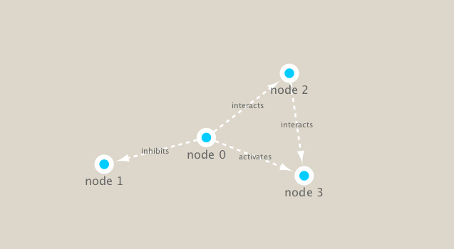

```{r setup, include=FALSE}
knitr::opts_chunk$set(echo = TRUE)
```

##Setup
First setup the packages we need. These include: **igraph** from CRAN and **RCy3** from bioconducotr.

I installted these with **install.packages()** and **BiocManager::install()**
```{r}
library(RCy3)
```

```{r}
library(igraph)
```

Let's check we can talk to cytoscape from R. Note that cytoscape must be runing at this point.

```{r}
cytoscapePing()
```

```{r}
g <- makeSimpleIgraph()
createNetworkFromIgraph(g,"myGraph")
```
Setting image style in Cyt
```{r}
setVisualStyle("Marquee")
```

```{r}
fig <- exportImage(filename="demo", type="png", height=350)


```

We can also plot this simple network in R itself!
```{r}
#recall: g <- makeSimpleIgraph()
plot(g)
```

#Dealing with metagenomics data

##Background
Our data today comes from the TARA ocean study.


Reading it in:
```{r}
## scripts for processing located in "inst/data-raw/"
prok_vir_cor <- read.delim("virus_prok_cor_abundant.tsv", stringsAsFactors = FALSE)

## Have a peak at the first 6 rows
head(prok_vir_cor)
```

How many connections i.e. edges will we have in our network - lets look at the number of rows:
```{r}
nrow(prok_vir_cor)
```


```{r}
n <- graph.data.frame(prok_vir_cor, directed = FALSE)
print(n)
```

In this case the first line of output (“UNW- 854 1544 –”) tells that our network graph has 845 vertices (i.e. nodes, which represent our bacteria and viruses) and 1544 edges (i.e. linking lines, which indicate their co-occurrence). Note that the first four characters (i.e. the “UNW-” part) tell us about the network setup. In this case our network is Undirected, Named (i.e. has the ‘name’ node/vertex attribute set) and Weighted (i.e. the ‘weight’ edge attribute is set).

 plot attempt:
```{r}
plot(n, vertex.size =3, vertex.label=NA)
```

send this to Cytoscape
```{r}
createNetworkFromIgraph(n, "TARA_data")
```

Making it more meaningful with betweeness:
```{r}
cb <- cluster_edge_betweenness(n)
```
```{r}
plot(cb, y=n, vertex.label=NA,  vertex.size=3)
```

centrality analysis:
```{r}
pr <- page_rank(n)
head(pr$vector)
```

Lets plot our network with nodes size scaled via this page rank centrality scores.
